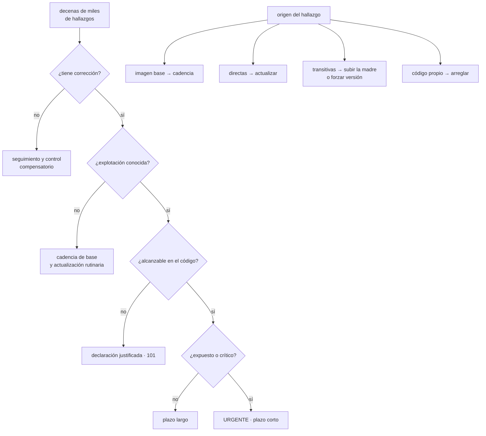

# 138 — Vulnerabilidades, imágenes y cadena de suministro

> [← 137 · Gestión de secretos y credenciales de workloads](../../part-11-security-governance-finops/137-gestion-de-secretos-y-credenciales-de-workloads/README.md) · [Índice de la parte](../README.md) · [139 · CSPM, postura, policy as code y remediación →](../../part-11-security-governance-finops/139-cspm-postura-policy-as-code-y-remediacion/README.md)

**Parte:** 11 — Seguridad, gobierno, cumplimiento y FinOps<br>
**Nivel:** avanzado · **Horas estimadas:** 4<br>
**Laboratorio:** `supply-chain` · **Estado:** `EXECUTABLE_CORE`

## 🎯 Propósito

Gobernar las vulnerabilidades de lo que se ejecuta, con la escala real del problema delante: una organización mediana tiene decenas de miles de hallazgos y capacidad para corregir unos cientos al trimestre. Por eso la clase no trata de escanear —eso ya lo montó la 101— sino de **priorizar con criterios que reduzcan de verdad**, de corregir por familias en vez de una a una, y de la parte que ni la 067 ni la 101 cubrieron: **los ataques que llegan por la propia dependencia**, empezando por el más barato de ejecutar y el más fácil de prevenir.

## 📚 Resultados de aprendizaje

Al finalizar podrás:

1. **Priorizar** por explotabilidad y exposición, no por gravedad nominal.
2. **Corregir** por familias: base, directas, transitivas y código propio.
3. **Prevenir** la sustitución de dependencias por paquetes ajenos.
4. **Fijar** plazos y excepciones que se puedan cumplir.
5. **Medir** el programa por antigüedad de lo pendiente, no por número de hallazgos.

## 🧩 Conceptos centrales

| Concepto | Comprensión verificable |
|---|---|
| `explotabilidad conocida` | Que exista explotación real observada. Es el filtro que más reduce y el que mejor se correlaciona con el riesgo. |
| `exposición` | Si el componente vulnerable es alcanzable desde fuera o solo desde dentro. Cambia la prioridad más que la gravedad nominal. |
| `dependencia transitiva` | La que llega a través de otra. Es la mayoría del recuento y no se puede actualizar directamente. |
| `confusión de dependencias` | Ataque en el que un paquete público con el nombre de uno interno se instala en lugar del legítimo. |
| `cadencia de base` | Reconstruir con imagen base actualizada de forma periódica. Elimina en bloque la mayoría de los hallazgos sin analizarlos. |
| `antigüedad de lo pendiente` | Tiempo que lleva sin corregir el hallazgo más viejo que cumple los criterios de prioridad. Es la medida útil del programa. |

## 🧠 Modelo mental

Gobernar no significa aprobar cada cambio: significa codificar límites, evidencia y responsabilidades para que los equipos puedan avanzar con seguridad.

Aplicado a esta clase, separa siempre cuatro planos: **intención** (qué necesita el usuario),
**configuración** (qué declaramos), **estado observado** (qué existe de verdad) y
**evidencia** (cómo sabemos que cumple). Confundirlos produce diseños que se ven correctos
en un diagrama pero fallan al operar.

## 🗺️ Flujo de razonamiento



## 📖 Desarrollo

### 1. La escala obliga a priorizar

Los números de una organización mediana, para no engañarse:

```text
hallazgos totales en imágenes y dependencias        30.000 - 80.000
capacidad real de corrección al trimestre               200 - 600
```

Con esa proporción, **la pregunta no es cómo corregir más, sino cómo elegir qué**. Y el criterio habitual —la gravedad nominal— es malo:

```text
hallazgos de gravedad crítica                          ~3.000
de ellos, con explotación real observada                  ~40
```

La gravedad describe **el impacto si se explota**, no la probabilidad de que ocurra. Los cuatro filtros que sí reducen, en orden de eficacia:

```text
1. ¿HAY CORRECCIÓN?
   sin versión corregida, no es una tarea: es un seguimiento

2. ¿HAY EXPLOTACIÓN CONOCIDA?
   existen catálogos públicos de vulnerabilidades explotadas de verdad
   → es el filtro que más reduce, con diferencia

3. ¿ES ALCANZABLE?
   el código vulnerable, ¿se ejecuta desde esta aplicación?   clase 101

4. ¿ESTÁ EXPUESTO O ES CRÍTICO?
   accesible desde fuera, o toca datos personales, o es el camino de pago
```

Y el embudo, con números realistas:

```text
todos                       47.000
con corrección              21.000
con explotación conocida       310
alcanzables                    140
expuestos o críticos            61
```

Sesenta y uno es un número con el que se puede trabajar; cuarenta y siete mil no.

Y los dos errores simétricos que evita este embudo:

```text
tratar los 47.000 como pendientes    → parálisis, y el escáner acaba
                                       desactivado (ley 16)
ignorarlos todos porque son muchos   → los 61 tampoco se arreglan
```

Y la medida del programa, que **no es el recuento**:

```text
mal    «tenemos 47.000 hallazgos» → no dice nada y no baja nunca
bien   antigüedad del más viejo que supera el embudo
       → si el más antiguo tiene 9 días, el programa funciona
       → si tiene 7 meses, no
```

Y conviene además vigilar la tendencia del embudo entero, porque **una entrada que crece más deprisa que la salida es un problema que se ve un año antes de doler**.

### 2. Corregir por familias

Los hallazgos vienen de sitios distintos y cada uno se corrige de una forma distinta. Tratarlos igual es lo que hace inabordable el trabajo.

```text
IMAGEN BASE                         suele ser el 70-90 % del recuento
  → no se analizan uno a uno: se RECONSTRUYE con la base al día
  → una cadencia mensual elimina la mayoría sin tomar ninguna decisión

DEPENDENCIAS DIRECTAS               las que tú declaraste
  → actualizar; es trabajo normal y se automatiza con propuestas de cambio

DEPENDENCIAS TRANSITIVAS            la mayoría del recuento de código
  → no se pueden actualizar directamente

EL LENGUAJE O TIEMPO DE EJECUCIÓN
  → actualizaciones mayores, planificadas

CÓDIGO PROPIO                       clase 101
  → puerta en modo diferencial
```

Y la primera línea es la que más rinde: **reconstruir periódicamente es la palanca más grande de todo el programa**, y no requiere priorizar nada.

```text
sin cadencia   los hallazgos se acumulan hasta que alguien reacciona
con cadencia   la base entra al día en cada reconstrucción

efecto medido habitual: entre el 60 % y el 85 % del recuento desaparece
```

Y lo que la hace posible: **imágenes mínimas**. Cuantos menos paquetes contiene una imagen, menos hallazgos tendrá, y esa reducción es permanente:

```text
imagen de distribución completa      ~450 paquetes
imagen mínima                         ~90
imagen sin distribución                ~15
```

**Las transitivas**, que es el caso incómodo. Tres opciones y ninguna es cómoda:

```text
SUBIR LA DEPENDENCIA MADRE
  la correcta; y a veces la madre no ha publicado versión

FORZAR LA VERSIÓN de la transitiva
  funciona en casi todos los gestores modernos
  → y puedes estar poniendo una versión que la madre no ha probado
  → hay que ejecutar las pruebas y anotar por qué se forzó

SUSTITUIR LA DEPENDENCIA MADRE
  caro, y a veces es la respuesta correcta si no se mantiene
```

Y el fichero de versiones fijadas es la fuente de verdad: **lo que se instala es lo que dice ese fichero**, no lo que dice el manifiesto. Si no está fijado con versiones exactas, dos construcciones del mismo código instalan cosas distintas, y eso rompe la inmutabilidad de la clase 099.

Y una decisión de higiene que reduce el trabajo futuro:

```text
cada dependencia nueva se justifica en la revisión
y se revisa: ¿está mantenida? ¿cuántas dependencias arrastra?
→ una dependencia con 140 transitivas es una decisión, no un detalle
```

### 3. Cuando el ataque llega por la dependencia

Las clases 067 y 101 se ocuparon de saber qué contiene un artefacto y de verificar su origen. Falta lo que ocurre **antes**: que lo que se instala no sea lo que se cree.

```text
CONFUSIÓN DE DEPENDENCIAS
  tu organización tiene un paquete interno llamado «tienda-utils»
  alguien publica «tienda-utils» en el repositorio PÚBLICO
  con un número de versión más alto
  → muchos gestores prefieren la versión más alta
  → y en la siguiente construcción se instala el del atacante
```

Es el ataque más barato de ejecutar de esta lista y el más fácil de prevenir:

```text
reservar los nombres internos en los repositorios públicos
configurar el gestor para que los paquetes del ámbito interno
  SOLO se busquen en el repositorio interno
usar un ámbito o prefijo propio para todo lo interno
y prohibir la resolución mixta entre repositorios
```

Y los demás:

```text
NOMBRE PARECIDO           un paquete llamado casi igual que uno popular
  → se previene con lista de permitidos y revisión de dependencias nuevas

CUENTA DE MANTENEDOR COMPROMETIDA
  la versión nueva de un paquete legítimo trae código malicioso
  → se mitiga fijando versiones con huella, y no actualizando
    automáticamente sin ningún retraso

GUIONES DE INSTALACIÓN
  se ejecuta código del paquete durante la instalación,
  con los permisos de quien construye
  → desactivarlos donde el gestor lo permita

COMPROMISO DEL PROPIO SISTEMA DE CONSTRUCCIÓN
  → es la clase 098: identidad del flujo, permisos mínimos y procedencia
```

Y el control que cubre a la vez varios de estos, y que además resuelve problemas de disponibilidad:

```text
REPOSITORIO INTERNO COMO ÚNICO ORIGEN
  las construcciones no descargan de internet: descargan del interno
  el interno replica lo aprobado desde el público
  → permite lista de permitidos, retención y análisis previo
  → y una construcción no falla porque un repositorio público esté caído
```

Y dos prácticas que suenan contradictorias y no lo son:

```text
FIJAR con huella, para que lo que se instala sea siempre lo mismo
ACTUALIZAR con cadencia, para no acumular vulnerabilidades
→ y entre las dos, un RETRASO deliberado de unos días en actualizar
  versiones recién publicadas, que es cuando se detectan los paquetes
  comprometidos
```

### 4. Plazos, excepciones y lo que no tiene arreglo

Los plazos se fijan por el embudo, no por la gravedad nominal:

```text
explotable + alcanzable + expuesto        7 días
explotable + alcanzable                  30 días
explotable, no alcanzable                90 días o declaración justificada
con corrección, sin explotación conocida  cadencia normal de actualización
sin corrección                            seguimiento, sin plazo
```

Y lo que hace que los plazos signifiquen algo, con la disciplina de las clases 046, 091 y 101:

```text
cada incumplimiento produce una excepción, no un silencio
con motivo, responsable y caducidad
y la caducidad rompe la canalización
```

Y una decisión organizativa que decide si el programa funciona: **quién puede aceptar el riesgo**. Un hallazgo que supera el embudo y no se corrige en plazo escala a alguien que puede decidir que se acepta, **con su nombre**.

**Cuando no hay corrección disponible**, que ocurre a menudo:

```text
controles compensatorios
  quitar la exposición: sacar el componente de internet
  bloquear la ruta vulnerable en el filtro de aplicación   clase 135
  restringir permisos de esa carga                         clase 134
  desactivar la funcionalidad afectada                     clase 105
y seguimiento con revisión periódica, hasta que haya versión
```

La primera es la más eficaz y la que menos se considera: **un componente vulnerable que no es alcanzable desde fuera cambia de categoría entera**.

Y lo que hay que vigilar de forma continua:

```text
antigüedad del hallazgo más viejo que supera el embudo
entradas frente a salidas del embudo, por semana
edad media de las imágenes base en producción
proporción de artefactos reconstruidos en los últimos 30 días
dependencias nuevas añadidas, y por quién
excepciones vivas y su caducidad
y lo que la clase 101 exigía: reescaneo de lo DESPLEGADO, no de lo construido
```

Y la lista de comprobación de la clase:

```text
☐ existe un embudo escrito y se aplica antes de asignar trabajo
☐ se usa un catálogo de explotación real, no solo la gravedad
☐ hay cadencia de reconstrucción con base actualizada
☐ las imágenes son mínimas
☐ las versiones están fijadas con huella
☐ hay retraso deliberado antes de adoptar versiones recién publicadas
☐ los nombres internos están reservados en los repositorios públicos
☐ los ámbitos internos solo se resuelven en el repositorio interno
☐ las construcciones descargan del repositorio interno, no de internet
☐ los guiones de instalación están desactivados donde se pueda
☐ los plazos salen del embudo y las excepciones caducan
☐ la medida publicada es la antigüedad de lo pendiente, no el recuento
☐ se reescanea lo desplegado, no solo lo que se construye
```

Y el cierre que enlaza con la clase siguiente: hasta aquí, controles sobre lo que se construye y se despliega. Queda saber si la configuración de lo que ya está en marcha cumple lo que se supone, detectarlo continuamente y corregirlo sin abrir mil tareas, que es la materia de la clase 139.

## 🔬 Ejemplo trabajado

**CloudShop tiene 47.000 hallazgos abiertos y un equipo que puede corregir unos 400 al trimestre. El ejercicio consiste en construir el embudo, corregir por familias y prevenir el ataque que estuvo a punto de ocurrir.**

**El embudo, aplicado.**

```text
hallazgos totales                                        47.180
con versión corregida disponible                         21.340
con explotación real observada                              310
alcanzables desde el código                                 142
expuestos a internet o en el camino de pago                  61
```

Sesenta y uno frente a cuarenta y siete mil. Y el reparto de los sesenta y uno:

```text
en dependencias transitivas                                  38
en dependencias directas                                     14
en el tiempo de ejecución                                     6
en la imagen base                                             3
```

**Corrección por familias, y lo que aportó cada una.**

```text
CADENCIA DE BASE (mensual, automatizada)
  hallazgos antes de la primera reconstrucción         47.180
  después                                              11.900
  reducción                                              75 %
  esfuerzo                                    un flujo programado
```

Setenta y cinco por ciento del recuento eliminado **sin analizar ni un solo hallazgo**.

```text
IMAGEN MÍNIMA
  paquetes en la imagen anterior                          438
  paquetes en la imagen mínima                             94
  hallazgos tras el cambio                              4.200
  reducción adicional                                     65 %
  coste     3 servicios necesitaron herramientas que no estaban;
            se añadieron explícitamente
```

```text
DIRECTAS
  propuestas de actualización automáticas, agrupadas por semana
  actualizadas en 3 meses                                  184
  roturas causadas                                           7
  todas detectadas por las puertas de la clase 100
```

```text
TRANSITIVAS, las 38 del embudo
  resueltas subiendo la dependencia madre                   23
  resueltas forzando la versión                             11
    → con las pruebas ejecutadas y el motivo anotado
  sin versión corregida disponible                           4
    → control compensatorio: 3 se sacaron de internet,
      1 se bloqueó en el filtro de aplicación
```

**El estado del embudo a los tres meses.**

```text                                    inicio        +3 meses
hallazgos totales                        47.180          3.100
con corrección                           21.340          1.410
con explotación conocida                    310             22
alcanzables                                 142             11
expuestos o críticos                         61              2
antigüedad del más viejo del embudo    no se medía        6 días
```

Y la tendencia, que es la que dice si esto se sostiene:

```text
entradas al embudo por semana                             4-9
salidas por semana                                       8-14
→ la salida supera a la entrada
```

**La confusión de dependencias, encontrada por casualidad.**

Al montar el repositorio interno, alguien revisó qué nombres internos existían también en los repositorios públicos:

```text
paquetes internos                                            34
con el mismo nombre publicado en un repositorio público       3
  de ellos, publicados por la propia empresa años atrás        1
  de ellos, publicados por terceros desconocidos               2
```

Y uno de los dos era claramente un intento:

```text
nombre                     igual que el paquete interno de utilidades
versión publicada          99.9.9   ← más alta que cualquier interna
publicado hace             4 meses
descargas registradas      1.180
contenido                  guion de instalación que enviaba variables
                           de entorno a un servidor externo
¿llegó a instalarse aquí?  no, por suerte: el repositorio interno estaba
                           configurado como origen preferente
                           en 11 de 15 servicios
```

**Cuatro servicios estaban a un despliegue de instalarlo.**

```text                                          antes         después
nombres internos reservados en repositorios
públicos                                       0 de 34        34 de 34
ámbito propio para todo lo interno               no             sí
resolución mixta entre repositorios              sí             no
construcciones que descargan de internet       15 de 15       0 de 15
guiones de instalación                        permitidos    desactivados
                                                            (2 excepciones
                                                             con motivo)
```

Y los 1.180 descargas registradas por el paquete falso indican que **otras organizaciones sí lo instalaron**.

**El retraso deliberado, y la vez que sirvió.**

```text
política adoptada    no adoptar versiones con menos de 5 días publicadas,
                     salvo correcciones de seguridad urgentes

mes 5   un paquete popular publica una versión con código malicioso
        introducido por una cuenta de mantenedor comprometida
        retirado por el repositorio a las 31 horas
        CloudShop no la había adoptado: faltaban 3 días de la ventana
```

**Los plazos y las excepciones.**

```text                                          antes         después
plazos definidos                                no        4 niveles
excepciones vivas                          no se sabía         9
con motivo, responsable y caducidad              —          9 de 9
caducadas y renovadas                            —             2
aceptaciones de riesgo firmadas                  0             3
```

Las tres aceptaciones firmadas son componentes sin versión corregida en un sistema heredado, con controles compensatorios y revisión trimestral.

**El reescaneo de lo desplegado, de la clase 101.**

```text
primera ejecución tras el nuevo embudo
  huellas en producción                                        18
  hallazgos que superaban el embudo                             2
  ambos publicados después de la última construcción
  → ninguna canalización los habría detectado
```

**A los seis meses.**

```text                                          antes         después
hallazgos totales                            47.180          2.400
que superan el embudo                            61              1
antigüedad del más viejo del embudo       no se medía        4 días
paquetes por imagen                             438             94
cadencia de reconstrucción                   ninguna        mensual
artefactos reconstruidos en 30 días            12 %           100 %
nombres internos reservados                  0 de 34        34 de 34
construcciones que descargan de internet     15 de 15         0 de 15
versiones fijadas con huella                  3 de 15        15 de 15
intentos de confusión de dependencias
detectados                                       —              2
excepciones con caducidad                        0              9
```

**La lección que esta clase traslada a la parte 11**: el 75 % de los cuarenta y siete mil hallazgos desapareció **con un flujo programado que reconstruye las imágenes cada mes**, sin que nadie priorizara nada; y otro 65 % del resto, con una imagen que contiene ochenta y cuatro paquetes menos. Priorizar hacía falta para sesenta y uno, no para cuarenta y siete mil. Y el riesgo más serio del semestre no fue ninguna vulnerabilidad de la lista: fue **un paquete con el nombre de uno interno, versión 99.9.9, esperando en un repositorio público a que cuatro servicios se construyeran**.

## 🧪 Laboratorio guiado

Ejecuta desde la raíz:

```bash
python classes/part-11-security-governance-finops/138-vulnerabilidades-imagenes-y-cadena-de-suministro/lab.py
```

El laboratorio selecciona el motor de práctica **`supply-chain`** y produce
`lab_result.json`. El escenario, sus comprobaciones y el artefacto esperado corresponden a
esta clase; no requiere credenciales y deja explícito qué debe revalidarse en un sandbox real.

1. Lee `exercise.steps` y formula una predicción antes de ejecutar.
2. Ejecuta la práctica y verifica todos los elementos de `checks`.
3. Provoca el caso de `negative_test` y explica la señal observada.
4. Materializa `informe-supply-chain` en `evidence/` usando la plantilla indicada.
5. Para proveedor real, sigue `sandbox.requires`, registra costo y ejecuta `destroy`.

### Evidencia esperada

El artefacto principal es procedencia, inventario y verificación del artefacto. Además, la entrega debe incluir el comando ejecutado,
la salida estructurada y una conclusión que no exceda lo observado.

## 🏆 Reto verificable

Construye **`informe-supply-chain`** para el caso CloudShop. Incluye una alternativa descartada,
un supuesto que pueda falsarse, una prueba de fallo y una decisión de rollback.

## ✅ Criterio de aceptación

- [ ] `lab.py` termina con código 0 y genera JSON válido.
- [ ] La entrega conecta al menos tres requisitos con mecanismos verificables.
- [ ] Existe una prueba positiva y una prueba negativa con evidencia.
- [ ] Seguridad, costo y operación aparecen como decisiones, no como anexos.
- [ ] Se declara una limitación y una condición que obligaría a revisar el diseño.
- [ ] Otra persona puede repetir el recorrido sin conocimiento tácito.

## ⚠️ Errores frecuentes

| Síntoma | Causa probable | Corrección |
|---|---|---|
| Hay decenas de miles de hallazgos y no se corrige ninguno | Se prioriza por gravedad nominal, que no distingue lo explotable de lo que no | Aplica el embudo: con corrección, con explotación conocida, alcanzable, expuesto o crítico. |
| El recuento no baja aunque se trabaje mucho | Se corrigen hallazgos uno a uno cuando la mayoría vienen de la imagen base | Reconstruye con cadencia y usa imágenes mínimas; eso elimina la mayor parte sin analizar nada. |
| Dos construcciones del mismo código instalan versiones distintas | No hay fichero de versiones fijadas con huella | Fija versiones exactas con huella y trata ese fichero como la fuente de verdad. |
| Un paquete público con el nombre de uno interno acaba instalado | Resolución mixta entre repositorios y preferencia por la versión más alta | Reserva los nombres internos, usa un ámbito propio, resuelve lo interno solo en el repositorio interno y construye desde él. |
| Una versión recién publicada de una dependencia introduce código malicioso | Se actualiza automáticamente sin ninguna ventana | Retraso deliberado de unos días antes de adoptar versiones nuevas, salvo correcciones urgentes de seguridad. |
| Se publica el número de hallazgos como medida y nadie sabe si mejora | El recuento no distingue lo urgente de lo irrelevante | Publica la antigüedad del hallazgo más viejo que supera el embudo y la relación entre entradas y salidas. |

## 🛡️ Seguridad, ética y costo

Trabaja con cuentas propias o sandboxes autorizados. No publiques secretos, identificadores
reales ni datos personales. Antes de crear recursos pagos define presupuesto, etiquetas y
comando de destrucción; después verifica que no queden recursos huérfanos. Los ejemplos
locales enseñan contratos, pero no certifican cumplimiento ni disponibilidad de producción.

## ❓ Preguntas de comprobación

1. ¿Qué cuatro filtros componen el embudo y cuál reduce más?
2. ¿Por qué la cadencia de reconstrucción es la palanca mayor del programa?
3. ¿Qué tres opciones hay ante una vulnerabilidad en una dependencia transitiva?
4. ¿Cómo funciona la confusión de dependencias y cómo se previene?
5. ¿Por qué la medida útil es la antigüedad de lo pendiente y no el recuento?

## 🔗 Referencias

- CISA (2025). *Known Exploited Vulnerabilities catalog* — priorizar por explotación real observada. <https://www.cisa.gov/known-exploited-vulnerabilities-catalog>
- FIRST (2025). *EPSS: exploit prediction scoring system* — probabilidad de explotación frente a gravedad. <https://www.first.org/epss/>
- Birsan, A. (2021). *Dependency confusion* — descripción del ataque y su prevención. <https://medium.com/@alex.birsan/dependency-confusion-4a5d60fec610>
- OpenSSF (2025). *Supply chain best practices: pinning, allow-listing and internal mirrors* — controles sobre lo que se instala. <https://best.openssf.org/>
- Google (2025). *Distroless container images* — imágenes mínimas y su efecto en el recuento de hallazgos. <https://github.com/GoogleContainerTools/distroless>
- Documentación oficial vigente del servicio implementado; registra URL y fecha de consulta.

---

> [Evaluación](assessment.md) · [Contrato de clase](lesson.yaml) · [Índice de la parte](../README.md)

| Anterior | Índice | Siguiente |
|---|---|---|
| [← 137 · Gestión de secretos y credenciales de workloads](../../part-11-security-governance-finops/137-gestion-de-secretos-y-credenciales-de-workloads/README.md) | [Parte 11](../README.md) · [Programa](../../README.md) | [139 · CSPM, postura, policy as code y remediación →](../../part-11-security-governance-finops/139-cspm-postura-policy-as-code-y-remediacion/README.md) |
