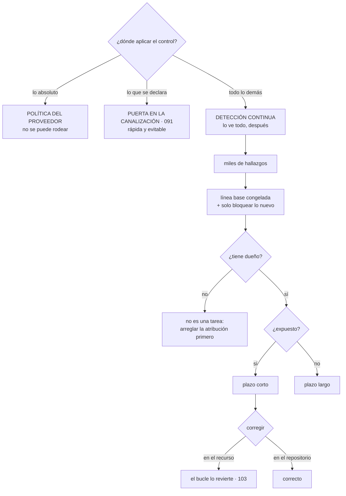

# 139 — CSPM, postura, policy as code y remediación

> [← 138 · Vulnerabilidades, imágenes y cadena de suministro](../../part-11-security-governance-finops/138-vulnerabilidades-imagenes-y-cadena-de-suministro/README.md) · [Índice de la parte](../README.md) · [140 · Threat modeling con STRIDE y attack paths →](../../part-11-security-governance-finops/140-threat-modeling-con-stride-y-attack-paths/README.md)

**Parte:** 11 — Seguridad, gobierno, cumplimiento y FinOps<br>
**Nivel:** avanzado · **Horas estimadas:** 4<br>
**Laboratorio:** `governance` · **Estado:** `EXECUTABLE_CORE`

## 🎯 Propósito

Comprobar que la configuración de lo que **ya está en marcha** cumple lo que se supone, que no es lo mismo que comprobar lo que se iba a crear. La clase sitúa los tres momentos en que se puede aplicar un control y sostiene que el más fuerte es el que no se puede rodear; afronta el problema que aparece siempre al encender esta clase de herramientas —miles de hallazgos y ningún dueño—; y trata la corrección automática con la desconfianza que merece, porque **es un cambio en producción que nadie revisó**.

## 📚 Resultados de aprendizaje

Al finalizar podrás:

1. **Elegir** el momento de aplicar cada control: proveedor, canalización o detección.
2. **Reducir** el ruido inicial con línea base y criterios de exposición.
3. **Atribuir** cada hallazgo a un dueño, sin lo cual no es una tarea.
4. **Escribir** reglas como código, con prueba negativa.
5. **Corregir** en el origen y no en el recurso, y acotar la corrección automática.

## 🧩 Conceptos centrales

| Concepto | Comprensión verificable |
|---|---|
| `postura` | Estado real de configuración de todo lo desplegado, medido de forma continua contra un conjunto de reglas. |
| `control preventivo del proveedor` | Política de organización que impide la acción, aunque se intente a mano y con permisos. Es el único que no se rodea. |
| `línea base` | Conjunto de hallazgos existentes que se congela para poder bloquear solo lo nuevo. Es lo que hace adoptable la herramienta. |
| `atribución` | Saber de quién es cada recurso. Sin ella un hallazgo no se puede asignar y se acumula. |
| `corrección en el origen` | Arreglar la declaración en el repositorio, no el recurso. Si se toca el recurso, el bucle lo revierte. |
| `corrección automática` | Cambio aplicado sin intervención humana. Necesita las mismas garantías que cualquier despliegue, y contador. |

## 🧠 Modelo mental

Gobernar no significa aprobar cada cambio: significa codificar límites, evidencia y responsabilidades para que los equipos puedan avanzar con seguridad.

Aplicado a esta clase, separa siempre cuatro planos: **intención** (qué necesita el usuario),
**configuración** (qué declaramos), **estado observado** (qué existe de verdad) y
**evidencia** (cómo sabemos que cumple). Confundirlos produce diseños que se ven correctos
en un diagrama pero fallan al operar.

## 🗺️ Flujo de razonamiento



## 📖 Desarrollo

### 1. Tres momentos, y cuál gana

Un mismo control se puede aplicar en tres sitios, y no son equivalentes:

```text
1. POLÍTICA DEL PROVEEDOR
   la acción no se puede ejecutar, ni a mano, ni con permisos de administrador
   + es el único control que NO se puede rodear
   − rígido: si es demasiado amplio, bloquea trabajo legítimo
   ejemplos  «ninguna cuenta puede desactivar el registro de auditoría»
             «ningún almacén puede hacerse público»
             «ninguna región fuera de las autorizadas»

2. PUERTA EN LA CANALIZACIÓN                              clase 091
   se analiza lo que se va a crear y se bloquea antes de aplicar
   + rápido, con buen mensaje de error, y educa
   − solo ve lo que pasa por ahí

3. DETECCIÓN CONTINUA SOBRE LO DESPLEGADO   ← esta clase
   se observa el estado real
   + lo ve ABSOLUTAMENTE todo: lo creado a mano, lo que cambió el proveedor,
     lo que existe desde antes
   − llega después de que ocurra
```

Y la regla que ordena la elección:

```text
lo que NUNCA debe ocurrir           → política del proveedor
lo que casi nunca debe ocurrir      → puerta en la canalización
todo lo demás, y para comprobar
que los dos anteriores funcionan    → detección continua
```

Y la última mitad de esa tercera línea es la más olvidada: **la detección es también la comprobación de que los controles preventivos existen y siguen activos**.

Y el motivo por el que la detección hace falta aunque todo se despliegue con infraestructura declarada:

```text
recursos creados a mano en una urgencia y nunca declarados
recursos creados por servicios que crean otros recursos
  → un clúster que crea discos, un servicio que crea reglas de red
cambios en los valores por defecto del proveedor
recursos heredados de antes de la infraestructura declarada
recursos de cuentas que nadie sabía que existían
```

La última es más frecuente de lo que parece, y explica por qué la primera medida de esta clase es **la cobertura**:

```text
¿cuántas cuentas o proyectos hay?
¿cuántos están siendo analizados?
→ si la respuesta no es «todos», el resto de las cifras no significan nada
```

### 2. Miles de hallazgos y ningún dueño

Al activar la detección aparecen entre cientos y decenas de miles de hallazgos. Y la historia que sigue ya la conoce este programa: **ley 15, y a los ocho meses nadie mira el panel**.

La medicina es la misma de la clase 101, con una diferencia importante:

```text
1. LÍNEA BASE congelada, con su cifra publicada
2. bloquear o alertar SOLO por lo nuevo
3. objetivo de reducción de la base, con dueño y trimestre
4. priorizar por EXPOSICIÓN, no por gravedad nominal
```

Y el criterio de exposición, que es el que de verdad ordena:

```text
accesible desde internet                          máxima prioridad
contiene o toca datos personales
permite obtener credenciales o escalar permisos   ← clase 133
afecta al registro de auditoría o a las copias
todo lo demás
```

Y la diferencia con la clase 101 es la que decide si el programa avanza: **aquí el hallazgo está sobre un recurso, y hay que saber de quién es**.

```text
un hallazgo sin dueño no es una tarea: es una queja
```

Y la atribución se resuelve con lo que este programa ya tiene:

```text
etiquetas obligatorias en la creación: servicio, equipo, entorno
  → impuestas por política del proveedor, no por buena voluntad
catálogo de servicios con su equipo dueño          clase 095
y para lo que no tenga etiqueta: mirar quién lo creó en el
  registro de auditoría
```

Y el orden importa: **antes de repartir hallazgos, hay que poder repartirlos**. Un programa que empieza asignando trabajo sin atribución fiable acaba con todo en la cola de un equipo de plataforma.

Y lo que hay que medir sobre la propia atribución:

```text
recursos sin etiqueta de dueño
recursos cuyo equipo no existe en el catálogo
recursos que no aparecen en ninguna declaración de infraestructura
```

La tercera merece su propia campaña: **lo que no está declarado no se puede corregir en el origen**, que es el apartado cuarto.

### 3. Reglas como código

Las reglas del catálogo por defecto sirven para empezar y no bastan: **las que más valen son las propias de la organización**.

```text
del catálogo   cifrado activo, almacenes no públicos, registro habilitado,
               versiones de protocolo, puertos administrativos abiertos
propias        «todo recurso tiene etiqueta de equipo y de entorno»
               «ninguna base de producción admite conexiones desde dev»
               «las copias de seguridad tienen retención mínima de 30 días»
               «ningún almacén con datos personales fuera de estas regiones»
```

Y las reglas se tratan como código, con lo que eso implica:

```text
viven en un repositorio, con revisión
se despliegan por la canalización
se versionan, y un cambio de regla es un cambio
y cada una tiene PRUEBA NEGATIVA
```

La última es la que separa una regla de un deseo:

```text
una prueba que crea a propósito un recurso que la incumple
y comprueba que la regla lo detecta
→ sin eso, no se sabe si la regla funciona o si está mal escrita
→ y una regla que no detecta nada parece que todo va bien: ley 13
```

Y una comprobación periódica sobre el conjunto:

```text
reglas que no han producido ningún hallazgo en 6 meses
  → ¿es que se cumple siempre, o es que la regla está rota?
  → se resuelve con la prueba negativa, no suponiendo
```

Y la excepción, con la disciplina de siempre:

```text
en el código de la regla o junto al recurso
con motivo, responsable y caducidad
y la caducidad reabre el hallazgo
```

Y un detalle práctico que evita discusiones: **la excepción se declara donde se declara el recurso**, no en la consola de la herramienta. Así viaja con el código y se revisa con él.

### 4. Corregir sin romper

**Dónde se corrige** es la decisión que más problemas evita:

```text
mal   modificar el recurso directamente
      → si está gobernado por un bucle de reconciliación, se revierte
      → y queda una pelea entre dos automatismos              clase 103

bien  corregir la declaración en el repositorio
      → un cambio propuesto automático, con el arreglo hecho
      → revisado y aplicado por el camino normal
```

Y para lo que **no está declarado**, hay que decidir entre dos cosas y ninguna es «tocarlo y ya»:

```text
importarlo a la infraestructura declarada y corregirlo ahí
o eliminarlo, si no debería existir
```

**La corrección automática** es tentadora y hay que tratarla como lo que es: **un cambio en producción que nadie revisó**.

```text
seguro de automatizar
  añadir una etiqueta que falta
  cerrar el acceso público de un almacén recién creado
  desactivar una credencial no usada en 180 días
  borrar reglas de red que no permiten nada

NO automatizar
  cambios que puedan cortar tráfico legítimo
  modificar permisos de una identidad en uso
  borrar recursos con estado
  nada cuyo efecto no se pueda probar antes
```

Y las garantías que necesita, que son las de la parte 08 y la ley 19:

```text
primero en modo simulación: qué habría cambiado
después en entornos inferiores
escalonado, no en todas las cuentas a la vez
contador y límite: si actúa más de N veces, se detiene y avisa
registro de cada actuación, con quién, qué y por qué
y forma de deshacerlo
```

Y el contador es imprescindible por el motivo de la clase 132: **una corrección automática que actúa doscientas veces al día está tapando que algo genera esos recursos mal configurados una y otra vez**.

Y lo que hay que vigilar en el programa completo:

```text
cobertura: cuentas analizadas frente a cuentas existentes
hallazgos nuevos por semana, y su tendencia
antigüedad del más viejo entre los expuestos
recursos sin dueño
recursos fuera de la infraestructura declarada
excepciones vivas y caducadas
actuaciones de corrección automática, por regla
reglas sin hallazgos en 6 meses
```

Y la lista de comprobación de la clase:

```text
☐ lo que nunca debe ocurrir está en política del proveedor, no en un aviso
☐ la detección cubre todas las cuentas y proyectos, y se comprueba
☐ hay línea base congelada con cifra publicada y objetivo de reducción
☐ la prioridad se decide por exposición, no por gravedad nominal
☐ las etiquetas de dueño son obligatorias en la creación
☐ todo hallazgo se asigna a un equipo del catálogo
☐ las reglas viven como código, con revisión y prueba negativa
☐ las excepciones se declaran junto al recurso y caducan
☐ la corrección se hace en el repositorio, no en el recurso
☐ lo no declarado se importa o se elimina
☐ la corrección automática se limita a lo que no puede cortar tráfico
☐ toda corrección automática tiene contador, límite y registro
☐ se mide la cobertura y la antigüedad de lo expuesto
```

Y el cierre que enlaza con la clase siguiente: todo lo anterior comprueba reglas conocidas. Lo que no cubre es preguntarse **qué intentaría alguien contra este sistema en concreto**, que es un trabajo distinto y no automatizable, y es la materia de la clase 140.

## 🔬 Ejemplo trabajado

**CloudShop activa detección continua de configuración sobre sus cuentas. Lo primero que descubre no es un problema de seguridad: es que no sabe cuántas cuentas tiene.**

**La cobertura, antes que nada.**

```text
cuentas y proyectos en el inventario documentado                14
cuentas encontradas en la facturación consolidada               23
diferencia                                                       9
  de ellas, creadas para pruebas y nunca cerradas                6
  de ellas, de un equipo que se disolvió                         2
  de ellas, sin ningún dueño identificable                       1
```

Nueve cuentas fuera de todo control. La que no tenía dueño identificable contenía:

```text
un almacén de objetos con 41 GB, accesible públicamente
contenido    volcados de una base de datos de 2023, con datos de clientes
tiempo expuesto                                              19 meses
accesos externos registrados                       no se sabe: sin registro
```

**Diecinueve meses.** Y ninguna herramienta lo habría visto, porque la cuenta no estaba en el alcance de nada.

```text                                          antes         después
cuentas conocidas                               14              23
cuentas analizadas                               0              23
cuentas cerradas por no tener uso                —               6
cuentas con dueño asignado                      14              23
```

**Los 12.400 hallazgos.**

```text
hallazgos en la primera ejecución completa                  12.410
por gravedad nominal
  crítica                                                    1.180
  alta                                                       3.940
  media y baja                                               7.290
```

Y el embudo por exposición, que es el que se usó:

```text
accesibles desde internet                                       44
que tocan datos personales                                      61
que permiten obtener credenciales o escalar permisos            18
que afectan al registro de auditoría o a las copias              9
                                                          ───────
prioridad inmediata (con solapamiento)                         103
```

Ciento tres frente a doce mil cuatrocientos. Y el resto pasó a línea base congelada:

```text
línea base                                                  12.307
objetivo de reducción                          800 por trimestre
cifra publicada                                              sí
regla                                        ningún hallazgo NUEVO
```

**La atribución, que bloqueó todo durante tres semanas.**

```text
hallazgos que se pudieron asignar a un equipo                 41 %
recursos sin etiqueta de dueño                              4.180
recursos con etiqueta de un equipo inexistente                610
recursos que no aparecían en ninguna declaración             1.940
```

Y el orden que se siguió fue el del apartado segundo: **primero poder repartir, después repartir**.

```text
semana 1   política del proveedor: no se puede crear un recurso
           sin etiquetas de equipo y entorno
           → resuelve el futuro, no el pasado
semana 2   campaña de etiquetado por cuenta, usando el registro
           de auditoría para saber quién creó cada cosa
semana 3   recursos sin dueño tras la campaña: 118
           → se dieron 30 días; lo que siguiera sin dueño se apagaría
           → al vencer, 11 recursos apagados; 2 reclamaciones,
             ambas resueltas en el día
```

```text                                          antes         después
hallazgos asignables                           41 %            98 %
recursos sin etiqueta de dueño                4.180            118 → 0
recursos fuera de la infraestructura declarada 1.940            310
```

Los 310 restantes son recursos creados por otros servicios —discos de un clúster, reglas de red de un balanceador— y se documentaron como tales.

**Las reglas propias, y la que estaba rota.**

```text
reglas del catálogo por defecto                                241
reglas propias escritas                                         18
reglas con prueba negativa                                  259 de 259
```

Y al escribir las pruebas negativas apareció lo esperable:

```text
reglas que no detectaban lo que decían detectar                  7
  de ellas, del catálogo por defecto                             4
  de ellas, propias                                              3
una de ellas    «ninguna base de producción admite conexiones desde dev»
                no comprobaba las reglas heredadas del grupo padre
                → llevaba 4 meses dando cero hallazgos
                → y había 2 bases que la incumplían
```

Es la ley 13 en su forma de regla rota: **cero hallazgos parecía cumplimiento perfecto**.

**La corrección automática, y el incidente.**

La primera regla automatizada fue «cerrar el acceso público de cualquier almacén de objetos». Parecía obviamente segura.

```text
14:20  se activa en las 23 cuentas a la vez
14:21  se cierran 61 almacenes
14:26  el sitio web público deja de mostrar imágenes de producto
causa  4 de los 61 servían contenido estático público a propósito
14:44  revertido a mano
duración                                                     24 min
```

Y el diagnóstico es el del apartado cuarto: **se aplicó a todas las cuentas a la vez, sin simulación previa y sin excepción declarada**.

```text                                          antes         después
modo simulación previo                          no             sí, 7 días
alcance inicial                            23 cuentas      1 cuenta de dev
escalonado                                      no          dev → pre → pro
excepciones declaradas junto al recurso         no          4, con motivo
contador y límite                               no       20 actuaciones/día
registro de actuaciones                         no             sí
incidentes por corrección automática             1              0
```

Y el contador reveló algo a las dos semanas:

```text
actuaciones de la regla «falta etiqueta de equipo»            188/día
causa    un servicio creaba recursos temporales sin etiquetas
         y la corrección los etiquetaba uno a uno
→ la corrección automática estaba TAPANDO un defecto
→ ley 19: se corrigió el servicio, y las actuaciones bajaron a 0-2/día
```

**La corrección en el origen frente al recurso.**

```text
primeros 30 hallazgos corregidos tocando el recurso
  revertidos por el bucle de reconciliación en menos de 5 min      22
  supervivientes (recursos no gobernados por el bucle)              8
```

Veintidós de treinta correcciones **duraron menos de cinco minutos**. Se cambió el mecanismo:

```text                                    tocar el recurso   cambio propuesto
                                                             al repositorio
correcciones que sobreviven                 8 de 30            30 de 30
tiempo medio hasta aplicar                   5 min              4 h
queda registro de por qué                     no                 sí
pelea entre automatismos                      sí                 no
```

Cuatro horas en lugar de cinco minutos, y **las correcciones se quedan**.

**A los seis meses.**

```text                                          antes         después
cuentas analizadas                            0 de 23        23 de 23
almacenes públicos con datos                      1              0
hallazgos totales                            12.410          6.900
hallazgos de prioridad inmediata                103              4
antigüedad del más viejo entre los expuestos  19 meses        5 días
hallazgos asignables a un equipo               41 %            98 %
recursos sin dueño                            4.180              0
reglas con prueba negativa                    0 de 241      259 de 259
reglas rotas encontradas                          —              7
correcciones automáticas con contador             0        11 de 11
incidentes por corrección automática              1              0
correcciones que sobreviven al bucle          8 de 30        30 de 30
```

**La lección que esta clase traslada a la parte 11**: el hallazgo más grave —un almacén público con volcados de clientes durante diecinueve meses— **estaba en una cuenta que no aparecía en ningún inventario**, así que ninguna herramienta lo habría encontrado por muy bien configurada que estuviera. Y lo que bloqueó el programa durante tres semanas no fue la seguridad: fue **no saber de quién era cada recurso**, que es exactamente lo que la hipótesis de la clase 132 predijo como problema central de esta parte.

## 🧪 Laboratorio guiado

Ejecuta desde la raíz:

```bash
python classes/part-11-security-governance-finops/139-cspm-postura-policy-as-code-y-remediacion/lab.py
```

El laboratorio selecciona el motor de práctica **`governance`** y produce
`lab_result.json`. El escenario, sus comprobaciones y el artefacto esperado corresponden a
esta clase; no requiere credenciales y deja explícito qué debe revalidarse en un sandbox real.

1. Lee `exercise.steps` y formula una predicción antes de ejecutar.
2. Ejecuta la práctica y verifica todos los elementos de `checks`.
3. Provoca el caso de `negative_test` y explica la señal observada.
4. Materializa `guardrail-policy` en `evidence/` usando la plantilla indicada.
5. Para proveedor real, sigue `sandbox.requires`, registra costo y ejecuta `destroy`.

### Evidencia esperada

El artefacto principal es una jerarquía de política, ownership y evidencia. Además, la entrega debe incluir el comando ejecutado,
la salida estructurada y una conclusión que no exceda lo observado.

## 🏆 Reto verificable

Construye **`guardrail-policy`** para el caso CloudShop. Incluye una alternativa descartada,
un supuesto que pueda falsarse, una prueba de fallo y una decisión de rollback.

## ✅ Criterio de aceptación

- [ ] `lab.py` termina con código 0 y genera JSON válido.
- [ ] La entrega conecta al menos tres requisitos con mecanismos verificables.
- [ ] Existe una prueba positiva y una prueba negativa con evidencia.
- [ ] Seguridad, costo y operación aparecen como decisiones, no como anexos.
- [ ] Se declara una limitación y una condición que obligaría a revisar el diseño.
- [ ] Otra persona puede repetir el recorrido sin conocimiento tácito.

## ⚠️ Errores frecuentes

| Síntoma | Causa probable | Corrección |
|---|---|---|
| La herramienta dice que todo está bien y hay recursos expuestos | La cobertura no incluye todas las cuentas y proyectos | Contrasta el inventario con la facturación consolidada y analiza todo lo que exista, no solo lo documentado. |
| Miles de hallazgos y ninguno se corrige | Ley 15, y además no se sabe a quién asignarlos | Congela la línea base, bloquea solo lo nuevo, prioriza por exposición y resuelve la atribución antes de repartir trabajo. |
| Una regla lleva meses sin producir hallazgos y parece cumplimiento | La regla está mal escrita y no detecta lo que dice detectar | Prueba negativa para cada regla: crea a propósito un recurso que la incumpla y comprueba que salta. |
| Las correcciones desaparecen a los pocos minutos | Se modificó el recurso y el bucle de reconciliación lo revirtió | Corrige la declaración en el repositorio con un cambio propuesto; si el recurso no está declarado, impórtalo o elimínalo. |
| Una corrección automática provoca una caída | Se aplicó a todo a la vez, sin simulación, sin escalonar y sin excepciones | Simula primero, escalona por entorno, declara excepciones junto al recurso y limita a lo que no puede cortar tráfico. |
| Una corrección automática actúa cientos de veces al día | Ley 19: está tapando un defecto que genera recursos mal configurados | Contador y límite en toda corrección automática; investiga la causa cuando la cifra sube. |

## 🛡️ Seguridad, ética y costo

Trabaja con cuentas propias o sandboxes autorizados. No publiques secretos, identificadores
reales ni datos personales. Antes de crear recursos pagos define presupuesto, etiquetas y
comando de destrucción; después verifica que no queden recursos huérfanos. Los ejemplos
locales enseñan contratos, pero no certifican cumplimiento ni disponibilidad de producción.

## ❓ Preguntas de comprobación

1. ¿Cuáles son los tres momentos de aplicar un control y qué criterio decide entre ellos?
2. ¿Por qué la detección continua hace falta aunque todo se despliegue declarado?
3. ¿Por qué un hallazgo sin dueño no es una tarea, y cómo se resuelve la atribución?
4. ¿Qué separa una regla de un deseo?
5. ¿Por qué la corrección debe hacerse en el repositorio y no en el recurso?

## 🔗 Referencias

- AWS (2025). *Service control policies and organization-level guardrails* — controles preventivos que no se rodean. <https://docs.aws.amazon.com/organizations/latest/userguide/orgs_manage_policies_scps.html>
- Google Cloud (2025). *Organization policy constraints* — restricciones aplicadas a toda la jerarquía. <https://cloud.google.com/resource-manager/docs/organization-policy/overview>
- Azure (2025). *Azure Policy: effects, exemptions and remediation tasks* — detección, excepciones y corrección. <https://learn.microsoft.com/azure/governance/policy/concepts/effects>
- Open Policy Agent (2025). *Policy testing* — pruebas de reglas como código. <https://www.openpolicyagent.org/docs/latest/policy-testing/>
- CIS (2025). *Benchmarks for cloud providers* — catálogos de reglas de configuración por defecto. <https://www.cisecurity.org/cis-benchmarks>
- Documentación oficial vigente del servicio implementado; registra URL y fecha de consulta.

---

> [Evaluación](assessment.md) · [Contrato de clase](lesson.yaml) · [Índice de la parte](../README.md)

| Anterior | Índice | Siguiente |
|---|---|---|
| [← 138 · Vulnerabilidades, imágenes y cadena de suministro](../../part-11-security-governance-finops/138-vulnerabilidades-imagenes-y-cadena-de-suministro/README.md) | [Parte 11](../README.md) · [Programa](../../README.md) | [140 · Threat modeling con STRIDE y attack paths →](../../part-11-security-governance-finops/140-threat-modeling-con-stride-y-attack-paths/README.md) |
