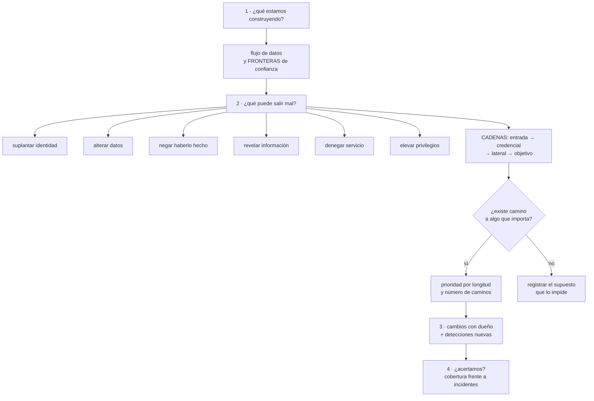

# 140 — Threat modeling con STRIDE y attack paths

> [← 139 · CSPM, postura, policy as code y remediación](../../part-11-security-governance-finops/139-cspm-postura-policy-as-code-y-remediacion/README.md) · [Índice de la parte](../README.md) · [141 · Cumplimiento, residencia, privacidad y evidencia →](../../part-11-security-governance-finops/141-cumplimiento-residencia-privacidad-y-evidencia/README.md)

**Parte:** 11 — Seguridad, gobierno, cumplimiento y FinOps<br>
**Nivel:** avanzado · **Horas estimadas:** 4<br>
**Laboratorio:** `security` · **Estado:** `EXECUTABLE_CORE`

## 🎯 Propósito

Añadir lo que ninguna herramienta de las clases anteriores puede hacer: preguntarse **qué intentaría alguien contra este sistema en concreto**. La clase da una estructura que evita que la conversación dependa de la imaginación de quien esté en la sala —una lista de comprobación aplicada a cada frontera de confianza— y le suma el razonamiento que de verdad refleja cómo ocurren los ataques: **seguir cadenas**, porque tres hallazgos de gravedad baja encadenados producen un compromiso grave, y la gravedad no se suma.

## 📚 Resultados de aprendizaje

Al finalizar podrás:

1. **Dibujar** flujos de datos y marcar las fronteras de confianza, que es donde está casi todo.
2. **Aplicar** una lista de comprobación de amenazas a cada elemento y cada flujo.
3. **Construir** cadenas de ataque desde cada punto de entrada hasta lo que importa.
4. **Priorizar** por existencia y longitud de camino, no por gravedad individual.
5. **Convertir** el ejercicio en cambios con dueño y en detecciones nuevas.

## 🧩 Conceptos centrales

| Concepto | Comprensión verificable |
|---|---|
| `frontera de confianza` | Punto donde el dato o el control pasa de un dominio a otro con distinto nivel de confianza. Es donde se concentran las vulnerabilidades. |
| `lista de comprobación de amenazas` | Conjunto fijo de categorías que se aplica a cada elemento para no depender de que alguien se acuerde. |
| `cadena de ataque` | Secuencia de pasos desde un punto de entrada hasta un objetivo. Es como ocurren los compromisos reales. |
| `composición de gravedad` | Que varios hallazgos leves encadenados produzcan uno grave. La gravedad individual no lo refleja. |
| `supuesto` | Afirmación de la que depende la seguridad del diseño y que se da por cierta. Cada uno es un riesgo si deja de cumplirse. |
| `cobertura del modelo` | Proporción de incidentes reales que el modelo había previsto. Es la única forma de saber si el ejercicio sirve. |

## 🧠 Modelo mental

Gobernar no significa aprobar cada cambio: significa codificar límites, evidencia y responsabilidades para que los equipos puedan avanzar con seguridad.

Aplicado a esta clase, separa siempre cuatro planos: **intención** (qué necesita el usuario),
**configuración** (qué declaramos), **estado observado** (qué existe de verdad) y
**evidencia** (cómo sabemos que cumple). Confundirlos produce diseños que se ven correctos
en un diagrama pero fallan al operar.

## 🗺️ Flujo de razonamiento



## 📖 Desarrollo

### 1. Cuatro preguntas y un dibujo

El ejercicio entero cabe en cuatro preguntas, y conviene no complicarlo más:

```text
1. ¿QUÉ ESTAMOS CONSTRUYENDO?
2. ¿QUÉ PUEDE SALIR MAL?
3. ¿QUÉ VAMOS A HACER AL RESPECTO?
4. ¿LO HICIMOS BIEN?
```

La cuarta es la que casi nadie responde, y la única que dice si el ejercicio sirve para algo.

**Cuándo hacerlo**, porque hacerlo para todo es la forma de no hacerlo para nada:

```text
sí   un sistema nuevo
     una frontera de confianza nueva: un integrador, un canal, un tercero
     algo que toque dinero, datos personales o autenticación
     un cambio de arquitectura importante
no   cada cambio pequeño
     lo que no cruza ninguna frontera nueva
```

**El dibujo** es lo que hace posible la segunda pregunta, y su valor no está en las cajas:

```text
se dibujan     los flujos de datos entre elementos
               dónde se almacena qué
               quién ejecuta cada parte
se marcan      las FRONTERAS DE CONFIANZA
```

Y las fronteras habituales, que son las que hay que buscar:

```text
internet ←→ tu sistema
un cliente ←→ tu API                          clase 118
un servicio ←→ otro servicio                  clase 135
la aplicación ←→ la base de datos             clase 109
tu sistema ←→ un tercero                      clase 137
un entorno inferior ←→ producción             clase 133
una persona ←→ una herramienta interna
el proceso de construcción ←→ producción      clase 098
```

Y la razón de centrarse en ellas:

```text
casi todas las vulnerabilidades viven en una frontera
porque es donde cambia quién controla el dato o la ejecución
```

**Los supuestos**, que es la parte del dibujo que más rinde y que casi nunca se escribe:

```text
«el tráfico interno está autenticado»
«este servicio solo lo llama la puerta de entrada»
«los datos de este campo ya vienen validados»
«el proveedor valida la firma del aviso que nos envía»
```

Cada supuesto es un riesgo si deja de cumplirse, y **escribirlos convierte una suposición en algo comprobable**. En la práctica, una parte de los hallazgos del ejercicio consiste en descubrir que un supuesto nunca fue cierto.

### 2. Una lista para no depender de la inspiración

«¿Qué puede salir mal?» respondido de memoria produce lo que a cada uno le preocupa. Una lista fija fuerza cobertura. Las seis categorías clásicas, con dónde se resuelve cada una en este programa:

```text
SUPLANTAR IDENTIDAD
  ¿cómo sabe este elemento quién le llama?
  → identidad de carga, autenticación mutua      clases 133, 135, 137

ALTERAR DATOS
  ¿puede alguien modificar el dato en tránsito, en reposo o el artefacto?
  → cifrado en tránsito, firma, validación de entrada   clases 067, 136

NEGAR HABERLO HECHO
  ¿queda constancia de quién hizo qué, y es inalterable?
  → registro de auditoría inmutable y sin identidades compartidas
                                                  clases 134, 112

REVELAR INFORMACIÓN
  ¿qué información sale por errores, registros, respuestas o salida de red?
  → depuración de registros, control de salida    clases 122, 135

DENEGAR SERVICIO
  ¿qué operación es cara y quién puede pedirla muchas veces?
  → límites por cliente, descarte, cuotas         clases 118, 130

ELEVAR PRIVILEGIOS
  ¿desde aquí se puede conseguir más de lo que corresponde?
  → privilegio mínimo, fronteras de permisos      clase 134
```

Y la forma práctica de aplicarla, que evita las sesiones interminables:

```text
para cada FLUJO que cruza una frontera, se recorren las seis
se anota solo lo que no esté ya resuelto y sea plausible
y se pasa al siguiente
```

Y tres preguntas transversales que producen más hallazgos que las seis categorías juntas:

```text
¿qué pasa si este elemento está comprometido?
¿qué pasa si el dato de entrada es malicioso en vez de erróneo?
¿qué pasa si esta llamada se repite mil veces o llega dos veces?
```

La tercera enlaza directamente con la clase 116: **repetir es un caso de uso del atacante, no solo un accidente de la red**.

Y una advertencia sobre la dinámica de la sesión, que decide su calidad:

```text
en la sala hacen falta quienes construyeron el sistema
no es una auditoría: quien la dirige hace preguntas, no acusaciones
se acota a 90 minutos y un ámbito concreto
y se sale con una lista de cambios, no con un documento
```

### 3. Pensar en cadenas

La lista anterior enumera amenazas por elemento. Los ataques reales **no ocurren por elemento**: ocurren siguiendo una cadena.

```text
entrada  →  credencial  →  movimiento lateral  →  objetivo
```

Y de ahí sale la observación central de este apartado:

```text
LA GRAVEDAD NO SE SUMA

tres hallazgos individuales de gravedad baja
encadenados producen un compromiso grave
y cada uno, por separado, estaba correctamente clasificado como bajo
```

Por eso hay que recorrer los caminos, no la lista. El método es el ejercicio de la clase 133, hecho con detalle:

```text
1. enumerar los puntos de entrada plausibles
2. desde cada uno, ¿qué se puede obtener?
3. con eso, ¿a qué se puede llegar?
4. repetir hasta que no haya paso nuevo
5. marcar los caminos que terminan en algo que importa
```

Y qué es «algo que importa» hay que escribirlo antes, o el ejercicio no termina:

```text
datos personales de clientes
la capacidad de mover dinero
la capacidad de desplegar código                clase 098
el registro de auditoría
las copias de seguridad
las claves                                      clase 136
```

Y la priorización, que es más útil que multiplicar probabilidad por impacto:

```text
¿EXISTE un camino?                    sí o no; ya es una respuesta
¿cuántos pasos tiene?                 cuanto más corto, peor
¿cuántos caminos distintos llevan
  al mismo objetivo?                  muchos caminos = un solo control
                                      no lo va a arreglar
¿qué paso aparece en más caminos?     ese es el que hay que cortar primero
```

La última pregunta es la que da el mayor rendimiento: **suele haber un paso que aparece en la mayoría de los caminos**, y cortarlo elimina familias enteras.

Y los pasos que aparecen una y otra vez en este programa:

```text
una credencial permite obtener otra              clase 133
un entorno inferior alcanza producción           clase 133
una identidad puede modificar sus propios permisos  clase 134
un servicio comprometido alcanza a los demás     clase 135
la canalización puede desplegar sin revisión     clase 098
```

Y una nota sobre las herramientas: hay productos que calculan estos caminos automáticamente sobre la configuración real. Sirven, y **no sustituyen al ejercicio**, porque no conocen la lógica de negocio ni los supuestos: una herramienta no sabe que ese campo lo rellena un tercero.

### 4. Que sirva para algo

**La tercera pregunta** —qué vamos a hacer— tiene cuatro respuestas posibles, y todas son legítimas menos la ausencia:

```text
CORREGIR       cambiar el diseño o añadir un control
TRANSFERIR     que lo asuma un tercero, con contrato
ACEPTAR        con nombre, motivo y fecha de revisión
ELIMINAR       quitar la funcionalidad o el dato que crea el riesgo
```

La cuarta se olvida y suele ser la mejor: **el dato que no se guarda no se puede filtrar**. Buena parte de los hallazgos sobre datos personales se resuelven no recogiéndolos, no guardándolos tanto tiempo o guardando una referencia en lugar del valor.

Y el resultado del ejercicio tiene que ser accionable, no documental:

```text
mal   un documento de veinte páginas que nadie vuelve a abrir
bien  una lista de cambios con dueño y fecha
      + detecciones nuevas para lo que no se pueda prevenir
      + supuestos escritos, con quién los verifica
      + un diagrama de una página que se mantiene
```

La segunda línea enlaza con la parte 10: **lo que no se puede impedir, se detecta**, y ese es el origen de alertas que ninguna otra actividad produce.

**La cuarta pregunta** —¿lo hicimos bien?— se responde con el tiempo y con datos:

```text
incidentes ocurridos que el modelo había previsto
incidentes ocurridos que NO estaban en el modelo   ← lo importante
supuestos que resultaron falsos
cambios propuestos que se completaron
```

Y la segunda línea es la que mejora el ejercicio siguiente: **cada incidente no previsto señala una categoría que la lista no cubrió o una frontera que no se dibujó**.

Y cuándo repetirlo:

```text
al cambiar la arquitectura
al añadir una frontera nueva
al empezar a tratar una categoría de dato nueva
tras un incidente que no estaba previsto
y si nada de lo anterior ocurre, una vez al año
```

Y la lista de comprobación de la clase:

```text
☐ el ámbito está acotado y hay un dibujo de una página
☐ las fronteras de confianza están marcadas explícitamente
☐ los supuestos están escritos y asignados a alguien que los verifique
☐ se ha recorrido la lista de categorías por cada flujo que cruza frontera
☐ se han preguntado las tres transversales, incluida la de repetir
☐ se han construido cadenas desde cada punto de entrada
☐ está escrito qué se considera «algo que importa»
☐ se ha identificado el paso que aparece en más caminos
☐ cada hallazgo tiene una de las cuatro respuestas, no ninguna
☐ hay detecciones nuevas para lo que no se puede prevenir
☐ se mide la cobertura frente a los incidentes reales
```

Y el cierre que enlaza con la clase siguiente: varios de los hallazgos de esta clase se refieren a datos personales, a dónde pueden estar y a quién puede verlos. Esas restricciones no las decide la ingeniería, y demostrar que se cumplen es un trabajo propio, que es la materia de la clase 141.

## 🔬 Ejemplo trabajado

**CloudShop modela el flujo de pago antes de integrar un segundo proveedor. La sesión dura noventa minutos y produce nueve hallazgos; el ejercicio de cadenas, hecho aparte, produce uno más grave que los nueve juntos.**

**El dibujo y sus fronteras.**

```text
fronteras identificadas                                        8
  navegador ←→ puerta de entrada
  puerta ←→ servicio de pedidos
  pedidos ←→ base de datos
  pedidos ←→ cola de eventos
  motor durable ←→ proveedor de pago A
  motor durable ←→ proveedor de pago B (nueva)
  proveedor B ←→ nuestro receptor de avisos (nueva)
  herramienta interna de soporte ←→ datos de pedidos
```

Las dos nuevas son las que motivaban la sesión. **La octava no estaba en el diagrama original** y apareció al preguntar quién más toca estos datos.

**Los supuestos escritos, y los dos que eran falsos.**

```text
1. «el tráfico entre servicios está autenticado»           cierto (clase 135)
2. «el receptor de avisos valida la firma del proveedor»   FALSO
3. «los importes vienen validados por el proveedor»        parcialmente falso
4. «solo soporte accede a la herramienta interna»          FALSO: 11 personas
                                                           con acceso, 4 sin
                                                           necesitarlo
5. «un aviso repetido no produce efecto»                   cierto (clase 116)
```

El supuesto 2 es el hallazgo más directo de la sesión:

```text
el receptor de avisos aceptaba cualquier petición con el formato correcto
→ cualquiera que conociera la URL podía marcar un pedido como pagado
tiempo que llevaba así                    desde la integración: 14 meses
explotado                                 no, según los registros
```

**La lista aplicada a las dos fronteras nuevas.**

```text
SUPLANTAR
  el receptor no verifica quién envía        ← hallazgo, arriba
  nosotros hacia el proveedor B: clave estática compartida por 3 cargas
    → una identidad por carga                clase 137

ALTERAR
  el aviso viaja firmado y no se comprueba   ← el mismo hallazgo
  el importe se toma del aviso y no se contrasta con el pedido
    → hallazgo: contrastar siempre contra lo esperado

NEGAR HABERLO HECHO
  la herramienta de soporte permite cambiar el estado de un pedido
  sin registrar quién                       ← hallazgo

REVELAR INFORMACIÓN
  el error del receptor devolvía el mensaje del proveedor completo
    → incluía identificadores internos       ← hallazgo
  la herramienta de soporte muestra la clave de integración (clase 137)

DENEGAR SERVICIO
  el receptor no tiene límite de ritmo       ← hallazgo
  cada aviso dispara una consulta cara al motor durable

ELEVAR PRIVILEGIOS
  la identidad del receptor puede escribir en la cola de eventos
  de CUALQUIER tipo, no solo de pago         ← hallazgo
```

**Nueve hallazgos**, todos con dueño y fecha. Y las tres preguntas transversales añadieron dos más:

```text
«¿y si el aviso llega dos veces?»       cubierto (clase 116)
«¿y si llega mil veces?»                no cubierto → límite añadido
«¿y si el dato es malicioso?»           el campo de referencia se
                                        concatenaba en una consulta
                                        → hallazgo grave
```

**El ejercicio de cadenas, hecho aparte.**

Se definió primero qué importa:

```text
datos personales de clientes · mover dinero · desplegar código ·
registro de auditoría · copias · claves
```

Y se recorrieron los caminos desde cada punto de entrada. El más corto hasta «mover dinero»:

```text
paso 1  la herramienta interna de soporte está expuesta a la red
        corporativa, sin autenticación de segundo factor
        gravedad individual: MEDIA

paso 2  la herramienta muestra la clave de integración del proveedor B
        gravedad individual: BAJA (era «solo lectura de configuración»)

paso 3  esa clave permite emitir devoluciones en el proveedor B
        gravedad individual: BAJA (la clave se consideraba «de consulta»)

→ CADENA: acceso corporativo → clave → devoluciones a cuentas arbitrarias
→ gravedad de la cadena: CRÍTICA
```

Tres hallazgos clasificados como medio, bajo y bajo. **Ninguna herramienta de las clases 138 o 139 los habría relacionado**, y los tres estaban correctamente clasificados por separado.

Y el paso que aparecía en más caminos:

```text
caminos construidos hasta objetivos que importan                 14
caminos que pasaban por la herramienta de soporte                 9
caminos que pasaban por «una credencial da otra»                 11
```

```text
cortar el acceso amplio a la herramienta de soporte     elimina 9 caminos
ocultar credenciales en las herramientas internas       elimina 11
→ dos cambios eliminan 12 de los 14 caminos
```

**Lo que se hizo con los hallazgos.**

```text
CORREGIR    validación de firma en el receptor
            contraste del importe contra el pedido
            límite de ritmo en el receptor
            identidad por carga hacia el proveedor B
            permisos del receptor acotados a un tipo de evento
            consulta parametrizada en el campo de referencia
            segundo factor y permisos mínimos en la herramienta de soporte
            ocultación de credenciales en herramientas internas

ELIMINAR    el mensaje del proveedor deja de devolverse al cliente
            la herramienta de soporte deja de mostrar la configuración
              completa: solo los campos que soporte necesita

ACEPTAR     el proveedor A no admite identidad federada
            → clave estática rotada cada 30 días, con nombre y revisión
              semestral

DETECTAR    alerta por avisos con firma inválida
            alerta por devoluciones fuera del horario habitual
            alerta por acceso a la herramienta de soporte desde fuera
              del horario
```

Las cuatro detecciones **no existían y ninguna otra actividad las habría producido**.

**La cuarta pregunta, respondida a los doce meses.**

```text
incidentes de seguridad en el periodo                             3
  previstos en el modelo                                          2
    → un intento de aviso falsificado, bloqueado por la validación
    → un pico de avisos, contenido por el límite
  NO previstos                                                    1
    → un empleado con acceso legítimo exportó datos de clientes
      antes de irse

supuestos verificados                                         5 de 5
supuestos que resultaron falsos                                   2
cambios propuestos completados                              14 de 15
```

Y el incidente no previsto señaló una categoría que la lista no cubría bien: **el uso legítimo con intención maliciosa**. Se añadió una pregunta a la lista para las revisiones siguientes:

```text
«¿qué puede hacer con esto alguien que TIENE acceso legítimo
 y quiere hacer daño, y cómo nos enteraríamos?»
```

Y esa pregunta, aplicada al resto del sistema, produjo once hallazgos más y tres detecciones nuevas por volumen de exportación.

**El resultado del ejercicio.**

```text                                          antes         después
fronteras de confianza documentadas              0              8
supuestos escritos                               0              5
de ellos, falsos al comprobarlos                 —              2
hallazgos del ejercicio                          —             11
cadenas hasta objetivos críticos                14            2
pasos que aparecían en más de la mitad
de los caminos                                   2              0
detecciones nuevas                               0              7
incidentes previstos por el modelo               —          2 de 3
```

**La lección que esta clase traslada a la parte 11**: la sesión estructurada encontró nueve problemas reales, uno de ellos con catorce meses de antigüedad —cualquiera que conociera una dirección podía marcar pedidos como pagados—. Y el hallazgo más grave no lo produjo la lista de amenazas, sino **seguir una cadena de tres hallazgos que estaban correctamente clasificados como medio, bajo y bajo**. Ninguna herramienta los relacionó, y dos cambios eliminaron doce de los catorce caminos: cortar el paso que se repetía en casi todos.

## 🧪 Laboratorio guiado

Ejecuta desde la raíz:

```bash
python classes/part-11-security-governance-finops/140-threat-modeling-con-stride-y-attack-paths/lab.py
```

El laboratorio selecciona el motor de práctica **`security`** y produce
`lab_result.json`. El escenario, sus comprobaciones y el artefacto esperado corresponden a
esta clase; no requiere credenciales y deja explícito qué debe revalidarse en un sandbox real.

1. Lee `exercise.steps` y formula una predicción antes de ejecutar.
2. Ejecuta la práctica y verifica todos los elementos de `checks`.
3. Provoca el caso de `negative_test` y explica la señal observada.
4. Materializa `modelo-amenazas` en `evidence/` usando la plantilla indicada.
5. Para proveedor real, sigue `sandbox.requires`, registra costo y ejecuta `destroy`.

### Evidencia esperada

El artefacto principal es un control con amenaza, mitigación y evidencia. Además, la entrega debe incluir el comando ejecutado,
la salida estructurada y una conclusión que no exceda lo observado.

## 🏆 Reto verificable

Construye **`modelo-amenazas`** para el caso CloudShop. Incluye una alternativa descartada,
un supuesto que pueda falsarse, una prueba de fallo y una decisión de rollback.

## ✅ Criterio de aceptación

- [ ] `lab.py` termina con código 0 y genera JSON válido.
- [ ] La entrega conecta al menos tres requisitos con mecanismos verificables.
- [ ] Existe una prueba positiva y una prueba negativa con evidencia.
- [ ] Seguridad, costo y operación aparecen como decisiones, no como anexos.
- [ ] Se declara una limitación y una condición que obligaría a revisar el diseño.
- [ ] Otra persona puede repetir el recorrido sin conocimiento tácito.

## ⚠️ Errores frecuentes

| Síntoma | Causa probable | Corrección |
|---|---|---|
| La sesión produce las amenazas que preocupan a quien más habla | Se responde de memoria en vez de recorrer una lista fija | Aplica las seis categorías a cada flujo que cruza una frontera, más las tres preguntas transversales. |
| El ejercicio termina en un documento que nadie vuelve a abrir | El resultado no son cambios con dueño | Sal con una lista de cambios con dueño y fecha, detecciones nuevas y un diagrama de una página que se mantenga. |
| Tres hallazgos leves acaban produciendo un compromiso grave | La gravedad individual no compone; nadie recorrió las cadenas | Construye caminos desde cada punto de entrada hasta lo que importa y corta el paso que aparece en más caminos. |
| La seguridad del diseño depende de algo que nunca fue cierto | Los supuestos no se escribieron ni se verificaron | Escribe cada supuesto, asígnalo a alguien y compruébalo; suelen ser una fuente directa de hallazgos. |
| Se modela todo y no se modela nada a tiempo | Ámbito sin acotar | Reserva el ejercicio para sistemas nuevos, fronteras nuevas y lo que toque dinero, datos personales o autenticación. |
| Ocurren incidentes que el modelo no contemplaba y nadie revisa el método | No se responde la cuarta pregunta | Mide cuántos incidentes estaban previstos y usa los que no lo estaban para añadir categorías o fronteras. |

## 🛡️ Seguridad, ética y costo

Trabaja con cuentas propias o sandboxes autorizados. No publiques secretos, identificadores
reales ni datos personales. Antes de crear recursos pagos define presupuesto, etiquetas y
comando de destrucción; después verifica que no queden recursos huérfanos. Los ejemplos
locales enseñan contratos, pero no certifican cumplimiento ni disponibilidad de producción.

## ❓ Preguntas de comprobación

1. ¿Por qué el valor del diagrama está en las fronteras y no en los elementos?
2. ¿Qué aporta una lista fija de categorías frente a preguntar qué puede salir mal?
3. ¿Por qué la gravedad individual no basta y qué se hace en su lugar?
4. ¿Qué cuatro respuestas puede tener un hallazgo, y cuál se olvida más?
5. ¿Cómo se sabe si el ejercicio sirvió para algo?

## 🔗 Referencias

- Shostack, A. (2014). *Threat Modeling: Designing for Security* — las cuatro preguntas y la aplicación de la lista por elemento. <https://shostack.org/books/threat-modeling-book>
- Microsoft (2025). *STRIDE threat categories* — definición de las seis categorías y su uso. <https://learn.microsoft.com/azure/security/develop/threat-modeling-tool-threats>
- OWASP (2025). *Threat modeling process* — alcance, dinámica de la sesión y resultados accionables. <https://owasp.org/www-community/Threat_Modeling_Process>
- MITRE (2025). *ATT&CK: tactics and techniques* — pasos reales de una cadena de ataque. <https://attack.mitre.org/>
- Threat Modeling Manifesto (2025). *Values and principles* — por qué el resultado importa más que el documento. <https://www.threatmodelingmanifesto.org/>
- Documentación oficial vigente del servicio implementado; registra URL y fecha de consulta.

---

> [Evaluación](assessment.md) · [Contrato de clase](lesson.yaml) · [Índice de la parte](../README.md)

**📥 Descargar:** [Parte 11 en PDF](../../../site/downloads/partes/manual-parte-11-security-governance-finops.pdf) · [Manual integral](../../../site/downloads/multi-cloud-engineering-manual-v2.0.pdf)

| Anterior | Índice | Siguiente |
|---|---|---|
| [← 139 · CSPM, postura, policy as code y remediación](../../part-11-security-governance-finops/139-cspm-postura-policy-as-code-y-remediacion/README.md) | [Parte 11](../README.md) · [Programa](../../README.md) | [141 · Cumplimiento, residencia, privacidad y evidencia →](../../part-11-security-governance-finops/141-cumplimiento-residencia-privacidad-y-evidencia/README.md) |
