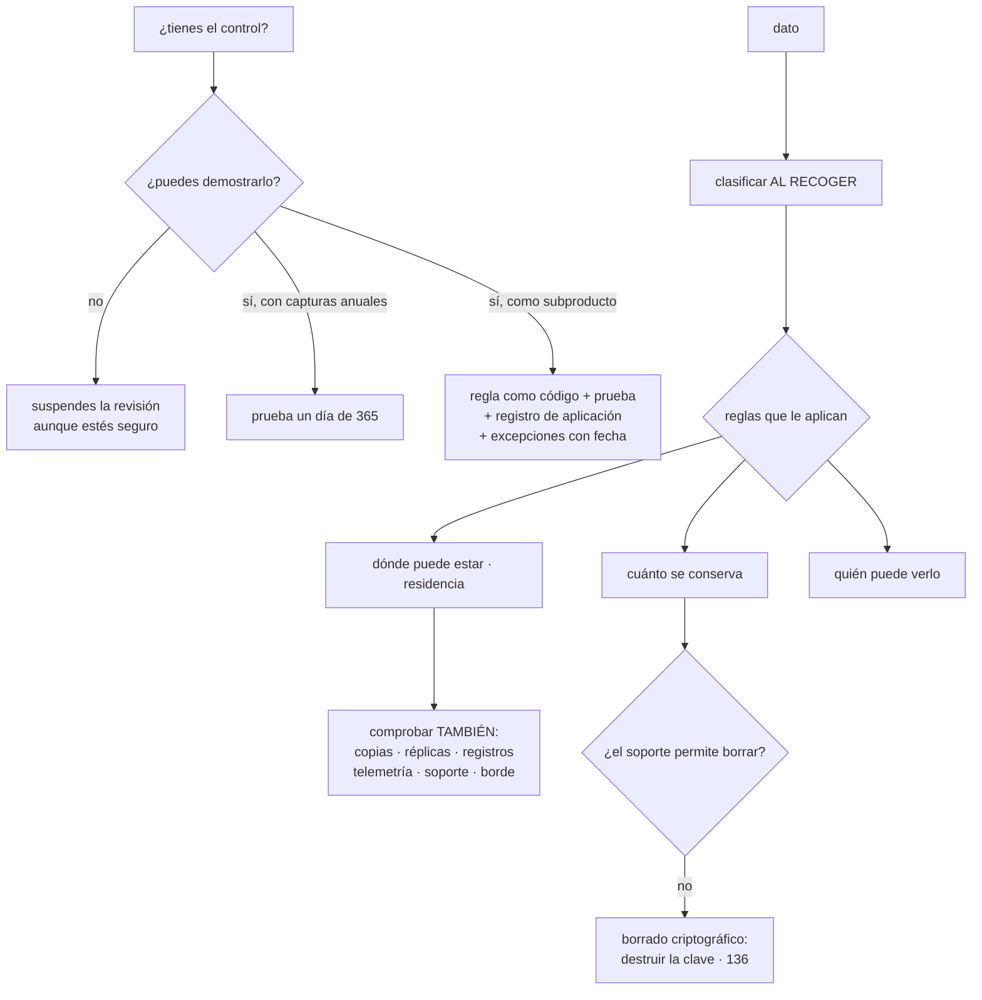

# 141 — Cumplimiento, residencia, privacidad y evidencia

> [← 140 · Threat modeling con STRIDE y attack paths](../../part-11-security-governance-finops/140-threat-modeling-con-stride-y-attack-paths/README.md) · [Índice de la parte](../README.md) · [142 · FinOps: showback, chargeback, budgets y anomalías →](../../part-11-security-governance-finops/142-finops-showback-chargeback-budgets-y-anomalias/README.md)

**Parte:** 11 — Seguridad, gobierno, cumplimiento y FinOps<br>
**Nivel:** avanzado · **Horas estimadas:** 4<br>
**Laboratorio:** `compliance` · **Estado:** `EXECUTABLE_CORE`

## 🎯 Propósito

Demostrar a alguien que no estaba delante que los controles existen y funcionan. La clase separa dos cosas que se confunden —tener seguridad y poder demostrarla— y defiende que la evidencia debe ser **un subproducto continuo de cómo se opera**, no una campaña anual de capturas de pantalla. Después trata los tres asuntos que más incumplimientos producen en la práctica: dónde acaban de verdad los datos, cómo se borra lo que hay que borrar cuando el sistema está lleno de registros inmutables, y qué ocurre cuando quien incumple es un proveedor.

## 📚 Resultados de aprendizaje

Al finalizar podrás:

1. **Distinguir** tener un control de poder demostrarlo, y cubrir las dos cosas.
2. **Generar** evidencia como subproducto de la operación normal.
3. **Clasificar** los datos en el momento de recogerlos.
4. **Comprobar** dónde acaban los datos de verdad, incluidos registros y telemetría.
5. **Borrar** lo que hay que borrar en sistemas que no permiten borrar.

## 🧩 Conceptos centrales

| Concepto | Comprensión verificable |
|---|---|
| `evidencia` | Prueba verificable de que un control existió y se aplicó durante un periodo, no solo el día de la revisión. |
| `clasificación` | Etiqueta que dice qué tipo de dato es y qué reglas le aplican. Sin ella no se puede aplicar ninguna regla. |
| `residencia` | Requisito de que los datos permanezcan en una zona geográfica. Incluye copias, réplicas, registros, telemetría y acceso de soporte. |
| `minimización` | No recoger ni conservar lo que no hace falta. Es el control más eficaz y el único que elimina el riesgo en vez de gestionarlo. |
| `borrado criptográfico` | Destruir la clave que protege un dato para hacerlo ilegible, cuando el soporte no permite borrarlo. |
| `encargado del tratamiento` | Tercero que trata datos por cuenta tuya. Su incumplimiento es tu incidente. |

## 🧠 Modelo mental

Gobernar no significa aprobar cada cambio: significa codificar límites, evidencia y responsabilidades para que los equipos puedan avanzar con seguridad.

Aplicado a esta clase, separa siempre cuatro planos: **intención** (qué necesita el usuario),
**configuración** (qué declaramos), **estado observado** (qué existe de verdad) y
**evidencia** (cómo sabemos que cumple). Confundirlos produce diseños que se ven correctos
en un diagrama pero fallan al operar.

## 🗺️ Flujo de razonamiento



## 📖 Desarrollo

### 1. Tener el control y poder demostrarlo

Son dos problemas distintos y fallar en cualquiera tiene consecuencias:

```text
control sin evidencia    el sistema es seguro y la revisión se suspende
                         porque no hay forma de demostrarlo
evidencia sin control    la revisión se aprueba y ocurre una brecha
```

Y el segundo es más común de lo que parece, porque **es más fácil producir un documento que un control**. Es la ley 17 en su forma más pura: la certificación se convierte en el objetivo y el sistema no mejora.

La forma cara de generar evidencia, que es la habitual:

```text
una vez al año alguien recorre los sistemas haciendo capturas de pantalla
cuesta semanas de varias personas
y demuestra el estado de UN día de trescientos sesenta y cinco
```

La forma que funciona es tratarla como **subproducto de cómo ya se opera**:

```text
la regla existe como código, revisada y versionada       clase 139
tiene prueba negativa que demuestra que detecta          clase 139
su aplicación deja registro continuo
las excepciones están declaradas, con motivo y caducidad
y todo eso se consulta con una consulta, no con una captura
```

Y cuatro ejemplos de la traducción, con lo que ya existe en este programa:

```text
«el acceso a producción está controlado»
  → registro de concesiones temporales, con quién y por qué   clase 134

«el código se revisa antes de desplegarse»
  → historial del repositorio de entorno                       clase 103

«los cambios en producción están autorizados»
  → cada despliegue enlaza con su confirmación y su aprobación clase 099

«las copias de seguridad se restauran periódicamente»
  → registro del ensayo trimestral, con su cronómetro          clase 088
```

Y la propiedad que hace válida la evidencia:

```text
cubre un PERIODO, no un instante
no la puede modificar quien es objeto del control      clase 134
y se puede reproducir: la misma consulta da el mismo resultado
```

Y una consecuencia práctica que ahorra mucho: **preparar una revisión deja de ser un proyecto**. Si la evidencia son consultas guardadas, se ejecutan el día que haga falta.

### 2. Clasificar, o no se puede aplicar nada

Ninguna regla se puede aplicar a un dato que no está clasificado. Y la clasificación tiene dos formas de hacerse, con resultados muy distintos:

```text
AL RECOGER      quien crea el campo declara qué es
                → se mantiene sola, porque forma parte del diseño
A POSTERIORI    alguien recorre las bases buscando datos personales
                → caduca en semanas y hay que repetirlo eternamente
```

Y los niveles, que conviene que sean pocos:

```text
PÚBLICO         puede publicarse
INTERNO         no debería salir, y su filtración no es grave
CONFIDENCIAL    daño real si se filtra: contratos, precios, planes
PERSONAL        identifica a una persona; reglas legales aplicables
  y dentro de este, la categoría especial: salud, biometría, ideología
```

Y con cuatro etiquetas ya se puede decidir todo lo demás:

```text
dónde puede estar          residencia y proveedores permitidos
cuánto se conserva         retención y borrado
quién puede verlo          permisos y herramientas internas
si puede salir en registros o telemetría                clases 122, 124
si puede ir a un entorno de pruebas                     clase 104
```

Y el mecanismo que lo mantiene vivo, con lo que ya existe:

```text
esquema del evento y del modelo con la clasificación por campo   clase 115
comprobación en la canalización: campo nuevo sin clasificar → falla
el catálogo dice qué sistemas tratan qué categorías              clase 095
```

Y **la minimización**, que es el control más eficaz y el que menos se considera:

```text
el dato que no se recoge no se puede filtrar, ni hay que
  cifrarlo, ni borrarlo, ni justificarlo, ni notificarlo
```

Y las tres preguntas que la aplican, en orden:

```text
¿hace falta recogerlo?
¿hace falta conservarlo tanto tiempo?
¿hace falta el valor, o basta una referencia o un resumen?
```

La tercera resuelve muchos casos: **guardar un identificador en lugar del dato** convierte un problema de privacidad en uno de control de acceso, que es mucho más fácil.

### 3. Dónde acaban los datos de verdad

«Los datos se quedan en esta región» es un requisito frecuente y casi siempre falso la primera vez que se comprueba. Lo que hay que revisar, y lo que suele fallar:

```text
almacenamiento principal              casi siempre correcto
copias de seguridad                   a veces en otra región
réplicas de lectura                   a veces en otra región
REGISTROS                             ← falla muy a menudo
TELEMETRÍA                            ← falla muy a menudo
caché de borde                        ← contenido replicado por el mundo
servicio de correo o mensajería       destino fuera de la región
herramientas internas y de soporte    consola del proveedor de otro país
ACCESO DE SOPORTE DEL PROVEEDOR       personas fuera de la región
entornos de pruebas                   ← clase 104
```

Las tres marcadas son las que rompen el requisito casi siempre, y ninguna es obvia: **un registro con el nombre y el correo de un cliente enviado a un sistema de observabilidad en otro continente es un traslado de datos personales**.

Y los controles disponibles:

```text
política del proveedor que restrinja las regiones utilizables   clase 139
selección explícita de región en cada servicio, incluida la telemetría
recolector propio que depure antes de enviar fuera              clase 124
y lista de permitidos de salida hacia destinos fuera de la región  clase 135
```

Y una nota honesta sobre los límites: **los metadatos y el plano de control suelen procesarse fuera**. Nombres de recursos, identificadores y facturación viajan aunque el contenido no. Conviene saberlo y decirlo, en vez de afirmar una pureza que no existe.

**El borrado**, que es el requisito técnicamente más difícil de esta parte, porque los sistemas de la parte 09 están llenos de cosas que no se borran:

```text
registro conservado de eventos        inmutable por diseño     clase 114
lago de datos                         ficheros columnares      clase 112
copias de seguridad                   con retención larga
registros de auditoría                que no se pueden alterar clase 134
registros de aplicación               con su retención         clase 122
cachés                                y sus capas              clase 111
entornos de pruebas                   con subconjuntos         clase 104
```

Y las tres estrategias, en orden de preferencia:

```text
1. NO PUBLICAR EL DATO donde no se pueda borrar
   el evento lleva identificadores; el dato personal vive en la base
   → es la decisión de la clase 115, tomada por un motivo legal

2. BORRADO CRIPTOGRÁFICO
   cada sujeto tiene su clave; el dato se cifra con ella
   borrar la clave hace ilegible el dato allí donde esté
   → resuelve copias, lago y registros conservados de una vez
   → y requiere lo de la clase 136: clave por sujeto, e inventario

3. REESCRITURA
   con formato de tabla se puede borrar por filas                clase 112
   → caro, y no alcanza a las copias antiguas
```

Y la segunda es la respuesta elegante y tiene un precio que hay que aceptar: **la gestión de miles o millones de claves**, y que perder una clave equivale a perder ese dato para siempre.

Y el procedimiento de una solicitud de borrado, que hay que tener escrito y probado:

```text
localizar todos los sistemas que tienen datos del sujeto
  → sale del catálogo y de la clasificación, no de una investigación
ejecutar el borrado o la destrucción de clave
registrar qué se hizo, cuándo y sobre qué sistemas
y responder en el plazo legal
```

### 4. Terceros y revisiones

**Los terceros que tratan datos por cuenta tuya** son parte de tu superficie:

```text
el proveedor de nube
el de correo o mensajería
el de análisis                                  clase 133
el de observabilidad                            clase 121
el de pagos                                     clase 118
las herramientas de soporte y de atención
y los que estos a su vez usen
```

Y lo que hace falta de cada uno:

```text
inventario, con qué categorías de datos trata cada uno
un contrato que fije qué puede hacer y qué no
qué certificaciones tiene, y de qué alcance
dónde trata los datos
sus propios subcontratistas
y cómo notifica una brecha, y en cuánto tiempo
```

Y el punto que se olvida: **la brecha de tu proveedor es tu incidente**. Se declara, se comunica y se gestiona con el proceso de la clase 127, aunque el fallo no sea tuyo.

Y una comprobación que casi nadie hace y que da sorpresas: **revisar el alcance de la certificación que enseña un proveedor**. Un certificado puede cubrir un producto y no el que tú usas, o una región distinta.

**Las revisiones externas**, con lo que las hace baratas:

```text
lo que pide quien revisa
  la política escrita
  la evidencia de que se aplica, durante todo el periodo
  una muestra: «enséñame estos 25 casos concretos»
  y las excepciones, con su justificación

lo que las hace caras
  buscar la evidencia cuando la piden
  no poder demostrar el periodo, solo el día
  y las excepciones sin registrar, que aparecen en la muestra
```

Y el consejo práctico: **preparar las consultas de evidencia antes de que las pidan**, guardadas y reutilizables. Convierte semanas en horas y, además, permite comprobarlas durante el año.

Y la advertencia final, que es la ley 17 aplicada a esta materia:

```text
si la medida pasa a ser «tenemos el certificado»,
se optimizará el certificado
y el sistema no tiene por qué mejorar
→ la contramedida es medir también lo de las clases 133 a 140:
  alcance por punto de entrada, permisos sin usar, hallazgos expuestos,
  cadenas hasta objetivos críticos
```

Y la lista de comprobación de la clase:

```text
☐ cada control tiene evidencia consultable que cubre un periodo
☐ la evidencia no la puede alterar quien es objeto del control
☐ los datos se clasifican al recogerlos, y un campo sin clasificar falla
☐ está aplicada la minimización: recoger menos, conservar menos, referenciar
☐ se ha comprobado dónde acaban registros, telemetría, copias y caché de borde
☐ hay política del proveedor que restringe regiones
☐ está escrito qué metadatos salen igualmente
☐ el dato personal no se publica donde no se pueda borrar
☐ hay estrategia de borrado para los sistemas inmutables
☐ el procedimiento de solicitud de borrado está probado, no solo escrito
☐ existe inventario de terceros con las categorías que trata cada uno
☐ se revisa el alcance real de sus certificaciones
☐ las consultas de evidencia están preparadas de antemano
```

Y el cierre que enlaza con la clase siguiente: todo lo de esta parte cuesta dinero y compite con otras cosas. Y hay una disciplina que se ocupa exactamente de eso —de saber qué se gasta, de quién es y si merece la pena—, con un problema central que resultará ser el mismo de esta clase: **la atribución**. Es la materia de la clase 142.

## 🔬 Ejemplo trabajado

**CloudShop se somete a su primera revisión externa y a la vez recibe una solicitud de borrado de un cliente. Los dos ejercicios revelan el mismo problema: nadie sabía dónde estaban los datos.**

**La primera revisión: dos semanas y media de trabajo.**

```text
controles a demostrar                                          61
evidencia disponible al empezar                             12 de 61
forma de la evidencia          capturas de pantalla y hojas de cálculo
personas dedicadas                                              4
duración de la preparación                                12 días
observaciones del revisor                                      19
  de ellas, «el control existe y no se puede demostrar»         11
  de ellas, control ausente                                      8
```

Once de diecinueve observaciones eran de evidencia, no de seguridad. Y la más ilustrativa:

```text
control      «solo personal autorizado accede a producción»
realidad     cierto desde la clase 134: concesiones temporales
evidencia    una captura del panel de permisos, del día de la revisión
observación  «no demuestra el periodo; podría haber cambiado ayer»
```

**La reconstrucción como subproducto.**

```text                                    antes            después
forma de la evidencia            capturas puntuales    consultas guardadas
controles con evidencia               12 de 61            58 de 61
periodo cubierto                        1 día             12 meses
días de preparación                        12                   1,5
personas dedicadas                          4                     1
```

Y los tres restantes se documentaron como carencias reales, no como problemas de evidencia.

Ejemplos de la traducción:

```text
«acceso a producción controlado»
  → consulta sobre el registro de concesiones: quién, cuándo, aprobado
    por quién, cuánto duró. 418 registros en 6 meses.

«los cambios están autorizados»
  → consulta sobre el repositorio de entorno: cada despliegue con su
    confirmación y su aprobador.

«las copias se restauran»
  → registro de los 4 ensayos trimestrales, con duración medida.

«los permisos se revisan»
  → registro de retiradas automáticas por desuso: 6.840 en 6 meses.
    → esta convenció más que cualquier acta de reunión
```

**La residencia: el requisito que no se cumplía.**

Un cliente europeo exigía que sus datos no salieran del espacio europeo. La revisión punto por punto:

```text                                    región         ¿cumple?
base de datos principal                 eu-west            sí
copias de seguridad                     eu-west            sí
réplica de lectura                      eu-west            sí
registros de aplicación                 us-east            NO
telemetría (trazas y métricas)          us-east            NO
caché de borde                          global             NO
correos transaccionales                 us-east            NO
herramienta de atención al cliente      us-east            NO
entorno de pruebas con subconjunto      eu-west            sí (clase 104)
```

**Cinco de nueve incumplían**, y las tres primeras eran las de siempre. Y el contenido que salía:

```text
registros            nombre, correo y dirección en la línea ancha
                     → la lista de permitidos de la clase 122 los
                       incluía por descuido
telemetría           identificador de cliente en atributos de traza
caché de borde       páginas de pedido con datos del cliente
correos              nombre y dirección, por definición
atención al cliente  todo
```

```text                                          antes         después
registros                                   us-east         eu-west
  y los campos personales                   incluidos       fuera de la
                                                            lista de permitidos
telemetría                                  us-east         eu-west, y el
                                                            identificador
                                                            pseudonimizado
caché de borde                              global      páginas de cliente
                                                        marcadas como no
                                                        cacheables en borde
correos                                     us-east      proveedor europeo
atención al cliente                         us-east      instancia europea
política que restringe regiones               no             sí, 4 regiones
```

Y lo que se documentó como límite honesto:

```text
metadatos del proveedor —nombres de recursos, facturación,
identificadores— se procesan fuera
→ escrito en el registro de tratamientos, no omitido
```

**La solicitud de borrado, y por qué el catálogo lo resolvió.**

```text
sistemas que contenían datos del sujeto, según el catálogo         9
sistemas encontrados al buscar de verdad                          14
diferencia                                                         5
  registro conservado de eventos                                   sí
  lago de datos                                                    sí
  copias de seguridad de 14 meses                                  sí
  sistema de atención al cliente                                   sí
  hoja de cálculo de un equipo de marketing                        sí
```

Y los cuatro primeros eran los inmutables. La primera solicitud se resolvió a mano:

```text
tiempo empleado                                            9 días
sistemas donde no se pudo borrar de verdad                     3
respuesta al cliente        «borrado de los sistemas activos;
                             las copias caducan en 14 meses»
```

Y se rediseñó con las dos primeras estrategias del apartado tercero:

```text
1. NO PUBLICAR
   los eventos pasaron a llevar solo identificadores          clase 115
   → el registro conservado dejó de contener datos personales
   → tiempo de adopción: 6 semanas, con convivencia de esquemas

2. BORRADO CRIPTOGRÁFICO
   una clave por cliente; los campos personales se cifran con ella
   destruir la clave los hace ilegibles en base, lago y copias
   → apoyado en la clave por inquilino de la clase 136
```

```text                                    primera solicitud   tras el rediseño
tiempo de respuesta                      9 días              40 min
sistemas con dato legible tras el borrado    3                    0
sistemas que hubo que buscar a mano          5                    0
coste operativo por solicitud            ~2 días persona       ~15 min
solicitudes atendidas en 12 meses            —                   34
```

Y el coste asumido, que hay que decir:

```text
claves gestionadas                                        190.000
coste mensual del servicio de claves                +  180 €
riesgo nuevo    perder una clave equivale a perder ese dato
                → copias de la jerarquía de claves, con su propia custodia
```

**Los terceros.**

```text
terceros que tratan datos, según el inventario inicial          6
terceros encontrados al revisar la facturación y la salida     14
  → 8 más, incluidos 3 con acceso a datos personales

con contrato de tratamiento firmado                        6 de 14 → 14 de 14
con alcance de certificación verificado                    0 de 14 → 14 de 14
  → 2 tenían certificación de un producto DISTINTO al que usábamos
con plazo de notificación de brecha por escrito            3 de 14 → 14 de 14
```

Y el proveedor de análisis de la clase 133 volvió a aparecer: **seguía en el inventario de terceros aunque el contrato había terminado**, que es lo mismo que descubrió el control de salida de la clase 135.

**A los doce meses.**

```text                                          antes         después
controles con evidencia consultable            12 de 61       58 de 61
periodo cubierto por la evidencia                1 día        12 meses
días de preparación de una revisión                12            1,5
observaciones de revisión                          19              3
campos clasificados al recoger                     no             sí
sistemas fuera de la región exigida            5 de 9          0 de 9
política que restringe regiones                    no             sí
tiempo de respuesta a una solicitud de borrado   9 días        40 min
sistemas con dato legible tras un borrado           3              0
terceros inventariados                          6 de 14       14 de 14
certificaciones con alcance verificado          0 de 14       14 de 14
```

**La lección que esta clase traslada a la parte 11**: once de las diecinueve observaciones de la primera revisión decían que **el control existía y no se podía demostrar**, y se resolvieron sin cambiar ningún control: solo convirtiendo la evidencia en consultas sobre lo que la operación ya registraba. Y los dos problemas reales —cinco sistemas fuera de la región exigida y datos personales en cuatro sitios de los que no se pueden borrar— tenían el mismo origen que la clase 139: **nadie sabía dónde estaba cada cosa**.

## 🧪 Laboratorio guiado

Ejecuta desde la raíz:

```bash
python classes/part-11-security-governance-finops/141-cumplimiento-residencia-privacidad-y-evidencia/lab.py
```

El laboratorio selecciona el motor de práctica **`compliance`** y produce
`lab_result.json`. El escenario, sus comprobaciones y el artefacto esperado corresponden a
esta clase; no requiere credenciales y deja explícito qué debe revalidarse en un sandbox real.

1. Lee `exercise.steps` y formula una predicción antes de ejecutar.
2. Ejecuta la práctica y verifica todos los elementos de `checks`.
3. Provoca el caso de `negative_test` y explica la señal observada.
4. Materializa `matriz-controles` en `evidence/` usando la plantilla indicada.
5. Para proveedor real, sigue `sandbox.requires`, registra costo y ejecuta `destroy`.

### Evidencia esperada

El artefacto principal es un control mapeado a evidencia y responsable. Además, la entrega debe incluir el comando ejecutado,
la salida estructurada y una conclusión que no exceda lo observado.

## 🏆 Reto verificable

Construye **`matriz-controles`** para el caso CloudShop. Incluye una alternativa descartada,
un supuesto que pueda falsarse, una prueba de fallo y una decisión de rollback.

## ✅ Criterio de aceptación

- [ ] `lab.py` termina con código 0 y genera JSON válido.
- [ ] La entrega conecta al menos tres requisitos con mecanismos verificables.
- [ ] Existe una prueba positiva y una prueba negativa con evidencia.
- [ ] Seguridad, costo y operación aparecen como decisiones, no como anexos.
- [ ] Se declara una limitación y una condición que obligaría a revisar el diseño.
- [ ] Otra persona puede repetir el recorrido sin conocimiento tácito.

## ⚠️ Errores frecuentes

| Síntoma | Causa probable | Corrección |
|---|---|---|
| El control funciona y la revisión lo marca como no demostrado | La evidencia es una captura de un día, no un registro del periodo | Convierte la evidencia en consultas sobre lo que la operación ya registra: concesiones, despliegues, ensayos, retiradas. |
| Preparar una revisión ocupa semanas de varias personas | La evidencia se recolecta cuando la piden | Prepara las consultas de antemano, guardadas y reutilizables, y compruébalas durante el año. |
| Se afirma que los datos no salen de una región y sí salen | Nadie revisó registros, telemetría, caché de borde, correos ni herramientas de soporte | Revisa los nueve destinos, restringe regiones por política del proveedor y depura los campos personales antes de enviar telemetría. |
| Una solicitud de borrado no se puede cumplir del todo | El dato está en registros conservados, lago y copias, que no permiten borrar | No publiques datos personales donde no se puedan borrar y usa borrado criptográfico con clave por sujeto. |
| Aparecen sistemas con datos del cliente que no estaban en el inventario | La clasificación se hizo a posteriori y caducó | Clasifica al recoger, falla la canalización si hay un campo sin clasificar y mantén el catálogo con qué sistema trata qué categoría. |
| Se obtiene la certificación y el riesgo real no baja | Ley 17: la certificación se convirtió en el objetivo | Mide además alcance por punto de entrada, permisos sin usar, hallazgos expuestos y cadenas hasta objetivos críticos. |

## 🛡️ Seguridad, ética y costo

Trabaja con cuentas propias o sandboxes autorizados. No publiques secretos, identificadores
reales ni datos personales. Antes de crear recursos pagos define presupuesto, etiquetas y
comando de destrucción; después verifica que no queden recursos huérfanos. Los ejemplos
locales enseñan contratos, pero no certifican cumplimiento ni disponibilidad de producción.

## ❓ Preguntas de comprobación

1. ¿Qué diferencia hay entre tener un control y poder demostrarlo, y cómo falla cada lado?
2. ¿Qué propiedades debe tener una evidencia para ser válida?
3. ¿Qué destinos suelen incumplir un requisito de residencia?
4. ¿Cómo se borra un dato que está en un registro conservado y en copias antiguas?
5. ¿Por qué la brecha de un proveedor es tu incidente?

## 🔗 Referencias

- Unión Europea (2016). *Reglamento general de protección de datos* — bases de tratamiento, minimización y derechos. <https://eur-lex.europa.eu/eli/reg/2016/679/oj>
- NIST (2020). *Privacy Framework* — clasificación, minimización y controles de privacidad. <https://www.nist.gov/privacy-framework>
- ISO/IEC (2022). *27001 e 27701: requisitos y evidencia* — qué se audita y cómo se demuestra. <https://www.iso.org/standard/27001>
- Google Cloud (2025). *Data residency and sovereignty controls* — límites reales, metadatos y plano de control. <https://cloud.google.com/architecture/framework/security/data-residency-sovereignty>
- ENISA (2025). *Crypto-shredding and data deletion in immutable systems* — borrado criptográfico y sus límites. <https://www.enisa.europa.eu/publications>
- Documentación oficial vigente del servicio implementado; registra URL y fecha de consulta.

---

> [Evaluación](assessment.md) · [Contrato de clase](lesson.yaml) · [Índice de la parte](../README.md)

**📥 Descargar:** [Parte 11 en PDF](../../../site/downloads/partes/manual-parte-11-security-governance-finops.pdf) · [Manual integral](../../../site/downloads/multi-cloud-engineering-manual-v2.0.pdf)

| Anterior | Índice | Siguiente |
|---|---|---|
| [← 140 · Threat modeling con STRIDE y attack paths](../../part-11-security-governance-finops/140-threat-modeling-con-stride-y-attack-paths/README.md) | [Parte 11](../README.md) · [Programa](../../README.md) | [142 · FinOps: showback, chargeback, budgets y anomalías →](../../part-11-security-governance-finops/142-finops-showback-chargeback-budgets-y-anomalias/README.md) |
