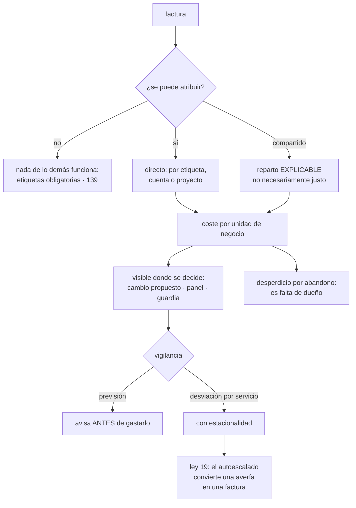

# 142 — FinOps: showback, chargeback, budgets y anomalías

> [← Clase anterior](../../part-11-security-governance-finops/141-cumplimiento-residencia-privacidad-y-evidencia/README.md) · [Índice de la parte](../README.md) · [Clase siguiente →](../../part-11-security-governance-finops/143-optimizacion-de-costo-capacidad-y-sostenibilidad/README.md)

**Parte:** 11 — Seguridad, gobierno, cumplimiento y FinOps<br>
**Nivel:** avanzado · **Horas estimadas:** 4<br>
**Laboratorio:** `finops` · **Estado:** `EXECUTABLE_CORE`

## 🎯 Propósito

Gobernar un gasto que no decide nadie en concreto: la factura de la nube es la suma de cientos de decisiones pequeñas tomadas por personas que no ven el precio de lo que eligen. Por eso la clase no trata de negociar con el proveedor, sino de **poner el coste al lado de la decisión**. Y empieza por el problema que la hipótesis de la clase 132 predijo como central de toda esta parte: **sin saber de quién es cada gasto, no se puede hacer nada con él**.

## 📚 Resultados de aprendizaje

Al finalizar podrás:

1. **Atribuir** cada gasto a un equipo y a un servicio, incluidos los compartidos.
2. **Elegir** entre mostrar el gasto y cobrarlo, sabiendo qué provoca cada uno.
3. **Medir** el coste por unidad de negocio, que es lo único comparable en el tiempo.
4. **Detectar** desviaciones sin ahogarse en falsas alarmas.
5. **Reconocer** el desperdicio que es un fallo de atribución y no de eficiencia.

## 🧩 Conceptos centrales

| Concepto | Comprensión verificable |
|---|---|
| `atribución` | Saber a qué equipo y a qué servicio corresponde cada euro. Es el requisito previo de todo lo demás. |
| `reparto de compartidos` | Método para asignar lo que no es de nadie en concreto: red, clúster, plataforma, observabilidad. |
| `mostrar frente a cobrar` | Enseñar a cada equipo su gasto, o cargárselo en su presupuesto. Lo segundo cambia el comportamiento y también lo distorsiona. |
| `coste unitario` | Coste por pedido, por cliente o por petición. Es lo único que se puede comparar cuando el negocio crece. |
| `presupuesto y previsión` | Límite fijado y proyección del gasto. Avisar al alcanzar el límite llega tarde: el dinero ya se gastó. |
| `desperdicio por abandono` | Recursos que existen porque nadie los apagó. Es un problema de dueño, no de eficiencia. |

## 🧠 Modelo mental

Gobernar no significa aprobar cada cambio: significa codificar límites, evidencia y responsabilidades para que los equipos puedan avanzar con seguridad.

Aplicado a esta clase, separa siempre cuatro planos: **intención** (qué necesita el usuario),
**configuración** (qué declaramos), **estado observado** (qué existe de verdad) y
**evidencia** (cómo sabemos que cumple). Confundirlos produce diseños que se ven correctos
en un diagrama pero fallan al operar.

## 🗺️ Flujo de razonamiento



## 📖 Desarrollo

### 1. Sin atribución no hay nada

La primera pregunta ante cualquier factura no es «cómo bajarla», sino **de quién es**.

```text
si nadie sabe de quién es un gasto
  → nadie lo revisa
  → nadie lo puede reducir
  → y nadie lo echa de menos cuando ya no hace falta
```

Y las tres formas de atribuir, de más gruesa a más fina:

```text
POR CUENTA O PROYECTO   la más fiable, porque no depende de nadie
                        un proyecto por equipo y entorno resuelve el 80 %
POR ETIQUETA            necesaria para el detalle
                        y depende de que se pongan
POR CONSUMO MEDIDO      para lo compartido: un clúster, una base multiuso
```

Y la segunda solo funciona si es obligatoria en la creación, con la política del proveedor de la clase 139: **una etiqueta que se pide por convención no se pone**.

```text
etiquetas mínimas   equipo · servicio · entorno · centro de coste
y una más que ahorra discusiones:  fecha de caducidad prevista
```

**Lo compartido**, que es donde se atasca la conversación. Lo que no es de nadie en concreto:

```text
red: pasarelas, tráfico entre zonas, salida         clase 135
nodos de un clúster con cargas de varios equipos
observabilidad                                      clase 121
plataforma y herramientas                           clase 106
soporte del proveedor y descuentos
```

Y los tres métodos de reparto:

```text
A PARTES IGUALES        simple; injusto y nadie lo discute mucho
PROPORCIONAL AL USO     por peticiones, por CPU consumida, por GB
                        → el más defendible, y hay que poder medirlo
BOLSA SIN ASIGNAR       se deja aparte y lo asume la organización
                        → honesto, y si crece nadie lo reduce
```

Y la regla que evita meses de discusión:

```text
el reparto tiene que ser EXPLICABLE, no perfectamente justo
→ un reparto que nadie entiende se discute y se ignora
→ y uno aproximado que se entiende cambia comportamientos
```

Y una advertencia sobre la bolsa sin asignar: **conviene que sea pequeña y que tenga dueño**. Si el 40 % de la factura no es de nadie, la mitad del trabajo no se puede hacer.

### 2. Mostrar, cobrar y el coste unitario

```text
MOSTRAR    cada equipo ve su gasto y su evolución; no afecta a su presupuesto
  + suficiente en la mayoría de los casos
  + no genera discusiones sobre el reparto
  − si nadie mira, no cambia nada

COBRAR     el gasto se carga al presupuesto del equipo
  + cambia el comportamiento de verdad
  − obliga a que el reparto sea defendible
  − y produce optimizaciones locales que empeoran el total
```

Y la última línea es la ley 17 aplicada al dinero:

```text
un equipo mueve una carga a otro sitio para que no le cuente
un equipo deja de usar la plataforma común porque le cobran su parte
y se monta la suya, que cuesta más en total
```

Y la recomendación práctica: **mostrar casi siempre; cobrar cuando la organización ya sabe interpretar las cifras** y con un reparto que los equipos acepten.

**El coste unitario** es lo que hace útil todo lo anterior:

```text
coste absoluto      sube cuando el negocio va bien; no dice nada
coste por pedido    baja cuando se mejora y sube cuando se empeora
```

```text
factura del mes                    41.000 €      →  52.000 €
pedidos del mes                   180.000        →   310.000
coste por pedido                    0,228 €      →     0,168 €
```

La factura sube un 27 % y la eficiencia mejora un 26 %. **Sin la unidad, esa conversación no se puede tener.**

Y las unidades que suelen servir:

```text
por pedido, por transacción, por cliente activo
por petición servida, por gigabyte procesado
por sesión, por documento indexado
```

Y dónde se pone la cifra, que es lo que decide si sirve:

```text
en el panel del servicio, junto al objetivo             clase 125
en el cambio propuesto: coste estimado del cambio
en la revisión de diseño: coste por unidad esperado
y en el catálogo del servicio                           clase 095
```

La segunda es la más eficaz: **poner el coste delante en el momento de decidir** cambia decisiones que ninguna revisión posterior cambiaría. Y no hace falta precisión: basta un orden de magnitud.

```text
«este cambio añade una réplica de lectura: +310 €/mes»
«este índice nuevo: +0,004 € por pedido»
«guardar estos registros 90 días en vez de 14: +1.900 €/mes»
```

### 3. Avisar antes de gastarlo

**El presupuesto** con aviso al alcanzarlo llega tarde por definición: cuando avisa, el dinero está gastado. Lo que sirve:

```text
aviso por PREVISIÓN     «al ritmo actual, se superará el presupuesto el día 21»
                        → avisa con margen para actuar
aviso por RITMO         gasto diario frente al esperado
                        → es el mismo mecanismo que el ritmo de consumo
                          del presupuesto de error de la clase 126
```

Y conviene tener presupuesto por equipo y por entorno, no solo global: **un presupuesto global no lo mira nadie, porque no es de nadie**.

**La detección de desviaciones** tiene un problema propio: el gasto es naturalmente irregular.

```text
cierres mensuales, campañas, migraciones, procesos por lotes
→ un umbral simple produce falsas alarmas constantes
→ y entonces se desactiva: ley 16
```

Lo que funciona:

```text
comparar cada servicio consigo mismo, no con el total
tener en cuenta el día de la semana y el del mes
avisar por CAMBIO relativo sostenido, no por valor absoluto
y agrupar por etiqueta, para que el aviso diga de quién es
```

Y el aviso útil dice tres cosas:

```text
qué servicio, de qué equipo
cuánto más de lo esperado, en euros al día
y qué cambió: enlace a la línea de cambios de la clase 121
```

La tercera es la que convierte un aviso de coste en algo accionable en minutos en lugar de días.

**Y la conexión con la ley 19**, que es lo que hace peligroso el coste en la nube:

```text
en un centro de datos propio, una fuga o un bucle acaban en una CAÍDA
  → se detecta en minutos
en la nube, el autoescalado lo absorbe
  → no hay caída: hay factura
  → y se detecta cuando alguien la mira, semanas después
```

Es exactamente el mecanismo que compensa un fallo y lo vuelve invisible, en versión financiera. Y de ahí dos consecuencias:

```text
toda carga con autoescalado necesita TECHO           clases 117, 135
y el coste diario por servicio es una señal de
  funcionamiento, no solo de dinero
```

Y una cifra que conviene medir sobre el propio programa:

```text
tiempo desde que empieza una desviación hasta que alguien la ve
  sin nada                 semanas: cuando llega la factura
  con panel mensual        semanas
  con detección diaria     1-2 días
```

### 4. El desperdicio que es falta de dueño

Buena parte de lo que se llama «optimización» no es eficiencia: es **retirar cosas que nadie apagó**.

```text
entornos de pruebas encendidos de noche y fin de semana
entornos efímeros huérfanos                          clase 104
discos sin conectar a nada
instantáneas antiguas                                clase 112
direcciones reservadas y no usadas
balanceadores sin nada detrás
bases de datos de proyectos terminados
cuentas enteras sin dueño                            clase 139
registros y métricas que nadie consulta              clase 121
licencias contratadas para un equipo que se disolvió
capacidad comprometida para un pico que ya no ocurre
```

Y todas tienen la misma causa: **existen porque nadie es responsable de que dejen de existir**. Por eso esta clase empieza por la atribución y no por el ahorro.

Los mecanismos que lo resuelven, todos ya vistos en el programa:

```text
etiqueta de caducidad prevista, obligatoria al crear
barrido de huérfanos, programado                     clase 104
apagado automático de entornos inferiores fuera de horario
retirada por desuso, con recuperación inmediata      clase 134
y una regla que lo cierra: lo que no tiene dueño en 30 días se apaga
```

Y el orden de trabajo, que evita perder el tiempo:

```text
1. lo que se puede apagar sin que nadie lo note        rendimiento inmediato
2. lo que se puede dimensionar mejor                   clase 143
3. lo que se puede comprometer con descuento           clase 143
4. lo que exige rediseño                               lo último
```

Y una advertencia sobre el punto 3, que es donde más se equivoca la gente: **comprometerse a pagar durante un año algo que se podría apagar es peor que no hacer nada**. Primero se retira y se dimensiona; solo después se compromete lo que quede.

Y lo que hay que vigilar de forma continua:

```text
proporción de la factura sin atribuir
coste por unidad de negocio, por servicio
desviación diaria frente a lo previsto, por equipo
recursos sin dueño y su antigüedad
recursos con etiqueta de caducidad vencida
compromisos contratados frente a uso real
y la relación entre la factura y el coste de la telemetría
  que la mide                                          clase 132
```

Y la lista de comprobación de la clase:

```text
☐ las etiquetas de equipo, servicio y entorno son obligatorias al crear
☐ hay un proyecto o cuenta por equipo y entorno
☐ el reparto de lo compartido está escrito y es explicable
☐ la bolsa sin asignar es pequeña y tiene dueño
☐ cada equipo ve su gasto y su evolución
☐ existe al menos una unidad de negocio y se publica el coste por unidad
☐ el coste aparece en el cambio propuesto y en el panel del servicio
☐ hay presupuesto por equipo, con aviso por previsión y por ritmo
☐ la detección de desviaciones compara cada servicio consigo mismo
☐ el aviso de desviación enlaza con la línea de cambios
☐ toda carga con autoescalado tiene techo
☐ hay barrido de huérfanos y apagado de entornos fuera de horario
☐ se mide el tiempo desde que empieza una desviación hasta que se ve
```

Y el cierre que enlaza con la clase siguiente: con el gasto atribuido y visible, queda decidir qué hacer con él. Cómo se dimensiona, qué se compromete, qué se rediseña y qué relación tiene todo eso con el consumo energético es la materia de la clase 143.

## 🔬 Ejemplo trabajado

**CloudShop tiene una factura de 41.000 € al mes que crece un 6 % mensual y nadie sabe explicar por qué. El ejercicio empieza por atribuir y termina encontrando que la mayor partida se compró para un pico que dejó de ocurrir hace catorce meses.**

**Punto de partida: la factura sin atribuir.**

```text
factura mensual                                        41.200 €
crecimiento mensual                                        6 %
proporción atribuible a un equipo                         31 %
proporción atribuible a un servicio                       22 %
cuentas y proyectos                                         23
recursos con etiqueta de equipo                           38 %
```

Sesenta y nueve por ciento del gasto **no era de nadie**.

**La atribución, en tres semanas.**

```text
semana 1  política del proveedor: no se puede crear un recurso sin
          etiquetas de equipo, servicio, entorno y caducidad prevista
semana 2  campaña de etiquetado con el registro de auditoría
          (la misma de la clase 139, aprovechada)
semana 3  reparto de lo compartido, escrito y acordado
```

Y el reparto de lo compartido, que ocupó la mayor parte de la discusión:

```text                                    método elegido      motivo
nodos del clúster                     proporcional a CPU     medible
                                      solicitada
red: salida y entre zonas             proporcional a GB      medible
pasarelas de traducción               a partes iguales       no medible
observabilidad                        proporcional a series  medible
                                      y volumen
plataforma y herramientas             bolsa sin asignar      decisión
                                                             deliberada
```

```text                                          antes         después
gasto atribuible a un equipo                   31 %            94 %
bolsa sin asignar                              69 %             6 %
```

**El desglose, una vez atribuido.**

```text                                                  €/mes    % 
capacidad comprometida sin usar                        9.800     24 %
observabilidad                                         6.410     16 %
cómputo de producción                                  9.200     22 %
bases de datos                                         5.100     12 %
red                                                    2.660      6 %
entornos inferiores                                    3.900      9 %
almacenamiento y lago                                  2.180      5 %
resto                                                  1.950      5 %
```

La primera línea no la esperaba nadie.

**La partida mayor: un pico que ya no ocurre.**

```text
compromiso contratado hace 26 meses, a 3 años
motivo original    una campaña anual que exigía 3× la capacidad
uso real del compromiso                                     41 %
el pico que lo motivó                    dejó de ocurrir hace 14 meses
                                         (cambió el calendario comercial)
quién lo revisaba                        nadie desde la firma
coste del compromiso no usado                        9.800 €/mes
```

**Veinticuatro por ciento de la factura pagando capacidad para un evento que ya no existe.** Y no era un error técnico: era **un contrato que nadie tenía asignado**.

```text                                          antes         después
compromiso                              3 años, 26 meses    renegociado al
                                        de antigüedad       uso real
uso del compromiso                            41 %            89 %
coste mensual del compromiso               9.800 €          4.100 €
ahorro                                        —              5.700 €/mes
revisión del compromiso                    ninguna         trimestral,
                                                           con dueño
```

**Los tres siguientes ahorros, para comparar.**

```text
telemetría (clase 132)                                 5.300 €/mes
entornos inferiores apagados fuera de horario          1.900 €/mes
recursos huérfanos retirados                           1.140 €/mes
                                                     ────────────
suma de los tres siguientes                            8.340 €/mes
```

Y el dato que la clase 144 usará para calificar la hipótesis de la clase 132:

```text
mayor ahorro individual (compromiso)          5.700 €/mes
suma de los tres siguientes                   8.340 €/mes
→ el mayor NO supera a la suma de los tres siguientes
```

**Los huérfanos, que son atribución y no eficiencia.**

```text
al barrer con las etiquetas ya puestas
  discos sin conectar                                    118
  instantáneas de más de 1 año                           940
  direcciones reservadas sin uso                          41
  balanceadores sin destinos                              11
  bases de datos de proyectos terminados                   4
  entornos efímeros huérfanos                        ya resuelto (clase 104)
  cuentas sin dueño                                        6  (clase 139)
                                                    ─────────
  ahorro                                             1.140 €/mes
```

Y la regla que lo mantiene: **lo que no tiene dueño en 30 días se apaga**, con aviso previo y recuperación en minutos. En seis meses se apagaron 31 recursos y hubo 3 reclamaciones, todas resueltas el mismo día.

**El coste unitario, y la conversación que permitió.**

```text                                    ene        jun
factura mensual                        41.200 €   28.900 €
pedidos                                180.000    310.000
coste por pedido                        0,229 €    0,093 €
```

Y la cifra por servicio reveló algo que la factura global escondía:

```text                                    coste por pedido
servicio de pedidos                          0,021 €
catálogo                                     0,014 €
recomendaciones                              0,038 €   ← el más caro
búsqueda                                     0,009 €
```

Recomendaciones costaba más por pedido que el propio servicio de pedidos. **Nadie lo sabía**, y llevó a un rediseño que lo bajó a 0,011 €.

**La desviación que el autoescalado tapó.**

```text
día 4    un cambio introduce una consulta sin índice en el catálogo
         la latencia sube ligeramente; el autoescalado añade instancias
         no hay caída, ni alerta, ni queja
día 5-17 el servicio funciona con 3,4× las instancias habituales
día 18   la detección diaria de desviación avisa:
         «catálogo: +190 €/día sobre lo previsto desde el día 4»
día 18   la línea de cambios señala el despliegue del día 4
día 18   corregido en 40 minutos
coste de los 14 días                                    2.660 €
```

Es la ley 19 en versión financiera: **en un sistema sin elasticidad habría sido una caída de minutos**; con elasticidad fue una factura de dos semanas.

```text                                          antes         después
detección de desviaciones                     mensual        diaria
comparación                              con el total    cada servicio
                                                         consigo mismo
falsas alarmas por estacionalidad          no aplicable    2 en 6 meses
tiempo desde que empieza una desviación
hasta que se ve                          3-5 semanas       1,2 días
aviso enlazado con la línea de cambios       no             sí
techos de autoescalado definidos           0 de 15        15 de 15
```

**Mostrar en vez de cobrar.**

```text
decisión    mostrar el gasto a cada equipo, sin cargarlo a su presupuesto
motivo      el reparto de lo compartido llevaba tres semanas de acuerdo
            y cobrar habría reabierto la discusión

efecto medido en 6 meses
  equipos que redujeron su gasto sin que nadie se lo pidiera      4 de 6
  reducción atribuible a esas decisiones                    3.100 €/mes
  discusiones sobre el método de reparto                         2
```

Y el coste en el cambio propuesto, que resultó más eficaz que el panel:

```text
cambios en los que apareció una estimación de coste             211
cambios modificados tras verla                                   19
ahorro estimado de esas 19 decisiones                     1.400 €/mes
```

**A los seis meses.**

```text                                          antes         después
factura mensual                             41.200 €       28.900 €
coste por pedido                             0,229 €        0,093 €
gasto atribuible a un equipo                   31 %            94 %
bolsa sin asignar                              69 %             6 %
uso del compromiso contratado                  41 %            89 %
recursos sin dueño                            no medido          0
tiempo hasta ver una desviación            3-5 semanas       1,2 días
techos de autoescalado                       0 de 15        15 de 15
coste visible en el cambio propuesto            no             sí
revisión de compromisos                     ninguna        trimestral
```

**La lección que esta clase traslada a la parte 11**: la mayor partida de la factura —el 24 %— era **capacidad comprometida a tres años para una campaña que dejó de celebrarse hace catorce meses**, y llevaba dos años sin que nadie la revisara porque el contrato no tenía dueño asignado. No fue un problema de ingeniería ni de precios: fue exactamente el mismo problema que la clase 139 encontró con los recursos y la 141 con los sistemas que guardan datos personales. **Nadie sabía de quién era cada cosa.**

## 🧪 Laboratorio guiado

Ejecuta desde la raíz:

```bash
python classes/part-11-security-governance-finops/142-finops-showback-chargeback-budgets-y-anomalias/lab.py
```

El laboratorio selecciona el motor de práctica **`finops`** y produce
`lab_result.json`. El escenario, sus comprobaciones y el artefacto esperado corresponden a
esta clase; no requiere credenciales y deja explícito qué debe revalidarse en un sandbox real.

1. Lee `exercise.steps` y formula una predicción antes de ejecutar.
2. Ejecuta la práctica y verifica todos los elementos de `checks`.
3. Provoca el caso de `negative_test` y explica la señal observada.
4. Materializa `modelo-asignacion-costos` en `evidence/` usando la plantilla indicada.
5. Para proveedor real, sigue `sandbox.requires`, registra costo y ejecuta `destroy`.

### Evidencia esperada

El artefacto principal es un cálculo trazable con unidad, supuesto y sensibilidad. Además, la entrega debe incluir el comando ejecutado,
la salida estructurada y una conclusión que no exceda lo observado.

## 🏆 Reto verificable

Construye **`modelo-asignacion-costos`** para el caso CloudShop. Incluye una alternativa descartada,
un supuesto que pueda falsarse, una prueba de fallo y una decisión de rollback.

## ✅ Criterio de aceptación

- [ ] `lab.py` termina con código 0 y genera JSON válido.
- [ ] La entrega conecta al menos tres requisitos con mecanismos verificables.
- [ ] Existe una prueba positiva y una prueba negativa con evidencia.
- [ ] Seguridad, costo y operación aparecen como decisiones, no como anexos.
- [ ] Se declara una limitación y una condición que obligaría a revisar el diseño.
- [ ] Otra persona puede repetir el recorrido sin conocimiento tácito.

## ⚠️ Errores frecuentes

| Síntoma | Causa probable | Corrección |
|---|---|---|
| Se sabe cuánto se gasta y no de quién es | Las etiquetas se piden por convención y no se ponen | Impónlas con política del proveedor en la creación, y usa un proyecto o cuenta por equipo y entorno como atribución gruesa. |
| El reparto de los costes compartidos se discute durante meses | Se busca un reparto justo en vez de uno explicable | Elige un método defendible, escríbelo, y deja en una bolsa pequeña y con dueño lo que no se pueda repartir. |
| La factura sube y no se sabe si el sistema es más o menos eficiente | Solo se mira el coste absoluto, que crece con el negocio | Publica el coste por unidad de negocio, global y por servicio. |
| El aviso de presupuesto llega cuando ya se gastó | Se avisa al alcanzar el límite | Avisa por previsión y por ritmo de gasto, con presupuesto por equipo y no solo global. |
| Una avería no provoca ninguna caída y aparece semanas después en la factura | Ley 19: el autoescalado la compensa y la vuelve invisible | Techo en toda carga elástica, detección diaria de desviación por servicio y aviso enlazado con la línea de cambios. |
| Se contrata un compromiso con descuento y el ahorro no llega | Se comprometió capacidad que se podía apagar o dimensionar mejor | Retira y dimensiona primero; compromete solo lo que quede, y revisa el compromiso cada trimestre con un dueño asignado. |

## 🛡️ Seguridad, ética y costo

Trabaja con cuentas propias o sandboxes autorizados. No publiques secretos, identificadores
reales ni datos personales. Antes de crear recursos pagos define presupuesto, etiquetas y
comando de destrucción; después verifica que no queden recursos huérfanos. Los ejemplos
locales enseñan contratos, pero no certifican cumplimiento ni disponibilidad de producción.

## ❓ Preguntas de comprobación

1. ¿Por qué la atribución es el requisito previo de todo lo demás?
2. ¿Qué regla evita meses de discusión sobre el reparto de lo compartido?
3. ¿Por qué el coste por unidad de negocio dice cosas que el coste absoluto no dice?
4. ¿Por qué avisar al alcanzar el presupuesto llega tarde y qué se hace en su lugar?
5. ¿Cómo convierte la elasticidad una avería en una factura, y qué lo detecta?

## 🔗 Referencias

- FinOps Foundation (2025). *FinOps framework: capabilities* — atribución, visibilidad, optimización y gobierno. <https://www.finops.org/framework/>
- FinOps Foundation (2025). *Unit economics* — coste por unidad de negocio como medida comparable. <https://www.finops.org/framework/capabilities/unit-economics/>
- AWS (2025). *Cost allocation tags and cost anomaly detection* — atribución y detección de desviaciones. <https://docs.aws.amazon.com/awsaccountbilling/latest/aboutv2/cost-alloc-tags.html>
- Google Cloud (2025). *Billing budgets, forecasts and alerts* — aviso por previsión frente a aviso por límite. <https://cloud.google.com/billing/docs/how-to/budgets>
- Azure (2025). *Cost Management: showback and chargeback* — mostrar frente a cobrar y sus efectos. <https://learn.microsoft.com/azure/cost-management-billing/finops/>
- Documentación oficial vigente del servicio implementado; registra URL y fecha de consulta.

---

> [Evaluación](assessment.md) · [Contrato de clase](lesson.yaml) · [Índice de la parte](../README.md)
