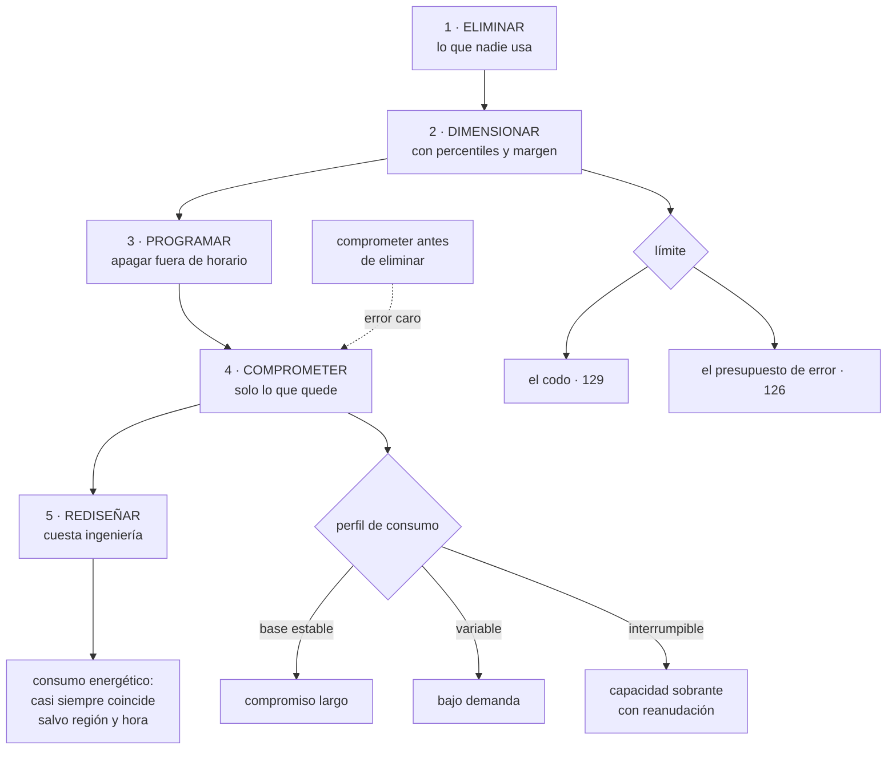

# 143 — Optimización de costo, capacidad y sostenibilidad

> [← 142 · FinOps: showback, chargeback, budgets y anomalías](../../part-11-security-governance-finops/142-finops-showback-chargeback-budgets-y-anomalias/README.md) · [Índice de la parte](../README.md) · [144 · Proyecto: landing zone con guardrails →](../../part-11-security-governance-finops/144-proyecto-landing-zone-con-guardrails/README.md)

**Parte:** 11 — Seguridad, gobierno, cumplimiento y FinOps<br>
**Nivel:** avanzado · **Horas estimadas:** 4<br>
**Laboratorio:** `finops` · **Estado:** `EXECUTABLE_CORE`

## 🎯 Propósito

Decidir qué hacer con el gasto una vez atribuido, en un orden que evita el error más caro de esta materia: **comprometerse a pagar durante tres años algo que se podía haber apagado**. La clase desarrolla la escalera —eliminar, dimensionar, programar, comprometer, rediseñar—, trata el dimensionado con la honestidad que exige la curva de la clase 129, y cierra con la parte energética sin exagerarla: casi toda la optimización de coste es también de consumo, y conviene saber en qué casos concretos no coinciden.

## 📚 Resultados de aprendizaje

Al finalizar podrás:

1. **Aplicar** la escalera de optimización en orden y no saltarse escalones.
2. **Dimensionar** con percentiles y margen, no con medias.
3. **Combinar** instrumentos de descuento por capas según la estabilidad del consumo.
4. **Usar** capacidad interrumpible en lo que la tolera, y solo ahí.
5. **Separar** lo que reduce consumo energético de lo que solo reduce factura.

## 🧩 Conceptos centrales

| Concepto | Comprensión verificable |
|---|---|
| `escalera de optimización` | Orden en el que se trabaja: eliminar, dimensionar, programar, comprometer y rediseñar. Saltárselo cuesta dinero. |
| `dimensionado` | Ajustar recursos al uso real, con margen hasta el codo. Se hace con percentiles, nunca con medias. |
| `compromiso` | Descuento a cambio de garantizar un gasto durante un periodo. Es una apuesta sobre tu propia arquitectura. |
| `capacidad interrumpible` | Recursos muy baratos que el proveedor puede retirar con poco aviso. Sirven solo para cargas que toleran la interrupción. |
| `intensidad de carbono` | Emisiones por unidad de energía consumida. Varía por región y por hora, y es donde coste y emisiones dejan de coincidir. |
| `tensión eficiencia-fiabilidad` | Reducir margen abarata y acerca al codo. El presupuesto de error decide el límite. |

## 🧠 Modelo mental

Gobernar no significa aprobar cada cambio: significa codificar límites, evidencia y responsabilidades para que los equipos puedan avanzar con seguridad.

Aplicado a esta clase, separa siempre cuatro planos: **intención** (qué necesita el usuario),
**configuración** (qué declaramos), **estado observado** (qué existe de verdad) y
**evidencia** (cómo sabemos que cumple). Confundirlos produce diseños que se ven correctos
en un diagrama pero fallan al operar.

## 🗺️ Flujo de razonamiento



## 📖 Desarrollo

### 1. La escalera, y por qué el orden importa

```text
1. ELIMINAR      lo que nadie usa               clase 142
2. DIMENSIONAR   ajustar lo que sí se usa
3. PROGRAMAR     apagar cuando no hace falta
4. COMPROMETER   descuento sobre lo que queda
5. REDISEÑAR     cambiar cómo funciona
```

Y el orden no es una preferencia: **cada escalón cambia la base sobre la que se calcula el siguiente**.

```text
comprometer antes de eliminar
  → se firma un descuento sobre capacidad que se iba a apagar
  → y ese compromiso impide apagarla, porque ya está pagada
  → resultado: el descuento cuesta dinero
```

Es el error de la clase 142 en su forma general, y ocurre porque los escalones 1 a 3 requieren trabajo y el 4 se firma en una tarde.

Y el rendimiento típico de cada escalón, como orden de magnitud:

```text
eliminar        10-30 % de la factura, sin riesgo y sin ingeniería
dimensionar     10-25 %, con riesgo si se hace mal
programar       5-15 %, concentrado en entornos inferiores
comprometer     20-40 % sobre lo que quede, con compromiso de gasto
rediseñar       muy variable, y cuesta semanas de ingeniería
```

Y una conclusión que sorprende: **los tres primeros escalones suelen dar más que el descuento**, y no requieren negociar nada.

Y el quinto merece un criterio explícito, porque es donde se pierde el tiempo:

```text
rediseñar compensa cuando el coste CRECE con el tamaño del negocio
no compensa cuando es un coste fijo pequeño
→ optimizar una consulta que cuesta 90 € al mes no vale dos semanas
→ optimizar el coste por pedido, sí
```

Y el límite que atraviesa toda la escalera, y que hay que enunciar antes de empezar:

```text
ninguna medida de eficiencia se aplica si consume el presupuesto
de error                                                clase 126
→ el margen no es desperdicio: es el tiempo de reaccionar
```

### 2. Dimensionar sin romper

El dimensionado es el escalón con más riesgo, porque acerca el sistema al codo de la clase 129.

Y el error habitual es usar medias:

```text
uso medio de procesador                       12 %
conclusión ingenua                            «sobra el 80 %»
uso en el percentil 99                        71 %
uso durante el cierre mensual                 94 %
```

La media de un sistema con picos **no describe nada**. La regla:

```text
se dimensiona con el percentil alto del periodo relevante
incluyendo los eventos periódicos: cierres, campañas, procesos nocturnos
y dejando el margen hasta el codo                       clase 129
```

Y qué mirar, por recurso:

```text
procesador        percentil 95-99, y el pico de los eventos conocidos
memoria           el máximo, no el percentil: quedarse sin memoria
                  no degrada, mata el proceso
disco             espacio y también operaciones por segundo
red               ancho de banda del pico
conexiones        saturación del agrupador                clase 109
```

La segunda línea es una diferencia importante: **la memoria no admite percentiles**.

Y dos consideraciones específicas de la nube:

```text
MEMORIA Y PROCESADOR VAN ACOPLADOS en muchos servicios
  → bajar memoria puede bajar el procesador y empeorar el tiempo
  → hay que medir el resultado, no suponerlo         clase 117

UNA FAMILIA DISTINTA puede ser mejor que un tamaño menor
  → cargas ligadas a memoria, a procesador o a red tienen familias propias
  → cambiar de familia suele rendir más que reducir el tamaño
```

**Programar** es el escalón más sencillo y el que menos se hace:

```text
entornos inferiores fuera de horario laboral
  → 168 horas a la semana → 45 útiles → 73 % de ahorro en esos entornos
bases de datos de desarrollo, paradas por la noche
capacidad reducida en horas valle en producción, si el perfil lo permite
```

Y lo que lo hace viable: **encender tiene que ser rápido y automático**, o alguien lo desactivará el primer día que necesite trabajar por la tarde. Es la ley 16 aplicada al ahorro.

### 3. Comprometer por capas, y lo interrumpible

Los instrumentos de descuento cambian de nombre en cada proveedor y se comportan igual:

```text
COMPROMISO DE GASTO O DE CAPACIDAD
  1 o 3 años, con o sin pago anticipado
  descuento mayor cuanto más rígido y más largo
  → es una apuesta a que tu arquitectura seguirá pareciéndose

CAPACIDAD SOBRANTE INTERRUMPIBLE
  60-90 % más barata
  el proveedor la retira con un aviso de minutos

NIVELES Y TARIFAS POR VOLUMEN
  descuentos automáticos por uso acumulado
```

Y la forma correcta de usarlos es **por capas**, según la estabilidad de cada tramo:

```text
consumo del último año, por horas, ordenado de mayor a menor

  ████████████████████████  base que SIEMPRE está    → compromiso a 3 años
  ██████████                lo habitual pero variable → compromiso a 1 año
  ████                      picos                      → bajo demanda
  ██                        trabajos que toleran corte → interrumpible
```

Y las reglas prácticas:

```text
no comprometer más del percentil bajo del consumo estable
  → comprometer al 100 % del uso actual es garantizar pagar de más
revisar cada trimestre, con dueño                       clase 142
y anotar la fecha de vencimiento como un riesgo, no como un trámite
```

Y el riesgo que hay que decir en voz alta: **un compromiso a tres años es una apuesta sobre tu propia arquitectura**. Si en dieciocho meses se migra a contenedores, a funciones o a otro proveedor, el compromiso sigue ahí.

**La capacidad interrumpible** es el descuento mayor y exige que la carga lo tolere:

```text
requisitos
  soportar que la instancia desaparezca con un aviso de minutos
  poder reanudar: puntos de control, o trabajo troceado e idempotente
  diversificar tipos y zonas, para que no se retire todo a la vez

encaja bien
  construcción y pruebas de la canalización              clase 097
  procesamiento por lotes y trabajos del lago            clase 112
  entornos efímeros                                      clase 104
  cargas sin estado con arranque rápido y un grupo de respaldo

no encaja
  bases de datos y cualquier cosa con estado local
  nada cuyo corte se note en el objetivo del servicio    clase 126
```

Y el error clásico: **usar capacidad interrumpible para algo que no puede reanudarse**, y descubrirlo el día que el proveedor retira el 40 % de golpe. La prueba pertinente es la de la clase 131: **quitar instancias a propósito y ver qué pasa**.

### 4. Rediseñar, datos y consumo energético

**Los rediseños con mayor multiplicador**, todos ya vistos en el programa:

```text
caché delante de lo caro                                clase 111
quitar llamadas repetidas: una consulta en vez de 340   clase 124
agrupar y procesar por lotes en vez de uno a uno        clase 112
llevar el cálculo al dato, y no el dato al cálculo
formato columnar y particionado                         clase 112
nivel de servicio adecuado: no todo necesita el más caro
y quitar funcionalidad que nadie usa
```

El último es el de mayor rendimiento y el que nunca se propone: **una funcionalidad sin usuarios cuesta cómputo, almacenamiento, mantenimiento y superficie de ataque**.

**En datos**, donde suele haber más grasa de la que parece:

```text
retención: ¿de verdad hacen falta 90 días calientes?    clases 122, 123
clases de almacenamiento, agrupando antes               clase 112
compresión y formato                                    clase 112
borrar lo que nadie consulta
copias de seguridad: cuántas generaciones y de qué
y entornos de pruebas con subconjuntos, no con copias completas
```

**El consumo energético.** Conviene tratarlo sin exagerar y sin ignorarlo:

```text
la energía consumida es, en primera aproximación,
proporcional a los recursos-hora usados
→ por tanto, casi toda optimización de coste reduce también consumo
→ eliminar, dimensionar y programar valen doble
```

Y los casos donde **no** coinciden, que son los específicos de esta materia:

```text
REGIÓN
  la intensidad de carbono varía mucho entre regiones
  → dos regiones con precio parecido pueden diferir por un factor grande
  → y la región también la deciden la latencia y la residencia (clase 141)

HORA
  la intensidad varía a lo largo del día según la generación
  → mover trabajos por lotes a horas de baja intensidad no cambia
    el coste y sí las emisiones

EFICIENCIA DEL HARDWARE
  familias más modernas hacen más trabajo por vatio
  → suele coincidir con mejor precio por unidad de trabajo

APROVECHAMIENTO
  una instancia al 15 % consume bastante más de un 15 %
  → consolidar cargas reduce energía más de lo que reduce coste
```

Y la parte honesta sobre la medición:

```text
las cifras las publica el proveedor, con metodologías distintas
no son comparables entre proveedores
y la mayor parte de las emisiones de un servicio digital suele
  estar fuera del cómputo: fabricación, red, dispositivos de usuario
→ conviene usarlas para decidir entre alternativas propias,
  no para afirmaciones absolutas
```

Y la tensión final, que cierra la clase:

```text
reducir margen abarata y acerca al codo
reducir réplicas abarata y reduce tolerancia a fallos
reducir retención abarata y reduce capacidad de investigar

→ el límite lo pone el presupuesto de error, no el objetivo de ahorro
→ si una medida de eficiencia consume presupuesto, se revierte
```

Y la lista de comprobación de la clase:

```text
☐ se ha eliminado lo no usado antes de dimensionar
☐ se ha dimensionado antes de comprometer
☐ el dimensionado usa percentiles altos y el máximo para memoria
☐ se han probado varias familias, no solo tamaños menores
☐ los entornos inferiores se apagan fuera de horario y encender es rápido
☐ los compromisos cubren la base estable, no el consumo total
☐ los compromisos se revisan cada trimestre y tienen dueño
☐ la capacidad interrumpible solo se usa donde la interrupción se tolera
☐ se ha ensayado la retirada de capacidad interrumpible
☐ los rediseños se eligen por si el coste crece con el negocio
☐ está medido el coste por unidad antes y después de cada medida
☐ ninguna medida de eficiencia consume presupuesto de error
☐ las decisiones de región consideran también intensidad de carbono
```

Y el cierre que enlaza con la clase siguiente: con esto está completo el material de la parte 11. La clase 144 monta la zona de aterrizaje con todo lo anterior aplicado desde el primer día y **califica las cinco predicciones de la clase 132**, empezando por la que decía que la ley 16 dominaría esta parte.

## 🔬 Ejemplo trabajado

**CloudShop aplica la escalera sobre los 28.900 € que quedaban tras la clase 142. El ejercicio incluye un dimensionado que provocó un incidente y una decisión de compromiso que estuvo a punto de repetir el error de partida.**

**Escalón 1: eliminar. Ya hecho en la clase 142.**

```text
compromiso mal dimensionado                          −5.700 €/mes
telemetría sin consultar                             −5.300 €/mes
huérfanos                                            −1.140 €/mes
```

**Escalón 2: dimensionar, y el incidente.**

El primer intento usó medias:

```text
15 servicios, uso medio de procesador                       14 %
propuesta automática de la herramienta      reducir a la mitad en 11
aplicado                                                     11
```

Y a los cuatro días:

```text
cierre mensual: el proceso de facturación necesita 3× la capacidad
servicios afectados                                           3
latencia p99                                        de 180 ms a 4,1 s
presupuesto de error consumido                              31 %
revertido en                                             22 min
```

El diagnóstico es el del apartado segundo: **la media no incluía el evento periódico**.

```text                                    por media       por percentil + eventos
servicios reducidos                          11                  7
reducción media aplicada                     50 %               28 %
ahorro                                    1.900 €/mes       1.180 €/mes
incidentes                                    1                  0
presupuesto de error consumido               31 %               0 %
```

Setecientos euros menos de ahorro y ningún incidente. Y se añadió una regla: **ninguna propuesta de dimensionado se aplica sin incluir los eventos periódicos conocidos**, que están en el calendario del negocio.

Y el cambio de familia, que rindió más que reducir tamaño:

```text                                    tamaño menor    familia optimizada
                                                          para memoria
servicio de catálogo, coste                −22 %              −34 %
latencia p99                               +41 %               −8 %
```

**Escalón 3: programar.**

```text
entornos inferiores                              3 (dev, pre, pruebas)
horas encendidos antes                          168 / semana
horas encendidos después                         50 / semana
ahorro                                        2.100 €/mes

condición para que se aceptara
  encender bajo demanda en menos de 3 minutos
  y encendido automático al abrir un cambio propuesto
```

Y sin esa condición no habría durado: en la primera semana, dos equipos desactivaron el apagado porque necesitaban trabajar por la tarde. **Con el encendido en tres minutos, nadie volvió a desactivarlo.**

**Escalón 4: comprometer, y la trampa evitada.**

La propuesta inicial del proveedor cubría el consumo completo del último mes:

```text
propuesta                    compromiso a 3 años sobre el 100 % del uso
descuento ofrecido                                        41 %
ahorro aparente                                       6.100 €/mes
```

Y la revisión con las reglas del apartado tercero encontró dos problemas:

```text
1. el uso del último mes incluía lo que se acababa de dimensionar
   y los entornos que ahora se apagan
   → el consumo real ya era un 31 % menor

2. había una migración prevista a contenedores en 8 meses
   para 4 de los 15 servicios
   → ese consumo cambiaría de forma
```

```text                                    propuesta inicial   decisión final
base comprometida a 3 años              100 % del uso      62 % (la base
                                        del mes anterior    estable medida
                                                            en 12 meses)
compromiso a 1 año                          —                18 %
bajo demanda                                 0 %             12 %
interrumpible                                0 %              8 %
descuento efectivo                          41 %             34 %
ahorro real                             6.100 € aparente   4.200 €/mes
riesgo de pagar capacidad no usada          alto             bajo
```

**Menos descuento nominal y más ahorro real**, porque no se compromete lo que se va a apagar.

**La capacidad interrumpible.**

```text
cargas evaluadas                                            15
toleran interrupción                                         4
  construcción y pruebas de la canalización                 sí
  trabajos del lago                                         sí
  entornos efímeros                                         sí
  reprocesado de eventos                                    sí

ahorro en esas cuatro                                  1.400 €/mes
```

Y el ensayo de la clase 131, hecho antes de confiar en ello:

```text
se retiró el 60 % de la capacidad interrumpible a propósito

construcción y pruebas    reanudaron; +9 min en la canalización     ✓
trabajos del lago         reanudaron desde el último punto           ✓
entornos efímeros         se recrearon solos                         ✓
reprocesado de eventos    PERDIÓ el progreso: no había punto
                          de control; 4 h de trabajo repetido        ✗
```

El cuarto se corrigió antes de dejarlo en interrumpible. **Sin el ensayo, se habría descubierto un domingo.**

**Escalón 5: rediseñar, con el criterio del coste unitario.**

```text
candidatos                              coste actual   ¿crece con el negocio?
recomendaciones, 0,038 €/pedido           4.100 €/mes         sí   → hacer
consulta del catálogo                        90 €/mes         no   → no hacer
formato del lago (ya columnar)                —                —   → hecho
llamadas repetidas en 2 endpoints           310 €/mes         sí   → hacer
```

```text                                          antes         después
coste por pedido de recomendaciones          0,038 €        0,011 €
esfuerzo                                        —          3 semanas
ahorro                                          —        2.900 €/mes
```

Y la consulta de 90 € al mes **no se optimizó**, deliberadamente y por escrito.

**El consumo energético.**

```text
recursos-hora consumidos                     −38 % tras la escalera
emisiones estimadas por el proveedor         −41 %
```

Y las dos decisiones específicas, que no cambiaron el coste:

```text
REGIÓN de los trabajos por lotes
  se movieron los del lago a una región con menor intensidad de carbono
  restricción: los datos personales no salen de Europa   clase 141
  → solo pudieron moverse los agregados sin datos personales
  coste                                              +2 %
  emisiones estimadas de esos trabajos              −34 %

HORA de ejecución
  los procesos nocturnos se desplazaron 3 horas
  coste                                               igual
  emisiones estimadas                                −11 %
```

Y lo que se escribió como límite honesto:

```text
las cifras las publica el proveedor, con su metodología
no son comparables con las de otro proveedor
y la mayor parte de las emisiones del producto está fuera del cómputo
→ se usan para elegir entre alternativas propias, no para afirmar nada
  en términos absolutos
```

**El resultado de la escalera.**

```text                                          €/mes acumulado
punto de partida (tras la clase 142)              28.900
dimensionar                                       −1.180
programar                                         −2.100
comprometer                                       −4.200
rediseñar                                         −2.900
                                                 ───────
                                                  18.520
```

```text                                    inicio parte 11    final
factura mensual                            41.200 €       18.520 €
coste por pedido                            0,229 €        0,057 €
pedidos mensuales                           180.000        325.000
recursos-hora                                  —             −38 %
incidentes causados por optimización            —              1
presupuesto de error consumido por eficiencia   —          31 % (una vez)
compromisos revisados trimestralmente          no             sí
cargas en capacidad interrumpible                0              4
ensayo de retirada de interrumpible             no         semestral
```

**La lección que esta clase traslada a la parte 11**: la propuesta de compromiso que ofrecía un 41 % de descuento habría producido **menos ahorro real que la que ofrecía un 34 %**, porque cubría capacidad que estaba a punto de desaparecer. Y el único incidente de todo el ejercicio lo causó dimensionar con medias en un sistema con cierres mensuales: **la media de un sistema con picos no describe nada**, y aplicarla consumió el 31 % del presupuesto de error para ahorrar setecientos euros.

## 🧪 Laboratorio guiado

Ejecuta desde la raíz:

```bash
python classes/part-11-security-governance-finops/143-optimizacion-de-costo-capacidad-y-sostenibilidad/lab.py
```

El laboratorio selecciona el motor de práctica **`finops`** y produce
`lab_result.json`. El escenario, sus comprobaciones y el artefacto esperado corresponden a
esta clase; no requiere credenciales y deja explícito qué debe revalidarse en un sandbox real.

1. Lee `exercise.steps` y formula una predicción antes de ejecutar.
2. Ejecuta la práctica y verifica todos los elementos de `checks`.
3. Provoca el caso de `negative_test` y explica la señal observada.
4. Materializa `backlog-optimizacion` en `evidence/` usando la plantilla indicada.
5. Para proveedor real, sigue `sandbox.requires`, registra costo y ejecuta `destroy`.

### Evidencia esperada

El artefacto principal es un cálculo trazable con unidad, supuesto y sensibilidad. Además, la entrega debe incluir el comando ejecutado,
la salida estructurada y una conclusión que no exceda lo observado.

## 🏆 Reto verificable

Construye **`backlog-optimizacion`** para el caso CloudShop. Incluye una alternativa descartada,
un supuesto que pueda falsarse, una prueba de fallo y una decisión de rollback.

## ✅ Criterio de aceptación

- [ ] `lab.py` termina con código 0 y genera JSON válido.
- [ ] La entrega conecta al menos tres requisitos con mecanismos verificables.
- [ ] Existe una prueba positiva y una prueba negativa con evidencia.
- [ ] Seguridad, costo y operación aparecen como decisiones, no como anexos.
- [ ] Se declara una limitación y una condición que obligaría a revisar el diseño.
- [ ] Otra persona puede repetir el recorrido sin conocimiento tácito.

## ⚠️ Errores frecuentes

| Síntoma | Causa probable | Corrección |
|---|---|---|
| Se firma un descuento y el ahorro esperado no aparece | Se comprometió capacidad que se iba a eliminar, dimensionar o apagar | Recorre la escalera en orden: elimina, dimensiona y programa antes de comprometer, y compromete solo la base estable medida en doce meses. |
| Reducir tamaños provoca un incidente en el cierre mensual | Se dimensionó con la media, que no incluye los eventos periódicos | Usa percentiles altos, incluye los eventos del calendario de negocio y el máximo para memoria. |
| El apagado de entornos fuera de horario se desactiva a la semana | Ley 16: encender es lento y estorba | Haz que encender tarde minutos y sea automático al abrir un cambio propuesto. |
| El proveedor retira capacidad interrumpible y se pierde trabajo | Se usó para una carga que no puede reanudarse | Exige puntos de control o trabajo troceado e idempotente, diversifica tipos y zonas, y ensaya la retirada antes de confiar. |
| Se dedican semanas a optimizar algo que apenas cuesta | No se distingue el coste fijo del que crece con el negocio | Rediseña solo lo que aparece en el coste por unidad; deja documentado lo que se decide no optimizar. |
| La eficiencia mejora y la fiabilidad empeora | Se recortó el margen hasta el codo | El presupuesto de error es el límite: si una medida de eficiencia lo consume, se revierte. |

## 🛡️ Seguridad, ética y costo

Trabaja con cuentas propias o sandboxes autorizados. No publiques secretos, identificadores
reales ni datos personales. Antes de crear recursos pagos define presupuesto, etiquetas y
comando de destrucción; después verifica que no queden recursos huérfanos. Los ejemplos
locales enseñan contratos, pero no certifican cumplimiento ni disponibilidad de producción.

## ❓ Preguntas de comprobación

1. ¿Por qué comprometer antes de eliminar cuesta dinero?
2. ¿Por qué la media no sirve para dimensionar y qué se usa en su lugar?
3. ¿Cómo se reparte el consumo entre compromiso, bajo demanda e interrumpible?
4. ¿Qué requisitos tiene una carga para poder usar capacidad interrumpible?
5. ¿En qué casos concretos dejan de coincidir la reducción de coste y la de emisiones?

## 🔗 Referencias

- FinOps Foundation (2025). *Rate and usage optimization* — escalera de optimización y orden de aplicación. <https://www.finops.org/framework/capabilities/>
- AWS (2025). *Savings Plans, Reserved Instances and Spot best practices* — instrumentos y su combinación por capas. <https://docs.aws.amazon.com/whitepapers/latest/cost-optimization-reservation-models/>
- Google Cloud (2025). *Committed use discounts and Spot VMs* — compromisos y capacidad interrumpible. <https://cloud.google.com/compute/docs/instances/spot>
- Green Software Foundation (2025). *Software carbon intensity specification* — intensidad por región y por hora. <https://sci.greensoftware.foundation/>
- Microsoft (2025). *Sustainability in the cloud: emissions reporting caveats* — límites de comparabilidad de las cifras. <https://learn.microsoft.com/azure/architecture/framework/sustainability/>
- Documentación oficial vigente del servicio implementado; registra URL y fecha de consulta.

---

> [Evaluación](assessment.md) · [Contrato de clase](lesson.yaml) · [Índice de la parte](../README.md)

| Anterior | Índice | Siguiente |
|---|---|---|
| [← 142 · FinOps: showback, chargeback, budgets y anomalías](../../part-11-security-governance-finops/142-finops-showback-chargeback-budgets-y-anomalias/README.md) | [Parte 11](../README.md) · [Programa](../../README.md) | [144 · Proyecto: landing zone con guardrails →](../../part-11-security-governance-finops/144-proyecto-landing-zone-con-guardrails/README.md) |
