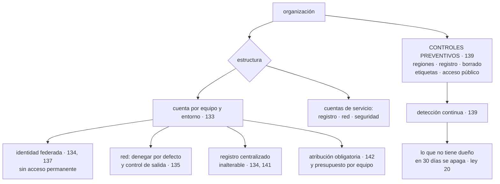

# 144 — Proyecto: landing zone con guardrails

> [← Clase anterior](../../part-11-security-governance-finops/143-optimizacion-de-costo-capacidad-y-sostenibilidad/README.md) · [Índice de la parte](../README.md) · [Clase siguiente →](../../part-12-cloud-native-distributed-architecture/145-requisitos-restricciones-y-atributos-de-calidad/README.md)

**Parte:** 11 — Seguridad, gobierno, cumplimiento y FinOps<br>
**Nivel:** avanzado · **Horas estimadas:** 8<br>
**Laboratorio:** `capstone` · **Estado:** `EXECUTABLE_CORE`

## 🎯 Propósito

Montar la base sobre la que se despliega todo lo demás —estructura de cuentas, identidad, red, controles preventivos, registro, atribución y presupuestos— con lo de las clases 133 a 143 aplicado desde el primer día en vez de añadido después. Y cerrar la parte con las tres piezas de siempre: **calificar las cinco predicciones de la clase 132**, una de las cuales falló y otra se cumplió de forma más amplia de lo previsto; incorporar la ley que esta parte ha hecho aparecer cinco veces; y escribir la predicción que la parte 12 tendrá que corregir.

## 📚 Resultados de aprendizaje

Al finalizar podrás:

1. **Ordenar** los elementos de una base de nube por lo que hacen imposible después.
2. **Montar** la estructura con controles preventivos y atribución obligatoria.
3. **Calificar** las cinco predicciones de la clase 132 con evidencia.
4. **Incorporar** la ley 20 al cuestionario, con sus cinco apariciones.
5. **Escribir** la predicción de la parte 12 en términos que se puedan desmentir.

## 🧩 Conceptos centrales

| Concepto | Comprensión verificable |
|---|---|
| `zona de aterrizaje` | Base preconfigurada donde se despliegan las cargas: estructura, identidad, red, controles, registro y atribución. |
| `control preventivo` | Política que impide una acción, aunque quien la intente tenga permisos. Es lo único que no se rodea. |
| `atribución obligatoria` | Etiquetas de dueño impuestas en la creación. Sin ellas, la seguridad y el coste comparten el mismo agujero. |
| `ley 20` | La falta de dueño es la causa común de la fuga y del despilfarro: lo que no tiene responsable no se apaga, no se corrige y no se retira. |
| `calificación de hipótesis` | Comparar lo predicho con lo ocurrido, publicando también lo que se predijo mal. |
| `hipótesis de la parte 12` | Predicción escrita ahora sobre lo que ocurrirá cuando el sujeto sea la arquitectura y sus decisiones. |

## 🧠 Modelo mental

Gobernar no significa aprobar cada cambio: significa codificar límites, evidencia y responsabilidades para que los equipos puedan avanzar con seguridad.

Aplicado a esta clase, separa siempre cuatro planos: **intención** (qué necesita el usuario),
**configuración** (qué declaramos), **estado observado** (qué existe de verdad) y
**evidencia** (cómo sabemos que cumple). Confundirlos produce diseños que se ven correctos
en un diagrama pero fallan al operar.

## 🗺️ Flujo de razonamiento



## 📖 Desarrollo

### 1. Qué va en la base y en qué orden

Una zona de aterrizaje no es un producto: es **el conjunto de decisiones que después no se pueden cambiar sin migrar**. Por eso el criterio de orden es cuál hace imposible a las demás.

```text
1. ESTRUCTURA DE CUENTAS O PROYECTOS
   una por equipo y entorno, más las de servicios comunes
   → es la frontera más fuerte que existe            clase 133
   → y cambiarla después es mover todo lo que contiene

2. CONTROLES PREVENTIVOS DE LA ORGANIZACIÓN
   lo que nunca debe ocurrir, aunque haya permisos    clase 139
   → regiones permitidas, registro que no se puede desactivar,
     borrado de copias prohibido, etiquetas obligatorias,
     acceso público bloqueado

3. IDENTIDAD
   federación para personas y para cargas             clases 134, 137
   sin acceso permanente a lo sensible
   sin claves de larga duración

4. RED
   denegar por defecto entre servicios                clase 135
   puntos de acceso privados y control de salida

5. REGISTRO Y EVIDENCIA
   auditoría centralizada, en una cuenta que nadie más puede tocar
   inalterable                                        clases 134, 141

6. ATRIBUCIÓN Y PRESUPUESTO
   etiquetas impuestas al crear, presupuesto por equipo
                                                      clase 142

7. DETECCIÓN CONTINUA
   sobre todo lo anterior, incluida la comprobación de que sigue activo
                                                      clase 139
```

Y las tres decisiones de esa lista que son irreversibles en la práctica:

```text
la estructura de cuentas
el dominio de identidad y su federación
y el esquema de etiquetado
```

Y una regla que ahorra rehacerlo todo al segundo año: **la base se declara como infraestructura desde el primer día**. Una zona de aterrizaje montada a mano no se puede reproducir, ni auditar, ni corregir en el origen.

Y el error más común al montarla, que conviene enunciar:

```text
hacerla tan restrictiva que los equipos pidan excepciones para todo
→ y entonces la excepción se convierte en el camino normal
→ ley 16, otra vez
```

Y la contramedida es la de la clase 106: **la base tiene que ser el camino más rápido**, con un procedimiento de creación de proyecto que tarde minutos y traiga todo montado.

### 2. El proyecto

Montar la base y comprobarla. Lo que hay que entregar:

```text
1. ESTRUCTURA declarada, con jerarquía y nomenclatura
   y un procedimiento de alta de proyecto que tarde minutos

2. CONTROLES PREVENTIVOS, con prueba negativa cada uno
   regiones · registro · borrado de copias · acceso público
   etiquetas obligatorias · claves de larga duración prohibidas

3. IDENTIDAD
   federación para personas y cargas
   concesión temporal más rápida que cualquier atajo
   acceso de emergencia preparado, con revisión obligatoria
   fronteras de permisos

4. RED
   denegar por defecto, alcanzada por observar y avisar
   puntos privados, salida con lista de permitidos
   registro de consultas de nombres

5. DATOS
   clasificación al recoger
   claves por ámbito, con inventario de qué protege cada una
   estrategia de borrado para lo inmutable

6. CADENA DE SUMINISTRO
   repositorio interno como único origen
   nombres internos reservados
   embudo de priorización y cadencia de reconstrucción

7. GOBIERNO Y COSTE
   etiquetas impuestas, reparto de compartidos escrito
   coste por unidad publicado
   presupuesto por equipo con aviso por previsión
   regla de apagado por falta de dueño

8. EVIDENCIA
   consultas guardadas para cada control
```

Y las preguntas cuya respuesta hay que escribir:

```text
¿cuántas cuentas hay? ¿coincide con la facturación?
¿desde dónde se llega a qué, partiendo de cada punto de entrada?
¿cuántos permisos concedidos no se usan?
¿qué destinos externos usa cada carga?
¿dónde acaban los registros y la telemetría?
¿qué proporción del gasto no está atribuida?
¿qué controles preventivos hay y cuándo se probó cada uno?
```

**Las pruebas negativas de la parte 11**, que son la entrega más valiosa:

```text
☐ intentar crear un recurso sin etiquetas de dueño
☐ intentar crear algo en una región no permitida
☐ intentar desactivar el registro de auditoría
☐ intentar borrar una copia de seguridad
☐ intentar hacer público un almacén
☐ intentar alcanzar producción desde un entorno inferior
☐ intentar sacar datos a un destino externo no declarado
☐ pedir un acceso temporal y cronometrarlo
☐ usar el acceso de emergencia y comprobar que avisa
☐ publicar un paquete con el nombre de uno interno
☐ dejar un recurso sin dueño 30 días
```

Y una advertencia sobre las once: **si alguna pasa, el control no existe aunque esté configurado**.

### 3. Calificación de las cinco predicciones

**Predicción 1: «la ley dominante será la 16; más de la mitad de los ejemplos serán controles implantados y luego rodeados, no controles ausentes».**

```text
veredicto: PARCIALMENTE EQUIVOCADA
```

El reparto real de los problemas tratados en las clases 133 a 143:

```text
controles implantados y rodeados o desactivados                8
  filtro de aplicación en aviso 14 meses            135
  revisión trimestral aprobada entera               134
  rotación no ejecutada por exigir reinicio         137
  validación de certificados desactivada            136
  apagado de entornos desactivado la primera semana 143
  cuentas compartidas y accesos alternativos        133
  corrección automática revertida                   139
  compromiso firmado y no revisado                  142

controles AUSENTES o cosas que nadie paró                      9
  9 cuentas fuera de todo inventario                139
  almacén público 19 meses                          139
  salida a un ex-proveedor durante 11 meses         135
  firma de avisos sin validar 14 meses              140
  registros y telemetría fuera de la región         141
  sin cifrado interno entre servicios               136
  nombres internos sin reservar                     138
  compromiso sin dueño 14 meses                     142
  reglas que no detectaban nada                     139
```

Ni la mitad. Y el error es informativo: **la ley 16 apareció mucho y no dominó**, porque en esta parte la mayoría de los hallazgos graves fueron cosas que **nadie había puesto o nadie había parado**, no controles esquivados.

**Predicción 2: «el gasto mayor no será el que nadie optimizaba: será capacidad para un pico que ya no ocurre o datos que nadie lee. Y el mayor ahorro individual superará la suma de los tres siguientes».**

```text
primera parte:  ACERTADA, y en las dos formas previstas a la vez
segunda parte:  EQUIVOCADA
```

```text
partida mayor      compromiso para una campaña que dejó de
                   celebrarse hace 14 meses         24 % de la factura
partida segunda    telemetría que nadie consultaba  16 %

mayor ahorro individual (compromiso)             5.700 €/mes
suma de los tres siguientes                      8.340 €/mes
→ no lo supera
```

Y lo que la segunda parte no vio: **el ahorro estaba repartido**, no concentrado. Doce medidas de entre 900 y 5.700 euros produjeron más que cualquiera de ellas.

**Predicción 3: «la ley 19 reaparecerá en forma financiera: un mecanismo automático ocultando un problema de coste durante meses».**

```text
veredicto: ACERTADA en el mecanismo, EQUIVOCADA en la duración
```

```text
lo ocurrido   una consulta sin índice; el autoescalado la absorbió
              sin caída, sin alerta y sin queja
              coste: 2.660 € en 14 días
lo predicho   meses
```

Y el motivo del error es un acierto de la parte anterior: **la detección diaria de desviación, montada en la clase 142, redujo a catorce días lo que sin ella habrían sido meses**.

**Predicción 4: «lo más difícil será la atribución, y la respuesta recurrente será el catálogo».**

```text
veredicto: ACERTADA, y se quedó corta
```

```text
la atribución bloqueó tres clases enteras
  139   3 semanas antes de poder repartir un solo hallazgo
  141   5 sistemas con datos personales fuera del inventario
  142   69 % del gasto sin dueño
```

Y lo que la predicción no vio: **el catálogo no bastaba**. Hizo falta añadirle un control preventivo —etiquetas impuestas en la creación— porque un catálogo se llena con buena voluntad y la buena voluntad caduca.

**Predicción 5: «seguridad y coste resultarán ser el mismo problema: recursos que existen sin dueño y sin que nadie sepa por qué».**

```text
veredicto: ACERTADA, y demostrable con los MISMOS sucesos
```

```text
suceso                                    seguridad        coste
9 cuentas fuera del inventario         almacén público   gasto sin atribuir
salida al ex-proveedor, 11 meses       fuga de datos     tráfico pagado
recursos huérfanos                     superficie        1.140 €/mes
permisos sin usar (85 %)               alcance de un     —
                                       compromiso
compromiso sin dueño, 14 meses         —                 9.800 €/mes
```

Cinco sucesos que aparecen en las dos columnas o que tienen la misma causa. Era la predicción que podía salir del revés, y salió confirmada.

### 4. La ley 20, el recuento y la hipótesis de la parte 12

```text
LEY 20
  La falta de dueño es la causa común de la fuga y del despilfarro.
  Lo que no tiene responsable no se apaga, no se corrige y no se retira;
  y cada mes que sigue existiendo suma riesgo y factura.
```

Sus cinco apariciones en esta parte:

```text
clase 139   9 cuentas sin dueño; una con un almacén público 19 meses
clase 135   un proceso enviando informes a un ex-proveedor 11 meses
clase 141   5 sistemas con datos personales fuera del inventario
clase 142   compromiso de 9.800 €/mes sin revisar durante 14 meses
clase 134   85 % de los permisos concedidos y nunca usados
```

Y lo que añade al cuestionario:

```text
¿quién es el dueño de esto, con nombre?
¿qué pasa si esa persona se va?
¿qué lo apagaría si dejara de hacer falta?
¿cuánto tiempo puede existir sin que nadie lo mire?
```

La cuarta es la que más rinde, porque tiene respuesta numérica y se puede vigilar.

Y su relación con las dos leyes vecinas:

```text
ley 13   algo deja de funcionar y no da error
ley 19   algo funciona demasiado bien y tapa un problema
ley 20   algo existe y no es de nadie
```

**Recuento tras la parte 11:**

```text
ley 13  el bucle que no corre no da error                        22
ley 15  una señal con demasiados elementos deja de ser señal     20
ley 16  un control que estorba acaba desactivado o rodeado       18
ley 14  las decisiones de creación son irreversibles             11
ley 11  lo que entra en un sistema de solo-añadir se queda        9
ley 20  lo que no tiene dueño no se apaga ni se corrige           5
        NUEVA en esta parte
ley 19  lo que compensa un fallo lo vuelve invisible              6
ley 18  lo asíncrono traslada la garantía, no la elimina          5
ley 17  la medida que se vuelve objetivo se alcanza sin mejorar   6
```

**La hipótesis de la parte 12.** La parte siguiente cambia el sujeto a la arquitectura: requisitos, límites, división en servicios, consistencia, replicación, contratos y multi-inquilino. La predicción, escrita para poder desmentirla:

```text
1. La parte 12 no introducirá mecanismos nuevos: NOMBRARÁ y ordenará
   decisiones que las partes 05 a 11 ya tomaron sin saberlo.
   → predigo que más de la mitad de sus clases formalizarán algo
     ya hecho: la consistencia por operación (109, 110, 111),
     la resiliencia (130), los contratos (115, 118), el aislamiento
     por inquilino (136, 118)

2. La ley dominante será la 14 —las decisiones de creación son
   irreversibles—, porque la arquitectura ES un conjunto de decisiones
   de creación.
   → y predigo que tendrá más apariciones en la parte 12 que en
     cualquier otra parte por separado (el máximo hasta ahora son 3)

3. La clase más difícil será la de dividir el sistema, y la conclusión
   honesta será que la división la deciden la propiedad de los datos y
   los equipos, NO la tecnología.
   → es decir, que la clase 147 determina la 148, y no al revés

4. El hallazgo recurrente será que la arquitectura documentada NO
   coincide con el sistema real, como ya ocurrió con las 18 dependencias
   no documentadas de la clase 124 y las 35 conexiones de la 135.
   → y predigo que el único artefacto que sobrevive es el que se escribe
     en el momento de decidir, no el diagrama que alguien mantiene

5. Y la predicción que puede salir del revés: «monolito o microservicios»
   resultará ser la decisión MENOS importante de la parte, y las
   consecuentes serán la propiedad de los datos, la consistencia por
   operación y el contrato.
```

Y lo que se anota para calificar sin trampa:

```text
lo que ya sabemos    que la documentación diverge, medido dos veces
lo que creemos       que la división es un problema de datos y de equipos
lo que no sabemos    si la quinta es cierta o si la forma de dividir
                     domina de verdad los resultados
```

## 🔬 Ejemplo trabajado

**CloudShop rehace su base con todo lo de la parte 11 aplicado desde el principio, y la somete a las once pruebas negativas. Después, el recuento de la parte y las cifras con las que se califican las predicciones.**

**La estructura resultante.**

```text
cuentas antes                                                   23
  de ellas, sin dueño                                            9
cuentas después                                                 21
  por equipo y entorno                                          15
  de servicios comunes                                           6
    registro y auditoría (nadie más puede escribir)
    red compartida
    seguridad y detección
    repositorio interno de paquetes
    identidad
    facturación y presupuestos
```

Y el alta de un proyecto nuevo, que es lo que decide si la base se usa:

```text                                          antes         después
tiempo de alta de un proyecto                 6 días         14 min
qué trae montado                              nada       identidad, red,
                                                         registro, etiquetas,
                                                         presupuesto, detección
equipos que pidieron excepción a la base        —              1
  → un servicio heredado; documentada con fecha
```

**Las once pruebas negativas.**

```text
 1. crear un recurso sin etiquetas          rechazado            ✓
 2. crear en una región no permitida        rechazado            ✓
 3. desactivar el registro de auditoría     rechazado            ✓
 4. borrar una copia de seguridad           rechazado            ✓
 5. hacer público un almacén                rechazado            ✓
 6. alcanzar producción desde dev           bloqueado            ✓
 7. sacar datos a un destino no declarado   bloqueado            ✓
 8. pedir acceso temporal, cronometrado     87 s                 ✓
 9. usar el acceso de emergencia            avisó a 4 personas   ✓
                                            revisión abierta     ✓
10. publicar un paquete con nombre interno  el nombre está
                                            reservado            ✓
11. dejar un recurso sin dueño 30 días      apagado con aviso    ✓
```

Once de once. Y en la primera ronda fueron **ocho de once**:

```text
falló la 3   el registro se podía desactivar desde la cuenta de seguridad
             → la política no cubría la propia cuenta de seguridad
falló la 7   una carga tenía una excepción de salida caducada y activa
             → la caducidad no revocaba, solo avisaba
falló la 9   el aviso llegaba a un buzón de un equipo disuelto
             → el mismo hallazgo de las clases 131 y 134
```

Las tres se corrigieron antes de dar por terminada la base. **Ninguna se habría descubierto revisando la configuración.**

**El recuento de la parte 11.**

```text                                    inicio parte 11    final
claves de larga duración                        14              0
puntos de entrada con alcance total              1              0
puntos desde los que se obtiene otra credencial  4              0
servicios alcanzables desde uno comprometido  14 de 15        2 de 15
cuentas fuera de inventario                      9              0
almacenes públicos con datos                     1              0
destinos externos no declarados              sin límite         0
permisos concedidos                          8.940          2.100
sin usar nunca                                 85 %            9 %
acceso permanente humano a producción           19              0
secretos existentes                            159             29
entregados por variable de entorno             141              0
hallazgos de vulnerabilidad totales          47.180          2.400
que superan el embudo                            61              1
hallazgos de configuración de prioridad
inmediata                                       103              4
recursos sin dueño                            4.180              0
servicios fuera de la región exigida         5 de 9          0 de 9
tiempo de respuesta a un borrado             9 días          40 min
controles con evidencia consultable          12 de 61       58 de 61
factura mensual                             41.200 €       18.520 €
coste por pedido                             0,229 €        0,057 €
gasto atribuido                                31 %            94 %
controles preventivos con prueba negativa         0             11
```

**Las cifras de la calificación.**

```text
PREDICCIÓN 1 — ley 16 dominante, más de la mitad
  controles rodeados                          8
  controles ausentes o nadie los paró         9
  → no es más de la mitad: EQUIVOCADA

PREDICCIÓN 2 — partida mayor y ahorro concentrado
  partida mayor: compromiso para un pico que ya no ocurre  24 %  ✓
  segunda: telemetría que nadie lee                        16 %  ✓
  mayor ahorro 5.700 € frente a suma de tres siguientes 8.340 €  ✗

PREDICCIÓN 3 — ley 19 en forma financiera
  ocurrió: 2.660 € en 14 días por una consulta sin índice   ✓
  duración predicha: meses                                  ✗

PREDICCIÓN 4 — atribución como problema central
  bloqueó 3 clases; 69 % del gasto sin dueño                ✓
  y el catálogo NO bastó: hizo falta control preventivo     (matiz)

PREDICCIÓN 5 — seguridad y coste, el mismo problema
  5 sucesos aparecen en las dos columnas                    ✓
```

**Lo que la parte 11 no resolvió, dicho con claridad.**

```text
el empleado con acceso legítimo que exporta datos antes de irse
  → detección por volumen, y no prevención                clase 140
los metadatos que salen de la región igualmente          clase 141
la comparabilidad de las cifras de emisiones             clase 143
y el riesgo del compromiso a tres años: sigue siendo una apuesta
```

Las cuatro se documentaron como límites, no como pendientes.

**La conclusión que cierra la parte 11**: la base pasó las once pruebas negativas a la tercera intentona, y las tres que fallaron al principio —el registro desactivable desde la propia cuenta de seguridad, una excepción caducada que seguía activa y un aviso a un equipo disuelto— **no se habrían encontrado revisando la configuración**. Y de todos los hallazgos de la parte, los cinco más caros tenían la misma causa: nueve cuentas sin dueño, un proceso que nadie paró, cinco sistemas fuera del inventario, un contrato sin responsable y el 85 % de los permisos concedidos y jamás usados. **La seguridad y el coste resultaron ser el mismo problema, y ese problema se llama no saber de quién es cada cosa.**

## 🧪 Laboratorio guiado

Ejecuta desde la raíz:

```bash
python classes/part-11-security-governance-finops/144-proyecto-landing-zone-con-guardrails/lab.py
```

El laboratorio selecciona el motor de práctica **`capstone`** y produce
`lab_result.json`. El escenario, sus comprobaciones y el artefacto esperado corresponden a
esta clase; no requiere credenciales y deja explícito qué debe revalidarse en un sandbox real.

1. Lee `exercise.steps` y formula una predicción antes de ejecutar.
2. Ejecuta la práctica y verifica todos los elementos de `checks`.
3. Provoca el caso de `negative_test` y explica la señal observada.
4. Materializa `landing-zone-gobernada` en `evidence/` usando la plantilla indicada.
5. Para proveedor real, sigue `sandbox.requires`, registra costo y ejecuta `destroy`.

### Evidencia esperada

El artefacto principal es un incremento integrado, demostrable y documentado. Además, la entrega debe incluir el comando ejecutado,
la salida estructurada y una conclusión que no exceda lo observado.

## 🏆 Reto verificable

Construye **`landing-zone-gobernada`** para el caso CloudShop. Incluye una alternativa descartada,
un supuesto que pueda falsarse, una prueba de fallo y una decisión de rollback.

## ✅ Criterio de aceptación

- [ ] `lab.py` termina con código 0 y genera JSON válido.
- [ ] La entrega conecta al menos tres requisitos con mecanismos verificables.
- [ ] Existe una prueba positiva y una prueba negativa con evidencia.
- [ ] Seguridad, costo y operación aparecen como decisiones, no como anexos.
- [ ] Se declara una limitación y una condición que obligaría a revisar el diseño.
- [ ] Otra persona puede repetir el recorrido sin conocimiento tácito.

## ⚠️ Errores frecuentes

| Síntoma | Causa probable | Corrección |
|---|---|---|
| La base es tan restrictiva que todo el mundo pide excepciones | Ley 16: la excepción se convierte en el camino normal | Haz que la base sea el camino más rápido: alta de proyecto en minutos con todo montado, y mide cuántas excepciones se piden. |
| Los controles están configurados y no impiden nada | Nunca se han probado en negativo, y algunos no cubren las cuentas de servicio | Ejecuta las once pruebas negativas, incluidas las que atacan a las cuentas de seguridad y registro. |
| Una excepción caducada sigue funcionando | La caducidad avisa pero no revoca | Que la caducidad revoque de verdad, y compruébalo con una excepción de prueba. |
| La base se montó a mano y no se puede reproducir ni auditar | No está declarada como infraestructura | Declárala desde el primer día y corrígela en el origen, no en los recursos. |
| Se cambia la estructura de cuentas al segundo año | Es una de las tres decisiones irreversibles y se tomó sin pensarla | Decide estructura, dominio de identidad y esquema de etiquetado antes que nada; el resto se puede corregir después. |
| Se dan por buenas las predicciones sin comprobarlas | Calificar solo lo que salió bien convierte el aprendizaje en opinión | Publica el veredicto de cada predicción con su evidencia, incluidas la que falló y la que se quedó corta. |

## 🛡️ Seguridad, ética y costo

Trabaja con cuentas propias o sandboxes autorizados. No publiques secretos, identificadores
reales ni datos personales. Antes de crear recursos pagos define presupuesto, etiquetas y
comando de destrucción; después verifica que no queden recursos huérfanos. Los ejemplos
locales enseñan contratos, pero no certifican cumplimiento ni disponibilidad de producción.

## ❓ Preguntas de comprobación

1. ¿Qué tres decisiones de una zona de aterrizaje son irreversibles en la práctica?
2. ¿Por qué una base demasiado restrictiva acaba produciendo el efecto contrario?
3. ¿En qué se equivocó la predicción de que la ley 16 dominaría la parte 11?
4. ¿Qué dice la ley 20 y en qué se diferencia de las leyes 13 y 19?
5. ¿Qué predice la hipótesis de la parte 12 sobre la ley dominante y sobre la división en servicios?

## 🔗 Referencias

- AWS (2025). *Organizing your environment using multiple accounts* — estructura, controles y cuentas de servicio. <https://docs.aws.amazon.com/whitepapers/latest/organizing-your-aws-environment/>
- Google Cloud (2025). *Landing zone design* — jerarquía, identidad, red y controles de la organización. <https://cloud.google.com/architecture/landing-zones>
- Microsoft (2025). *Cloud Adoption Framework: landing zones* — áreas de diseño y su orden. <https://learn.microsoft.com/azure/cloud-adoption-framework/ready/landing-zone/>
- CIS (2025). *Foundations benchmarks* — controles mínimos de una base de nube. <https://www.cisecurity.org/cis-benchmarks>
- FinOps Foundation (2025). *Account and tagging strategy* — atribución impuesta desde la estructura. <https://www.finops.org/framework/capabilities/allocation/>
- Documentación oficial vigente del servicio implementado; registra URL y fecha de consulta.

---

> [Evaluación](assessment.md) · [Contrato de clase](lesson.yaml) · [Índice de la parte](../README.md)
