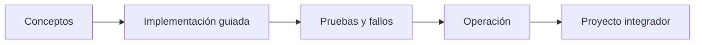

# Parte 11 — Seguridad, gobierno, cumplimiento y FinOps

> [← Parte 10](../part-10-observability-sre-reliability/README.md) · [Índice completo](../README.md) · [Parte 12 →](../part-12-cloud-native-distributed-architecture/README.md)

**Nivel:** avanzado · **Clases:** 12 · **Duración sugerida:** 6–8 semanas

Construir guardrails que hagan segura y económicamente sostenible la autonomía.

## Resultados de la parte

Al completar esta parte podrás explicar el dominio con lenguaje independiente del proveedor,
implementar sus mecanismos esenciales, diagnosticar fallos y defender decisiones mediante
evidencia, costo, seguridad y objetivos de confiabilidad.

## Modelo mental

Gobernar no significa aprobar cada cambio: significa codificar límites, evidencia y responsabilidades para que los equipos puedan avanzar con seguridad.

## Secuencia

## Clases

| ID | Clase | Laboratorio | Horas |
|---:|---|---|---:|
| 133 | [Zero Trust y defensa en profundidad](133-zero-trust-y-defensa-en-profundidad/README.md) | `security` | 4 |
| 134 | [Mínimo privilegio, acceso temporal y separación de funciones](134-minimo-privilegio-acceso-temporal-y-separacion-de-funciones/README.md) | `iam` | 4 |
| 135 | [Segmentación, perímetro, WAF, DDoS y egress](135-segmentacion-perimetro-waf-ddos-y-egress/README.md) | `network` | 4 |
| 136 | [Cifrado, KMS, HSM, rotación y envelope encryption](136-cifrado-kms-hsm-rotacion-y-envelope-encryption/README.md) | `security` | 4 |
| 137 | [Gestión de secretos y credenciales de workloads](137-gestion-de-secretos-y-credenciales-de-workloads/README.md) | `security` | 4 |
| 138 | [Vulnerabilidades, imágenes y cadena de suministro](138-vulnerabilidades-imagenes-y-cadena-de-suministro/README.md) | `supply-chain` | 4 |
| 139 | [CSPM, postura, policy as code y remediación](139-cspm-postura-policy-as-code-y-remediacion/README.md) | `governance` | 4 |
| 140 | [Threat modeling con STRIDE y attack paths](140-threat-modeling-con-stride-y-attack-paths/README.md) | `security` | 4 |
| 141 | [Cumplimiento, residencia, privacidad y evidencia](141-cumplimiento-residencia-privacidad-y-evidencia/README.md) | `compliance` | 4 |
| 142 | [FinOps: showback, chargeback, budgets y anomalías](142-finops-showback-chargeback-budgets-y-anomalias/README.md) | `finops` | 4 |
| 143 | [Optimización de costo, capacidad y sostenibilidad](143-optimizacion-de-costo-capacidad-y-sostenibilidad/README.md) | `finops` | 4 |
| 144 | [Proyecto: landing zone con guardrails](144-proyecto-landing-zone-con-guardrails/README.md) | `capstone` | 8 |

## Evaluación de la parte

- 35 % laboratorios y evidencia reproducible.
- 25 % retos verificables.
- 20 % decisiones y ADR.
- 10 % seguridad, confiabilidad y costo.
- 10 % proyecto integrador de la parte.

Se aprueba con 80 % de clases en nivel B o superior y el proyecto integrador reproducible.

## Pauta bibliográfica

- Practical Cloud Security — Chris Dotson.
- Cloud Security Handbook — Eyal Estrin.
- Cloud FinOps — Storment y Fuller.
