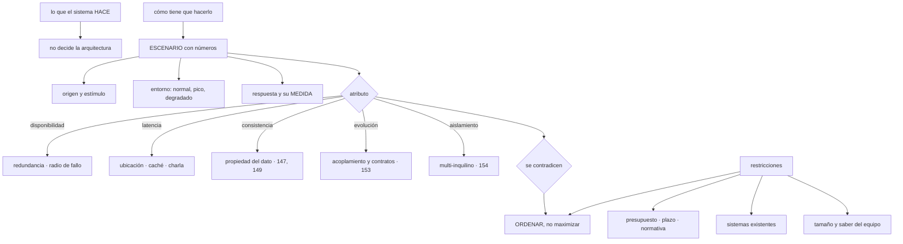

# 145 — Requisitos, restricciones y atributos de calidad

> [← Clase anterior](../../part-11-security-governance-finops/144-proyecto-landing-zone-con-guardrails/README.md) · [Índice de la parte](../README.md) · [Clase siguiente →](../../part-12-cloud-native-distributed-architecture/146-twelve-factor-app-y-configuracion-cloud-native/README.md)

**Parte:** 12 — Arquitectura cloud-native y sistemas distribuidos<br>
**Nivel:** avanzado-experto · **Horas estimadas:** 4<br>
**Laboratorio:** `architecture` · **Estado:** `EXECUTABLE_CORE`

## 🎯 Propósito

Abrir la parte de arquitectura por donde de verdad se decide: no por lo que el sistema hace, sino por **cómo tiene que hacerlo y a qué precio**. Dos sistemas con las mismas funciones y exigencias distintas de latencia, disponibilidad o consistencia no se parecen en nada por dentro. La clase enseña a escribir esas exigencias en forma comprobable en vez de adjetivos, a reconocer que **se contradicen entre sí y por tanto se ordenan en vez de maximizarse**, y a tratar las restricciones —presupuesto, plazos, normativa y tamaño del equipo— como lo que son: parte del diseño.

## 📚 Resultados de aprendizaje

Al finalizar podrás:

1. **Escribir** exigencias como escenarios con números en vez de adjetivos.
2. **Relacionar** cada atributo con las decisiones de arquitectura que fuerza.
3. **Ordenar** los atributos cuando entran en conflicto, en vez de exigirlos todos.
4. **Distinguir** restricción de requisito y tratar el equipo como restricción.
5. **Interrogar** un requisito hasta saber qué pasa si no se cumple.

## 🧩 Conceptos centrales

| Concepto | Comprensión verificable |
|---|---|
| `atributo de calidad` | Propiedad del sistema que no es una función: latencia, disponibilidad, consistencia, evolución, coste, operabilidad. |
| `escenario` | Enunciado con origen, estímulo, entorno, respuesta y medida. Convierte un adjetivo en algo que se puede comprobar. |
| `restricción` | Condición dada que no se negocia: presupuesto, plazo, normativa, sistemas existentes, tamaño y conocimientos del equipo. |
| `conflicto entre atributos` | Mejorar uno empeora otro. Es la razón por la que se ordenan en vez de exigirlos todos. |
| `orden de prioridad` | Lista corta de atributos que ganan cuando hay que elegir. Una lista de doce igual de críticos no decide nada. |
| `consecuencia del incumplimiento` | Qué pasa de verdad si no se cumple un requisito. Es la pregunta que revela si el número es real. |

## 🧠 Modelo mental

Una arquitectura es un conjunto de decisiones costosas de cambiar; su calidad se juzga contra escenarios concretos, no por la cantidad de servicios usados.

Aplicado a esta clase, separa siempre cuatro planos: **intención** (qué necesita el usuario),
**configuración** (qué declaramos), **estado observado** (qué existe de verdad) y
**evidencia** (cómo sabemos que cumple). Confundirlos produce diseños que se ven correctos
en un diagrama pero fallan al operar.

## 🗺️ Flujo de razonamiento



## 📖 Desarrollo

### 1. Lo que decide la arquitectura no es la función

Dos sistemas pueden tener la misma lista de funciones y no parecerse en nada:

```text
una tienda con 200 pedidos al día
una tienda con 200 pedidos por segundo

mismas funciones
y ninguna decisión de arquitectura en común
```

Lo que las separa son los **atributos de calidad**, y su problema habitual es que se enuncian como adjetivos:

```text
«tiene que ser escalable»          ¿cuánto, en cuánto tiempo, a qué coste?
«tiene que ser rápido»             ¿qué operación, con qué carga, qué percentil?
«tiene que ser seguro»             ¿frente a qué amenaza?          clase 136
«tiene que ser fiable»             ¿qué significa fallar?          clase 126
```

Ninguno de esos cuatro permite decidir nada. Y la corrección es escribirlos como **escenarios**, con cinco partes:

```text
ORIGEN      quién o qué provoca la situación
ESTÍMULO    qué ocurre
ENTORNO     en qué condiciones: normal, pico, con una dependencia caída
RESPUESTA   qué debe hacer el sistema
MEDIDA      con qué número se comprueba
```

Y el mismo requisito, escrito bien:

```text
mal   «el catálogo tiene que ser rápido»

bien  «un cliente que abre una ficha de producto (origen y estímulo)
       durante la campaña de noviembre, con 5.000 peticiones por
       segundo (entorno), recibe la página completa (respuesta)
       en menos de 500 ms en el percentil 99 (medida)»
```

Y la propiedad que lo hace útil: **se puede comprobar**. Con la clase 129 se mide, con la 126 se convierte en objetivo y con la 131 se ensaya el entorno degradado.

Y conviene escribir también los escenarios de **cambio**, que son los que deciden el acoplamiento:

```text
«añadir un método de pago nuevo, sin tocar el servicio de pedidos,
 en menos de una semana y sin parada»

«cambiar el proveedor de envíos afectando a un solo servicio»

«dar de alta un cliente empresarial con sus propios datos aislados
 en menos de un día»
```

Y los de **operación**, que la parte 10 dejó claros y que casi nunca se escriben:

```text
«cuando el servicio de pagos se degrada, el sistema sigue aceptando
 pedidos y alguien se entera en menos de dos minutos»
```

### 2. Qué decisión fuerza cada atributo

Los atributos que de verdad mueven la arquitectura, con lo que fuerzan y dónde se desarrolla en esta parte:

```text
DISPONIBILIDAD
  fuerza redundancia, conmutación, radio de fallo, dependencias opcionales
  → y su techo lo fija la cadena de dependencias           clase 126

LATENCIA
  fuerza ubicación de los datos, caché, y sobre todo NÚMERO DE SALTOS
  → cada frontera de servicio añade red, serialización y cola

CAUDAL Y CRECIMIENTO
  fuerza particionado, ausencia de estado local y colas
                                                          clases 110, 150

CONSISTENCIA
  fuerza quién es dueño de cada dato y qué es síncrono
                                                          clases 147, 149

EVOLUCIÓN
  fuerza acoplamiento, contratos y fronteras de equipo
                                                          clases 148, 153

AISLAMIENTO
  fuerza el modelo multi-inquilino y el reparto de recursos
                                                          clase 154

OPERABILIDAD
  fuerza observabilidad, procedimientos y capacidad de intervenir
                                                          parte 10

COSTE
  atraviesa todos los anteriores                          clase 155
```

Y una observación que este programa ya ha demostrado tres veces y que conviene tener presente aquí: **la latencia la deciden los saltos, no la velocidad de cada componente**. La escalera de 340 consultas de la clase 124 y el abanico con rezagado son problemas de arquitectura, no de código.

**Los conflictos**, que son la parte que hay que aceptar:

```text
consistencia fuerte      ←→  disponibilidad y latencia         clase 149
latencia baja            ←→  coste (réplicas, caché, cercanía)
aislamiento por inquilino ←→  coste y aprovechamiento           clase 154
flexibilidad             ←→  simplicidad y operabilidad
seguridad                ←→  facilidad de uso                   clase 133
evolución independiente  ←→  consistencia entre servicios
```

Y de ahí la regla central de la clase:

```text
NO SE MAXIMIZAN: SE ORDENAN

una lista de tres atributos que ganan cuando hay conflicto
es una decisión
una lista de doce «todos críticos» es no haber decidido
```

Y el complemento honesto, que casi nunca se escribe y evita discusiones eternas:

```text
lo que NO se está optimizando
  «no optimizamos para más de 10.000 clientes simultáneos»
  «no optimizamos para despliegues sin ninguna parada en la base»
  «no optimizamos coste por debajo de X mientras crezcamos»
```

Un diseño sin esa lista se defiende mal, porque cualquiera puede exigirle algo que nunca se propuso.

### 3. Restricciones, incluida la gente

Las restricciones no se negocian; se aceptan y se diseña con ellas.

```text
PRESUPUESTO Y PLAZO       lo que hay y para cuándo
NORMATIVA                 residencia, retención, evidencia    clase 141
SISTEMAS EXISTENTES       lo que no se puede tocar o sustituir ahora
CONTRATOS                 proveedores con los que ya se trabaja
CONOCIMIENTOS DEL EQUIPO  lo que el equipo sabe operar
TAMAÑO DEL EQUIPO         cuánta gente hay para mantener esto
```

Y las dos últimas se ignoran sistemáticamente, aunque son de las más determinantes:

```text
un sistema repartido en quince servicios con cuatro personas
→ nadie puede estar de guardia de quince cosas
→ y cada servicio necesita su canalización, su vigilancia y sus
  procedimientos: partes 08 y 10
```

Y la observación clásica que conviene enunciar sin misticismo:

```text
la forma de comunicación de los equipos acaba reflejándose
en la forma del sistema
→ dos equipos que no hablan producirán una frontera dura entre
  sus partes, exista o no en el diseño
→ y un servicio compartido por cuatro equipos tendrá cuatro dueños,
  que es lo mismo que ninguno            ley 20
```

Y su uso práctico: **si se quiere una frontera, hay que ponerle un equipo detrás**; y si no hay equipos para tantas fronteras, hay que poner menos.

**Interrogar un requisito** es la técnica que más tiempo ahorra. Las preguntas, en orden:

```text
1. ¿QUÉ PASA SI NO SE CUMPLE?
   si nadie sabe responder, el número no es real

2. ¿CUÁNDO HACE FALTA?
   «10 veces más carga» es distinto si es dentro de tres meses
   o dentro de tres años

3. ¿A QUÉ COSTE?
   cada nueve de disponibilidad tiene un precio     clase 126

4. ¿CON QUÉ FRECUENCIA OCURRE ESA SITUACIÓN?
   optimizar para un caso que se da una vez al año es caro

5. ¿QUÉ ESTAMOS DISPUESTOS A EMPEORAR PARA CONSEGUIRLO?
   si la respuesta es «nada», el requisito no se ha entendido
```

La primera y la quinta son las que separan un requisito de un deseo, y conviene hacerlas siempre, aunque incomoden.

### 4. Qué se entrega y para qué sirve

El resultado de esta clase es un documento corto que alimenta a todas las demás de la parte:

```text
1. entre 5 y 12 escenarios, con números, priorizados
2. el orden de los atributos cuando hay conflicto: tres, no doce
3. lo que NO se optimiza, explícito
4. las restricciones, incluidas las de equipo
5. los supuestos, con quién los verifica              clase 140
```

Y cómo se usa después, que es lo que lo hace algo más que un trámite:

```text
al elegir la división en servicios          clase 148
al decidir consistencia por operación       clase 149
al decidir replicación y particionado       clase 150
al fijar objetivos                          clase 126
al dimensionar y probar carga               clase 129
y al revisar una decisión, para saber si
  las premisas siguen siendo ciertas        clase 156
```

Y la propiedad que decide si sobrevive: **los escenarios caducan**.

```text
el tráfico crece o decrece
aparece una normativa nueva
cambia el modelo de negocio
el equipo se dobla o se reduce a la mitad
→ y una arquitectura correcta para los escenarios de hace tres años
  puede ser incorrecta hoy sin que nada haya fallado
```

Por eso conviene revisarlos con la misma cadencia con la que se revisan las decisiones, y anotar en cada uno **de qué fecha es y quién lo dio por bueno**.

Y dos antipatrones frecuentes de esta materia:

```text
DISEÑAR PARA UNA ESCALA QUE NO EXISTE
  «por si llegamos a un millón de usuarios»
  → se paga complejidad hoy por un escenario incierto
  → la pregunta 2 y la 4 lo resuelven

NO DISEÑAR PARA UNA ESCALA QUE SÍ LLEGA
  ignorar un crecimiento conocido porque «ya lo veremos»
  → y entonces se paga una migración: clases 110 y 114
```

Y el criterio entre los dos: **diseñar para el escenario conocido y dejar abierta la puerta al siguiente**, sabiendo cuáles son las decisiones que no se podrán deshacer —clave de partición, número de particiones, propiedad de los datos— y decidiendo esas con más cuidado que las demás.

Y la lista de comprobación de la clase:

```text
☐ cada exigencia está escrita como escenario con medida
☐ hay escenarios de cambio y de operación, no solo de rendimiento
☐ los atributos están ordenados: tres ganan cuando hay conflicto
☐ está escrito lo que NO se optimiza
☐ las restricciones incluyen tamaño y conocimientos del equipo
☐ hay un equipo detrás de cada frontera que se quiera dura
☐ cada requisito ha pasado por las cinco preguntas
☐ los escenarios llevan fecha y quién los dio por bueno
☐ se sabe cuáles de las decisiones derivadas serán irreversibles
```

Y el cierre que enlaza con la clase siguiente: antes de decidir cómo se divide el sistema, conviene fijar cómo se comporta cada pieza para que pueda vivir en la nube —arrancar, configurarse, escalar y morir sin ceremonia—, que es la materia de la clase 146.

## 🔬 Ejemplo trabajado

**CloudShop va a rediseñar su plataforma y empieza escribiendo los escenarios. El ejercicio dura dos sesiones y produce tres resultados: dos exigencias que se contradicen, un requisito que nadie pudo justificar y una restricción que nadie había puesto por escrito.**

**Los escenarios, tal como quedaron.**

```text
E1  RENDIMIENTO
    un cliente abre una ficha de producto durante la campaña de noviembre,
    con 5.000 peticiones/s
    → página completa en menos de 500 ms, percentil 99

E2  DISPONIBILIDAD
    el proveedor de pago deja de responder durante 30 minutos
    → el sistema sigue aceptando pedidos y los cobra después
    → ningún pedido perdido; el cliente ve un estado «en proceso»

E3  CONSISTENCIA
    dos clientes compran la última unidad con 50 ms de diferencia
    → uno la consigue y el otro recibe un mensaje claro
    → nunca se venden dos

E4  CAMBIO
    añadir un método de pago nuevo
    → sin tocar el servicio de pedidos, en menos de una semana,
      sin parada

E5  AISLAMIENTO
    dar de alta un cliente empresarial con datos separados
    → en menos de un día, sin que su carga afecte a los demás

E6  OPERACIÓN
    una dependencia se degrada
    → alguien se entera en menos de 2 minutos y el sistema sigue
      sirviendo lo que no depende de ella

E7  CRECIMIENTO
    el número de pedidos se multiplica por 4 en 18 meses
    → sin rediseño y con coste por pedido que no suba

E8  NORMATIVO
    un cliente europeo exige que sus datos no salgan del espacio europeo
    → incluidos registros, telemetría y copias           clase 141
```

**El conflicto: E2 contra E3.**

```text
E2 pide seguir aceptando pedidos con el pago caído
E3 pide no vender nunca dos veces la última unidad

y si el pago está caído y se acepta el pedido:
  o se reserva la unidad sin cobrar         → se puede quedar reservada
  o no se reserva                           → se puede vender dos veces
```

No hay solución que cumpla los dos al 100 %. La discusión duró cuarenta minutos y terminó con una decisión explícita:

```text
prioridad   E3 gana sobre E2
concreción  con el pago caído se acepta el pedido y SE RESERVA
            la unidad, con caducidad de 2 horas
            si el pago no se completa en 2 horas, se libera y se avisa
consecuencia aceptada
            unidades reservadas y no vendidas durante una caída larga
            → medido después: 41 unidades en 6 meses
```

Y esa decisión fija, sin haber hablado todavía de tecnología, **que el inventario es dueño de la reserva y que el pago es asíncrono**, que es lo que la clase 147 formalizará.

**El orden de atributos.**

La primera propuesta tenía nueve atributos «críticos». Al forzar el orden:

```text
1. CORRECCIÓN DE LOS DATOS   no vender dos veces, no cobrar dos veces,
                             no perder pedidos
2. DISPONIBILIDAD del flujo de compra
3. EVOLUCIÓN                 poder añadir integraciones sin tocar el núcleo

lo que cede cuando hay conflicto
  latencia (hasta el límite de E1)
  coste (hasta el límite del presupuesto)
  aislamiento por inquilino más allá de lo que exige E5
```

Y lo que **no** se optimiza, escrito:

```text
no se optimiza para más de 30.000 clientes simultáneos
no se optimiza para despliegues sin ninguna parada en migraciones
  de esquema mayores
no se optimiza para multi-proveedor activo-activo
no se optimiza para latencia por debajo de 200 ms fuera de Europa
```

La última evitó, meses después, una discusión sobre una red de distribución global que nadie necesitaba.

**El requisito que nadie pudo justificar.**

```text
requisito propuesto   «disponibilidad del 99,99 %»

pregunta 1  ¿qué pasa si no se cumple?
            → «perderíamos ventas»
            → ¿cuántas? Nadie lo había calculado

cálculo hecho en la sesión
  99,9 %  → 43 min al mes de indisponibilidad
  99,99 % → 4 min al mes
  diferencia                                          39 min al mes
  ventas en 39 minutos, a la media                    ~2.100 €

pregunta 3  ¿a qué coste?
  estimación del salto: redundancia entre regiones,
  bases activas en dos sitios, ensayos                ~14.000 €/mes
```

**Dos mil cien euros de pérdida evitada por catorce mil de coste.** El requisito se cambió a 99,9 %, y la conversación duró veinte minutos porque había números.

Y el matiz que se añadió y que sí importaba:

```text
lo que de verdad preocupaba no era el tiempo total,
sino perder pedidos durante la caída
→ y eso lo resuelve E2, que es mucho más barato
→ el requisito estaba mal expresado, no era exagerado
```

**La restricción que nadie había escrito.**

```text
personas en el equipo de producto                              9
servicios que se proponía tener                               22
guardia                                                  rotatoria, 4 personas

cuentas hechas en la sesión
  22 servicios × canalización, vigilancia, procedimientos,
  objetivos y guardia
  → 2,4 servicios por persona, contando solo el mantenimiento
```

Y la conclusión, que cambió el diseño antes de empezarlo:

```text
restricción escrita   «el equipo puede operar entre 6 y 8 servicios»
consecuencia          la propuesta de 22 se descartó en esta sesión,
                      no seis meses después
```

Y se anotó la regla del apartado tercero: **cada frontera dura necesita un equipo detrás**; con dos equipos, dos o tres fronteras.

**Lo que estos escenarios decidieron después.**

```text
E3 + prioridad 1   el inventario es dueño de la reserva      clase 147
E2                 el pago es asíncrono, con compensación    clase 116
E1                 caché del catálogo y pocos saltos         clases 111, 148
E4                 contrato estable de pagos                 clase 153
E5                 aislamiento por esquema, no por servicio  clase 154
E7                 clave de partición pensada para 4×        clases 110, 150
E8                 región europea y depuración de telemetría clase 141
restricción de equipo   6-8 servicios, no 22                 clase 148
```

Ocho escenarios y una restricción **decidieron ocho cosas antes de escribir una línea de código**.

**A los dieciocho meses: la revisión.**

```text
escenarios que seguían siendo válidos                        6 de 8
E7 (×4 en 18 meses)     se cumplió: ×3,7. Sin rediseño.      ✓
E5                      cambió: hay 3 clientes empresariales
                        que exigen datos en su propia región
                        → escenario reescrito
E1                      cambió: la campaña de noviembre dejó
                        de celebrarse (clase 142)
                        → el pico de referencia bajó a 2.100/s
                        → y eso hizo revisable el compromiso

decisiones revisadas por el cambio de escenarios                 2
```

Y el segundo caso es el que enseña la lección del apartado cuarto: **una arquitectura correcta para los escenarios de hace dos años puede ser cara hoy sin que nada haya fallado**, y solo se detecta si los escenarios llevan fecha y se revisan.

**El resultado del ejercicio.**

```text                                          antes         después
exigencias escritas como adjetivos              9              0
escenarios con medida                           0              8
atributos «críticos»                            9              3
lo que no se optimiza, escrito                  no             4 puntos
restricciones escritas                          2              6
requisitos retirados tras interrogarlos         —              1
conflictos entre atributos resueltos
explícitamente                                  0              1
decisiones de arquitectura derivadas            —              8
escenarios con fecha y responsable              no             sí
```

**La lección que esta clase abre para la parte 12**: la sesión decidió ocho cosas de arquitectura **sin nombrar ni una tecnología**, y las decidió porque había números. El requisito del 99,99 % se cayó al preguntar qué costaba y qué evitaba; la propuesta de veintidós servicios se cayó al escribir cuánta gente había; y la única discusión de verdad —qué hacer cuando dos exigencias se contradicen— terminó con una decisión explícita y una consecuencia aceptada por escrito, que es lo único que permite comprobar dieciocho meses después si seguía siendo la correcta.

## 🧪 Laboratorio guiado

Ejecuta desde la raíz:

```bash
python classes/part-12-cloud-native-distributed-architecture/145-requisitos-restricciones-y-atributos-de-calidad/lab.py
```

El laboratorio selecciona el motor de práctica **`architecture`** y produce
`lab_result.json`. El escenario, sus comprobaciones y el artefacto esperado corresponden a
esta clase; no requiere credenciales y deja explícito qué debe revalidarse en un sandbox real.

1. Lee `exercise.steps` y formula una predicción antes de ejecutar.
2. Ejecuta la práctica y verifica todos los elementos de `checks`.
3. Provoca el caso de `negative_test` y explica la señal observada.
4. Materializa `quality-attribute-scenarios` en `evidence/` usando la plantilla indicada.
5. Para proveedor real, sigue `sandbox.requires`, registra costo y ejecuta `destroy`.

### Evidencia esperada

El artefacto principal es un diagrama acompañado por decisiones y trade-offs. Además, la entrega debe incluir el comando ejecutado,
la salida estructurada y una conclusión que no exceda lo observado.

## 🏆 Reto verificable

Construye **`quality-attribute-scenarios`** para el caso CloudShop. Incluye una alternativa descartada,
un supuesto que pueda falsarse, una prueba de fallo y una decisión de rollback.

## ✅ Criterio de aceptación

- [ ] `lab.py` termina con código 0 y genera JSON válido.
- [ ] La entrega conecta al menos tres requisitos con mecanismos verificables.
- [ ] Existe una prueba positiva y una prueba negativa con evidencia.
- [ ] Seguridad, costo y operación aparecen como decisiones, no como anexos.
- [ ] Se declara una limitación y una condición que obligaría a revisar el diseño.
- [ ] Otra persona puede repetir el recorrido sin conocimiento tácito.

## ⚠️ Errores frecuentes

| Síntoma | Causa probable | Corrección |
|---|---|---|
| Las exigencias no permiten decidir nada | Están escritas como adjetivos: escalable, rápido, seguro, fiable | Escríbelas como escenarios con origen, estímulo, entorno, respuesta y medida. |
| Todos los atributos son críticos y cualquier decisión se discute eternamente | No se ha ordenado nada; se pretende maximizar todo | Fija tres atributos que ganan cuando hay conflicto y escribe explícitamente lo que no se optimiza. |
| Se diseña para una disponibilidad que cuesta más de lo que evita | El número se fijó por aspiración, sin calcular consecuencia ni coste | Interroga el requisito: qué pasa si no se cumple, cuándo hace falta, a qué coste y qué se está dispuesto a empeorar. |
| Se proponen veinte servicios para un equipo de nueve personas | El tamaño y los conocimientos del equipo no se trataron como restricción | Escríbelos como restricción y pon un equipo detrás de cada frontera que quieras dura. |
| Se paga complejidad por una escala que nunca llega | Se diseñó para un escenario sin fecha ni probabilidad | Diseña para el escenario conocido y decide con más cuidado solo lo que después será irreversible. |
| La arquitectura era correcta y hoy es cara sin que nada haya fallado | Los escenarios cambiaron y nadie los revisó | Ponles fecha y responsable, y revísalos con la misma cadencia que las decisiones. |

## 🛡️ Seguridad, ética y costo

Trabaja con cuentas propias o sandboxes autorizados. No publiques secretos, identificadores
reales ni datos personales. Antes de crear recursos pagos define presupuesto, etiquetas y
comando de destrucción; después verifica que no queden recursos huérfanos. Los ejemplos
locales enseñan contratos, pero no certifican cumplimiento ni disponibilidad de producción.

## ❓ Preguntas de comprobación

1. ¿Por qué dos sistemas con las mismas funciones pueden no parecerse en nada?
2. ¿Qué cinco partes tiene un escenario y qué lo hace comprobable?
3. ¿Por qué los atributos se ordenan en vez de maximizarse, y cuántos deben ganar?
4. ¿Por qué el tamaño del equipo es una restricción de arquitectura?
5. ¿Qué cinco preguntas revelan si un requisito es real?

## 🔗 Referencias

- Bass, L., Clements, P. y Kazman, R. (2021). *Software Architecture in Practice*, caps. 3-4 — atributos de calidad y escenarios. <https://www.oreilly.com/library/view/software-architecture-in/9780136886051/>
- SEI (2025). *Quality attribute workshop and utility tree* — cómo obtener y priorizar escenarios. <https://insights.sei.cmu.edu/library/quality-attribute-workshops-qaws-third-edition/>
- Ford, N., Parsons, R. y Kua, P. (2017). *Building Evolutionary Architectures* — atributos como funciones de aptitud comprobables. <https://evolutionaryarchitecture.com/>
- Conway, M. (1968). *How do committees invent?* — relación entre comunicación de equipos y forma del sistema. <https://www.melconway.com/Home/Committees_Paper.html>
- ISO/IEC (2023). *25010: modelo de calidad del producto software* — taxonomía de atributos. <https://iso25000.com/index.php/normas-iso-25000/iso-25010>
- Documentación oficial vigente del servicio implementado; registra URL y fecha de consulta.

---

> [Evaluación](assessment.md) · [Contrato de clase](lesson.yaml) · [Índice de la parte](../README.md)
