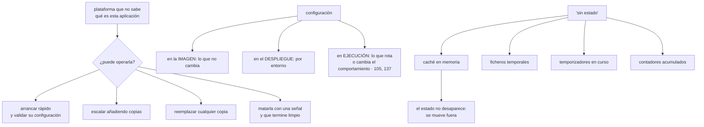

# 146 — Twelve-Factor App y configuración cloud-native

> [← Clase anterior](../../part-12-cloud-native-distributed-architecture/145-requisitos-restricciones-y-atributos-de-calidad/README.md) · [Índice de la parte](../README.md) · [Clase siguiente →](../../part-12-cloud-native-distributed-architecture/147-ddd-bounded-contexts-y-ownership-de-datos/README.md)

**Parte:** 12 — Arquitectura cloud-native y sistemas distribuidos<br>
**Nivel:** avanzado-experto · **Horas estimadas:** 4<br>
**Laboratorio:** `architecture` · **Estado:** `EXECUTABLE_CORE`

## 🎯 Propósito

Fijar cómo debe comportarse cada pieza para que **una plataforma que no sabe qué es pueda operarla**: arrancar, configurarse, escalar, ser reemplazada y morir sin ceremonia. La clase toma la lista clásica de doce propiedades, la juzga por ese criterio, señala **cuáles han envejecido mal o son directamente incorrectas hoy**, y añade las siete que faltan porque se escribió antes de casi todo lo que este programa ha construido. Y termina con el mito más caro de esta materia: que un servicio pueda ser realmente *sin estado*.

## 📚 Resultados de aprendizaje

Al finalizar podrás:

1. **Juzgar** cada propiedad por si permite que la plataforma opere la aplicación.
2. **Corregir** las tres que hoy se aplican mal, empezando por la configuración.
3. **Añadir** las propiedades que la lista original no contempla.
4. **Separar** qué configuración va en la imagen, en el despliegue y en ejecución.
5. **Encontrar** el estado local escondido, que siempre existe.

## 🧩 Conceptos centrales

| Concepto | Comprensión verificable |
|---|---|
| `operable por la plataforma` | Criterio único de esta clase: que algo que no conoce la aplicación pueda arrancarla, escalarla, reemplazarla y matarla sin dañarla. |
| `configuración externalizada` | Lo que cambia entre entornos vive fuera del artefacto. Externalizar es correcto; el mecanismo depende de si hay que rotarlo. |
| `desechabilidad` | Arrancar rápido y terminar limpiamente ante una señal. Es lo que permite escalar, desplegar y sobrevivir a la retirada de capacidad. |
| `validación al arrancar` | Comprobar la configuración completa al iniciar y fallar de inmediato con un mensaje claro, en vez de fallar tres horas después. |
| `estado local escondido` | Lo que la aplicación guarda en su proceso sin darse cuenta: cachés, ficheros temporales, temporizadores, contadores. |
| `recurso adjunto` | Toda dependencia externa se trata igual y se declara desde fuera, incluida su credencial, que además debe ser temporal. |

## 🧠 Modelo mental

Una arquitectura es un conjunto de decisiones costosas de cambiar; su calidad se juzga contra escenarios concretos, no por la cantidad de servicios usados.

Aplicado a esta clase, separa siempre cuatro planos: **intención** (qué necesita el usuario),
**configuración** (qué declaramos), **estado observado** (qué existe de verdad) y
**evidencia** (cómo sabemos que cumple). Confundirlos produce diseños que se ven correctos
en un diagrama pero fallan al operar.

## 🗺️ Flujo de razonamiento



## 📖 Desarrollo

### 1. El criterio, y lo que sigue siendo cierto

La lista clásica de doce propiedades se escribió para una plataforma concreta y se cita como dogma. Conviene juzgarla por lo que de verdad persigue:

```text
que algo que NO sabe qué es esta aplicación pueda
  arrancarla, configurarla, escalarla, reemplazarla y matarla
  sin conocer sus detalles
```

Y con ese criterio, lo que sigue siendo cierto y central:

```text
UN CÓDIGO, MUCHOS DESPLIEGUES
  el mismo artefacto en todos los entornos            clase 099

DEPENDENCIAS EXPLÍCITAS
  declaradas y fijadas con huella; nada implícito del sistema
                                                      clase 138

CONSTRUIR, PUBLICAR Y EJECUTAR SEPARADOS
  y publicar no vuelve a construir                    clase 099

PROCESOS SIN ESTADO LOCAL
  cualquier copia puede atender cualquier petición

RECURSOS ADJUNTOS
  toda dependencia externa se declara desde fuera y se puede
  sustituir sin tocar el código

ESCALAR AÑADIENDO COPIAS
  no haciendo la copia más grande

DESECHABILIDAD
  arranque rápido y terminación limpia ante una señal  clase 069

PARIDAD ENTRE ENTORNOS
  mismos servicios de apoyo, mismas versiones          clase 104

REGISTRO COMO FLUJO
  la aplicación no gestiona ficheros ni rotación       clase 122
```

Y de todas, la que más consecuencias tiene y menos se cumple es la **desechabilidad**, porque de ella dependen tres cosas a la vez:

```text
escalar deprisa cuando llega carga                    clase 129
desplegar sin cortes                                  clase 102
sobrevivir a la retirada de capacidad interrumpible   clase 143
```

Y sus dos mitades se miden por separado:

```text
ARRANQUE   desde que el proceso empieza hasta que sirve
  por debajo de 10 s        cómodo
  30 s a 2 min              el autoescalado llega tarde
  más de 2 min              no se puede escalar por demanda

TERMINACIÓN LIMPIA  al recibir la señal
  dejar de aceptar trabajo nuevo
  terminar lo que está en curso, con un plazo
  confirmar lo que corresponda                        clase 113
  cerrar conexiones y salir
```

Y el fallo típico de la segunda mitad: **ignorar la señal y esperar a que la maten**, lo que corta peticiones en curso y deja mensajes sin confirmar.

### 2. Las tres que hoy se aplican mal

**1. «La configuración va en variables de entorno».**

La idea correcta es externalizar; el mecanismo ha envejecido mal:

```text
correcto     lo que cambia entre entornos no está dentro del artefacto
incorrecto   que CUALQUIER valor viaje en variables de entorno

porque una variable de entorno:
  no se puede cambiar sin reiniciar                    clase 137
  la heredan los procesos hijos
  aparece en volcados y en informes de error
```

Y de ahí la corrección de esta clase:

```text
variables de entorno   valores no sensibles que no cambian en caliente
fichero montado        lo que hay que rotar, releído al cambiar
servicio de secretos   credenciales, con identidad de carga  clase 137
interruptor            lo que cambia el comportamiento       clase 105
```

Y una regla que evita sorpresas: **si un valor cambia el comportamiento del sistema de forma apreciable, no es configuración: es un interruptor**, y necesita registro de quién lo cambió, activación gradual y reversión.

**2. «Los registros van a la salida estándar».**

Cierto, y hoy insuficiente:

```text
correcto     la aplicación no gestiona ficheros ni rotación
incompleto   emitir líneas de texto

lo que hace falta hoy
  eventos estructurados con mensaje constante          clase 122
  una línea ancha por unidad de trabajo
  y además métricas y trazas, que no son registro      clases 123, 124
```

**3. «Los procesos administrativos se ejecutan como tareas puntuales».**

Esta es la que peor ha envejecido:

```text
entonces   entrar en una máquina y ejecutar un guion
hoy        un trabajo con la MISMA imagen y la misma configuración,
           lanzado por la plataforma, con su registro y su resultado
                                                       clase 079
```

Y sobre todo, la corrección importante:

```text
las migraciones de esquema NO son tareas puntuales
son una secuencia de despliegues compatibles          clase 102
→ expandir, migrar, contraer
→ y el paso de contraer se planifica con fecha
```

Y una cuarta, más leve: **«la concurrencia se consigue con el modelo de procesos»**. Hoy la unidad de escalado la decide la plataforma, y lo que queda de esa propiedad es lo que de verdad importaba: **escalar horizontalmente y no guardar estado local**.

### 3. Lo que falta en la lista

La lista original es anterior a casi todo lo que este programa ha construido. Lo que hay que añadirle:

```text
1. SEÑALES DE ESTADO SEPARADAS                        clase 079
   viva     ¿hay que reiniciarme?
   lista    ¿puedo recibir tráfico?
   arranque ¿he terminado de iniciarme?
   → confundirlas provoca reinicios en cadena bajo carga

2. OBSERVABILIDAD COMO SALIDA DE PRIMERA CLASE        parte 10
   métricas con etiquetas acotadas, trazas con contexto propagado
   y el identificador de correlación en todo

3. IDENTIDAD OBTENIDA DEL ENTORNO                     clase 137
   la aplicación no guarda credenciales: las pide y las renueva

4. LÍMITES DECLARADOS Y RESPETADOS                    clase 078
   la aplicación declara cuánta memoria y procesador necesita
   y se comporta bien cuando se le acota
   → un tiempo de ejecución que no ve su límite se pasa y muere

5. IDEMPOTENCIA DE CUANTO LE LLEGA DE FUERA           clase 116
   la plataforma reintenta sola: mensajes, invocaciones, tareas

6. PLAZOS Y DEGRADACIÓN                               clase 130
   toda llamada saliente con plazo, y una respuesta razonable
   cuando la dependencia falla

7. COMPATIBILIDAD ENTRE VERSIONES                     clases 102, 115
   la versión nueva convive con la anterior: esquema, cola y contrato
```

Y la sexta y la séptima son las que convierten una aplicación correcta en una **operable**: sin plazos, una dependencia lenta la tumba; sin compatibilidad, no se puede desplegar de forma escalonada.

Y una propiedad transversal que merece nombre propio: **fallar pronto y con un mensaje útil**.

```text
al arrancar, validar TODA la configuración
  ¿están todas las variables necesarias?
  ¿tienen valores del tipo y rango esperados?
  ¿se puede resolver y alcanzar cada dependencia declarada?

si falta algo → salir de inmediato con un mensaje que diga QUÉ falta
```

Y el motivo, con un ejemplo que ocurre siempre:

```text
sin validación   la aplicación arranca, sirve durante tres horas
                 y falla al llegar la primera petición que usa
                 esa configuración
                 → y el error es un fallo de referencia nula,
                   no «falta la variable X»

con validación   no arranca, el despliegue no avanza y el mensaje
                 dice exactamente qué falta
```

Y su complemento: **la configuración se valida también en la canalización**, comparando la que se va a desplegar con el esquema declarado.

### 4. El estado que siempre está

«Sin estado» es una simplificación útil y falsa. El estado no desaparece: **se mueve fuera del proceso**. Y lo que queda dentro sin darse cuenta es la causa de una familia entera de errores raros.

La lista de estado local escondido, con lo que produce cada uno:

```text
CACHÉ EN MEMORIA
  cada copia tiene el suyo → 40 copias, 40 versiones del dato
  → invalidar exige avisar a las 40                    clase 111
  → y si la clave no lleva el usuario, hay fuga entre usuarios

FICHEROS TEMPORALES
  se comparten entre peticiones de la misma copia      clase 117
  → nombres únicos y limpieza

SESIÓN PEGADA AL SERVIDOR
  obliga a mantener esa copia viva
  → impide desplegar y escalar con libertad

TEMPORIZADORES Y TAREAS DE FONDO
  se pierden al terminar el proceso
  → y con varias copias, se ejecutan N veces
  → esto es un trabajo programado, no una tarea dentro del servicio

CONTADORES Y ACUMULADORES
  «llevamos 412 pedidos hoy» dentro del proceso
  → cada copia cuenta lo suyo y ninguna cuenta bien

CONEXIONES Y AGRUPADORES
  son estado, y multiplican por el número de copias    clase 109

ESTADO DE INICIALIZACIÓN PEREZOSA
  la primera petición de cada copia es lenta
  → y con autoescalado, eso ocurre continuamente
```

Y las dos preguntas que lo detectan:

```text
¿qué se pierde si mato este proceso ahora mismo?
¿qué pasa si hay veinte copias en vez de una?
```

La segunda encuentra los temporizadores y los contadores; la primera, las cachés y los ficheros.

Y sobre los servicios que **sí** tienen estado por naturaleza —bases de datos, colas, motores durables—, la conclusión honesta:

```text
estas propiedades NO se les aplican igual
  no son desechables: retirarlos tiene consecuencias
  no escalan añadiendo copias sin más
  y su terminación limpia es mucho más delicada
→ por eso se usan como servicios gestionados siempre que se pueda
  y por eso la parte 09 existe
```

Y la lista de comprobación de la clase:

```text
☐ el mismo artefacto va a todos los entornos
☐ las dependencias están declaradas y fijadas con huella
☐ arranque medido, por debajo del umbral que el escalado necesita
☐ la terminación atiende la señal: deja de aceptar, termina y confirma
☐ la configuración está externalizada, con el mecanismo adecuado a
  si hay que rotarla
☐ lo que cambia el comportamiento es un interruptor, no una variable
☐ la configuración se valida al arrancar y el proceso falla si falta algo
☐ hay señales separadas de vivo, listo y arrancando
☐ se emiten métricas y trazas, no solo registros
☐ la aplicación obtiene su identidad del entorno
☐ declara sus límites y se comporta bien cuando se le acotan
☐ todo lo que llega de fuera es idempotente
☐ toda llamada saliente tiene plazo y hay respuesta degradada
☐ la versión nueva convive con la anterior
☐ se ha buscado el estado local escondido con las dos preguntas
```

Y el cierre que enlaza con la clase siguiente: con las piezas preparadas para vivir en la plataforma, queda la decisión que determina todo lo demás: **dónde se ponen las fronteras**. Y esa no la decide la tecnología, sino quién es dueño de qué datos, que es la materia de la clase 147.

## 🔬 Ejemplo trabajado

**CloudShop audita sus quince servicios contra la lista corregida. La auditoría cabe en una tabla y produce tres hallazgos que ya habían causado incidentes sin que nadie los relacionara.**

**La tabla.**

```text                                                cumplen
mismo artefacto en todos los entornos                 15 de 15
dependencias fijadas con huella                       15 de 15   (clase 138)
arranque por debajo de 30 s                            9 de 15
terminación limpia ante la señal                       6 de 15
configuración externalizada                           15 de 15
mecanismo adecuado para lo que rota                    2 de 15   (clase 137)
validación de configuración al arrancar                3 de 15
señales de vivo y listo separadas                      7 de 15
métricas y trazas además de registros                 15 de 15   (parte 10)
identidad obtenida del entorno                        15 de 15   (clase 137)
límites declarados                                    15 de 15
se comporta bien al ser acotado                       11 de 15
idempotencia de lo que llega de fuera                 13 de 15   (clase 116)
plazos en llamadas salientes                          15 de 15   (clase 130)
compatibilidad con la versión anterior                15 de 15   (clase 102)
sin estado local escondido                             4 de 15
```

Las cuatro filas peores son las que producen los hallazgos.

**Hallazgo 1: nueve servicios no terminaban limpiamente.**

```text
comportamiento observado al recibir la señal
  6 servicios    terminan correctamente
  7 servicios    la ignoran y esperan a que los maten (30 s después)
  2 servicios    cierran de inmediato, cortando peticiones en curso
```

Y el efecto, que llevaba meses atribuido a otra cosa:

```text
peticiones cortadas por despliegue, medido               ~180 por despliegue
despliegues al día                                                 40
peticiones cortadas al día                                     ~7.200
proporción del total                                            0,06 %
se achacaba a                              «errores intermitentes de red»
```

```text                                          antes         después
termina limpiamente                          6 de 15        15 de 15
peticiones cortadas por despliegue              ~180              0
mensajes sin confirmar por terminación          ~40               0
```

Y la secuencia que se implantó en los quince, idéntica:

```text
1. marcar «no listo» → el reparto deja de enviar tráfico
2. esperar a que el reparto se entere (unos segundos)
3. dejar de aceptar peticiones y de leer de las colas
4. terminar lo en curso, con plazo de 25 s
5. confirmar lo que corresponda
6. cerrar conexiones y salir
```

El paso 2 es el que casi nadie pone y sin él los pasos siguientes no sirven de nada: **el reparto sigue enviando tráfico durante unos segundos después de que el proceso se marque como no listo**.

**Hallazgo 2: la configuración que falló tres horas después.**

```text
03:10  despliegue de una versión con una variable nueva mal escrita
03:10  el servicio arranca correctamente
03:10  las comprobaciones de salud pasan
06:40  llega la primera petición que usa esa ruta
06:40  fallo de referencia nula; 100 % de esa ruta cae
07:15  diagnosticado y corregido
```

Tres horas y media entre desplegar y fallar, y el error no decía nada útil.

```text                                          antes         después
validación al arrancar                        3 de 15        15 de 15
qué se valida                                     —      presencia, tipo,
                                                         rango y alcance
                                                         de cada dependencia
validación también en la canalización            no             sí
incidentes por configuración en 6 meses           4              0
despliegues bloqueados por configuración
inválida                                          —             11
```

Once despliegues bloqueados en seis meses **antes de llegar a producción**.

**Hallazgo 3: el estado local escondido.**

Las dos preguntas del apartado cuarto se aplicaron a los quince servicios:

```text
¿qué se pierde si lo mato ahora?
  cachés en memoria sin invalidación coordinada              9 servicios
  ficheros temporales sin limpiar                            4
  trabajo en curso no confirmado                             7 (hallazgo 1)

¿qué pasa con veinte copias en vez de una?
  temporizadores dentro del servicio                         3
    → un envío de recordatorios se ejecutaba una vez por copia
    → con 12 copias, 12 correos por cliente
  contadores acumulados en memoria                           2
    → un panel de «pedidos de hoy» mostraba 1/12 del valor real
  inicialización perezosa cara                               5
    → la primera petición de cada copia tardaba 3,2 s
    → con autoescalado, ocurría constantemente
```

Y el de los recordatorios llevaba **cinco meses** enviando correos duplicados:

```text
correos duplicados enviados, estimados                    ~31.000
reclamaciones recibidas                                        14
cómo se explicaba antes                     «un problema del proveedor»
corrección   el envío pasó a ser un trabajo programado, con bloqueo
             y con idempotencia                            clases 079, 116
```

Y las inicializaciones perezosas se movieron al arranque, con una consecuencia buscada:

```text                                    perezosa       en el arranque
tiempo de arranque                        4 s             9 s
primera petición de una copia nueva      3,2 s            41 ms
coste                          arranque más lento; escalado igual de rápido
                               porque el umbral eran 30 s
```

**El arranque, medido y corregido.**

```text
servicios por encima de 30 s                                    6
causas
  consultar configuración remota al arrancar                    4
  cargar un modelo o un catálogo entero en memoria              3
  esperar a que una dependencia estuviera lista                 2
  ejecutar migraciones al arrancar                              1   ← grave
```

El último merecía su propio incidente:

```text
el servicio ejecutaba las migraciones de esquema al arrancar
con 12 copias arrancando a la vez tras un despliegue
→ 12 procesos intentaban migrar
→ bloqueos y arranques de 4 minutos
corrección   migración como trabajo previo al despliegue,
             con expandir y contraer                       clase 102
```

```text                                          antes         después
arranque, mediana                             38 s            11 s
arranque, peor caso                          4 min            19 s
servicios que escalan a tiempo               9 de 15        15 de 15
```

**La configuración, reorganizada en tres capas.**

```text
EN LA IMAGEN            lo que no cambia entre entornos
                        rutas internas, valores por defecto, esquema
EN EL DESPLIEGUE        lo que cambia por entorno
                        puntos de acceso, tamaños, regiones
EN EJECUCIÓN            lo que rota o cambia el comportamiento
                        credenciales (fichero releído) e interruptores

valores que estaban en variables de entorno y cambiaron de sitio
  credenciales                                    18  → almacén
  valores que cambiaban el comportamiento          7  → interruptores
  el resto                                        61  → siguen igual
```

Y los siete que pasaron a interruptores tenían todos la misma característica: **alguien los cambiaba de vez en cuando y nadie sabía quién ni cuándo**.

**A los cuatro meses.**

```text                                          antes         después
terminación limpia                            6 de 15       15 de 15
peticiones cortadas por despliegue              ~180             0
validación al arrancar                        3 de 15       15 de 15
incidentes por configuración                 4 / 6 meses        0
arranque, peor caso                          4 min           19 s
estado local escondido, servicios afectados   11 de 15       0 de 15
correos duplicados                          ~31.000            0
inicialización perezosa en el camino crítico  5 de 15        0 de 15
valores sensibles en variables de entorno       18              0
valores que cambian comportamiento
como variable                                    7              0
```

**La lección que esta clase traslada a la parte 12**: la auditoría no encontró ningún problema nuevo. Encontró **la explicación de tres cosas que ya estaban ocurriendo y que se atribuían a otra causa**: siete mil doscientas peticiones cortadas al día que se llamaban «errores de red», treinta y un mil correos duplicados que se llamaban «un problema del proveedor», y un panel con la doceava parte de los pedidos que nadie había cuestionado. Las tres eran estado local escondido o terminación sucia, y las tres estaban en la lista desde 2011.

## 🧪 Laboratorio guiado

Ejecuta desde la raíz:

```bash
python classes/part-12-cloud-native-distributed-architecture/146-twelve-factor-app-y-configuracion-cloud-native/lab.py
```

El laboratorio selecciona el motor de práctica **`architecture`** y produce
`lab_result.json`. El escenario, sus comprobaciones y el artefacto esperado corresponden a
esta clase; no requiere credenciales y deja explícito qué debe revalidarse en un sandbox real.

1. Lee `exercise.steps` y formula una predicción antes de ejecutar.
2. Ejecuta la práctica y verifica todos los elementos de `checks`.
3. Provoca el caso de `negative_test` y explica la señal observada.
4. Materializa `revision-twelve-factor` en `evidence/` usando la plantilla indicada.
5. Para proveedor real, sigue `sandbox.requires`, registra costo y ejecuta `destroy`.

### Evidencia esperada

El artefacto principal es un diagrama acompañado por decisiones y trade-offs. Además, la entrega debe incluir el comando ejecutado,
la salida estructurada y una conclusión que no exceda lo observado.

## 🏆 Reto verificable

Construye **`revision-twelve-factor`** para el caso CloudShop. Incluye una alternativa descartada,
un supuesto que pueda falsarse, una prueba de fallo y una decisión de rollback.

## ✅ Criterio de aceptación

- [ ] `lab.py` termina con código 0 y genera JSON válido.
- [ ] La entrega conecta al menos tres requisitos con mecanismos verificables.
- [ ] Existe una prueba positiva y una prueba negativa con evidencia.
- [ ] Seguridad, costo y operación aparecen como decisiones, no como anexos.
- [ ] Se declara una limitación y una condición que obligaría a revisar el diseño.
- [ ] Otra persona puede repetir el recorrido sin conocimiento tácito.

## ⚠️ Errores frecuentes

| Síntoma | Causa probable | Corrección |
|---|---|---|
| Cada despliegue corta peticiones que se achacan a errores de red | El proceso ignora la señal de terminación, o cierra sin esperar a que el reparto deje de enviarle tráfico | Márcate no listo, espera a que el reparto se entere, deja de aceptar, termina lo en curso con plazo y confirma antes de salir. |
| Un despliegue arranca bien y falla horas después por configuración | No se valida la configuración al arrancar | Valida presencia, tipo, rango y alcance de las dependencias al iniciar, falla de inmediato con un mensaje claro y valida también en la canalización. |
| Una tarea periódica se ejecuta tantas veces como copias hay | El temporizador vive dentro del servicio | Conviértelo en un trabajo programado con bloqueo e idempotencia, fuera del proceso que sirve peticiones. |
| Un contador o panel muestra una fracción del valor real | Se acumula en memoria y cada copia cuenta lo suyo | Saca el estado del proceso; cuenta con métricas agregadas o en un almacén compartido. |
| El autoescalado llega tarde y las copias nuevas responden lentas al principio | Arranque largo e inicialización perezosa en el camino crítico | Mueve la inicialización al arranque, quita consultas remotas y saca las migraciones del arranque. |
| Un valor de configuración cambia el comportamiento y nadie sabe quién lo tocó | Se trató como configuración lo que es un interruptor | Si cambia el comportamiento de forma apreciable, hazlo interruptor: con registro, gradualidad y reversión. |

## 🛡️ Seguridad, ética y costo

Trabaja con cuentas propias o sandboxes autorizados. No publiques secretos, identificadores
reales ni datos personales. Antes de crear recursos pagos define presupuesto, etiquetas y
comando de destrucción; después verifica que no queden recursos huérfanos. Los ejemplos
locales enseñan contratos, pero no certifican cumplimiento ni disponibilidad de producción.

## ❓ Preguntas de comprobación

1. ¿Cuál es el criterio único para juzgar estas propiedades?
2. ¿Qué tiene de correcto y de incorrecto «la configuración va en variables de entorno»?
3. ¿Qué siete propiedades faltan en la lista original y por qué?
4. ¿Qué dos preguntas encuentran el estado local escondido?
5. ¿Por qué las migraciones de esquema no son una tarea puntual?

## 🔗 Referencias

- Wiggins, A. (2011). *The Twelve-Factor App* — la lista original y su contexto. <https://12factor.net/>
- Hoffman, K. (2016). *Beyond the Twelve-Factor App* — propiedades añadidas: telemetría, autenticación y seguridad. <https://www.oreilly.com/library/view/beyond-the-twelve-factor/9781492042631/>
- Kubernetes (2025). *Pod lifecycle: termination and probes* — señal de terminación, plazo y señales de estado. <https://kubernetes.io/docs/concepts/workloads/pods/pod-lifecycle/>
- Google Cloud (2025). *Best practices for building containers* — arranque, configuración y desechabilidad. <https://cloud.google.com/architecture/best-practices-for-building-containers>
- OpenTelemetry (2025). *Instrumentation as a first-class output* — telemetría como salida de la aplicación. <https://opentelemetry.io/docs/concepts/instrumentation/>
- Documentación oficial vigente del servicio implementado; registra URL y fecha de consulta.

---

> [Evaluación](assessment.md) · [Contrato de clase](lesson.yaml) · [Índice de la parte](../README.md)
