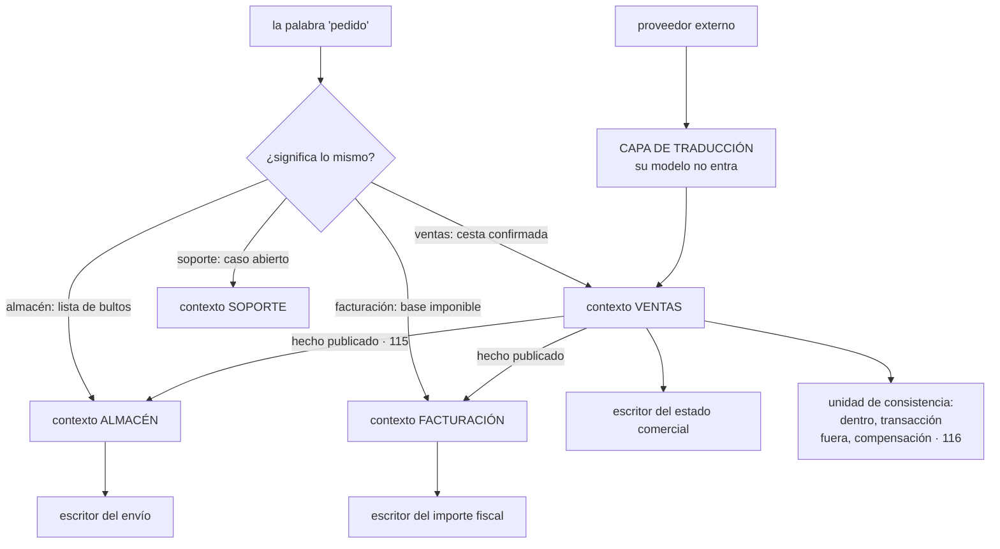

# 147 — DDD, bounded contexts y ownership de datos

> [← 146 · Twelve-Factor App y configuración cloud-native](../../part-12-cloud-native-distributed-architecture/146-twelve-factor-app-y-configuracion-cloud-native/README.md) · [Índice de la parte](../README.md) · [148 · Monolito modular, microservicios y función →](../../part-12-cloud-native-distributed-architecture/148-monolito-modular-microservicios-y-funcion/README.md)

**Parte:** 12 — Arquitectura cloud-native y sistemas distribuidos<br>
**Nivel:** avanzado-experto · **Horas estimadas:** 4<br>
**Laboratorio:** `architecture` · **Estado:** `EXECUTABLE_CORE`

## 🎯 Propósito

Decidir **dónde van las fronteras**, que es la decisión de la que dependen todas las demás de esta parte. La clase defiende que no las decide la tecnología sino dos cosas concretas: **dónde cambia el significado de las palabras** y **quién puede modificar cada dato**. Da una técnica para encontrarlas en horas en vez de en meses, establece la regla que hace que todo lo demás funcione —un solo escritor por dato— y desarrolla la pieza que más problemas evita en sistemas reales: la capa que traduce el modelo ajeno en la frontera para que no se filtre hacia dentro.

## 📚 Resultados de aprendizaje

Al finalizar podrás:

1. **Encontrar** fronteras buscando dónde una misma palabra significa cosas distintas.
2. **Asignar** un único escritor a cada dato y derivar de ahí la separación.
3. **Elegir** la relación entre contextos y aislar los modelos ajenos.
4. **Delimitar** la unidad de consistencia y saber qué queda fuera de ella.
5. **Decidir** dónde invertir esfuerzo y qué adoptar tal cual.

## 🧩 Conceptos centrales

| Concepto | Comprensión verificable |
|---|---|
| `contexto acotado` | Región donde cada palabra tiene un único significado y un modelo coherente. Fuera de ella, la misma palabra puede significar otra cosa. |
| `un solo escritor` | Cada dato tiene exactamente un contexto que puede modificarlo. Los demás tienen copia o preguntan. |
| `base de datos de integración` | Base compartida por varios contextos que escriben en las mismas tablas. Es lo que impide desplegar y evolucionar por separado. |
| `capa de traducción` | Código en la frontera que convierte el modelo ajeno al propio, para que el ajeno no se filtre hacia dentro. |
| `unidad de consistencia` | Conjunto de datos que cambia junto, en una transacción. Lo que la cruza es eventualmente consistente. |
| `subdominio central` | La parte que diferencia al negocio. Es donde se invierte; lo genérico se adopta tal cual. |

## 🧠 Modelo mental

Una arquitectura es un conjunto de decisiones costosas de cambiar; su calidad se juzga contra escenarios concretos, no por la cantidad de servicios usados.

Aplicado a esta clase, separa siempre cuatro planos: **intención** (qué necesita el usuario),
**configuración** (qué declaramos), **estado observado** (qué existe de verdad) y
**evidencia** (cómo sabemos que cumple). Confundirlos produce diseños que se ven correctos
en un diagrama pero fallan al operar.

## 🗺️ Flujo de razonamiento



## 📖 Desarrollo

### 1. La frontera está donde cambia el significado

La técnica más útil de esta materia cabe en una frase:

```text
busca dónde la misma palabra significa cosas distintas
```

Y el ejemplo canónico de cualquier tienda:

```text
«PEDIDO» para VENTAS
  una cesta confirmada, con precios, descuentos y método de pago
  se cierra cuando se cobra

«PEDIDO» para ALMACÉN
  una lista de artículos que hay que localizar y empaquetar
  puede partirse en tres envíos, y le da igual el precio

«PEDIDO» para FACTURACIÓN
  una base imponible con impuestos y un documento legal
  puede rectificarse años después

«PEDIDO» para SOPORTE
  un caso, con su historial de conversaciones
```

Cuatro cosas distintas con el mismo nombre. Y las consecuencias de no separarlas:

```text
un modelo único intenta servir a las cuatro
→ acumula campos que solo usa uno
→ cada cambio afecta a los cuatro equipos
→ y las discusiones son sobre el significado, no sobre el código
```

Y dos señales más de que hay una frontera:

```text
la misma palabra significa lo mismo pero con DETALLE distinto
  ventas necesita el cliente completo; almacén solo su dirección

los ciclos de vida no coinciden
  el pedido de ventas termina al cobrar
  el de facturación sigue vivo cuatro años
```

Y la técnica para encontrarlas en horas, sin un año de análisis:

```text
1. escribir los HECHOS del negocio en orden temporal
   «cesta confirmada», «pago autorizado», «pedido preparado»,
   «envío entregado», «factura emitida», «devolución solicitada»

2. anotar quién reacciona a cada hecho y quién lo produce

3. agrupar por quién habla el mismo idioma

4. y marcar los puntos donde una palabra cambia de significado:
   ahí está la frontera
```

Y lo que **no** decide una frontera, aunque se use constantemente:

```text
la tecnología      «el servicio de base de datos», «el servicio de API»
la capa            separar por capas produce fronteras que hay que
                   cruzar en cada operación
el organigrama     por accidente; aunque el organigrama SÍ importa
                   como restricción                        clase 145
el tamaño          «cada servicio no más de N líneas» no es un criterio
```

### 2. Un solo escritor por dato

Esta es la regla que convierte una idea de modelado en una decisión de arquitectura:

```text
cada dato tiene EXACTAMENTE UN contexto que puede modificarlo
los demás tienen una copia, o preguntan
```

Y de ella se derivan casi todas las decisiones posteriores:

```text
quién expone qué operación
qué se publica como hecho                              clase 115
qué se puede desplegar sin coordinar
y quién está de guardia de qué                         clase 095
```

El antipatrón correspondiente tiene nombre propio:

```text
BASE DE DATOS DE INTEGRACIÓN
  varios contextos escriben en las mismas tablas
  → el esquema es un contrato implícito entre todos
  → nadie puede cambiarlo sin coordinar con todos
  → y una migración exige parar todo a la vez
```

Y conviene distinguirlo de algo parecido y aceptable:

```text
compartir la INSTANCIA de base de datos     aceptable, es economía
compartir las TABLAS y escribirlas          esto es el antipatrón
```

Con esquemas separados y permisos separados, una sola instancia puede alojar varios contextos sin acoplarlos. Lo que acopla es **quién escribe**.

Y qué hacen los demás con un dato del que no son dueños:

```text
COPIA LOCAL, actualizada por hechos                    clase 114
  + funciona con el dueño caído; rápido
  − eventualmente consistente, y hay que mantenerla

PREGUNTAR AL DUEÑO
  + siempre al día
  − acopla en tiempo de ejecución: si el dueño cae, tú caes
  − y añade latencia y saltos                          clase 145
```

Y el criterio, que es el de la clase 145: **si el atributo prioritario es disponibilidad, copia; si es exactitud del momento, pregunta**.

Y una tercera vía muy usada y honesta: **copia local con caducidad y degradación**, que sirve el valor copiado y avisa de su antigüedad.

**La unidad de consistencia**, que enlaza con la parte 09:

```text
dentro de una unidad     una transacción; invariantes garantizadas
                         «las líneas de un pedido suman su total»
entre unidades           NO hay transacción
                         → compensaciones y estados intermedios  clase 116
```

Y el error habitual es hacerlas demasiado grandes:

```text
«el cliente y todos sus pedidos» como una unidad
→ dos operaciones sobre pedidos distintos del mismo cliente compiten
→ y la unidad crece sin límite                          clase 110
```

La regla práctica: **la unidad es lo mínimo que debe cambiar junto para que una regla de negocio se cumpla**. Todo lo demás, fuera.

### 3. Relaciones entre contextos

Dos contextos que se hablan tienen una relación, y conviene nombrarla porque determina quién soporta el coste del cambio:

```text
PROVEEDOR Y CLIENTE
  el proveedor publica un contrato y el cliente lo consume
  el proveedor tiene en cuenta las necesidades del cliente
  → es la relación normal, y necesita el contrato de la clase 153

CONFORMISTA
  el cliente acepta el modelo del proveedor tal cual
  → barato, y el modelo ajeno entra en tu casa

CAPA DE TRADUCCIÓN
  el cliente traduce el modelo ajeno al suyo en la frontera
  → cuesta más y protege el modelo propio

NÚCLEO COMPARTIDO
  dos contextos comparten modelo y código
  → acopla sus despliegues; usar solo con un equipo detrás de los dos

CAMINOS SEPARADOS
  no se integran; se duplica a propósito
  → a veces es la respuesta correcta
```

Y **la capa de traducción** es la que más problemas evita en sistemas reales:

```text
el proveedor de pago llama «transaction» a algo que en tu modelo
es un intento de cobro
su estado «PENDING_CAPTURE» no significa nada en tu dominio
y su identificador tiene su formato

sin traducción
  esos nombres aparecen en tu base, en tus eventos y en tu interfaz
  → cambiar de proveedor obliga a tocar todo
  → y un cambio suyo se propaga hacia dentro

con traducción
  una capa convierte su modelo al tuyo, en un solo sitio
  → cambiar de proveedor toca esa capa
  → y lo de dentro no se entera
```

Y se aplica a más cosas de las que parece:

```text
proveedores externos                       casi siempre
sistemas heredados que no se pueden tocar  siempre
otro contexto cuyo modelo no te convence   cuando puedas permitírtelo
```

Y la señal de que falta una: **vocabulario ajeno dentro de tu código**. Si en el servicio de pedidos aparecen palabras del proveedor de pagos, el modelo ya se filtró.

Y **el lenguaje publicado**, que es lo que la clase 115 llamó contrato de eventos: un vocabulario común y estable que varios contextos entienden, distinto del modelo interno de cualquiera de ellos.

### 4. Dónde invertir, y cómo se estropea

No todas las partes merecen el mismo esfuerzo:

```text
CENTRAL       lo que diferencia al negocio
              → aquí se invierte: modelo propio, buen código,
                los mejores del equipo
              → CloudShop: el motor de precios y promociones

DE APOYO      necesario y no diferencia
              → se construye simple, sin sofisticación
              → gestión de pedidos estándar

GENÉRICO      resuelto por el mercado
              → se adopta tal cual, sin personalizar
              → identidad, pagos, correo, facturación fiscal
```

Y las dos reglas que se derivan:

```text
no construir lo genérico
no dejar que lo genérico dicte el modelo de lo central
  → y para lo segundo hace falta la capa de traducción
```

Y el error clásico: personalizar hasta el infinito una herramienta genérica porque «casi encaja», hasta que mantenerla cuesta más que haberla construido.

**Cómo se estropea una división**, con las causas por frecuencia:

```text
FRONTERAS POR TECNOLOGÍA
  «servicio de base de datos», «servicio de notificaciones»
  → cada operación de negocio cruza cuatro fronteras
  → y la latencia y los fallos parciales se multiplican

FRONTERAS POR CAPA
  interfaz, lógica y datos como servicios distintos
  → mismo problema, con un nombre más respetable

DATOS COMPARTIDOS ENTRE CONTEXTOS
  el antipatrón del apartado segundo

UN CONTEXTO SIN EQUIPO
  ley 20: acaba sin dueño                              clase 144

DEMASIADOS CONTEXTOS PARA EL EQUIPO
  restricción de la clase 145
```

Y dos comprobaciones que detectan una mala división antes de sufrirla:

```text
1. ¿cuántas fronteras cruza una operación de negocio típica?
   una o dos      bien
   cuatro o más   la división está mal hecha

2. ¿cuántos equipos hay que coordinar para un cambio habitual?
   uno            bien
   tres           la frontera está en el sitio equivocado
```

La segunda es la definitiva: **si un cambio frecuente exige coordinar a tres equipos, la frontera no está donde debería**.

Y la lista de comprobación de la clase:

```text
☐ están identificadas las palabras que significan cosas distintas
☐ cada contexto tiene un vocabulario propio, escrito
☐ cada dato tiene un único escritor, y está anotado quién
☐ ningún contexto escribe en las tablas de otro
☐ está decidido, por dato, si los demás copian o preguntan
☐ las unidades de consistencia son lo mínimo que debe cambiar junto
☐ lo que cruza unidades usa compensación, no transacción
☐ hay capa de traducción ante proveedores y sistemas heredados
☐ no aparece vocabulario ajeno dentro del modelo propio
☐ está clasificado qué es central, de apoyo y genérico
☐ cada contexto tiene un equipo detrás
☐ una operación típica cruza una o dos fronteras, no cuatro
☐ un cambio habitual no exige coordinar tres equipos
```

Y el cierre que enlaza con la clase siguiente: con las fronteras decididas por el significado y por la propiedad de los datos, queda una pregunta que suele hacerse primero y debería hacerse ahora: **cuántas de esas fronteras se convierten en procesos separados**, que es la materia de la clase 148.

## 🔬 Ejemplo trabajado

**CloudShop tiene quince servicios divididos por criterios que nadie recuerda y una base de datos que once de ellos escriben. El ejercicio consiste en encontrar las fronteras reales y compararlas con las que hay.**

**Paso 1: los hechos del negocio, en orden.**

Una sesión de dos horas con gente de ventas, almacén, facturación y soporte produjo treinta y un hechos. Los principales:

```text
cesta confirmada → pago autorizado → pedido aceptado → artículos
reservados → pedido preparado → envío entregado → factura emitida
→ devolución solicitada → devolución recibida → abono emitido
```

Y al anotar quién produce y quién reacciona, apareció el agrupamiento:

```text
ventas       cesta, precios, promociones, aceptación
almacén      reserva, preparación, envío
facturación  factura, abono, impuestos
soporte      casos, devoluciones desde el punto de vista del cliente
pagos        autorización, captura, devolución de dinero
```

**Paso 2: las palabras que significaban cosas distintas.**

```text
PEDIDO       4 significados, como en el apartado primero
CLIENTE      ventas: quien compra, con su historial de compras
             facturación: un sujeto fiscal con NIF y dirección legal
             soporte: alguien con un correo y una conversación
DEVOLUCIÓN   soporte: una solicitud del cliente
             almacén: un paquete que va a llegar
             facturación: un abono con efectos fiscales
             pagos: una operación de devolución de dinero
PRECIO       ventas: lo que se muestra, con promociones
             facturación: base imponible sin impuestos
```

Cuatro palabras, catorce significados. **Y en el modelo había una sola tabla para cada una.**

**Paso 3: comparar con la división existente.**

```text
servicios actuales                                            15
contextos identificados                                        5

servicios que no correspondían a ningún contexto
  «servicio de base de datos»              técnico            1
  «servicio de API»                        capa               1
  «servicio de notificaciones»             técnico            1
  «servicio de utilidades»                 cajón desastre     1
  «servicio de informes»                   técnico            1
```

Y la comprobación del apartado cuarto, medida sobre el flujo de compra:

```text
fronteras que cruzaba «confirmar un pedido»                    7
equipos que había que coordinar para cambiar el cálculo
de un descuento                                                3
```

Siete fronteras y tres equipos para tocar un descuento. Las dos comprobaciones daban rojo.

**Paso 4: los escritores.**

```text
tablas de la base compartida                                  84
tablas con más de un escritor                                 41
la peor: tabla «pedidos»                          escrita por 7 servicios
```

Y el efecto que llevaba dos años atribuido a la complejidad del negocio:

```text
cambios de esquema en 12 meses                                 9
de ellos, que exigieron coordinar 3 o más equipos              9
tiempo medio de un cambio de esquema                     5 semanas
incidentes por un cambio de esquema                            3
```

Y al asignar un escritor por dato:

```text
dato                              escritor único
estado comercial del pedido       ventas
precio aplicado y promoción       ventas
reserva y estado de preparación   almacén
dirección de envío                ventas escribe, almacén copia
importe fiscal y factura          facturación
estado del cobro                  pagos
conversaciones y casos            soporte
```

Y dos decisiones de copiar frente a preguntar, tomadas con el criterio de la clase 145:

```text
almacén necesita la dirección de envío
  atributo prioritario: disponibilidad (E2)
  → COPIA, actualizada por el hecho «pedido aceptado»
  → funciona con ventas caído

facturación necesita el importe final
  atributo prioritario: exactitud
  → COPIA TAMBIÉN, porque el importe se congela al emitir la factura
  → y una factura no cambia si ventas cambia el precio después
```

La segunda es interesante: **facturación no quiere el dato actual, quiere el que había en ese momento**, y eso es una copia por definición.

**Paso 5: la capa de traducción para pagos.**

```text
palabras del proveedor encontradas dentro del código propio
  «transaction_id» en la tabla de pedidos                     sí
  estado «PENDING_CAPTURE» en el modelo de dominio            sí
  códigos de error del proveedor en la interfaz de usuario    sí
  el formato de importe del proveedor (céntimos como texto)   sí
servicios que conocían el vocabulario del proveedor           6
```

Y el coste medido cuando se integró el segundo proveedor:

```text                                    sin traducción    con traducción
servicios que hubo que tocar                    6                 1
tiempo de la integración                    7 semanas         9 días
cambios en el modelo de dominio                 4                 0
cambios en la interfaz de usuario               2                 0
```

Y el modelo propio quedó así:

```text
intento de cobro   { id propio, importe, moneda, estado propio,
                     referencia externa opaca }
estados propios    solicitado · autorizado · cobrado · rechazado ·
                   devuelto
```

Con cinco estados propios y una referencia opaca, **los dos proveedores encajan y ninguno dicta nada**.

**Paso 6: dónde invertir.**

```text
CENTRAL     motor de precios y promociones
            → equipo dedicado, modelo propio, buena cobertura
DE APOYO    gestión de pedidos, preparación, casos
            → simple, sin sofisticación
GENÉRICO    identidad, pagos, correo, facturación fiscal, búsqueda
            → adoptado tal cual, con capa de traducción
```

Y una decisión que se revirtió con esto delante:

```text
había un proyecto para construir un motor de facturación fiscal propio
motivo    «el producto de mercado no encaja al 100 %»
revisión  es genérico; no diferencia el negocio
decisión  se compró y se adaptó el proceso, no el producto
ahorro estimado                              5 meses de dos personas
```

**El resultado.**

```text                                          antes         después
servicios                                       15              8
contextos                                    no definidos       5
servicios que no eran de ningún contexto         5              0
tablas con más de un escritor                   41              0
esquemas separados por contexto                  no             sí
fronteras que cruza «confirmar pedido»            7              2
equipos a coordinar para cambiar un descuento     3              1
tiempo medio de un cambio de esquema        5 semanas         3 días
servicios que conocen el vocabulario de pagos     6              1
tiempo de integrar un proveedor nuevo       7 semanas         9 días
```

Y los ocho servicios encajan con la restricción de la clase 145: **el equipo puede operar entre seis y ocho**.

**La lección que esta clase traslada a la parte 12**: la división existente tenía quince servicios y **cinco de ellos no correspondían a ninguna frontera del negocio**: eran capas y tecnologías con nombre de servicio. Y el problema que más costaba —cinco semanas para un cambio de esquema y tres equipos para tocar un descuento— no venía de tener demasiados servicios, sino de que **cuarenta y una tablas tenían más de un escritor**. La frontera no estaba en el despliegue: estaba en los datos, y ahí no había ninguna.

## 🧪 Laboratorio guiado

Ejecuta desde la raíz:

```bash
python classes/part-12-cloud-native-distributed-architecture/147-ddd-bounded-contexts-y-ownership-de-datos/lab.py
```

El laboratorio selecciona el motor de práctica **`architecture`** y produce
`lab_result.json`. El escenario, sus comprobaciones y el artefacto esperado corresponden a
esta clase; no requiere credenciales y deja explícito qué debe revalidarse en un sandbox real.

1. Lee `exercise.steps` y formula una predicción antes de ejecutar.
2. Ejecuta la práctica y verifica todos los elementos de `checks`.
3. Provoca el caso de `negative_test` y explica la señal observada.
4. Materializa `context-map` en `evidence/` usando la plantilla indicada.
5. Para proveedor real, sigue `sandbox.requires`, registra costo y ejecuta `destroy`.

### Evidencia esperada

El artefacto principal es un diagrama acompañado por decisiones y trade-offs. Además, la entrega debe incluir el comando ejecutado,
la salida estructurada y una conclusión que no exceda lo observado.

## 🏆 Reto verificable

Construye **`context-map`** para el caso CloudShop. Incluye una alternativa descartada,
un supuesto que pueda falsarse, una prueba de fallo y una decisión de rollback.

## ✅ Criterio de aceptación

- [ ] `lab.py` termina con código 0 y genera JSON válido.
- [ ] La entrega conecta al menos tres requisitos con mecanismos verificables.
- [ ] Existe una prueba positiva y una prueba negativa con evidencia.
- [ ] Seguridad, costo y operación aparecen como decisiones, no como anexos.
- [ ] Se declara una limitación y una condición que obligaría a revisar el diseño.
- [ ] Otra persona puede repetir el recorrido sin conocimiento tácito.

## ⚠️ Errores frecuentes

| Síntoma | Causa probable | Corrección |
|---|---|---|
| Cada cambio de esquema exige coordinar a varios equipos | Varios contextos escriben en las mismas tablas: base de datos de integración | Asigna un único escritor a cada dato, separa esquemas y permisos, y que los demás copien o pregunten. |
| Discusiones interminables sobre qué campos lleva una entidad | Un solo modelo intenta servir a contextos donde la palabra significa cosas distintas | Busca dónde cambia el significado y separa; cada contexto tiene su propio modelo de la misma palabra. |
| Una operación de negocio cruza cuatro o más servicios | Las fronteras se trazaron por tecnología o por capa | Traza por contexto y propiedad de datos; mide cuántas fronteras cruza una operación típica. |
| Cambiar de proveedor obliga a tocar medio sistema | Su vocabulario y sus estados entraron en el modelo propio | Pon una capa de traducción en la frontera y guarda solo una referencia opaca. |
| Se construye una pieza que el mercado ya resuelve | No se clasificó qué es central, de apoyo y genérico | Invierte en lo central, simplifica lo de apoyo y adopta lo genérico sin personalizarlo. |
| Una unidad de consistencia crece sin límite y produce conflictos | Se agrupó de más: el cliente con todos sus pedidos | La unidad es lo mínimo que debe cambiar junto para que se cumpla una regla; lo demás va fuera y se coordina con compensación. |

## 🛡️ Seguridad, ética y costo

Trabaja con cuentas propias o sandboxes autorizados. No publiques secretos, identificadores
reales ni datos personales. Antes de crear recursos pagos define presupuesto, etiquetas y
comando de destrucción; después verifica que no queden recursos huérfanos. Los ejemplos
locales enseñan contratos, pero no certifican cumplimiento ni disponibilidad de producción.

## ❓ Preguntas de comprobación

1. ¿Qué señal indica que hay una frontera entre contextos?
2. ¿Qué diferencia hay entre compartir la instancia de base de datos y compartir las tablas?
3. ¿Cuándo conviene copiar un dato ajeno y cuándo preguntar por él?
4. ¿Qué protege una capa de traducción y cómo se detecta que falta?
5. ¿Qué dos comprobaciones revelan que una división está mal hecha?

## 🔗 Referencias

- Evans, E. (2003). *Domain-Driven Design*, parte IV — contextos acotados, mapas de contexto y capa de traducción. <https://www.domainlanguage.com/ddd/>
- Vernon, V. (2013). *Implementing Domain-Driven Design*, caps. 2-3 — contextos, relaciones y lenguaje. <https://www.informit.com/store/implementing-domain-driven-design-9780321834577>
- Brandolini, A. (2025). *Event storming* — encontrar fronteras a partir de los hechos del negocio. <https://www.eventstorming.com/>
- Fowler, M. (2025). *Bounded context and integration database* — el antipatrón de la base compartida. <https://martinfowler.com/bliki/BoundedContext.html>
- Skelton, M. y Pais, M. (2019). *Team Topologies*, cap. 6 — una frontera necesita un equipo detrás. <https://teamtopologies.com/book>
- Documentación oficial vigente del servicio implementado; registra URL y fecha de consulta.

---

> [Evaluación](assessment.md) · [Contrato de clase](lesson.yaml) · [Índice de la parte](../README.md)

| Anterior | Índice | Siguiente |
|---|---|---|
| [← 146 · Twelve-Factor App y configuración cloud-native](../../part-12-cloud-native-distributed-architecture/146-twelve-factor-app-y-configuracion-cloud-native/README.md) | [Parte 12](../README.md) · [Programa](../../README.md) | [148 · Monolito modular, microservicios y función →](../../part-12-cloud-native-distributed-architecture/148-monolito-modular-microservicios-y-funcion/README.md) |
