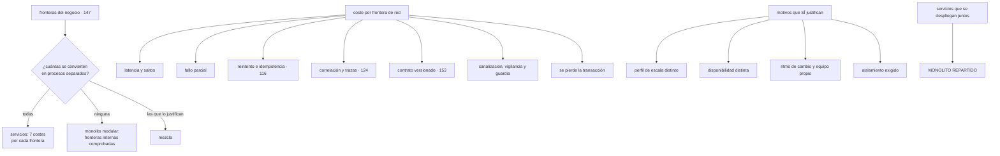

# 148 — Monolito modular, microservicios y función

> [← 147 · DDD, bounded contexts y ownership de datos](../../part-12-cloud-native-distributed-architecture/147-ddd-bounded-contexts-y-ownership-de-datos/README.md) · [Índice de la parte](../README.md) · [149 · CAP, PACELC y consistencia por operación →](../../part-12-cloud-native-distributed-architecture/149-cap-pacelc-y-consistencia-por-operacion/README.md)

**Parte:** 12 — Arquitectura cloud-native y sistemas distribuidos<br>
**Nivel:** avanzado-experto · **Horas estimadas:** 4<br>
**Laboratorio:** `decision` · **Estado:** `EXECUTABLE_CORE`

## 🎯 Propósito

Decidir **cuántas unidades desplegables independientes** tiene el sistema, sabiendo que la pregunta difícil —dónde van las fronteras— ya la respondió la clase 147. La clase enumera con precisión lo que cuesta convertir una frontera interna en una de red —siete costes concretos por cada una—, distingue los motivos que justifican pagarlos de los que no, y defiende que el monolito modular bien hecho es **la forma más barata de conservar la opción de dividir**. Y termina con el peor resultado posible, que no es ninguno de los tres: servicios separados que hay que desplegar juntos.

## 📚 Resultados de aprendizaje

Al finalizar podrás:

1. **Enumerar** lo que cuesta cada frontera que pasa de proceso a red.
2. **Distinguir** los motivos que justifican separar de los que no.
3. **Construir** un monolito modular que permita dividir después sin reescribir.
4. **Extraer** un servicio por el orden correcto, que no es el del código.
5. **Reconocer** un monolito repartido y saber qué lo produce.

## 🧩 Conceptos centrales

| Concepto | Comprensión verificable |
|---|---|
| `unidad desplegable` | Lo que se construye, versiona y despliega por separado. Es la granularidad que decide esta clase. |
| `monolito modular` | Una unidad desplegable con fronteras internas explícitas y comprobadas. Conserva las llamadas en proceso y la opción de dividir. |
| `coste de frontera` | Lo que se paga al convertir una llamada en proceso en una llamada de red: siete cosas concretas. |
| `monolito repartido` | Servicios separados que hay que desplegar juntos. Paga todos los costes de dividir y no obtiene ninguno de los beneficios. |
| `extracción progresiva` | Sacar un contexto del monolito desviando tráfico poco a poco, sin reescribir todo de golpe. |
| `prueba de arquitectura` | Comprobación automática de que ningún módulo llama a lo que no debe. Es lo que impide que las fronteras internas se disuelvan. |
| `perfil` | Conjunto de exigencias de una parte: escala, disponibilidad, ritmo de cambio, tecnología, aislamiento. Perfiles distintos justifican separar. |

## 🧠 Modelo mental

Una arquitectura es un conjunto de decisiones costosas de cambiar; su calidad se juzga contra escenarios concretos, no por la cantidad de servicios usados.

Aplicado a esta clase, separa siempre cuatro planos: **intención** (qué necesita el usuario),
**configuración** (qué declaramos), **estado observado** (qué existe de verdad) y
**evidencia** (cómo sabemos que cumple). Confundirlos produce diseños que se ven correctos
en un diagrama pero fallan al operar.

## 🗺️ Flujo de razonamiento



## 📖 Desarrollo

### 1. Lo que cuesta cada frontera de red

Convertir una llamada dentro del proceso en una llamada por red no es un detalle de despliegue: **añade siete problemas que antes no existían**.

```text
1. LATENCIA Y SALTOS
   microsegundos pasan a milisegundos, y se acumulan

2. FALLO PARCIAL
   antes o funcionaba o no; ahora puede no responder, responder tarde
   o responder a medias                                   clase 151

3. REINTENTO E IDEMPOTENCIA
   toda operación que se pueda reintentar debe poder repetirse
   sin efecto adicional                                   clase 116

4. CORRELACIÓN
   para saber qué pasó hay que propagar contexto y tener trazas
                                                          clase 124

5. CONTRATO VERSIONADO
   las dos partes se despliegan por separado, así que tienen que
   convivir versiones                                     clases 102, 153

6. OPERACIÓN MULTIPLICADA
   canalización, objetivos, alertas, procedimientos y guardia
                                                          partes 08 y 10

7. SE PIERDE LA TRANSACCIÓN
   lo que antes era atómico pasa a necesitar compensación  clase 116
```

Y la conclusión que ordena la clase:

```text
separar tiene un precio fijo y conocido
→ el beneficio de cada frontera tiene que superar esos siete
→ y si no se sabe cuál es el beneficio, no se separa
```

Y conviene subrayar el séptimo, porque es el que más se subestima: **una transacción que abarcaba tres tablas del mismo esquema pasa a ser una secuencia con compensaciones**, con estados intermedios visibles y casos que resolver a mano.

Y el sexto, que es el que agota equipos:

```text
cada servicio necesita
  su canalización con puertas                             clase 100
  sus objetivos e indicadores                             clase 126
  sus alertas y procedimientos                            clases 125, 128
  su capacidad medida y su codo                           clase 129
  y alguien de guardia que lo entienda
```

Y de ahí la restricción de la clase 145: **el número de servicios lo limita el número de personas**, y no al revés.

### 2. Cuándo sí y cuándo no

Los motivos que **sí** justifican pagar los siete costes:

```text
PERFIL DE ESCALA DISTINTO
  una parte necesita 40 copias y otra 2
  → juntas, se paga la de 40 para todo
  → es el motivo más frecuente y el más fácil de medir

DISPONIBILIDAD DISTINTA
  una parte tiene que seguir viva cuando la otra cae
  → y esto solo funciona si además se diseñan las dependencias
    como opcionales                                       clase 130

RITMO DE CAMBIO DISTINTO CON EQUIPO PROPIO
  una parte cambia a diario y otra dos veces al año
  → y hay dos equipos que quieren desplegar sin coordinarse
  → sin dos equipos, este motivo NO aplica

TECNOLOGÍA DISTINTA NECESARIA
  un modelo de aprendizaje, un motor de cálculo, una biblioteca
  que no existe en el lenguaje principal

AISLAMIENTO EXIGIDO
  normativa, residencia o un inquilino que exige separación
                                                    clases 141, 154

CICLO DE VIDA DE DATOS DISTINTO
  datos que se conservan cuatro años frente a datos efímeros
```

Y los que **no** lo justifican, aunque se usen constantemente:

```text
«queda más limpio»                    la limpieza se consigue con módulos
«el código es muy grande»             el tamaño no es un criterio
«así cada uno elige su lenguaje»      multiplica el coste de operar
«es lo que hace todo el mundo»
«para poder reutilizarlo»             la reutilización se consigue con
                                      una biblioteca, sin red
«el equipo quiere aprenderlo»         motivo legítimo para un experimento,
                                      no para la arquitectura del producto
```

Y la comprobación que ordena la decisión, aplicable frontera por frontera:

```text
para esta frontera concreta:
  ¿cuál de los seis motivos aplica?
  ¿está medido? (copias, disponibilidad exigida, cambios al mes)
  ¿hay un equipo detrás?

ninguno aplica → módulo, no servicio
```

Y una asimetría importante que conviene saber antes de decidir:

```text
de módulo a servicio     se puede hacer después, y cuesta
de servicio a módulo     también se puede, y casi nadie lo hace
                         porque nadie propone «fusionar servicios»
→ por eso conviene empezar por menos unidades y dividir con motivo,
  no al revés
```

### 3. El monolito modular, hecho bien

El monolito modular no es «el código sin dividir»: es **una unidad desplegable con las mismas fronteras que tendrían los servicios**, comprobadas automáticamente.

```text
un módulo por contexto                                    clase 147
cada uno con su interfaz pública explícita
nadie llama al interior de otro módulo
y nadie accede a las tablas de otro módulo
```

La última es la clave y la que casi nunca se aplica: **la regla del escritor único vale también dentro del proceso**. Un monolito con esquemas separados por módulo y sin consultas cruzadas es una división real; uno con doscientas tablas comunes no lo es, aunque tenga carpetas bonitas.

Y lo que impide que las fronteras se disuelvan con el tiempo:

```text
PRUEBAS DE ARQUITECTURA en la canalización
  «ningún módulo importa el interior de otro»
  «ningún módulo consulta tablas de otro esquema»
  «las dependencias entre módulos no tienen ciclos»
→ es una puerta como las de la clase 100, y falla la construcción
```

Sin eso, la primera urgencia crea el primer atajo y en un año no queda ninguna frontera.

Y lo que se gana frente a los servicios, que es mucho:

```text
las llamadas entre módulos no fallan por red
las transacciones funcionan dentro del proceso
un cambio que cruza dos módulos es un solo despliegue
la depuración es local
y hay UNA canalización, UN objetivo, UNA guardia
```

Y lo que se paga:

```text
toda la unidad se despliega junta
toda la unidad escala junta
un fallo de memoria en un módulo afecta a los demás
y un cambio arriesgado arriesga todo el conjunto
```

Y la propiedad que lo hace la opción por defecto razonable:

```text
extraer un módulo bien aislado es un trabajo de días
extraer un módulo mal aislado es un proyecto de meses
→ el monolito modular es la forma más barata de CONSERVAR la opción
```

**Las funciones** encajan como tercera forma para casos concretos, con la aritmética de la clase 117:

```text
sí   procesamiento por eventos irregular, integraciones, tareas
     programadas, adaptadores
no   el camino principal de una API con tráfico constante
```

Y conviene no mezclarlas con la decisión anterior: **una función es una unidad desplegable más**, con sus siete costes de frontera y con los límites propios de su modelo.

### 4. Extraer, y el peor resultado posible

**El orden correcto para extraer** un contexto no es el del código:

```text
1. AISLAR EL MÓDULO dentro del monolito
   interfaz explícita, sin accesos cruzados, con prueba de arquitectura
   → y esto ya da la mayor parte del beneficio de claridad

2. SEPARAR LOS DATOS
   esquema propio, sin consultas cruzadas, un solo escritor
   → ESTE es el paso difícil, y el que decide el plazo

3. PUBLICAR EL CONTRATO
   la interfaz pasa a ser un contrato versionado               clase 153

4. DESVIAR EL TRÁFICO progresivamente
   una fachada dirige un porcentaje al servicio nuevo
   → con reversión inmediata                                   clase 102

5. RETIRAR el código del monolito
   → y este paso se olvida, exactamente como el «contraer» de la 102
```

Y el aviso que ahorra meses: **lo difícil no es el código, son los datos**. Separar una tabla que once sitios consultan exige encontrarlos todos, decidir quién copia y quién pregunta, y convivir un tiempo con las dos formas.

**El monolito repartido** es el peor resultado posible, y es más común que cualquiera de los tres:

```text
servicios separados que hay que desplegar JUNTOS
→ paga los siete costes de dividir
→ y no obtiene ninguno de los beneficios
```

Sus señales, que se pueden comprobar:

```text
un cambio habitual toca dos o más repositorios
hay que desplegar en un orden concreto
dos servicios comparten tablas                              clase 147
un servicio no arranca si otro no está listo
las versiones tienen que coincidir
las pruebas de un servicio necesitan otro servicio real
y hay una reunión de coordinación de despliegues
```

Y sus causas, por frecuencia:

```text
fronteras trazadas por capa o por tecnología                clase 147
datos compartidos, que no se separaron
contratos que cambian a la vez que la implementación
y división hecha antes de entender el dominio
```

La última es la más cara y la más frecuente: **dividir al principio, cuando menos se sabe**, y descubrir a los seis meses que la frontera está en el sitio equivocado. Mover una frontera dentro de un monolito es refactorizar; moverla entre servicios es un proyecto.

Y las dos medidas que dicen si la división funciona:

```text
proporción de cambios que tocan un solo repositorio
  > 80 %   la división está bien
  < 50 %   es un monolito repartido

proporción de despliegues que hay que coordinar
  ~ 0 %    bien
```

Y la lista de comprobación de la clase:

```text
☐ las fronteras salen del dominio, no de la tecnología
☐ para cada frontera de red está escrito cuál de los seis motivos aplica
☐ ese motivo está medido, no supuesto
☐ hay un equipo detrás de cada servicio
☐ el número de servicios cabe en el equipo             clase 145
☐ los módulos internos tienen interfaz explícita y pruebas de arquitectura
☐ ningún módulo o servicio accede a datos de otro
☐ las extracciones separan los datos antes de separar el despliegue
☐ el paso de retirar el código antiguo tiene fecha
☐ más del 80 % de los cambios tocan un solo repositorio
☐ no hay despliegues que haya que coordinar
```

Y el cierre que enlaza con la clase siguiente: al separar, lo que era una transacción pasa a ser una decisión sobre cuánta consistencia necesita cada operación. Y esa decisión no es global ni se toma una vez: es la materia de la clase 149.

## 🔬 Ejemplo trabajado

**CloudShop salió de la clase 147 con cinco contextos y ocho servicios. Aquí decide cuántos de esos ocho deben ser procesos separados de verdad, y descubre que tenía un monolito repartido sin saberlo.**

**El diagnóstico previo: los quince servicios originales.**

```text
proporción de cambios que tocaban un solo repositorio           38 %
despliegues que había que coordinar                             41 %
servicios que compartían tablas                              11 de 15
servicios que no arrancaban sin otro                          6 de 15
reunión semanal de coordinación de despliegues                   sí
```

Cinco de las siete señales del apartado cuarto. **Era un monolito repartido**, y llevaba dos años produciendo la sensación de que «los microservicios son complicados».

**La decisión, frontera por frontera.**

Para cada uno de los cinco contextos se aplicó la comprobación del apartado segundo:

```text
VENTAS (precios y promociones)
  perfil de escala          40 copias en campaña, 4 en valle
  disponibilidad            es el flujo principal
  ritmo de cambio           diario; equipo propio
  → SEPARAR: tres motivos, todos medidos

ALMACÉN
  perfil de escala          2-3 copias, estable
  disponibilidad            puede degradarse sin cerrar la tienda
  ritmo de cambio           semanal; equipo propio
  → SEPARAR: ritmo y equipo, y disponibilidad distinta

FACTURACIÓN
  perfil de escala          1-2 copias
  ritmo de cambio           mensual
  equipo propio             NO: lo mantiene el equipo de ventas
  ciclo de vida de datos    4 años frente a meses
  aislamiento               requisitos fiscales
  → SEPARAR: ciclo de vida y aislamiento; sin equipo propio, se
    asigna guardia compartida y se acepta el coste

SOPORTE
  perfil de escala          1 copia
  ritmo de cambio           quincenal
  equipo propio             no
  ningún otro motivo
  → NO SEPARAR: queda como módulo dentro de ventas

PAGOS
  aislamiento               toca dinero; superficie de ataque acotada
  tecnología                capa de traducción por proveedor  clase 147
  disponibilidad            debe poder caer sin cerrar la tienda
  → SEPARAR
```

```text
resultado                    4 servicios + 1 módulo
contra los 8 anteriores      y contra los 15 originales
```

Y los tres que desaparecieron:

```text
«servicio de notificaciones»   → módulo dentro de cada contexto
                                 que notifica
«servicio de informes»         → consultas sobre el lago    clase 112
«servicio de utilidades»       → biblioteca compartida, sin red
```

La última es la corrección más instructiva: **se había convertido en servicio algo que solo se quería reutilizar**, y reutilizar no necesita red.

```text                                    como servicio    como biblioteca
llamadas de red al día                      4,1 millones          0
latencia añadida al flujo de compra              38 ms            0
incidentes por su indisponibilidad          3 en 12 meses         0
coste operativo                             canalización,      ninguno
                                            guardia, alertas
```

**El monolito modular, para lo que queda junto.**

Ventas y soporte quedaron en una unidad desplegable con dos módulos:

```text
reglas impuestas por prueba de arquitectura
  soporte no importa el interior de ventas ni al revés
  cada módulo tiene su esquema; sin consultas cruzadas
  las dependencias entre módulos no tienen ciclos

violaciones detectadas al implantar la prueba                  31
  de ellas, consultas cruzadas a tablas                        19
  de ellas, importaciones del interior                         12
tiempo en corregirlas                                     3 semanas
violaciones nuevas bloqueadas en 6 meses                       14
```

Catorce intentos en seis meses de saltarse la frontera, **todos bloqueados en la canalización**. Sin la prueba, serían catorce atajos permanentes.

**La extracción de pagos, por el orden correcto.**

```text
semana 1-2   aislar el módulo dentro del monolito
             interfaz explícita, prueba de arquitectura
             → ya aquí desapareció el vocabulario del proveedor
               de otros módulos                             clase 147

semana 3-7   separar los datos    ← el paso largo
             tablas de pagos consultadas desde otros sitios       9
             decisiones tomadas: 6 copian por evento, 3 preguntan
             convivencia de las dos formas                  3 semanas

semana 8     publicar el contrato, con versión               clase 153

semana 9-11  desviar tráfico: 1 %, 10 %, 50 %, 100 %         clase 102
             reversiones necesarias                                1
               → un caso de idempotencia que faltaba        clase 116

semana 12    retirar el código antiguo
             → con fecha y en el tablero, para que no se olvidara
```

```text
tiempo total                                          12 semanas
tiempo dedicado al código                              4 semanas
tiempo dedicado a los DATOS                            5 semanas
```

**Los datos costaron más que el código**, exactamente como avisa el apartado cuarto.

**El resultado, medido con los dos indicadores.**

```text                                    15 servicios    4 servicios + 1 módulo
cambios que tocan un solo repositorio         38 %              91 %
despliegues que hay que coordinar             41 %               0 %
servicios que comparten tablas             11 de 15            0 de 4
servicios que no arrancan sin otro          6 de 15            0 de 4
reunión de coordinación                        sí                no
fronteras que cruza «confirmar pedido»          7                 2
latencia p99 del flujo de compra             840 ms            210 ms
canalizaciones que mantener                    15                 5
objetivos e indicadores que vigilar            15                 5
servicios por persona de guardia              3,75              1,25
```

Y la latencia bajó a la cuarta parte **sin optimizar ningún código**: solo por dejar de cruzar cinco fronteras de red.

**Lo que se decidió no hacer, y por qué.**

```text
separar el motor de precios de ventas
  motivo alegado    «es lo más complejo y merece su servicio»
  motivos reales    ninguno de los seis: mismo equipo, mismo ritmo,
                    misma escala, y comparte datos con ventas
  decisión          módulo con interfaz estricta
  revisión          cuando tenga equipo propio o perfil distinto

convertir el adaptador de correo en función
  motivo            tráfico irregular
  cuenta            clase 117: 40 envíos/hora → sí encaja
  decisión          SÍ, es la única función del sistema
```

**A los doce meses.**

```text                                          antes         después
unidades desplegables                           15               5
de ellas, funciones                              0               1
módulos con frontera comprobada                  0               4
cambios en un solo repositorio                  38 %            91 %
despliegues coordinados                         41 %             0 %
violaciones de frontera bloqueadas               —              14
latencia p99 del flujo de compra              840 ms          210 ms
incidentes por fallo parcial entre servicios  9 / año         2 / año
tiempo de un cambio que cruza dos contextos  5 semanas       4 días
```

**La lección que esta clase traslada a la parte 12**: el sistema pasó de quince servicios a cinco unidades y **mejoró en todo lo medible**: menos latencia, menos incidentes, menos coordinación y cambios cuatro veces más rápidos. Lo que estaba mal no era tener microservicios ni no tenerlos: era que once de quince compartían tablas y el 41 % de los despliegues había que coordinarlos, es decir, **se pagaban los siete costes de dividir sin obtener ninguno de los beneficios**. Y de las cinco unidades finales, cada una tiene escrito cuál de los seis motivos la justifica, medido.

## 🧪 Laboratorio guiado

Ejecuta desde la raíz:

```bash
python classes/part-12-cloud-native-distributed-architecture/148-monolito-modular-microservicios-y-funcion/lab.py
```

El laboratorio selecciona el motor de práctica **`decision`** y produce
`lab_result.json`. El escenario, sus comprobaciones y el artefacto esperado corresponden a
esta clase; no requiere credenciales y deja explícito qué debe revalidarse en un sandbox real.

1. Lee `exercise.steps` y formula una predicción antes de ejecutar.
2. Ejecuta la práctica y verifica todos los elementos de `checks`.
3. Provoca el caso de `negative_test` y explica la señal observada.
4. Materializa `adr-descomposicion` en `evidence/` usando la plantilla indicada.
5. Para proveedor real, sigue `sandbox.requires`, registra costo y ejecuta `destroy`.

### Evidencia esperada

El artefacto principal es una matriz de decisión ponderada y un ADR. Además, la entrega debe incluir el comando ejecutado,
la salida estructurada y una conclusión que no exceda lo observado.

## 🏆 Reto verificable

Construye **`adr-descomposicion`** para el caso CloudShop. Incluye una alternativa descartada,
un supuesto que pueda falsarse, una prueba de fallo y una decisión de rollback.

## ✅ Criterio de aceptación

- [ ] `lab.py` termina con código 0 y genera JSON válido.
- [ ] La entrega conecta al menos tres requisitos con mecanismos verificables.
- [ ] Existe una prueba positiva y una prueba negativa con evidencia.
- [ ] Seguridad, costo y operación aparecen como decisiones, no como anexos.
- [ ] Se declara una limitación y una condición que obligaría a revisar el diseño.
- [ ] Otra persona puede repetir el recorrido sin conocimiento tácito.

## ⚠️ Errores frecuentes

| Síntoma | Causa probable | Corrección |
|---|---|---|
| Un cambio habitual obliga a tocar varios repositorios y a desplegar en orden | Monolito repartido: se dividió sin separar datos ni contratos | Mide cambios en un solo repositorio y despliegues coordinados; separa los datos o vuelve a unir lo que no debía separarse. |
| La latencia del flujo principal es alta sin que ningún componente sea lento | La operación cruza demasiadas fronteras de red | Reduce el número de fronteras que cruza una operación típica; cada una añade latencia, fallo parcial y correlación. |
| Se separó algo solo para poder reutilizarlo | La reutilización no necesita red | Usa una biblioteca compartida; reserva el servicio para cuando aplique uno de los seis motivos. |
| Las fronteras internas del monolito se disuelven con el tiempo | Nada impide los atajos cuando hay prisa | Pruebas de arquitectura en la canalización que bloqueen importaciones y consultas cruzadas. |
| Una extracción que parecía de semanas lleva meses | Se separó el código antes que los datos | Aísla el módulo, separa los datos, publica el contrato, desvía el tráfico y retira el código antiguo, en ese orden. |
| Hay más servicios que personas para operarlos | El número de unidades no se trató como restricción | Limita las unidades a lo que el equipo puede operar y exige un equipo detrás de cada frontera dura. |

## 🛡️ Seguridad, ética y costo

Trabaja con cuentas propias o sandboxes autorizados. No publiques secretos, identificadores
reales ni datos personales. Antes de crear recursos pagos define presupuesto, etiquetas y
comando de destrucción; después verifica que no queden recursos huérfanos. Los ejemplos
locales enseñan contratos, pero no certifican cumplimiento ni disponibilidad de producción.

## ❓ Preguntas de comprobación

1. ¿Cuáles son los siete costes de convertir una frontera interna en una de red?
2. ¿Qué seis motivos justifican separar y cuáles no lo justifican nunca?
3. ¿Qué distingue un monolito modular de un monolito sin dividir?
4. ¿Por qué los datos cuestan más que el código en una extracción?
5. ¿Qué dos medidas revelan un monolito repartido?

## 🔗 Referencias

- Fowler, M. (2015). *Monolith first* — por qué conviene empezar por menos unidades y dividir con motivo. <https://martinfowler.com/bliki/MonolithFirst.html>
- Newman, S. (2019). *Monolith to Microservices* — extracción progresiva y separación de datos. <https://samnewman.io/books/monolith-to-microservices/>
- Richardson, C. (2025). *Microservice architecture: the pattern and its drawbacks* — beneficios y costes explícitos. <https://microservices.io/patterns/microservices.html>
- Tornhill, A. (2025). *Architectural fitness functions and dependency rules* — pruebas de arquitectura automatizadas. <https://www.adamtornhill.com/>
- Ford, N. y otros (2021). *Software Architecture: The Hard Parts* — criterios de granularidad y desintegración. <https://www.oreilly.com/library/view/software-architecture-the/9781492086888/>
- Documentación oficial vigente del servicio implementado; registra URL y fecha de consulta.

---

> [Evaluación](assessment.md) · [Contrato de clase](lesson.yaml) · [Índice de la parte](../README.md)

| Anterior | Índice | Siguiente |
|---|---|---|
| [← 147 · DDD, bounded contexts y ownership de datos](../../part-12-cloud-native-distributed-architecture/147-ddd-bounded-contexts-y-ownership-de-datos/README.md) | [Parte 12](../README.md) · [Programa](../../README.md) | [149 · CAP, PACELC y consistencia por operación →](../../part-12-cloud-native-distributed-architecture/149-cap-pacelc-y-consistencia-por-operacion/README.md) |
