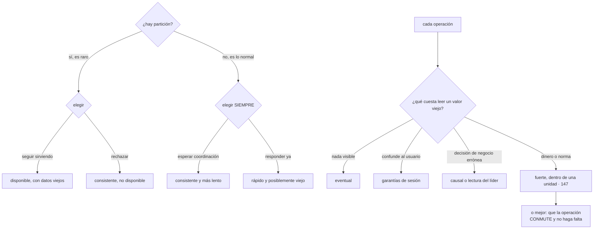

# 149 — CAP, PACELC y consistencia por operación

> [← 148 · Monolito modular, microservicios y función](../../part-12-cloud-native-distributed-architecture/148-monolito-modular-microservicios-y-funcion/README.md) · [Índice de la parte](../README.md) · [150 · Replicación, particionado y consenso →](../../part-12-cloud-native-distributed-architecture/150-replicacion-particionado-y-consenso/README.md)

**Parte:** 12 — Arquitectura cloud-native y sistemas distribuidos<br>
**Nivel:** avanzado-experto · **Horas estimadas:** 4<br>
**Laboratorio:** `distributed` · **Estado:** `EXECUTABLE_CORE`

## 🎯 Propósito

Decidir cuánta consistencia necesita cada operación, que es una decisión **por operación y no por sistema**. La clase enuncia con precisión el teorema que todo el mundo cita mal —habla solo de lo que ocurre durante una partición de red, y no dice nada del 99,99 % del tiempo restante—, presenta la extensión que sí describe el día a día, y desmonta la palabra «eventual», que esconde comportamientos muy distintos. Y termina con la idea que ahorra más consistencia de la que cualquier mecanismo puede dar: **si las operaciones conmutan, el orden deja de importar**.

## 📚 Resultados de aprendizaje

Al finalizar podrás:

1. **Enunciar** correctamente qué dice y qué no dice el teorema.
2. **Usar** la extensión que describe el comportamiento sin partición.
3. **Distinguir** los niveles que se esconden bajo la palabra «eventual».
4. **Clasificar** cada operación por lo que cuesta una lectura desfasada.
5. **Diseñar** operaciones que conmuten para necesitar menos consistencia.

## 🧩 Conceptos centrales

| Concepto | Comprensión verificable |
|---|---|
| `partición de red` | Situación en la que dos partes del sistema no se ven entre sí pero ambas siguen vivas. No se elige: ocurre. |
| `garantías de sesión` | Leer lo que uno mismo escribió, no retroceder en el tiempo y ver las escrituras propias en orden. Son baratas y resuelven casi todo lo visible. |
| `consistencia causal` | Si un cambio depende de otro, todos lo ven en ese orden. No exige orden global. |
| `escritura condicional` | Aplicar el cambio solo si el dato sigue en la versión esperada. Detecta el conflicto en vez de ignorarlo. |
| `conmutatividad` | Que el resultado no dependa del orden de las operaciones. Elimina la necesidad de coordinar. |
| `gana la última escritura` | Resolver conflictos por marca de tiempo. Con relojes distintos, pierde silenciosamente datos correctos. |

## 🧠 Modelo mental

Una arquitectura es un conjunto de decisiones costosas de cambiar; su calidad se juzga contra escenarios concretos, no por la cantidad de servicios usados.

Aplicado a esta clase, separa siempre cuatro planos: **intención** (qué necesita el usuario),
**configuración** (qué declaramos), **estado observado** (qué existe de verdad) y
**evidencia** (cómo sabemos que cumple). Confundirlos produce diseños que se ven correctos
en un diagrama pero fallan al operar.

## 🗺️ Flujo de razonamiento



## 📖 Desarrollo

### 1. Lo que el teorema dice de verdad

La formulación popular —«elige dos de tres»— es incorrecta y ha causado mucho daño. El enunciado real es más estrecho y más útil:

```text
CUANDO hay una partición de red, un sistema distribuido
no puede a la vez responder a todas las peticiones
y garantizar que todas ven el último valor
```

Y de ahí las dos precisiones que cambian su uso:

```text
1. LA PARTICIÓN NO SE ELIGE
   ocurre: un enlace se cae, una zona se aísla, un cortafuegos falla
   → así que no hay tres opciones: hay una decisión sobre qué hacer
     cuando ocurra

2. NO DICE NADA DEL RESTO DEL TIEMPO
   y el resto del tiempo es el 99,99 %
```

La segunda es la importante, y por eso hace falta la extensión que sí describe el día a día:

```text
SI hay partición  → elegir entre seguir sirviendo o ser exacto
SI NO la hay      → elegir entre LATENCIA y CONSISTENCIA
```

Y esa segunda mitad es la que se paga todos los días:

```text
leer del líder                  exacto, y más lento y menos disponible
leer de una réplica cercana     rápido, y puede estar desfasada
esperar confirmación de N       exacto, y añade la latencia de coordinar
confirmar y propagar después    rápido, y hay una ventana de pérdida
```

Y dos ejemplos concretos de esa elección, en decisiones que este programa ya tomó:

```text
réplicas de lectura                                       clase 109
  leer de la réplica es rápido y puede devolver algo viejo

caché con clave versionada                                clase 111
  servir del caché es rápido; el desfase es la ventana acumulada
```

Y la conclusión que ordena la clase:

```text
la consistencia no es una propiedad del sistema
es una decisión POR OPERACIÓN
```

Un mismo sistema tiene operaciones que no pueden equivocarse nunca —descontar la última unidad— y operaciones que toleran minutos de desfase —una recomendación—. Tratarlas igual significa pagar la más cara para todas o aceptar el riesgo de la más barata en todas.

### 2. Lo que esconde la palabra «eventual»

«Eventualmente consistente» solo promete que, si dejan de llegar escrituras, al final todos verán lo mismo. **No promete nada sobre lo que ocurre mientras tanto**, y ahí caben comportamientos muy distintos:

```text
FUERTE (linealizable)
  toda lectura ve la última escritura confirmada
  como si hubiera una sola copia
  → caro: coordinación en cada operación

CAUSAL
  si un cambio depende de otro, todos los ven en ese orden
  no exige orden global entre cambios independientes
  → mucho más barato y suficiente para casi todo lo que confunde

GARANTÍAS DE SESIÓN     ← las prácticas
  leer lo propio     ves lo que TÚ acabas de escribir
  no retroceder      una lectura posterior no devuelve algo más viejo
  escrituras en orden tus escrituras se aplican en el orden que las hiciste

EVENTUAL A SECAS
  cualquier cosa mientras tanto: puedes ver un valor, luego uno
  más antiguo, y luego el nuevo
```

Y el hallazgo práctico de esta clase:

```text
casi todos los problemas VISIBLES para un usuario los resuelven
las garantías de sesión, que son baratas
```

```text
«guardo mi perfil y sale el viejo»            leer lo propio
«actualizo y al recargar desaparece»          no retroceder
«mis dos cambios se aplicaron al revés»       escrituras en orden
```

Y cómo se consiguen, sin cambiar de base de datos:

```text
rutar al líder durante N segundos tras escribir      clase 109
o llevar la versión leída y exigir al menos esa       token de sesión
o fijar la sesión a una réplica concreta
```

**La clasificación por operación**, que es la técnica central. La pregunta:

```text
¿qué ocurre si esta lectura devuelve un valor de hace 5 segundos?
```

Y la escala de respuestas decide el nivel:

```text
NADA VISIBLE                    → eventual
  recomendaciones, contador de visitas, listados de catálogo

CONFUNDE AL USUARIO             → garantías de sesión
  su perfil, su cesta, su último pedido

DECISIÓN DE NEGOCIO ERRÓNEA     → causal o lectura del líder
  mostrar disponible algo agotado, aplicar una promoción retirada

SE PIERDE DINERO O SE INCUMPLE  → fuerte, y dentro de una unidad
  descontar la última unidad, cobrar, aplicar un límite de crédito
```

Y la observación de la clase 109, que aquí se generaliza:

```text
toda lectura que DECIDE una escritura necesita el nivel de esa escritura
→ comprobar existencia antes de insertar
→ leer el saldo antes de descontarlo
```

### 3. Mecanismos, y el que evita el problema

Los mecanismos disponibles, del más caro al más barato:

```text
TRANSACCIÓN                 exacta, y solo dentro de una unidad de
                            consistencia                        clase 147

LECTURA DEL LÍDER           exacta para esa lectura; concentra carga

QUÓRUM                      leer y escribir en la mayoría
                            → si lectura + escritura > total, se ve
                              lo último
                            → y cuesta latencia y disponibilidad

ESCRITURA CONDICIONAL       aplicar solo si la versión es la esperada
                            → no evita el conflicto: lo DETECTA
                            → y detectar es mucho mejor que ignorar

GARANTÍAS DE SESIÓN         baratas, resuelven lo visible

EVENTUAL                    gratis
```

Y la escritura condicional merece detalle porque resuelve la mayoría de los casos intermedios con muy poco coste:

```text
UPDATE producto SET stock = 4, version = 8
WHERE id = 'X' AND version = 7

si afecta a 0 filas → alguien cambió el dato entre medias
→ y entonces se relee y se reintenta, o se informa al usuario
```

Y el mismo mecanismo sirve para el desorden de la clase 114: **si llega la versión 3 después de la 4, se descarta**.

**Y la idea que evita el problema en vez de resolverlo:**

```text
SI LAS OPERACIONES CONMUTAN, EL ORDEN NO IMPORTA
```

```text
no conmuta        stock = 4       dos escrituras concurrentes:
                                  una se pierde
conmuta           stock -= 1      da igual el orden; el resultado
                                  es el mismo
```

Y de ahí una regla de diseño con más alcance del que parece:

```text
expresar el cambio como INCREMENTO o como HECHO añadido,
no como asignación del resultado
→ «reservada 1 unidad» en vez de «stock = 4»
→ y el valor actual se calcula, o se mantiene como proyección
```

Y su límite honesto: **conmutar no garantiza la invariante**. Dos decrementos conmutan y pueden llevar el stock a −1; para impedirlo hace falta o coordinación, o aceptar el sobreventa y compensar —que es lo que hacen muchos negocios a propósito—.

```text
coordinar      no vender nunca de más; se pierde disponibilidad
compensar      vender de más raramente y resolverlo después
               → decisión de negocio, no técnica
```

Y estructuras de datos que conmutan por construcción —contadores, conjuntos, mapas de última escritura por campo— resuelven casos concretos como contadores compartidos, listas de favoritos o presencia, y **no resuelven una invariante de negocio**.

### 4. El tiempo, que no es de fiar

Muchos sistemas resuelven conflictos con la marca de tiempo: **gana la última escritura**. Y es peligroso por una razón sencilla:

```text
los relojes de dos máquinas no coinciden
desviación habitual con sincronización        1-50 ms
desviación cuando la sincronización falla     segundos o más
```

Y con eso:

```text
la escritura A ocurre después de la B en la realidad
pero la máquina de B tiene el reloj 200 ms adelantado
→ gana B
→ y A se pierde EN SILENCIO: no hay error, no hay conflicto,
  simplemente el dato correcto desaparece
```

Las alternativas, en orden de preferencia:

```text
VERSIÓN POR ELEMENTO        un número que crece con cada escritura
                            → la escritura condicional del apartado anterior
RELOJ LÓGICO                cuenta causalidad, no tiempo real
CONFLICTO EXPLÍCITO         guardar las dos versiones y decidir arriba
                            → lo hacen algunos almacenes, y obliga a
                              escribir la lógica de resolución
RELOJ CON INCERTIDUMBRE     el sistema espera a que el intervalo pase
                            → es lo que permite orden global en algunas
                              bases distribuidas, y cuesta latencia
```

Y dos avisos prácticos sobre el tiempo:

```text
nunca uses la marca de tiempo del cliente para decidir orden
  → el reloj del navegador o del móvil puede estar en otro año
y distingue el momento del HECHO del momento de la publicación
  → ya lo exigía la envoltura de la clase 115
```

Y una comprobación que conviene ensayar, porque es un experimento de la clase 131 que casi nadie hace:

```text
desajustar el reloj de una máquina a propósito
y ver qué se rompe
```

Y la lista de comprobación de la clase:

```text
☐ está escrito qué hace el sistema durante una partición
☐ para cada operación está escrito qué cuesta una lectura desfasada
☐ el nivel de consistencia se decide por operación, no por sistema
☐ hay garantías de sesión donde el desfase confunde al usuario
☐ ninguna lectura que decide una escritura usa un nivel más débil
☐ las escrituras concurrentes usan versión, no marca de tiempo
☐ ninguna resolución de conflicto es «gana la última escritura»
☐ los cambios se expresan como incremento o hecho, no como asignación
☐ está escrito si una invariante se coordina o se compensa
☐ el momento del hecho y el de publicación están separados
☐ se ha ensayado un desajuste de reloj
```

Y el cierre que enlaza con la clase siguiente: estas decisiones se apoyan en cómo el almacén copia y reparte los datos por debajo. Qué garantiza cada forma de replicar, qué cuesta el consenso y por qué el número de copias no es una decisión menor es la materia de la clase 150.

## 🔬 Ejemplo trabajado

**CloudShop clasifica sus veinte operaciones principales por lo que cuesta una lectura desfasada. El ejercicio dura una tarde, cambia tres diseños y explica dos incidentes antiguos que nadie había relacionado.**

**La clasificación.**

```text
NADA VISIBLE → eventual                                        12
  listado de catálogo, búsqueda, recomendaciones,
  contadores de visitas, valoraciones, productos relacionados,
  histórico de pedidos, panel de informes, sugerencias,
  productos vistos, novedades, tendencias

CONFUNDE AL USUARIO → garantías de sesión                       5
  ver mi perfil tras editarlo
  ver mi pedido recién hecho
  ver mi cesta tras añadir
  ver mi dirección tras cambiarla
  ver el estado de mi devolución tras solicitarla

DECISIÓN ERRÓNEA → causal o lectura del líder                   1
  mostrar disponibilidad en la ficha de producto

DINERO O NORMA → fuerte, dentro de una unidad                   2
  reservar la última unidad
  aplicar el cobro
```

Doce de veinte no necesitaban nada, y **dos necesitaban todo**. Antes del ejercicio, las veinte leían del líder «por seguridad».

```text                                          antes         después
operaciones que leen del líder                  20              3
carga de lectura sobre el líder            12.000/s          1.900/s
latencia p99 de listados                      41 ms          12 ms
coste de la base                            5.100 €        3.200 €
```

**Las garantías de sesión, implantadas sin cambiar de base.**

El mecanismo fue el de la clase 109, generalizado:

```text
tras cualquier escritura, esa sesión lee del líder durante 5 s
y las respuestas llevan la versión leída, que el cliente devuelve
```

```text                                          antes         después
quejas de «no veo lo que acabo de guardar»   31 / 6 semanas      0
operaciones que leen del líder siempre           20             3
lecturas dirigidas al líder por sesión           —          4,1 % del total
```

**El caso de la disponibilidad, que era el interesante.**

```text
mostrar «en stock» en la ficha de producto
  si está desfasado 5 s → el cliente añade al carrito algo agotado
  → y se entera al pagar
```

La primera propuesta fue leer del líder, y el cálculo lo desaconsejó:

```text
lecturas de ficha de producto                       9.400/s
lecturas del líder que eso añadiría                 9.400/s
capacidad del líder                                 1.500/s
→ inviable
```

La solución fue distinguir dos cosas que se llamaban igual:

```text
MOSTRAR disponibilidad     eventual, con margen
                           «quedan pocas unidades» en vez de un número
                           desfase tolerado: 30 s

RESERVAR                   fuerte, con escritura condicional
                           es donde de verdad importa
```

```text                                          antes         después
lecturas al líder por disponibilidad         9.400/s          0
clientes que llegan al pago con algo agotado   1,4 %         0,3 %
reservas fallidas por conflicto                 —           0,3 %
                                                       (con mensaje claro)
```

**El incidente que la clasificación explicó: gana la última escritura.**

```text
síntoma histórico   cambios de dirección de envío que «se deshacían»
frecuencia          unos 8 casos al mes, sin patrón aparente
diagnóstico previo  «los clientes se confunden»
```

El almacén de perfiles resolvía conflictos por marca de tiempo:

```text
el cliente cambia la dirección desde el móvil     10:00:00,150
un proceso de normalización de direcciones
reescribe el registro                             10:00:00,090
                                                  (reloj adelantado 200 ms)
→ gana el proceso, y el cambio del cliente desaparece
→ sin error, sin conflicto y sin rastro
```

```text                                          antes         después
resolución de conflictos              marca de tiempo    versión por elemento
qué pasa con un conflicto             se pierde uno      falla y se reintenta
                                      en silencio        releyendo
casos de «se deshizo mi cambio»          8 / mes             0
desviación de reloj medida entre nodos   hasta 340 ms    vigilada, alerta > 50 ms
```

Y el ensayo de la clase 131 que se añadió:

```text
desajustar el reloj de un nodo 2 segundos, a propósito
primera vez           3 comportamientos rotos
  → expiración de sesiones, firma de avisos y ordenación de eventos
tras corregirlos      sin efecto observable
```

**La conmutatividad, aplicada al inventario.**

El modelo original asignaba el resultado:

```text
UPDATE producto SET stock = 4 WHERE id = 'X'
→ dos reservas simultáneas: una se pierde
→ se vendían dos unidades de la última
```

Y al expresarlo como hechos que conmutan:

```text
INSERT INTO movimientos (producto, delta, motivo, id_operacion)
VALUES ('X', -1, 'reserva', 'op-9f2c')

con restricción única sobre id_operacion             clase 116
y el stock actual como proyección mantenida
```

```text                                    asignación      hechos conmutativos
reservas simultáneas                    una se pierde     ambas se registran
sobreventa                              posible          controlada
cómo se impide vender de más            no se impedía    escritura condicional
                                                         sobre la proyección
histórico de por qué cambió el stock    no existía       completo
```

Y la última fila fue un beneficio inesperado: **el historial de movimientos resolvió las discrepancias de inventario que antes se investigaban a mano**.

Y la decisión de negocio, escrita explícitamente:

```text
¿coordinar para no vender nunca de más, o compensar?
  coordinar        reservar exige lectura fuerte; latencia +40 ms
                   y con el líder caído no se puede vender
  compensar        se acepta sobreventa en la ventana de partición
                   y se avisa al cliente

decisión   COORDINAR para el flujo normal
           COMPENSAR durante una partición: se acepta el pedido,
           se marca «pendiente de confirmar disponibilidad»
           y se resuelve al recuperarse

casos de compensación en 12 meses                              6
de ellos, resueltos con stock disponible                       5
de ellos, con disculpa y cupón                                 1
```

**Lo que hace el sistema durante una partición, escrito.**

```text
si la réplica no ve al líder
  lecturas eventuales      se sirven de la réplica            ✓
  garantías de sesión      se degradan: se avisa «datos de hace X»
  disponibilidad mostrada  se sirve con margen mayor
  reservas y cobros        se RECHAZAN con mensaje claro
                           salvo el modo compensado, si se activa
```

Y eso se ensayó con el experimento correspondiente:

```text
partición provocada de 4 minutos
  peticiones servidas                                     94 %
  peticiones rechazadas                                    6 %  (reservas)
  datos incorrectos servidos                               0
  pedidos perdidos                                         0
```

**A los seis meses.**

```text                                          antes         después
operaciones con nivel decidido                   0 de 20      20 de 20
operaciones que leen del líder                   20             3
carga de lectura sobre el líder              12.000/s       1.900/s
latencia p99 de listados                       41 ms          12 ms
quejas de «no veo lo que guardé»            31 / 6 sem          0
casos de «se deshizo mi cambio»                8 / mes          0
sobreventa de la última unidad              4 / trimestre       0
resolución de conflictos por marca de tiempo    sí              no
histórico de movimientos de stock               no              sí
comportamiento durante partición, escrito       no              sí
y ensayado                                      no          semestral
```

**La lección que esta clase traslada a la parte 12**: de veinte operaciones, **doce no necesitaban ninguna garantía y dos las necesitaban todas**, y antes del ejercicio las veinte pagaban el precio de las dos. Y el incidente que más tiempo llevaba sin explicación —ocho cambios de dirección al mes que «se deshacían»— no era un problema de consistencia insuficiente: era **una resolución de conflictos por marca de tiempo con los relojes desajustados 340 milisegundos**, que perdía el dato correcto sin dejar ningún rastro.

## 🧪 Laboratorio guiado

Ejecuta desde la raíz:

```bash
python classes/part-12-cloud-native-distributed-architecture/149-cap-pacelc-y-consistencia-por-operacion/lab.py
```

El laboratorio selecciona el motor de práctica **`distributed`** y produce
`lab_result.json`. El escenario, sus comprobaciones y el artefacto esperado corresponden a
esta clase; no requiere credenciales y deja explícito qué debe revalidarse en un sandbox real.

1. Lee `exercise.steps` y formula una predicción antes de ejecutar.
2. Ejecuta la práctica y verifica todos los elementos de `checks`.
3. Provoca el caso de `negative_test` y explica la señal observada.
4. Materializa `matriz-consistencia` en `evidence/` usando la plantilla indicada.
5. Para proveedor real, sigue `sandbox.requires`, registra costo y ejecuta `destroy`.

### Evidencia esperada

El artefacto principal es una traza de consistencia, reintento o fallo parcial. Además, la entrega debe incluir el comando ejecutado,
la salida estructurada y una conclusión que no exceda lo observado.

## 🏆 Reto verificable

Construye **`matriz-consistencia`** para el caso CloudShop. Incluye una alternativa descartada,
un supuesto que pueda falsarse, una prueba de fallo y una decisión de rollback.

## ✅ Criterio de aceptación

- [ ] `lab.py` termina con código 0 y genera JSON válido.
- [ ] La entrega conecta al menos tres requisitos con mecanismos verificables.
- [ ] Existe una prueba positiva y una prueba negativa con evidencia.
- [ ] Seguridad, costo y operación aparecen como decisiones, no como anexos.
- [ ] Se declara una limitación y una condición que obligaría a revisar el diseño.
- [ ] Otra persona puede repetir el recorrido sin conocimiento tácito.

## ⚠️ Errores frecuentes

| Síntoma | Causa probable | Corrección |
|---|---|---|
| Todas las lecturas van al líder y este se satura | La consistencia se decidió para el sistema entero en vez de por operación | Clasifica cada operación por lo que cuesta una lectura desfasada; casi siempre la mayoría tolera eventual. |
| El usuario no ve lo que acaba de guardar | Falta la garantía de leer lo propio | Ruta al líder durante unos segundos tras escribir, o lleva la versión leída en la sesión. |
| Un cambio correcto desaparece sin error ni conflicto | La resolución es por marca de tiempo y los relojes no coinciden | Resuelve por versión por elemento con escritura condicional, y vigila la desviación de reloj. |
| Dos operaciones concurrentes y una se pierde | El cambio se expresa como asignación del resultado | Exprésalo como incremento o como hecho añadido; si conmuta, el orden deja de importar. |
| Se vende la última unidad dos veces | Una lectura débil decide una escritura | Toda lectura que decide una escritura necesita el nivel de esa escritura; y escribe si la invariante se coordina o se compensa. |
| Nadie sabe qué hace el sistema si se parte la red | No se ha decidido; se descubrirá durante el incidente | Escríbelo por familia de operación y ensáyalo provocando una partición. |

## 🛡️ Seguridad, ética y costo

Trabaja con cuentas propias o sandboxes autorizados. No publiques secretos, identificadores
reales ni datos personales. Antes de crear recursos pagos define presupuesto, etiquetas y
comando de destrucción; después verifica que no queden recursos huérfanos. Los ejemplos
locales enseñan contratos, pero no certifican cumplimiento ni disponibilidad de producción.

## ❓ Preguntas de comprobación

1. ¿Qué dice exactamente el teorema y qué no dice?
2. ¿Qué elección se hace el 99,99 % del tiempo, cuando no hay partición?
3. ¿Qué tres garantías de sesión existen y qué problemas visibles resuelven?
4. ¿Por qué «gana la última escritura» pierde datos en silencio?
5. ¿Qué gana expresar un cambio como incremento en vez de como asignación?

## 🔗 Referencias

- Brewer, E. (2012). *CAP twelve years later: how the rules have changed* — el enunciado correcto y sus matices. <https://www.infoq.com/articles/cap-twelve-years-later-how-the-rules-have-changed/>
- Abadi, D. (2012). *Consistency tradeoffs in modern distributed database design* — la extensión que incluye la latencia. <https://www.cs.umd.edu/~abadi/papers/abadi-pacelc.pdf>
- Terry, D. y otros (1994). *Session guarantees for weakly consistent replicated data* — leer lo propio y no retroceder. <https://dl.acm.org/doi/10.5555/645792.668302>
- Kleppmann, M. (2017). *Designing Data-Intensive Applications*, cap. 5 y 9 — replicación, relojes y consistencia. <https://dataintensive.net/>
- Shapiro, M. y otros (2011). *Conflict-free replicated data types* — estructuras que conmutan por construcción. <https://inria.hal.science/inria-00555588/>
- Documentación oficial vigente del servicio implementado; registra URL y fecha de consulta.

---

> [Evaluación](assessment.md) · [Contrato de clase](lesson.yaml) · [Índice de la parte](../README.md)

**📥 Descargar:** [Parte 12 en PDF](../../../site/downloads/partes/manual-parte-12-cloud-native-distributed-architecture.pdf) · [Manual integral](../../../site/downloads/multi-cloud-engineering-manual-v2.0.pdf)

| Anterior | Índice | Siguiente |
|---|---|---|
| [← 148 · Monolito modular, microservicios y función](../../part-12-cloud-native-distributed-architecture/148-monolito-modular-microservicios-y-funcion/README.md) | [Parte 12](../README.md) · [Programa](../../README.md) | [150 · Replicación, particionado y consenso →](../../part-12-cloud-native-distributed-architecture/150-replicacion-particionado-y-consenso/README.md) |
