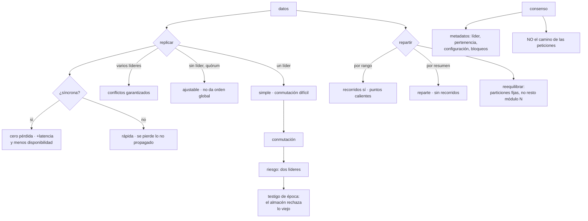

# 150 — Replicación, particionado y consenso

> [← 149 · CAP, PACELC y consistencia por operación](../../part-12-cloud-native-distributed-architecture/149-cap-pacelc-y-consistencia-por-operacion/README.md) · [Índice de la parte](../README.md) · [151 · Fallos parciales y patrones de resiliencia →](../../part-12-cloud-native-distributed-architecture/151-fallos-parciales-y-patrones-de-resiliencia/README.md)

**Parte:** 12 — Arquitectura cloud-native y sistemas distribuidos<br>
**Nivel:** avanzado-experto · **Horas estimadas:** 4<br>
**Laboratorio:** `distributed` · **Estado:** `EXECUTABLE_CORE`

## 🎯 Propósito

Entender qué hace por debajo el almacén que sostiene las decisiones de la clase 149: **copiar** los datos, que da disponibilidad y capacidad de lectura, y **repartirlos**, que da capacidad de escritura y tamaño. La clase separa los dos ejes, muestra lo que garantiza cada forma de copiar y lo que cuesta cada una, explica el mecanismo que impide el peor fallo de todos —dos nodos creyéndose líderes a la vez— y sitúa el consenso donde corresponde: **para poco dato y muy crítico, nunca en el camino de las peticiones**.

## 📚 Resultados de aprendizaje

Al finalizar podrás:

1. **Separar** replicar de repartir, y componer los dos.
2. **Elegir** la topología de copia según quién escribe y desde dónde.
3. **Cuantificar** lo que se pierde en una conmutación asíncrona.
4. **Explicar** cómo se evita que dos nodos actúen como líder a la vez.
5. **Repartir** de forma que reequilibrar no rompa nada, y situar el consenso.

## 🧩 Conceptos centrales

| Concepto | Comprensión verificable |
|---|---|
| `replicación` | Varias copias del mismo dato. Da disponibilidad y capacidad de lectura; no da capacidad de escritura. |
| `particionado` | Repartir datos distintos en nodos distintos. Da capacidad de escritura y tamaño; no da disponibilidad por sí solo. |
| `punto de recuperación` | Cuántos datos se pierden como máximo al conmutar. Con copia asíncrona, es mayor que cero por definición. |
| `cerebro dividido` | Dos nodos creyéndose líderes a la vez. Produce escrituras divergentes que después nadie sabe reconciliar. |
| `testigo de época` | Número creciente que acompaña a cada acción del líder. El almacén rechaza lo que llegue con una época vieja. |
| `particiones fijas` | Crear muchas más particiones que nodos y mover particiones enteras al reequilibrar, sin recalcular la asignación de claves. |
| `consenso` | Acordar un valor pese a fallos. Necesita mayoría, cuesta viajes de red y empeora al añadir nodos. |

## 🧠 Modelo mental

Una arquitectura es un conjunto de decisiones costosas de cambiar; su calidad se juzga contra escenarios concretos, no por la cantidad de servicios usados.

Aplicado a esta clase, separa siempre cuatro planos: **intención** (qué necesita el usuario),
**configuración** (qué declaramos), **estado observado** (qué existe de verdad) y
**evidencia** (cómo sabemos que cumple). Confundirlos produce diseños que se ven correctos
en un diagrama pero fallan al operar.

## 🗺️ Flujo de razonamiento



## 📖 Desarrollo

### 1. Dos ejes que se confunden

```text
REPLICAR    varias copias del MISMO dato
  da        disponibilidad ante la pérdida de un nodo
            capacidad de lectura
  no da     capacidad de escritura: todas las copias escriben lo mismo

REPARTIR    datos DISTINTOS en nodos distintos
  da        capacidad de escritura y tamaño
  no da     disponibilidad: si cae la partición 3, se pierde su parte
```

Y casi todo sistema real necesita los dos, compuestos:

```text
24 particiones × 3 copias cada una = 72 unidades de datos
→ cada partición tiene su líder y sus réplicas
→ y el líder de cada partición puede estar en un nodo distinto
```

Y el error habitual es pedirle a uno lo que da el otro:

```text
«añadimos réplicas porque no damos abasto escribiendo»
  → no sirve: las réplicas escriben lo mismo
«particionamos para tolerar la caída de un nodo»
  → no sirve: se pierde esa partición
```

**Las topologías de copia**, por quién puede escribir:

```text
UN SOLO LÍDER
  todas las escrituras van a un nodo; las copias lo siguen
  + simple, sin conflictos, orden claro
  − el líder es un límite de escritura
  − y la conmutación es el problema difícil

VARIOS LÍDERES
  se escribe en cualquiera y se propagan entre ellos
  + escritura local en varias regiones; tolera clientes desconectados
  − LOS CONFLICTOS SON INEVITABLES, no excepcionales
  → solo se justifica por escritura multirregión o trabajo sin conexión

SIN LÍDER, POR QUÓRUM
  el cliente escribe en varias copias y lee de varias
  si lecturas + escrituras > total, se ve lo último escrito
  + tolera nodos caídos sin conmutar nada
  − no da orden global ni operaciones condicionales fáciles
  − y las reparaciones en segundo plano son parte del diseño
```

Y una precisión que se pasa por alto: **la desigualdad del quórum no garantiza linealizabilidad**. Garantiza que alguna copia leída tiene el último valor confirmado, y con escrituras concurrentes o fallidas a medias siguen apareciendo casos que hay que resolver con versiones.

### 2. Síncrono, asíncrono y lo que se pierde

La decisión con más consecuencias del apartado anterior:

```text
SÍNCRONA     el líder no confirma hasta que la copia ha recibido
  + no se pierde nada al conmutar
  − cada escritura paga el viaje de ida y vuelta
  − y si la copia no responde, el líder SE BLOQUEA

ASÍNCRONA    el líder confirma y propaga después
  + rápida, y el líder no depende de la copia
  − al conmutar se pierde lo que no llegó a propagarse

SEMISÍNCRONA el compromiso habitual
  una copia síncrona, las demás asíncronas
  → si esa copia se atasca, se promueve otra a síncrona
```

Y la cifra que hay que conocer y casi nadie mide:

```text
PUNTO DE RECUPERACIÓN = cuántos datos se pierden al conmutar

con copia asíncrona, se estima con el retardo de replicación
  retardo habitual        20-200 ms  → decenas de escrituras
  retardo bajo carga      1-30 s     → miles de escrituras
```

Y el mismo dato dicho de la forma que obliga a decidir:

```text
«si el líder se pierde ahora mismo, ¿cuántos pedidos desaparecen?»
```

Y la elección se hace por dato, no por sistema, igual que en la clase 149:

```text
pedidos y cobros            síncrona o semisíncrona: no se pierden
sesiones y carritos         asíncrona: se acepta perder unos segundos
telemetría y contadores     asíncrona sin dudarlo
```

**La conmutación**, que es donde falla todo. Sus dos peligros:

```text
ESCRITURAS PERDIDAS
  se promueve una copia que iba retrasada
  → lo que confirmó el líder viejo y no llegó, desaparece
  → y si el líder viejo vuelve, hay que decidir qué hacer con ello

DOS LÍDERES A LA VEZ
  el líder viejo no está caído: está aislado o pausado
  y sigue creyendo que es el líder
  → dos nodos aceptan escrituras divergentes
  → y después nadie sabe reconciliarlas
```

Y el segundo es el que produce daños irreparables, porque **no da ningún error mientras ocurre**.

El mecanismo que lo impide es sencillo y conviene conocerlo:

```text
TESTIGO DE ÉPOCA
  cada vez que se elige un líder, el número de época sube
  toda operación del líder lleva su época
  y el almacén RECHAZA cualquier operación con una época menor
    que la mayor que ha visto

→ el líder viejo puede creer lo que quiera; sus escrituras se rechazan
→ la garantía no está en el líder: está en el que recibe
```

Y la lección general, que vale para cualquier sistema con bloqueos distribuidos:

```text
nunca confíes en que quien tenía un permiso siga teniéndolo
que lo compruebe quien ejecuta, con un número que solo crece
```

### 3. Repartir, y reequilibrar sin romper

**Cómo se decide en qué partición va cada dato:**

```text
POR RANGO DE CLAVE
  A-F en la 1, G-M en la 2, …
  + los recorridos por rango son eficientes
  − puntos calientes si las claves no se distribuyen
    → «todo lo de hoy» va a la misma partición        clase 114

POR RESUMEN DE LA CLAVE
  + reparte muy bien
  − se pierden los recorridos por rango: quedan desperdigados

COMBINADO
  resumen del primer componente, rango del segundo
  → «todos los eventos del pedido X, ordenados por tiempo»
  → es lo que hacen los almacenes de columna ancha    clase 110

DIRECTORIO EXPLÍCITO
  una tabla dice dónde está cada rango
  + máxima flexibilidad para mover
  − ese directorio es un componente crítico más
```

**El reequilibrado**, que es donde está el error clásico:

```text
mal    partición = resumen(clave) mod N
       → al cambiar N, casi TODAS las claves cambian de sitio
       → y el orden por clave se rompe                clase 114

bien   PARTICIONES FIJAS
       se crean muchas más particiones que nodos: 256 para 8 nodos
       cada nodo aloja varias
       al añadir un nodo, se le MUEVEN particiones enteras
       → la asignación clave→partición nunca cambia

bien   RESUMEN CONSISTENTE
       nodos y claves en un anillo; al añadir uno, solo se mueve
       la parte contigua
```

Y el número de particiones vuelve a ser la decisión irreversible de la clase 114:

```text
demasiadas   metadatos, ficheros y reequilibrados lentos
demasiado pocas  techo de paralelismo, y ampliar duele
regla práctica   suficientes para el crecimiento previsto ×2 o ×3
```

**Los índices secundarios**, que es el problema que aparece en cuanto se reparte:

```text
LOCAL A CADA PARTICIÓN
  cada partición indexa lo suyo
  + escribir es barato: solo toca la partición del dato
  − consultar exige preguntar a TODAS y unir los resultados
  → y la latencia la marca la partición más lenta   clase 124

GLOBAL, PARTICIONADO POR EL CAMPO INDEXADO
  + consultar toca una sola partición del índice
  − escribir toca dos particiones distintas
  → y esa escritura ya no es atómica: suele ser asíncrona
```

Y la consecuencia práctica del segundo: **el índice global va por detrás**, así que una consulta por ese índice es eventualmente consistente aunque el dato no lo sea. Es un caso más de la clasificación de la clase 149.

### 4. Consenso: para qué sí y para qué no

El consenso resuelve un problema muy concreto: **que un grupo de nodos acuerde un valor pese a que algunos fallen o no se vean**.

Y se usa para poco dato y muy crítico:

```text
quién es el líder de cada partición
qué nodos forman el grupo
la configuración: dónde está cada partición
bloqueos y arrendamientos
y el número de época del apartado segundo
```

Sus propiedades, que hay que aceptar:

```text
NECESITA MAYORÍA
  con 5 nodos, funciona con 3; con 2 de 5, se detiene
  → detenerse es la respuesta CORRECTA: seguir sería divergir

CUESTA VIAJES DE RED
  cada decisión son al menos dos rondas

NO ESCALA AÑADIENDO NODOS
  más nodos → más mensajes → decisiones más lentas
  → 3 o 5 nodos; 7 solo si hay motivo; nunca 50

EL NÚMERO IMPAR IMPORTA
  4 nodos toleran 1 fallo, igual que 3
  → el cuarto añade coste sin añadir tolerancia
```

Y la regla que ordena su uso:

```text
CONSENSO PARA LOS METADATOS
NUNCA EN EL CAMINO DE CADA PETICIÓN
```

Si cada operación de negocio necesita un acuerdo entre nodos, el sistema tendrá la latencia y la disponibilidad del acuerdo. Lo que hacen los almacenes bien diseñados es **usar consenso para decidir quién manda, y luego escribir contra el que manda**.

Y una advertencia sobre los bloqueos distribuidos, que es donde más se equivoca la gente:

```text
un bloqueo distribuido con caducidad NO garantiza exclusión
  el proceso puede pausarse justo después de obtenerlo
  la caducidad vence, otro lo toma
  y el primero despierta creyendo que aún lo tiene
→ hace falta el testigo de época comprobado por quien EJECUTA
→ y si el recurso no puede comprobarlo, el bloqueo es orientativo
```

Y el corolario práctico: **muchos usos de un bloqueo distribuido se resuelven mejor con idempotencia** —clase 116—, porque entonces da igual que se ejecute dos veces.

Y qué mirar de todo esto en un servicio gestionado, que es lo habitual:

```text
¿la copia es síncrona, asíncrona o mixta? ¿se puede elegir?
¿cuál es el punto de recuperación anunciado y el medido?
¿cuánto tarda una conmutación, medido?                clase 109
¿qué pasa con las escrituras en vuelo?
¿hay protección contra dos líderes, y cómo?
¿cuántas particiones tiene y se pueden ampliar?       clase 114
¿los índices secundarios son locales o globales?
¿qué ocurre cuando se pierde la mayoría?
```

Y la lista de comprobación de la clase:

```text
☐ está claro qué problema resuelve replicar y cuál repartir
☐ la topología de copia corresponde a quién escribe y desde dónde
☐ hay varios líderes solo si hay motivo multirregión o sin conexión
☐ está decidido por dato si la copia es síncrona o asíncrona
☐ el punto de recuperación está medido, no solo anunciado
☐ existe protección contra dos líderes y se ha comprobado
☐ la asignación clave→partición no depende del número de nodos
☐ el número de particiones cubre el crecimiento previsto
☐ está claro si los índices secundarios son locales o globales
☐ el consenso solo gobierna metadatos, no el camino de las peticiones
☐ los grupos de consenso tienen número impar y pocos nodos
☐ ningún bloqueo distribuido se usa sin comprobación en quien ejecuta
```

Y el cierre que enlaza con la clase siguiente: replicar y repartir reducen la probabilidad de perderlo todo y **aumentan la de que algo falle en parte**. Cómo se comporta un sistema cuando una pieza responde mal, tarde o a medias es la materia de la clase 151.

## 🔬 Ejemplo trabajado

**CloudShop tiene su base principal con una réplica y un almacén no relacional con 24 particiones. El ejercicio consiste en medir lo que de verdad garantizan, y produce dos sorpresas: el punto de recuperación real y un caso de dos líderes que había ocurrido sin que nadie lo supiera.**

**Medir el punto de recuperación.**

Lo anunciado y lo medido:

```text
anunciado por el proveedor        «pérdida mínima»
configuración real                copia asíncrona
retardo de replicación, mediana                        41 ms
retardo, percentil 99                                 380 ms
retardo durante el cierre mensual                     11 s
escrituras por segundo en el pico                     1.900

pérdida estimada al conmutar
  en condiciones normales                     ~80 escrituras
  durante el cierre mensual                ~20.900 escrituras
```

Veinte mil escrituras en el peor momento. Y la pregunta que lo hizo accionable:

```text
«si el líder se pierde durante el cierre, ¿cuántos pedidos desaparecen?»
respuesta       entre 400 y 600
respuesta esperada por el negocio      «ninguno»
```

Y la decisión por dato, no por sistema:

```text                                    antes            después
pedidos y cobros                      asíncrona       SEMISÍNCRONA
                                                      (1 copia síncrona)
sesiones y carritos                   asíncrona       asíncrona
telemetría                            asíncrona       asíncrona

latencia de escritura de pedidos       4,1 ms          6,8 ms
pérdida estimada de pedidos al conmutar  400-600            0
coste                              una réplica más    +310 €/mes
```

Dos coma siete milisegundos más por escritura de pedido, **y ninguna pérdida**. Para sesiones no se cambió nada porque perder cinco segundos de carrito no cuesta nada.

**El caso de los dos líderes, encontrado mirando hacia atrás.**

Al revisar un incidente antiguo con este vocabulario:

```text
hace 9 meses
  el nodo líder sufrió una pausa larga de recolección de memoria: 47 s
  el sistema lo dio por muerto a los 30 s y promovió la réplica
  a los 47 s el líder viejo despertó y siguió aceptando escrituras
  durante 90 s hasta que se dio cuenta

escrituras aceptadas por el líder viejo tras la promoción       412
escrituras que se perdieron al reincorporarse                   412
cómo se detectó   un descuadre de inventario, 3 días después
cómo se explicó entonces   «un problema puntual de la base»
```

Cuatrocientas doce escrituras desaparecidas **sin ningún error**, y tres días para notarlo.

Y al comprobar la protección:

```text
¿había testigo de época?                       sí, en el motor
¿lo comprobaba el almacenamiento?              sí
¿por qué se perdieron entonces?    las 412 se aceptaron en memoria
                                   y se rechazaron al intentar persistir,
                                   pero la aplicación ya había
                                   respondido «correcto» al cliente
```

Y ahí estaba el fallo real, que no era de la base:

```text
la aplicación confirmaba al cliente antes de que la escritura
estuviera confirmada por el almacenamiento
→ nivel de confirmación relajado «por rendimiento»
```

```text                                          antes         después
nivel de confirmación de escritura       relajado      confirmada por la
                                                       mayoría
latencia de escritura                     4,1 ms         6,8 ms
escrituras confirmadas al cliente y
perdidas después                        412 (una vez)        0
ensayo de pausa larga del líder            nunca        semestral
```

Y el ensayo correspondiente, añadido al catálogo de la clase 131:

```text
pausar el proceso líder 60 segundos a propósito
  primera ejecución    2 comportamientos incorrectos
    → un servicio reintentaba contra el nodo viejo indefinidamente
    → un trabajo por lotes no detectaba el cambio de líder
  tras corregir        conmutación limpia en 52 s, 0 pérdidas
```

**El reparto, y el reequilibrado que no se podía hacer.**

El almacén no relacional tenía 24 particiones, asignadas por resto:

```text
partición = resumen(id_pedido) mod 24
```

Y al querer pasar a 32 nodos:

```text
claves que cambiarían de partición                          97 %
tiempo de migración estimado                            5 semanas
orden por clave durante la migración                    no garantizado
```

Es el mismo problema de la clase 114 en otro sistema. La corrección fue pasar a particiones fijas:

```text                                    resto módulo N    particiones fijas
particiones lógicas                          24                 512
nodos                                         8                   8
particiones por nodo                          3                  64
al añadir un nodo                       migrar el 97 %     mover 57 particiones
tiempo de reequilibrado                  5 semanas            41 min
orden por clave durante el cambio        se rompe            intacto
```

Cuarenta y un minutos frente a cinco semanas, **porque la asignación de clave a partición no cambia nunca**.

Y el coste de las 512 particiones lógicas, medido:

```text
metadatos adicionales                                    +18 MB
latencia añadida                                        no medible
coste                                                        0
```

**Los índices secundarios.**

```text
consulta «pedidos de un cliente»          índice por cliente
implementación actual                     local a cada partición
→ cada consulta preguntaba a las 24 particiones

latencia p50                                             38 ms
latencia p99                                            410 ms  ← la más lenta
coste por consulta                            24 lecturas
```

Y el índice global, con su compromiso:

```text                                    local (24 consultas)   global
latencia p50                                38 ms                8 ms
latencia p99                               410 ms               21 ms
lecturas por consulta                          24                  1
escrituras por pedido                           1                  2
consistencia del índice                    inmediata      eventual (~200 ms)
```

Y la decisión se tomó con la clasificación de la clase 149:

```text
¿qué cuesta que el índice vaya 200 ms por detrás?
  «mis pedidos» → el cliente puede no ver el recién hecho
  → se resuelve con la garantía de sesión ya implantada
→ índice GLOBAL, con lectura del principal durante 5 s tras escribir
```

**El consenso, revisado.**

```text
grupos de consenso en el sistema                              3
  coordinación del almacén no relacional      5 nodos      correcto
  elección de líder de la base                3 nodos      correcto
  bloqueos distribuidos de la aplicación      4 nodos      ← mal
```

El tercero tenía dos problemas:

```text
1. cuatro nodos toleran los mismos fallos que tres, y cuestan más
2. los bloqueos se usaban en el camino de las peticiones
   → cada reserva de inventario pedía un bloqueo distribuido
   → +14 ms por operación, y una dependencia más
```

Y la corrección aplicó el corolario del apartado cuarto:

```text                                    con bloqueo      con idempotencia
                                                          y escritura condicional
latencia añadida por reserva               14 ms               0
dependencia adicional                       sí                 no
comportamiento si el servicio de
bloqueos cae                          no se puede reservar   sigue funcionando
casos de doble reserva                       0                  0
nodos de consenso                            4                  0
```

Y el único uso que se conservó de bloqueo distribuido —un proceso nocturno que no debe ejecutarse dos veces— se dejó con **comprobación de época en el destino**, no solo con caducidad.

**A los seis meses.**

```text                                          antes         después
copia de pedidos                            asíncrona    semisíncrona
pérdida estimada al conmutar               400-600 pedidos     0
nivel de confirmación                       relajado      mayoría
escrituras confirmadas y perdidas         412 (histórico)      0
ensayo de pausa del líder                    nunca        semestral
asignación de partición                  resto módulo N   particiones fijas
tiempo de reequilibrado                    5 semanas        41 min
índice secundario                             local        global
latencia p99 de «mis pedidos»                410 ms          21 ms
grupos de consenso                              3              2
bloqueos distribuidos en el camino
de peticiones                                   sí             no
```

**La lección que esta clase traslada a la parte 12**: la base anunciaba «pérdida mínima» y perdía entre cuatrocientos y seiscientos pedidos en el peor momento del mes, y nadie lo sabía porque **nadie había multiplicado el retardo de replicación por las escrituras por segundo**. Y el incidente de hace nueve meses —cuatrocientas doce escrituras confirmadas al cliente y desaparecidas después— no lo causó la base: lo causó **una aplicación que respondía «correcto» antes de que el almacenamiento lo hubiera confirmado**, con la protección contra dos líderes funcionando perfectamente por debajo.

## 🧪 Laboratorio guiado

Ejecuta desde la raíz:

```bash
python classes/part-12-cloud-native-distributed-architecture/150-replicacion-particionado-y-consenso/lab.py
```

El laboratorio selecciona el motor de práctica **`distributed`** y produce
`lab_result.json`. El escenario, sus comprobaciones y el artefacto esperado corresponden a
esta clase; no requiere credenciales y deja explícito qué debe revalidarse en un sandbox real.

1. Lee `exercise.steps` y formula una predicción antes de ejecutar.
2. Ejecuta la práctica y verifica todos los elementos de `checks`.
3. Provoca el caso de `negative_test` y explica la señal observada.
4. Materializa `modelo-replicacion` en `evidence/` usando la plantilla indicada.
5. Para proveedor real, sigue `sandbox.requires`, registra costo y ejecuta `destroy`.

### Evidencia esperada

El artefacto principal es una traza de consistencia, reintento o fallo parcial. Además, la entrega debe incluir el comando ejecutado,
la salida estructurada y una conclusión que no exceda lo observado.

## 🏆 Reto verificable

Construye **`modelo-replicacion`** para el caso CloudShop. Incluye una alternativa descartada,
un supuesto que pueda falsarse, una prueba de fallo y una decisión de rollback.

## ✅ Criterio de aceptación

- [ ] `lab.py` termina con código 0 y genera JSON válido.
- [ ] La entrega conecta al menos tres requisitos con mecanismos verificables.
- [ ] Existe una prueba positiva y una prueba negativa con evidencia.
- [ ] Seguridad, costo y operación aparecen como decisiones, no como anexos.
- [ ] Se declara una limitación y una condición que obligaría a revisar el diseño.
- [ ] Otra persona puede repetir el recorrido sin conocimiento tácito.

## ⚠️ Errores frecuentes

| Síntoma | Causa probable | Corrección |
|---|---|---|
| Se añaden réplicas y la capacidad de escritura no mejora | Se confunde replicar con repartir | Replicar da disponibilidad y lectura; para escribir más hace falta particionar. |
| Al conmutar desaparecen datos que el cliente creía guardados | Copia asíncrona y confirmación al cliente antes de que el almacenamiento confirme | Mide el punto de recuperación multiplicando retardo por escrituras; usa copia semisíncrona y confirmación por mayoría para lo que no se puede perder. |
| Dos nodos aceptan escrituras a la vez tras una pausa larga | El líder viejo no sabe que fue reemplazado | Testigo de época comprobado por quien persiste, y ensaya pausando el líder a propósito. |
| Añadir un nodo obliga a migrar casi todos los datos | La partición se calcula como resto del número de nodos | Usa particiones fijas en número mucho mayor que los nodos, o resumen consistente. |
| Una consulta por índice secundario tiene un percentil 99 pésimo | El índice es local y hay que preguntar a todas las particiones | Valora un índice global particionado por el campo consultado, aceptando que irá eventualmente por detrás. |
| Cada operación de negocio necesita un acuerdo entre nodos | El consenso está en el camino de las peticiones | Usa consenso solo para metadatos; sustituye los bloqueos distribuidos por idempotencia y escritura condicional. |

## 🛡️ Seguridad, ética y costo

Trabaja con cuentas propias o sandboxes autorizados. No publiques secretos, identificadores
reales ni datos personales. Antes de crear recursos pagos define presupuesto, etiquetas y
comando de destrucción; después verifica que no queden recursos huérfanos. Los ejemplos
locales enseñan contratos, pero no certifican cumplimiento ni disponibilidad de producción.

## ❓ Preguntas de comprobación

1. ¿Qué da replicar y qué da repartir, y qué no da cada uno?
2. ¿Cómo se estima cuántos datos se pierden en una conmutación asíncrona?
3. ¿Cómo impide un testigo de época que dos nodos actúen como líder?
4. ¿Por qué calcular la partición como resto del número de nodos es un error?
5. ¿Para qué debe usarse el consenso y para qué no?

## 🔗 Referencias

- Kleppmann, M. (2017). *Designing Data-Intensive Applications*, caps. 5, 6 y 9 — replicación, particionado y consenso. <https://dataintensive.net/>
- Ongaro, D. y Ousterhout, J. (2014). *In search of an understandable consensus algorithm (Raft)* — elección de líder y mayorías. <https://raft.github.io/raft.pdf>
- Kleppmann, M. (2016). *How to do distributed locking* — por qué un bloqueo con caducidad necesita testigo comprobado en el destino. <https://martin.kleppmann.com/2016/02/08/how-to-do-distributed-locking.html>
- Karger, D. y otros (1997). *Consistent hashing and random trees* — reequilibrado sin recalcular la asignación. <https://dl.acm.org/doi/10.1145/258533.258660>
- DeCandia, G. y otros (2007). *Dynamo: Amazon's highly available key-value store* — quórum, reparación y sus límites. <https://www.allthingsdistributed.com/files/amazon-dynamo-sosp2007.pdf>
- Documentación oficial vigente del servicio implementado; registra URL y fecha de consulta.

---

> [Evaluación](assessment.md) · [Contrato de clase](lesson.yaml) · [Índice de la parte](../README.md)

**📥 Descargar:** [Parte 12 en PDF](../../../site/downloads/partes/manual-parte-12-cloud-native-distributed-architecture.pdf) · [Manual integral](../../../site/downloads/multi-cloud-engineering-manual-v2.0.pdf)

| Anterior | Índice | Siguiente |
|---|---|---|
| [← 149 · CAP, PACELC y consistencia por operación](../../part-12-cloud-native-distributed-architecture/149-cap-pacelc-y-consistencia-por-operacion/README.md) | [Parte 12](../README.md) · [Programa](../../README.md) | [151 · Fallos parciales y patrones de resiliencia →](../../part-12-cloud-native-distributed-architecture/151-fallos-parciales-y-patrones-de-resiliencia/README.md) |
