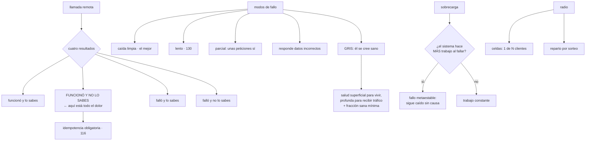

# 151 — Fallos parciales y patrones de resiliencia

> [← Clase anterior](../../part-12-cloud-native-distributed-architecture/150-replicacion-particionado-y-consenso/README.md) · [Índice de la parte](../README.md) · [Clase siguiente →](../../part-12-cloud-native-distributed-architecture/152-service-discovery-malla-y-comunicacion/README.md)

**Parte:** 12 — Arquitectura cloud-native y sistemas distribuidos<br>
**Nivel:** avanzado-experto · **Horas estimadas:** 4<br>
**Laboratorio:** `reliability` · **Estado:** `EXECUTABLE_CORE`

## 🎯 Propósito

Entender por qué un sistema repartido falla de formas que un programa en una sola máquina no conoce, y qué se hace a nivel de sistema —no de llamada, que fue la clase 130—. La clase parte de una imposibilidad que lo explica casi todo: **no se puede distinguir lento de muerto de respuesta perdida**, así que todo plazo es una conjetura. De ahí salen el modo de fallo más traicionero, que es el nodo que se cree sano mientras sus clientes fallan; el fallo que se sostiene solo después de que la causa desaparezca; y los dos patrones que de verdad acotan el daño: **hacer siempre el mismo trabajo** y **dividir el sistema en celdas**.

## 📚 Resultados de aprendizaje

Al finalizar podrás:

1. **Enumerar** los cuatro resultados posibles de una llamada remota.
2. **Reconocer** el fallo gris y diseñar comprobaciones de salud que no mientan.
3. **Evitar** que un fallo se sostenga solo tras desaparecer la causa.
4. **Aplicar** trabajo constante y contrapresión de extremo a extremo.
5. **Acotar** el radio de un fallo con celdas y reparto por sorteo.

## 🧩 Conceptos centrales

| Concepto | Comprensión verificable |
|---|---|
| `indistinguibilidad` | No hay forma de saber si el otro extremo está lento, muerto o si la respuesta se perdió. Todo plazo es una conjetura. |
| `fallo gris` | El componente se considera sano a sí mismo y sus clientes no lo ven así. Es el modo más difícil de detectar y el que más dura. |
| `fallo metaestable` | El sistema sigue caído después de que la causa desaparezca, porque el propio trabajo acumulado lo sostiene. |
| `trabajo constante` | Diseñar para hacer siempre la misma cantidad de trabajo, falle o no algo. Elimina los picos de carga provocados por fallos. |
| `contrapresión` | Que la saturación se propague hacia atrás rechazando trabajo, en vez de absorberlo en colas sin límite. |
| `celda` | Copia completa e independiente del sistema que atiende a una parte de los clientes. Convierte una caída total en una parcial. |
| `dependencia blanda` | Aquella sin la cual el sistema sigue sirviendo, degradado. Solo lo es si se ha comprobado. |
| `reparto por sorteo` | Asignar a cada cliente un subconjunto distinto de recursos, de modo que dos clientes rara vez compartan todos. |
| `fracción sana mínima` | Límite que impide retirar del servicio a más de una parte de las instancias, aunque todas parezcan enfermas. |

## 🧠 Modelo mental

Una arquitectura es un conjunto de decisiones costosas de cambiar; su calidad se juzga contra escenarios concretos, no por la cantidad de servicios usados.

Aplicado a esta clase, separa siempre cuatro planos: **intención** (qué necesita el usuario),
**configuración** (qué declaramos), **estado observado** (qué existe de verdad) y
**evidencia** (cómo sabemos que cumple). Confundirlos produce diseños que se ven correctos
en un diagrama pero fallan al operar.

## 🗺️ Flujo de razonamiento



## 📖 Desarrollo

### 1. Lo que hace distinto un fallo repartido

En un solo proceso, una llamada funciona o lanza un error. En cuanto hay red, hay **cuatro** resultados:

```text
1. funcionó y lo sabes
2. FUNCIONÓ y NO lo sabes           ← la respuesta se perdió
3. falló y lo sabes
4. falló y no lo sabes              ← el plazo venció y sigue ejecutándose
```

Y el segundo y el cuarto son indistinguibles desde fuera. De ahí la imposibilidad que gobierna esta materia:

```text
no se puede distinguir
  «está muerto»  de  «está lento»  de  «la respuesta se perdió»
→ todo plazo es una CONJETURA sobre cuál de los tres es
```

Y sus consecuencias, que este programa ya ha ido encontrando:

```text
reintentar puede duplicar el efecto        → idempotencia    clase 116
conmutar puede dejar dos líderes           → testigo         clase 150
la entrega exactamente una vez no existe   →                 clase 113
y un plazo demasiado corto convierte
  éxitos lentos en fallos                  →                 clase 130
```

**Los modos de fallo**, ordenados de más benigno a más dañino:

```text
CAÍDA LIMPIA        el proceso desaparece
  → el mejor caso: se detecta rápido y todo el mundo reacciona

LENTITUD            responde, tarde
  → peor que caerse: consume recursos de quien llama    clase 130

FALLO PARCIAL       una parte de las peticiones falla y otra no
  → los promedios lo esconden; hace falta percentil y desglose

RESPUESTAS INCORRECTAS   contesta rápido y mal
  → ninguna comprobación de salud lo detecta
  → se detecta validando lo que llega                  clase 131

FALLO GRIS          él se considera sano y sus clientes no
  → el más difícil, y el que más dura
```

Y una regla que se deduce de la lista: **preferir caerse a degradarse en silencio**. Un proceso que detecta que no puede cumplir su función debería terminar, no seguir aceptando trabajo que no va a hacer bien.

### 2. El fallo gris y las comprobaciones que mienten

El caso característico:

```text
la comprobación de salud responde correcto
el panel está verde
y el 30 % de las peticiones reales falla
```

Y la causa es siempre la misma: **la comprobación no hace lo que hace el tráfico real**.

```text
comprobación   devuelve «correcto» sin tocar nada
tráfico real   consulta la base, llama a dos servicios y escribe en una cola
→ si la base rechaza conexiones, la comprobación sigue diciendo correcto
```

Y las variantes concretas que producen fallo gris:

```text
agotamiento de recursos en un nodo: descriptores, memoria, hilos
un disco que responde muy lento pero responde
pérdida de paquetes del 2 % en un enlace concreto
una zona con latencia degradada
un nodo con el reloj desviado                          clase 149
y la comprobación que se ejecuta en un hilo distinto del que está bloqueado
```

La última es especialmente traicionera: **el proceso está bloqueado para el tráfico y sano para la comprobación**.

La corrección tiene dos mitades y hay que hacer las dos:

```text
1. QUE LA COMPROBACIÓN SE PAREZCA AL TRÁFICO
   vivo      superficial: ¿el proceso responde? → si no, reiniciar
   listo     profunda: ¿puedo atender de verdad? → si no, sacar del reparto
   → y la profunda usa la misma ruta que el tráfico: mismo grupo de hilos,
     misma conexión, mismas dependencias imprescindibles

2. QUE UNA DEPENDENCIA CAÍDA NO SAQUE A TODAS LAS INSTANCIAS
   si la comprobación profunda depende de la base y la base falla,
   las 40 instancias se declaran no listas a la vez
   → y entonces no queda nadie para servir lo que SÍ funcionaba
```

Y el mecanismo que resuelve la segunda es imprescindible y poco conocido:

```text
FRACCIÓN SANA MÍNIMA
  el reparto nunca saca de servicio más de un porcentaje de instancias
  si todas parecen enfermas, se asume que el problema es de la
  comprobación o de una dependencia común, y se sigue enviando tráfico
→ mejor un sistema degradado que ninguno
```

Y la otra defensa, que viene de la clase 121: **medir desde fuera**. La salud real es la que ven los clientes, no la que declara el propio nodo.

```text
salud declarada por el nodo          útil para reiniciar y para el reparto
proporción de errores observada
  por sus clientes                   ← esta es la verdad
```

### 3. El fallo que se sostiene solo

Hay una clase de caída que sorprende siempre: **la causa desaparece y el sistema sigue caído**.

```text
09:12  una dependencia se degrada 4 minutos
09:16  la dependencia se recupera
09:52  el sistema sigue sin servir
```

Y el motivo es que el propio sistema genera el trabajo que lo mantiene caído:

```text
las peticiones se acumulan en colas sin límite
los clientes reintentan, y cada reintento añade carga
los plazos vencen, y el trabajo hecho se descarta
→ se trabaja mucho y no se completa nada
→ y el sistema tiene DOS estados estables: sano y atascado
```

Lo que lo produce, en una frase: **el sistema hace MÁS trabajo cuando las cosas van mal**.

Y las tres defensas:

```text
1. COLAS ACOTADAS Y DESCARTE                           clase 130
   rechazar deprisa en vez de aceptar y no poder atender
   y descartar lo más antiguo, que probablemente ya no lo espera nadie

2. PRESUPUESTO DE REINTENTOS
   los reintentos no pueden superar un porcentaje del tráfico normal
   → se cortan solos justo cuando más daño harían

3. TRABAJO CONSTANTE
   diseñar para hacer siempre la misma cantidad de trabajo
```

El tercero es el más potente y el menos intuitivo:

```text
mal   cuando algo cambia, se envía el cambio a quien corresponda
      → un fallo masivo produce muchos cambios a la vez
      → y el pico de trabajo llega cuando el sistema está peor

bien  cada N segundos se envía el estado COMPLETO, cambie o no
      → la carga es la misma un martes tranquilo que durante una caída
      → y no hay nada que reintentar: en el siguiente ciclo se corrige
```

Y sus aplicaciones concretas:

```text
distribuir configuración: enviar el fichero entero periódicamente
listas de instancias sanas: publicar la lista completa
reconciliación: comparar el estado deseado con el real   clase 103
cachés: refrescar por ciclo en vez de por invalidación   clase 111
```

Y el precio, que hay que aceptar: **se hace trabajo inútil el 99 % del tiempo**. A cambio, el sistema se comporta igual en el peor día que en el mejor, y eso vale más de lo que cuesta.

**La contrapresión** es la versión de extremo a extremo del mismo principio:

```text
si un componente no da abasto, debe RECHAZAR, no encolar
y quien le llama debe enterarse y a su vez rechazar hacia atrás
→ hasta llegar al borde, que devuelve un error rápido al cliente

si en algún punto de la cadena hay una cola sin límite,
la contrapresión se corta ahí y el sistema se atasca
```

### 4. Acotar el radio

Todo lo anterior reduce la probabilidad de fallar. Lo que reduce **el daño cuando se falla igualmente** son dos patrones.

**Celdas.** En lugar de un sistema grande, varias copias completas e independientes:

```text
sin celdas   un sistema; un fallo grave afecta al 100 % de los clientes
con celdas   8 celdas; cada cliente vive en una
             → un fallo grave afecta al 12,5 %
```

Y sus propiedades:

```text
cada celda tiene su base, su caché y sus instancias
nada se comparte entre celdas, salvo el enrutador que asigna
un despliegue se hace celda a celda: es un canario real  clase 102
y el tamaño de la celda se elige por lo que se puede probar,
  no por lo que cabe
```

Y el coste, que es real:

```text
menos aprovechamiento: cada celda tiene su margen
operar N copias en vez de una
y el enrutador pasa a ser el punto crítico
  → debe ser lo más simple posible, con trabajo constante
```

Y la pregunta que decide si compensan:

```text
¿cuánto cuesta una caída total frente a una caída del 12,5 %?
→ en un sistema con muchos clientes y un objetivo alto, mucho
→ en un sistema pequeño, no compensa
```

**Reparto por sorteo.** El truco barato que consigue algo parecido sin duplicar nada:

```text
8 nodos; cada cliente se asigna a 2 de ellos, elegidos por su identificador

probabilidad de que dos clientes compartan LOS DOS nodos
  = 1 / combinaciones de 8 tomadas de 2 = 1/28

→ un cliente que satura sus dos nodos afecta al 3,6 % de los demás
→ frente al 100 % si todos comparten los 8
```

Y con más nodos y subconjuntos pequeños, el aislamiento mejora deprisa. **Es una de las mejores relaciones entre coste y efecto que existen**, y solo requiere cambiar cómo se asignan los clientes.

**Y la clasificación de dependencias**, que hay que escribir y comprobar:

```text
DURA     sin ella el sistema no puede cumplir su función
         → su disponibilidad multiplica a la tuya       clase 126
BLANDA   sin ella el sistema sirve, degradado
         → y solo es blanda si se ha COMPROBADO         clase 131
```

Y lo que ocurre siempre al comprobarlo la primera vez:

```text
dependencias declaradas como blandas          n
dependencias que de verdad lo son             menos que n
```

Y la lista de comprobación de la clase:

```text
☐ toda operación remota tolera «funcionó y no lo sé»
☐ las comprobaciones de salud usan la misma ruta que el tráfico
☐ vivo y listo están separados y significan cosas distintas
☐ existe fracción sana mínima: nunca se retira todo el servicio
☐ la salud real se mide también desde fuera
☐ ninguna cola de la cadena carece de límite
☐ hay presupuesto de reintentos, no solo límite por llamada
☐ lo crítico usa trabajo constante en vez de notificar cambios
☐ la contrapresión llega hasta el borde sin cortarse
☐ está escrito qué dependencias son duras y cuáles blandas
☐ las blandas se han comprobado provocando su caída
☐ está decidido si se acota el radio con celdas o con reparto por sorteo
```

Y el cierre que enlaza con la clase siguiente: para que todo esto funcione, cada servicio tiene que encontrar a los demás, saber cuáles están sanos y hablar con ellos de forma segura. Quién resuelve eso —la aplicación, la plataforma o una malla— y qué cuesta cada opción es la materia de la clase 152.

## 🔬 Ejemplo trabajado

**CloudShop sufre dos incidentes que sus mecanismos de la clase 130 no evitaron: uno en el que todo estaba verde mientras fallaba un tercio del tráfico, y otro en el que el sistema siguió caído treinta y seis minutos después de que la causa desapareciera.**

**Incidente 1: el fallo gris.**

```text
14:02  el 31 % de las peticiones al catálogo empieza a fallar
14:02  las comprobaciones de salud: 40 de 40 correctas
14:02  el reparto sigue enviando tráfico a las 40 instancias
14:09  alerta de proporción de errores (clase 125)
14:31  se identifica: 12 de las 40 instancias tienen agotados
       los descriptores de fichero
14:34  se reinician esas 12
duración                                             32 min
```

Y el diagnóstico:

```text
comprobación de salud     devolvía 200 sin tocar nada
tráfico real              abría conexiones a la base y al caché
→ una instancia sin descriptores respondía la comprobación
  y fallaba todo lo demás
```

La corrección, con las dos mitades del apartado segundo:

```text                                          antes         después
comprobación de vivo         devuelve 200      devuelve 200 (igual)
comprobación de listo        no existía        consulta la base y el caché
                                               por la MISMA ruta y con
                                               el mismo grupo de hilos
tiempo hasta sacar del reparto una
instancia enferma            no ocurría        9 s
```

Y el primer día tras activarla, ocurrió justo lo que el apartado advierte:

```text
03:40  la base tiene un pico de latencia de 12 s
03:40  las 40 instancias fallan la comprobación profunda
03:40  el reparto las saca TODAS
03:40  caída total, peor que el problema original
duración                                              6 min
```

```text                                          antes         después
fracción sana mínima                          no había        50 %
qué pasa si todas fallan la comprobación   se sacan todas   se conservan
                                                            la mitad

ensayo del mismo pico, repetido
  instancias retiradas                          40             20
  peticiones servidas                            0 %           58 %
  duración de la degradación                   6 min         90 s
```

Y la tercera pieza, de la clase 121: **medir la salud desde fuera**.

```text
nueva alerta   proporción de errores observada POR LOS CLIENTES
               de cada instancia, no declarada por ella
tiempo de detección del mismo caso, en un ensayo
  con salud declarada                            no se detecta
  con salud observada desde fuera                    70 s
```

**Incidente 2: el fallo que se sostuvo solo.**

```text
09:12  el servicio de precios se degrada por un despliegue
09:16  se revierte; precios vuelve a funcionar
09:16  el flujo de compra sigue sin servir
09:24  se añaden instancias; no mejora
09:52  se paran los consumidores y se vacían las colas a mano
09:54  el sistema se recupera

duración de la causa                                   4 min
duración del incidente                                42 min
```

Y la reconstrucción con el vocabulario del apartado tercero:

```text
al degradarse precios, las peticiones tardaban más
→ la cola de entrada de pedidos creció sin límite
→ los clientes reintentaban: +3,4× de tráfico
→ los plazos vencían y el trabajo hecho se descartaba
→ el sistema trabajaba al 100 % y completaba el 6 %
y al recuperarse precios, la cola acumulada mantenía el estado
```

```text                                          antes         después
cola de entrada                            sin límite      800, con descarte
qué se descarta                                —          lo más antiguo
presupuesto de reintentos                   no había          10 %

ensayo: degradar precios 4 minutos a propósito
  duración del incidente                     42 min          4 min 40 s
  peticiones servidas durante la degradación    6 %             71 %
  tiempo de recuperación tras restaurar      36 min            25 s
```

**El trabajo constante, aplicado a dos sitios.**

```text
CASO 1: distribución de configuración
  antes   al cambiar algo, se notificaba a los 15 servicios
          → un cambio masivo generaba 15 × N notificaciones
          → y durante un incidente, los reintentos se acumulaban
  después cada servicio pide la configuración COMPLETA cada 30 s
          → carga idéntica siempre; nada que reintentar

  carga en un día normal            +2 %
  carga durante un incidente        de ×18 a ×1

CASO 2: lista de instancias sanas
  antes   se publicaban altas y bajas
          → una caída de zona generaba un aluvión de bajas
  después se publica la lista completa cada 5 s
          → una caída de zona no genera ningún pico
```

Y el coste, medido y aceptado:

```text
tráfico adicional en régimen normal                    +1,4 %
latencia de propagación de un cambio            de ~1 s a ~15 s
decisión   se acepta: ningún cambio de configuración necesita
           propagarse en menos de 30 s
```

**Las celdas, evaluadas y descartadas; el sorteo, adoptado.**

```text
evaluación de celdas
  clientes                                            190 empresas
  objetivo del flujo de compra                        99,5 %
  coste de 8 celdas                    +40 % de infraestructura
  beneficio                     una caída afecta al 12,5 % en vez del 100 %
  decisión                      NO por ahora; se revisará si el objetivo
                                sube o si los clientes crecen mucho
```

Y en su lugar, el reparto por sorteo, que costó una tarde:

```text                                    todos comparten     sorteo 2 de 12
nodos del servicio de API                     12                12
nodos por cliente                             12                 2
probabilidad de compartir ambos nodos        100 %            1/66 = 1,5 %

ensayo: un cliente satura sus nodos con 40× su tráfico habitual
  clientes afectados, antes                   190
  clientes afectados, después                   3
```

De ciento noventa clientes afectados a tres, **sin añadir un solo nodo**.

**Las dependencias, clasificadas y comprobadas.**

```text
declaradas como blandas                                        6
comprobadas provocando su caída (clase 131)                    6
resultaron ser blandas de verdad                               4
resultaron DURAS sin que nadie lo supiera                      2
  → el servicio de precios: sin él no se podía mostrar el catálogo
  → el de identidad: sin él no se podía ni navegar sin sesión
```

Y las dos se convirtieron en blandas de verdad:

```text
precios      caché con valor caducado servible y precio base
identidad    navegación anónima sin llamar a identidad

disponibilidad del flujo de compra
  techo por dependencias antes                       99,05 %
  techo después                                      99,74 %
```

**A los seis meses.**

```text                                          antes         después
comprobación de listo separada de vivo           no             sí
comprobación que usa la ruta real                no             sí
fracción sana mínima                             no            50 %
salud medida desde fuera                         no             sí
tiempo de detección de un fallo gris           32 min          70 s
colas sin límite                               3 de 7        0 de 7
presupuesto de reintentos                        no            10 %
duración de un incidente con causa de 4 min    42 min       4 min 40 s
componentes con trabajo constante                 0              2
clientes afectados por un vecino ruidoso        190              3
dependencias declaradas blandas                   6              6
de ellas, comprobadas                             0              6
de ellas, que lo eran de verdad                   4              6
```

**La lección que esta clase traslada a la parte 12**: los dos incidentes ocurrieron con todos los mecanismos de la clase 130 correctamente configurados, porque **ninguno de los dos era un problema de la llamada**. El primero fue una comprobación de salud que no hacía lo que hace el tráfico, y su primera corrección produjo una caída peor por retirar las cuarenta instancias a la vez. El segundo fue un sistema que hacía más trabajo cuanto peor iba, y que por eso siguió caído treinta y seis minutos después de que la causa desapareciera. Y el cambio con mejor relación entre coste y efecto no fue ninguno de los dos: **asignar a cada cliente dos nodos de doce en vez de los doce**, que redujo el alcance de un vecino ruidoso de ciento noventa clientes a tres y no costó nada.

## 🧪 Laboratorio guiado

Ejecuta desde la raíz:

```bash
python classes/part-12-cloud-native-distributed-architecture/151-fallos-parciales-y-patrones-de-resiliencia/lab.py
```

El laboratorio selecciona el motor de práctica **`reliability`** y produce
`lab_result.json`. El escenario, sus comprobaciones y el artefacto esperado corresponden a
esta clase; no requiere credenciales y deja explícito qué debe revalidarse en un sandbox real.

1. Lee `exercise.steps` y formula una predicción antes de ejecutar.
2. Ejecuta la práctica y verifica todos los elementos de `checks`.
3. Provoca el caso de `negative_test` y explica la señal observada.
4. Materializa `mapa-fallos` en `evidence/` usando la plantilla indicada.
5. Para proveedor real, sigue `sandbox.requires`, registra costo y ejecuta `destroy`.

### Evidencia esperada

El artefacto principal es un escenario de fallo con objetivo y recuperación medida. Además, la entrega debe incluir el comando ejecutado,
la salida estructurada y una conclusión que no exceda lo observado.

## 🏆 Reto verificable

Construye **`mapa-fallos`** para el caso CloudShop. Incluye una alternativa descartada,
un supuesto que pueda falsarse, una prueba de fallo y una decisión de rollback.

## ✅ Criterio de aceptación

- [ ] `lab.py` termina con código 0 y genera JSON válido.
- [ ] La entrega conecta al menos tres requisitos con mecanismos verificables.
- [ ] Existe una prueba positiva y una prueba negativa con evidencia.
- [ ] Seguridad, costo y operación aparecen como decisiones, no como anexos.
- [ ] Se declara una limitación y una condición que obligaría a revisar el diseño.
- [ ] Otra persona puede repetir el recorrido sin conocimiento tácito.

## ⚠️ Errores frecuentes

| Síntoma | Causa probable | Corrección |
|---|---|---|
| El panel está verde y una parte importante del tráfico falla | Fallo gris: la comprobación de salud no hace lo que hace el tráfico real | Separa vivo de listo, haz que la comprobación de listo use la misma ruta y grupo de hilos, y mide además la salud observada por los clientes. |
| Una dependencia con un pico deja el servicio entero fuera del reparto | Todas las instancias fallan la comprobación profunda a la vez | Fracción sana mínima: nunca retirar más de un porcentaje; mejor degradado que sin nadie. |
| El sistema sigue caído después de que la causa desaparezca | Fallo metaestable: colas sin límite y reintentos crean trabajo que se sostiene solo | Acota todas las colas con descarte, añade presupuesto de reintentos y reduce el trabajo bajo estrés en vez de aumentarlo. |
| Un fallo masivo genera un pico de trabajo justo cuando peor va todo | El diseño notifica cambios en vez de publicar estado completo | Trabajo constante: publica el estado completo con periodicidad fija, cambie o no. |
| Un cliente que abusa afecta a todos los demás | Todos comparten los mismos recursos | Reparto por sorteo: asigna a cada cliente un subconjunto pequeño y distinto; valora celdas si el objetivo lo justifica. |
| Una dependencia declarada opcional tumba el sistema | Nunca se comprobó que fuera opcional | Escribe qué dependencias son duras y cuáles blandas, y comprueba cada blanda provocando su caída. |

## 🛡️ Seguridad, ética y costo

Trabaja con cuentas propias o sandboxes autorizados. No publiques secretos, identificadores
reales ni datos personales. Antes de crear recursos pagos define presupuesto, etiquetas y
comando de destrucción; después verifica que no queden recursos huérfanos. Los ejemplos
locales enseñan contratos, pero no certifican cumplimiento ni disponibilidad de producción.

## ❓ Preguntas de comprobación

1. ¿Cuáles son los cuatro resultados de una llamada remota y cuál causa más problemas?
2. ¿Qué es un fallo gris y por qué las comprobaciones de salud no lo detectan?
3. ¿Por qué una comprobación de salud profunda puede provocar una caída total, y qué lo impide?
4. ¿Qué mantiene caído a un sistema cuando la causa ya desapareció?
5. ¿Qué consigue el reparto por sorteo y a qué coste?

## 🔗 Referencias

- Huang, P. y otros (2017). *Gray failure: the Achilles' heel of cloud-scale systems* — el fallo que el componente no reconoce. <https://www.microsoft.com/en-us/research/publication/gray-failure-the-achilles-heel-of-cloud-scale-systems/>
- Bronson, N. y otros (2021). *Metastable failures in distributed systems* — fallos que se sostienen tras desaparecer la causa. <https://sigops.org/s/conferences/hotos/2021/papers/hotos21-s11-bronson.pdf>
- AWS (2025). *Reliability and constant work* — diseñar para hacer siempre la misma cantidad de trabajo. <https://aws.amazon.com/builders-library/reliability-and-constant-work/>
- AWS (2025). *Workload isolation using shuffle sharding* — reparto por sorteo y su aritmética. <https://aws.amazon.com/builders-library/workload-isolation-using-shuffle-sharding/>
- AWS (2025). *Implementing health checks* — vivo frente a listo y fracción sana mínima. <https://aws.amazon.com/builders-library/implementing-health-checks/>
- Documentación oficial vigente del servicio implementado; registra URL y fecha de consulta.

---

> [Evaluación](assessment.md) · [Contrato de clase](lesson.yaml) · [Índice de la parte](../README.md)
