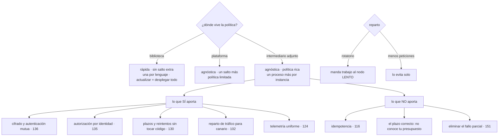

# 152 — Service discovery, malla y comunicación

> [← 151 · Fallos parciales y patrones de resiliencia](../../part-12-cloud-native-distributed-architecture/151-fallos-parciales-y-patrones-de-resiliencia/README.md) · [Índice de la parte](../README.md) · [153 · Contratos API, compatibilidad y evolución →](../../part-12-cloud-native-distributed-architecture/153-contratos-api-compatibilidad-y-evolucion/README.md)

**Parte:** 12 — Arquitectura cloud-native y sistemas distribuidos<br>
**Nivel:** avanzado-experto · **Horas estimadas:** 4<br>
**Laboratorio:** `network` · **Estado:** `EXECUTABLE_CORE`

## 🎯 Propósito

Resolver cómo se encuentran y se hablan las piezas cuando las direcciones cambian cada pocos minutos: quién traduce «el servicio de pagos» en una dirección concreta, quién decide qué instancias están sanas y dónde vive la política de reintentos, plazos y cifrado. La clase compara los tres sitios donde puede vivir esa lógica, dice **qué aporta de verdad una malla y qué no**, y se detiene en dos detalles que causan incidentes reales y casi nunca se explican: **el reparto rotatorio manda trabajo a la instancia lenta**, y **una conexión multiplexada anula el reparto**.

## 📚 Resultados de aprendizaje

Al finalizar podrás:

1. **Situar** el descubrimiento y la política en la biblioteca, la plataforma o un intermediario.
2. **Decidir** si una malla compensa, con un criterio numérico.
3. **Enumerar** lo que una malla no resuelve aunque lo parezca.
4. **Elegir** el algoritmo de reparto sabiendo qué hace cada uno con un nodo lento.
5. **Evitar** que las conexiones persistentes rompan el reparto.

## 🧩 Conceptos centrales

| Concepto | Comprensión verificable |
|---|---|
| `descubrimiento` | Traducir un nombre lógico en direcciones concretas y sanas. En entornos dinámicos cambia constantemente. |
| `intermediario adjunto` | Proceso que acompaña a cada instancia e intercepta su tráfico para aplicar política sin tocar el código. |
| `identidad de carga en el transporte` | Cada servicio tiene un certificado propio; la autenticación mutua cifra y a la vez dice quién llama. |
| `reparto por menos peticiones` | Enviar a la instancia con menos peticiones en curso. Evita mandar trabajo a la que está lenta. |
| `multiplexación` | Varias peticiones sobre una misma conexión. Reduce coste y hace que el reparto por conexión deje de repartir. |
| `conversación excesiva` | Muchas llamadas pequeñas para una sola operación de negocio. Es el problema de rendimiento más común entre servicios. |

## 🧠 Modelo mental

Una arquitectura es un conjunto de decisiones costosas de cambiar; su calidad se juzga contra escenarios concretos, no por la cantidad de servicios usados.

Aplicado a esta clase, separa siempre cuatro planos: **intención** (qué necesita el usuario),
**configuración** (qué declaramos), **estado observado** (qué existe de verdad) y
**evidencia** (cómo sabemos que cumple). Confundirlos produce diseños que se ven correctos
en un diagrama pero fallan al operar.

## 🗺️ Flujo de razonamiento



## 📖 Desarrollo

### 1. Tres sitios donde puede vivir

El problema es el mismo en los tres casos:

```text
«llamar al servicio de precios» exige saber
  qué direcciones lo sirven ahora
  cuáles están sanas                                    clase 151
  a cuál enviar esta petición
  con qué plazo, reintentos y cifrado                   clases 130, 136
```

Y hay tres lugares donde puede resolverse:

```text
1. EN LA BIBLIOTECA DEL CLIENTE
   la aplicación consulta el registro y elige destino
   + sin saltos extra; latencia mínima
   + puede usar información que solo ella tiene
   − una biblioteca por lenguaje
   − actualizarla exige desplegar TODOS los servicios
   − y una versión antigua se comporta distinto que una nueva

2. EN LA PLATAFORMA
   un nombre estable y un repartidor por delante
   + independiente del lenguaje; nada que instalar
   + es lo que ya hace un servicio de la clase 076
   − un salto de red más
   − política limitada a lo que ofrezca el repartidor

3. EN UN INTERMEDIARIO ADJUNTO A CADA INSTANCIA
   un proceso acompaña a la aplicación e intercepta su tráfico
   + independiente del lenguaje y con política rica
   + se cambia sin tocar ni desplegar la aplicación
   − un proceso más por instancia: memoria, procesador y latencia
   − un plano de control más que operar
   − y un modo de fallo nuevo: el intermediario
```

Y existe una cuarta forma en crecimiento —aplicar la política en el núcleo del sistema operativo, sin proceso adjunto— que reduce el coste del tercero y no cambia el razonamiento de esta clase.

Y el criterio para elegir, que es numérico:

```text
pocos servicios y un solo lenguaje
  → biblioteca o plataforma; una malla cuesta más de lo que da

muchos servicios y varios lenguajes, con política común obligatoria
  → intermediario adjunto

umbral orientativo   por debajo de ~10 servicios, casi nunca compensa
                     por encima de ~30 y con 3 lenguajes, casi siempre
```

Y una advertencia sobre el segundo caso, que aparece mucho: **si todo está en un lenguaje, una biblioteca bien hecha da el 80 % de lo que da una malla, sin plano de control**. El problema empieza cuando hay que actualizarla en cuarenta servicios.

### 2. Qué aporta una malla y qué no

**Lo que aporta de verdad**, ordenado por lo que más se nota:

```text
CIFRADO Y AUTENTICACIÓN MUTUA ENTRE SERVICIOS
  cada servicio tiene su certificado, rotado solo
  → resuelve el cifrado interno que la clase 136 encontró ausente
  → y de paso da identidad verificable en el transporte

AUTORIZACIÓN POR IDENTIDAD, NO POR DIRECCIÓN
  «pedidos puede llamar a precios»                      clase 135
  → sobrevive a que todo se recree

PLAZOS, REINTENTOS Y CORTE SIN TOCAR CÓDIGO
  y aplicables de forma uniforme                        clase 130

REPARTO DE TRÁFICO POR PORCENTAJE
  canarios y despliegues escalonados sin lógica propia  clase 102

TELEMETRÍA UNIFORME
  métricas y trazas de todas las llamadas, con el mismo formato
                                                        clase 124
```

Y la lista es real: cinco cosas que de otro modo hay que implementar en cada lenguaje.

**Lo que NO aporta**, y se le atribuye:

```text
NO HACE SEGURO REINTENTAR
  el intermediario puede reintentar; que eso no duplique un cobro
  es responsabilidad de la aplicación                   clase 116
  → y una malla mal configurada AÑADE reintentos que nadie pidió

NO SABE CUÁL ES EL PLAZO CORRECTO
  no conoce el presupuesto de la petición original      clase 130
  → hay que configurárselo, y propagar el plazo restante sigue
    siendo trabajo de la aplicación

NO ELIMINA EL FALLO PARCIAL
  todo lo de la clase 151 sigue igual

NO ARREGLA UN DISEÑO CONVERSADOR
  si una operación hace 340 llamadas, las hará igual
  → y ahora cada una pasa por dos intermediarios más

NO SUSTITUYE A LOS CONTRATOS
  la compatibilidad entre versiones es de la clase 153
```

Y **el coste**, que hay que medir antes de decidir:

```text
latencia añadida     0,3-2 ms por salto, y hay dos saltos por llamada
memoria              50-150 MB por instancia
procesador           5-15 % del total
plano de control     un sistema más que operar y actualizar
modo de fallo nuevo  si el intermediario no arranca, la aplicación
                     no habla con nadie
```

Y una cuenta que conviene hacer:

```text
300 instancias × 100 MB = 30 GB de memoria solo en intermediarios
```

Y dos precauciones operativas que se descubren tarde:

```text
el intermediario debe arrancar ANTES que la aplicación
  y terminar DESPUÉS                                    clase 146
  → si no, hay peticiones al arrancar y al parar que no salen

las actualizaciones del plano de control son un despliegue
  que afecta a todo a la vez
  → escalonado, con canario, como cualquier otro        clase 102
```

### 3. Cómo se reparte, y las dos trampas

**Los algoritmos**, y lo que hace cada uno cuando una instancia va mal:

```text
ROTATORIO
  una a cada instancia, por turnos
  + trivial y justo si todas son iguales
  − MANDA TRABAJO A LA QUE ESTÁ LENTA, exactamente igual que a las sanas
  → y si una instancia tarda 10× más, acumula 10× más trabajo pendiente

MENOS PETICIONES EN CURSO
  a la que tiene menos trabajo sin terminar
  + una instancia lenta acumula peticiones y deja de recibir sola
  → resuelve el problema anterior sin configurar nada

POR LATENCIA OBSERVADA
  pondera por lo que ha tardado últimamente
  + reacciona a nodos degradados
  − puede oscilar si el peso cambia demasiado deprisa

POR CLAVE
  la misma clave siempre al mismo destino
  + aprovecha cachés locales
  − puntos calientes, y hay que rehacerlo al cambiar el número
    de destinos                                          clase 150
```

Y la primera trampa, en una frase:

```text
el reparto rotatorio es la opción por defecto
y es la peor ante una instancia lenta, que es el fallo más común
```

Y una técnica barata que mejora cualquiera de ellos: **elegir dos al azar y quedarse con la menos cargada**. Casi todo el beneficio de «menos peticiones» sin necesidad de conocer el estado de todas.

**La segunda trampa: las conexiones persistentes.**

```text
con una conexión por petición
  el reparto elige destino en cada llamada          → reparte bien

con conexiones persistentes y multiplexadas
  se abre UNA conexión y todas las peticiones van por ella
  → el reparto eligió destino una vez, al abrirla
  → y desde entonces, todo va al mismo sitio
```

Y el efecto observado:

```text
12 instancias de destino
40 instancias de origen, con una conexión persistente cada una
→ si el reparto fue rotatorio al abrir, quedan 3-4 conexiones
  por destino, y el reparto real depende de qué origen tiene tráfico
→ y al añadir una instancia de destino, NO recibe nada:
  nadie abre conexiones nuevas
```

Las correcciones:

```text
reparto por PETICIÓN, no por conexión
  → es lo que hace un intermediario que entiende el protocolo
caducidad de conexión: renovarlas cada N minutos o N peticiones
  → para que las instancias nuevas entren en el reparto
y un número mínimo de conexiones por destino
```

Y el mismo problema, en su versión más citada: **una instancia nueva no recibe tráfico hasta que alguien abre una conexión**, y eso hace que el autoescalado parezca no funcionar.

Y una tercera cuestión relacionada: **el arranque en frío del destino**. Una instancia recién arrancada acepta la misma carga que las demás y aún no tiene sus cachés llenas ni su código optimizado. Un arranque progresivo —darle poco tráfico al principio e ir subiendo— evita ese pico de latencia.

### 4. Cómo se habla

**Síncrono o asíncrono** se decide por interacción, con los atributos de la clase 145:

```text
SÍNCRONO      quien llama necesita la respuesta para continuar
  precio de un producto, validar un dato, comprobar existencias

ASÍNCRONO     el resultado no se necesita ahora
  notificar, facturar, indexar, recalcular            parte 09
```

Y la regla que más latencia ahorra:

```text
si puede ser asíncrono, que lo sea
→ cada llamada síncrona añade su latencia y su probabilidad de fallo
  a la petición del usuario                             clase 126
```

**La granularidad**, que es el problema de rendimiento más frecuente entre servicios:

```text
conversación excesiva
  «dame el pedido» → «dame cada línea» × 40 → «dame cada producto» × 40
  → 81 llamadas de red para una pantalla
  → es la escalera de la clase 124, ahora entre servicios

corrección
  operaciones que devuelven lo que la pantalla necesita
  o consultas por lotes: «dame estos 40 productos»
  y evitar que cada consumidor tenga su propia operación a medida
```

Y la tensión que hay que resolver conscientemente: **operaciones a medida para cada consumidor** acoplan al proveedor con sus clientes; **operaciones genéricas** producen conversación excesiva. La salida habitual es una capa de composición del lado del consumidor —una fachada por tipo de cliente— que agrega en un solo salto.

**Los protocolos**, con honestidad:

```text
TEXTO SOBRE HTTP     universal, depurable, verboso
                     suficiente para la mayoría
BINARIO CON ESQUEMA  menos bytes y menos tiempo de serialización
                     necesita generación de código y registro de esquemas
                     → y entonces el contrato es explícito, que es bueno
                                                        clase 153
FLUJO CONTINUO       útil cuando hay muchos mensajes en una conversación
                     o resultados que llegan poco a poco
```

Y la nota honesta: **el protocolo rara vez es el cuello de botella**. Antes de cambiarlo, conviene comprobar dónde se va el tiempo con una traza; casi siempre está en el número de llamadas, en la base o en una dependencia lenta, no en la serialización.

Y la lista de comprobación de la clase:

```text
☐ está decidido dónde vive la política: biblioteca, plataforma o adjunto
☐ si hay malla, está justificada por número de servicios y lenguajes
☐ está medido lo que cuesta: latencia, memoria y procesador
☐ el intermediario arranca antes y termina después que la aplicación
☐ los reintentos de la malla no duplican efectos: hay idempotencia
☐ los plazos configurados respetan el presupuesto de la petición
☐ el reparto no es rotatorio si las instancias pueden ir lentas
☐ el reparto es por petición, no por conexión
☐ las conexiones caducan para que entren las instancias nuevas
☐ las instancias nuevas reciben tráfico progresivamente
☐ cada interacción está clasificada como síncrona o asíncrona
☐ está medido cuántas llamadas hace una operación de negocio típica
```

Y el cierre que enlaza con la clase siguiente: para que dos servicios se hablen sin coordinarse hace falta algo que ninguna malla proporciona: **un contrato que pueda cambiar sin romper a quien lo consume**. Es la materia de la clase 153.

## 🔬 Ejemplo trabajado

**CloudShop, con cinco unidades desplegables tras la clase 148, se plantea si necesita una malla. La evaluación dice que no, y el mismo ejercicio descubre dos problemas de reparto que llevaban meses causando incidentes.**

**La evaluación de la malla.**

```text
servicios                                                     5
lenguajes                                                     2
instancias totales                                           48

lo que se quería de la malla
  cifrado interno y autenticación mutua        clase 136   ← necesario
  autorización por identidad                   clase 135   ← ya resuelto
  plazos y reintentos uniformes                clase 130   ← ya en código
  reparto para canarios                        clase 102   ← ya en plataforma
  telemetría uniforme                          clase 124   ← ya resuelto
```

Uno de cinco. Y el coste estimado:

```text
memoria adicional        48 × 90 MB                     4,3 GB
procesador adicional                                     ~9 %
latencia añadida         2 saltos × 0,6 ms              1,2 ms
plano de control                          un sistema más que operar
coste mensual estimado                                  620 €
tiempo de implantación                                 6 semanas
```

Y la alternativa para lo único que faltaba:

```text
cifrado interno y autenticación mutua
  opción A   malla completa                    6 semanas, 620 €/mes
  opción B   certificados gestionados por la plataforma
             y bibliotecas de los 2 lenguajes    1 semana, 0 €/mes

decisión   opción B
revisión   se reconsiderará por encima de 15 servicios
           o si aparece un tercer lenguaje
```

Y lo que se anotó como criterio, para no rediscutirlo cada trimestre:

```text
la malla se adopta cuando el coste de mantener la política en N
bibliotecas supere el de operar un plano de control
→ con 2 lenguajes y 5 servicios, no lo supera
```

**El problema del reparto rotatorio.**

Un incidente recurrente sin explicación:

```text
síntoma      cada pocas semanas, el percentil 99 del catálogo se
             multiplicaba por 8 durante 20-40 minutos
frecuencia   1-2 veces al mes
diagnóstico previo    «picos de tráfico»
```

Y al mirarlo con trazas (clase 124):

```text
instancias del catálogo                                      12
latencia p99 de 11 de ellas                              48 ms
latencia p99 de 1 de ellas                            3.900 ms
reparto                                                rotatorio
→ la instancia lenta recibía la misma proporción de peticiones
→ y como tardaba más, acumulaba peticiones en curso
→ el 8,3 % de las peticiones tardaba 3,9 s
```

Y la causa de la instancia lenta variaba —un disco degradado, un vecino ruidoso, una pausa de memoria— pero el efecto era siempre el mismo.

```text                                    rotatorio    menos peticiones en curso
p99 global con una instancia lenta        3.900 ms            71 ms
proporción de peticiones afectadas           8,3 %            0,4 %
peticiones que recibe la instancia lenta     8,3 %            0,9 %
cambios de código necesarios                    —                0
```

Un cambio de algoritmo en la configuración del repartidor **eliminó una familia entera de incidentes**.

Y se añadió la comprobación correspondiente al catálogo de la clase 131:

```text
ensayo: ralentizar una instancia a propósito
  con rotatorio          p99 global ×80
  con menos peticiones   p99 global ×1,5
```

**El problema de las conexiones persistentes.**

Otro síntoma sin explicación:

```text
al escalar el catálogo de 12 a 20 instancias durante un pico,
la latencia no mejoraba
y las 8 instancias nuevas tenían el 3 % del tráfico
```

Y la causa era la del apartado tercero:

```text
conexiones persistentes multiplexadas entre servicios
el reparto elegía destino AL ABRIR la conexión
las conexiones llevaban abiertas horas
→ las instancias nuevas no recibían casi nada
```

```text                                    antes            después
reparto                              por conexión      por petición
caducidad de conexión                 no había        5 min o 10.000
                                                      peticiones
tráfico que recibe una instancia
nueva a los 2 min                        3 %              97 %
tiempo hasta que el escalado surte
efecto                                >30 min             90 s
```

Y una tercera corrección que redujo el pico de latencia al escalar:

```text
arranque progresivo de las instancias nuevas
  primeros 30 s     10 % del tráfico que le tocaría
  hasta 90 s        subida gradual al 100 %

p99 de las instancias nuevas en su primer minuto
  sin arranque progresivo                          1.900 ms
  con arranque progresivo                            180 ms
```

**La conversación excesiva entre servicios.**

Al medir cuántas llamadas hacía cada operación de negocio:

```text
operación                          llamadas entre servicios
ver ficha de producto                          3
añadir a la cesta                              4
ver la cesta                                  11
confirmar pedido                              14
ver «mis pedidos»                             62   ← problema
```

Y las 62 eran la escalera de siempre, ahora entre servicios:

```text
1 llamada para la lista de pedidos
20 llamadas, una por pedido, para su estado de envío
41 llamadas, una por producto, para su nombre e imagen
```

```text                                          antes         después
llamadas para «mis pedidos»                     62              3
cómo                                    una por elemento   consultas por lotes
latencia p99                                 2.100 ms       190 ms
cambios en los servicios llamados                —      2 operaciones por lote
```

Y se añadió a la revisión de diseño una pregunta: **¿cuántas llamadas entre servicios hace esta pantalla?**, con umbral de aviso en diez.

**Síncrono frente a asíncrono, revisado.**

```text
interacciones entre servicios                                 23
síncronas antes                                               19
síncronas que no necesitaban serlo                             7
  notificar al cliente, indexar en búsqueda, actualizar
  el panel de informes, registrar en el lago, avisar a
  logística, recalcular recomendaciones, enviar a analítica
```

```text                                          antes         después
interacciones síncronas                         19             12
latencia p99 de confirmar pedido              840 ms         310 ms
dependencias duras del flujo de compra           6              3
techo de disponibilidad por dependencias     99,05 %        99,74 %
```

Siete interacciones que se hicieron asíncronas **bajaron la latencia a un tercio y subieron el techo de disponibilidad**, que es exactamente la cadena de la clase 126.

**A los cuatro meses.**

```text                                          antes         después
malla adoptada                                   —         no, con criterio
                                                           escrito
cifrado interno entre servicios              4 de 5        5 de 5
algoritmo de reparto                       rotatorio    menos peticiones
incidentes por instancia lenta            1-2 / mes           0
reparto                                  por conexión    por petición
tráfico a instancias nuevas a los 2 min        3 %            97 %
tiempo hasta que el escalado surte efecto   >30 min          90 s
llamadas para «mis pedidos»                     62              3
interacciones síncronas                         19             12
latencia p99 de confirmar pedido             840 ms         310 ms
```

**La lección que esta clase traslada a la parte 12**: la malla se descartó porque **de las cinco cosas que aporta, cuatro ya estaban resueltas y la quinta costaba una semana en vez de seis**. Y los dos incidentes recurrentes que llevaban meses sin explicación no eran problemas de arquitectura ni de código: eran **el algoritmo de reparto por defecto, que manda trabajo a la instancia lenta**, y **conexiones persistentes que hacían que las instancias nuevas no recibieran tráfico**. Los dos se corrigieron cambiando configuración, y los dos habrían seguido igual con una malla mal configurada.

## 🧪 Laboratorio guiado

Ejecuta desde la raíz:

```bash
python classes/part-12-cloud-native-distributed-architecture/152-service-discovery-malla-y-comunicacion/lab.py
```

El laboratorio selecciona el motor de práctica **`network`** y produce
`lab_result.json`. El escenario, sus comprobaciones y el artefacto esperado corresponden a
esta clase; no requiere credenciales y deja explícito qué debe revalidarse en un sandbox real.

1. Lee `exercise.steps` y formula una predicción antes de ejecutar.
2. Ejecuta la práctica y verifica todos los elementos de `checks`.
3. Provoca el caso de `negative_test` y explica la señal observada.
4. Materializa `topologia-servicios` en `evidence/` usando la plantilla indicada.
5. Para proveedor real, sigue `sandbox.requires`, registra costo y ejecuta `destroy`.

### Evidencia esperada

El artefacto principal es una topología con rutas, puertos y controles. Además, la entrega debe incluir el comando ejecutado,
la salida estructurada y una conclusión que no exceda lo observado.

## 🏆 Reto verificable

Construye **`topologia-servicios`** para el caso CloudShop. Incluye una alternativa descartada,
un supuesto que pueda falsarse, una prueba de fallo y una decisión de rollback.

## ✅ Criterio de aceptación

- [ ] `lab.py` termina con código 0 y genera JSON válido.
- [ ] La entrega conecta al menos tres requisitos con mecanismos verificables.
- [ ] Existe una prueba positiva y una prueba negativa con evidencia.
- [ ] Seguridad, costo y operación aparecen como decisiones, no como anexos.
- [ ] Se declara una limitación y una condición que obligaría a revisar el diseño.
- [ ] Otra persona puede repetir el recorrido sin conocimiento tácito.

## ⚠️ Errores frecuentes

| Síntoma | Causa probable | Corrección |
|---|---|---|
| Una sola instancia degradada dispara el percentil 99 de todo el servicio | El reparto rotatorio le envía la misma proporción de tráfico aunque tarde diez veces más | Reparte por menos peticiones en curso, o elige dos al azar y quédate con la menos cargada. |
| Escalar no mejora nada y las instancias nuevas casi no reciben tráfico | Las conexiones persistentes eligieron destino al abrirse y no se renuevan | Reparte por petición, caduca las conexiones por tiempo o número y da tráfico progresivo a las instancias nuevas. |
| Se adopta una malla y la mayoría de sus ventajas ya estaban resueltas | No se comparó lo que aporta con lo que ya existe ni se midió su coste | Enumera las cinco capacidades, marca cuáles faltan y decide con el número de servicios y lenguajes. |
| La malla reintenta y se duplican efectos | Los reintentos automáticos no saben si la operación es idempotente | Haz idempotente lo que se pueda reintentar y desactiva los reintentos donde no lo sea. |
| Una pantalla hace decenas de llamadas entre servicios | Operaciones demasiado finas y consultas por elemento | Añade consultas por lotes o una fachada de composición, y mide llamadas por operación de negocio. |
| La latencia del flujo principal es alta y su disponibilidad baja | Hay interacciones síncronas que no necesitan serlo | Clasifica cada interacción; lo que no se necesita para responder, hazlo asíncrono. |

## 🛡️ Seguridad, ética y costo

Trabaja con cuentas propias o sandboxes autorizados. No publiques secretos, identificadores
reales ni datos personales. Antes de crear recursos pagos define presupuesto, etiquetas y
comando de destrucción; después verifica que no queden recursos huérfanos. Los ejemplos
locales enseñan contratos, pero no certifican cumplimiento ni disponibilidad de producción.

## ❓ Preguntas de comprobación

1. ¿Qué ventajas e inconvenientes tiene poner la política en la biblioteca, en la plataforma o en un intermediario?
2. ¿Qué cinco cosas aporta una malla y cuáles cuatro no aporta aunque se le atribuyan?
3. ¿Por qué el reparto rotatorio es la peor opción ante una instancia lenta?
4. ¿Por qué las conexiones persistentes rompen el reparto y cómo se corrige?
5. ¿Qué regla reduce más la latencia percibida al clasificar interacciones?

## 🔗 Referencias

- Istio (2025). *Traffic management and mutual TLS* — capacidades de una malla y su configuración. <https://istio.io/latest/docs/concepts/traffic-management/>
- Envoy (2025). *Load balancing: algorithms and panic threshold* — menos peticiones, dos al azar y fracción sana mínima. <https://www.envoyproxy.io/docs/envoy/latest/intro/arch_overview/upstream/load_balancing/overview>
- Mitzenmacher, M. (2001). *The power of two choices in randomized load balancing* — por qué elegir dos al azar funciona tan bien. <https://www.eecs.harvard.edu/~michaelm/postscripts/tpds2001.pdf>
- gRPC (2025). *Load balancing with long-lived connections* — el problema del reparto con conexiones persistentes. <https://grpc.io/blog/grpc-load-balancing/>
- Google Cloud (2025). *Service discovery patterns* — descubrimiento en la biblioteca, en la plataforma y con intermediario. <https://cloud.google.com/architecture/service-discovery-patterns>
- Documentación oficial vigente del servicio implementado; registra URL y fecha de consulta.

---

> [Evaluación](assessment.md) · [Contrato de clase](lesson.yaml) · [Índice de la parte](../README.md)

| Anterior | Índice | Siguiente |
|---|---|---|
| [← 151 · Fallos parciales y patrones de resiliencia](../../part-12-cloud-native-distributed-architecture/151-fallos-parciales-y-patrones-de-resiliencia/README.md) | [Parte 12](../README.md) · [Programa](../../README.md) | [153 · Contratos API, compatibilidad y evolución →](../../part-12-cloud-native-distributed-architecture/153-contratos-api-compatibilidad-y-evolucion/README.md) |
