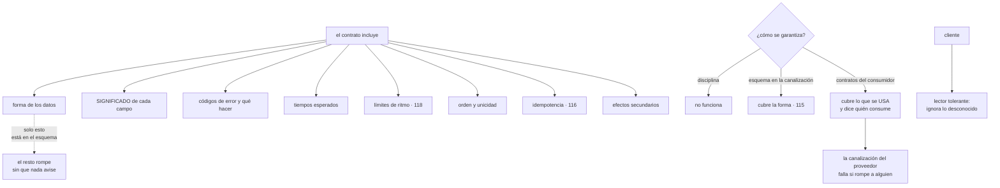

# 153 — Contratos API, compatibilidad y evolución

> [← 152 · Service discovery, malla y comunicación](../../part-12-cloud-native-distributed-architecture/152-service-discovery-malla-y-comunicacion/README.md) · [Índice de la parte](../README.md) · [154 · Multi-tenancy, aislamiento y noisy neighbor →](../../part-12-cloud-native-distributed-architecture/154-multi-tenancy-aislamiento-y-noisy-neighbor/README.md)

**Parte:** 12 — Arquitectura cloud-native y sistemas distribuidos<br>
**Nivel:** avanzado-experto · **Horas estimadas:** 4<br>
**Laboratorio:** `api` · **Estado:** `EXECUTABLE_CORE`

## 🎯 Propósito

Hacer que dos piezas puedan evolucionar sin coordinarse, que es la única razón por la que se separaron. La clase sostiene tres cosas incómodas: que **el contrato es mucho más que el esquema**, y que la mayoría de las roturas ocurren en lo que el esquema no describe; que **con suficientes consumidores, cualquier comportamiento observable se convierte en parte del contrato aunque nadie lo prometiera**; y que la compatibilidad no se consigue con disciplina sino **comprobándola automáticamente**, con una técnica que además resuelve la pregunta de quién consume esto.

## 📚 Resultados de aprendizaje

Al finalizar podrás:

1. **Enumerar** todo lo que forma parte de un contrato además del esquema.
2. **Reconocer** los comportamientos no prometidos de los que alguien ya depende.
3. **Escribir** clientes tolerantes que no se rompan con cambios compatibles.
4. **Comprobar** la compatibilidad de forma automática, no por disciplina.
5. **Evolucionar** un contrato sin versionar, y versionar solo cuando no quede otra.

## 🧩 Conceptos centrales

| Concepto | Comprensión verificable |
|---|---|
| `contrato` | Todo lo que quien consume puede observar y de lo que puede depender: forma, significado, errores, tiempos, orden, límites y efectos. |
| `comportamiento observable` | Cualquier cosa que se pueda medir desde fuera. Con bastantes consumidores, alguien depende de ella aunque no esté documentada. |
| `lector tolerante` | Cliente que ignora lo que no conoce, valida solo lo que usa y no depende de lo que no se le prometió. |
| `contrato dirigido por el consumidor` | Cada consumidor publica lo que realmente usa; la canalización del proveedor comprueba que sigue cumpliéndolo. |
| `campo con alias` | Publicar el campo viejo y el nuevo a la vez durante la transición, para poder retirar el viejo sin coordinar. |
| `error como contrato` | Los códigos de error, su significado y si conviene reintentar forman parte del contrato tanto como los campos. |

## 🧠 Modelo mental

Una arquitectura es un conjunto de decisiones costosas de cambiar; su calidad se juzga contra escenarios concretos, no por la cantidad de servicios usados.

Aplicado a esta clase, separa siempre cuatro planos: **intención** (qué necesita el usuario),
**configuración** (qué declaramos), **estado observado** (qué existe de verdad) y
**evidencia** (cómo sabemos que cumple). Confundirlos produce diseños que se ven correctos
en un diagrama pero fallan al operar.

## 🗺️ Flujo de razonamiento



## 📖 Desarrollo

### 1. El contrato es más que el esquema

Un esquema describe la forma de los datos. El contrato es **todo lo que quien consume puede observar**:

```text
FORMA          campos, tipos, obligatoriedad, anidamiento
SIGNIFICADO    qué representa cada campo, en qué unidad, con qué precisión
ERRORES        qué códigos existen, qué significan, cuáles conviene reintentar
TIEMPOS        cuánto tarda normalmente, qué plazo tiene sentido    clase 130
LÍMITES        cuántas peticiones se admiten y qué pasa al superarlos
                                                                    clase 118
ORDEN          si los resultados vienen ordenados, y por qué
UNICIDAD       si un identificador puede repetirse
IDEMPOTENCIA   qué ocurre si la misma petición llega dos veces      clase 116
EFECTOS        qué cambia en el mundo al llamar: cobros, correos, reservas
PAGINACIÓN     cómo se recorre, y si es estable mientras se recorre
```

Y el dato que ordena la clase:

```text
el esquema cubre la primera línea
y la mayoría de las roturas ocurren en las otras nueve
```

El caso de la clase 115 es el ejemplo perfecto: **el campo `importe` pasó de céntimos a unidades**. El tipo no cambió, el esquema siguió validando, ninguna herramienta detectó nada y se emitieron mil doscientas facturas mal.

Y las otras roturas frecuentes que ningún esquema ve:

```text
un campo opcional que antes venía siempre y ahora a veces falta
un listado que antes venía ordenado y ahora no
un código de error que cambia de 400 a 409
una operación que era idempotente y deja de serlo
una llamada que tardaba 40 ms y pasa a tardar 900
una paginación que se desordena si hay escrituras mientras se recorre
y un efecto nuevo: la operación ahora también envía un correo
```

La última merece atención: **añadir un efecto es un cambio incompatible**, aunque la respuesta sea idéntica.

Y de ahí la regla de redacción de un contrato:

```text
lo que no se promete, se dice que no se promete
  «el orden de este listado no está garantizado»
  «este campo puede faltar»
  «esta operación no es idempotente»
→ decirlo explícitamente es lo único que permite cambiarlo después
```

### 2. Todo lo observable acaba siendo contrato

Hay una regularidad conocida y muy incómoda:

```text
con suficientes consumidores, CUALQUIER comportamiento observable
de tu sistema acaba siendo algo de lo que alguien depende
aunque nunca lo hayas prometido
```

Y sus manifestaciones concretas:

```text
el orden en que devuelves una lista, que nunca ordenaste a propósito
el texto exacto de un mensaje de error, que alguien compara
que un identificador tenga siempre 24 caracteres
que un campo numérico nunca sea negativo
que la respuesta llegue en menos de 100 ms
que dos llamadas seguidas devuelvan lo mismo
que un campo opcional venga siempre
```

Y las dos consecuencias prácticas:

```text
1. lo que no quieras que se convierta en contrato, HAZLO VARIAR
   → si el orden no está garantizado, devuélvelo desordenado a propósito
   → si el identificador es opaco, que no tenga longitud fija

2. lo que ya lleva años estable, YA ES CONTRATO
   → cambiarlo romperá a alguien, esté documentado o no
   → y la pregunta ya no es si es legítimo, sino a quién avisas
```

Y la primera es una técnica real y poco usada: **introducir variación deliberada en lo que no se promete**. Es la misma idea que la variación aleatoria de las caducidades de la clase 111, aplicada a los contratos.

**El lector tolerante** es la contramedida del lado del consumidor, y es la disciplina que más roturas evita:

```text
IGNORA lo que no conoce
  un campo nuevo no debe provocar un error de validación
VALIDA solo lo que usa
  si no lees ese campo, no compruebes su formato
NO DEPENDE de lo no prometido
  ni del orden, ni de la longitud, ni del texto de los mensajes
TRATA lo desconocido con un caso por defecto
  un valor nuevo en una enumeración no debe romper nada
```

Y la última es la que permite que un proveedor añada estados sin coordinar: **si el consumidor tiene un caso «desconocido», el proveedor puede evolucionar; si no, no**.

Y conviene decirlo al revés, porque es lo que hay que exigir en la documentación:

```text
«los clientes deben ignorar campos que no conozcan
 y tratar valores desconocidos de enumeración como no soportados»
→ si no está escrito, no ocurrirá
```

### 3. Comprobar, no confiar

La compatibilidad no se consigue con buenas intenciones. Los tres mecanismos, de menor a mayor cobertura:

```text
1. COMPROBACIÓN DE ESQUEMA EN LA CANALIZACIÓN            clase 115
   compara el esquema nuevo con el anterior y bloquea lo incompatible
   + barato y automático
   − solo cubre la forma; no ve significados ni comportamientos

2. CONTRATOS DIRIGIDOS POR EL CONSUMIDOR      ← el que más aporta
   cada consumidor publica un fichero con lo que REALMENTE usa:
   qué operaciones llama, con qué datos y qué espera recibir
   la canalización del proveedor ejecuta todos esos ficheros contra
   su versión nueva y falla si rompe a alguno
   + cubre lo que se usa de verdad, no lo que dice el esquema
   + y responde estructuralmente a «¿quién consume esto?»
   − exige que los consumidores participen: es un coste organizativo

3. PRUEBAS CONTRA EL SISTEMA REAL
   + realismo máximo
   − lentas, frágiles y no escalan con el número de parejas
```

Y la segunda merece detalle porque cambia la dinámica del equipo:

```text
el consumidor escribe lo que espera
  «cuando pido el pedido 1421, recibo un objeto con id, estado
   e importe_centimos; el estado es uno de estos cinco valores»

eso se publica en un sitio común

la canalización del proveedor, en cada cambio
  toma todos los ficheros publicados
  levanta su versión nueva
  y comprueba que satisface a todos
→ si un cambio rompe a un consumidor, la construcción falla ANTES
  de desplegar
```

Y lo que resuelve además, que es lo más valioso:

```text
el proveedor SABE quiénes son sus consumidores y qué usan
→ el problema de la clase 118 —no poder retirar una versión porque
  no se sabe quién la usa— desaparece
→ y un campo que nadie declara usar se puede retirar sin miedo
```

Y sus límites honestos:

```text
cubre a los consumidores que participan; no a los que no
→ por eso sigue haciendo falta medir el uso real            clase 118

no comprueba el SIGNIFICADO
→ el caso de los céntimos pasaría igual, salvo que el consumidor
  compruebe un valor concreto
→ y por eso la regla de la clase 115 sigue siendo obligatoria:
  si cambia el significado, cambia el nombre
```

Y una tercera comprobación, barata y muy eficaz, que casi nadie hace:

```text
reproducir tráfico real contra la versión nueva y comparar respuestas
→ detecta diferencias en campos, en orden y en tiempos
→ y no necesita que nadie escriba nada
```

### 4. Evolucionar sin versionar

Versionar es la última opción, no la primera. Lo que se puede hacer antes:

```text
AÑADIR, NUNCA QUITAR NI RENOMBRAR
  campos opcionales, operaciones nuevas, valores nuevos de enumeración
  → si los consumidores son tolerantes, esto no rompe nada

CAMPO CON ALIAS DURANTE LA TRANSICIÓN
  se publica el viejo y el nuevo a la vez
  se avisa
  se mide quién sigue usando el viejo
  y se retira cuando nadie lo use
  → es expandir y contraer de la clase 102 aplicado al contrato

VALOR POR DEFECTO EN EL PROVEEDOR
  un campo que pasa a ser obligatorio se rellena con un valor
  razonable para los clientes que no lo envían

TOLERAR LO QUE YA NO SE NECESITA
  aceptar el campo viejo e ignorarlo, en vez de rechazarlo
```

Y solo cuando ninguna de esas sirve:

```text
VERSIÓN MAYOR                                            clase 118
  con el procedimiento de retirada: medir, avisar, cortes de prueba, apagar
  y con un número máximo de versiones vivas escrito de antemano
```

**Los errores**, que son la parte del contrato peor documentada:

```text
cada error necesita
  un código estable, que no cambia aunque cambie el mensaje
  un significado escrito
  si conviene reintentar o no                            clase 113
  y qué debería hacer el cliente

y el formato debe ser uniforme en toda la organización   clase 118
```

Y la distinción que más incidentes evita:

```text
error del cliente, no reintentable    petición mal formada, falta permiso
error del cliente, reintentable       conflicto de versión, límite superado
error del servidor, reintentable      no disponible, tiempo agotado
error del servidor, no reintentable   fallo permanente en el procesamiento
```

Sin esa clasificación, **el cliente reintenta lo que no debe y no reintenta lo que sí**, que es la mitad de los problemas de la clase 113.

**Contratos internos y externos** tienen ritmos distintos, y conviene no tratarlos igual:

```text
INTERNOS   se conocen todos los consumidores
           se pueden cambiar en semanas, con contratos comprobados
           versiones vivas: 1, casi siempre

EXTERNOS   no se controla a los consumidores
           cambios en meses, con procedimiento de retirada  clase 118
           versiones vivas: 2
```

Y la línea que los separa no es técnica: **es si se sabe quién consume y se le puede avisar**. Un contrato interno cuyo consumidor está en otro país y otra empresa es, a efectos prácticos, externo.

Y la lista de comprobación de la clase:

```text
☐ el contrato documenta significado, errores, tiempos, orden e idempotencia
☐ lo que no se promete está escrito como no prometido
☐ lo no prometido varía a propósito, para que nadie dependa de ello
☐ los clientes son lectores tolerantes, y está exigido por escrito
☐ hay comprobación de compatibilidad de esquema en la canalización
☐ hay contratos publicados por los consumidores y verificados por el proveedor
☐ se conoce quién consume cada operación y cada campo
☐ los cambios se hacen añadiendo, con alias durante la transición
☐ los errores tienen código estable y clasificación de reintentabilidad
☐ está escrito cuántas versiones vivas se admiten y cómo se retira una
☐ si cambia el significado de un campo, cambia su nombre
```

Y el cierre que enlaza con la clase siguiente: un contrato bien hecho permite que varios consumidores usen el mismo sistema. Cuando esos consumidores son clientes distintos que comparten infraestructura, aparecen problemas propios —aislamiento, ruido entre vecinos y coste por cliente— que son la materia de la clase 154.

## 🔬 Ejemplo trabajado

**CloudShop tiene cinco unidades desplegables que se llaman entre sí y una API externa con ciento noventa socios. En doce meses hubo once roturas de contrato; el ejercicio consiste en clasificarlas y montar la comprobación que las habría evitado.**

**Las once roturas, clasificadas.**

```text
qué cambió                                     ¿lo veía el esquema?
significado de un campo (céntimos)                     no        clase 115
campo opcional que dejó de venir siempre               no
orden de un listado que nadie prometió                 no
código de error de 400 a 409                           no
operación que dejó de ser idempotente                  no
latencia de 40 ms a 900 ms                             no
efecto nuevo: la operación envía un correo             no
paginación inestable con escrituras concurrentes       no
campo renombrado                                       SÍ
tipo cambiado de entero a texto                        SÍ
campo obligatorio nuevo en la petición                 SÍ
```

**Ocho de once no las veía ningún esquema**, y las tres que sí las habría visto se detuvieron después de implantar la comprobación de la clase 115.

**El caso del orden: la ley de lo observable.**

```text
la operación «pedidos de un cliente» devolvía la lista ordenada
por fecha descendente, porque la consulta llevaba un ORDER BY
que nadie había documentado

al cambiar la consulta por una más eficiente, el orden se perdió
consumidores rotos                                             4
  la aplicación móvil mostraba pedidos desordenados
  un socio asumía que el primero era el más reciente
  un informe interno tomaba el primero
  la aplicación web ordenaba en cliente y no se enteró
```

Y la corrección tuvo dos partes:

```text
1. inmediata     documentar el orden y garantizarlo, porque ya era contrato
2. preventiva    en las operaciones donde el orden NO se promete,
                 devolverlo desordenado a propósito

listados con orden no prometido                               11
de ellos, que se descubrió que alguien usaba ordenados          3
  → se documentaron y se garantizaron
los otros 8                       barajados a propósito desde entonces
roturas por orden en 12 meses siguientes                        0
```

Y la lección que se escribió: **lo que lleva dos años comportándose igual ya es contrato**, y la pregunta no es si era legítimo cambiarlo.

**Los contratos dirigidos por el consumidor.**

Se implantaron primero entre los cinco servicios internos:

```text
parejas proveedor-consumidor                                  14
contratos publicados por los consumidores                     14
líneas por contrato, media                                    60
tiempo de implantación                                   3 semanas
```

Y el primer efecto fue inmediato:

```text
primera ejecución sobre los cambios pendientes de despliegue
  cambios que rompían a algún consumidor                       3
  de ellos, que el esquema consideraba compatibles             2
    → un campo opcional que un consumidor usaba como obligatorio
    → un valor de enumeración nuevo que otro no sabía tratar
```

Y el segundo, que era el objetivo:

```text                                          antes         después
roturas de contrato entre servicios internos  7 / 12 meses      0
detectadas antes de desplegar                     0             9
tiempo medio de detección                     3 días         2 min
```

Y el efecto lateral más valioso:

```text
campos del contrato de pedidos                                41
campos que algún consumidor declara usar                      22
campos que nadie usa                                          19
→ se retiraron los 19, con aviso y ventana de un mes
→ y ninguno produjo ninguna incidencia
```

Diecinueve campos retirados **sin miedo**, porque por primera vez se sabía que nadie los usaba.

**La API externa, donde los contratos del consumidor no sirven.**

```text
socios                                                       190
socios dispuestos a publicar un contrato                       6
```

Y para el resto se usó la tercera técnica del apartado tercero:

```text
reproducción de tráfico real contra la versión nueva
  peticiones reproducidas por ejecución                   50.000
  comparación de respuestas: campos, valores, códigos y orden

diferencias detectadas en 8 meses                             14
  de ellas, intencionadas                                     11
  de ellas, NO intencionadas                                   3
    → un campo que dejaba de venir cuando estaba vacío
    → un código de error que cambiaba
    → un redondeo distinto en un importe
```

Tres roturas detectadas **sin que ningún socio tuviera que hacer nada**, y con un coste de veinte minutos por ejecución.

**Los errores, documentados y clasificados.**

```text
códigos de error distintos que devolvía la API                47
documentados                                                  11
con clasificación de reintentabilidad                          0
```

Y el efecto de no tenerla, medido en el tráfico de socios:

```text
reintentos de socios ante errores no reintentables         31 % de
                                                            los reintentos
carga inútil generada                              ~180.000 peticiones/mes
socios que NO reintentaban errores transitorios               41
  → y perdían operaciones que se habrían resuelto solas
```

```text                                          antes         después
códigos documentados                          11 de 47       47 de 47
con clasificación de reintentabilidad             0             47
formato uniforme                                 no             sí
reintentos de errores no reintentables         31 %            3 %
operaciones perdidas por no reintentar     ~900 / mes       ~40 / mes
```

**La evolución sin versionar.**

En doce meses hubo veintitrés cambios en el contrato externo:

```text
añadidos compatibles                                          17
con campo alias durante transición                             4
  → el caso de importe_centimos, hecho bien esta vez
versión mayor nueva                                            0
versiones vivas                                                2
```

Y el caso del alias, con las cifras:

```text
se publica «importe_centimos» junto a «importe»
aviso a los 190 socios, con fecha de retirada a 6 meses
socios que migraron en el primer mes                          31
socios que migraron tras el primer corte de prueba            94
socios que migraron tras el segundo                            58
socios que quedaban al apagar                                  7
  → todos inactivos desde hacía más de 3 meses
roturas al retirar el campo viejo                              0
```

Cero roturas, **con el mismo cambio que la primera vez produjo mil doscientas facturas mal**.

**A los doce meses.**

```text                                          antes         después
roturas de contrato                          11 / año           1
detectadas antes de desplegar                     0            12
contratos publicados por consumidores             0            14
campos del contrato que nadie usa                19             0
listados con orden no prometido, barajados        0             8
códigos de error documentados                 11 de 47      47 de 47
con clasificación de reintentabilidad             0            47
reintentos inútiles de socios                  31 %            3 %
versiones mayores vivas                       2 (sin política) 2 (escrito)
cambios que exigieron versión nueva               3             0
reproducción de tráfico en la canalización        no            sí
```

**La lección que esta clase traslada a la parte 12**: de once roturas en un año, **ocho ocurrieron en cosas que ningún esquema describe**: el significado de un campo, el orden de una lista, un código de error, la latencia y un efecto nuevo. Y la técnica que más aportó no fue una comprobación mejor: fue **hacer que cada consumidor publicara lo que de verdad usa**, porque eso convirtió «no sabemos quién consume esto» —el problema que la clase 118 no pudo resolver en dos años— en una lista de veintidós campos usados y diecinueve que se pudieron retirar el mismo mes.

## 🧪 Laboratorio guiado

Ejecuta desde la raíz:

```bash
python classes/part-12-cloud-native-distributed-architecture/153-contratos-api-compatibilidad-y-evolucion/lab.py
```

El laboratorio selecciona el motor de práctica **`api`** y produce
`lab_result.json`. El escenario, sus comprobaciones y el artefacto esperado corresponden a
esta clase; no requiere credenciales y deja explícito qué debe revalidarse en un sandbox real.

1. Lee `exercise.steps` y formula una predicción antes de ejecutar.
2. Ejecuta la práctica y verifica todos los elementos de `checks`.
3. Provoca el caso de `negative_test` y explica la señal observada.
4. Materializa `contrato-versionado` en `evidence/` usando la plantilla indicada.
5. Para proveedor real, sigue `sandbox.requires`, registra costo y ejecuta `destroy`.

### Evidencia esperada

El artefacto principal es un contrato versionado con pruebas positivas y negativas. Además, la entrega debe incluir el comando ejecutado,
la salida estructurada y una conclusión que no exceda lo observado.

## 🏆 Reto verificable

Construye **`contrato-versionado`** para el caso CloudShop. Incluye una alternativa descartada,
un supuesto que pueda falsarse, una prueba de fallo y una decisión de rollback.

## ✅ Criterio de aceptación

- [ ] `lab.py` termina con código 0 y genera JSON válido.
- [ ] La entrega conecta al menos tres requisitos con mecanismos verificables.
- [ ] Existe una prueba positiva y una prueba negativa con evidencia.
- [ ] Seguridad, costo y operación aparecen como decisiones, no como anexos.
- [ ] Se declara una limitación y una condición que obligaría a revisar el diseño.
- [ ] Otra persona puede repetir el recorrido sin conocimiento tácito.

## ⚠️ Errores frecuentes

| Síntoma | Causa probable | Corrección |
|---|---|---|
| Un cambio que el esquema considera compatible rompe a los consumidores | El contrato incluye significado, errores, tiempos, orden e idempotencia, y el esquema solo cubre la forma | Documenta las nueve dimensiones, y si cambia el significado de un campo, cambia su nombre. |
| Alguien depende de algo que nunca se prometió | Todo comportamiento observable acaba siendo contrato | Escribe explícitamente lo que no se promete y hazlo variar a propósito para que nadie pueda depender de ello. |
| Un campo nuevo rompe a un cliente | El cliente valida todo lo que recibe en vez de solo lo que usa | Exige por escrito lectores tolerantes: ignorar lo desconocido y tratar valores nuevos de enumeración con un caso por defecto. |
| No se puede retirar un campo porque no se sabe quién lo usa | No hay contratos publicados por los consumidores ni medición de uso | Contratos dirigidos por el consumidor para lo interno y medición de uso por campo y cliente para lo externo. |
| Los clientes reintentan lo que no deben y no reintentan lo que sí | Los errores no están documentados ni clasificados por reintentabilidad | Código estable, significado escrito y clasificación explícita de qué conviene reintentar. |
| Cada cambio pequeño exige una versión nueva | Se versiona antes de agotar las técnicas compatibles | Añade sin quitar, usa campos con alias durante la transición y reserva la versión mayor para cuando no quede otra. |

## 🛡️ Seguridad, ética y costo

Trabaja con cuentas propias o sandboxes autorizados. No publiques secretos, identificadores
reales ni datos personales. Antes de crear recursos pagos define presupuesto, etiquetas y
comando de destrucción; después verifica que no queden recursos huérfanos. Los ejemplos
locales enseñan contratos, pero no certifican cumplimiento ni disponibilidad de producción.

## ❓ Preguntas de comprobación

1. ¿Qué nueve cosas incluye un contrato además de la forma de los datos?
2. ¿Por qué conviene hacer variar a propósito lo que no se promete?
3. ¿Qué es un lector tolerante y qué permite al proveedor?
4. ¿Qué resuelve un contrato dirigido por el consumidor además de detectar roturas?
5. ¿Qué técnica sirve cuando los consumidores no pueden participar?

## 🔗 Referencias

- Fowler, M. (2011). *Tolerant reader* — ignorar lo desconocido y depender de lo mínimo. <https://martinfowler.com/bliki/TolerantReader.html>
- Fowler, M. (2011). *Consumer-driven contracts* — el consumidor publica lo que usa y el proveedor lo verifica. <https://martinfowler.com/articles/consumerDrivenContracts.html>
- Wright, H. (2025). *Hyrum's law* — con suficientes consumidores, todo comportamiento observable es contrato. <https://www.hyrumslaw.com/>
- Pact (2025). *Contract testing: broker and provider verification* — implantación de contratos del consumidor. <https://docs.pact.io/>
- Google (2025). *API design guide: compatibility* — qué cambios son compatibles y cuáles no. <https://cloud.google.com/apis/design/compatibility>
- Documentación oficial vigente del servicio implementado; registra URL y fecha de consulta.

---

> [Evaluación](assessment.md) · [Contrato de clase](lesson.yaml) · [Índice de la parte](../README.md)

**📥 Descargar:** [Parte 12 en PDF](../../../site/downloads/partes/manual-parte-12-cloud-native-distributed-architecture.pdf) · [Manual integral](../../../site/downloads/multi-cloud-engineering-manual-v2.0.pdf)

| Anterior | Índice | Siguiente |
|---|---|---|
| [← 152 · Service discovery, malla y comunicación](../../part-12-cloud-native-distributed-architecture/152-service-discovery-malla-y-comunicacion/README.md) | [Parte 12](../README.md) · [Programa](../../README.md) | [154 · Multi-tenancy, aislamiento y noisy neighbor →](../../part-12-cloud-native-distributed-architecture/154-multi-tenancy-aislamiento-y-noisy-neighbor/README.md) |
