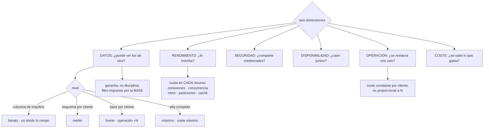

# 154 — Multi-tenancy, aislamiento y noisy neighbor

> [← 153 · Contratos API, compatibilidad y evolución](../../part-12-cloud-native-distributed-architecture/153-contratos-api-compatibilidad-y-evolucion/README.md) · [Índice de la parte](../README.md) · [155 · Rendimiento, costo, seguridad y operabilidad →](../../part-12-cloud-native-distributed-architecture/155-rendimiento-costo-seguridad-y-operabilidad/README.md)

**Parte:** 12 — Arquitectura cloud-native y sistemas distribuidos<br>
**Nivel:** avanzado-experto · **Horas estimadas:** 4<br>
**Laboratorio:** `architecture` · **Estado:** `EXECUTABLE_CORE`

## 🎯 Propósito

Servir a muchos clientes con la misma infraestructura sin que se vean entre sí ni se estorben. La clase sustituye la pregunta binaria —compartido o dedicado— por la que sirve: **el aislamiento tiene seis dimensiones y cada una puede estar en un nivel distinto**. Desarrolla con detalle la que no admite errores, porque un solo fallo la rompe entera —que un cliente vea datos de otro—, da la aritmética del vecino ruidoso y termina con lo que de verdad hunde a los productos multiinquilino: **las operaciones que hay que hacer cliente a cliente**.

## 📚 Resultados de aprendizaje

Al finalizar podrás:

1. **Situar** cada recurso en el nivel de aislamiento adecuado, por dimensiones.
2. **Impedir** por construcción que un cliente vea datos de otro.
3. **Acotar** el consumo de cada cliente en todos los recursos compartidos.
4. **Operar** migraciones, copias y borrados cliente a cliente sin que crezca el coste.
5. **Calcular** el coste por cliente y ofrecer niveles con camino entre ellos.

## 🧩 Conceptos centrales

| Concepto | Comprensión verificable |
|---|---|
| `dimensiones de aislamiento` | Datos, rendimiento, seguridad, disponibilidad, operación y coste. Cada una puede estar en un nivel distinto. |
| `identificador de inquilino` | Dato que acompaña a toda operación. Si falta en un solo sitio, se filtra información entre clientes. |
| `seguridad a nivel de fila` | La base impone el filtro por cliente, no la aplicación. Convierte una disciplina en una garantía. |
| `vecino ruidoso` | Cliente cuyo consumo degrada a los demás. Se acota con cuotas en cada recurso compartido. |
| `operación por cliente` | Migrar, copiar, restaurar, borrar o mover un cliente. Su coste debe ser constante, no proporcional al número de clientes. |
| `nivel de servicio` | Grado de aislamiento ofrecido como producto. Necesita camino de migración entre niveles desde el primer día. |

## 🧠 Modelo mental

Una arquitectura es un conjunto de decisiones costosas de cambiar; su calidad se juzga contra escenarios concretos, no por la cantidad de servicios usados.

Aplicado a esta clase, separa siempre cuatro planos: **intención** (qué necesita el usuario),
**configuración** (qué declaramos), **estado observado** (qué existe de verdad) y
**evidencia** (cómo sabemos que cumple). Confundirlos produce diseños que se ven correctos
en un diagrama pero fallan al operar.

## 🗺️ Flujo de razonamiento



## 📖 Desarrollo

### 1. Seis dimensiones, no una decisión

La pregunta habitual —«¿compartido o dedicado?»— es demasiado gruesa. Lo que hay que decidir es **por dimensión y por recurso**:

```text
DATOS           ¿puede un cliente ver los de otro?
RENDIMIENTO     ¿el consumo de uno degrada a los demás?
SEGURIDAD       ¿comparten credenciales, claves o permisos?
DISPONIBILIDAD  ¿una caída afecta a todos a la vez?
OPERACIÓN       ¿se puede restaurar, migrar o borrar uno solo?
COSTE           ¿se sabe cuánto gasta cada uno?
```

Y cada una admite niveles distintos:

```text
datos           esquema por cliente
rendimiento     cuotas sobre recursos compartidos
seguridad       clave de cifrado por cliente            clase 136
disponibilidad  compartida, salvo tres clientes con celda propia
operación       herramientas por cliente
coste           medido por cliente                      clase 142
```

Y los niveles clásicos, con lo que cuesta cada uno:

```text
COLUMNA DE INQUILINO EN CADA TABLA
  + el más barato; una base para todos
  − un olvido en una consulta lo rompe entero
  − y restaurar un cliente exige extraerlo del conjunto

ESQUEMA POR CLIENTE, MISMA BASE
  + el filtro deja de depender de cada consulta
  + copias y borrado por cliente son viables
  − las migraciones se ejecutan N veces

BASE POR CLIENTE
  + aislamiento fuerte de datos y de rendimiento
  − coste y operación proporcionales al número de clientes

PILA COMPLETA POR CLIENTE
  + máximo aislamiento; es una celda de la clase 151
  − coste máximo; solo para pocos clientes grandes
```

Y la regla que evita elegir mal:

```text
el nivel lo decide el REQUISITO, no la comodidad
  ¿lo exige una norma o un contrato?             clase 141
  ¿el cliente paga por ello?
  ¿qué pasa si se rompe esta dimensión?
```

Y una decisión que hay que tomar el primer día porque después es irreversible —ley 14—:

```text
¿existe un camino para MOVER un cliente de un nivel a otro?
  si no existe, el nivel inicial es para siempre
  y el primer cliente grande obligará a rehacerlo todo
```

### 2. Que no pueda ver lo de otro

Esta es la dimensión que no admite grados: **basta un fallo en un sitio para romperla entera**, y sus consecuencias son legales además de técnicas.

De dónde salen las fugas, por frecuencia:

```text
UNA CONSULTA SIN EL FILTRO
  la más común; suele estar en un informe o en una función nueva

UNA CLAVE DE CACHÉ SIN EL CLIENTE                        clase 111
  el segundo usuario ve la respuesta del primero

UN PROCESO POR LOTES QUE RECORRE EL CONJUNTO ENTERO
  y escribe el resultado en el contexto equivocado

UNA HERRAMIENTA INTERNA                                  clase 137
  que muestra a soporte más de lo que debe

UN ÍNDICE DE BÚSQUEDA COMPARTIDO
  donde el filtro se aplica al consultar y alguien lo olvida

UNA EXPORTACIÓN O UN INFORME
  generado con una consulta distinta a la de la aplicación

UN MENSAJE ENVIADO AL DESTINATARIO EQUIVOCADO
  la fuga que el cliente ve primero
```

Y las defensas, ordenadas por lo que garantizan:

```text
1. SEPARACIÓN FÍSICA
   bases o esquemas distintos con credenciales distintas
   → una consulta mal escrita no puede alcanzar otros datos

2. FILTRO IMPUESTO POR LA BASE
   seguridad a nivel de fila: la base añade el filtro siempre
   → una consulta sin filtro devuelve solo lo del cliente actual
   → convierte una disciplina en una garantía

3. FILTRO EN UNA CAPA COMÚN DE ACCESO A DATOS
   ningún código accede directamente; todo pasa por ahí
   → funciona hasta que alguien escribe una consulta directa

4. DISCIPLINA Y REVISIÓN
   → falla; es cuestión de tiempo
```

Y el nivel 2 es el que mejor relación tiene entre coste y garantía en una base relacional: se configura una vez y **protege también a los informes y a los procesos por lotes**.

Y la comprobación que hay que automatizar, porque es la única que demuestra que funciona:

```text
en cada construcción
  crear datos de dos clientes
  ejecutar TODAS las operaciones como cliente A
  y comprobar que no aparece ningún dato de B

y la versión más útil: hacerlo también con las consultas de informes,
las exportaciones y las herramientas internas
```

Y una comprobación adicional que detecta el caso del caché:

```text
dos sesiones de clientes distintos piden lo mismo
y se comprueba que las respuestas DIFIEREN                clase 122
```

Y el identificador de cliente debe viajar en el contexto, no pasarse a mano:

```text
en la petición, en el mensaje de la cola, en el evento,
en el trabajo programado y en el registro                clases 113, 115
→ si alguien tiene que acordarse de pasarlo, alguna vez se olvidará
```

### 3. El vecino ruidoso

Con recursos compartidos, **un cliente puede consumirlos todos**. Y la lista de recursos compartidos es más larga de lo que parece:

```text
conexiones a la base                                     clase 109
concurrencia de funciones                                clase 117
ritmo de peticiones a la API                             clase 118
hilos y compartimentos del servicio                      clase 130
particiones de una cola o registro                       clase 114
espacio y operaciones de almacenamiento
espacio del caché                                        clase 111
procesador y memoria del nodo
y la propia base de datos: bloqueos y consultas caras
```

Y la regla: **cada uno necesita su cuota**, o el más ruidoso se lleva todo.

```text
sin cuotas   un cliente con un proceso mal hecho degrada a 190
con cuotas   ese cliente se degrada a sí mismo
```

Y el problema práctico es que la cuota tiene que estar en el sitio correcto:

```text
en la puerta de entrada        limita peticiones                clase 118
en el agrupador de conexiones  un cliente no acapara conexiones
en la concurrencia             reserva por cliente o por nivel
en la cola                     un cliente no llena las particiones
en la base                     límite de tiempo por sentencia   clase 109
```

La última es la que más incidentes evita en sistemas con informes: **una consulta de un cliente que tarda cuarenta minutos bloquea recursos de todos**.

Y la técnica estructural, que la clase 151 ya presentó y aquí es especialmente aplicable:

```text
REPARTO POR SORTEO
  cada cliente usa un subconjunto pequeño y distinto de los recursos
  → un cliente que satura los suyos afecta a pocos
  → y sin duplicar infraestructura
```

Y una variante muy usada: **agrupar clientes por comportamiento**. Los que hacen mucho trabajo por lotes van a un conjunto de recursos, y los interactivos a otro, para que las cargas pesadas no compitan con las que el usuario espera.

Y lo que hay que vigilar, por cliente:

```text
peticiones, errores y latencia                          clase 123
consumo de cada recurso frente a su cuota
veces que ha alcanzado su cuota
y el cliente que más consume de cada recurso, cada semana
```

La última es la que detecta el problema antes de que sea un incidente: **casi siempre hay un cliente que consume mucho más de lo que paga**, y eso es a la vez un problema de rendimiento y de coste.

### 4. Lo que hay que hacer cliente a cliente

Aquí está lo que hunde a los productos multiinquilino, y casi nunca se planea:

```text
MIGRACIONES DE ESQUEMA
  con esquema por cliente, una migración se ejecuta N veces
  → con 190 clientes y 40 s cada una, son 2 horas
  → y si falla en el cliente 137, hay que saber reanudar

COPIA Y RESTAURACIÓN DE UN SOLO CLIENTE
  «restaura los datos de este cliente a ayer»
  → con tabla compartida, es un proyecto
  → con esquema o base por cliente, es rutina

BORRADO DE UN CLIENTE                                    clase 141
  incluidos lago, registros conservados, copias y caché
  → la respuesta elegante es el borrado criptográfico
    con clave por cliente                                clase 136

MOVER UN CLIENTE
  de nivel, de región o de celda
  → exige poder exportar e importar su estado completo

PERSONALIZACIÓN POR CLIENTE
  el que más daño hace a largo plazo
```

Y la regla que resume la lista:

```text
el coste de una operación por cliente debe ser CONSTANTE,
no proporcional al número de clientes
→ y eso exige herramientas, no procedimientos manuales
```

Y sobre la personalización, una advertencia que conviene decir pronto:

```text
cada campo, regla o flujo específico de un cliente
  se prueba aparte
  se despliega con cuidado aparte
  y aparece en cada cambio futuro

→ un producto con 20 personalizaciones por cliente y 190 clientes
  no es un producto: son 190 productos
```

Y la salida sana: **personalizar por configuración e interruptores, no por código** —clase 105—, con un catálogo cerrado de opciones.

**El coste por cliente**, que es la clase 142 en su forma más difícil:

```text
directo        lo que se puede atribuir: su base, su almacenamiento
compartido     lo que hay que repartir: nodos, red, plataforma
               → proporcional a su consumo medido, y explicable

y la cifra que decide el negocio:
  coste por cliente frente a lo que paga
  → casi siempre hay clientes que cuestan más de lo que ingresan
```

**Los niveles de servicio**, que es cómo se ofrece el aislamiento como producto:

```text
básico       compartido, con cuotas
profesional  cuotas mayores, copia por cliente, clave propia
dedicado     base propia o celda propia, y objetivos propios
```

Y la condición sin la cual esto no funciona, que ya se enunció:

```text
el camino entre niveles debe existir y estar probado
→ mover un cliente de básico a dedicado no puede ser un proyecto
→ y se ensaya con un cliente de prueba, periódicamente
```

Y la lista de comprobación de la clase:

```text
☐ el nivel de aislamiento está decidido por dimensión, no en bloque
☐ el identificador de cliente viaja en el contexto, no a mano
☐ el filtro por cliente lo impone la base, no cada consulta
☐ las claves de caché incluyen el cliente
☐ hay prueba automática de que un cliente no ve datos de otro
☐ esa prueba cubre informes, exportaciones y herramientas internas
☐ cada recurso compartido tiene cuota por cliente
☐ hay límite de tiempo por sentencia en la base
☐ se vigila quién consume más de cada recurso
☐ las operaciones por cliente tienen herramienta y coste constante
☐ la personalización es por configuración, no por código
☐ se mide el coste por cliente frente a lo que paga
☐ existe camino de migración entre niveles y está ensayado
```

Y el cierre que enlaza con la clase siguiente: aislamiento, rendimiento, seguridad y coste no se pueden maximizar a la vez, y esta clase ha ido eligiendo entre ellos sin decirlo. Hacer explícitos esos compromisos, y decidirlos con un método, es la materia de la clase 155.

## 🔬 Ejemplo trabajado

**CloudShop sirve a 190 socios comerciales desde una infraestructura compartida. El ejercicio empieza por la dimensión que no admite fallos y termina con tres clientes movidos a un nivel dedicado, con el camino ensayado.**

**La situación de partida, por dimensiones.**

```text
DATOS           columna de inquilino en 84 tablas
RENDIMIENTO     sin cuotas por cliente en ningún recurso
SEGURIDAD       una clave de cifrado para todos
DISPONIBILIDAD  todos comparten todo
OPERACIÓN       restaurar un cliente: no había forma
COSTE           no se sabía lo que gastaba cada uno
```

Seis dimensiones en el nivel más bajo, **y ninguna decidida a propósito**.

**La dimensión de datos: la auditoría.**

Se escribió la prueba del apartado segundo y se ejecutó contra el sistema existente:

```text
operaciones probadas como cliente A                          148
operaciones que devolvieron datos de B                         6
  un informe de ventas por categoría                          sí
  una exportación de productos                                sí
  el índice de búsqueda, consultado sin filtro                sí
  la herramienta interna de soporte                           sí   clase 137
  un proceso por lotes de recálculo de precios                sí
  una clave de caché sin cliente                              sí   clase 111
```

Seis de ciento cuarenta y ocho, y **ninguna estaba en el camino principal**: las seis estaban en informes, exportaciones, búsqueda, herramientas internas y procesos de fondo, que es exactamente la lista del apartado segundo.

Y la más grave llevaba tiempo activa:

```text
el índice de búsqueda era compartido y el filtro se aplicaba
en la consulta de la aplicación
una función nueva consultaba el índice directamente
tiempo desplegada                                        4 meses
clientes que podrían haber visto productos de otros           190
consultas que lo hicieron, según registros                     0
```

Y la corrección se hizo por niveles, no por disciplina:

```text                                          antes         después
filtro por cliente                      en cada consulta   impuesto por la base
                                                           (nivel de fila)
índice de búsqueda                       compartido        un índice por cliente
                                                           en los 190
claves de caché                          sin cliente       con cliente
herramienta de soporte                   sin filtro        con filtro y registro
prueba automática por construcción       no                sí, 148 operaciones
fugas detectadas después                  —                3, todas en la
                                                           canalización
```

Y el nivel de fila en la base resolvió cuatro de las seis de una vez, **incluidos el informe y el proceso por lotes que nadie había pensado en revisar**.

**El vecino ruidoso, con números.**

```text
semana de medición
  socios                                                     190
  socio que más consumía                            61 % del total
  su facturación                                    1,4 % de los ingresos
```

Sesenta y uno por ciento del consumo y el uno coma cuatro por ciento de los ingresos. Y su patrón:

```text
un proceso propio que consultaba el catálogo completo cada 5 minutos
41.000 peticiones/hora, contra una media de 210 por socio
```

Y el efecto sobre los demás, antes de las cuotas:

```text
latencia p99 de los otros 189, en horas punta            2.100 ms
latencia p99 cuando ese socio no ejecutaba su proceso      180 ms
```

Las cuotas se pusieron en los cinco recursos del apartado tercero:

```text                                          antes         después
ritmo de peticiones por socio           sin límite      por nivel de servicio
conexiones a la base por socio          sin límite      máximo 4
concurrencia de funciones por socio     sin límite      reservada por nivel
particiones de cola                     compartidas     sorteo 2 de 12
límite de tiempo por sentencia          no había        15 s

latencia p99 de los demás en horas punta   2.100 ms        190 ms
socios afectados por un vecino ruidoso        189             3
veces que ese socio alcanzó su cuota            —          constantemente
```

Y la conversación comercial que hizo posible el cambio: el socio pasó a un nivel superior o redujo su consumo. Eligió reducirlo, porque **su proceso pedía cada cinco minutos algo que cambiaba una vez al día**.

**Las operaciones por cliente.**

```text
operación                          antes                    después
migración de esquema        1 esquema compartido     190 esquemas, 2 h 10,
                                                     reanudable, con informe
restaurar un cliente a ayer  no era posible          herramienta, 12 min
borrar un cliente            9 días (clase 141)      40 min, con borrado
                                                     criptográfico
mover a nivel dedicado       no existía              herramienta, 3 h,
                                                     ensayada trimestralmente
exportar el estado completo  no existía              herramienta, 25 min
```

Y la migración de esquema por cliente, que era la que asustaba:

```text
primera ejecución sobre 190 esquemas
  duración                                             2 h 10
  fallos                                                    3
  reanudación desde el punto de fallo                      sí
  clientes con esquema desalineado al terminar              0
```

Y se añadió una comprobación diaria: **ningún esquema puede quedar en una versión distinta a la esperada**, que es la ley 13 aplicada a esto.

**La personalización, atajada a tiempo.**

```text
personalizaciones existentes                                  31
  por configuración                                           18
  POR CÓDIGO específico de un cliente                         13
     condiciones «si el cliente es X» repartidas en 6 servicios
```

Y el coste medido de las trece:

```text
cambios en los que hubo que probarlas                 todos
tiempo añadido por cambio, estimado                   ~15 %
incidentes causados por una de ellas en 12 meses          4
```

```text                                          antes         después
personalizaciones por código                    13              0
por configuración con catálogo cerrado          18             29
condiciones «si el cliente es X» en el código   41              0
opciones del catálogo                        no existía         12
```

Y dos de las trece no cabían en el catálogo: **se rechazaron y se renegociaron con los clientes**, uno de los cuales aceptó y el otro pasó a nivel dedicado.

**Los niveles y el camino entre ellos.**

```text
BÁSICO         compartido, cuotas estándar             181 socios
PROFESIONAL    cuotas mayores, copia por cliente,
               clave de cifrado propia                     6 socios
DEDICADO       base propia, objetivos propios,
               región elegible                             3 socios
```

Y los tres dedicados vinieron de tres motivos distintos, todos escritos:

```text
socio A   exige que sus datos estén en su propia región     clase 141
socio B   consumo muy superior al de un básico
socio C   una personalización que no cabía en el catálogo
```

Y el camino de migración, que era la condición del apartado primero:

```text
tiempo de mover un socio de básico a dedicado                3 h
parada percibida por el socio                             11 min
ensayo con un socio de prueba                          trimestral
fallos en el primer ensayo                                     4
  → exportación incompleta del índice de búsqueda
  → claves de caché que no se invalidaban
  → el catálogo de servicios no se actualizaba (clase 095)
  → la facturación seguía atribuyendo al conjunto compartido
fallos en el cuarto ensayo                                     0
```

**El coste por cliente.**

```text
coste directo atribuible                                    41 %
coste compartido, repartido por consumo medido              53 %
bolsa sin asignar                                            6 %

coste medio por socio                                     152 €/mes
socios que cuestan más de lo que pagan                        14
de ellos, con consumo desproporcionado                         9
de ellos, con precio mal fijado                                5
```

Y los nueve se resolvieron con cuotas; los cinco pasaron a la conversación comercial.

**A los nueve meses.**

```text                                          antes         después
dimensiones decididas a propósito              0 de 6         6 de 6
fugas entre clientes encontradas                  6              0
filtro impuesto por la base                      no             sí
prueba automática de aislamiento                 no        148 operaciones
recursos compartidos con cuota                 0 de 5         5 de 5
latencia p99 con un vecino ruidoso           2.100 ms        190 ms
socios afectados por un vecino                   189             3
operaciones por cliente con herramienta        0 de 5         5 de 5
restaurar un cliente                         imposible        12 min
borrar un cliente                              9 días         40 min
personalizaciones por código                     13              0
coste por cliente conocido                       no             sí
niveles de servicio                               1              3
camino entre niveles, ensayado                   no        trimestral
```

**La lección que esta clase traslada a la parte 12**: de las seis operaciones que filtraban datos entre clientes, **ninguna estaba en el camino principal**: estaban en un informe, una exportación, un índice de búsqueda, una herramienta interna, un proceso por lotes y una clave de caché. Ninguna revisión de código las habría encontrado, y cuatro se cerraron de golpe **poniendo el filtro en la base en vez de en cada consulta**. Y el vecino ruidoso que consumía el 61 % de la capacidad aportaba el 1,4 % de los ingresos: era a la vez el problema de rendimiento y el de coste, que es la misma observación que cerró la parte 11.

## 🧪 Laboratorio guiado

Ejecuta desde la raíz:

```bash
python classes/part-12-cloud-native-distributed-architecture/154-multi-tenancy-aislamiento-y-noisy-neighbor/lab.py
```

El laboratorio selecciona el motor de práctica **`architecture`** y produce
`lab_result.json`. El escenario, sus comprobaciones y el artefacto esperado corresponden a
esta clase; no requiere credenciales y deja explícito qué debe revalidarse en un sandbox real.

1. Lee `exercise.steps` y formula una predicción antes de ejecutar.
2. Ejecuta la práctica y verifica todos los elementos de `checks`.
3. Provoca el caso de `negative_test` y explica la señal observada.
4. Materializa `modelo-tenancy` en `evidence/` usando la plantilla indicada.
5. Para proveedor real, sigue `sandbox.requires`, registra costo y ejecuta `destroy`.

### Evidencia esperada

El artefacto principal es un diagrama acompañado por decisiones y trade-offs. Además, la entrega debe incluir el comando ejecutado,
la salida estructurada y una conclusión que no exceda lo observado.

## 🏆 Reto verificable

Construye **`modelo-tenancy`** para el caso CloudShop. Incluye una alternativa descartada,
un supuesto que pueda falsarse, una prueba de fallo y una decisión de rollback.

## ✅ Criterio de aceptación

- [ ] `lab.py` termina con código 0 y genera JSON válido.
- [ ] La entrega conecta al menos tres requisitos con mecanismos verificables.
- [ ] Existe una prueba positiva y una prueba negativa con evidencia.
- [ ] Seguridad, costo y operación aparecen como decisiones, no como anexos.
- [ ] Se declara una limitación y una condición que obligaría a revisar el diseño.
- [ ] Otra persona puede repetir el recorrido sin conocimiento tácito.

## ⚠️ Errores frecuentes

| Síntoma | Causa probable | Corrección |
|---|---|---|
| Un cliente ve datos de otro en un informe o una exportación | El filtro por cliente lo aplica cada consulta y alguien lo olvidó fuera del camino principal | Impón el filtro en la base con seguridad a nivel de fila y prueba automáticamente todas las operaciones, incluidos informes y herramientas internas. |
| Dos clientes distintos reciben la misma respuesta cacheada | La clave de caché no incluye el identificador de cliente | Incluye siempre el cliente en la clave y añade una prueba que compare respuestas de dos sesiones distintas. |
| Un cliente degrada el servicio de todos los demás | No hay cuotas en los recursos compartidos | Cuota por cliente en ritmo, conexiones, concurrencia, colas y tiempo por sentencia; y reparto por sorteo para acotar el alcance. |
| Restaurar o borrar los datos de un solo cliente es un proyecto | Los datos están mezclados y no hay herramientas por cliente | Esquema o clave de cifrado por cliente, y herramientas cuyo coste sea constante y no proporcional al número de clientes. |
| Cada cambio hay que probarlo contra decenas de casos particulares | Hay personalización por código específica de clientes | Personaliza por configuración con un catálogo cerrado de opciones; lo que no quepa, renegócialo o llévalo a un nivel dedicado. |
| El primer cliente grande obliga a rehacer la arquitectura | No existe camino de migración entre niveles de aislamiento | Diseña el camino desde el primer día y ensáyalo periódicamente con un cliente de prueba. |

## 🛡️ Seguridad, ética y costo

Trabaja con cuentas propias o sandboxes autorizados. No publiques secretos, identificadores
reales ni datos personales. Antes de crear recursos pagos define presupuesto, etiquetas y
comando de destrucción; después verifica que no queden recursos huérfanos. Los ejemplos
locales enseñan contratos, pero no certifican cumplimiento ni disponibilidad de producción.

## ❓ Preguntas de comprobación

1. ¿Cuáles son las seis dimensiones de aislamiento y por qué no se deciden en bloque?
2. ¿De dónde salen las fugas entre clientes y por qué no están en el camino principal?
3. ¿Qué convierte el filtro por cliente en una garantía en vez de una disciplina?
4. ¿En qué recursos hace falta cuota por cliente?
5. ¿Por qué el coste de una operación por cliente debe ser constante?

## 🔗 Referencias

- AWS (2025). *SaaS tenant isolation strategies* — niveles de aislamiento y modelos de despliegue. <https://docs.aws.amazon.com/whitepapers/latest/saas-tenant-isolation-strategies/saas-tenant-isolation-strategies.html>
- PostgreSQL (2025). *Row security policies* — filtro impuesto por la base y no por la consulta. <https://www.postgresql.org/docs/current/ddl-rowsecurity.html>
- Microsoft (2025). *Multitenant SaaS patterns: tenancy models and noisy neighbor* — modelos y cuotas. <https://learn.microsoft.com/azure/architecture/guide/multitenant/overview>
- AWS (2025). *Workload isolation using shuffle sharding* — acotar el alcance de un vecino ruidoso. <https://aws.amazon.com/builders-library/workload-isolation-using-shuffle-sharding/>
- Google Cloud (2025). *Per-tenant cost attribution* — coste por cliente con recursos compartidos. <https://cloud.google.com/architecture/framework/cost-optimization>
- Documentación oficial vigente del servicio implementado; registra URL y fecha de consulta.

---

> [Evaluación](assessment.md) · [Contrato de clase](lesson.yaml) · [Índice de la parte](../README.md)

**📥 Descargar:** [Parte 12 en PDF](../../../site/downloads/partes/manual-parte-12-cloud-native-distributed-architecture.pdf) · [Manual integral](../../../site/downloads/multi-cloud-engineering-manual-v2.0.pdf)

| Anterior | Índice | Siguiente |
|---|---|---|
| [← 153 · Contratos API, compatibilidad y evolución](../../part-12-cloud-native-distributed-architecture/153-contratos-api-compatibilidad-y-evolucion/README.md) | [Parte 12](../README.md) · [Programa](../../README.md) | [155 · Rendimiento, costo, seguridad y operabilidad →](../../part-12-cloud-native-distributed-architecture/155-rendimiento-costo-seguridad-y-operabilidad/README.md) |
