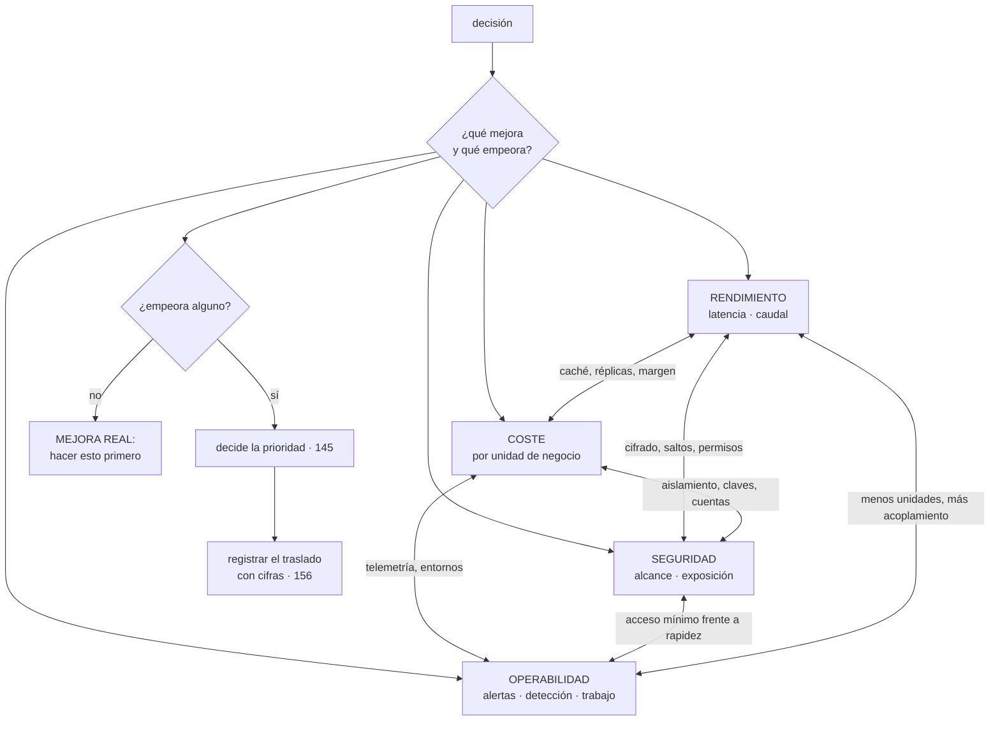

# 155 — Rendimiento, costo, seguridad y operabilidad

> [← 154 · Multi-tenancy, aislamiento y noisy neighbor](../../part-12-cloud-native-distributed-architecture/154-multi-tenancy-aislamiento-y-noisy-neighbor/README.md) · [Índice de la parte](../README.md) · [156 · Proyecto: revisión de arquitectura con ADR →](../../part-12-cloud-native-distributed-architecture/156-proyecto-revision-de-arquitectura-con-adr/README.md)

**Parte:** 12 — Arquitectura cloud-native y sistemas distribuidos<br>
**Nivel:** avanzado-experto · **Horas estimadas:** 4<br>
**Laboratorio:** `decision` · **Estado:** `EXECUTABLE_CORE`

## 🎯 Propósito

Hacer explícito lo que las once clases anteriores han estado eligiendo sin decirlo. Casi ninguna decisión de arquitectura es una mejora: es **un traslado** entre rendimiento, coste, seguridad y operabilidad, y llamarlo mejora sin decir qué empeoró es lo que convierte una decisión en algo que después nadie puede discutir. La clase da el método para escribir el traslado en cuatro columnas, enseña a medir los cuatro para que la comparación sea cuantitativa, y señala los pocos casos en que **no hay traslado y se gana en varios a la vez**, que son el trabajo más rentable y el menos vistoso.

## 📚 Resultados de aprendizaje

Al finalizar podrás:

1. **Reconocer** el traslado que hay detrás de cada decisión de arquitectura.
2. **Escribir** una decisión con lo que mejora y lo que empeora, con cifras.
3. **Medir** los cuatro atributos para poder comparar.
4. **Resolver** el conflicto con el orden de prioridad, no con la opinión.
5. **Buscar** primero los cambios que mejoran dos o más a la vez.

## 🧩 Conceptos centrales

| Concepto | Comprensión verificable |
|---|---|
| `traslado` | Cambio que mejora un atributo empeorando otro. Es lo que es casi toda decisión de arquitectura. |
| `mejora real` | Cambio que mejora dos o más atributos sin empeorar ninguno. Existe, es escaso y casi siempre consiste en quitar algo. |
| `cuatro columnas` | Formato mínimo de una decisión: qué mejora, cuánto, qué empeora, cuánto, y qué prioridad decide. |
| `coste oculto de operar` | Lo que una decisión añade en canalizaciones, alertas, procedimientos y guardia. Es el atributo que menos se cuantifica. |
| `prioridad declarada` | El orden de atributos de la clase 145. Es lo que resuelve el conflicto sin recurrir a la autoridad. |
| `decisión revisable` | La que registró su traslado y sus premisas, de modo que se pueda comprobar si siguen siendo ciertas. |

## 🧠 Modelo mental

Una arquitectura es un conjunto de decisiones costosas de cambiar; su calidad se juzga contra escenarios concretos, no por la cantidad de servicios usados.

Aplicado a esta clase, separa siempre cuatro planos: **intención** (qué necesita el usuario),
**configuración** (qué declaramos), **estado observado** (qué existe de verdad) y
**evidencia** (cómo sabemos que cumple). Confundirlos produce diseños que se ven correctos
en un diagrama pero fallan al operar.

## 🗺️ Flujo de razonamiento



## 📖 Desarrollo

### 1. Casi todo es un traslado

Las tensiones, cada una con el mecanismo concreto de este programa que la produce:

```text
RENDIMIENTO ←→ COSTE
  caché, réplicas de lectura, margen hasta el codo, cercanía geográfica
  → todo lo que hace más rápido cuesta capacidad         clases 111, 129

RENDIMIENTO ←→ SEGURIDAD
  cifrado por campo, autenticación mutua, comprobación de permisos,
  saltos de intermediario                                 clases 136, 152
  → 1,2 ms por llamada no es nada, hasta que hay ocho llamadas

RENDIMIENTO ←→ OPERABILIDAD
  menos unidades desplegables es más fácil de operar y acopla más
  más unidades permite escalar por separado y multiplica el trabajo
                                                          clase 148

COSTE ←→ SEGURIDAD
  aislamiento por cliente, claves por ámbito, cuentas separadas,
  entornos separados                                      clases 133, 154
  → el aislamiento cuesta aprovechamiento

COSTE ←→ OPERABILIDAD
  telemetría, entornos, retención de registros
  → saber lo que pasa cuesta dinero: llegó a ser el 70 % del cómputo
                                                          clase 132

SEGURIDAD ←→ OPERABILIDAD
  acceso mínimo y temporal frente a rapidez para intervenir
  inmutabilidad frente a poder depurar                    clases 134, 141
```

Y la afirmación que ordena la clase:

```text
casi ninguna decisión de arquitectura es una mejora
es un TRASLADO entre estos cuatro
```

Y el problema de no decirlo:

```text
se presenta como mejora
nadie sabe qué empeoró ni cuánto
no se puede discutir, porque no hay nada que comparar
y cuando el atributo empeorado duele, nadie relaciona una cosa
  con la otra
```

Y el caso característico, que este programa ya vio dos veces:

```text
«hemos separado en microservicios: ahora escala mejor»
  mejora    escalado independiente de dos partes
  empeora   latencia (7 fronteras), operabilidad (15 canalizaciones
            y guardias), coste, y consistencia
  y nadie lo escribió                                     clase 148

«hemos añadido observabilidad completa»
  mejora    detección
  empeora   coste: 6.410 € frente a 9.200 € de cómputo    clase 132
```

Y el formato mínimo que lo evita, en cuatro columnas:

```text
QUÉ MEJORA        con qué cifra
QUÉ EMPEORA       con qué cifra
QUÉ PRIORIDAD DECIDE   del orden de la clase 145
QUÉ HARÍA REVISARLO    qué premisa, si cambia, invalida la decisión
```

La cuarta es la que convierte una decisión en revisable, y es la materia de la clase 156.

### 2. Medir los cuatro

Un traslado solo se puede discutir si los dos lados tienen número. Las cuatro columnas se miden así:

```text
RENDIMIENTO
  latencia por percentil, medida en el borde                clase 126
  caudal sostenido y distancia al codo                      clase 129
  llamadas de red por operación de negocio                  clase 152

COSTE
  coste por unidad de negocio, no absoluto                  clase 142
  y desglosado por servicio

SEGURIDAD
  alcance desde cada punto de entrada                       clase 133
  accesos permanentes a lo sensible                         clase 134
  hallazgos expuestos y su antigüedad                       clases 138, 139
  caminos hasta objetivos críticos                          clase 140

OPERABILIDAD
  alertas por turno y proporción accionable                 clase 125
  tiempo hasta detectar y hasta mitigar                     clase 127
  trabajo repetitivo como proporción del tiempo             clase 128
  unidades desplegables por persona de guardia              clase 148
```

Y la última fila merece énfasis porque es la que menos se cuantifica y la que más duele después:

```text
COSTE OCULTO DE OPERAR
  cada unidad nueva añade
    una canalización con sus puertas                        clase 100
    unos objetivos e indicadores                            clase 126
    unas alertas y unos procedimientos                      clases 125, 128
    una capacidad que medir                                 clase 129
    y alguien que la entienda a las tres de la madrugada
```

Y una forma práctica de ponerle número: **horas de mantenimiento al mes por unidad**, medidas, no estimadas. Con eso, una propuesta de cuatro servicios nuevos deja de ser gratis en la conversación.

Y dos advertencias sobre las medidas, que vienen de la parte 10:

```text
la medida que se convierte en objetivo se alcanza sin mejorar   ley 17
  → los cuatro se publican juntos, nunca uno solo

lo que compensa un fallo lo vuelve invisible                    ley 19
  → un traslado puede quedar oculto porque algo lo absorbe
  → el ejemplo financiero: la elasticidad convirtió una avería
    en una factura                                              clase 142
```

### 3. Cuando no hay traslado

Hay un conjunto pequeño de cambios que **mejoran dos o más atributos sin empeorar ninguno**. Son el trabajo más rentable que existe y casi siempre consisten en quitar algo.

```text
QUITAR LO QUE NADIE USA
  recursos huérfanos, series de métricas, permisos, campos, alertas
  mejora   coste, seguridad y operabilidad a la vez
  empeora  nada                                       clases 134, 142

REDUCIR SALTOS DE RED
  menos fronteras por operación
  mejora   latencia, coste, modos de fallo y trazabilidad
  empeora  el acoplamiento, solo si se une lo que no debía unirse
                                                       clases 148, 152

MENOS ALERTAS, MEJOR ELEGIDAS
  mejora   detección y operabilidad
  empeora  nada; se detectó más con menos                clase 125

ELIMINAR UN SECRETO
  identidad federada en vez de credencial
  mejora   seguridad y operabilidad (nada que rotar)
  empeora  nada                                          clase 137

ARREGLAR UNA CONSULTA POR ELEMENTO
  mejora   latencia y coste
  empeora  nada                                          clase 124

ESTRUCTURAR EL REGISTRO EN UNA LÍNEA ANCHA
  mejora   coste (÷5) y capacidad de investigar
  empeora  nada                                          clase 122
```

Y la regla que se deduce:

```text
antes de discutir un traslado, agota los cambios que no lo son
→ casi siempre queda alguno, y son los que menos se proponen
  porque no lucen
```

Y su explicación: **casi todos consisten en retirar algo que existe sin motivo**, que es la ley 20 vista desde el lado de la mejora.

Y el caso contrario, que también conviene reconocer: **traslados que se hacen en la dirección equivocada** porque nadie miró el orden de prioridad.

```text
se añade cifrado por campo a datos que no lo necesitan
  empeora   latencia y operabilidad (no se puede buscar ni ordenar)
  mejora    nada, si esos campos no son sensibles

se separan dos módulos que cambian siempre juntos
  empeora   latencia, coste, operabilidad y consistencia
  mejora    nada de lo que estaba priorizado

se guarda telemetría durante 90 días en caliente
  empeora   coste
  mejora    una capacidad de investigar que nadie usa pasados 14 días
```

Los tres tienen la misma forma: **se paga un traslado por un beneficio que no está en la lista de prioridades**.

### 4. Decidir y dejar constancia

El método, en cinco pasos:

```text
1. ENUNCIAR la decisión y las opciones reales
   dos o tres; si hay una sola, no es una decisión

2. MEDIR los cuatro atributos para cada opción
   con cifras, aunque sean estimaciones con su orden de magnitud

3. COMPROBAR si alguna opción no tiene traslado
   y si la hay, elegirla y terminar

4. RESOLVER el conflicto con el orden de prioridad     clase 145
   no con la opinión ni con la antigüedad de quien la sostiene

5. REGISTRAR la decisión con su traslado y sus premisas
```

Y el paso 4 es el que evita las discusiones circulares: **si el orden está escrito, el conflicto ya está resuelto de antemano**. Si no lo está, cada decisión reabre la discusión completa.

Y el paso 5 necesita un formato mínimo, que la clase 156 desarrolla:

```text
qué se decidió
qué opciones se consideraron
qué mejora y qué empeora, con cifras
qué prioridad lo decidió
qué premisas se dieron por ciertas
y qué haría revisarlo
```

La última línea es la que más valor tiene a los dos años:

```text
«esta decisión se revisa si el tráfico se multiplica por cuatro»
«si aparece un tercer lenguaje»                        clase 152
«si el equipo pasa de doce personas»                   clase 145
«si la campaña de noviembre deja de celebrarse»        clase 142
```

Y una advertencia sobre lo que ocurre cuando esto no se hace, y que es la observación con la que empieza la clase 156:

```text
los diagramas se mantienen unos meses y luego divergen
las decisiones no quedan escritas en ningún sitio
y a los dos años nadie sabe POR QUÉ está así
→ y entonces nadie se atreve a cambiarlo, por si acaso
```

Y dos cifras que conviene vigilar sobre el propio proceso:

```text
decisiones registradas frente a decisiones tomadas
decisiones revisadas al cumplirse su premisa de revisión
```

La segunda es la que dice si el registro sirve o es un archivo muerto.

Y la lista de comprobación de la clase:

```text
☐ cada decisión enuncia qué mejora y qué empeora, con cifras
☐ los cuatro atributos se miden y se publican juntos
☐ el coste de operar está cuantificado en horas por unidad y mes
☐ antes de aceptar un traslado se han agotado las mejoras sin traslado
☐ el conflicto se resuelve con el orden de prioridad escrito
☐ ninguna decisión paga un traslado por algo que no está priorizado
☐ cada decisión registra sus premisas y qué haría revisarla
☐ se comprueba si las premisas siguen siendo ciertas
```

Y el cierre que enlaza con la clase siguiente: con esto está completo el material de la parte 12. La clase 156 revisa la arquitectura construida, deja el registro de decisiones como artefacto que sobrevive y **califica las cinco predicciones de la clase 144**, empezando por la que decía que la ley 14 dominaría esta parte.

## 🔬 Ejemplo trabajado

**CloudShop repasa las seis decisiones de arquitectura tomadas en esta parte y escribe el traslado de cada una. Dos resultan ser mejoras sin coste, tres son traslados correctos y una estaba en la dirección equivocada.**

**Decisión 1: pasar de quince servicios a cinco unidades (clase 148).**

```text
MEJORA     latencia p99 del flujo de compra   840 ms → 210 ms
           coste operativo   15 canalizaciones → 5
           incidentes por fallo parcial        9/año → 2/año
           cambios en un solo repositorio       38 % → 91 %
EMPEORA    escalado independiente: ventas y soporte escalan juntos
           radio de un fallo de memoria: afecta a los dos módulos
CIFRA DEL PERJUICIO   soporte escala con ventas: +2 instancias
                      en campaña que no harían falta = 40 €/mes
PRIORIDAD  evolución y operabilidad, por encima de escalado fino
REVISAR SI soporte necesita escalar por su cuenta, o tiene equipo propio
```

**Mejora en cuatro columnas y empeora en una, cuantificada en cuarenta euros.** Con las cifras delante, la decisión dejó de ser discutible.

**Decisión 2: descartar la malla (clase 152).**

```text
MEJORA     coste          620 €/mes evitados
           operabilidad   un plano de control menos
           latencia       1,2 ms por llamada evitados
EMPEORA    la política vive en 2 bibliotecas: actualizarla exige
           desplegar los 5 servicios
CIFRA DEL PERJUICIO   ~6 horas por actualización de política,
                      ~3 veces al año = 18 h/año
PRIORIDAD  coste y operabilidad; con 5 servicios y 2 lenguajes,
           el perjuicio es menor que el beneficio
REVISAR SI hay más de 15 servicios o un tercer lenguaje
```

**Decisión 3: índice global en vez de local (clase 150).**

```text
MEJORA     latencia p99 de «mis pedidos»   410 ms → 21 ms
           lecturas por consulta                24 → 1
EMPEORA    escrituras por pedido                 1 → 2
           consistencia del índice     inmediata → ~200 ms
CIFRA DEL PERJUICIO   +6 % de coste de escritura; el desfase se cubre
                      con la garantía de sesión ya existente
PRIORIDAD  rendimiento del flujo del cliente
REVISAR SI la proporción de escrituras sube mucho
```

**Decisión 4: cifrado por campo en tres campos (clase 136).**

```text
MEJORA     seguridad: esos campos son ilegibles para quien comprometa
           la aplicación
EMPEORA    no se pueden buscar ni ordenar por ellos
           +8 ms por lectura que los incluya
CIFRA DEL PERJUICIO   2 informes tuvieron que rehacerse
PRIORIDAD  corrección y protección de datos personales, atributo 1
REVISAR SI cambia el requisito normativo
```

**Decisión 5: la que estaba en la dirección equivocada.**

Se había cifrado por campo también la dirección de envío:

```text
MEJORA     seguridad de un dato que ya estaba protegido por permisos,
           red y cifrado en reposo
EMPEORA    almacén no puede ordenar rutas por código postal
           el proceso de preparación descifra 12.000 registros/día
           +11 ms por lectura, +140 €/mes
PRIORIDAD  el dato es personal, sí, pero no está en la lista de
           categorías especiales, y ninguna norma lo exigía
```

Y el diagnóstico con el criterio del apartado tercero:

```text
se pagó un traslado por un beneficio que NO estaba priorizado
→ se revirtió el cifrado por campo de la dirección
→ y se dejó el control de acceso y el cifrado en reposo, que era
  lo que la clasificación de la clase 141 pedía

efecto de revertirlo
  latencia de preparación        −11 ms
  coste                          −140 €/mes
  ordenación de rutas            recuperada
  seguridad                      sin cambio medible en el alcance
```

**Las dos mejoras sin traslado.**

```text
RETIRAR 19 CAMPOS QUE NADIE USABA (clase 153)
  mejora   contrato más pequeño, menos que mantener y menos superficie
  empeora  nada; se comprobó con los contratos publicados

CORREGIR LAS 62 LLAMADAS DE «MIS PEDIDOS» (clase 152)
  mejora   latencia 2.100 ms → 190 ms
           coste: 59 llamadas menos por operación
           modos de fallo: 59 oportunidades menos de fallo parcial
  empeora  nada
```

Y el orden en que se hizo el trabajo, aplicando la regla del apartado tercero:

```text
semana 1-2   las dos mejoras sin traslado
semana 3-8   los traslados, con sus cuatro columnas escritas
```

Y el efecto de ese orden:

```text
mejora de latencia conseguida en las 2 primeras semanas    64 %
mejora conseguida en las 6 siguientes                      36 %
```

**Casi dos tercios de la mejora vinieron de los cambios que no costaban nada**, y se habrían pospuesto si se hubiera empezado por lo vistoso.

**Las cuatro columnas, medidas para el conjunto de la parte.**

```text                                    inicio parte 12    final
RENDIMIENTO
  latencia p99 del flujo de compra           840 ms         210 ms
  llamadas de red por operación típica          7              2
  distancia al codo en el pico                 71 %           43 %

COSTE
  coste por pedido                          0,057 €        0,041 €
  unidades desplegables                          15              5

SEGURIDAD
  alcance desde un servicio comprometido    2 de 15        2 de 5
  fugas entre clientes                            6              0
  caminos hasta objetivos críticos               14              2

OPERABILIDAD
  canalizaciones que mantener                    15              5
  unidades por persona de guardia               3,75           1,25
  horas de mantenimiento al mes por unidad       11             12
  trabajo repetitivo                            11 %            9 %
```

Y la fila de horas por unidad es la interesante: **el mantenimiento por unidad no bajó**; lo que bajó fue el número de unidades. Es la cifra que hace visible el coste oculto de operar.

**El registro de decisiones, y su medida.**

```text                                          antes         después
decisiones de arquitectura registradas            2             14
con las cuatro columnas                           0             14
con premisa de revisión escrita                   0             14
decisiones revisadas al cumplirse su premisa      —              3
  → la de la malla, al llegar a un tercer lenguaje: se mantuvo
  → la del compromiso de capacidad (clase 142)
  → la del cifrado de la dirección de envío
```

**A los seis meses.**

```text                                          antes         después
decisiones con traslado escrito                   0             14
decisiones revertidas por traslado mal dirigido   —              1
mejoras sin traslado identificadas antes de
empezar                                           0              2
proporción de la mejora que vino de ellas         —             64 %
los cuatro atributos publicados juntos            no             sí
horas de mantenimiento por unidad, medidas        no             sí
```

**La lección que esta clase traslada a la parte 12**: de seis decisiones, **dos no tenían ningún coste y produjeron el 64 % de la mejora total**, y se habrían pospuesto indefinidamente porque consistían en borrar campos y agrupar consultas. Y la única decisión que hubo que revertir no era técnicamente mala: era **un traslado pagado por un beneficio que no estaba en la lista de prioridades**, y solo se vio al escribir las cuatro columnas y comprobar que la columna de la mejora estaba vacía.

## 🧪 Laboratorio guiado

Ejecuta desde la raíz:

```bash
python classes/part-12-cloud-native-distributed-architecture/155-rendimiento-costo-seguridad-y-operabilidad/lab.py
```

El laboratorio selecciona el motor de práctica **`decision`** y produce
`lab_result.json`. El escenario, sus comprobaciones y el artefacto esperado corresponden a
esta clase; no requiere credenciales y deja explícito qué debe revalidarse en un sandbox real.

1. Lee `exercise.steps` y formula una predicción antes de ejecutar.
2. Ejecuta la práctica y verifica todos los elementos de `checks`.
3. Provoca el caso de `negative_test` y explica la señal observada.
4. Materializa `tradeoff-analysis` en `evidence/` usando la plantilla indicada.
5. Para proveedor real, sigue `sandbox.requires`, registra costo y ejecuta `destroy`.

### Evidencia esperada

El artefacto principal es una matriz de decisión ponderada y un ADR. Además, la entrega debe incluir el comando ejecutado,
la salida estructurada y una conclusión que no exceda lo observado.

## 🏆 Reto verificable

Construye **`tradeoff-analysis`** para el caso CloudShop. Incluye una alternativa descartada,
un supuesto que pueda falsarse, una prueba de fallo y una decisión de rollback.

## ✅ Criterio de aceptación

- [ ] `lab.py` termina con código 0 y genera JSON válido.
- [ ] La entrega conecta al menos tres requisitos con mecanismos verificables.
- [ ] Existe una prueba positiva y una prueba negativa con evidencia.
- [ ] Seguridad, costo y operación aparecen como decisiones, no como anexos.
- [ ] Se declara una limitación y una condición que obligaría a revisar el diseño.
- [ ] Otra persona puede repetir el recorrido sin conocimiento tácito.

## ⚠️ Errores frecuentes

| Síntoma | Causa probable | Corrección |
|---|---|---|
| Una decisión se presenta como mejora y nadie sabe qué empeoró | No se escribió el traslado | Escribe qué mejora y qué empeora, con cifras, y qué prioridad lo decide. |
| Cada decisión reabre la misma discusión | No hay orden de prioridad escrito, así que el conflicto se resuelve por opinión | Fija tres atributos que ganan cuando hay conflicto y aplícalos; es la clase 145. |
| Se paga complejidad por un beneficio que a nadie le importaba | El traslado mejora algo que no está priorizado | Comprueba que la columna de mejora contiene un atributo de la lista de prioridades; si no, revierte. |
| Se empieza por los cambios vistosos y la mejora tarda meses | No se buscaron primero los cambios que no tienen traslado | Agota las mejoras sin traslado —quitar lo que nadie usa, reducir saltos, corregir consultas por elemento— antes de aceptar ninguna. |
| Añadir servicios parece gratis en la conversación | El coste de operar no está cuantificado | Mide horas de mantenimiento al mes por unidad desplegable y úsalo en cada propuesta. |
| A los dos años nadie sabe por qué el sistema está así y nadie se atreve a cambiarlo | Las decisiones no dejaron constancia de sus premisas | Registra premisas y qué haría revisar cada decisión, y comprueba periódicamente si siguen siendo ciertas. |

## 🛡️ Seguridad, ética y costo

Trabaja con cuentas propias o sandboxes autorizados. No publiques secretos, identificadores
reales ni datos personales. Antes de crear recursos pagos define presupuesto, etiquetas y
comando de destrucción; después verifica que no queden recursos huérfanos. Los ejemplos
locales enseñan contratos, pero no certifican cumplimiento ni disponibilidad de producción.

## ❓ Preguntas de comprobación

1. ¿Por qué casi ninguna decisión de arquitectura es una mejora?
2. ¿Qué cuatro columnas debe tener el enunciado de una decisión?
3. ¿Cómo se cuantifica el coste de operar y por qué importa?
4. ¿Qué caracteriza a los cambios que mejoran varios atributos a la vez?
5. ¿Qué convierte una decisión en revisable dentro de dos años?

## 🔗 Referencias

- Ford, N. y otros (2021). *Software Architecture: The Hard Parts* — compromisos explícitos y análisis de alternativas. <https://www.oreilly.com/library/view/software-architecture-the/9781492086888/>
- Bass, L. y otros (2021). *Software Architecture in Practice*, cap. 20 — evaluación de arquitecturas por atributos. <https://www.oreilly.com/library/view/software-architecture-in/9780136886051/>
- SEI (2025). *ATAM: architecture tradeoff analysis method* — puntos de compromiso y sensibilidad. <https://insights.sei.cmu.edu/library/architecture-tradeoff-analysis-method-collection/>
- Google SRE (2025). *Balancing reliability, cost and velocity* — los cuatro atributos publicados juntos. <https://sre.google/workbook/table-of-contents/>
- FinOps Foundation (2025). *Unit economics as a decision input* — coste por unidad como columna de la decisión. <https://www.finops.org/framework/capabilities/unit-economics/>
- Documentación oficial vigente del servicio implementado; registra URL y fecha de consulta.

---

> [Evaluación](assessment.md) · [Contrato de clase](lesson.yaml) · [Índice de la parte](../README.md)

**📥 Descargar:** [Parte 12 en PDF](../../../site/downloads/partes/manual-parte-12-cloud-native-distributed-architecture.pdf) · [Manual integral](../../../site/downloads/multi-cloud-engineering-manual-v2.0.pdf)

| Anterior | Índice | Siguiente |
|---|---|---|
| [← 154 · Multi-tenancy, aislamiento y noisy neighbor](../../part-12-cloud-native-distributed-architecture/154-multi-tenancy-aislamiento-y-noisy-neighbor/README.md) | [Parte 12](../README.md) · [Programa](../../README.md) | [156 · Proyecto: revisión de arquitectura con ADR →](../../part-12-cloud-native-distributed-architecture/156-proyecto-revision-de-arquitectura-con-adr/README.md) |
