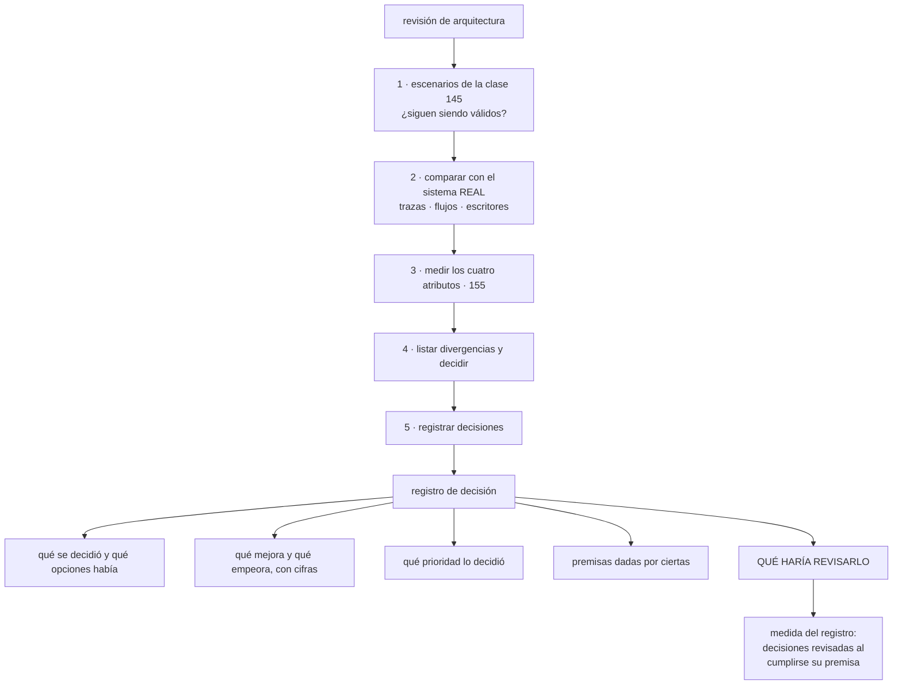

# 156 — Proyecto: revisión de arquitectura con ADR

> [← Clase anterior](../../part-12-cloud-native-distributed-architecture/155-rendimiento-costo-seguridad-y-operabilidad/README.md) · [Índice de la parte](../README.md) · [Clase siguiente →](../../part-13-multicloud-hybrid-disaster-recovery/157-motivaciones-y-anti-patrones-de-multi-cloud/README.md)

**Parte:** 12 — Arquitectura cloud-native y sistemas distribuidos<br>
**Nivel:** avanzado-experto · **Horas estimadas:** 8<br>
**Laboratorio:** `capstone` · **Estado:** `EXECUTABLE_CORE`

## 🎯 Propósito

Revisar la arquitectura construida y dejar el único artefacto que sobrevive a los cambios de equipo: **el registro de por qué está así**. La clase da un método de revisión que se puede ejecutar en medio día, el formato mínimo de una decisión y las cifras con las que se comprueba que el registro sirve. Y cierra la parte con las tres piezas de siempre: **calificar las cinco predicciones de la clase 144**, que esta vez salieron mejor de lo habitual y conviene explicar por qué; incorporar la ley que esta parte ha hecho aparecer cuatro veces; y escribir la predicción que la parte 13 tendrá que corregir.

## 📚 Resultados de aprendizaje

Al finalizar podrás:

1. **Ejecutar** una revisión de arquitectura acotada, con resultado accionable.
2. **Registrar** una decisión con su traslado, sus premisas y qué la revisaría.
3. **Medir** si el registro se usa o es un archivo muerto.
4. **Calificar** las cinco predicciones de la clase 144 con evidencia.
5. **Escribir** la predicción de la parte 13 en términos que se puedan desmentir.

## 🧩 Conceptos centrales

| Concepto | Comprensión verificable |
|---|---|
| `registro de decisión` | Documento corto escrito en el momento de decidir, con las opciones, el traslado, las premisas y qué haría revisarla. |
| `revisión de arquitectura` | Sesión acotada que compara los escenarios de calidad con el sistema real y produce cambios, no un informe. |
| `divergencia` | Distancia entre la arquitectura documentada y la real. Se mide, y siempre existe. |
| `ley 21` | El acoplamiento real está en quién puede escribir cada dato. Separar procesos sin separar escritores no separa nada. |
| `premisa de revisión` | Condición que, al cumplirse, obliga a reconsiderar una decisión. Es lo que la hace revisable. |
| `hipótesis de la parte 13` | Predicción escrita ahora sobre lo que ocurrirá cuando el sujeto sea usar varios proveedores y sobrevivir a la pérdida de uno. |

## 🧠 Modelo mental

Una arquitectura es un conjunto de decisiones costosas de cambiar; su calidad se juzga contra escenarios concretos, no por la cantidad de servicios usados.

Aplicado a esta clase, separa siempre cuatro planos: **intención** (qué necesita el usuario),
**configuración** (qué declaramos), **estado observado** (qué existe de verdad) y
**evidencia** (cómo sabemos que cumple). Confundirlos produce diseños que se ven correctos
en un diagrama pero fallan al operar.

## 🗺️ Flujo de razonamiento



## 📖 Desarrollo

### 1. Revisar sin escribir un informe

Una revisión de arquitectura útil cabe en medio día y produce cambios, no un documento. Sus cinco pasos:

```text
1. ¿SIGUEN SIENDO VÁLIDOS LOS ESCENARIOS?              clase 145
   se leen los 5-12 escenarios con sus cifras
   y se marca cuáles han cambiado
   → es lo que más se olvida y lo que más decisiones invalida

2. COMPARAR CON EL SISTEMA REAL, con datos
   no con el diagrama: con lo que dicen las trazas y los registros

3. MEDIR LOS CUATRO ATRIBUTOS                          clase 155

4. LISTAR DIVERGENCIAS Y DECIDIR QUÉ HACER CON CADA UNA
   corregir el sistema, corregir el documento, o aceptarla por escrito

5. REGISTRAR las decisiones tomadas
```

Y el paso 2 se hace con lo que ya existe, sin pedirle nada a nadie:

```text
grafo de dependencias real, agregando trazas             clase 124
conexiones observadas entre servicios                    clase 135
quién escribe cada tabla, del registro de auditoría      clase 147
qué campos consume cada cliente                          clase 153
qué operaciones cruzan cuántas fronteras                 clase 152
coste por servicio y por unidad                          clase 142
```

Y la divergencia siempre existe, y este programa la ha medido tres veces:

```text
dependencias documentadas 23, observadas 41              clase 124
conexiones documentadas 23, observadas 58                clase 135
decisiones registradas 2, tomadas 14                     clase 155
```

Y lo que hay que hacer con cada divergencia:

```text
el sistema está mal          → corregir el sistema
el documento está viejo      → corregir el documento
era una decisión implícita   → convertirla en explícita y registrarla
es deuda conocida            → aceptarla por escrito, con fecha de revisión
```

La tercera es la más frecuente: **algo que nadie decidió y que funciona**, y que conviene registrar antes de que alguien lo cambie sin saber por qué estaba así.

Y dos reglas sobre la dinámica de la sesión, con la disciplina de la clase 140:

```text
están quienes construyeron el sistema
el resultado es una lista de cambios con dueño, no un acta
```

### 2. El registro de decisiones

Los diagramas se mantienen unos meses. Lo que sobrevive es **lo que se escribió en el momento de decidir**, porque no hay que mantenerlo: describe un instante.

El formato mínimo, en una página:

```text
TÍTULO       una frase con la decisión
FECHA y ESTADO   propuesta · aceptada · sustituida por otra
CONTEXTO     qué problema hay y qué escenarios aplican      clase 145
OPCIONES     dos o tres reales; si hay una, no era decisión
DECISIÓN     cuál y por qué
TRASLADO     qué mejora y qué empeora, con cifras           clase 155
PRIORIDAD    cuál de los atributos lo decidió
PREMISAS     lo que se da por cierto
REVISAR SI   qué haría reconsiderarla
```

Y las tres últimas líneas son las que distinguen un registro útil de uno decorativo:

```text
sin premisas    a los dos años nadie sabe si sigue teniendo sentido
sin traslado    parece que fue gratis, y no lo fue
sin «revisar si» nadie la revisa nunca
```

Y ejemplos de premisas de revisión de esta parte, que ya se han usado:

```text
«si hay más de 15 servicios o un tercer lenguaje»          clase 152
«si soporte necesita escalar por su cuenta»                clase 148
«si el tráfico se multiplica por cuatro»                   clase 145
«si cambia el requisito normativo»                         clase 136
«si la campaña de noviembre deja de celebrarse»            clase 142
```

Y las reglas prácticas que hacen que el registro se mantenga vivo:

```text
vive en el repositorio, junto al código
se escribe ANTES de implementar, no después
es inmutable: no se edita, se sustituye por otro que la reemplaza
se numera, y se enlaza desde el código cuando explica algo raro
una página; si necesita más, la decisión no está clara
```

La tercera importa más de lo que parece: **una decisión editada pierde su valor histórico**. Si cambia, se escribe otra que dice que sustituye a la anterior, y la anterior queda con su fecha y su contexto.

Y qué merece un registro y qué no:

```text
sí   lo que costaría caro deshacer
     lo que alguien preguntará dentro de un año
     lo que se decidió en contra de lo obvio
     lo que se decidió NO hacer, y por qué
no   convenciones de estilo
     decisiones reversibles en una tarde
```

La cuarta de la primera lista es la más valiosa y la que menos se escribe: **por qué NO se hizo lo que parecía evidente**. Sin ella, alguien lo propondrá otra vez cada seis meses.

Y las dos medidas que dicen si el registro sirve:

```text
decisiones registradas frente a tomadas
decisiones revisadas al cumplirse su premisa
```

La segunda, si es cero, significa que el registro es un archivo muerto.

### 3. Calificación de las cinco predicciones

**Predicción 1: «la parte 12 no introducirá mecanismos nuevos; nombrará decisiones ya tomadas. Más de la mitad de sus clases formalizarán algo ya hecho».**

```text
veredicto: EQUIVOCADA por poco, y el error es lo interesante
```

```text
clases que formalizan lo ya hecho                        5 de 11
  146  propiedades de una aplicación operable
  147  la frontera que ya decidían las claves de partición
  148  la granularidad que ya se había elegido sin criterio
  149  la consistencia que ya se elegía por operación sin decirlo
  153  los contratos de las clases 115 y 118

clases con material genuinamente nuevo                   4 de 11
  150  testigo de época, particiones fijas
  151  fallo gris, fallo metaestable, trabajo constante, celdas
  153  contratos dirigidos por el consumidor
  154  seis dimensiones de aislamiento

clases de encuadre, ni una cosa ni otra                  2 de 11
  145  atributos y escenarios
  155  el traslado entre cuatro atributos
```

Y lo que la predicción no vio: **todo el material nuevo trata de lo mismo**, y es lo que las partes anteriores no habían tocado:

```text
cómo falla el CONJUNTO, y cómo se comprueba
  las partes 05 a 11 trataron el fallo de cada componente
  la 12 trata el fallo del sistema: gris, metaestable, por celdas
```

**Predicción 2: «la ley 14 dominará, con más apariciones que en cualquier otra parte».**

```text
veredicto: ACERTADA en las dos mitades
```

```text
ley 14 en la parte 12                                          5
  145  identificar qué decisiones serán irreversibles
  147  la propiedad de los datos, que después no se mueve
  148  dividir es fácil; unir no se propone nunca
  150  número de particiones y asignación de claves
  154  el nivel de aislamiento sin camino de migración

máximo anterior en una sola parte                              3  (parte 09)
otras leyes en la parte 12
  ley 20   3        ley 16   3        ley 13   2
```

**Predicción 3: «la clase más difícil será la de dividir, y la división la deciden los datos y los equipos, no la tecnología».**

```text
veredicto: ACERTADA
```

```text
en la extracción de un servicio
  semanas dedicadas al código                                  4
  semanas dedicadas a los DATOS                                5
la causa real de los problemas de la división existente
  41 tablas con más de un escritor, no el número de servicios
la restricción que descartó la propuesta de 22 servicios
  el tamaño del equipo                                    clase 145
```

**Predicción 4: «la arquitectura documentada no coincidirá con el sistema real».**

```text
veredicto: ACERTADA, con tres medidas independientes
```

```text
dependencias documentadas 23, observadas 41              clase 124
conexiones documentadas 23, observadas 58                clase 135
decisiones registradas 2, tomadas 14                     clase 155
5 de 15 servicios no correspondían a ninguna frontera    clase 147
```

**Predicción 5: «monolito o microservicios será la decisión menos importante; las consecuentes serán la propiedad de los datos, la consistencia por operación y el contrato».**

```text
veredicto: ACERTADA, y se puede formular mejor
```

Lo que la evidencia muestra no es solo que importe poco, sino algo más fuerte:

```text
no es una decisión independiente
la determinan las otras tres
  quién escribe cada dato          → dónde puede estar la frontera
  qué consistencia exige cada operación → qué puede quedar separado
  qué contrato se puede sostener   → qué se puede desplegar aparte
→ una vez respondidas, cuántos procesos hay es casi mecánico
```

**Y una observación sobre el conjunto**, porque cuatro aciertos de cinco es mucho mejor que en las partes anteriores y conviene explicar por qué:

```text
las predicciones de las partes 08 a 11 eran sobre materia nueva
las de la parte 12 eran sobre la SISTEMATIZACIÓN de lo ya vivido
→ predecir cómo se ordenará lo que uno ya ha hecho es mucho más fácil
  que predecir lo que aún no ha hecho
→ y por eso el acierto aquí vale menos que los errores de antes
```

### 4. La ley 21, el recuento y la hipótesis de la parte 13

```text
LEY 21
  El acoplamiento real de un sistema está en quién puede escribir
  cada dato. Separar procesos sin separar escritores no separa nada.
```

Sus cuatro apariciones en esta parte:

```text
clase 147   41 tablas con más de un escritor; 5 semanas por cambio
            de esquema y 3 equipos para tocar un descuento
clase 148   el monolito repartido: 11 de 15 servicios compartían tablas,
            y por eso el 41 % de los despliegues había que coordinarlos
clase 150   un solo escritor por partición es lo que permite razonar;
            dos líderes a la vez es el peor fallo posible
clase 154   el aislamiento entre clientes se decide en los datos:
            las 6 fugas estaban en consultas, no en despliegues
```

Y lo que añade al cuestionario:

```text
¿quién puede escribir este dato? ¿cuántos son?
si separo estos dos procesos, ¿siguen escribiendo lo mismo?
¿qué tendría que pasar para que solo uno pudiera escribirlo?
```

Y su relación con la ley 14, que es su vecina:

```text
ley 14   las decisiones de creación son irreversibles
ley 21   y la más irreversible de todas es quién escribe cada dato
```

**Recuento tras la parte 12:**

```text
ley 13  el bucle que no corre no da error                        24
ley 15  una señal con demasiados elementos deja de ser señal     20
ley 16  un control que estorba acaba desactivado o rodeado       21
ley 14  las decisiones de creación son irreversibles             16
ley 11  lo que entra en un sistema de solo-añadir se queda        9
ley 20  lo que no tiene dueño no se apaga ni se corrige           8
ley 19  lo que compensa un fallo lo vuelve invisible              7
ley 17  la medida que se vuelve objetivo se alcanza sin mejorar   6
ley 18  lo asíncrono traslada la garantía, no la elimina          5
ley 21  el acoplamiento está en quién escribe                     4
        NUEVA en esta parte
```

**La hipótesis de la parte 13.** La parte siguiente trata de usar varios proveedores, de conectar lo propio con lo ajeno y de sobrevivir a perder una región o un proveedor entero. La predicción, escrita para poder desmentirla:

```text
1. La mayoría de los motivos declarados para usar varios proveedores
   no resistirán la pregunta de la clase 145: «¿qué pasa si no?».
   → predigo que de los motivos habituales, MENOS DE LA MITAD
     sobrevivirán a esa pregunta, y que el que más sobrevive no será
     el que más se cita

2. El coste dominante de operar entre nubes no será el cómputo:
   será la SALIDA DE DATOS y la duplicación de lo que ya está
   resuelto en un proveedor.
   → predigo que la salida de datos aparecerá como partida de dos
     cifras porcentuales en el ejemplo de coste

3. La ley dominante será la 21, la recién estrenada, en su forma
   entre proveedores: quién puede escribir el dato decide si una
   configuración activa-activa es posible.
   → y predigo que la conclusión honesta de la parte será que
     activa-activa con escritura en los dos lados casi nunca compensa

4. Lo más difícil no será mover la carga: será la IDENTIDAD y la RED.
   → predigo que las clases 159 y 160 tendrán más problemas reales
     que las de portabilidad de carga

5. Y la predicción que puede salir del revés: los objetivos de
   recuperación declarados no se corresponderán con nada medido,
   igual que ocurrió con la copia de seguridad de la clase 088
   y con el punto de recuperación de la clase 150.
   → predigo que, al medirlos, el tiempo real será entre 3 y 10 veces
     el declarado
```

Y lo que se anota para calificar sin trampa:

```text
lo que ya sabemos    que lo declarado y lo medido difieren, dos veces
lo que creemos       que el problema es de identidad y red, no de carga
lo que no sabemos    si existe algún caso en que activa-activa con
                     escritura en ambos lados sí compense
```

## 🔬 Ejemplo trabajado

**CloudShop ejecuta la revisión de arquitectura sobre lo construido en esta parte y monta el registro de decisiones. La revisión dura cinco horas y encuentra tres divergencias, una de las cuales invalidaba una decisión tomada seis meses antes.**

**Paso 1: los escenarios, revisados.**

```text
escenarios escritos en la clase 145                             8
siguen siendo válidos                                           6
cambiaron                                                       2
  E1  el pico de referencia bajó de 5.000/s a 2.100/s
      → la campaña dejó de celebrarse                    clase 142
  E5  tres clientes exigen ahora datos en su propia región
      → escenario reescrito                              clase 154
```

Y el primero invalidó una decisión anterior:

```text
decisión de hace 6 meses   dimensionar para 5.000 peticiones/s
capacidad reservada        para ese pico
coste asociado             1.400 €/mes de margen permanente
con el pico real de 2.100/s, el margen sobra
→ decisión sustituida; ahorro 900 €/mes
```

**Una decisión correcta en su momento y cara hoy**, detectada solo porque los escenarios llevaban fecha.

**Paso 2: el sistema real, con datos.**

```text                                    documentado    observado
unidades desplegables                          5             5      ✓
dependencias entre unidades                    7             9      ✗
tablas con más de un escritor                  0             2      ✗
campos del contrato en uso                    22            22      ✓
fronteras que cruza «confirmar pedido»         2             2      ✓
operaciones síncronas                         12            12      ✓
```

Y las dos divergencias:

```text
DIVERGENCIA 1: dos dependencias no documentadas
  el módulo de soporte llamaba directamente al servicio de pagos
  motivo   una urgencia de hace 4 meses
  decisión corregir el sistema: pasa por ventas, como estaba diseñado

DIVERGENCIA 2: dos tablas con dos escritores
  la tabla de reservas la escribían almacén y un trabajo nocturno
  motivo   el trabajo nocturno se escribió antes de la clase 147
  decisión corregir el sistema: el trabajo publica un hecho y almacén
           escribe                                        ley 21
```

Y una tercera que se aceptó por escrito:

```text
DIVERGENCIA 3: el adaptador de correo sigue siendo una función
  aunque el volumen ha crecido y ya no es tan irregular
  cuenta de la clase 117   sigue compensando, por poco
  decisión   aceptada, con revisión cuando supere 200 envíos/hora
```

**Paso 3: los cuatro atributos.**

```text                                    inicio parte 12    ahora
latencia p99 del flujo de compra              840 ms        190 ms
coste por pedido                             0,057 €       0,038 €
alcance desde un servicio comprometido      2 de 15        2 de 5
caminos hasta objetivos críticos                 14             2
unidades por persona de guardia                3,75          1,25
horas de mantenimiento al mes por unidad         11            12
trabajo repetitivo                             11 %           9 %
```

**El registro de decisiones, montado.**

```text
decisiones tomadas en la parte 12                              14
registradas en su momento                                       0
registradas retroactivamente durante la revisión               14
  → con fecha real, marcadas como reconstruidas
tiempo empleado                                             3 h 20
```

Y el efecto en los seis meses siguientes:

```text                                          antes         después
decisiones registradas frente a tomadas       0 de 14      19 de 19
escritas antes de implementar                     —        17 de 19
sustituidas por otra posterior                    —              3
revisadas al cumplirse su premisa                 —              4
preguntas de «¿por qué está así?» respondidas
con el registro                                   —             11
```

Y las cuatro revisadas por premisa:

```text
«si el pico baja de 3.000/s»              se cumplió → dimensionado
«si aparece un tercer lenguaje»           se cumplió → malla revisada
                                                       y mantenida
«si soporte necesita escalar solo»        no se cumplió
«si cambia el requisito normativo»        se cumplió → región propia
                                                       para 3 clientes
```

Y una decisión de las que más valen, del tipo «por qué NO se hizo lo obvio»:

```text
registro 007   «no separamos el motor de precios en un servicio»
contexto       es la parte más compleja y lo pedía el equipo
decisión       módulo con interfaz estricta
motivo         ninguno de los seis criterios de la clase 148 aplicaba
revisar si     tiene equipo propio o perfil de escala distinto

veces que se ha vuelto a proponer en 6 meses                    2
veces que la discusión se cerró leyendo el registro             2
tiempo empleado en cada una                                 ~10 min
```

Sin ese registro, **cada propuesta habría reabierto una discusión de horas**.

**El estado de la parte 12, completo.**

```text                                          antes         después
escenarios de calidad escritos                    0              8
atributos priorizados                             0              3
unidades desplegables                            15              5
contextos con frontera y escritor único          no             5
tablas con más de un escritor                    41              0
fronteras que cruza una operación típica          7              2
latencia p99 del flujo de compra              840 ms         190 ms
consistencia decidida por operación          0 de 20        20 de 20
punto de recuperación medido                     no             sí
protección contra dos líderes, ensayada          no             sí
fallo gris: tiempo de detección               32 min           70 s
clientes afectados por un vecino ruidoso         190              3
fugas entre clientes                               6              0
roturas de contrato                          11 / año           1
decisiones registradas                             2             19
```

**Lo que la parte 12 no resolvió, dicho con claridad.**

```text
el motor de precios sigue siendo un módulo, y si el equipo crece
  habrá que extraerlo con el coste que eso tiene
las dos personalizaciones que no cupieron en el catálogo
  se resolvieron pasando un cliente a nivel dedicado, que es caro
y la divergencia entre lo documentado y lo real vuelve a aparecer
  en cuanto se deja de medir: la revisión es periódica, no única
```

**La conclusión que cierra la parte 12**: la revisión encontró tres divergencias en cinco horas, y **la más cara no era un fallo del sistema sino de las premisas**: se seguía dimensionando para un pico que había dejado de existir catorce meses antes, y eso costaba novecientos euros al mes. Y el artefacto que más valor produjo en los seis meses siguientes no fue ningún diagrama: fue **un registro de una página explicando por qué NO se separó el motor de precios**, que cerró en diez minutos dos discusiones que antes habrían durado horas.

## 🧪 Laboratorio guiado

Ejecuta desde la raíz:

```bash
python classes/part-12-cloud-native-distributed-architecture/156-proyecto-revision-de-arquitectura-con-adr/lab.py
```

El laboratorio selecciona el motor de práctica **`capstone`** y produce
`lab_result.json`. El escenario, sus comprobaciones y el artefacto esperado corresponden a
esta clase; no requiere credenciales y deja explícito qué debe revalidarse en un sandbox real.

1. Lee `exercise.steps` y formula una predicción antes de ejecutar.
2. Ejecuta la práctica y verifica todos los elementos de `checks`.
3. Provoca el caso de `negative_test` y explica la señal observada.
4. Materializa `architecture-review` en `evidence/` usando la plantilla indicada.
5. Para proveedor real, sigue `sandbox.requires`, registra costo y ejecuta `destroy`.

### Evidencia esperada

El artefacto principal es un incremento integrado, demostrable y documentado. Además, la entrega debe incluir el comando ejecutado,
la salida estructurada y una conclusión que no exceda lo observado.

## 🏆 Reto verificable

Construye **`architecture-review`** para el caso CloudShop. Incluye una alternativa descartada,
un supuesto que pueda falsarse, una prueba de fallo y una decisión de rollback.

## ✅ Criterio de aceptación

- [ ] `lab.py` termina con código 0 y genera JSON válido.
- [ ] La entrega conecta al menos tres requisitos con mecanismos verificables.
- [ ] Existe una prueba positiva y una prueba negativa con evidencia.
- [ ] Seguridad, costo y operación aparecen como decisiones, no como anexos.
- [ ] Se declara una limitación y una condición que obligaría a revisar el diseño.
- [ ] Otra persona puede repetir el recorrido sin conocimiento tácito.

## ⚠️ Errores frecuentes

| Síntoma | Causa probable | Corrección |
|---|---|---|
| La revisión de arquitectura produce un informe que nadie lee | Se comparó el sistema con el diagrama en vez de con datos, y no salieron cambios con dueño | Compara con trazas, conexiones observadas y escritores reales, y sal con una lista de cambios. |
| A los dos años nadie sabe por qué el sistema está así | Las decisiones no se registraron en el momento | Registro de una página por decisión, escrito antes de implementar, inmutable y viviendo junto al código. |
| La misma propuesta se rediscute cada seis meses | No se registró por qué NO se hizo lo que parecía obvio | Registra también las decisiones negativas, con su motivo y su premisa de revisión. |
| El registro existe y nadie lo revisa | Falta la línea de qué haría revisar cada decisión | Escribe la premisa de revisión y mide cuántas decisiones se revisan al cumplirse. |
| Se mantiene una decisión correcta que hoy es cara | Los escenarios cambiaron y nadie los revisó | Empieza toda revisión comprobando si los escenarios de calidad siguen siendo válidos. |
| Se separan procesos y el sistema sigue igual de acoplado | Ley 21: los escritores siguen siendo los mismos | Comprueba quién puede escribir cada dato; sin separar escritores, no hay separación. |

## 🛡️ Seguridad, ética y costo

Trabaja con cuentas propias o sandboxes autorizados. No publiques secretos, identificadores
reales ni datos personales. Antes de crear recursos pagos define presupuesto, etiquetas y
comando de destrucción; después verifica que no queden recursos huérfanos. Los ejemplos
locales enseñan contratos, pero no certifican cumplimiento ni disponibilidad de producción.

## ❓ Preguntas de comprobación

1. ¿Qué cinco pasos tiene una revisión de arquitectura y con qué datos se hace el segundo?
2. ¿Qué tres líneas distinguen un registro de decisión útil de uno decorativo?
3. ¿Por qué se registran también las decisiones de no hacer algo?
4. ¿Qué dice la ley 21 y en qué se diferencia de la ley 14?
5. ¿Qué predice la hipótesis de la parte 13 sobre los motivos del multi-nube y sobre los objetivos de recuperación?

## 🔗 Referencias

- Nygard, M. (2011). *Documenting architecture decisions* — formato y motivo del registro de decisiones. <https://cognitect.com/blog/2011/11/15/documenting-architecture-decisions>
- SEI (2025). *Lightweight architecture evaluation* — revisión acotada con resultado accionable. <https://insights.sei.cmu.edu/library/>
- Ford, N. y otros (2017). *Building Evolutionary Architectures* — funciones de aptitud y revisión continua. <https://evolutionaryarchitecture.com/>
- ADR GitHub organization (2025). *Architecture decision records: templates and tooling* — plantillas y prácticas. <https://adr.github.io/>
- Ford, N. y otros (2021). *Software Architecture: The Hard Parts*, cap. 15 — registrar compromisos y revisarlos. <https://www.oreilly.com/library/view/software-architecture-the/9781492086888/>
- Documentación oficial vigente del servicio implementado; registra URL y fecha de consulta.

---

> [Evaluación](assessment.md) · [Contrato de clase](lesson.yaml) · [Índice de la parte](../README.md)
