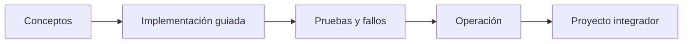

# Parte 12 — Arquitectura cloud-native y sistemas distribuidos

> [← Parte 11](../part-11-security-governance-finops/README.md) · [Índice completo](../README.md) · [Parte 13 →](../part-13-multicloud-hybrid-disaster-recovery/README.md)

**Nivel:** avanzado-experto · **Clases:** 12 · **Duración sugerida:** 6–8 semanas

Tomar decisiones de arquitectura con compensaciones explícitas y evidencia.

## Resultados de la parte

Al completar esta parte podrás explicar el dominio con lenguaje independiente del proveedor,
implementar sus mecanismos esenciales, diagnosticar fallos y defender decisiones mediante
evidencia, costo, seguridad y objetivos de confiabilidad.

## Modelo mental

Una arquitectura es un conjunto de decisiones costosas de cambiar; su calidad se juzga contra escenarios concretos, no por la cantidad de servicios usados.

## Secuencia

## Clases

| ID | Clase | Laboratorio | Horas |
|---:|---|---|---:|
| 145 | [Requisitos, restricciones y atributos de calidad](145-requisitos-restricciones-y-atributos-de-calidad/README.md) | `architecture` | 4 |
| 146 | [Twelve-Factor App y configuración cloud-native](146-twelve-factor-app-y-configuracion-cloud-native/README.md) | `architecture` | 4 |
| 147 | [DDD, bounded contexts y ownership de datos](147-ddd-bounded-contexts-y-ownership-de-datos/README.md) | `architecture` | 4 |
| 148 | [Monolito modular, microservicios y función](148-monolito-modular-microservicios-y-funcion/README.md) | `decision` | 4 |
| 149 | [CAP, PACELC y consistencia por operación](149-cap-pacelc-y-consistencia-por-operacion/README.md) | `distributed` | 4 |
| 150 | [Replicación, particionado y consenso](150-replicacion-particionado-y-consenso/README.md) | `distributed` | 4 |
| 151 | [Fallos parciales y patrones de resiliencia](151-fallos-parciales-y-patrones-de-resiliencia/README.md) | `reliability` | 4 |
| 152 | [Service discovery, malla y comunicación](152-service-discovery-malla-y-comunicacion/README.md) | `network` | 4 |
| 153 | [Contratos API, compatibilidad y evolución](153-contratos-api-compatibilidad-y-evolucion/README.md) | `api` | 4 |
| 154 | [Multi-tenancy, aislamiento y noisy neighbor](154-multi-tenancy-aislamiento-y-noisy-neighbor/README.md) | `architecture` | 4 |
| 155 | [Rendimiento, costo, seguridad y operabilidad](155-rendimiento-costo-seguridad-y-operabilidad/README.md) | `decision` | 4 |
| 156 | [Proyecto: revisión de arquitectura con ADR](156-proyecto-revision-de-arquitectura-con-adr/README.md) | `capstone` | 8 |

## Evaluación de la parte

- 35 % laboratorios y evidencia reproducible.
- 25 % retos verificables.
- 20 % decisiones y ADR.
- 10 % seguridad, confiabilidad y costo.
- 10 % proyecto integrador de la parte.

Se aprueba con 80 % de clases en nivel B o superior y el proyecto integrador reproducible.

## Pauta bibliográfica

- Cloud Native Patterns — Cornelia Davis.
- Building Microservices — Sam Newman.
- Release It! — Michael Nygard.
- Designing Data-Intensive Applications — Martin Kleppmann.
