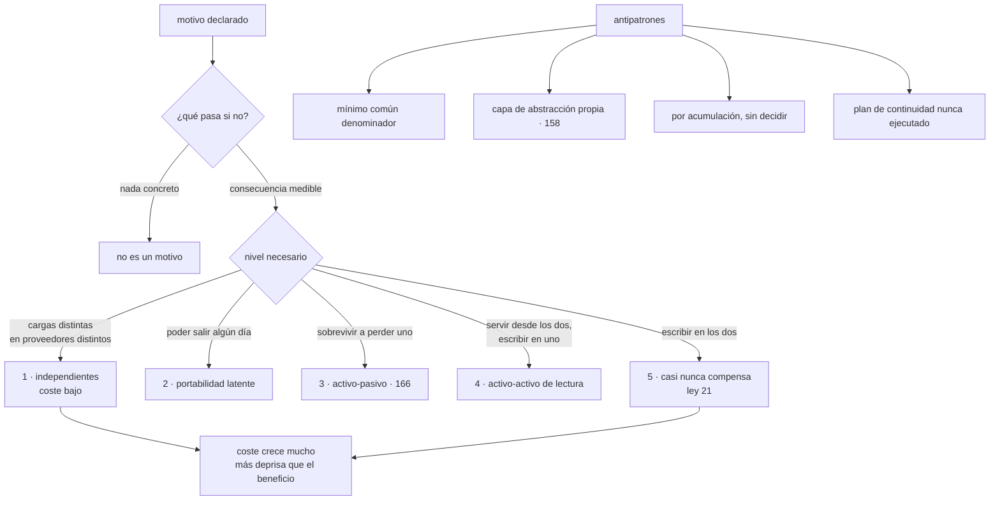

# 157 — Motivaciones y anti-patrones de multi-cloud

> [← 156 · Proyecto: revisión de arquitectura con ADR](../../part-12-cloud-native-distributed-architecture/156-proyecto-revision-de-arquitectura-con-adr/README.md) · [Índice de la parte](../README.md) · [158 · Portabilidad, capas de abstracción y lock-in →](../../part-13-multicloud-hybrid-disaster-recovery/158-portabilidad-capas-de-abstraccion-y-lock-in/README.md)

**Parte:** 13 — Multi-cloud, híbrido, migración y recuperación<br>
**Nivel:** experto · **Horas estimadas:** 4<br>
**Laboratorio:** `decision` · **Estado:** `EXECUTABLE_CORE`

## 🎯 Propósito

Decidir si hay que usar varios proveedores y para qué, sometiendo cada motivo declarado a la pregunta de la clase 145: **¿qué pasa si no?**. La clase sostiene que el motivo más citado —evitar la dependencia de un proveedor— es el más débil, que el que más justifica es el que menos se menciona, y que la discusión mejora enormemente al dejar de hablar de «multi-nube» y empezar a hablar de **cinco niveles distintos**, cuyo coste crece muchísimo más deprisa que su beneficio.

## 📚 Resultados de aprendizaje

Al finalizar podrás:

1. **Interrogar** cada motivo hasta saber qué se pierde si no se hace.
2. **Distinguir** dependencia del proveedor de coste de salida, y medir el segundo.
3. **Elegir** el nivel de multi-nube en vez de discutir el concepto.
4. **Enumerar** lo que cuesta cada nivel, incluido lo que casi nadie cuenta.
5. **Reconocer** los cuatro antipatrones, empezando por el mínimo común denominador.

## 🧩 Conceptos centrales

| Concepto | Comprensión verificable |
|---|---|
| `coste de salida` | Lo que costaría dejar un proveedor: tiempo, dinero y riesgo. Es la magnitud útil; «dependencia» no se puede medir. |
| `nivel de multi-nube` | Grado concreto: cargas independientes, portabilidad latente, activo-pasivo, activo-activo de lectura o de escritura. |
| `mínimo común denominador` | Usar solo lo que existe en todos los proveedores. Se paga el precio de varios y se obtiene el peor de todos. |
| `multi-nube por acumulación` | Estar en varios proveedores sin haberlo decidido, por adquisiciones o por elección de cada equipo. |
| `capacidad exclusiva` | Servicio que solo ofrece un proveedor y que aporta una ventaja real. Es uno de los pocos motivos que resisten. |
| `portabilidad latente` | Poder salir sin estar fuera: la carga se puede desplegar en otro proveedor, pero solo corre en uno. |

## 🧠 Modelo mental

Multi-cloud es una decisión de negocio y riesgo; duplicar cada componente entre proveedores rara vez es la forma más confiable o económica de lograrla.

Aplicado a esta clase, separa siempre cuatro planos: **intención** (qué necesita el usuario),
**configuración** (qué declaramos), **estado observado** (qué existe de verdad) y
**evidencia** (cómo sabemos que cumple). Confundirlos produce diseños que se ven correctos
en un diagrama pero fallan al operar.

## 🗺️ Flujo de razonamiento



## 📖 Desarrollo

### 1. Interrogar los motivos

Los ocho motivos que se declaran en la práctica, sometidos a la pregunta de la clase 145:

```text
1. «EVITAR LA DEPENDENCIA DE UN PROVEEDOR»
   el más citado y el más débil
   ¿qué pasa si no?   nada, hasta que haya que salir
   coste de hacerlo   se paga TODOS LOS DÍAS
   coste de no hacerlo  se paga UNA VEZ, si llega el caso
   → y casi siempre la comparación no se hace

2. «SOBREVIVIR A LA CAÍDA DE UN PROVEEDOR»
   suena fuerte y no resiste la aritmética: ver apartado segundo

3. «TENER FUERZA EN LA NEGOCIACIÓN»
   real, y es un motivo comercial, no técnico
   → y solo funciona si la portabilidad es CREÍBLE, que es cara

4. NORMATIVA O SOBERANÍA
   un cliente o una norma exigen que ciertos datos estén en un sitio
   ¿qué pasa si no?   no se puede operar, o no se firma el contrato
   → es el motivo más sólido de la lista            clase 141

5. CAPACIDAD QUE SOLO TIENE UN PROVEEDOR
   un servicio concreto que aporta ventaja real
   ¿qué pasa si no?   se construye a mano y cuesta más
   → sólido, y suele resolverse en el nivel 1

6. EXIGENCIA DE UN CLIENTE
   «nuestros datos, en este proveedor»
   → sólido, y es una decisión comercial

7. ADQUISICIONES O HISTORIA
   ya se está en dos proveedores porque se compró una empresa
   → no es un motivo: es un HECHO, y hay que decidir qué hacer con él

8. LATENCIA O CERCANÍA A LOS DATOS
   los clientes o los datos están donde uno de ellos está mejor
   → sólido cuando hay cifras de latencia detrás
```

Y el recuento honesto:

```text
motivos que resisten la pregunta          4, 5, 6 y 8
motivos que no                            1 y 2
motivo comercial, no técnico              3
no es un motivo                           7
```

Y la observación incómoda: **el más citado es el que menos resiste, y el que más resiste —la normativa— rara vez aparece en la primera conversación**.

**Sobre la dependencia**, que merece reformularse:

```text
«dependencia» no se puede medir; «coste de salida» sí

coste de salida de un servicio de cómputo         semanas
coste de salida de una base gestionada            meses
coste de salida de un servicio propietario
  de datos o de aprendizaje                       trimestres
coste de salida de la identidad y la red          el mayor de todos
```

Y con esa tabla la conversación cambia:

```text
no es «¿estamos atados?»
es «¿cuánto costaría salir, y es proporcionado a lo que ganamos
   estando aquí?»
→ y si la respuesta es que sí, la dependencia es una decisión,
  no un accidente
```

### 2. La aritmética de la disponibilidad

El segundo motivo merece su propio apartado porque suena convincente y casi siempre es falso.

La comparación correcta **no** es «un proveedor frente a dos», sino:

```text
dos regiones del mismo proveedor    frente a    dos proveedores
```

Y los datos que hay que poner encima de la mesa:

```text
fallos que afectan a UNA región                    frecuentes
fallos que afectan a UN proveedor ENTERO           muy raros
fallos que afectan a un servicio concreto
  en varias regiones                               ocurren
```

Y el coste de cada opción:

```text
DOS REGIONES, UN PROVEEDOR
  identidad, red y herramientas comunes
  replicación gestionada por el propio proveedor
  un solo conjunto de conocimientos y de guardia

DOS PROVEEDORES
  identidad federada entre ellos                     clase 159
  conectividad y resolución de nombres entre ellos   clase 160
  replicación propia, y su coste de salida de datos  clase 161
  observabilidad unificada                           clase 162
  infraestructura declarada con dos proveedores      clase 163
  dos conjuntos de conocimientos y dos guardias
  y el mínimo común denominador                      apartado cuarto
```

Y el efecto que casi nadie cuenta:

```text
un sistema repartido entre dos proveedores tiene MÁS modos de fallo
que uno bien hecho en dos regiones de uno
→ la conectividad entre nubes, la federación de identidad y la
  replicación propia son componentes nuevos que pueden fallar
→ y suelen fallar más que el proveedor entero
```

Y la conclusión práctica, que hay que decir sin rodeos:

```text
si el objetivo es disponibilidad, casi siempre se consigue antes,
mejor y más barato con dos regiones del mismo proveedor

el multi-nube por disponibilidad se justifica cuando
  una norma exige no depender de un solo proveedor, o
  el contrato con un cliente lo exige
→ es decir, vuelve a ser el motivo 4 o el 6, no el 2
```

Y el caso que sí conviene tener cubierto, y es distinto:

```text
el proveedor deja de prestar el servicio, sube el precio de forma
inaceptable o hay un conflicto contractual
→ eso no se resuelve con activo-activo: se resuelve con
  PORTABILIDAD LATENTE y con un coste de salida conocido
```

### 3. Cinco niveles, no un concepto

La discusión mejora al dejar de hablar de «multi-nube» y hablar de niveles concretos:

```text
NIVEL 1 · CARGAS INDEPENDIENTES
  cada carga vive entera en un proveedor, elegido por su motivo
  el análisis en uno, la tienda en otro, el correo en un tercero
  + coste marginal bajo; no hace falta portabilidad
  + resuelve los motivos 4, 5, 6 y 8
  − hace falta identidad y observabilidad comunes

NIVEL 2 · PORTABILIDAD LATENTE
  la carga PODRÍA desplegarse en otro; solo corre en uno
  + acota el coste de salida sin pagarlo a diario
  − exige disciplina: evitar servicios propietarios en el camino crítico
  − y la portabilidad no probada no existe

NIVEL 3 · ACTIVO-PASIVO
  copia en frío o en caliente en el otro proveedor         clase 166
  + sobrevive a perder uno, con un plazo declarado
  − replicación continua, coste de salida de datos y ensayos

NIVEL 4 · ACTIVO-ACTIVO DE LECTURA
  se sirve desde los dos; se escribe solo en uno
  + latencia y tolerancia mejores
  − todo lo del nivel 3, más el enrutado y la coherencia de lectura

NIVEL 5 · ACTIVO-ACTIVO DE ESCRITURA
  se escribe en los dos
  − conflictos garantizados                                clase 149
  − y el dato tiene dos escritores                         ley 21
  → casi nunca compensa; ver el apartado siguiente
```

Y la relación entre coste y beneficio:

```text
nivel     coste relativo    lo que aporta de más
  1            1×           casi todo lo que la gente quiere
  2          1,2×           capacidad de salir
  3          2-3×           sobrevivir a perder un proveedor
  4          3-4×           latencia y tolerancia
  5          5-8×           escritura en los dos lados
```

Y el hallazgo que ordena la parte: **la mayoría de los motivos legítimos se resuelven en el nivel 1**, que es el más barato y el que casi nadie llama multi-nube.

Y sobre el nivel 5, la conclusión que esta parte va a sostener:

```text
escribir en dos proveedores a la vez significa que un dato
tiene dos escritores
→ conflictos, resolución de conflictos y todo lo de la clase 149
→ y la latencia entre nubes hace inviable coordinar

compensa solo cuando
  los datos se pueden PARTIR por región o por cliente, de modo que
  cada dato tenga un solo escritor aunque el sistema esté en los dos
→ y entonces no es activo-activo de escritura: es nivel 1 partido
```

### 4. Los cuatro antipatrones

```text
1. MÍNIMO COMÚN DENOMINADOR
   usar solo lo que existe en todos los proveedores
   → nada de bases gestionadas específicas, nada de servicios
     propietarios, nada de lo que hace barato usar una nube
   → se paga el precio de varios proveedores y se obtiene el peor
     de todos
   → y el equipo acaba operando a mano lo que estaba resuelto

2. LA CAPA DE ABSTRACCIÓN PROPIA
   una biblioteca interna que oculta las diferencias
   → acaba siendo un producto que hay que mantener
   → con menos funciones que cualquiera de los originales
   → y una dependencia nueva de la que sí es difícil salir
   → es la materia de la clase 158

3. MULTI-NUBE POR ACUMULACIÓN
   se está en tres proveedores porque cada equipo eligió el suyo
   o porque se compró una empresa
   → se pagan todos los costes y no se obtiene ningún beneficio,
     porque nada es portable ni redundante
   → es lo más común en la práctica

4. EL PLAN DE CONTINUIDAD QUE NUNCA SE HA EJECUTADO
   existe un segundo proveedor «por si acaso»
   → nunca se ha conmutado, nadie sabe cuánto tarda y el procedimiento
     está desactualizado
   → ley 13: lo que no se ejecuta no da ningún error
   → y en el momento de usarlo, no funciona
```

Y el tercero merece una precisión, porque suele ser el punto de partida real:

```text
estar en varios proveedores sin haberlo decidido NO es un fracaso:
es una situación
→ lo que hay que decidir es qué se hace con ella
   consolidar en uno, o
   declarar el nivel 1 y ordenar identidad y observabilidad
→ lo que no vale es dejarlo sin decidir y llamarlo estrategia
```

Y el método completo de esta clase, en cinco pasos:

```text
1. escribir el motivo, con nombre y quién lo sostiene
2. preguntarle «¿qué pasa si no?» y anotar la consecuencia medible
3. si no hay consecuencia, retirar el motivo
4. para los que quedan, elegir el NIVEL mínimo que los satisface
5. medir el coste de salida actual y decidir si es proporcionado
```

Y las cifras que conviene tener antes de decidir:

```text
qué proporción del gasto está en cada proveedor
qué servicios propietarios se usan en el camino crítico
qué costaría, en semanas, mover cada carga
cuánto costaría la salida de datos de mover el histórico   clase 161
y cuántas personas saben operar cada proveedor
```

La última suele ser la que decide: **con un equipo pequeño, dos proveedores significan que la mitad de la gente no puede intervenir en la mitad del sistema**.

Y la lista de comprobación de la clase:

```text
☐ cada motivo está escrito, con quién lo sostiene
☐ cada motivo ha pasado por «¿qué pasa si no?»
☐ los que no tienen consecuencia medible se han retirado
☐ se ha comparado dos regiones frente a dos proveedores, con cifras
☐ está elegido el NIVEL, no el concepto
☐ el nivel elegido es el mínimo que satisface los motivos
☐ el coste de salida está estimado por carga, en semanas
☐ no se está usando el mínimo común denominador sin decidirlo
☐ no se ha construido una capa de abstracción propia
☐ si hay plan de continuidad, se ha ejecutado alguna vez
☐ está contado cuántas personas saben operar cada proveedor
```

Y el cierre que enlaza con la clase siguiente: el motivo más citado se apoya en una idea que conviene examinar despacio —que la portabilidad se consigue con una capa de abstracción—. Qué es portable de verdad, qué cuesta serlo y por qué la abstracción propia suele ser peor que la dependencia que evita es la materia de la clase 158.

## 🔬 Ejemplo trabajado

**La dirección de CloudShop pide «una estrategia multi-nube» tras una caída de su proveedor. El ejercicio consiste en escribir los motivos y someterlos a la pregunta. De ocho, sobreviven tres, y ninguno es el que originó la petición.**

**Los ocho motivos, tal como se declararon.**

```text
1. «no queremos depender de un solo proveedor»          dirección
2. «que una caída del proveedor no nos pare»            dirección
3. «para negociar mejor el contrato»                    finanzas
4. «tres clientes exigen datos en su región»            comercial
5. «el servicio de análisis del otro es mejor»          datos
6. «un cliente exige otro proveedor»                    comercial
7. «heredamos una cuenta de la empresa que compramos»   hecho
8. «latencia para los clientes de otra zona»            producto
```

**La interrogación.**

```text
MOTIVO 2, el que originó todo
  ¿qué pasa si no?   la caída que lo motivó duró 41 min y afectó
                     a UNA REGIÓN, no al proveedor
  ¿se resolvía con multi-nube?   no: con una segunda región
  coste de la segunda región                       +2.900 €/mes
  coste del nivel 3 entre proveedores              +11.400 €/mes
  → RETIRADO como motivo de multi-nube; se abre un trabajo
    de segunda región

MOTIVO 1
  ¿qué pasa si no?   «estaríamos atados»
  reformulado como coste de salida:
    cómputo y contenedores                    3-4 semanas
    bases gestionadas                         3-4 meses
    servicio de análisis propietario          6+ meses
    identidad y red                           el mayor
  ¿es proporcionado a lo que ganamos?   sí, para todo salvo el análisis
  → RETIRADO como motivo general; queda una acción concreta:
    acotar el coste de salida del análisis

MOTIVO 3
  ¿qué pasa si no?   se negocia peor
  ¿cuánto?           el descuento actual es del 34 %; el equipo de
                     compras estima 3-5 puntos más con alternativa creíble
  coste de la alternativa creíble (nivel 2)        +1.800 €/mes
  beneficio estimado                               ~700 €/mes
  → NO COMPENSA con el gasto actual; se revisa si el gasto se dobla

MOTIVOS 4 y 6
  ¿qué pasa si no?   no se firman tres contratos, y uno se pierde
  valor de esos contratos                          ~240.000 €/año
  → SOBREVIVEN                                     clase 141

MOTIVO 5
  ¿qué pasa si no?   se construye a mano; estimación 4 meses de dos
                     personas y peor resultado
  → SOBREVIVE

MOTIVO 7
  no es un motivo: es una cuenta con 6 servicios heredados
  → decisión aparte: consolidar o declarar nivel 1

MOTIVO 8
  ¿qué pasa si no?   latencia de 240 ms para el 4 % de los clientes
  ¿lo resuelve otro proveedor?   no: lo resuelve una región del mismo
  → RETIRADO; se abre un trabajo de región adicional
```

**El recuento.**

```text
motivos declarados                                            8
sobreviven a la pregunta                                      3   (4, 5, 6)
retirados por no tener consecuencia medible                   2   (1, 8)
retirados porque se resuelven mejor de otra forma             1   (2)
no compensa con los números actuales                          1   (3)
no era un motivo                                              1   (7)
```

**Tres de ocho.** Y el que originó la petición —sobrevivir a una caída— resultó ser un problema de regiones, no de proveedores.

**El nivel elegido.**

Los tres motivos supervivientes se satisfacen todos en el nivel 1:

```text
motivo 4   los datos de tres clientes en su región del otro proveedor
           → una carga independiente allí
motivo 5   el análisis en el otro proveedor
           → una carga independiente allí
motivo 6   un cliente entero servido desde el otro proveedor
           → una celda independiente allí               clase 151

nivel elegido                                          1
nivel que la propuesta inicial pedía                   4
diferencia de coste estimada                    11.400 €/mes
```

Y lo que sí hubo que construir aunque el nivel sea el más barato:

```text
identidad federada entre los dos                       clase 159
observabilidad unificada                               clase 162
infraestructura declarada con dos proveedores          clase 163
y nada de red entre nubes: las cargas son independientes  clase 160
```

La última línea es la que abarata el nivel 1: **si las cargas no se hablan, no hace falta conectarlas**.

**La cuenta heredada, decidida.**

```text
servicios heredados en el tercer proveedor                     6
  2 los usa un cliente que sigue activo    → se mantienen, nivel 1
  3 no los usa nadie desde hace 14 meses   → se apagan  ley 20
  1 es una base con datos históricos       → se migra al lago

coste mensual antes                                     1.900 €
coste mensual después                                     310 €
cuentas activas                                             3 → 2
```

**Los antipatrones, revisados.**

```text
MÍNIMO COMÚN DENOMINADOR
  la propuesta inicial incluía «usar solo Kubernetes y PostgreSQL
  en ambos, sin servicios gestionados específicos»
  coste estimado de operar bases no gestionadas    2 personas a tiempo
                                                   parcial, permanente
  → descartado: con nivel 1 no hace falta

CAPA DE ABSTRACCIÓN PROPIA
  se propuso una biblioteca interna para el almacenamiento de objetos
  → descartada; ver clase 158

POR ACUMULACIÓN
  era la situación real: tres proveedores sin decisión
  → resuelta arriba

PLAN NUNCA EJECUTADO
  existía un documento de continuidad de 2023
  ¿se ha ejecutado alguna vez?                    no
  ¿alguien sabe cuánto tardaría?                  no
  → se convierte en el trabajo de las clases 166 y 168
```

**Las cifras que decidieron.**

```text
gasto por proveedor        principal 94 % · segundo 4 % · tercero 2 %
servicios propietarios en el camino crítico                     2
coste de salida de la carga principal, estimado           6 semanas
coste de salida del análisis                              6 meses
personas que saben operar el proveedor principal               9
personas que saben operar el segundo                           2
```

Y la última fila fue la que más pesó en la decisión del nivel:

```text
con 2 personas capaces de operar el segundo proveedor,
un nivel 3 o 4 significaría que 7 de 9 no pueden intervenir
en la mitad del sistema durante un incidente
→ y eso empeora la disponibilidad, que era el motivo original
```

**A los doce meses.**

```text                                          antes         después
proveedores                                      3              2
proveedores decididos a propósito                 0              2
motivos escritos e interrogados                   0              8
motivos vivos                                     —              3
nivel de multi-nube                          sin decidir         1
cargas en el segundo proveedor                    1              3
conectividad entre nubes                    no había      sigue sin haber
coste del tercer proveedor                   1.900 €          0 €
personas capaces de operar el segundo             2              5
coste de salida documentado por carga            no             sí
plan de continuidad ejecutado alguna vez         no      pendiente (clase 168)
```

**La lección que esta clase abre para la parte 13**: de ocho motivos declarados, **tres sobrevivieron a la pregunta**, y el que puso en marcha toda la conversación —sobrevivir a una caída del proveedor— resultó ser un problema de regiones que costaba cuatro veces menos resolver dentro del mismo proveedor. Y la cifra que más pesó no fue ninguna de coste: fue que **solo dos personas de nueve sabían operar el segundo proveedor**, lo que convertía cualquier nivel avanzado en una amenaza para la disponibilidad que se quería mejorar.

## 🧪 Laboratorio guiado

Ejecuta desde la raíz:

```bash
python classes/part-13-multicloud-hybrid-disaster-recovery/157-motivaciones-y-anti-patrones-de-multi-cloud/lab.py
```

El laboratorio selecciona el motor de práctica **`decision`** y produce
`lab_result.json`. El escenario, sus comprobaciones y el artefacto esperado corresponden a
esta clase; no requiere credenciales y deja explícito qué debe revalidarse en un sandbox real.

1. Lee `exercise.steps` y formula una predicción antes de ejecutar.
2. Ejecuta la práctica y verifica todos los elementos de `checks`.
3. Provoca el caso de `negative_test` y explica la señal observada.
4. Materializa `decision-multicloud` en `evidence/` usando la plantilla indicada.
5. Para proveedor real, sigue `sandbox.requires`, registra costo y ejecuta `destroy`.

### Evidencia esperada

El artefacto principal es una matriz de decisión ponderada y un ADR. Además, la entrega debe incluir el comando ejecutado,
la salida estructurada y una conclusión que no exceda lo observado.

## 🏆 Reto verificable

Construye **`decision-multicloud`** para el caso CloudShop. Incluye una alternativa descartada,
un supuesto que pueda falsarse, una prueba de fallo y una decisión de rollback.

## ✅ Criterio de aceptación

- [ ] `lab.py` termina con código 0 y genera JSON válido.
- [ ] La entrega conecta al menos tres requisitos con mecanismos verificables.
- [ ] Existe una prueba positiva y una prueba negativa con evidencia.
- [ ] Seguridad, costo y operación aparecen como decisiones, no como anexos.
- [ ] Se declara una limitación y una condición que obligaría a revisar el diseño.
- [ ] Otra persona puede repetir el recorrido sin conocimiento tácito.

## ⚠️ Errores frecuentes

| Síntoma | Causa probable | Corrección |
|---|---|---|
| Se decide usar varios proveedores sin poder explicar qué se pierde si no | El motivo es un adjetivo, no una consecuencia medible | Aplica la pregunta de la clase 145 a cada motivo y retira los que no tengan consecuencia con cifra. |
| Se busca disponibilidad con dos proveedores y el sistema falla más | Se comparó un proveedor con dos, en vez de dos regiones con dos proveedores; y se añadieron componentes nuevos que fallan | Haz la comparación correcta con las frecuencias reales de fallo y elige regiones salvo que una norma o un contrato exijan otra cosa. |
| Se pagan varios proveedores y se usa lo peor de todos | Mínimo común denominador: solo lo que existe en todos | Usa servicios gestionados específicos en el nivel 1 y acota el coste de salida en vez de renunciar a ellos. |
| Se está en tres proveedores y no se obtiene ninguna ventaja | Multi-nube por acumulación, sin decisión | Decide: consolidar o declarar nivel 1 con identidad y observabilidad comunes; lo que no vale es dejarlo sin decidir. |
| Existe un segundo proveedor por si acaso y nadie sabe si funcionaría | Ley 13: el plan nunca se ha ejecutado | Ejecuta una conmutación real y mide; sin eso, el plan no existe. |
| La discusión sobre multi-nube no avanza | Se discute el concepto en vez del nivel concreto | Elige entre los cinco niveles el mínimo que satisface los motivos supervivientes. |

## 🛡️ Seguridad, ética y costo

Trabaja con cuentas propias o sandboxes autorizados. No publiques secretos, identificadores
reales ni datos personales. Antes de crear recursos pagos define presupuesto, etiquetas y
comando de destrucción; después verifica que no queden recursos huérfanos. Los ejemplos
locales enseñan contratos, pero no certifican cumplimiento ni disponibilidad de producción.

## ❓ Preguntas de comprobación

1. ¿Cuál es el motivo más citado y por qué es el más débil?
2. ¿Cuál es la comparación correcta cuando el objetivo es disponibilidad?
3. ¿Cuáles son los cinco niveles y cuál resuelve la mayoría de los motivos legítimos?
4. ¿Por qué el mínimo común denominador cuesta más y da menos?
5. ¿Qué magnitud sustituye a la palabra dependencia y cómo se mide?

## 🔗 Referencias

- Gartner (2025). *Multicloud strategies: motivations and pitfalls* — motivos declarados frente a resultados. <https://www.gartner.com/en/information-technology>
- Google Cloud (2025). *Multicloud and hybrid architecture patterns* — niveles concretos y su coste. <https://cloud.google.com/architecture/hybrid-multicloud-patterns>
- AWS (2025). *Multi-Region fundamentals* — comparación entre regiones y proveedores para disponibilidad. <https://docs.aws.amazon.com/whitepapers/latest/aws-multi-region-fundamentals/>
- Fowler, M. (2025). *Exit cost over lock-in* — sustituir dependencia por coste de salida medible. <https://martinfowler.com/bliki/>
- CNCF (2025). *Multicloud interoperability* — qué es común entre proveedores y qué no. <https://www.cncf.io/reports/>
- Documentación oficial vigente del servicio implementado; registra URL y fecha de consulta.

---

> [Evaluación](assessment.md) · [Contrato de clase](lesson.yaml) · [Índice de la parte](../README.md)

| Anterior | Índice | Siguiente |
|---|---|---|
| [← 156 · Proyecto: revisión de arquitectura con ADR](../../part-12-cloud-native-distributed-architecture/156-proyecto-revision-de-arquitectura-con-adr/README.md) | [Parte 13](../README.md) · [Programa](../../README.md) | [158 · Portabilidad, capas de abstracción y lock-in →](../../part-13-multicloud-hybrid-disaster-recovery/158-portabilidad-capas-de-abstraccion-y-lock-in/README.md) |
