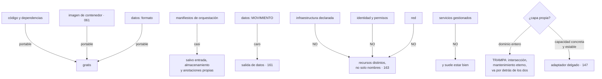

# 158 — Portabilidad, capas de abstracción y lock-in

> [← Clase anterior](../../part-13-multicloud-hybrid-disaster-recovery/157-motivaciones-y-anti-patrones-de-multi-cloud/README.md) · [Índice de la parte](../README.md) · [Clase siguiente →](../../part-13-multicloud-hybrid-disaster-recovery/159-federacion-de-identidad-entre-nubes/README.md)

**Parte:** 13 — Multi-cloud, híbrido, migración y recuperación<br>
**Nivel:** experto · **Horas estimadas:** 4<br>
**Laboratorio:** `architecture` · **Estado:** `EXECUTABLE_CORE`

## 🎯 Propósito

Examinar la idea en la que se apoya el motivo más citado de la clase anterior: que la portabilidad se consigue construyendo una capa que oculte las diferencias. La clase separa **qué es portable de verdad y qué no**, capa por capa, muestra por qué la abstracción propia suele acabar siendo una dependencia peor que la que evitaba, y propone la alternativa que sí funciona: **usar las interfaces que ya son estándar, empujar lo específico al borde y conocer el coste de salida en semanas** en vez de intentar anularlo.

## 📚 Resultados de aprendizaje

Al finalizar podrás:

1. **Situar** cada capa del sistema por su portabilidad real.
2. **Reconocer** cuándo una capa de abstracción propia es una trampa y cuándo un adaptador es correcto.
3. **Aprovechar** las interfaces que ya son comunes, que dan portabilidad gratis.
4. **Medir** el coste de salida por carga, en semanas y en euros.
5. **Comprobar** la portabilidad periódicamente, porque la que no se prueba no existe.

## 🧩 Conceptos centrales

| Concepto | Comprensión verificable |
|---|---|
| `portabilidad` | Capacidad de ejecutar lo mismo en otro proveedor con un esfuerzo acotado. No es binaria: se mide por capas y en semanas. |
| `interfaz común` | Especificación que varios proveedores implementan. Da portabilidad sin construir nada. |
| `capa de abstracción propia` | Biblioteca interna que oculta las diferencias entre proveedores. Suele exponer la intersección de funciones y hay que mantenerla siempre. |
| `adaptador delgado` | Traducción de una capacidad concreta y estable en la frontera. Es correcto; la abstracción de un dominio entero no. |
| `coste de salida` | Semanas de trabajo y euros de movimiento de datos para dejar un proveedor. Se estima por carga y se actualiza cada año. |
| `prueba de portabilidad` | Construir y arrancar en el segundo proveedor de forma periódica, aunque no se sirva tráfico desde allí. |

## 🧠 Modelo mental

Multi-cloud es una decisión de negocio y riesgo; duplicar cada componente entre proveedores rara vez es la forma más confiable o económica de lograrla.

Aplicado a esta clase, separa siempre cuatro planos: **intención** (qué necesita el usuario),
**configuración** (qué declaramos), **estado observado** (qué existe de verdad) y
**evidencia** (cómo sabemos que cumple). Confundirlos produce diseños que se ven correctos
en un diagrama pero fallan al operar.

## 🗺️ Flujo de razonamiento



## 📖 Desarrollo

### 1. Qué es portable, capa por capa

La portabilidad no es una propiedad del sistema: **es distinta en cada capa**, y el coste de salida vive en las de abajo.

```text
CÓDIGO Y DEPENDENCIAS                    portable
  salvo bibliotecas propietarias del proveedor

IMAGEN DE CONTENEDOR                     portable                clase 061
  la especificación es común; se ejecuta en cualquier sitio

MANIFIESTOS DE ORQUESTACIÓN              casi portable
  la API es común y hay diferencias reales:
    entrada y balanceo, con anotaciones propias
    clases de almacenamiento
    integración con la identidad del proveedor
    autoescalado de nodos

FORMATO DE LOS DATOS                     portable                clase 112
  columnar, JSON, SQL estándar

MOVIMIENTO DE LOS DATOS                  caro                    clase 161
  el formato es portable y mover cien teratabytes cuesta dinero
  y tiempo

INFRAESTRUCTURA DECLARADA                NO portable             clase 163
  no son nombres distintos: son recursos con modelos distintos

IDENTIDAD Y PERMISOS                     NO portable             clase 159
  los modelos de permisos no se corresponden entre sí

RED                                      NO portable             clase 160

SERVICIOS GESTIONADOS                    NO portable
  colas, bases, aprendizaje, análisis
  → y renunciar a ellos cuesta más de lo que la portabilidad vale
```

Y la lectura de la tabla:

```text
las capas de arriba son portables y NADIE se preocupa por ellas
las de abajo no lo son y son donde está el coste de salida
→ y una capa de abstracción propia solo actúa sobre las de en medio
```

Y una precisión sobre los manifiestos, que es donde más gente se lleva sorpresas:

```text
«es Kubernetes, es portable»
  el 80-90 % de los manifiestos, sí
  el resto son las cuatro diferencias de arriba
  → y ese resto es exactamente lo que conecta la carga con el proveedor
```

Y sobre los servicios gestionados, la posición honesta de este programa:

```text
renunciar a ellos para ser portable significa
  operar bases, colas y almacenes a mano                partes 09 y 10
  con un equipo que ya tiene su trabajo
→ el coste diario supera casi siempre al coste de salida ocasional
→ la respuesta correcta no es renunciar: es SABER lo que costaría salir
```

### 2. La trampa de la capa propia

La propuesta aparece siempre: **una biblioteca interna que oculte las diferencias** entre proveedores.

Y falla por cinco motivos que se repiten:

```text
1. EXPONE LA INTERSECCIÓN
   solo puede ofrecer lo que existe en todos
   → es el mínimo común denominador de la clase 157, en código

2. HAY QUE MANTENERLA SIEMPRE
   los proveedores publican funciones nuevas cada semana
   → y cada una exige decidir si se expone y cómo
   → sin comunidad que lo haga por ti

3. VA POR DETRÁS DE LOS DOS
   quien la usa no puede aprovechar lo nuevo hasta que se añada

4. LA DEPURACIÓN PASA POR ELLA
   un error del proveedor llega envuelto en tu abstracción
   → y la documentación del proveedor deja de aplicar

5. ES UNA DEPENDENCIA DE LA QUE SÍ ES DIFÍCIL SALIR
   nadie más la conoce, no hay quien la mantenga si el autor se va
   → se evitó depender de un proveedor con miles de ingenieros
     y se depende de una biblioteca con uno
```

Y la excepción legítima, que conviene distinguir con precisión:

```text
ADAPTADOR DELGADO, correcto
  una capacidad concreta, estable y pequeña
  «guardar y leer un objeto», «publicar un mensaje»
  con la interfaz de TU dominio, no la del proveedor
  → es la capa de traducción de la clase 147
  → cabe en una página y no crece

ABSTRACCIÓN DE UN DOMINIO ENTERO, trampa
  «una API común para cualquier base de datos»
  «un modelo unificado de identidad»
  → crece sin fin y expone la intersección
```

Y la prueba práctica para distinguirlas:

```text
¿cuántos métodos tiene?
  menos de diez y estables      → adaptador
  decenas y creciendo           → abstracción

¿qué pasa cuando el proveedor añade algo útil?
  no me afecta, no lo uso       → adaptador
  tengo que exponerlo           → abstracción

¿podría reescribirla en dos días si hiciera falta?
  sí                            → adaptador
```

Y una forma sana de conseguir el efecto sin la trampa, que es la de la clase 147:

```text
el núcleo del sistema define lo que NECESITA
  «necesito guardar un documento y recuperarlo por su identificador»
y hay una implementación por proveedor, cada una usando lo suyo
  a fondo, sin limitarse a la intersección
→ el núcleo no conoce a ningún proveedor
→ y cada implementación puede usar lo mejor de cada uno
```

La diferencia con la abstracción es sutil y decisiva: **la interfaz la dicta tu dominio, no el mínimo común de los proveedores**.

### 3. Portabilidad que sale gratis

Hay interfaces que varios proveedores implementan, y usarlas da portabilidad **sin construir nada**:

```text
imágenes de contenedor                    especificación común
API de orquestación                       común, con las salvedades ya dichas
SQL estándar                              en lo que no sean extensiones
protocolo de almacenamiento de objetos    implementado por varios
telemetría                                formato común              clase 124
identidad basada en testigos estándar     clase 159
colas con protocolos abiertos             según el caso
formatos de datos columnares              clase 112
```

Y dos advertencias importantes sobre esta lista:

```text
«compatible con» no es «igual que»
  una implementación compatible del protocolo de objetos suele
  cubrir las operaciones básicas y no el control de acceso,
  las políticas de ciclo de vida ni la consistencia fina

y lo que rompe es siempre lo mismo
  el comportamiento en los bordes: errores, límites, consistencia
  → la clase 153 ya lo dijo: el contrato es más que la forma
```

Y las tres prácticas que dan portabilidad real sin capa propia:

```text
1. LO ESPECÍFICO, EN EL BORDE
   el núcleo no menciona a ningún proveedor
   → clase 147, aplicada al proveedor en vez de a un tercero

2. INFRAESTRUCTURA POR PROVEEDOR, NO ABSTRACTA
   módulos separados con la misma interfaz de entrada y salida
   → un módulo «base de datos de pedidos» por proveedor
   → y NO un módulo que intente parametrizar los dos    clase 163

3. CONOCER EL COSTE DE SALIDA Y ACEPTARLO
   la opción más barata y la que menos se elige
```

Y la tercera merece defenderse, porque suena a rendición y no lo es:

```text
usar a fondo un servicio gestionado y saber que salir cuesta
seis semanas es una DECISIÓN
lo que no vale es no saberlo
```

Y un caso concreto donde la portabilidad sí conviene pagarse:

```text
lo que está en el camino crítico Y es difícil de sustituir
  la base de datos principal
  el sistema de identidad
  el almacén de datos históricos
→ ahí conviene usar interfaces estándar aunque cueste algo

lo que no está en el camino crítico o es fácil de sustituir
  colas, cachés, funciones, herramientas
→ ahí conviene usar lo mejor de cada proveedor
```

### 4. Medir el coste de salida y probarlo

**El método**, que cabe en una tabla y se actualiza una vez al año:

```text
para cada carga
  1. listar lo específico del proveedor que usa
  2. para cada elemento, estimar el trabajo de sustituirlo, en semanas
  3. estimar el volumen de datos a mover y su coste       clase 161
  4. sumar, y añadir un factor por lo que no se ha previsto
  5. anotar la fecha y quién lo estimó
```

Y un ejemplo de la forma que tiene:

```text
carga: servicio de pedidos
  cómputo en contenedores            1 semana
  base gestionada                    6 semanas  (esquema + migración)
  cola gestionada                    2 semanas
  almacén de objetos                 1 semana
  identidad y permisos               3 semanas
  red y entrada                      2 semanas
  observabilidad                     1 semana
                                  ──────────
                                    16 semanas
  datos a mover                      4,1 TB → coste de salida  ~370 €
  factor por imprevistos             ×1,4
                                  ──────────
  coste de salida estimado           22 semanas y ~370 €
```

Y lo que se hace con esa cifra:

```text
se compara con lo que se gana estando ahí
se decide si es proporcionada
y se identifica QUÉ elemento domina la suma
  → aquí, la base gestionada: 6 de 16 semanas
  → y si se quiere bajar el coste de salida, se ataca ese
```

**La prueba de portabilidad**, que es lo que separa una portabilidad real de una supuesta:

```text
la portabilidad que no se prueba no existe            ley 13
```

Y la versión más barata y creíble:

```text
CONSTRUIR Y ARRANCAR en el segundo proveedor, periódicamente
  no servir tráfico: solo demostrar que construye, arranca,
  pasa sus comprobaciones de salud y responde una petición
  con una copia reducida de datos

coste          unas horas de cómputo al mes
lo que detecta lo que se ha vuelto no portable sin que nadie lo notara
```

Y lo que aparece siempre la primera vez:

```text
una anotación específica en los manifiestos
una clase de almacenamiento que no existe
un servicio gestionado que se coló en el camino crítico
una dependencia de la identidad del proveedor
y un valor por defecto que solo es correcto en el original
```

Y la variante completa, más cara y para cuando el nivel lo exige:

```text
desplegar y servir un porcentaje pequeño de tráfico real
→ y esto ya es el nivel 3 o 4 de la clase 157, con su coste
```

Y la lista de comprobación de la clase:

```text
☐ está identificado qué capa del sistema es portable y cuál no
☐ el núcleo no menciona a ningún proveedor
☐ no existe una capa de abstracción propia de un dominio entero
☐ los adaptadores tienen pocos métodos y son estables
☐ se usan interfaces comunes donde existen, sabiendo sus límites
☐ los módulos de infraestructura son por proveedor, no abstractos
☐ el coste de salida está estimado por carga, en semanas y euros
☐ está identificado el elemento que domina esa suma
☐ la estimación tiene fecha y se actualiza cada año
☐ hay una prueba periódica de construir y arrancar en el segundo
☐ los servicios propietarios del camino crítico están declarados
```

Y el cierre que enlaza con la clase siguiente: de todas las capas de la tabla, la que menos se puede portar y la que más problemas causa al operar entre proveedores es la identidad. Cómo se federa, cómo se evita duplicar permisos y por qué es lo primero que hay que montar es la materia de la clase 159.

## 🔬 Ejemplo trabajado

**CloudShop, ya en dos proveedores en nivel 1, recibe una propuesta para construir una capa de abstracción interna. El ejercicio consiste en medir primero el coste de salida real y decidir con esa cifra delante.**

**La propuesta.**

```text
«una biblioteca interna que abstraiga almacenamiento de objetos,
 colas, secretos y base de datos, para poder cambiar de proveedor»
esfuerzo estimado por quien la proponía                  8 semanas
mantenimiento estimado                              «poco»
```

**Paso 1: medir el coste de salida antes de decidir nada.**

```text
carga                        semanas    lo que domina
servicio de pedidos            22        base gestionada (6)
catálogo                        9        almacén de objetos (2)
análisis                       26        servicio propietario (14)
identidad y red (transversal)  11        —
observabilidad                  4        —
                            ──────
                               72 semanas para salir del todo

datos a mover                  118 TB
coste de salida de datos       ~9.400 €                    clase 161
```

Y el desglose por lo que la capa propuesta habría cubierto:

```text
lo que la capa abstraería
  almacén de objetos                      3 semanas de 72     4 %
  colas                                   4 semanas de 72     6 %
  secretos                                2 semanas de 72     3 %
  base de datos                           6 semanas de 72     8 %
                                       ───────────────────
                                         15 semanas de 72    21 %

lo que NO abstraería
  identidad y permisos                   11 semanas
  red y entrada                           6 semanas
  servicio propietario de análisis       14 semanas
  esquema y migración de datos           16 semanas
  observabilidad                          4 semanas
  resto                                   6 semanas
                                       ───────────
                                         57 semanas          79 %
```

**La capa cubría el 21 % del coste de salida** y costaba ocho semanas de construcción más mantenimiento permanente.

**Paso 2: la prueba de las tres preguntas.**

```text
¿cuántos métodos tendría?
  estimados en el diseño                                    64
  y creciendo con cada necesidad nueva            → abstracción

¿qué pasa cuando el proveedor añade algo útil?
  hay que exponerlo o no se puede usar            → abstracción

¿se podría reescribir en dos días?
  no                                              → abstracción
```

Tres de tres. La propuesta se rechazó, y en su lugar:

```text
adaptadores delgados donde ya existían por otro motivo
  almacenamiento de objetos     7 métodos, ya existía por la clase 147
  secretos                      3 métodos
  colas                         4 métodos
total                          14 métodos, estables
trabajo adicional              0 semanas: ya estaban
```

**Paso 3: el elemento que domina, atacado.**

Con la tabla delante, quedó claro dónde estaba el coste:

```text
servicio propietario de análisis                14 semanas
esquema y migración de la base                  16 semanas
identidad y permisos                            11 semanas
                                             ───────────
                                                41 de 72 semanas
```

Y se tomaron tres decisiones concretas, en vez de una capa genérica:

```text
1. ANÁLISIS
   los datos ya viven en el lago en formato columnar     clase 112
   lo propietario es el motor de consulta, no los datos
   → se acotó a que ningún resultado se guarde solo en ese servicio
   coste de salida                    de 14 a 5 semanas

2. BASE DE DATOS
   se usaba una extensión propietaria en 3 consultas
   → se sustituyeron por SQL estándar
   coste de salida                    de 6 a 4 semanas

3. IDENTIDAD
   no se puede portar; se documentó y se aceptó         clase 159
   coste de salida                    11 semanas, sin cambio
```

```text                                          antes         después
coste de salida total                       72 semanas     58 semanas
trabajo invertido                                —          3 semanas
coste de la capa propuesta                  8 semanas +      —
                                            mantenimiento
cobertura de esa capa                          21 %           —
```

**Tres semanas de trabajo dirigido bajaron el coste de salida más que ocho semanas de capa genérica**, porque atacaron lo que dominaba la suma.

**Paso 4: la prueba de portabilidad, y lo que encontró.**

Se montó la prueba barata: construir y arrancar el catálogo en el segundo proveedor una vez al mes.

```text
primera ejecución                                     falló
causas
  1. una anotación de entrada específica del proveedor original
  2. una clase de almacenamiento inexistente
  3. el cliente de secretos asumía la identidad del proveedor
  4. un valor por defecto de zona horaria distinto
  5. el registro de imágenes no era accesible desde allí
tiempo en corregirlas                              4 días
```

Y el valor de la prueba se vio en los meses siguientes:

```text
ejecuciones en 12 meses                                     12
fallos                                                       5
  de ellos, por algo que se había vuelto no portable
  sin que nadie lo notara                                    5
  ejemplos: una función gestionada añadida al camino crítico,
            una anotación nueva, una dependencia de un servicio
            de mensajería propietario
tiempo medio de corrección                                 1 día
```

Y el contraste con el mismo ejercicio en la carga que **no** tenía prueba:

```text
servicio de pedidos, sin prueba periódica
al intentar arrancarlo en el segundo proveedor, 14 meses después
  fallos encontrados                                        23
  tiempo estimado de corrección                       5 semanas
```

Cinco fallos corregidos en un día cada uno, frente a veintitrés acumulados. **La portabilidad se pierde poco a poco y solo se conserva si se comprueba.**

**El caso de «compatible con».**

```text
el catálogo usaba el protocolo estándar de almacenamiento de objetos
contra una implementación compatible del segundo proveedor

lo que funcionó                                lectura y escritura
lo que NO funcionó
  las políticas de ciclo de vida               formato distinto
  el control de acceso por política de objeto  modelo distinto
  las notificaciones al escribir un objeto     no existían
  la consistencia de listado tras escribir     comportamiento distinto
```

Y el último produjo un error real durante la prueba:

```text
el proceso escribía un objeto y lo listaba a continuación
en el original, aparecía siempre
en el compatible, a veces no
→ el código dependía de un comportamiento no prometido    clase 153
```

**A los doce meses.**

```text                                          antes         después
capa de abstracción propia                   propuesta      no existe
adaptadores delgados                              3              3
métodos en total                                 14             14
coste de salida total                       72 semanas     58 semanas
elemento que domina la suma                 análisis (14)  esquema (16)
estimación con fecha y responsable               no             sí
prueba de portabilidad                         no había     mensual, 2 cargas
fallos de portabilidad detectados por ella        —          5 / año
servicios propietarios en el camino crítico       4              2
extensiones de SQL propietarias                   3              0
```

**La lección que esta clase traslada a la parte 13**: la capa de abstracción propuesta cubría **el 21 % del coste de salida** y habría añadido una dependencia permanente; tres semanas de trabajo dirigido al 57 % que dominaba la suma consiguieron más. Y la portabilidad no se pierde de golpe: se pierde poco a poco, cinco fallos al año en la carga que se probaba y veintitrés acumulados en la que no, que es la ley 13 aplicada a la capacidad de irse.

## 🧪 Laboratorio guiado

Ejecuta desde la raíz:

```bash
python classes/part-13-multicloud-hybrid-disaster-recovery/158-portabilidad-capas-de-abstraccion-y-lock-in/lab.py
```

El laboratorio selecciona el motor de práctica **`architecture`** y produce
`lab_result.json`. El escenario, sus comprobaciones y el artefacto esperado corresponden a
esta clase; no requiere credenciales y deja explícito qué debe revalidarse en un sandbox real.

1. Lee `exercise.steps` y formula una predicción antes de ejecutar.
2. Ejecuta la práctica y verifica todos los elementos de `checks`.
3. Provoca el caso de `negative_test` y explica la señal observada.
4. Materializa `matriz-portabilidad` en `evidence/` usando la plantilla indicada.
5. Para proveedor real, sigue `sandbox.requires`, registra costo y ejecuta `destroy`.

### Evidencia esperada

El artefacto principal es un diagrama acompañado por decisiones y trade-offs. Además, la entrega debe incluir el comando ejecutado,
la salida estructurada y una conclusión que no exceda lo observado.

## 🏆 Reto verificable

Construye **`matriz-portabilidad`** para el caso CloudShop. Incluye una alternativa descartada,
un supuesto que pueda falsarse, una prueba de fallo y una decisión de rollback.

## ✅ Criterio de aceptación

- [ ] `lab.py` termina con código 0 y genera JSON válido.
- [ ] La entrega conecta al menos tres requisitos con mecanismos verificables.
- [ ] Existe una prueba positiva y una prueba negativa con evidencia.
- [ ] Seguridad, costo y operación aparecen como decisiones, no como anexos.
- [ ] Se declara una limitación y una condición que obligaría a revisar el diseño.
- [ ] Otra persona puede repetir el recorrido sin conocimiento tácito.

## ⚠️ Errores frecuentes

| Síntoma | Causa probable | Corrección |
|---|---|---|
| Se construye una biblioteca interna para abstraer proveedores y acaba limitando a todos | Expone la intersección de funciones y hay que mantenerla siempre | Usa adaptadores delgados de pocos métodos con la interfaz de tu dominio, y una implementación por proveedor que use lo mejor de cada uno. |
| Se invierte en portabilidad y el coste de salida apenas baja | Se abstrajo lo fácil, que era una fracción pequeña de la suma | Mide el coste de salida por carga, identifica qué elemento domina y ataca ese. |
| Al intentar desplegar en otro proveedor aparecen decenas de incompatibilidades | La portabilidad se perdió poco a poco y nadie lo comprobaba | Prueba mensual de construir y arrancar en el segundo proveedor, aunque no sirva tráfico. |
| Una implementación compatible falla en los bordes | «Compatible con» cubre las operaciones básicas, no errores, límites ni consistencia | Comprueba el comportamiento en los bordes y no dependas de lo que no se promete. |
| Se renuncia a servicios gestionados para ser portable y el equipo se sobrecarga | Se paga a diario el coste de operar para evitar un coste ocasional | Usa servicios gestionados y documenta el coste de salida; la decisión es conocerlo, no anularlo. |
| Nadie sabe cuánto costaría dejar el proveedor | No se ha estimado nunca | Tabla por carga con semanas por elemento y coste de mover datos, con fecha y responsable, actualizada cada año. |

## 🛡️ Seguridad, ética y costo

Trabaja con cuentas propias o sandboxes autorizados. No publiques secretos, identificadores
reales ni datos personales. Antes de crear recursos pagos define presupuesto, etiquetas y
comando de destrucción; después verifica que no queden recursos huérfanos. Los ejemplos
locales enseñan contratos, pero no certifican cumplimiento ni disponibilidad de producción.

## ❓ Preguntas de comprobación

1. ¿Qué capas del sistema son portables y cuáles no, y dónde vive el coste de salida?
2. ¿Por qué falla una capa de abstracción propia y en qué se distingue de un adaptador delgado?
3. ¿Qué significa exactamente que una implementación sea compatible con un protocolo?
4. ¿Cómo se estima el coste de salida y qué se hace con esa cifra?
5. ¿Cuál es la prueba de portabilidad más barata que resulta creíble?

## 🔗 Referencias

- OCI (2025). *Image and runtime specifications* — portabilidad real de la capa de contenedores. <https://opencontainers.org/>
- CNCF (2025). *Cloud native landscape and interoperability* — qué interfaces son comunes entre proveedores. <https://landscape.cncf.io/>
- Cockcroft, A. (2025). *Lock-in and exit cost* — sustituir el debate por una estimación en semanas. <https://adrianco.medium.com/>
- Hexagonal architecture (2025). *Ports and adapters* — mantener lo específico en el borde. <https://alistair.cockburn.us/hexagonal-architecture/>
- Google Cloud (2025). *Portability considerations for hybrid and multicloud* — límites prácticos de la portabilidad. <https://cloud.google.com/architecture/hybrid-multicloud-patterns/considerations>
- Documentación oficial vigente del servicio implementado; registra URL y fecha de consulta.

---

> [Evaluación](assessment.md) · [Contrato de clase](lesson.yaml) · [Índice de la parte](../README.md)
