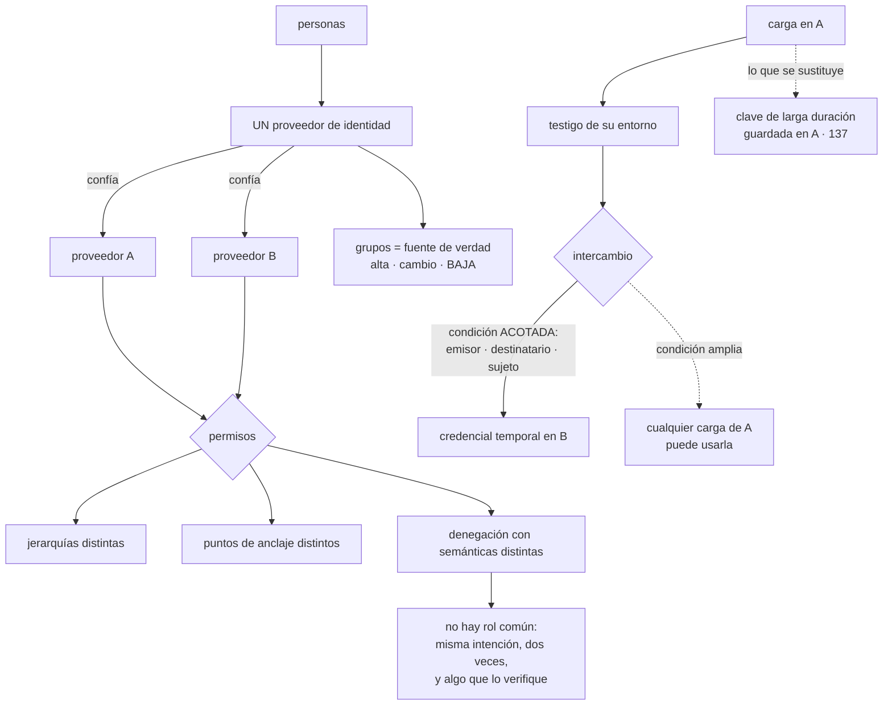

# 159 — Federación de identidad entre nubes

> [← Clase anterior](../../part-13-multicloud-hybrid-disaster-recovery/158-portabilidad-capas-de-abstraccion-y-lock-in/README.md) · [Índice de la parte](../README.md) · [Clase siguiente →](../../part-13-multicloud-hybrid-disaster-recovery/160-conectividad-transito-dns-y-service-discovery/README.md)

**Parte:** 13 — Multi-cloud, híbrido, migración y recuperación<br>
**Nivel:** experto · **Horas estimadas:** 4<br>
**Laboratorio:** `iam` · **Estado:** `EXECUTABLE_CORE`

## 🎯 Propósito

Montar lo primero que hay que montar al usar dos proveedores, y lo que menos se puede portar: la identidad. La clase separa dos problemas que se confunden —**las personas y las cargas**—, da la solución correcta para cada uno, y se detiene en el detalle que convierte una federación en un agujero: **una condición de confianza demasiado amplia**. Y afronta con honestidad lo que no se puede unificar: los modelos de permisos de los proveedores no se corresponden, así que no hay un rol común, sino **la misma intención implementada dos veces y algo que compruebe que siguen siendo equivalentes**.

## 📚 Resultados de aprendizaje

Al finalizar podrás:

1. **Separar** la federación de personas de la de cargas.
2. **Sustituir** claves de larga duración entre nubes por credenciales temporales.
3. **Acotar** la condición de confianza a lo que debe poder usarla.
4. **Reconocer** qué diferencias de modelo impiden unificar los permisos.
5. **Responder** quién hizo qué cuando la misma persona tiene identidades distintas.

## 🧩 Conceptos centrales

| Concepto | Comprensión verificable |
|---|---|
| `proveedor de identidad` | Sistema donde viven las personas y sus grupos. Debe haber uno, y los proveedores de nube confían en él. |
| `federación de carga` | Una carga demuestra quién es con el testigo de su entorno y obtiene credenciales temporales en otro proveedor. No hay secreto que guardar. |
| `condición de confianza` | Qué emisor, qué destinatario y qué sujeto concreto se aceptan. Si es amplia, cualquier carga de ese entorno puede usarla. |
| `intención equivalente` | El mismo permiso expresado en dos modelos distintos. No se puede unificar; hay que verificar que coincide. |
| `ciclo de vida de la persona` | Alta, cambio y baja. Si no es único para todos los proveedores, alguien se va y queda activo en uno. |
| `correlación de identidades` | Saber que dos sujetos distintos en dos proveedores son la misma persona. Sin ella no se puede auditar. |

## 🧠 Modelo mental

Multi-cloud es una decisión de negocio y riesgo; duplicar cada componente entre proveedores rara vez es la forma más confiable o económica de lograrla.

Aplicado a esta clase, separa siempre cuatro planos: **intención** (qué necesita el usuario),
**configuración** (qué declaramos), **estado observado** (qué existe de verdad) y
**evidencia** (cómo sabemos que cumple). Confundirlos produce diseños que se ven correctos
en un diagrama pero fallan al operar.

## 🗺️ Flujo de razonamiento



## 📖 Desarrollo

### 1. Dos problemas distintos

Se llaman igual y se resuelven de forma distinta:

```text
PERSONAS
  alguien de desarrollo necesita entrar en los dos proveedores
  → problema bien resuelto: un proveedor de identidad y confianza
    desde cada nube

CARGAS
  un servicio que corre en A necesita llamar a un servicio de B
  → problema mal resuelto casi siempre: una clave estática guardada
```

**Las personas.** La regla es una:

```text
UN proveedor de identidad, y los dos proveedores de nube confían en él
→ nadie tiene usuario propio en ninguna nube
→ los grupos del proveedor de identidad se traducen a roles en cada uno
```

Y lo que eso resuelve de golpe:

```text
el factor resistente a suplantación se exige una vez     clase 133
la baja de una persona se hace en un sitio
el acceso temporal se concede sobre grupos                clase 134
y las condiciones de acceso —dispositivo, origen— se aplican una vez
```

Y el detalle que decide si funciona:

```text
los GRUPOS son la fuente de verdad, no las asignaciones en cada nube
→ si alguien asigna un rol directamente a una persona en un proveedor,
  esa asignación sobrevive a su baja
→ y eso hay que impedirlo con un control preventivo    clase 139
```

**Las cargas.** Las tres opciones, ordenadas:

```text
1. FEDERACIÓN DE CARGA        ← la correcta
   la carga presenta el testigo que le da su entorno en A
   B lo verifica y entrega credenciales temporales
   → no hay secreto que guardar ni rotar               clase 137
   → es el patrón de la clase 098, generalizado entre nubes

2. CLAVE DE LARGA DURACIÓN DE B GUARDADA EN A
   → funciona el primer día y es lo que la clase 137 dedicó
     una clase entera a eliminar
   → y ahora está en un proveedor distinto del que la emitió,
     con lo que el rastro es más largo

3. INTERMEDIARIO QUE EMITE CREDENCIALES
   un servicio propio al que las cargas piden credenciales
   → añade un componente crítico y el problema del arranque
     de confianza                                      clase 137
   → solo si el proveedor no admite federación directa
```

Y el orden de trabajo que se deduce, y que la clase 157 ya anticipó:

```text
la identidad es lo PRIMERO que se monta al añadir un proveedor
porque todo lo demás la necesita, y porque montarla después
significa migrar todo lo que se hizo mientras tanto
```

### 2. La condición de confianza

La federación de carga se apoya en una relación de confianza, y **su configuración es donde está el riesgo**.

Lo que se declara:

```text
EMISOR         quién firma el testigo: el entorno de A
DESTINATARIO   para quién es el testigo: el proveedor B
SUJETO         QUÉ carga concreta puede usarlo
CADUCIDAD      cuánto vale la credencial resultante
```

Y el tercero es el que se configura mal:

```text
mal   «acepto cualquier testigo emitido por el clúster de A»
      → cualquier carga de ese clúster puede obtener credenciales en B
      → incluida una comprometida, y las de entornos inferiores

bien  «acepto el testigo cuyo sujeto sea la cuenta de servicio
       pedidos del espacio de nombres produccion del clúster X»
```

Y es exactamente el mismo error que la clase 098 encontró con las canalizaciones: **confiar en el emisor sin acotar el sujeto**.

Y las comprobaciones que hay que hacer sobre cada relación de confianza:

```text
¿el sujeto está acotado a una identidad concreta?
¿los entornos inferiores tienen relaciones distintas de producción?
¿la caducidad de la credencial resultante es corta?
¿los permisos que se obtienen son los mínimos?          clase 134
¿queda registro en los DOS proveedores de cada intercambio?
```

Y una prueba negativa que conviene ejecutar, del catálogo de la clase 131:

```text
intentar obtener credenciales de B desde una carga de A
que NO debería poder
→ y comprobar que se rechaza y que queda registro
```

Y dos cautelas más:

```text
LA CADUCIDAD DEL TESTIGO NO ES LA DE LA CREDENCIAL
  un testigo de una hora puede producir credenciales de doce
  → hay que acotar las dos

EL TESTIGO ES UN SECRETO MIENTRAS VIVE
  si se filtra en un registro, sirve para obtener credenciales
  → depuración obligatoria                            clase 122
```

Y sobre el sentido de la federación, que conviene decidir explícitamente:

```text
¿de A hacia B, de B hacia A, o en los dos sentidos?
→ cada sentido es una relación de confianza más y una superficie más
→ y casi siempre hace falta uno solo
```

### 3. Lo que no se puede unificar

Aquí está el motivo por el que la identidad es la capa menos portable: **los modelos de permisos no se corresponden**.

```text
JERARQUÍA DE RECURSOS
  los tres proveedores organizan los recursos en árboles distintos,
  con niveles distintos y significados distintos
  → una política aplicada «al nivel de arriba» no significa lo mismo

DÓNDE SE ANCLA LA POLÍTICA
  a la identidad, al recurso, al contenedor de recursos, o a varios
  → y el resultado de combinarlas se calcula de forma distinta

SEMÁNTICA DE LA DENEGACIÓN
  denegación explícita que gana siempre
  políticas de denegación aparte
  restricciones de organización que acotan lo que se puede conceder
  → tres mecanismos con reglas de precedencia distintas    clase 049

CONDICIONES Y ATRIBUTOS
  qué se puede condicionar —origen, etiqueta, hora, dispositivo—
  y cómo se expresa

IDENTIDADES DE CARGA
  una tiene cuentas de servicio, otra roles asumibles, otra identidades
  administradas
```

Y la consecuencia práctica, que hay que aceptar:

```text
no existe «un rol común para los dos proveedores»
existe la MISMA INTENCIÓN implementada dos veces
y algo que compruebe que siguen siendo equivalentes
```

Y cómo se hace esa comprobación, que es lo único que evita la deriva:

```text
1. escribir la intención en un lenguaje propio y neutro
   «el equipo de pedidos puede leer y escribir sus datos de pedidos,
    y no puede tocar copias de seguridad ni el registro de auditoría»

2. implementarla en cada proveedor con su modelo, a fondo

3. y comprobar el RESULTADO, no la configuración
   ¿puede esta identidad borrar una copia en A? ¿y en B?
   ¿puede leer los datos de otro equipo? ¿en los dos?
```

Y el tercer paso es la clave: **comparar configuraciones es imposible; comparar lo que se puede hacer, no**. Y se automatiza como las pruebas negativas de la clase 144.

Y lo que sí se puede unificar sin forzar nada:

```text
los grupos de personas                          en el proveedor de identidad
las etiquetas de dueño                          clase 142
el catálogo de quién es responsable de qué      clase 095
y las fronteras absolutas, expresadas en cada modelo
  «nadie puede desactivar el registro de auditoría»
  «nadie puede borrar copias»                   clase 139
```

La última línea es la más rentable: **son pocas reglas, se expresan en los dos modelos y son las que más daño evitarían**.

### 4. Ciclo de vida, emergencia y auditoría

**El ciclo de vida de una persona** es donde falla la federación en la práctica:

```text
ALTA      se crea en el proveedor de identidad y hereda grupos
CAMBIO    cambia de equipo; sus grupos cambian
BAJA      se desactiva en el proveedor de identidad
```

Y lo que se escapa:

```text
asignaciones directas hechas en un proveedor, fuera de los grupos
cuentas locales creadas «temporalmente» en una nube
claves de acceso creadas por esa persona y no revocadas
identidades de carga creadas a su nombre
y accesos a herramientas de terceros con su cuenta
```

Y la medida que lo detecta:

```text
personas dadas de baja en el proveedor de identidad
con algo activo en algún proveedor de nube
→ debería ser cero, y la primera vez que se mide nunca lo es
```

**El acceso de emergencia**, que la clase 134 exigió y que ahora se duplica:

```text
no puede depender del proveedor de identidad federado
  porque su caída es justo uno de los casos en que hace falta
y hace falta uno POR PROVEEDOR de nube
  con aviso, revisión obligatoria y rotación tras el uso
y se ensaya una vez al año, en los dos
```

**La auditoría entre proveedores**, que es el problema que nadie prevé:

```text
la misma persona tiene
  un identificador en el proveedor de identidad
  un sujeto distinto en el registro de auditoría de A
  otro sujeto distinto en el de B
→ y la pregunta «¿qué hizo esta persona ayer?» no tiene respuesta
  sin una tabla que los relacione
```

Y lo que hace falta:

```text
una correspondencia entre identificadores, mantenida automáticamente
el identificador del proveedor de identidad presente en los registros
  de los dos, cuando el proveedor lo permita
y los registros de auditoría de ambos en un mismo sitio   clase 162
```

Y una comprobación que conviene hacer antes de necesitarla:

```text
elegir una persona y reconstruir todo lo que hizo ayer en los dos
proveedores
→ si lleva más de diez minutos, falta la correspondencia
```

Y la lista de comprobación de la clase:

```text
☐ hay un único proveedor de identidad y los dos confían en él
☐ nadie tiene usuario local en ninguna nube
☐ los grupos son la fuente de verdad y las asignaciones directas
  están impedidas
☐ no hay claves de larga duración entre proveedores
☐ cada relación de confianza acota el sujeto, no solo el emisor
☐ los entornos inferiores tienen relaciones distintas de producción
☐ la caducidad del testigo y la de la credencial están acotadas
☐ se ha probado que una carga no autorizada no puede obtener credenciales
☐ la intención de permisos está escrita en un lenguaje neutro
☐ se comprueba el RESULTADO en los dos, no la configuración
☐ las fronteras absolutas están expresadas en los dos modelos
☐ es cero el número de personas dadas de baja con algo activo
☐ hay acceso de emergencia por proveedor, ensayado
☐ existe correspondencia de identificadores para auditar
```

Y el cierre que enlaza con la clase siguiente: con la identidad resuelta, la siguiente capa que no se puede portar y que decide si dos proveedores pueden trabajar juntos es la red: cómo se alcanzan, cómo se resuelven los nombres y qué cuesta el tránsito. Es la materia de la clase 160.

## 🔬 Ejemplo trabajado

**CloudShop federa la identidad entre sus dos proveedores. El ejercicio empieza por inventariar cómo se autentican hoy las cargas y las personas, y encuentra tres cosas que llevaban meses activas.**

**El inventario de partida.**

```text
PERSONAS
  proveedor de identidad corporativo                      sí
  usuarios locales en el proveedor principal               4
  usuarios locales en el segundo proveedor                11
  asignaciones de rol directas, fuera de grupos            27

CARGAS
  cargas en A que llaman a B                               3
  cómo se autentican           clave de larga duración de B
                               guardada en el almacén de A
  antigüedad de esas claves                        14 meses
  rotaciones                                              0
```

Y las once cuentas locales del segundo proveedor:

```text
creadas «temporalmente» durante la integración inicial
personas que ya no están en la empresa                        3
cuentas sin uso en más de 6 meses                             7
con permisos de administración                                2
```

**Tres personas dadas de baja hacía meses seguían con acceso activo** al segundo proveedor, porque la baja se hizo en el proveedor de identidad y esas cuentas eran locales.

```text                                          antes         después
usuarios locales                                 15              0
personas de baja con acceso activo                3              0
asignaciones directas fuera de grupos            27              0
control preventivo que impide crear usuarios
locales                                          no             sí
medida «bajas con algo activo», vigilada         no        semanal, = 0
```

**La federación de cargas, y la condición demasiado amplia.**

La primera configuración de la relación de confianza:

```text
emisor        el clúster de producción de A
destinatario  el proveedor B
sujeto        cualquiera
caducidad     12 horas
```

Y la prueba negativa correspondiente, ejecutada antes de dar por buena la configuración:

```text
se desplegó una carga de prueba en el mismo clúster,
en otro espacio de nombres, sin ningún permiso previsto
resultado   obtuvo credenciales válidas en B
            con los permisos del rol de pedidos
```

**Cualquier carga del clúster podía actuar como el servicio de pedidos en el otro proveedor.**

```text                                          antes         después
sujeto de la confianza                    cualquiera    cuenta de servicio
                                                        y espacio de nombres
                                                        concretos
relaciones distintas por entorno                 no             sí
caducidad de la credencial                    12 h            1 h
prueba negativa ejecutada                        no        trimestral
cargas que pueden obtener credenciales
en B                                        todas (≈180)        3
```

Y las tres claves de larga duración desaparecieron:

```text
claves de B guardadas en A                        3 → 0
rotaciones pendientes                             3 → 0
tiempo desde filtración hasta invalidación   indefinido → ≤ 1 h
```

**Lo que no se pudo unificar.**

Se intentó primero definir «un rol equivalente» y se abandonó al chocar con los modelos:

```text
intención        «el equipo de pedidos gestiona sus datos y no toca
                  copias ni auditoría»

en el proveedor A   3 políticas, ancladas a la identidad y al proyecto,
                    más una restricción de organización
en el proveedor B   2 políticas, una de ellas de denegación explícita,
                    ancladas al recurso y a la unidad organizativa

líneas de configuración equivalentes                   0
```

Y se pasó al método del apartado tercero: **comprobar el resultado**.

```text
batería de preguntas, ejecutada contra los dos proveedores
  ¿puede leer sus datos de pedidos?                sí / sí     ✓
  ¿puede escribirlos?                              sí / sí     ✓
  ¿puede leer datos de otro equipo?                no / no     ✓
  ¿puede borrar una copia de seguridad?            no / SÍ     ✗
  ¿puede desactivar el registro de auditoría?      no / no     ✓
  ¿puede crear identidades nuevas?                 no / SÍ     ✗
  ¿puede salir a internet sin restricción?         no / SÍ     ✗
```

**Tres divergencias**, todas en el segundo proveedor, todas por un permiso heredado que en el primero estaba cortado por una restricción de organización que allí no existía.

```text                                          antes         después
preguntas equivalentes                        4 de 7         7 de 7
fronteras absolutas expresadas en los dos       1              5
comprobación automática del resultado           no       en la canalización
divergencias detectadas después                 —          2 en 8 meses
```

Y las cinco fronteras absolutas que se expresaron en los dos modelos:

```text
nadie borra copias de seguridad
nadie desactiva el registro de auditoría
nadie crea identidades con permisos amplios
nadie usa regiones fuera de las autorizadas
nadie hace público un almacén de objetos
```

**El acceso de emergencia, duplicado.**

```text                                          antes         después
accesos de emergencia                             1              2
dependen del proveedor de identidad federado     sí             no
ensayo anual                                 no se había      hecho
hallazgo del primer ensayo
  el del segundo proveedor no funcionaba: la credencial se había
  creado con una cuenta local que se eliminó en la limpieza
```

**La auditoría entre proveedores.**

La prueba del apartado cuarto, ejecutada:

```text
«reconstruye todo lo que hizo esta persona ayer, en los dos»
  primer intento                                      2 h 40
  causa    el sujeto en A es un correo, en B es un identificador
           interno, y en el proveedor de identidad es otro
```

```text                                          antes         después
correspondencia de identificadores           no había      mantenida
                                                          automáticamente
registros de auditoría en un solo sitio          no             sí  clase 162
tiempo de reconstruir la actividad de
una persona                                   2 h 40          4 min
```

**El orden en que se hizo, y por qué importó.**

```text
semana 1-2   personas: proveedor único, sin usuarios locales
semana 3-4   cargas: federación y retirada de las 3 claves
semana 5     fronteras absolutas en los dos modelos
semana 6     comprobación de resultado en la canalización
semana 7-8   correspondencia de identificadores y auditoría común
```

Y la razón del orden es la del apartado primero:

```text
todo lo que se despliegue en el segundo proveedor a partir de ahora
nace con identidad federada
→ las cargas que se desplegaron ANTES de la semana 4 hubo que migrarlas
→ y fueron 3; si se hubiera montado seis meses después, habrían sido 20
```

**A los ocho meses.**

```text                                          antes         después
usuarios locales en las nubes                    15              0
personas de baja con acceso activo                3              0
claves de larga duración entre nubes              3              0
cargas que podían obtener credenciales en B    ≈180              3
relaciones de confianza con sujeto acotado    0 de 1         3 de 3
preguntas de permiso equivalentes             4 de 7         7 de 7
fronteras absolutas en los dos modelos            1              5
accesos de emergencia ensayados                   0              2
tiempo de auditar a una persona               2 h 40          4 min
```

**La lección que esta clase traslada a la parte 13**: la federación funcionó a la primera y **la configuración inicial permitía que cualquiera de las ciento ochenta cargas del clúster actuara como el servicio de pedidos en el otro proveedor**, exactamente el mismo error que la clase 098 encontró con las canalizaciones: acotar el emisor y no el sujeto. Y el intento de unificar los permisos se abandonó al descubrir que **no había ni una línea de configuración equivalente entre los dos modelos**; lo que sí funcionó fue comprobar el resultado con siete preguntas, que encontraron tres divergencias que ninguna comparación de configuraciones habría revelado.

## 🧪 Laboratorio guiado

Ejecuta desde la raíz:

```bash
python classes/part-13-multicloud-hybrid-disaster-recovery/159-federacion-de-identidad-entre-nubes/lab.py
```

El laboratorio selecciona el motor de práctica **`iam`** y produce
`lab_result.json`. El escenario, sus comprobaciones y el artefacto esperado corresponden a
esta clase; no requiere credenciales y deja explícito qué debe revalidarse en un sandbox real.

1. Lee `exercise.steps` y formula una predicción antes de ejecutar.
2. Ejecuta la práctica y verifica todos los elementos de `checks`.
3. Provoca el caso de `negative_test` y explica la señal observada.
4. Materializa `federacion-multicloud` en `evidence/` usando la plantilla indicada.
5. Para proveedor real, sigue `sandbox.requires`, registra costo y ejecuta `destroy`.

### Evidencia esperada

El artefacto principal es una matriz de acceso mínimo con prueba de denegación. Además, la entrega debe incluir el comando ejecutado,
la salida estructurada y una conclusión que no exceda lo observado.

## 🏆 Reto verificable

Construye **`federacion-multicloud`** para el caso CloudShop. Incluye una alternativa descartada,
un supuesto que pueda falsarse, una prueba de fallo y una decisión de rollback.

## ✅ Criterio de aceptación

- [ ] `lab.py` termina con código 0 y genera JSON válido.
- [ ] La entrega conecta al menos tres requisitos con mecanismos verificables.
- [ ] Existe una prueba positiva y una prueba negativa con evidencia.
- [ ] Seguridad, costo y operación aparecen como decisiones, no como anexos.
- [ ] Se declara una limitación y una condición que obligaría a revisar el diseño.
- [ ] Otra persona puede repetir el recorrido sin conocimiento tácito.

## ⚠️ Errores frecuentes

| Síntoma | Causa probable | Corrección |
|---|---|---|
| Alguien deja la empresa y sigue teniendo acceso a una de las nubes | Hay usuarios locales o asignaciones directas fuera de los grupos | Un solo proveedor de identidad, prohibición preventiva de usuarios locales y medida semanal de bajas con algo activo. |
| Cualquier carga de un clúster puede actuar como otra en el segundo proveedor | La condición de confianza acota el emisor pero no el sujeto | Acota a la identidad concreta, separa relaciones por entorno y comprueba con una prueba negativa que otra carga no lo consigue. |
| Hay claves de larga duración de un proveedor guardadas en otro | Se resolvió la llamada entre nubes con un secreto en vez de con federación | Federación de carga: testigo del entorno intercambiado por credenciales temporales. |
| Se intenta definir un rol común entre proveedores y no encaja | Los modelos de jerarquía, anclaje y denegación no se corresponden | Escribe la intención en lenguaje neutro, implementa en cada modelo a fondo y comprueba el resultado con una batería de preguntas. |
| No se puede responder qué hizo una persona en los dos proveedores | Los identificadores de sujeto son distintos y no hay correspondencia | Mantén una correspondencia automática y reúne los registros de auditoría en un solo sitio. |
| El acceso de emergencia del segundo proveedor no funciona cuando hace falta | Depende del proveedor de identidad federado o de una cuenta que se eliminó | Uno por proveedor, independiente de la federación, con ensayo anual. |

## 🛡️ Seguridad, ética y costo

Trabaja con cuentas propias o sandboxes autorizados. No publiques secretos, identificadores
reales ni datos personales. Antes de crear recursos pagos define presupuesto, etiquetas y
comando de destrucción; después verifica que no queden recursos huérfanos. Los ejemplos
locales enseñan contratos, pero no certifican cumplimiento ni disponibilidad de producción.

## ❓ Preguntas de comprobación

1. ¿Por qué la identidad es lo primero que se monta al añadir un proveedor?
2. ¿Qué tres opciones hay para que una carga de A llame a B y cuál es la correcta?
3. ¿Qué se declara en una relación de confianza y cuál de esos elementos se configura mal?
4. ¿Por qué no existe un rol común entre proveedores y qué se hace en su lugar?
5. ¿Qué hace falta para poder auditar a una persona en dos proveedores?

## 🔗 Referencias

- OpenID Foundation (2025). *OpenID Connect Core* — base de la federación de personas entre sistemas. <https://openid.net/specs/openid-connect-core-1_0.html>
- AWS (2025). *Identity providers and OIDC federation for workloads* — intercambio de testigo por credenciales temporales. <https://docs.aws.amazon.com/IAM/latest/UserGuide/id_roles_providers_oidc.html>
- Google Cloud (2025). *Workload identity federation* — condiciones de sujeto y acotación de la confianza. <https://cloud.google.com/iam/docs/workload-identity-federation>
- Microsoft (2025). *Workload identity federation in Entra ID* — federación entre proveedores sin secretos. <https://learn.microsoft.com/entra/workload-id/workload-identity-federation>
- SPIFFE (2025). *Identity across trust domains* — identidad de carga entre dominios distintos. <https://spiffe.io/docs/latest/spiffe-about/overview/>
- Documentación oficial vigente del servicio implementado; registra URL y fecha de consulta.

---

> [Evaluación](assessment.md) · [Contrato de clase](lesson.yaml) · [Índice de la parte](../README.md)
