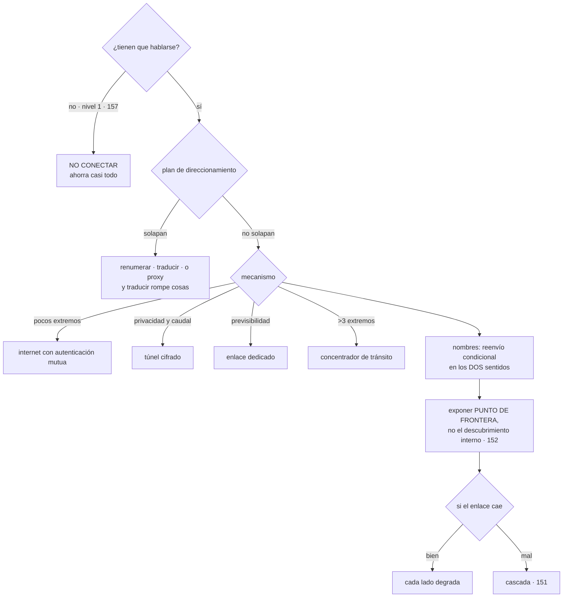

# 160 — Conectividad, tránsito, DNS y service discovery

> [← Clase anterior](../../part-13-multicloud-hybrid-disaster-recovery/159-federacion-de-identidad-entre-nubes/README.md) · [Índice de la parte](../README.md) · [Clase siguiente →](../../part-13-multicloud-hybrid-disaster-recovery/161-replicacion-de-datos-soberania-y-costos-de-egress/README.md)

**Parte:** 13 — Multi-cloud, híbrido, migración y recuperación<br>
**Nivel:** experto · **Horas estimadas:** 4<br>
**Laboratorio:** `network` · **Estado:** `EXECUTABLE_CORE`

## 🎯 Propósito

Conectar dos proveedores, empezando por la pregunta que ahorra más trabajo que ninguna otra de esta parte: **¿de verdad tienen que hablarse?**. La clase muestra que la mayor parte del coste y de la complejidad viene de conectar cosas que no lo necesitaban; que **el cable casi nunca es el problema y el direccionamiento sí**; y que extender el descubrimiento interno de un proveedor al otro es un error que se paga durante años. Y termina con lo que ocurre cuando el enlace se cae, que es cuando se descubre si las dos partes eran independientes o solo lo parecían.

## 📚 Resultados de aprendizaje

Al finalizar podrás:

1. **Decidir** si hace falta conectividad entre proveedores, antes de elegir cómo.
2. **Elegir** el mecanismo de enlace por coste, previsibilidad y número de extremos.
3. **Planificar** el direccionamiento para que no haya solapes, que es irreversible.
4. **Resolver** nombres entre proveedores sin que un resolutor sea un punto único.
5. **Exponer** una frontera estable en vez de extender el descubrimiento interno.

## 🧩 Conceptos centrales

| Concepto | Comprensión verificable |
|---|---|
| `nivel de acoplamiento de red` | Cuánto necesitan hablarse las cargas de cada proveedor. En el nivel 1 de la clase 157 es cero, y eso ahorra casi todo. |
| `plan de direccionamiento` | Reparto de rangos privados entre entornos, regiones y proveedores. Se decide al crear y cambiarlo obliga a renumerar. |
| `solape de rangos` | Dos redes con el mismo espacio privado. Impide enrutar entre ellas sin traducir, y traducir rompe cosas. |
| `reenvío condicional` | Mandar las consultas de un dominio concreto al resolutor del otro proveedor. Es lo que hace que los nombres privados funcionen entre nubes. |
| `punto de frontera` | Extremo estable y documentado por el que se entra a un proveedor, en vez de exponer su descubrimiento interno. |
| `concentrador de tránsito` | Punto central por el que pasan las conexiones cuando hay más de dos o tres extremos, para evitar la malla de túneles. |

## 🧠 Modelo mental

Multi-cloud es una decisión de negocio y riesgo; duplicar cada componente entre proveedores rara vez es la forma más confiable o económica de lograrla.

Aplicado a esta clase, separa siempre cuatro planos: **intención** (qué necesita el usuario),
**configuración** (qué declaramos), **estado observado** (qué existe de verdad) y
**evidencia** (cómo sabemos que cumple). Confundirlos produce diseños que se ven correctos
en un diagrama pero fallan al operar.

## 🗺️ Flujo de razonamiento



## 📖 Desarrollo

### 1. La pregunta previa

Antes de elegir cómo conectar, hay que responder si hace falta:

```text
¿qué carga de A necesita hablar con qué carga de B?
¿con qué frecuencia?
¿es síncrono o puede ser asíncrono?               clase 152
¿podría hacerse por una interfaz pública autenticada?
```

Y el resultado sorprende a menudo:

```text
nivel 1 de la clase 157 —cargas independientes—
no necesita conectividad privada entre proveedores
→ cada carga vive entera en su proveedor
→ y lo que compartan pasa por interfaces públicas autenticadas
  o por datos que se copian
```

Y el coste de conectar, que es lo que se ahorra al no hacerlo:

```text
un plan de direccionamiento común
túneles o enlaces, con su vigilancia y su guardia
resolución de nombres cruzada
reglas de cortafuegos en los dos lados
salida de datos por el tráfico que cruza          clase 161
un modo de fallo nuevo: el enlace
y un camino de movimiento lateral entre proveedores  clase 133
```

El último merece detenerse: **conectar dos nubes crea un camino que antes no existía**, y eso cambia el ejercicio de alcance de la clase 133.

Y las tres formas de necesitar menos conectividad, en orden de preferencia:

```text
1. QUE NO SE HABLEN
   la carga completa vive en un lado, con sus datos

2. QUE SE HABLEN POR UNA INTERFAZ PÚBLICA AUTENTICADA
   con autenticación mutua y lista de permitidos    clases 135, 136
   → es tráfico por internet, cifrado y acotado
   → suficiente para muchísimos casos, y sin infraestructura nueva

3. QUE SE COMUNIQUEN DE FORMA ASÍNCRONA
   publicando y consumiendo, en vez de llamando       parte 09
   → tolera latencia y cortes
```

Y solo cuando ninguna sirve —volumen alto, latencia baja, requisito de no salir a internet— se monta conectividad privada.

### 2. El direccionamiento, que sí es el problema

El enlace físico o lógico rara vez falla. Lo que bloquea los proyectos es esto:

```text
dos redes privadas con el mismo rango
→ no se pueden enrutar entre sí
```

Y ocurre casi siempre, por tres motivos:

```text
los valores por defecto de los proveedores coinciden
cada equipo eligió su rango cuando creó su red
y una adquisición trae rangos que nadie coordinó
```

Las tres salidas, con lo que cuesta cada una:

```text
RENUMERAR
  la correcta y la cara
  → hay que cambiar direcciones, reglas y todo lo que las tenga escritas
  → y con recursos gestionados, a veces exige recrearlos

TRADUCIR DIRECCIONES ENTRE LAS DOS
  funciona y rompe cosas:
    lo que lleva direcciones dentro del contenido de los mensajes
    los registros: la dirección que se ve no es la real
    la depuración, que pasa a requerir una tabla de traducción
    y las conexiones iniciadas desde el otro lado, según el caso

PROXY EN LA FRONTERA
  solo para servicios concretos
  → no enruta la red: expone puntos concretos
  → y para pocos servicios es la opción más limpia
```

Y la prevención, que es una decisión de creación y por tanto irreversible —ley 14—:

```text
UN PLAN DE DIRECCIONAMIENTO CENTRAL desde el primer día
  un bloque grande reservado para la organización
  repartido por proveedor, región y entorno
  con reserva para crecimiento y para adquisiciones
  y nadie crea una red sin pedir su rango
```

Y el control que lo hace cumplir es el de la clase 139: **una política que impide crear una red con un rango no asignado**.

Y una advertencia sobre el tamaño, que se equivoca en las dos direcciones:

```text
rangos demasiado pequeños   se agotan y hay que añadir bloques sueltos
rangos demasiado grandes    se agota el espacio total de la organización
→ y en entornos con muchas direcciones por instancia —contenedores—
  el consumo es mucho mayor de lo que la intuición sugiere
```

**Los mecanismos de enlace**, ordenados por coste:

```text
INTERNET CON AUTENTICACIÓN MUTUA
  + nada que montar; cifrado de extremo a extremo
  − latencia variable y salida de datos a tarifa normal

TÚNEL CIFRADO SOBRE INTERNET
  + red privada entre los dos
  − caudal limitado, y hay que operar los extremos y su redundancia

ENLACE DEDICADO
  + caudal y latencia previsibles, y tarifa de salida menor
  − caro, con plazo de contratación de semanas

CONCENTRADOR DE TRÁNSITO
  cuando hay más de dos o tres extremos
  → sin él, N extremos exigen del orden de N² túneles
```

Y la última fila es la que decide la arquitectura de red en cuanto hay más de un puñado de redes: **la malla de túneles no escala y nadie la mantiene bien**.

### 3. Nombres y descubrimiento

**Los nombres privados de cada proveedor solo resuelven dentro de él.** Para que una carga de A resuelva un nombre de B hacen falta dos piezas:

```text
un resolutor de A que sepa reenviar el dominio de B
un extremo en B que acepte esas consultas desde A
y lo mismo en el sentido contrario, si se necesita
```

Y los tres fallos habituales:

```text
RESOLUCIÓN EN UN SOLO SENTIDO
  A resuelve nombres de B y B no resuelve los de A
  → funciona hasta que algo responde con un nombre en vez de una dirección

EL MISMO NOMBRE SIGNIFICA COSAS DISTINTAS
  «base.interno» existe en los dos y apunta a bases distintas
  → un error de configuración manda el tráfico al sitio equivocado,
    sin ningún error
  → la regla: un nombre significa lo mismo en todas partes,
    o se usan sufijos distintos por proveedor

EL RESOLUTOR COMO PUNTO ÚNICO
  si el reenvío cae, deja de resolverse todo lo del otro lado
  → dos extremos, en zonas distintas, y comprobación de salud
```

Y una cuestión que aparece siempre y que conviene decidir de antemano:

```text
los tiempos de vida de los registros deciden la velocidad de conmutación
  valores largos       menos consultas, conmutación lenta       clase 109
  valores cortos       conmutación rápida, más carga y más coste
→ y algunos clientes ignoran esos valores y cachean por su cuenta
→ por eso la conmutación por nombre nunca es instantánea
```

**El descubrimiento entre proveedores** es donde más se complica la gente:

```text
mal   extender el descubrimiento interno de un proveedor al otro
      → cada instancia de A conoce cada instancia de B
      → miles de entradas cruzando la frontera, cambiando cada minuto
      → y una malla que hay que operar en los dos lados     clase 152

bien  exponer un PUNTO DE FRONTERA por servicio
      un nombre estable y un extremo con reparto por detrás
      → el otro lado solo conoce ese nombre
      → y dentro de cada proveedor, el descubrimiento sigue siendo interno
```

Y las ventajas del punto de frontera, que son las mismas que las de un contrato:

```text
la implementación de cada lado cambia sin afectar al otro
se puede limitar, medir y autorizar en un sitio       clase 118
y el radio de un fallo queda acotado
```

Y una consecuencia de latencia que hay que tener presente al diseñar:

```text
latencia entre proveedores, misma zona metropolitana      1-20 ms
entre continentes                                        30-150 ms

→ una operación conversadora que cruce la frontera 40 veces
  añade segundos                                          clase 152
→ la regla: la frontera se cruza UNA VEZ por operación,
  y a ser posible de forma asíncrona
```

### 4. Cuando el enlace se cae

Un enlace entre proveedores es un componente más, y falla. Lo que hay que decidir de antemano:

```text
¿qué deja de funcionar en A si no ve a B?
¿y en B si no ve a A?
¿alguno de los dos deja de servir a sus usuarios?
```

Y la respuesta correcta, con el vocabulario de la clase 151:

```text
cada lado debe DEGRADAR, no caer
→ las dependencias que cruzan la frontera deben ser blandas
→ y si alguna es dura, la disponibilidad de un lado depende del enlace
  y hay que decirlo                                     clase 126
```

Y lo que hay que tener para que eso ocurra:

```text
plazos cortos en las llamadas que cruzan                clase 130
cortacircuitos por destino remoto
respuesta alternativa: caché, valor por defecto, encolar
y comprobación de que la dependencia es blanda, ensayada  clase 131
```

Y el ensayo correspondiente, que es de los más informativos de esta parte:

```text
cortar el enlace entre proveedores durante 15 minutos
  ¿qué falla en cada lado?
  ¿alguien se entera antes que un cliente?
  ¿se recupera solo al restaurarlo, o hay que intervenir?
```

La tercera pregunta detecta el fallo metaestable de la clase 151: **acumulación de reintentos que mantiene el problema después de restaurar el enlace**.

**Lo que hay que vigilar** en la conectividad entre proveedores:

```text
disponibilidad y latencia del enlace, medidas de extremo a extremo
caudal usado frente al contratado
pérdida de paquetes
consultas de nombres que fallan por dominio
volumen de datos que cruza, por dirección y por servicio  clase 161
y destinos nuevos que aparecen cruzando la frontera       clase 135
```

La última es de seguridad y de coste a la vez, que es la observación de la clase 144.

Y una decisión que conviene tomar explícitamente:

```text
¿el tráfico entre proveedores va cifrado además del túnel?
  sí, siempre: el túnel puede terminar en un sitio que no controlas
  → autenticación mutua de extremo a extremo             clase 136
```

Y la lista de comprobación de la clase:

```text
☐ está respondida la pregunta de si hace falta conectar
☐ se ha valorado interfaz pública autenticada y comunicación asíncrona
☐ existe un plan de direccionamiento central y nadie crea redes sin pedir rango
☐ no hay solapes; si los hay, está decidido si se renumera o se traduce
☐ el mecanismo de enlace corresponde al número de extremos y al caudal
☐ hay concentrador si hay más de tres extremos
☐ la resolución de nombres funciona en los dos sentidos
☐ ningún nombre significa cosas distintas en cada proveedor
☐ los resolutores están duplicados y vigilados
☐ se expone un punto de frontera por servicio, no el descubrimiento interno
☐ una operación cruza la frontera una vez, no muchas
☐ las dependencias que cruzan son blandas y se ha comprobado
☐ se ha ensayado un corte del enlace y se ha medido la recuperación
☐ el tráfico va cifrado de extremo a extremo, además del túnel
```

Y el cierre que enlaza con la clase siguiente: por ese enlace pasan datos, y en cuanto los datos cruzan aparece la partida que la hipótesis de la clase 156 señaló como dominante y que casi nadie estima antes: **lo que cuesta sacarlos**. Es la materia de la clase 161.

## 🔬 Ejemplo trabajado

**CloudShop tiene tres cargas en su segundo proveedor y un proyecto abierto para «conectar las dos nubes». El ejercicio empieza por la pregunta previa y termina conectando una sola cosa.**

**La pregunta previa, aplicada a las tres cargas.**

```text
CARGA 1: análisis
  ¿necesita hablar con A?   sí, para leer datos
  ¿con qué frecuencia?      una vez al día, por lotes
  ¿síncrono?                no
  → ASÍNCRONO: A publica los datos al lago del segundo proveedor
  → conectividad privada necesaria: NINGUNA

CARGA 2: datos de tres clientes en su región
  ¿necesita hablar con A?   sí, el flujo de compra los consulta
  ¿con qué frecuencia?      en cada petición de esos clientes
  ¿síncrono?                sí
  → hace falta un camino, y se estudia cuál

CARGA 3: celda de un cliente entero
  ¿necesita hablar con A?   solo para identidad y observabilidad
  → identidad ya federada                              clase 159
  → observabilidad por interfaz pública autenticada     clase 162
  → conectividad privada necesaria: NINGUNA
```

**Dos de tres no necesitaban conectividad**, y la que la necesitaba se examinó con la segunda pregunta:

```text
CARGA 2, opciones
  interfaz pública con autenticación mutua
    latencia añadida                          14 ms
    coste                                     salida a tarifa normal
    montaje                                   nada nuevo
  túnel cifrado
    latencia añadida                          11 ms
    coste                                     420 €/mes + operarlo
  enlace dedicado
    latencia añadida                           6 ms
    coste                                   2.100 €/mes + 6 semanas

volumen que cruzaría                          41 GB/mes
requisito de no salir a internet              ninguno
```

```text
decisión   interfaz pública con autenticación mutua
motivo     14 ms frente a 6 ms no cambia ningún escenario de la clase 145,
           y evita montar y operar un enlace
revisar si el volumen supera 1 TB/mes o aparece un requisito de
           no atravesar internet
```

**Coste evitado: 2.100 € al mes y seis semanas de proyecto**, por hacer la pregunta antes de elegir la tecnología.

**El solape de rangos, que apareció después.**

La cuenta heredada de la adquisición (clase 157) sí necesitaba conectarse para migrar:

```text
rango de la red principal                    10.0.0.0/8, en uso parcial
rango de la cuenta heredada                  10.0.0.0/16   ← solapa
rangos de las redes del segundo proveedor    10.10.0.0/16  ← solapa
```

Y las tres opciones, evaluadas:

```text
renumerar la cuenta heredada
  recursos afectados                              41
  reglas con direcciones escritas                 88
  recursos que había que recrear                   6
  estimación                                 3 semanas

traducir direcciones
  estimación                                  4 días
  lo que rompía
    los registros mostraban direcciones traducidas
    dos aplicaciones enviaban su dirección dentro del mensaje
    la depuración exigía consultar una tabla

proxy para los 3 servicios que había que alcanzar
  estimación                                  2 días
  limitación                    solo esos 3 servicios, sin enrutar la red
```

```text
decisión   proxy, porque la conexión era temporal: solo para migrar
y después  la cuenta heredada se apagó                    clase 157
```

Y la prevención, para que no vuelva a ocurrir:

```text                                          antes         después
plan de direccionamiento central              no había         sí
bloque reservado para la organización              —      un rango grande
reparto por proveedor, región y entorno            —          sí
reserva para adquisiciones                         —          sí
política que impide crear redes con rango
no asignado                                       no          sí
solapes detectados al inventariar                  4           0
```

Los cuatro solapes se corrigieron: dos renumerando redes que aún no tenían carga, y dos documentando que esas redes nunca se conectarán entre sí.

**Los nombres.**

Al conectar la carga 2 por interfaz pública, no hizo falta reenvío condicional. Pero apareció el segundo fallo del apartado tercero:

```text
el nombre «pedidos.interno» existía en los dos proveedores
en A apuntaba al servicio real
en B apuntaba a un servicio de pruebas creado durante la integración
→ una configuración copiada de A a B mandó tráfico al de pruebas
→ 40 minutos de pedidos escritos en una base de pruebas
→ recuperados desde el registro de eventos                clase 114
```

```text                                          antes         después
sufijo de dominio por proveedor              el mismo     distinto
un nombre, un significado                       no             sí
inventario de nombres internos               no había      41 nombres
nombres duplicados con significados distintos    3             0
```

**El punto de frontera.**

La primera propuesta para la carga 2 era extender la malla:

```text
extender el descubrimiento interno entre proveedores
  entradas que cruzarían la frontera            ~1.800, cambiando
  malla que operar en los dos lados                    sí
  estimación                                      4 semanas

punto de frontera por servicio
  nombres estables expuestos                             2
  reparto detrás de cada uno                     interno de cada lado
  estimación                                        3 días
```

```text                                    malla extendida   punto de frontera
entradas cruzando la frontera                 ~1.800              2
componentes nuevos que operar                    2                0
límite y medición por consumidor                 no          sí, clase 118
radio de un fallo                          todo el otro lado   ese servicio
```

**El ensayo del corte.**

Aunque no había enlace privado, sí había dependencia entre proveedores para la carga 2. Se ensayó cortando el acceso:

```text
corte de 15 minutos, provocado

lo que se esperaba
  el flujo de compra sigue para el 96 % de los clientes
  los 3 clientes de la carga 2 reciben datos cacheados

lo que ocurrió
  el flujo de compra siguió                                    ✓
  los 3 clientes recibieron error, no datos cacheados          ✗
    → la dependencia estaba declarada como blanda y no lo era
  al restaurar, 6 minutos de latencia alta                     ✗
    → reintentos acumulados                            clase 151
  nadie se enteró antes que un cliente                         ✗
    → faltaba alerta sobre el camino entre proveedores
```

```text                                          antes         después
dependencia realmente blanda                     no             sí
  (caché con valor caducado servible)                     clase 111
plazo en llamadas que cruzan                    30 s           2 s
cortacircuitos por destino remoto                no             sí
alerta sobre el camino entre proveedores         no             sí
tiempo de recuperación tras restaurar          6 min           25 s
ensayo del corte                             no se hacía    trimestral
```

**A los seis meses.**

```text                                          antes         después
cargas en el segundo proveedor                    3              3
que necesitan conectividad privada                —              0
enlaces dedicados contratados                  proyecto          0
coste mensual de conectividad                  2.100 € previsto  0 €
plan de direccionamiento central                 no             sí
solapes de rango                                  4              0
nombres con significado duplicado                 3              0
entradas de descubrimiento cruzando frontera   ~1.800 previstas  2
dependencias entre nubes realmente blandas     0 de 1         1 de 1
ensayo de corte                                  no        trimestral
```

**La lección que esta clase traslada a la parte 13**: el proyecto de «conectar las dos nubes» terminó **sin ninguna conectividad privada**, porque dos de las tres cargas no necesitaban hablarse y la tercera se resolvió con una interfaz pública autenticada que añadía ocho milisegundos más que un enlace dedicado de dos mil cien euros al mes. Y de los tres problemas que sí aparecieron —solape de rangos, un nombre con dos significados y una dependencia que se creía blanda—, **ninguno era del cable**: dos eran de direccionamiento y nombres, y el tercero solo se descubrió cortando el enlace a propósito.

## 🧪 Laboratorio guiado

Ejecuta desde la raíz:

```bash
python classes/part-13-multicloud-hybrid-disaster-recovery/160-conectividad-transito-dns-y-service-discovery/lab.py
```

El laboratorio selecciona el motor de práctica **`network`** y produce
`lab_result.json`. El escenario, sus comprobaciones y el artefacto esperado corresponden a
esta clase; no requiere credenciales y deja explícito qué debe revalidarse en un sandbox real.

1. Lee `exercise.steps` y formula una predicción antes de ejecutar.
2. Ejecuta la práctica y verifica todos los elementos de `checks`.
3. Provoca el caso de `negative_test` y explica la señal observada.
4. Materializa `red-multicloud` en `evidence/` usando la plantilla indicada.
5. Para proveedor real, sigue `sandbox.requires`, registra costo y ejecuta `destroy`.

### Evidencia esperada

El artefacto principal es una topología con rutas, puertos y controles. Además, la entrega debe incluir el comando ejecutado,
la salida estructurada y una conclusión que no exceda lo observado.

## 🏆 Reto verificable

Construye **`red-multicloud`** para el caso CloudShop. Incluye una alternativa descartada,
un supuesto que pueda falsarse, una prueba de fallo y una decisión de rollback.

## ✅ Criterio de aceptación

- [ ] `lab.py` termina con código 0 y genera JSON válido.
- [ ] La entrega conecta al menos tres requisitos con mecanismos verificables.
- [ ] Existe una prueba positiva y una prueba negativa con evidencia.
- [ ] Seguridad, costo y operación aparecen como decisiones, no como anexos.
- [ ] Se declara una limitación y una condición que obligaría a revisar el diseño.
- [ ] Otra persona puede repetir el recorrido sin conocimiento tácito.

## ⚠️ Errores frecuentes

| Síntoma | Causa probable | Corrección |
|---|---|---|
| Se monta un enlace caro entre proveedores y apenas se usa | No se preguntó si las cargas necesitaban hablarse ni se valoró interfaz pública o comunicación asíncrona | Responde primero qué carga necesita qué, con qué frecuencia y si puede ser asíncrono. |
| No se puede enrutar entre dos redes | Los rangos privados solapan, por valores por defecto o por una adquisición | Plan de direccionamiento central con política que impida crear redes sin rango asignado; y si ya solapan, renumera o expón proxies para servicios concretos. |
| El tráfico va a un servicio equivocado sin ningún error | El mismo nombre existe en los dos proveedores con significados distintos | Sufijos de dominio distintos por proveedor e inventario de nombres internos. |
| Miles de entradas de descubrimiento cruzan la frontera y cambian constantemente | Se extendió el descubrimiento interno de un proveedor al otro | Expón un punto de frontera estable por servicio y deja el descubrimiento interno dentro de cada nube. |
| Una caída del enlace tumba un lado entero | Las dependencias que cruzan son duras aunque estén declaradas como blandas | Plazos cortos, cortacircuitos, respuesta alternativa y ensayo de corte trimestral. |
| Tras restaurar el enlace, el sistema tarda en recuperarse | Reintentos acumulados que sostienen el problema | Presupuesto de reintentos y colas acotadas, como en la clase 151. |

## 🛡️ Seguridad, ética y costo

Trabaja con cuentas propias o sandboxes autorizados. No publiques secretos, identificadores
reales ni datos personales. Antes de crear recursos pagos define presupuesto, etiquetas y
comando de destrucción; después verifica que no queden recursos huérfanos. Los ejemplos
locales enseñan contratos, pero no certifican cumplimiento ni disponibilidad de producción.

## ❓ Preguntas de comprobación

1. ¿Qué pregunta hay que responder antes de elegir cómo conectar dos proveedores?
2. ¿Por qué el direccionamiento es el problema y no el enlace?
3. ¿Qué tres fallos aparecen al resolver nombres entre proveedores?
4. ¿Por qué es un error extender el descubrimiento interno y qué se hace en su lugar?
5. ¿Qué revela un ensayo de corte del enlace que no revela ninguna revisión?

## 🔗 Referencias

- AWS (2025). *Hybrid connectivity: VPN, Direct Connect and Transit Gateway* — mecanismos y cuándo hace falta un concentrador. <https://docs.aws.amazon.com/whitepapers/latest/aws-vpc-connectivity-options/introduction.html>
- Google Cloud (2025). *Hybrid and multicloud networking patterns* — patrones de conexión y sus compromisos. <https://cloud.google.com/architecture/hybrid-multicloud-network-topologies>
- Azure (2025). *DNS resolution across on-premises and cloud* — reenvío condicional y extremos de resolución. <https://learn.microsoft.com/azure/architecture/hybrid/hybrid-dns-infra>
- RFC 1918 y RFC 6890 (IETF). *Espacios de direcciones privadas* — base del plan de direccionamiento. <https://www.rfc-editor.org/rfc/rfc6890.html>
- Google SRE (2025). *Load balancing and DNS TTL trade-offs* — velocidad de conmutación frente a carga de resolución. <https://sre.google/sre-book/load-balancing-frontend/>
- Documentación oficial vigente del servicio implementado; registra URL y fecha de consulta.

---

> [Evaluación](assessment.md) · [Contrato de clase](lesson.yaml) · [Índice de la parte](../README.md)
