# 161 — Replicación de datos, soberanía y costos de egress

> [← 160 · Conectividad, tránsito, DNS y service discovery](../../part-13-multicloud-hybrid-disaster-recovery/160-conectividad-transito-dns-y-service-discovery/README.md) · [Índice de la parte](../README.md) · [162 · Observabilidad y operación entre proveedores →](../../part-13-multicloud-hybrid-disaster-recovery/162-observabilidad-y-operacion-entre-proveedores/README.md)

**Parte:** 13 — Multi-cloud, híbrido, migración y recuperación<br>
**Nivel:** experto · **Horas estimadas:** 4<br>
**Laboratorio:** `data` · **Estado:** `EXECUTABLE_CORE`

## 🎯 Propósito

Mover datos entre zonas, regiones y proveedores sabiendo lo que cuesta, que casi nunca se estima antes. La clase explica la asimetría que da forma a toda la nube —**entrar es gratis y salir se paga**—, hace la aritmética de replicar de forma continua frente a mover una vez, y enumera los sitios donde la salida se esconde, empezando por el que suele ser la mayor partida y el que menos se mira: **el tráfico entre zonas del mismo proveedor**. Y termina con las dos decisiones que se toman al crear y no se deshacen: dónde vive cada dato y en qué sentido se replica.

## 📚 Resultados de aprendizaje

Al finalizar podrás:

1. **Enumerar** qué tráfico se factura y en qué dirección.
2. **Calcular** el coste de replicar de forma continua frente a mover una vez.
3. **Encontrar** la salida escondida, que suele estar dentro del mismo proveedor.
4. **Reducir** el movimiento por el orden correcto, empezando por no moverlo.
5. **Elegir** el sentido de la replicación sabiendo qué implica el doble sentido.

## 🧩 Conceptos centrales

| Concepto | Comprensión verificable |
|---|---|
| `asimetría de entrada y salida` | Introducir datos suele ser gratuito y extraerlos se factura. Es el motivo estructural de que los datos atraigan al cómputo. |
| `gravedad de los datos` | Tendencia del cómputo a acercarse a donde están los datos, porque moverlos cuesta dinero y tiempo. |
| `tráfico entre zonas` | Comunicación entre zonas de la misma región. Se factura en varios proveedores y suele ser la mayor partida escondida. |
| `coste de mantener frente a coste de mover` | Replicar cuesta el ritmo de cambio por el tiempo; migrar cuesta el tamaño total, una vez. |
| `replicación por cambios` | Enviar los hechos o las diferencias en vez del estado completo. Reduce el volumen en uno o dos órdenes de magnitud. |
| `colocación` | Decisión de dónde vive cada dato. Se toma al crear y arrastra al cómputo detrás. |

## 🧠 Modelo mental

Multi-cloud es una decisión de negocio y riesgo; duplicar cada componente entre proveedores rara vez es la forma más confiable o económica de lograrla.

Aplicado a esta clase, separa siempre cuatro planos: **intención** (qué necesita el usuario),
**configuración** (qué declaramos), **estado observado** (qué existe de verdad) y
**evidencia** (cómo sabemos que cumple). Confundirlos produce diseños que se ven correctos
en un diagrama pero fallan al operar.

## 🗺️ Flujo de razonamiento

```mermaid
flowchart TB
    E{"¿qué se factura?"} --> E1["dentro de una zona: normalmente no"]
    E --> E2["ENTRE ZONAS: sí, y se olvida"]
    E --> E3["entre regiones: sí"]
    E --> E4["hacia internet: sí, por tramos"]
    E --> E5["desde internet: normalmente no"]
    E5 --> G["asimetría → gravedad de los datos"]
    R{"replicar"} --> R1["continuo = ritmo de cambio × tiempo"]
    R --> R2["migrar = tamaño total, una vez"]
    H["salida escondida"] --> H1["charla entre zonas · la mayor"]
    H --> H2["telemetría enviada fuera · 132"]
    H --> H3["copias a otro proveedor"]
    H --> H4["descarga de imágenes"]
    H --> H5["consultas que leen de otra región"]
    O["reducir, en orden"] --> O1["1 · no moverlo: llevar el cálculo"]
    O --> O2["2 · filtrar y agregar en origen"]
    O --> O3["3 · comprimir y columnar"]
    O --> O4["4 · reparto consciente de zona"]
    O --> O5["5 · enlace privado con tarifa menor"]
```



## 📖 Desarrollo

### 1. Qué se factura, y la asimetría

El modelo de coste del movimiento de datos, con la forma que tiene en los tres proveedores:

```text
DENTRO DE UNA ZONA                   normalmente gratuito
ENTRE ZONAS DE LA MISMA REGIÓN       se factura, y en algunos casos
                                     en los dos sentidos
ENTRE REGIONES                       se factura, más caro
HACIA INTERNET                       se factura, por tramos de volumen
DESDE INTERNET HACIA DENTRO          normalmente gratuito
POR ENLACE PRIVADO                   tarifa por gigabyte menor,
                                     más un coste fijo del enlace
```

Y la segunda línea es la que produce las sorpresas: **el tráfico entre zonas se factura y ocurre dentro del mismo proveedor y de la misma región**, así que nadie lo asocia con «salida de datos».

Y la asimetría de las líneas cuarta y quinta explica la forma de la nube:

```text
meter datos es gratis; sacarlos cuesta
→ y por eso el cómputo se acerca a los datos y no al revés
→ es lo que se llama gravedad de los datos, y no es una metáfora:
  es una consecuencia del modelo de precios
```

Y tres consecuencias prácticas que conviene tener presentes:

```text
empezar a usar un proveedor es barato; dejar de usarlo no
un servicio de análisis en otro proveedor paga la salida CADA VEZ
y una copia de seguridad fuera se paga al crearla y al restaurarla
```

**La aritmética de replicar frente a migrar**, que se confunde siempre:

```text
MIGRAR UNA VEZ
  coste = TAMAÑO TOTAL × tarifa
  118 TB × ~0,08 €/GB ≈ 9.400 €, una vez

REPLICAR DE FORMA CONTINUA
  coste = RITMO DE CAMBIO × tiempo × tarifa
  si cambian 40 GB al día:
  40 GB × 30 días × ~0,08 €/GB ≈ 96 €/mes
```

Y la lectura, que es contraintuitiva:

```text
mantener una copia al día suele ser MUCHO más barato que moverla una vez
→ porque los datos cambian mucho menos de lo que ocupan
→ y por eso una réplica continua es viable donde una migración asusta
```

Y el corolario para la continuidad, que la clase 166 desarrollará:

```text
la copia continua se paga poco a poco
la RESTAURACIÓN se paga entera, de golpe, y justo cuando hay una crisis
→ y por eso hay que estimarla antes y saber cuánto tarda
```

### 2. Dónde se esconde la salida

Al desglosar una factura de red, las partidas aparecen en un orden que casi nadie espera:

```text
TRÁFICO ENTRE ZONAS DEL MISMO CLÚSTER      suele ser la mayor
  cada llamada entre servicios puede cruzar zonas
  y el reparto por defecto no sabe nada de zonas

TELEMETRÍA ENVIADA FUERA                    clase 132
  registros, métricas y trazas hacia otro proveedor o hacia internet

COPIAS DE SEGURIDAD A OTRO SITIO
  se paga al crearlas y al restaurarlas

DESCARGA DE IMÁGENES DE CONTENEDOR
  cada instancia nueva descarga; con autoescalado, muchas veces

CONSULTAS QUE LEEN DE OTRA REGIÓN
  un motor de análisis que lee datos de otra región paga por cada
  consulta                                          clase 112

RESPUESTAS AL USUARIO
  la partida legítima y la que casi siempre se supone que es la única

RÉPLICAS DE BASES ENTRE REGIONES
Y EL TRÁFICO ENTRE PROVEEDORES                     clase 160
```

Y las tres primeras suelen sumar más que la sexta, que es la única que la gente tiene en la cabeza.

**El tráfico entre zonas** merece detalle porque es el más fácil de reducir:

```text
causa   el reparto elige instancia sin mirar la zona
        y la base o el caché están en otra zona

efecto  una operación con 4 llamadas internas cruza zonas
        unas 3 veces de media

corrección
  reparto consciente de zona: preferir la instancia local y
  salir de zona solo si no hay sana
  colocar caché y réplicas de lectura en cada zona
  y medir la proporción de tráfico que cruza
```

Y el compromiso que hay que aceptar, que es un traslado de la clase 155:

```text
reparto local        menos coste y menos latencia
                     y menos margen: si la zona local se degrada,
                     hay que salir
→ se resuelve con umbral: local mientras haya suficientes instancias sanas
```

Y una advertencia sobre la medición, porque cuesta encontrar el desglose:

```text
la factura agrupa el tráfico por tipo, no por servicio
→ hace falta atribuirlo con etiquetas y con registros de flujo
  muestreados                                       clases 135, 142
→ y esa atribución es la que convierte «la red cuesta mucho»
  en «este servicio cuesta mucho»
```

### 3. Reducir, en el orden correcto

```text
1. NO MOVER LOS DATOS: LLEVAR EL CÁLCULO
   ejecutar la consulta donde están y traer el resultado
   → un agregado de 4 KB en vez de 40 GB
   → es la reducción mayor con diferencia, y la menos considerada

2. FILTRAR Y AGREGAR EN EL ORIGEN
   no exportar la tabla entera para quedarse con tres columnas
   → es la lección de la clase 112 aplicada al transporte

3. COMPRIMIR Y USAR FORMATOS COLUMNARES
   factores de 5 a 20 en datos analíticos                clase 112

4. REPARTO Y COLOCACIÓN CONSCIENTES DE ZONA
   lo del apartado anterior

5. CACHÉ EN LA FRONTERA
   servir desde el borde lo que se pide muchas veces      clase 111

6. ENLACE PRIVADO CON TARIFA MENOR
   la última opción: reduce el precio por gigabyte y no el volumen
   → y solo compensa con volumen alto y sostenido
```

Y la observación que ordena la lista: **las cinco primeras reducen el volumen; la sexta solo reduce el precio**. Empezar por la sexta es lo habitual y lo peor.

**La replicación entre proveedores**, con sus tres formas:

```text
COPIA COMPLETA PERIÓDICA
  simple, y mueve todo cada vez
  → solo para conjuntos pequeños o poco frecuentes

DIFERENCIAS
  mueve lo que cambió desde la última vez
  → mucho menos volumen, y exige llevar la cuenta

POR CAMBIOS O POR HECHOS                                 clases 114, 115
  se publica lo que ocurre y el otro lado lo aplica
  → el volumen es el ritmo de cambio
  → y de regalo, el otro lado puede construir su propia vista
  → es casi siempre la respuesta correcta
```

Y el **sentido** de la replicación es la decisión estructural:

```text
UN SENTIDO       A escribe, B copia
  + no hay conflictos: un solo escritor              ley 21
  + B puede servir lecturas y respaldos
  − B no puede escribir; si A cae, B es de solo lectura
    hasta que alguien decida promoverlo               clase 166

DOS SENTIDOS     los dos escriben
  − conflictos garantizados                          clase 149
  − y la latencia entre nubes hace inviable coordinar
  → solo tiene sentido si los datos se PARTEN de modo que cada
    uno tenga un solo escritor, y entonces no es doble sentido:
    son dos conjuntos independientes
```

Y el retardo, que es mucho peor que dentro de un proveedor:

```text
replicación dentro de una región          milisegundos
entre regiones del mismo proveedor        decenas a cientos de ms
entre proveedores                         segundos, y minutos bajo carga
→ y todo lo que dependa de esa copia debe tolerarlo    clase 149
```

### 4. Dónde vive cada dato

La colocación es una decisión de creación, y arrastra todo lo demás:

```text
donde vive el dato, acaba viviendo el cómputo que lo usa
y moverlo después cuesta el tamaño total y un proyecto
```

Y los criterios que la deciden, en orden:

```text
1. REQUISITO LEGAL O CONTRACTUAL                       clase 141
   residencia por cliente, por país o por categoría de dato
   → es el único criterio que no se negocia

2. DÓNDE ESTÁ QUIEN LO USA
   latencia para los usuarios y para el cómputo que lo procesa

3. DÓNDE ESTÁ EL RESTO DE LOS DATOS CON LOS QUE SE CRUZA
   partir un conjunto que se consulta junto multiplica el tráfico

4. COSTE
```

Y la revisión de residencia entre proveedores es más difícil que dentro de uno, porque:

```text
los mapas de regiones no coinciden: lo que en uno es una región,
  en otro son dos, o no existe
los metadatos y el plano de control se procesan en sitios distintos
  y con reglas distintas                              clase 141
y la copia de seguridad, la telemetría y el soporte de CADA proveedor
  tienen su propia geografía
```

Y el método de la clase 141, ampliado a dos proveedores:

```text
para cada categoría de dato y cada cliente
  ¿en qué región de qué proveedor vive el dato principal?
  ¿y sus copias?
  ¿y sus réplicas?
  ¿y sus registros y su telemetría?
  ¿y quién puede acceder desde dónde?
→ y la respuesta se comprueba, no se supone
```

Y la técnica que resuelve el borrado cuando el dato ha viajado, que ya apareció en la clase 141 y aquí es más necesaria:

```text
clave de cifrado por cliente y por región
→ destruir la clave hace ilegible el dato allí donde haya llegado
→ incluidas copias en el otro proveedor
```

Y lo que hay que vigilar de forma continua:

```text
volumen que sale, por servicio y por destino          clase 142
proporción del tráfico interno que cruza zonas
retardo de replicación entre proveedores, en segundos
coste de salida por unidad de negocio
y datos que aparecen en una región no autorizada
```

La última es de cumplimiento y se comprueba, no se confía: **una réplica creada por comodidad en otra región es un incumplimiento silencioso**.

Y la lista de comprobación de la clase:

```text
☐ está desglosado qué tráfico se factura y en qué dirección
☐ está medida la proporción de tráfico interno que cruza zonas
☐ el reparto es consciente de zona, con umbral de salud
☐ la telemetría no cruza fronteras innecesariamente
☐ las imágenes se descargan de un registro local a cada región
☐ se lleva el cálculo al dato antes que el dato al cálculo
☐ la replicación mueve cambios, no estado completo
☐ el sentido de la replicación es único, o los datos están partidos
☐ el retardo entre proveedores está medido y lo toleran quienes dependen
☐ la colocación de cada categoría de dato está decidida y comprobada
☐ existe forma de borrar un dato que ha viajado
☐ el coste de restaurar está estimado, no solo el de replicar
```

Y el cierre que enlaza con la clase siguiente: con datos y cargas repartidos entre proveedores, hace falta saber qué pasa en los dos a la vez, con las mismas señales y sin duplicar el coste que la parte 10 costó reducir. Es la materia de la clase 162.

## 🔬 Ejemplo trabajado

**CloudShop desglosa su factura de red antes de diseñar la replicación entre proveedores. La mayor partida no cruza ninguna frontera: está dentro de la misma región.**

**El desglose, tras atribuir con etiquetas y registros de flujo muestreados.**

```text                                            €/mes    % de la red
tráfico entre zonas del mismo clúster              880        31 %
respuestas a usuarios por internet                 610        21 %
telemetría enviada al segundo proveedor            410        14 %
descarga de imágenes de contenedor                 320        11 %
consultas de análisis que leen de otra región      280        10 %
copias de seguridad hacia otro proveedor           190         7 %
réplicas de base entre regiones                    160         6 %
                                                 ─────
                                                 2.850 €/mes

coste de cómputo                                18.520 €/mes
proporción de la red sobre el cómputo               15 %
```

Y el dato que la hipótesis de la clase 156 anticipaba: **la salida de datos es una partida de dos cifras porcentuales**, y la mayor parte no es lo que la gente imagina.

**La partida mayor: tráfico entre zonas.**

```text
instancias repartidas en 3 zonas
reparto                                     sin conciencia de zona
probabilidad de que una llamada cruce zona            2 de 3
llamadas internas por operación                          4
cruces de zona por operación                           ~2,7
```

Y la corrección, que no cambió ninguna línea de código de aplicación:

```text                                          antes         después
reparto                                    aleatorio     prefiere zona local
umbral de salud para salir de zona            —          si hay < 2 sanas
caché por zona                                no             sí
réplica de lectura por zona                    1             3

cruces de zona por operación                  2,7            0,3
coste de tráfico entre zonas               880 €/mes      190 €/mes
latencia p99 interna                         14 ms          9 ms
```

**Seiscientos noventa euros al mes y cinco milisegundos**, por una opción de configuración del reparto.

**Las otras tres partidas escondidas.**

```text
TELEMETRÍA (410 €/mes)
  se enviaba al segundo proveedor porque allí estaba la herramienta
  corrección   recolector local que agrega y filtra antes de enviar
                                                       clase 124
  volumen enviado                    de 1,4 TB/mes a 210 GB/mes
  coste                              410 € → 62 €

DESCARGA DE IMÁGENES (320 €/mes)
  las instancias descargaban del registro de otra región
  corrección   réplica del registro en cada región
  coste        320 € → 40 €

CONSULTAS DE ANÁLISIS (280 €/mes)
  el motor leía los ficheros del lago de otra región
  corrección   llevar el cálculo al dato: ejecutar la consulta
               en la región del lago y traer el resultado
  volumen      de 3,1 TB/mes a 8 GB/mes
  coste        280 € → 3 €
```

La última es la regla número uno del apartado tercero, con su factor: **de tres teratabytes a ocho gigabytes**, porque lo que viajaba era el resultado y no los datos.

**El diseño de la replicación al segundo proveedor.**

Los tres clientes con requisito de región propia necesitaban sus datos allí.

```text
opciones evaluadas
  copia completa diaria
    volumen                             410 GB × 30 = 12,3 TB/mes
    coste                               ~980 €/mes
  diferencias diarias
    volumen                             ~1,2 TB/mes
    coste                               ~96 €/mes
  por hechos, continuo                                  clase 115
    volumen                             ~310 GB/mes
    coste                               ~25 €/mes
    retardo                             segundos
```

```text
decisión   por hechos, continuo
motivo     un orden de magnitud más barato y el retardo es aceptable
           para el escenario del cliente
```

Y el sentido, decidido explícitamente:

```text
¿los tres clientes escriben en el segundo proveedor?
  sí, es su región y allí se sirve su tráfico
¿escriben también en el principal?
  no
→ cada cliente tiene UN escritor, en su proveedor           ley 21
→ no es replicación de doble sentido: son conjuntos partidos
→ y lo que se replica hacia el principal es solo lo agregado
  para informes, en un sentido
```

Y el retardo medido, para que quien dependa de él lo sepa:

```text
retardo de replicación, mediana                          2,1 s
percentil 99                                             9 s
durante el proceso nocturno                             41 s
dependencias que lo toleran                          3 de 3   ✓
```

**El coste de restaurar, estimado antes de necesitarlo.**

```text
copia continua hacia el segundo proveedor        25 €/mes
volumen acumulado                                 4,1 TB
coste de traerlo de vuelta en una restauración   ~330 €
tiempo estimado de transferencia                 6 h 20
```

Y esa última cifra pasó al plan de continuidad de la clase 166: **seis horas y veinte minutos solo de transferencia**, que es lo que hay que sumar al objetivo de recuperación.

**La residencia, comprobada en los dos proveedores.**

```text                                    proveedor A     proveedor B
datos principales de los 3 clientes         —            su región    ✓
copias de seguridad                         —            su región    ✓
réplicas                                    —            su región    ✓
telemetría de esas cargas                región de A  ← INCUMPLÍA
registros de esas cargas                 región de A  ← INCUMPLÍA
soporte del proveedor                    documentado   documentado
metadatos                                fuera, documentado
```

Dos incumplimientos, los dos en la misma categoría que la clase 141 ya había señalado: **registros y telemetría**.

```text                                          antes         después
telemetría de esas cargas                región de A    su región
registros                                región de A    su región
coste adicional                               —          +40 €/mes
comprobación automática de residencia          no        semanal
datos en región no autorizada                  2            0
```

**A los seis meses.**

```text                                          antes         después
coste mensual de red                        2.850 €          520 €
proporción sobre el cómputo                    15 %           2,8 %
tráfico entre zonas                          880 €          190 €
cruces de zona por operación                   2,7            0,3
telemetría enviada fuera                     1,4 TB/mes    210 GB/mes
consultas que leen de otra región            3,1 TB/mes      8 GB/mes
replicación entre proveedores               no había       25 €/mes
sentido de la replicación                       —          único
retardo medido y tolerado                       no            sí
coste de restaurar, estimado                    no       330 € y 6 h 20
incumplimientos de residencia                    2             0
```

**La lección que esta clase traslada a la parte 13**: la mayor partida de la factura de red **no cruzaba ninguna frontera**: era tráfico entre zonas de la misma región, provocado por un reparto que no sabía nada de zonas, y se redujo en un 78 % cambiando una opción de configuración. Y la replicación entre proveedores, que era lo que motivaba el ejercicio, resultó costar veinticinco euros al mes al mover hechos en vez de estado —frente a los novecientos ochenta de copiar el conjunto entero cada día—, porque **los datos cambian mucho menos de lo que ocupan**.

## 🧪 Laboratorio guiado

Ejecuta desde la raíz:

```bash
python classes/part-13-multicloud-hybrid-disaster-recovery/161-replicacion-de-datos-soberania-y-costos-de-egress/lab.py
```

El laboratorio selecciona el motor de práctica **`data`** y produce
`lab_result.json`. El escenario, sus comprobaciones y el artefacto esperado corresponden a
esta clase; no requiere credenciales y deja explícito qué debe revalidarse en un sandbox real.

1. Lee `exercise.steps` y formula una predicción antes de ejecutar.
2. Ejecuta la práctica y verifica todos los elementos de `checks`.
3. Provoca el caso de `negative_test` y explica la señal observada.
4. Materializa `estrategia-datos-multicloud` en `evidence/` usando la plantilla indicada.
5. Para proveedor real, sigue `sandbox.requires`, registra costo y ejecuta `destroy`.

### Evidencia esperada

El artefacto principal es un modelo de datos ligado a patrones de acceso. Además, la entrega debe incluir el comando ejecutado,
la salida estructurada y una conclusión que no exceda lo observado.

## 🏆 Reto verificable

Construye **`estrategia-datos-multicloud`** para el caso CloudShop. Incluye una alternativa descartada,
un supuesto que pueda falsarse, una prueba de fallo y una decisión de rollback.

## ✅ Criterio de aceptación

- [ ] `lab.py` termina con código 0 y genera JSON válido.
- [ ] La entrega conecta al menos tres requisitos con mecanismos verificables.
- [ ] Existe una prueba positiva y una prueba negativa con evidencia.
- [ ] Seguridad, costo y operación aparecen como decisiones, no como anexos.
- [ ] Se declara una limitación y una condición que obligaría a revisar el diseño.
- [ ] Otra persona puede repetir el recorrido sin conocimiento tácito.

## ⚠️ Errores frecuentes

| Síntoma | Causa probable | Corrección |
|---|---|---|
| La factura de red es alta y el tráfico hacia internet es pequeño | El grueso es tráfico entre zonas de la misma región, que también se factura | Reparto consciente de zona con umbral de salud, caché y réplicas por zona, y atribución del tráfico por servicio. |
| Replicar un conjunto grande parece inviable por su coste | Se está calculando el tamaño total en vez del ritmo de cambio | Replica cambios o hechos: el coste es el ritmo de cambio por el tiempo, casi siempre uno o dos órdenes de magnitud menor. |
| Un motor de análisis en otra región dispara el coste | Se mueven los datos al cálculo en vez del cálculo a los datos | Ejecuta la consulta donde están los datos y trae solo el resultado. |
| Se contrata un enlace privado y el coste apenas baja | El enlace reduce el precio por gigabyte, no el volumen | Agota primero las cinco medidas que reducen volumen; el enlace es la última opción. |
| Aparecen conflictos al replicar entre proveedores | Se replica en dos sentidos y el dato tiene dos escritores | Un solo sentido, o parte los datos de modo que cada uno tenga un único escritor. |
| Los datos cumplen la residencia y los registros no | La telemetría y los registros siguen el camino por defecto del proveedor | Comprueba la residencia de datos, copias, réplicas, registros y telemetría en los dos proveedores, y automatiza la comprobación. |

## 🛡️ Seguridad, ética y costo

Trabaja con cuentas propias o sandboxes autorizados. No publiques secretos, identificadores
reales ni datos personales. Antes de crear recursos pagos define presupuesto, etiquetas y
comando de destrucción; después verifica que no queden recursos huérfanos. Los ejemplos
locales enseñan contratos, pero no certifican cumplimiento ni disponibilidad de producción.

## ❓ Preguntas de comprobación

1. ¿Qué tráfico se factura y en qué dirección, y qué consecuencia tiene la asimetría?
2. ¿Por qué mantener una copia al día suele ser más barato que moverla una vez?
3. ¿Cuál suele ser la mayor partida escondida y cómo se reduce?
4. ¿Cuál es el orden correcto para reducir el movimiento de datos?
5. ¿Cuándo tiene sentido replicar en dos sentidos?

## 🔗 Referencias

- AWS (2025). *Data transfer pricing and cross-AZ charges* — qué se factura y en qué dirección. <https://aws.amazon.com/blogs/architecture/overview-of-data-transfer-costs-for-common-architectures/>
- Google Cloud (2025). *Network pricing and egress* — tarifas por destino y tramos de volumen. <https://cloud.google.com/vpc/network-pricing>
- Azure (2025). *Bandwidth pricing and zone-redundant traffic* — coste entre zonas y regiones. <https://azure.microsoft.com/pricing/details/bandwidth/>
- Debezium (2025). *Change data capture for cross-system replication* — replicar cambios en vez de estado. <https://debezium.io/documentation/reference/stable/>
- FinOps Foundation (2025). *Data transfer cost allocation* — atribuir el tráfico a servicios y equipos. <https://www.finops.org/framework/capabilities/allocation/>
- Documentación oficial vigente del servicio implementado; registra URL y fecha de consulta.

---

> [Evaluación](assessment.md) · [Contrato de clase](lesson.yaml) · [Índice de la parte](../README.md)

| Anterior | Índice | Siguiente |
|---|---|---|
| [← 160 · Conectividad, tránsito, DNS y service discovery](../../part-13-multicloud-hybrid-disaster-recovery/160-conectividad-transito-dns-y-service-discovery/README.md) | [Parte 13](../README.md) · [Programa](../../README.md) | [162 · Observabilidad y operación entre proveedores →](../../part-13-multicloud-hybrid-disaster-recovery/162-observabilidad-y-operacion-entre-proveedores/README.md) |
