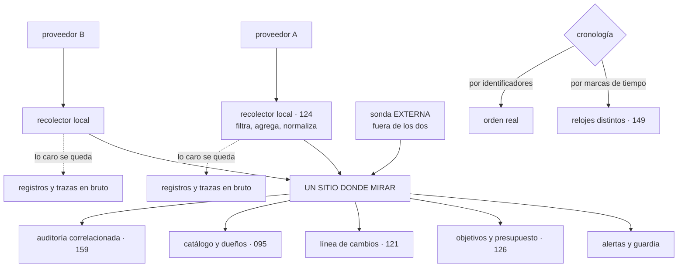

# 162 — Observabilidad y operación entre proveedores

> [← 161 · Replicación de datos, soberanía y costos de egress](../../part-13-multicloud-hybrid-disaster-recovery/161-replicacion-de-datos-soberania-y-costos-de-egress/README.md) · [Índice de la parte](../README.md) · [163 · Terraform multi-provider y separación de estados →](../../part-13-multicloud-hybrid-disaster-recovery/163-terraform-multi-provider-y-separacion-de-estados/README.md)

**Parte:** 13 — Multi-cloud, híbrido, migración y recuperación<br>
**Nivel:** experto · **Horas estimadas:** 4<br>
**Laboratorio:** `observability` · **Estado:** `EXECUTABLE_CORE`

## 🎯 Propósito

Operar dos proveedores sin duplicar lo que la parte 10 costó reducir. La clase se apoya en un principio que resuelve casi todo el problema —**un sitio donde mirar, dos sitios donde recoger**— y en su consecuencia económica, que viene de la clase 161: **no se envía telemetría en bruto de una nube a otra**. Después afronta lo que de verdad complica la operación entre proveedores: que la misma cosa se llama distinto en cada uno, que los relojes no coinciden y que **la mitad del equipo no sabe intervenir en la mitad del sistema**.

## 📚 Resultados de aprendizaje

Al finalizar podrás:

1. **Separar** lo que hay que unificar de lo que debe quedarse local.
2. **Normalizar** nombres y atributos en el punto de recogida.
3. **Construir** una cronología de incidente que no dependa de las marcas de tiempo.
4. **Repartir** la guardia cuando no todo el equipo conoce los dos proveedores.
5. **Comprobar** desde fuera de los dos, que es lo único que dice la verdad.

## 🧩 Conceptos centrales

| Concepto | Comprensión verificable |
|---|---|
| `un sitio donde mirar` | Las decisiones —alertas, objetivos, incidentes— se ven en un único lugar, aunque los datos se recojan en cada proveedor. |
| `normalización en la recogida` | Traducir nombres y atributos de cada proveedor a un vocabulario común antes de enviarlos, no al consultarlos. |
| `cronología por identificadores` | Reconstruir un incidente encadenando trazas y eventos, no ordenando por marcas de tiempo de relojes distintos. |
| `comprobación externa` | Sonda que se ejecuta fuera de los dos proveedores y dice si el usuario puede usar el sistema. |
| `formación cruzada` | Proporción del equipo capaz de intervenir en cada proveedor. Es un requisito de disponibilidad, no de carrera profesional. |
| `duplicación de herramientas` | Pagar dos veces por lo mismo en cada proveedor. Es la forma que toma aquí el coste de la parte 10. |

## 🧠 Modelo mental

Multi-cloud es una decisión de negocio y riesgo; duplicar cada componente entre proveedores rara vez es la forma más confiable o económica de lograrla.

Aplicado a esta clase, separa siempre cuatro planos: **intención** (qué necesita el usuario),
**configuración** (qué declaramos), **estado observado** (qué existe de verdad) y
**evidencia** (cómo sabemos que cumple). Confundirlos produce diseños que se ven correctos
en un diagrama pero fallan al operar.

## 🗺️ Flujo de razonamiento



## 📖 Desarrollo

### 1. Un sitio donde mirar, dos donde recoger

La respuesta ingenua al segundo proveedor es duplicarlo todo:

```text
dos consolas, dos sistemas de alertas, dos paneles, dos guardias
→ el coste que la parte 10 redujo se dobla
→ y las alertas de uno se ven en un sitio que nadie mira
```

Y el principio que lo evita:

```text
SE UNIFICAN LAS DECISIONES, NO LOS DATOS

un sitio donde mirar      alertas, objetivos, incidentes, cambios
dos sitios donde recoger  registros y trazas se quedan donde nacen
```

Y la razón económica es la clase 161: **enviar telemetría en bruto de una nube a otra se paga por gigabyte**, y la telemetría es voluminosa por naturaleza.

El reparto concreto:

```text
SE UNIFICA
  alertas y encaminamiento de guardia
  objetivos, indicadores y presupuesto de error       clase 126
  la línea de cambios de los dos proveedores          clase 121
  el catálogo de servicios y sus dueños               clase 095
  el registro de auditoría, correlacionado            clase 159
  el panel «¿está funcionando?» por servicio          clase 125
  y el canal y el documento de incidente              clase 127

SE QUEDA LOCAL
  registros en bruto                                  clase 122
  trazas completas                                    clase 124
  métricas de alta resolución
  y todo lo que tenga alta cardinalidad               clase 123
```

Y lo que se envía fuera, que es poco y barato:

```text
métricas agregadas de los indicadores del objetivo
el estado de las alertas
los eventos de cambio
un resumen por servicio
y los enlaces para poder saltar al detalle local cuando haga falta
```

Y el último punto es el que hace viable el modelo: **desde el sitio unificado se salta al detalle en el proveedor correspondiente**, en vez de traer el detalle.

Y una regla de coste que conviene fijar de antemano:

```text
el coste de observar el segundo proveedor no debe superar el 20 %
del coste de observar el primero
→ si lo supera, se está enviando en bruto algo que debería agregarse
```

### 2. Que la misma cosa se llame igual

El obstáculo práctico más constante: **cada proveedor nombra las cosas a su manera**.

```text
el identificador de una instancia
el nombre de la región y de la zona
la clave de la etiqueta de dueño
el nombre de la métrica de uso de procesador
el campo del registro que contiene la identidad
el formato de la marca de tiempo
y el modelo de recursos entero                        clase 159
```

Y si no se normaliza, ocurre lo previsible:

```text
un panel por proveedor, con métricas que no se pueden comparar
una alerta por proveedor, con umbrales distintos
y ninguna consulta que abarque los dos
```

La corrección es **normalizar en la recogida, no en la consulta**:

```text
el recolector de cada proveedor traduce a un vocabulario común
  servicio, entorno, versión, región, zona, equipo, inquilino
y añade de dónde viene: proveedor, cuenta o proyecto
```

Y el motivo de hacerlo al recoger y no al consultar:

```text
al consultar    hay que traducir en cada panel, cada alerta y cada
                consulta nueva, para siempre
al recoger      se hace una vez, en un sitio, y todo lo demás
                ve un solo vocabulario
```

Y conviene apoyarse en convenciones que ya existen en vez de inventar un vocabulario propio, que es lo que la clase 158 desaconsejaba para los proveedores y vale igual aquí.

Y dos precauciones:

```text
lo que no encaje en el vocabulario común se conserva con su nombre
  original, con prefijo de proveedor
  → no se descarta: se marca como específico

y la traducción se versiona y se prueba
  → un cambio en la traducción cambia todos los paneles a la vez
```

Y el catálogo es lo que cierra el círculo:

```text
cada servicio del catálogo dice en qué proveedor y qué cuenta vive
→ una alerta puede decir «servicio pedidos, proveedor B, equipo X»
→ y el encaminamiento de guardia funciona sin que nadie lo mantenga
  a mano                                              clase 095
```

### 3. Los relojes y la cronología

Reconstruir un incidente que atraviesa dos proveedores tiene un problema propio:

```text
cada proveedor sincroniza sus relojes con su propia fuente
desviación entre proveedores                          decenas de ms
cuando algo falla                                     segundos
```

Y ordenar una cronología por marcas de tiempo produce secuencias falsas:

```text
«el error de B ocurrió 200 ms ANTES de la petición de A que lo causó»
→ y alguien concluye que B falló solo
```

La corrección es la de la clase 124, aplicada aquí:

```text
la cronología se construye por IDENTIFICADORES, no por tiempo
  la traza enlaza la petición de A con el trabajo de B
  el evento lleva su identificador de correlación     clase 115
  y el orden lo da la relación de causa, no el reloj

y las marcas de tiempo se usan para medir duraciones DENTRO
de un mismo proveedor, no para ordenar entre ellos
```

Y dos medidas que conviene tener, porque el desajuste también rompe otras cosas:

```text
desviación de reloj medida entre proveedores, con alerta
y una prueba periódica: desajustar a propósito y ver qué falla
                                                      clases 131, 149
```

Y lo que suele romperse con desviación entre nubes:

```text
caducidad de testigos emitidos en uno y validados en otro   clase 159
firmas con ventana de validez
ordenación de eventos entre proveedores                     clase 114
y ventanas de agregación que no coinciden
```

**El incidente que atraviesa los dos** necesita además una decisión organizativa:

```text
un solo canal y un solo documento, aunque haya dos proveedores
un solo mando, que no tiene por qué conocer los dos    clase 127
y en el canal, alguien capaz de intervenir en cada uno
```

Y la última línea es la que hay que garantizar antes de que ocurra: **si a las tres de la madrugada solo hay alguien que conoce el proveedor A, la mitad del sistema no tiene respuesta**.

### 4. Guardia, coste y la comprobación externa

**La guardia** es donde la clase 157 encontró la cifra que decidió el nivel:

```text
personas capaces de operar el proveedor principal              9
personas capaces de operar el segundo                          2
```

Y las tres respuestas, en orden de eficacia:

```text
1. AUTOMATIZAR LO ESPECÍFICO DE CADA PROVEEDOR
   que el procedimiento sea el mismo aunque por debajo cambie
   → «reiniciar el servicio X» es un comando, no una consola
                                                      clase 128

2. PROCEDIMIENTOS PARA QUIEN TIENE MENOS CONTEXTO
   con comandos exactos y sin suponer familiaridad
   → y probados por alguien que no conoce ese proveedor

3. FORMACIÓN CRUZADA, MEDIDA
   no como plan de carrera, sino como requisito de disponibilidad
   → objetivo explícito: al menos N personas por proveedor
   → y se comprueba en los ensayos de la clase 131
```

Y una regla que evita el peor caso:

```text
ninguna intervención crítica debe requerir conocer un proveedor concreto
→ si la requiere, hay que automatizarla o documentarla hasta que no
→ y mientras tanto, esa persona está de guardia de hecho aunque
  no lo esté en el calendario
```

**El coste**, con las trampas propias de operar dos nubes:

```text
enviar registros o trazas en bruto de una a otra       clase 161
dos licencias del mismo tipo de herramienta
paneles duplicados que hay que mantener dos veces
retención duplicada de lo mismo
y sondas ejecutándose desde los dos proveedores contra los dos
```

Y la medida que lo controla es la de la clase 132, ahora con dos sumandos:

```text
coste de telemetría frente a coste de cómputo, por proveedor
y proporción de lo emitido que no consulta nadie, por proveedor
```

**La comprobación externa**, que es la pieza que solo tiene sentido con varios proveedores:

```text
si el sistema vive en A y B, la comprobación que dice
«¿puede el usuario usar esto?» no debe ejecutarse ni en A ni en B
→ porque si el proveedor que la ejecuta se cae, deja de haber señal
  justo cuando hace falta                             ley 13
```

Y lo que debe hacer:

```text
ejecutar el recorrido completo del usuario, no un ping
desde varias ubicaciones
con una frecuencia que permita detectar en minutos
y alertar por su propia ausencia de datos             clase 123
```

Y una comprobación adicional que casi nadie tiene y que resuelve discusiones:

```text
una sonda que compruebe la ruta ENTRE proveedores    clase 160
→ para distinguir «B está caído» de «no llegamos a B»
```

Y la lista de comprobación de la clase:

```text
☐ las decisiones están unificadas y los datos en bruto son locales
☐ no se envía telemetría en bruto entre proveedores
☐ el coste de observar el segundo no supera una fracción del primero
☐ los nombres y atributos se normalizan en la recogida
☐ lo específico se conserva con prefijo, no se descarta
☐ el catálogo dice en qué proveedor vive cada servicio
☐ la cronología de incidentes se construye por identificadores
☐ se mide la desviación de reloj entre proveedores
☐ un solo canal, un solo mando y alguien capaz de intervenir en cada uno
☐ lo específico de cada proveedor está automatizado o documentado
☐ hay objetivo medido de personas capaces por proveedor
☐ existe sonda externa a los dos, con alerta por ausencia de datos
☐ existe sonda de la ruta entre proveedores
```

Y el cierre que enlaza con la clase siguiente: para que la operación sea la misma en los dos, lo que se despliega tiene que declararse de forma comparable, y ahí aparece la capa que la clase 158 marcó como no portable. Cómo se organiza la infraestructura declarada con varios proveedores, y por qué el error es intentar un módulo común, es la materia de la clase 163.

## 🔬 Ejemplo trabajado

**CloudShop opera tres cargas en su segundo proveedor. La operación se montó allí copiando lo que había en el principal, y el resultado se descubre durante un incidente: una alerta llevaba once minutos sonando en una consola que nadie miraba.**

**El incidente que lo puso en evidencia.**

```text
02:14  la carga de los tres clientes del proveedor B empieza a fallar
02:14  se dispara una alerta en la consola nativa de B
02:25  un cliente escribe a soporte
02:31  soporte localiza a alguien de guardia
02:38  quien está de guardia no tiene acceso operativo a B
02:52  se localiza a una de las dos personas que sí
03:10  mitigado

duración                                              56 min
alerta disparada a los                                 0 min
tiempo hasta que alguien la vio                       11 min → nunca:
                                                      se supo por el cliente
```

Y el diagnóstico, con el vocabulario de esta clase:

```text
las alertas de B iban a la consola de B, no al sistema unificado
el encaminamiento de guardia no conocía las cargas de B
solo 2 de 9 personas podían intervenir
y el procedimiento suponía familiaridad con ese proveedor
```

**La unificación, y lo que costó.**

La primera propuesta fue enviar toda la telemetría de B al sistema del proveedor A:

```text
volumen de telemetría de las 3 cargas de B         1,1 TB/mes
coste de salida                                      ~88 €/mes
coste de ingesta y retención en A                   ~640 €/mes
total                                                ~728 €/mes
coste de observar el proveedor A                    1.110 €/mes
proporción                                              66 %
```

Sesenta y seis por ciento del coste del principal para tres cargas de quince. Se aplicó el reparto del apartado primero:

```text                                    todo a A         decisiones a A,
                                                          datos locales
volumen enviado                          1,1 TB/mes         14 GB/mes
coste de salida                             88 €              1 €
coste de ingesta y retención               640 €             38 €
coste local en B                              0 €           180 €
total                                       728 €           219 €
proporción sobre el principal               66 %             20 %
```

Y lo que se envía son las cuatro cosas del apartado primero:

```text
indicadores del objetivo, agregados cada 30 s
estado de las alertas
eventos de cambio                                     clase 121
resumen por servicio
y enlaces para saltar al detalle en B
```

**Lo que se unificó, y el efecto en el mismo incidente reproducido.**

```text                                          antes         después
alertas en un solo sitio                        no             sí
encaminamiento de guardia conoce B              no             sí
catálogo con proveedor y cuenta por servicio    no             sí
panel «¿está funcionando?» por servicio      dos formatos    uno
línea de cambios de los dos proveedores         no             sí

ensayo del mismo fallo
  tiempo hasta que alguien lo sabe             56 min          70 s
  tiempo hasta mitigar                         56 min         11 min
```

**La normalización, y lo que apareció.**

Al traducir a un vocabulario común en los recolectores:

```text
atributos que significaban lo mismo con nombres distintos       23
métricas equivalentes con nombres distintos                     31
etiquetas de dueño con claves distintas                          2
formatos de marca de tiempo distintos                            2
```

Y una consecuencia inesperada:

```text
al poder comparar, se descubrió que la latencia p99 de la misma
carga era 2,4× mayor en B
causa    el reparto de B no era consciente de zona    clase 161
corrección  la misma que en A, aplicada allí
latencia p99 en B                        de 410 ms a 180 ms
```

**No se podía comparar y por eso nadie lo había visto.**

**Los relojes.**

Durante la revisión del incidente, la cronología no cuadraba:

```text
según las marcas de tiempo
  02:14:03  error en B
  02:14:03,4  petición en A que lo provocó
→ el error parecía anterior a su causa

desviación medida entre los dos proveedores            310 ms
```

```text                                          antes         después
cronología construida por                marcas de tiempo   identificadores
desviación de reloj medida                      no        sí, alerta > 100 ms
comportamientos rotos por desajuste,
encontrados en el ensayo                         —              2
  → caducidad de un testigo emitido en A y validado en B
  → una ventana de agregación que no coincidía
```

**La guardia.**

```text                                          antes         después
personas capaces de operar A                     9              9
personas capaces de operar B                     2              6
objetivo declarado                          no había        ≥ 5 por proveedor
intervenciones que exigen conocer B          todas        2 de 14
  → las 12 restantes se automatizaron o se documentaron
procedimientos de B probados por alguien
que no lo conocía                              0 de 5        5 de 5
preguntas durante esas pruebas                   —             41
```

Y las cuarenta y una preguntas son la misma medida de la clase 128: **cada una era un defecto del procedimiento**, y la mayoría fueron permisos y nombres de consola.

**La comprobación externa.**

```text
sondas antes
  desde A hacia A                                sí
  desde A hacia B                                sí
  desde fuera de los dos                         no
```

Y el problema de ese montaje se vio en un ensayo:

```text
se simuló una degradación del proveedor A
→ las sondas dejaron de ejecutarse
→ y el sistema de alertas, que también estaba en A, no avisó
→ silencio total durante la caída simulada          ley 13
```

```text                                          antes         después
sonda externa a los dos                          no             sí
recorrido que ejecuta                        un ping     compra completa
ubicaciones                                      1              4
alerta por ausencia de datos de la sonda         no             sí
sonda de la ruta entre proveedores               no             sí
tiempo de detección en el ensayo repetido    no se detecta     90 s
```

Y la última fila del cuadro anterior resolvió además una discusión recurrente: **distinguir «B está caído» de «no llegamos a B»**, que en dos incidentes anteriores había costado veinte minutos cada vez.

**A los cinco meses.**

```text                                          antes         después
alertas en un solo sitio                        no             sí
coste de observar el segundo proveedor      728 €/mes      219 €/mes
proporción sobre el principal                  66 %           20 %
telemetría enviada entre nubes             1,1 TB/mes      14 GB/mes
atributos normalizados                          no        23 + 31
latencia p99 en B                            410 ms         180 ms
cronología por identificadores                  no             sí
desviación de reloj vigilada                    no             sí
personas capaces de operar B                     2              6
intervenciones que exigen conocer B            todas        2 de 14
sonda externa a los dos                         no             sí
tiempo hasta saber de un fallo en B          56 min           70 s
```

**La lección que esta clase traslada a la parte 13**: el incidente de cincuenta y seis minutos no lo causó ningún fallo del segundo proveedor: lo causó que **su alerta sonaba en una consola que nadie miraba y que solo dos personas de nueve podían intervenir**. Y al normalizar los nombres para poder comparar apareció, de regalo, que la misma carga era dos veces y media más lenta en B por el mismo problema de reparto que ya se había corregido en A: **no se podía comparar, y por eso llevaba meses sin verse**.

## 🧪 Laboratorio guiado

Ejecuta desde la raíz:

```bash
python classes/part-13-multicloud-hybrid-disaster-recovery/162-observabilidad-y-operacion-entre-proveedores/lab.py
```

El laboratorio selecciona el motor de práctica **`observability`** y produce
`lab_result.json`. El escenario, sus comprobaciones y el artefacto esperado corresponden a
esta clase; no requiere credenciales y deja explícito qué debe revalidarse en un sandbox real.

1. Lee `exercise.steps` y formula una predicción antes de ejecutar.
2. Ejecuta la práctica y verifica todos los elementos de `checks`.
3. Provoca el caso de `negative_test` y explica la señal observada.
4. Materializa `telemetria-multicloud` en `evidence/` usando la plantilla indicada.
5. Para proveedor real, sigue `sandbox.requires`, registra costo y ejecuta `destroy`.

### Evidencia esperada

El artefacto principal es telemetría correlacionada con una pregunta operativa. Además, la entrega debe incluir el comando ejecutado,
la salida estructurada y una conclusión que no exceda lo observado.

## 🏆 Reto verificable

Construye **`telemetria-multicloud`** para el caso CloudShop. Incluye una alternativa descartada,
un supuesto que pueda falsarse, una prueba de fallo y una decisión de rollback.

## ✅ Criterio de aceptación

- [ ] `lab.py` termina con código 0 y genera JSON válido.
- [ ] La entrega conecta al menos tres requisitos con mecanismos verificables.
- [ ] Existe una prueba positiva y una prueba negativa con evidencia.
- [ ] Seguridad, costo y operación aparecen como decisiones, no como anexos.
- [ ] Se declara una limitación y una condición que obligaría a revisar el diseño.
- [ ] Otra persona puede repetir el recorrido sin conocimiento tácito.

## ⚠️ Errores frecuentes

| Síntoma | Causa probable | Corrección |
|---|---|---|
| Una alerta suena en la consola del segundo proveedor y nadie la ve | Se duplicó la operación en vez de unificar las decisiones | Un solo sitio donde mirar: alertas, objetivos, incidentes y cambios unificados; los datos en bruto se quedan donde nacen. |
| Observar el segundo proveedor cuesta casi tanto como el primero | Se envía telemetría en bruto entre nubes y se paga salida, ingesta y retención | Agrega y filtra en un recolector local y envía solo indicadores, estado de alertas, cambios y enlaces. |
| No se pueden comparar las métricas de los dos proveedores | Cada uno nombra las cosas a su manera y no se normaliza | Traduce a un vocabulario común en la recogida, conserva lo específico con prefijo y versiona la traducción. |
| La cronología de un incidente sitúa el efecto antes que la causa | Se ordenó por marcas de tiempo de relojes distintos | Construye la cronología por identificadores de traza y de evento, y vigila la desviación de reloj. |
| De madrugada nadie puede intervenir en la mitad del sistema | Solo unas pocas personas conocen el segundo proveedor | Automatiza o documenta lo específico, prueba los procedimientos con quien no lo conoce y fija un objetivo medido de personas capaces por proveedor. |
| Durante una caída del proveedor principal no llega ninguna alerta | Las sondas y el sistema de alertas viven en el proveedor que se cayó | Sonda externa a los dos que ejecute el recorrido del usuario, con alerta por ausencia de datos, más una sonda de la ruta entre proveedores. |

## 🛡️ Seguridad, ética y costo

Trabaja con cuentas propias o sandboxes autorizados. No publiques secretos, identificadores
reales ni datos personales. Antes de crear recursos pagos define presupuesto, etiquetas y
comando de destrucción; después verifica que no queden recursos huérfanos. Los ejemplos
locales enseñan contratos, pero no certifican cumplimiento ni disponibilidad de producción.

## ❓ Preguntas de comprobación

1. ¿Qué se unifica y qué se queda local, y por qué?
2. ¿Por qué se normalizan los nombres en la recogida y no en la consulta?
3. ¿Por qué no se puede ordenar una cronología entre proveedores por marcas de tiempo?
4. ¿Qué tres medidas permiten que la guardia funcione con dos proveedores?
5. ¿Por qué la comprobación que dice si el sistema funciona no debe ejecutarse en ninguno de los dos?

## 🔗 Referencias

- OpenTelemetry (2025). *Semantic conventions and resource attributes* — vocabulario común y normalización. <https://opentelemetry.io/docs/specs/semconv/>
- OpenTelemetry (2025). *Collector deployment patterns* — recoger local, agregar y exportar a un destino común. <https://opentelemetry.io/docs/collector/deployment/>
- Google SRE (2025). *Monitoring across environments and synthetic probes* — comprobación externa y ausencia de datos. <https://sre.google/workbook/monitoring/>
- PagerDuty (2025). *Incident response with distributed teams* — un canal, un mando y encaminamiento por catálogo. <https://response.pagerduty.com/>
- CNCF (2025). *Observability across clusters and clouds* — patrones de agregación y federación de métricas. <https://www.cncf.io/reports/>
- Documentación oficial vigente del servicio implementado; registra URL y fecha de consulta.

---

> [Evaluación](assessment.md) · [Contrato de clase](lesson.yaml) · [Índice de la parte](../README.md)

**📥 Descargar:** [Parte 13 en PDF](../../../site/downloads/partes/manual-parte-13-multicloud-hybrid-disaster-recovery.pdf) · [Manual integral](../../../site/downloads/multi-cloud-engineering-manual-v2.0.pdf)

| Anterior | Índice | Siguiente |
|---|---|---|
| [← 161 · Replicación de datos, soberanía y costos de egress](../../part-13-multicloud-hybrid-disaster-recovery/161-replicacion-de-datos-soberania-y-costos-de-egress/README.md) | [Parte 13](../README.md) · [Programa](../../README.md) | [163 · Terraform multi-provider y separación de estados →](../../part-13-multicloud-hybrid-disaster-recovery/163-terraform-multi-provider-y-separacion-de-estados/README.md) |
