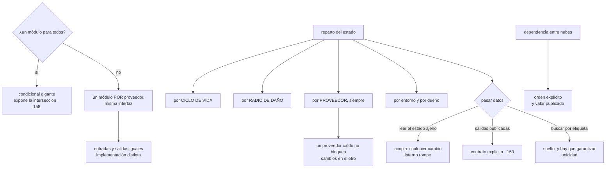

# 163 — Terraform multi-provider y separación de estados

> [← Clase anterior](../../part-13-multicloud-hybrid-disaster-recovery/162-observabilidad-y-operacion-entre-proveedores/README.md) · [Índice de la parte](../README.md) · [Clase siguiente →](../../part-13-multicloud-hybrid-disaster-recovery/164-flotas-kubernetes-y-politicas-comunes/README.md)

**Parte:** 13 — Multi-cloud, híbrido, migración y recuperación<br>
**Nivel:** experto · **Horas estimadas:** 4<br>
**Laboratorio:** `iac` · **Estado:** `EXECUTABLE_CORE`

## 🎯 Propósito

Declarar infraestructura en varios proveedores sin cometer el error que la clase 158 ya describió en su forma general: **intentar un módulo común que sirva para todos**. La clase muestra por qué eso produce un condicional gigante que expone la intersección, propone la alternativa —un módulo por proveedor con la misma interfaz— y dedica el resto a lo que de verdad decide si esto se puede operar: **cómo se reparte el estado**, que es lo que fija el radio de daño de cada cambio y qué se puede aplicar cuando un proveedor no responde.

## 📚 Resultados de aprendizaje

Al finalizar podrás:

1. **Rechazar** el módulo común y sustituirlo por uno por proveedor con la misma interfaz.
2. **Repartir** el estado por ciclo de vida, radio de daño, proveedor y dueño.
3. **Pasar** datos entre estados sin acoplarlos de forma rígida.
4. **Configurar** credenciales por proveedor con identidad federada y acotada.
5. **Detectar** deriva y ordenar dependencias que cruzan proveedores.

## 🧩 Conceptos centrales

| Concepto | Comprensión verificable |
|---|---|
| `módulo por proveedor` | Implementación específica con la misma interfaz de entradas y salidas que su equivalente en otro proveedor. |
| `estado` | Registro de lo que la herramienta cree haber creado. Su alcance decide el radio de daño y quién puede aplicar cambios. |
| `radio de daño del estado` | Todo lo que un solo aplicado erróneo puede destruir. Es el criterio principal para repartir. |
| `salidas publicadas` | Contrato explícito de lo que un estado expone a los demás. Sustituye a leer el estado ajeno entero. |
| `proveedor con alias` | Varias configuraciones del mismo o de distintos proveedores en un mismo componente, cada una con su identidad. |
| `dependencia entre proveedores` | Un recurso de un proveedor que necesita un valor creado en otro. Se resuelve con orden explícito y datos publicados, no con un estado común. |

## 🧠 Modelo mental

Multi-cloud es una decisión de negocio y riesgo; duplicar cada componente entre proveedores rara vez es la forma más confiable o económica de lograrla.

Aplicado a esta clase, separa siempre cuatro planos: **intención** (qué necesita el usuario),
**configuración** (qué declaramos), **estado observado** (qué existe de verdad) y
**evidencia** (cómo sabemos que cumple). Confundirlos produce diseños que se ven correctos
en un diagrama pero fallan al operar.

## 🗺️ Flujo de razonamiento



## 📖 Desarrollo

### 1. Un módulo por proveedor, no uno para todos

La propuesta aparece siempre: **un módulo «base de datos» que sirva para los dos proveedores**, con una variable que diga cuál.

Y falla por los mismos motivos que la capa de abstracción de la clase 158, en versión declarativa:

```text
los recursos no tienen la misma forma
  distintos campos obligatorios
  distinta forma de expresar red, copias, cifrado y permisos
  distintos valores por defecto y distintas unidades

→ el módulo se llena de condicionales
→ y solo puede exponer lo que existe en los dos
→ es decir, el mínimo común denominador                clase 157
```

Y la alternativa, que es la de siempre en este programa:

```text
UN MÓDULO POR PROVEEDOR, CON LA MISMA INTERFAZ

entradas iguales    nombre, tamaño, entorno, retención, etiquetas
salidas iguales     punto de acceso, identificador, nombre del secreto
implementación      distinta, y usando a fondo lo que ofrece cada uno
```

Y lo que se gana:

```text
quien lo usa escribe lo mismo en los dos casos
cada módulo aprovecha lo mejor de su proveedor
no hay condicionales
y se pueden probar por separado                        clase 090
```

Y la disciplina que lo sostiene:

```text
las interfaces se documentan y se versionan como contratos  clase 153
y hay una prueba que comprueba que las dos ofrecen las mismas
  entradas y salidas
→ sin esa prueba, divergen en tres meses
```

Y la excepción razonable, para no caer en el extremo contrario:

```text
lo que sí puede ser común
  la convención de nombres y etiquetas
  la validación de entradas
  el cálculo de valores derivados
→ eso vive en un módulo auxiliar sin recursos, y lo usan los dos
```

Y una nota sobre las versiones de los complementos de proveedor, que es la clase 138 aplicada aquí:

```text
se fijan con huella, como cualquier dependencia
y se actualizan con cadencia, no cuando algo falla
→ una actualización de complemento puede cambiar el plan sin que
  nadie haya tocado nada
```

### 2. Repartir el estado

El estado es el registro de lo que la herramienta cree haber creado, y **su alcance decide dos cosas críticas**:

```text
el RADIO DE DAÑO de un aplicado erróneo
y qué se puede cambiar cuando algo no responde
```

Los cuatro criterios de reparto, por orden de importancia:

```text
1. POR PROVEEDOR, SIEMPRE
   un estado que abarca dos proveedores significa que
   una incidencia en uno bloquea los cambios en el otro
   → y el aplicado falla a medias, dejando lo aplicado sin registrar

2. POR RADIO DE DAÑO
   ¿qué estoy dispuesto a romper de una vez?
   → la red base y la identidad, en estados propios y muy revisados
   → una carga concreta, en el suyo

3. POR CICLO DE VIDA
   lo que cambia junto, junto; lo que cambia a ritmos distintos, aparte
   → la red cambia dos veces al año; el servicio, a diario

4. POR DUEÑO
   cada estado tiene un equipo que lo aplica                 clase 095
```

Y el reparto típico que sale de aplicarlos:

```text
por proveedor y entorno
  cimientos      organización, cuentas, identidad, políticas
  red            rangos, subredes, salida, resolución de nombres
  datos          bases, almacenes, claves
  plataforma     clúster, registro, herramientas comunes
  por servicio   una por carga
```

Y el compromiso que hay que aceptar, que es un traslado de la clase 155:

```text
más estados      menos radio de daño, más coordinación entre ellos
menos estados    más atomicidad, y un error afecta a más
```

Y dos señales de que el reparto está mal:

```text
un aplicado rutinario tarda más de unos minutos en planificar
  → el estado abarca demasiado

un cambio pequeño exige aplicar cuatro estados en orden
  → el reparto no sigue el ciclo de vida
```

**Lo que debe estar en un estado aparte y muy protegido**, con la disciplina de la clase 144:

```text
lo que no se puede recrear: bases con datos, claves        clase 136
lo que romperlo deja sin acceso: identidad y red
y lo que borrarlo es irreversible
→ con protección contra destrucción y aprobación de dos personas
```

Y el almacenamiento del propio estado, que es un recurso crítico:

```text
remoto, versionado y con bloqueo                          clase 087
cifrado, y con acceso restringido: contiene datos sensibles
y en el proveedor al que gobierna, para no depender del otro
```

La última línea importa: **guardar el estado del proveedor B en el proveedor A significa que una caída de A impide arreglar B**.

### 3. Pasar datos entre estados

Con el estado repartido, un estado necesita valores creados por otro. Tres formas, de más acoplada a menos:

```text
LEER EL ESTADO AJENO DIRECTAMENTE
  + simple
  − acopla: cualquier reorganización interna del otro rompe
  − y exige permiso de lectura sobre un fichero con datos sensibles

SALIDAS PUBLICADAS COMO CONTRATO
  el estado productor declara qué expone, con nombres estables
  el consumidor lee solo eso
  → es la clase 153 aplicada a la infraestructura
  → y permite cambiar el interior sin romper a nadie

BUSCAR POR ETIQUETA O POR NOMBRE
  el consumidor localiza el recurso por su etiqueta de servicio
  + sin acoplamiento a ningún estado
  − hay que garantizar unicidad y que la etiqueta no cambie
  − y falla en el momento de aplicar, no en el de planificar
```

Y la recomendación práctica:

```text
dentro de un mismo dueño y entorno      salidas publicadas
entre equipos distintos                 salidas publicadas, versionadas
entre proveedores                       valores explícitos, pasados
                                        como variables
```

Y la última merece detalle, porque es el caso propio de esta clase:

```text
un registro de nombres en A que apunta a un balanceador de B

mal   un estado que abarque los dos, para poder referenciarlo
bien  el estado de B publica la dirección
      un paso de la canalización la toma y la pasa como variable
      al estado de A
      → dos aplicados, en orden, con el valor viajando entre ellos
```

Y la regla que evita el enredo:

```text
las dependencias entre estados forman un grafo SIN CICLOS,
y está dibujado
→ si A necesita algo de B y B algo de A, hay que romper el ciclo
  con un valor fijado de antemano —un nombre, un rango— en vez
  de uno generado
```

**Las credenciales**, que con varios proveedores tienen su propia trampa:

```text
cada bloque de proveedor lleva su identidad
y esa identidad viene de la federación de la canalización   clases 098, 159

lo que hay que comprobar
  ¿la identidad de la canalización está acotada por rama y entorno?
  ¿el estado de producción solo se puede aplicar desde el flujo
    de producción?
  ¿alguien puede aplicar a mano con credenciales personales?
```

La última debería ser no, y con el bucle de reconciliación de la clase 103 lo es por construcción.

### 4. Deriva, orden y pruebas

**La deriva** de la clase 090 se multiplica con varios estados y proveedores:

```text
planificar de forma programada cada estado, sin aplicar
y alertar por diferencias, con la excepción de los campos que
  gestionan otros controladores                        clase 103
```

Y lo que cambia con dos proveedores:

```text
las diferencias no son comparables entre sí: cada complemento
  las expresa a su manera
→ conviene normalizar el resultado a «cuántos recursos difieren
  y de qué tipo», que sí se puede comparar y vigilar    clase 162
```

Y la señal que la ley 13 exige, y que aquí se duplica:

```text
alerta por ANTIGÜEDAD de la última planificación correcta,
por estado y por proveedor
→ un estado que dejó de planificarse no da ningún error
```

**El orden de aplicación** entre estados hay que declararlo:

```text
cimientos → red → datos → plataforma → servicios
```

Y con dos proveedores, el orden cruza:

```text
cimientos de A → cimientos de B → red de A → red de B → …
```

Y la forma de gestionarlo sin construir un orquestador propio:

```text
la canalización aplica en orden, por etapas               clase 099
cada etapa publica sus salidas
y un fallo en una etapa detiene las siguientes
→ y hay que poder reanudar desde donde falló, no desde el principio
```

**Las pruebas**, que son las de la clase 090 con una adición:

```text
análisis del plan antes de aplicar                        clase 091
  → ningún borrado de recurso con datos, ninguna región no autorizada
comprobación de que los módulos equivalentes tienen la misma interfaz
entorno efímero que crea y destruye de verdad             clase 104
  → en los dos proveedores, no solo en el principal
y prueba de portabilidad: que el módulo del segundo proveedor
  se aplica limpio                                        clase 158
```

Y una comprobación que evita sorpresas caras:

```text
en el plan, avisar cuando un cambio implique DESTRUIR Y RECREAR
→ es la ley 14 hecha visible: hay campos que no se pueden cambiar
  en sitio, y el plan lo dice si alguien lo lee
→ y con datos dentro, eso es una pérdida
```

Y la lista de comprobación de la clase:

```text
☐ no existe un módulo común para varios proveedores
☐ los módulos equivalentes tienen la misma interfaz, comprobada
☐ las versiones de los complementos están fijadas con huella
☐ el estado está repartido por proveedor, radio de daño, ciclo de vida y dueño
☐ ningún estado abarca dos proveedores
☐ el estado de cada proveedor se guarda en ese proveedor
☐ el estado está cifrado, versionado, con bloqueo y acceso restringido
☐ los datos entre estados pasan por salidas publicadas o variables
☐ el grafo de dependencias entre estados no tiene ciclos y está dibujado
☐ cada bloque de proveedor usa identidad federada y acotada
☐ nadie aplica a mano con credenciales personales
☐ hay planificación programada por estado y alerta por antigüedad
☐ el plan avisa de destrucciones y recreaciones
☐ los entornos efímeros se crean también en el segundo proveedor
```

Y el cierre que enlaza con la clase siguiente: con la infraestructura declarada por proveedor, queda la capa que sí es común y que puede acabar siendo una flota difícil de gobernar: varios clústeres en varios proveedores, con las mismas políticas. Es la materia de la clase 164.

## 🔬 Ejemplo trabajado

**CloudShop declara infraestructura en dos proveedores. Empieza con un módulo común y un estado único, y llega a nueve estados y módulos separados tras dos incidentes que explican por qué.**

**El módulo común, y por qué se abandonó.**

```text
intento: un módulo «base de datos» con una variable de proveedor

líneas del módulo                                            410
de ellas, condicionales por proveedor                        240   (59 %)
parámetros expuestos                                          14
parámetros disponibles en el proveedor A                      41
parámetros disponibles en el proveedor B                      37
```

**Catorce de cuarenta y uno**: el módulo exponía la intersección, y las funciones específicas de cada proveedor quedaban inaccesibles.

Y el fallo que lo cerró:

```text
al añadir una opción de copia disponible solo en A,
hubo que añadir un condicional más y una variable que en B
se ignoraba en silencio
→ alguien la usó pensando que hacía algo
→ una carga de B estuvo 3 meses sin la retención que creía tener
```

```text                                    módulo común     dos módulos
líneas totales                              410              180 + 165
condicionales por proveedor                 240                0
parámetros expuestos                         14              41 y 37
variables ignoradas en silencio               3                0
prueba de interfaz equivalente               no               sí
```

Y la prueba de interfaz, que se ejecuta en cada cambio:

```text
comprueba que los dos módulos aceptan las mismas 9 entradas
y devuelven las mismas 5 salidas
divergencias detectadas en 8 meses                             4
  → todas, alguien añadiendo una entrada a uno solo
```

**El estado único, y los dos incidentes.**

```text
situación inicial   un estado por entorno, abarcando los dos proveedores
recursos en el estado de producción                          1.180
tiempo de planificación                                     6 min 40
```

**Incidente 1: un proveedor caído bloquea el otro.**

```text
10:20  incidencia en el segundo proveedor: su API no responde
10:22  hay que aplicar un cambio urgente en el PRIMERO
10:22  el plan falla: no puede leer el estado de los recursos de B
10:22  no se puede aplicar nada, en ninguno de los dos
11:40  se resuelve la incidencia de B

tiempo sin poder cambiar nada                              1 h 18
cambio urgente que esperaba                    una regla de cortafuegos
```

**Incidente 2: un aplicado erróneo con radio de daño enorme.**

```text
un cambio en el módulo de red se aplicó sobre el estado de producción
el plan proponía destruir y recrear 3 subredes
nadie leyó el plan completo: tenía 340 líneas
recursos destruidos                                             41
tiempo de recuperación                                      2 h 10
```

**El reparto resultante.**

```text
estados, tras el reparto                                        9
  proveedor A: cimientos, red, datos, plataforma, 3 servicios
  proveedor B: cimientos, red y las 3 cargas en un estado por carga

recursos por estado, mediana                                  110
tiempo de planificación, mediana                            41 s
radio de daño del mayor                              red de un entorno
```

```text                                          antes         después
estados                                          3              9
estados que abarcan dos proveedores              3              0
tiempo de planificación                       6 min 40         41 s
un proveedor caído bloquea el otro              sí             no
líneas del plan de un cambio típico            340             28
recursos destruidos por error              41 (una vez)         0
```

Y la protección añadida sobre los estados críticos:

```text
cimientos, red y datos
  protección contra destrucción en los recursos con datos
  aprobación de dos personas para aplicar
  y aviso destacado en el plan cuando hay destrucción y recreación

planes con destrucción detectados en 8 meses                    7
  de ellos, intencionados                                       2
  de ellos, errores detenidos por el aviso                      5
```

**Cinco destrucciones evitadas** por un aviso que antes se perdía entre trescientas cuarenta líneas.

**Los datos entre estados.**

La primera versión leía el estado ajeno directamente:

```text
lecturas de estado ajeno                                        14
roturas al reorganizar un estado                                 3
  → un recurso renombrado internamente rompía a dos consumidores
```

Y el cambio a salidas publicadas:

```text                                    leer el estado    salidas publicadas
lo que expone                            todo el estado    5-9 valores
roturas al reorganizar el interior            3                 0
permiso necesario                     lectura del fichero  lectura de las salidas
versionado                                    no                sí
```

**La dependencia entre proveedores.**

El caso concreto: un registro de nombres en A que apunta al balanceador de B.

```text
mal   un estado que abarcara los dos, para poder referenciarlo
      → era exactamente lo que causó el incidente 1

bien  el estado de B publica la dirección del balanceador
      la canalización la toma y la pasa como variable al estado de A
      orden: B primero, A después
```

```text
etapas de la canalización                                        6
orden declarado                                                 sí
reanudación desde la etapa fallida                              sí
dependencias entre estados                                      11
ciclos en el grafo                                               0
  → hubo 1, resuelto fijando el rango de red de antemano en vez
    de generarlo
```

**Las credenciales y la deriva.**

```text                                          antes         después
identidad por proveedor                    clave estática   federada  clase 159
acotada por rama y entorno                      no             sí
aplicados a mano con credenciales personales    4 / mes          0
planificación programada por estado             no        cada 6 h, 9 estados
alerta por antigüedad de planificación          no             sí
deriva detectada en 8 meses                      —             19
  de ellas, cambios manuales                     —              4
  de ellas, campos de otros controladores        —             15 → excluidos
```

Y el estado propio, guardado donde corresponde:

```text                                          antes         después
estado de B guardado en                         A              B
qué pasaba si A caía                   no se podía arreglar B   nada
cifrado, versionado y con bloqueo            parcial          sí, los 9
acceso al fichero de estado                  4 equipos       1 equipo por estado
```

**A los ocho meses.**

```text                                          antes         después
módulos comunes multiproveedor                   1              0
módulos por proveedor con interfaz igual         0              2 pares
variables ignoradas en silencio                  3              0
estados                                          3              9
estados que abarcan dos proveedores              3              0
tiempo de planificación                       6 min 40         41 s
líneas del plan de un cambio típico            340             28
destrucciones erróneas detenidas por aviso       0              5
lecturas de estado ajeno                        14              0
ciclos en el grafo de dependencias               1              0
aplicados a mano                             4 / mes           0
estados con planificación programada          0 de 3         9 de 9
```

**La lección que esta clase traslada a la parte 13**: el módulo común exponía **catorce parámetros de los cuarenta y uno disponibles** y aceptaba en silencio variables que en un proveedor no hacían nada, lo que dejó una carga tres meses sin la retención que creía tener. Y el reparto del estado no se hizo por elegancia: se hizo porque **una incidencia en un proveedor impidió durante setenta y ocho minutos aplicar un cambio urgente en el otro**, que es exactamente el acoplamiento que un estado compartido introduce sin que nadie lo declare.

## 🧪 Laboratorio guiado

Ejecuta desde la raíz:

```bash
python classes/part-13-multicloud-hybrid-disaster-recovery/163-terraform-multi-provider-y-separacion-de-estados/lab.py
```

El laboratorio selecciona el motor de práctica **`iac`** y produce
`lab_result.json`. El escenario, sus comprobaciones y el artefacto esperado corresponden a
esta clase; no requiere credenciales y deja explícito qué debe revalidarse en un sandbox real.

1. Lee `exercise.steps` y formula una predicción antes de ejecutar.
2. Ejecuta la práctica y verifica todos los elementos de `checks`.
3. Provoca el caso de `negative_test` y explica la señal observada.
4. Materializa `iac-multicloud` en `evidence/` usando la plantilla indicada.
5. Para proveedor real, sigue `sandbox.requires`, registra costo y ejecuta `destroy`.

### Evidencia esperada

El artefacto principal es un plan reproducible sin secretos ni cambios inesperados. Además, la entrega debe incluir el comando ejecutado,
la salida estructurada y una conclusión que no exceda lo observado.

## 🏆 Reto verificable

Construye **`iac-multicloud`** para el caso CloudShop. Incluye una alternativa descartada,
un supuesto que pueda falsarse, una prueba de fallo y una decisión de rollback.

## ✅ Criterio de aceptación

- [ ] `lab.py` termina con código 0 y genera JSON válido.
- [ ] La entrega conecta al menos tres requisitos con mecanismos verificables.
- [ ] Existe una prueba positiva y una prueba negativa con evidencia.
- [ ] Seguridad, costo y operación aparecen como decisiones, no como anexos.
- [ ] Se declara una limitación y una condición que obligaría a revisar el diseño.
- [ ] Otra persona puede repetir el recorrido sin conocimiento tácito.

## ⚠️ Errores frecuentes

| Síntoma | Causa probable | Corrección |
|---|---|---|
| Un módulo multiproveedor se llena de condicionales y expone pocas opciones | Se intentó abstraer recursos con formas distintas | Un módulo por proveedor con la misma interfaz de entradas y salidas, y una prueba que compruebe que siguen siendo equivalentes. |
| Una variable se acepta y no hace nada en uno de los proveedores | El módulo común la ignora en silencio | Módulos separados que fallen ante una entrada desconocida, en vez de ignorarla. |
| Una incidencia en un proveedor impide aplicar cambios en el otro | Un estado abarca los dos | Reparte el estado por proveedor siempre, y guarda el estado de cada uno en su propio proveedor. |
| Un aplicado erróneo destruye decenas de recursos | El estado abarca demasiado y el plan es tan largo que nadie lo lee | Reparte por radio de daño y ciclo de vida, protege los recursos con datos y destaca las destrucciones en el plan. |
| Reorganizar un estado rompe a otros | Los consumidores leen el estado ajeno completo | Publica salidas con nombres estables y versionadas, y lee solo eso. |
| Un estado deja de planificarse y nadie se entera | Ley 13: no planificar no produce error | Planificación programada por estado con alerta por antigüedad de la última ejecución correcta. |

## 🛡️ Seguridad, ética y costo

Trabaja con cuentas propias o sandboxes autorizados. No publiques secretos, identificadores
reales ni datos personales. Antes de crear recursos pagos define presupuesto, etiquetas y
comando de destrucción; después verifica que no queden recursos huérfanos. Los ejemplos
locales enseñan contratos, pero no certifican cumplimiento ni disponibilidad de producción.

## ❓ Preguntas de comprobación

1. ¿Por qué falla un módulo común para varios proveedores y qué lo sustituye?
2. ¿Cuáles son los cuatro criterios para repartir el estado y cuál es innegociable?
3. ¿Por qué el estado de un proveedor debe guardarse en ese proveedor?
4. ¿Qué tres formas hay de pasar datos entre estados y cuál se recomienda entre equipos?
5. ¿Cómo se resuelve una dependencia entre proveedores sin un estado común?

## 🔗 Referencias

- HashiCorp (2025). *Terraform: multiple provider configurations and aliases* — varios proveedores en una misma configuración. <https://developer.hashicorp.com/terraform/language/providers/configuration>
- HashiCorp (2025). *State: remote backends, locking and separation* — almacenamiento, bloqueo y reparto del estado. <https://developer.hashicorp.com/terraform/language/state/remote>
- HashiCorp (2025). *Module composition and interfaces* — módulos con interfaces estables en vez de módulos condicionales. <https://developer.hashicorp.com/terraform/language/modules/develop/composition>
- Brikman, Y. (2022). *Terraform: Up & Running*, caps. 3 y 8 — reparto de estados y dependencias entre ellos. <https://www.terraformupandrunning.com/>
- Open Policy Agent (2025). *Policy checks on infrastructure plans* — análisis del plan antes de aplicar. <https://www.openpolicyagent.org/docs/latest/terraform/>
- Documentación oficial vigente del servicio implementado; registra URL y fecha de consulta.

---

> [Evaluación](assessment.md) · [Contrato de clase](lesson.yaml) · [Índice de la parte](../README.md)
