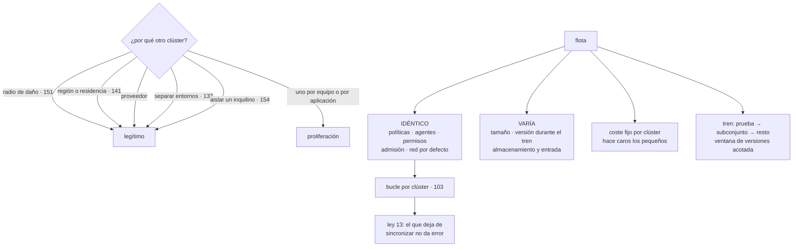

# 164 — Flotas Kubernetes y políticas comunes

> [← Clase anterior](../../part-13-multicloud-hybrid-disaster-recovery/163-terraform-multi-provider-y-separacion-de-estados/README.md) · [Índice de la parte](../README.md) · [Clase siguiente →](../../part-13-multicloud-hybrid-disaster-recovery/165-nube-hibrida-edge-y-conectividad-privada/README.md)

**Parte:** 13 — Multi-cloud, híbrido, migración y recuperación<br>
**Nivel:** experto · **Horas estimadas:** 4<br>
**Laboratorio:** `kubernetes` · **Estado:** `EXECUTABLE_CORE`

## 🎯 Propósito

Gobernar varios clústeres repartidos entre proveedores, regiones y entornos, cuando el coste de operarlos se multiplica por su número salvo que algo los mantenga uniformes. La clase separa los motivos legítimos para tener muchos de la proliferación accidental, fija **qué debe ser idéntico en todos y qué puede variar**, y desarrolla los dos problemas que definen una flota: **el coste fijo de cada clúster**, que hace caros los pequeños, y **las actualizaciones**, donde la aspiración de tener la misma versión en todas partes es imposible y lo alcanzable es una ventana acotada.

## 📚 Resultados de aprendizaje

Al finalizar podrás:

1. **Justificar** cada clúster por un motivo, y reconocer la proliferación accidental.
2. **Separar** lo que debe ser idéntico en la flota de lo que puede variar.
3. **Aplicar** configuración y políticas a un conjunto seleccionado por etiquetas.
4. **Gestionar** actualizaciones con una ventana de versiones, no con una versión única.
5. **Calcular** el coste fijo por clúster y decidir con él.

## 🧩 Conceptos centrales

| Concepto | Comprensión verificable |
|---|---|
| `flota` | Conjunto de clústeres gobernados como una unidad, con configuración y políticas comunes aplicadas a grupos seleccionados. |
| `coste fijo por clúster` | Lo que cuesta un clúster antes de ejecutar nada: plano de control, agentes, cargas de sistema y su parte de operación. |
| `ventana de versiones` | Diferencia máxima admitida entre la versión más antigua y la más reciente de la flota. Sustituye a la versión única, que es inalcanzable. |
| `tren de actualización` | Orden por el que una versión recorre la flota: clúster de prueba, un subconjunto y el resto. |
| `línea base` | Conjunto de recursos que existe en todos los clústeres: políticas, agentes, permisos y reglas de admisión. |
| `colocación explícita` | Decidir en qué clúster corre cada carga de forma declarada, en vez de repartirla automáticamente entre clústeres. |

## 🧠 Modelo mental

Multi-cloud es una decisión de negocio y riesgo; duplicar cada componente entre proveedores rara vez es la forma más confiable o económica de lograrla.

Aplicado a esta clase, separa siempre cuatro planos: **intención** (qué necesita el usuario),
**configuración** (qué declaramos), **estado observado** (qué existe de verdad) y
**evidencia** (cómo sabemos que cumple). Confundirlos produce diseños que se ven correctos
en un diagrama pero fallan al operar.

## 🗺️ Flujo de razonamiento



## 📖 Desarrollo

### 1. Por qué hay muchos, y cuándo sobran

Los motivos legítimos para tener varios clústeres, cada uno con su equivalente en este programa:

```text
RADIO DE DAÑO             un fallo grave afecta a una parte     clase 151
REGIÓN O RESIDENCIA       el dato no puede salir de un sitio    clase 141
PROVEEDOR                 se usa más de uno                     clase 157
SEPARACIÓN DE ENTORNOS    producción no comparte plano de control
                          con desarrollo                        clase 133
AISLAMIENTO DE INQUILINO  un cliente exige separación           clase 154
ACTUALIZACIÓN ESCALONADA  hace falta uno por delante para probar
```

Y los que no lo son:

```text
uno por equipo            se resuelve con espacios de nombres y permisos
uno por aplicación        el coste fijo no lo justifica
«por si acaso»            aparece en el inventario dos años después
y el que nadie recuerda por qué existe                          ley 20
```

Y el criterio que ordena la decisión, que es el de la clase 148 aplicado aquí:

```text
cada clúster tiene un coste fijo
y cada uno necesita un motivo escrito
→ si no hay motivo, se consolida
```

**El coste fijo**, que es lo que hace caros los clústeres pequeños:

```text
plano de control gestionado                       coste mensual fijo
cargas de sistema: red, resolución de nombres,
  métricas, registro, agente de políticas         2-4 nodos equivalentes
agentes de seguridad y de observabilidad          por nodo
margen para tolerar la caída de un nodo           1 nodo como mínimo
la parte de operación: actualizaciones, ensayos,
  procedimientos y guardia                        el mayor de todos
```

Y la aritmética que decide:

```text
coste fijo por clúster, orden de magnitud    equivalente a 3-5 nodos
un clúster con 4 nodos de carga útil          más del 50 % es sistema
un clúster con 40 nodos                        ~10 %
```

Y de ahí la regla práctica:

```text
pocos clústeres grandes salen mucho más baratos que muchos pequeños
→ y el motivo para tener uno pequeño tiene que valer más que su
  coste fijo
→ un clúster por cliente solo se sostiene si el cliente lo paga
                                                     clase 154
```

Y una consecuencia que conviene anticipar: **el número de clústeres tiende a crecer y nunca a bajar**, porque nadie propone consolidar. La revisión periódica del inventario, con el motivo de cada uno, es lo único que lo contiene.

### 2. Qué es idéntico y qué varía

Una flota se gobierna decidiendo esto y no volviendo a discutirlo:

```text
IDÉNTICO EN TODOS
  reglas de admisión: firma verificada, campos obligatorios  clases 067, 101
  políticas de red por defecto: denegar entre espacios       clase 135
  modelo de permisos y grupos                                clase 159
  agentes de observabilidad y su configuración               clase 162
  etiquetas obligatorias de dueño y entorno                  clase 142
  límites y cuotas por espacio de nombres                    clase 078
  y las cinco fronteras absolutas                            clase 144

PUEDE VARIAR
  número y tamaño de nodos
  versión, durante el paso del tren de actualización
  clase de almacenamiento y controlador de entrada
  configuración específica del proveedor
  y las cargas que corren en cada uno
```

Y lo que hace que lo idéntico siga siéndolo:

```text
se declara una vez y se aplica a un CONJUNTO seleccionado por etiquetas
  «todos los de producción»
  «todos los del proveedor B»
  «todos los que sirven a clientes europeos»
→ y añadir un clúster con esas etiquetas lo incorpora solo
```

Y la advertencia que arrastra, porque esto es la clase 103 multiplicada:

```text
cada clúster tiene su bucle de reconciliación
→ un clúster que deja de sincronizar NO da ningún error   ley 13
→ y se queda con la configuración de hace semanas, incluidas
  las políticas de seguridad
```

Y por eso la señal obligatoria es la misma de la clase 103, ahora por clúster:

```text
antigüedad de la última reconciliación correcta, POR CLÚSTER
y un panel que muestre, para cada uno, si está al día
```

Y una comprobación que va más allá y que casi nadie hace:

```text
no basta con que el bucle diga que aplicó
hay que COMPROBAR EL RESULTADO en cada clúster
  ¿existe la regla de admisión?
  ¿está la política de red por defecto?
  ¿se rechaza una imagen sin firmar?
→ son las pruebas negativas de la clase 144, ejecutadas en TODOS
```

Y el motivo: **un bucle puede estar sincronizado y la política no estar activa**, porque un componente falló al arrancar o porque alguien creó una excepción local.

### 3. Actualizar una flota

Aquí está la carga operativa real, y empieza por aceptar algo:

```text
LA MISMA VERSIÓN EN TODAS PARTES ES INALCANZABLE
  los proveedores publican y retiran versiones en calendarios distintos
  las actualizaciones del plano de control gestionado se imponen
  y una flota de nueve clústeres nunca está toda igual
```

Lo alcanzable es acotar la diferencia:

```text
VENTANA DE VERSIONES
  «entre la más antigua y la más reciente, como máximo una versión menor»
→ y eso sí se puede vigilar y hacer cumplir
```

Y el orden en que una versión recorre la flota:

```text
TREN DE ACTUALIZACIÓN
  1. un clúster de prueba, sin tráfico real            días
  2. un clúster de producción de bajo riesgo           1 semana
  3. el resto, por grupos                              2-3 semanas
→ y entre etapas, tiempo suficiente para que aparezca lo que falla
```

Y lo que hay que comprobar en cada etapa, más allá de que arranque:

```text
las cargas siguen funcionando: canario y objetivos     clases 102, 126
las API que se usan siguen existiendo
  → las versiones retiran API, y una carga que las use dejará de aplicar
los complementos y controladores son compatibles
y los agentes de observabilidad y seguridad siguen reportando
```

Y la comprobación que ahorra la mayoría de los disgustos:

```text
antes de actualizar, buscar en TODOS los clústeres el uso de API
que la versión nueva retira
→ se puede hacer con las herramientas del propio orquestador
→ y lo que aparece siempre son manifiestos antiguos y complementos
  de terceros
```

Y la parte que se olvida:

```text
los nodos se actualizan aparte del plano de control
→ y la diferencia entre ambos tiene un límite admitido
→ superarlo produce fallos difíciles de diagnosticar
```

Y el ensayo correspondiente, del catálogo de la clase 131:

```text
actualizar un clúster de prueba y comprobar que las cargas
sobreviven al drenaje de nodos
→ y ahí se descubre quién no tolera que le muevan las instancias:
  ausencia de presupuesto de interrupción, terminación sucia
  o estado local escondido                            clases 079, 146
```

Y una cifra que conviene tener para dimensionar el esfuerzo:

```text
actualizaciones al año por clúster                     3-4
clústeres                                              9
actualizaciones al año en total                        27-36
→ es la carga que justifica automatizar el tren entero
```

### 4. Colocar cargas y medir la flota

**Dónde corre cada carga** conviene decidirlo de forma explícita:

```text
COLOCACIÓN EXPLÍCITA
  la declaración dice a qué clúster o grupo va                clase 103
  + previsible, auditable y fácil de razonar
  − hay que decidirlo

REPARTO AUTOMÁTICO ENTRE CLÚSTERES
  un componente decide dónde colocar según capacidad
  + aprovecha mejor
  − la carga puede moverse sin que nadie lo espere
  − los datos NO se mueven con ella                           ley 21
  − y el diagnóstico se complica: «¿dónde está corriendo esto?»
```

Y la posición honesta: **el reparto automático entre clústeres rara vez compensa**, porque el estado y la latencia atan la carga a un sitio, y porque el aprovechamiento se consigue mejor con menos clústeres y más grandes.

Donde sí encaja algo parecido:

```text
la misma carga desplegada en VARIOS clústeres a la vez, con reparto
de tráfico por delante
→ eso no es colocación automática: es replicación declarada
→ y es la base del activo-activo de la clase 168
```

**Lo que hay que medir de una flota**, además de lo de cada clúster:

```text
clústeres, y el motivo escrito de cada uno
antigüedad de la última reconciliación, por clúster
resultado de las pruebas negativas, por clúster
versión del plano de control y de los nodos, y la ventana
clústeres fuera de la ventana de versiones
coste fijo por clúster y proporción sobre su coste total
cargas por clúster y aprovechamiento
y clústeres sin ninguna carga                                ley 20
```

La última suele dar sorpresas: **un clúster vacío sigue costando su parte fija**.

Y el gobierno que mantiene la flota acotada:

```text
crear un clúster exige un motivo del catálogo y un dueño
cada clúster se revisa al menos una vez al año
y el que no tiene motivo vigente se consolida o se apaga
```

Y la lista de comprobación de la clase:

```text
☐ cada clúster tiene un motivo escrito y un dueño
☐ no hay clústeres por equipo ni por aplicación sin más motivo
☐ está calculado el coste fijo por clúster
☐ está escrito qué es idéntico en toda la flota y qué puede variar
☐ lo idéntico se aplica por selección de etiquetas, no clúster a clúster
☐ hay alerta por antigüedad de reconciliación, por clúster
☐ las pruebas negativas se ejecutan en TODOS, no solo en uno
☐ existe ventana de versiones declarada y se vigila
☐ hay tren de actualización con etapas y tiempo entre ellas
☐ se busca uso de API retiradas antes de cada actualización
☐ se ensaya el drenaje de nodos y sus efectos en las cargas
☐ la colocación de cargas es explícita
☐ se revisa el inventario y se consolida lo que sobra
```

Y el cierre que enlaza con la clase siguiente: hasta aquí, todo ocurre en nubes públicas. Cuando parte del sistema vive en instalaciones propias o en el borde —con conectividad peor, hardware que hay que mantener y sitios sin nadie que los atienda— aparecen problemas distintos, y son la materia de la clase 165.

## 🔬 Ejemplo trabajado

**CloudShop tiene nueve clústeres repartidos entre dos proveedores. El ejercicio empieza inventariando por qué existe cada uno y termina con seis, tras descubrir que uno llevaba seis semanas sin recibir configuración.**

**El inventario, con el motivo de cada uno.**

```text
clúster                     motivo declarado            ¿legítimo?
A-produccion-eu             producción principal            sí
A-produccion-eu-2           radio de daño                   sí
A-preproduccion             separación de entornos          sí
A-desarrollo                separación de entornos          sí
A-datos                     «el equipo de datos quería
                             el suyo»                       no
A-antiguo                   nadie lo recordaba              no
B-produccion-eu             proveedor y residencia          sí
B-cliente-x                 aislamiento de inquilino        sí
B-pruebas                   pruebas de portabilidad · 158   sí
```

Y el coste fijo, calculado:

```text
coste fijo por clúster, medido
  plano de control gestionado                       ~90 €/mes
  cargas de sistema (3 nodos equivalentes)         ~310 €/mes
  agentes por nodo                                  ~40 €/mes
  margen de un nodo                                ~100 €/mes
                                                  ──────────
                                                   ~540 €/mes

coste fijo de los 9                               ~4.860 €/mes
```

Y los dos sin motivo:

```text
A-datos      4 nodos, 2 cargas que caben en el principal
             coste total 810 €/mes, de los que 540 son fijos   → 67 %
A-antiguo    2 nodos, 0 cargas desde hacía 8 meses             ley 20
             coste 620 €/mes

consolidados y apagado
ahorro                                              1.430 €/mes
clústeres                                                  9 → 7
```

Y después, dos más:

```text
B-pruebas    se sustituyó por un clúster efímero creado por la
             prueba de portabilidad y destruido al terminar  clase 104
             coste                        540 €/mes → 12 €/mes
A-preproduccion y A-desarrollo   se unieron con espacios de nombres
             y cuotas separadas; el motivo era separación de entornos,
             y desarrollo no necesita plano de control propio
             coste                        1.080 €/mes → 540 €/mes

clústeres finales                                          6
coste fijo total                       4.860 €/mes → 3.010 €/mes
```

**El clúster que llevaba seis semanas sin sincronizar.**

Al montar el panel de flota:

```text
clúster                     última reconciliación correcta
A-produccion-eu             hace 4 min
A-produccion-eu-2           hace 6 min
A-preproduccion             hace 3 min
B-produccion-eu             hace 5 min
B-cliente-x                 HACE 42 DÍAS
A-antiguo                   hace 187 días
```

Y qué significaba en el clúster del cliente:

```text
cambios de política no aplicados                              14
  de ellos, de seguridad                                       6
  incluida la regla de admisión de firma verificada  clases 067, 101
versión de los agentes de observabilidad             3 versiones atrás
causa    un permiso caducado del agente de reconciliación
tiempo sin que nadie lo supiera                             42 días
```

**Seis cambios de política de seguridad sin aplicar en el clúster de un cliente que exigía aislamiento**, y ningún error en ninguna parte. Es la ley 13, en su versión de flota.

```text                                          antes         después
alerta por antigüedad de reconciliación         no       sí, por clúster
umbral                                           —          30 min
pruebas negativas ejecutadas en                1 clúster   6 clústeres
fallos encontrados al ejecutarlas en todos       —              4
  → 3 en B-cliente-x, por lo anterior
  → 1 en A-produccion-eu-2: una excepción local que nadie recordaba
```

Y el cuarto es el que justifica comprobar el resultado y no solo el estado del bucle: **el bucle decía que estaba sincronizado y la política no estaba activa**, por una excepción creada a mano meses antes.

**Las versiones.**

```text
situación inicial
  versiones distintas del plano de control                     4
  diferencia entre la más antigua y la más nueva          3 menores
  clústeres con nodos fuera del margen admitido                2
```

```text                                          antes         después
ventana declarada                            no había     1 versión menor
clústeres fuera de la ventana                    3              0
tren de actualización                        no había      3 etapas
tiempo entre etapas                              —        7 días
actualizaciones al año                          ~24           ~18
automatizadas                                    0 %          90 %
```

Y la comprobación previa, que se añadió al tren:

```text
búsqueda de uso de API retiradas, en los 6 clústeres
  primera ejecución                                  hallazgos: 31
    manifiestos antiguos de 2 cargas                            18
    dos complementos de terceros                                11
    un trabajo programado                                        2
  actualizaciones que habrían fallado sin corregirlo             2
```

Y el ensayo de drenaje, que reveló lo previsible:

```text
drenar un nodo a propósito, en preproducción
  cargas sin presupuesto de interrupción                        4
  cargas con terminación sucia                                  2   clase 146
  cargas con estado local                                       1
tras corregirlas, drenaje sin efecto observable
```

**La colocación.**

```text
propuesta inicial   un componente que repartiera cargas entre clústeres
                    según capacidad
análisis            los datos de cada carga están en un proveedor
                    y una región concretos                     ley 21
                    mover la carga sin los datos multiplica la latencia
                    y el coste de salida                       clase 161
decisión            colocación explícita, declarada             clase 103

excepción           la carga del flujo de compra se despliega en los
                    dos clústeres de producción de A, con reparto
                    de tráfico por delante
                    → replicación declarada, no colocación automática
```

**Lo que se mide de la flota.**

```text                                          antes         después
clústeres                                        9              6
con motivo escrito y dueño                    3 de 9         6 de 6
coste fijo total                            4.860 €        3.010 €
proporción del coste que es fijo               34 %           19 %
clústeres sin ninguna carga                      1              0
reconciliación vigilada                         no             sí
el más desactualizado                         42 días        18 min
pruebas negativas en todos                      no             sí
ventana de versiones                         3 menores     1 menor
clústeres fuera de la ventana                    3              0
revisión anual del inventario                   no             sí
```

**La lección que esta clase traslada a la parte 13**: dos de los nueve clústeres no tenían ningún motivo y costaban mil cuatrocientos treinta euros al mes, de los que la mayor parte era coste fijo: **un clúster pequeño gasta más en existir que en trabajar**. Y el hallazgo grave no fue de coste: **el clúster de un cliente que exigía aislamiento llevaba cuarenta y dos días sin recibir configuración**, incluidas seis políticas de seguridad, sin que nada diera error; y una de las cuatro comprobaciones que se ejecutaron después reveló que un bucle sincronizado no garantiza que la política esté activa.

## 🧪 Laboratorio guiado

Ejecuta desde la raíz:

```bash
python classes/part-13-multicloud-hybrid-disaster-recovery/164-flotas-kubernetes-y-politicas-comunes/lab.py
```

El laboratorio selecciona el motor de práctica **`kubernetes`** y produce
`lab_result.json`. El escenario, sus comprobaciones y el artefacto esperado corresponden a
esta clase; no requiere credenciales y deja explícito qué debe revalidarse en un sandbox real.

1. Lee `exercise.steps` y formula una predicción antes de ejecutar.
2. Ejecuta la práctica y verifica todos los elementos de `checks`.
3. Provoca el caso de `negative_test` y explica la señal observada.
4. Materializa `fleet-kubernetes` en `evidence/` usando la plantilla indicada.
5. Para proveedor real, sigue `sandbox.requires`, registra costo y ejecuta `destroy`.

### Evidencia esperada

El artefacto principal es manifiestos declarativos con estado observado. Además, la entrega debe incluir el comando ejecutado,
la salida estructurada y una conclusión que no exceda lo observado.

## 🏆 Reto verificable

Construye **`fleet-kubernetes`** para el caso CloudShop. Incluye una alternativa descartada,
un supuesto que pueda falsarse, una prueba de fallo y una decisión de rollback.

## ✅ Criterio de aceptación

- [ ] `lab.py` termina con código 0 y genera JSON válido.
- [ ] La entrega conecta al menos tres requisitos con mecanismos verificables.
- [ ] Existe una prueba positiva y una prueba negativa con evidencia.
- [ ] Seguridad, costo y operación aparecen como decisiones, no como anexos.
- [ ] Se declara una limitación y una condición que obligaría a revisar el diseño.
- [ ] Otra persona puede repetir el recorrido sin conocimiento tácito.

## ⚠️ Errores frecuentes

| Síntoma | Causa probable | Corrección |
|---|---|---|
| El coste de la plataforma crece más deprisa que la carga | Muchos clústeres pequeños, cada uno con su coste fijo | Calcula el coste fijo por clúster, exige un motivo escrito para cada uno y consolida lo que no lo tenga. |
| Un clúster tiene políticas antiguas y nadie lo sabe | Ley 13: su bucle de reconciliación dejó de sincronizar y eso no produce error | Alerta por antigüedad de reconciliación por clúster, y panel de flota con el estado de todos. |
| El bucle dice que está al día y una política no está activa | Un componente falló al arrancar o hay una excepción local | Ejecuta las pruebas negativas en todos los clústeres, no solo en uno; comprueba el resultado, no el estado del bucle. |
| Una actualización rompe cargas que llevaban años funcionando | La versión nueva retira API que esos manifiestos usan | Busca uso de API retiradas en toda la flota antes de actualizar, y avanza por un tren con etapas y tiempo entre ellas. |
| Se persigue tener la misma versión en todos y nunca se consigue | Los calendarios de los proveedores no coinciden y las actualizaciones gestionadas se imponen | Declara una ventana de versiones y vigila quién se sale de ella. |
| Nadie sabe en qué clúster corre una carga | Se reparte automáticamente entre clústeres | Colocación explícita y declarada; si hace falta redundancia, despliega en varios a la vez con reparto de tráfico por delante. |

## 🛡️ Seguridad, ética y costo

Trabaja con cuentas propias o sandboxes autorizados. No publiques secretos, identificadores
reales ni datos personales. Antes de crear recursos pagos define presupuesto, etiquetas y
comando de destrucción; después verifica que no queden recursos huérfanos. Los ejemplos
locales enseñan contratos, pero no certifican cumplimiento ni disponibilidad de producción.

## ❓ Preguntas de comprobación

1. ¿Qué motivos justifican un clúster más y cuáles no?
2. ¿Por qué un clúster pequeño es caro, y qué proporción de su coste es fija?
3. ¿Qué debe ser idéntico en toda la flota y cómo se aplica?
4. ¿Por qué no basta con que el bucle diga que está sincronizado?
5. ¿Por qué la misma versión en todas partes es inalcanzable y qué se declara en su lugar?

## 🔗 Referencias

- Kubernetes (2025). *Version skew policy* — diferencias admitidas entre plano de control y nodos. <https://kubernetes.io/releases/version-skew-policy/>
- Kubernetes (2025). *Deprecated API migration guide* — detectar uso de API retiradas antes de actualizar. <https://kubernetes.io/docs/reference/using-api/deprecation-guide/>
- Argo CD (2025). *ApplicationSet: cluster generators* — aplicar configuración a conjuntos seleccionados por etiquetas. <https://argo-cd.readthedocs.io/en/stable/operator-manual/applicationset/Generators-Cluster/>
- Google Cloud (2025). *Fleet management and policy consistency* — flota, línea base y políticas comunes. <https://cloud.google.com/kubernetes-engine/fleet-management/docs>
- CNCF (2025). *Multicluster management patterns* — colocación explícita frente a reparto automático. <https://www.cncf.io/reports/>
- Documentación oficial vigente del servicio implementado; registra URL y fecha de consulta.

---

> [Evaluación](assessment.md) · [Contrato de clase](lesson.yaml) · [Índice de la parte](../README.md)
