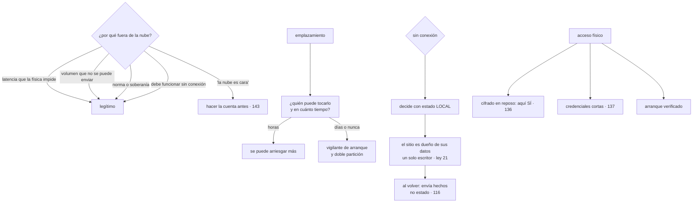

# 165 — Nube híbrida, edge y conectividad privada

> [← 164 · Flotas Kubernetes y políticas comunes](../../part-13-multicloud-hybrid-disaster-recovery/164-flotas-kubernetes-y-politicas-comunes/README.md) · [Índice de la parte](../README.md) · [166 · Backup, RTO, RPO y patrones de disaster recovery →](../../part-13-multicloud-hybrid-disaster-recovery/166-backup-rto-rpo-y-patrones-de-disaster-recovery/README.md)

**Parte:** 13 — Multi-cloud, híbrido, migración y recuperación<br>
**Nivel:** experto · **Horas estimadas:** 4<br>
**Laboratorio:** `hybrid` · **Estado:** `EXECUTABLE_CORE`

## 🎯 Propósito

Diseñar para la parte del sistema que no vive en una nube pública: instalaciones propias y sitios remotos donde el hardware es tuyo, la capacidad no crece sola, la conexión es peor o intermitente y **no hay nadie a quien pedirle que toque un cable**. La clase interroga los motivos con el método de la clase 157, desarrolla el problema central —**funcionar sin conexión y reconciliar al volver**, que es la ley 21 en su forma más dura— y trata los dos riesgos que no existen en la nube: **una actualización que deja un sitio inaccesible** y **un disco que alguien se puede llevar**.

## 📚 Resultados de aprendizaje

Al finalizar podrás:

1. **Interrogar** los motivos para tener algo fuera de la nube pública.
2. **Situar** cada emplazamiento por quién puede tocarlo y en cuánto tiempo.
3. **Diseñar** para operar sin conexión y reconciliar al recuperarla.
4. **Actualizar** sin poder acceder al sitio si la actualización falla.
5. **Proteger** un equipo al que alguien tiene acceso físico.

## 🧩 Conceptos centrales

| Concepto | Comprensión verificable |
|---|---|
| `operación sin conexión` | Capacidad de seguir prestando servicio cuando el enlace con el centro se pierde, decidiendo con estado local. |
| `propiedad del dato por emplazamiento` | Cada sitio es el escritor de sus propios datos. Es lo que evita conflictos al reconciliar. |
| `tiempo hasta que alguien lo toca` | Cuánto se tarda en tener a una persona delante del equipo. Decide qué se puede arriesgar en una actualización. |
| `vigilante de arranque` | Mecanismo que revierte a la versión anterior si la nueva no logra funcionar. Es lo que impide dejar un sitio inaccesible. |
| `guardar y reenviar` | Acumular telemetría y hechos localmente y enviarlos cuando haya enlace, en vez de perderlos. |
| `acceso físico` | Amenaza que no existe en una nube pública: alguien puede llevarse el equipo o su disco. |

## 🧠 Modelo mental

Multi-cloud es una decisión de negocio y riesgo; duplicar cada componente entre proveedores rara vez es la forma más confiable o económica de lograrla.

Aplicado a esta clase, separa siempre cuatro planos: **intención** (qué necesita el usuario),
**configuración** (qué declaramos), **estado observado** (qué existe de verdad) y
**evidencia** (cómo sabemos que cumple). Confundirlos produce diseños que se ven correctos
en un diagrama pero fallan al operar.

## 🗺️ Flujo de razonamiento



## 📖 Desarrollo

### 1. Por qué algo vive fuera

Los motivos, con la pregunta de siempre:

```text
LATENCIA QUE LA FÍSICA IMPIDE
  un control industrial que necesita responder en milisegundos
  un terminal de venta que no puede esperar 80 ms por cada lectura
  ¿qué pasa si no?   el proceso no funciona
  → sólido, y se comprueba con números, no con impresiones

VOLUMEN QUE NO SE PUEDE ENVIAR
  vídeo, sensores a alta frecuencia, imágenes médicas
  ¿qué pasa si no?   el enlace no da, o el coste de salida es
                     prohibitivo                        clase 161
  → sólido, y la respuesta suele ser procesar en el sitio y enviar
    el resultado, que es la regla número uno de la clase 161

NORMA O SOBERANÍA
  datos que no pueden salir de un edificio o de un país  clase 141
  → sólido

DEBE FUNCIONAR SIN CONEXIÓN
  una tienda no puede dejar de cobrar porque se caiga la línea
  → sólido, y es el que define el diseño: apartado tercero

INVERSIÓN EXISTENTE CON VIDA ÚTIL
  hay hardware comprado que aún sirve
  → legítimo, y es temporal: tiene fecha

«LA NUBE ES CARA»
  ¿comparado con qué?   con el coste total: hardware, espacio,
                        energía, repuestos, personal, renovación
  → hay casos donde es cierto, y la cuenta hay que hacerla entera
                                                        clase 143
```

Y el criterio que ordena la decisión, igual que en la clase 157:

```text
cada emplazamiento fuera de la nube tiene un motivo escrito
y lo que no lo tenga, se consolida
```

**El espectro**, que decide casi todo lo demás:

```text
UBICACIONES DE BORDE DEL PROVEEDOR
  el proveedor pone y mantiene el hardware; tú despliegas
  → operable casi como la nube

EQUIPO GESTIONADO EN TUS INSTALACIONES
  el proveedor lo mantiene y actualiza; está en tu edificio
  → operación conocida, y depende de un contrato

HARDWARE PROPIO EN UN CENTRO DE DATOS
  → capacidad fija, repuestos, y personal

HARDWARE PROPIO EN UN SITIO SIN NADIE
  un armario en una tienda, un cuadro en una fábrica
  → el caso duro, y el que define esta clase
```

Y la variable que hay que anotar para cada emplazamiento:

```text
¿QUIÉN PUEDE TOCARLO Y EN CUÁNTO TIEMPO?
  minutos       alguien en el edificio, formado
  horas         un técnico que se desplaza
  días          hay que contratar a alguien
  nunca         no hay acceso posible
→ y de esa respuesta depende cuánto se puede arriesgar en cada cambio
```

### 2. Funcionar sin conexión

Es el requisito que define el diseño, y su consecuencia es directa:

```text
si el sitio debe seguir funcionando sin enlace,
el sitio decide con estado LOCAL
→ y por tanto ESCRIBE localmente
→ y entonces, ¿quién es el dueño de ese dato?          ley 21
```

Y la respuesta que evita el problema de la clase 149:

```text
CADA EMPLAZAMIENTO ES DUEÑO DE SUS PROPIOS DATOS
  las ventas de esta tienda las escribe esta tienda
  el inventario de este almacén lo escribe este almacén
→ un solo escritor por dato, aunque haya 400 sitios
→ y el centro es un CONSUMIDOR que agrega, no una autoridad
```

Y lo que se replica en cada sentido:

```text
del centro al sitio    catálogo, precios, reglas, configuración
                       → lectura; el sitio no los modifica
del sitio al centro    hechos: ventas, movimientos, mediciones
                       → un sentido, con hechos y no con estado
                                                       clases 115, 161
```

Y lo que hay que resolver para lo que **no** se puede partir:

```text
el inventario de un producto que se vende en la tienda y en la web
  → dos escritores: el problema real

salidas honestas
  reservar un cupo por tienda: cada una escribe su cupo   → partir
  aceptar sobreventa y compensar                          clase 149
  o exigir conexión para esa operación concreta
→ y hay que decidirlo por operación, no en general
```

**Al recuperar la conexión**, lo que ocurre y cómo se gestiona:

```text
el sitio tiene una cola de hechos acumulados             clase 116
  con identificadores propios y orden local
se envían, y el centro los aplica de forma idempotente
y el centro envía lo que cambió mientras tanto
```

Y los tres problemas que aparecen siempre:

```text
AVALANCHA AL RECONECTAR
  400 sitios recuperan a la vez tras un corte regional
  → y todos envían su cola
  → hace falta variación aleatoria y limitación de caudal  clases 111, 130

COLA QUE CRECE SIN LÍMITE
  un sitio que lleva dos semanas sin enlace
  → la cola debe estar acotada y decidir qué se descarta
  → normalmente: nada de lo que sea dinero, y sí la telemetría

RELOJES
  un sitio sin conexión pierde sincronía                 clase 149
  → el orden se decide con contadores locales, no con marcas de tiempo
```

Y una decisión que conviene tomar de antemano:

```text
¿qué NO se puede hacer sin conexión?
  y qué se le dice a la persona que está delante del terminal
→ un mensaje claro vale más que un fallo silencioso
```

### 3. Actualizar sin poder ir

Aquí está el riesgo que no existe en la nube:

```text
una actualización que falla al arrancar deja el sitio inaccesible
y no hay consola remota, ni se puede recrear la instancia
```

Y el modelo que funciona es el de la clase 103, con dos añadidos:

```text
EL SITIO TIRA, no se le empuja
  un agente local consulta qué versión debe tener y se actualiza
  → funciona con conexiones intermitentes y detrás de cortafuegos
  → y no hace falta alcanzar 400 sitios desde fuera

VIGILANTE DE ARRANQUE
  si la versión nueva no consigue funcionar en N minutos,
  se vuelve a la anterior automáticamente
  → doble partición o imagen anterior conservada
  → es lo único que impide dejar un sitio muerto

DESPLIEGUE POR GRUPOS
  1 sitio → 5 sitios → 10 % → resto                     clase 102
  con tiempo entre etapas suficiente para que aparezcan los fallos
  → y con criterio de parada automático
```

Y las comprobaciones que el vigilante debe hacer antes de dar por buena una versión:

```text
¿arranca el sistema?
¿arranca la aplicación?
¿responde su comprobación de salud profunda?          clase 151
¿puede hablar con el centro, o al menos funcionar sin él?
→ y solo entonces se marca la versión como buena
```

Y dos precauciones más:

```text
NUNCA ACTUALIZAR EL CONJUNTO ENTERO A LA VEZ, aunque parezca trivial
  incluida la configuración: un valor mal puesto tiene el mismo
  efecto que una imagen rota

Y UN CAMINO MANUAL QUE FUNCIONE SIN RED
  una forma de que alguien en el sitio restaure una versión conocida
  → un medio de arranque, un botón, un procedimiento de una página
  → y probado con alguien que no sea quien lo escribió    clase 128
```

Y el ensayo correspondiente, del catálogo de la clase 131:

```text
desplegar a propósito una versión que no arranca en un sitio de prueba
  ¿revierte el vigilante?
  ¿en cuánto tiempo?
  ¿queda registro y avisa?
```

**La capacidad**, que tampoco se comporta como en la nube:

```text
no hay autoescalado: lo que hay es lo que hay
→ se dimensiona para el pico conocido, con margen        clase 129
→ y la degradación bajo sobrecarga hay que diseñarla:
  descartar, encolar o reducir funciones                 clase 130

y el fallo de hardware no se recrea: hay que tener repuestos
→ o aceptar que ese sitio queda fuera hasta que llegue uno
→ y eso es una cifra que hay que escribir, no una sorpresa
```

### 4. Acceso físico y visibilidad

**El acceso físico** cambia el modelo de amenazas, y es donde el cifrado en reposo deja de ser una casilla:

```text
en una nube pública   el disco no se lo puede llevar nadie   clase 136
en un armario de una tienda   sí
```

Y las defensas, con la honestidad de la clase 136:

```text
CIFRADO EN REPOSO      aquí sí protege del escenario real
  y la clave no puede estar en el mismo disco
  → módulo de plataforma en el equipo, o clave que se obtiene
    del centro al arrancar y no se persiste
  → y entonces, sin conexión no arranca: hay que decidirlo

ARRANQUE VERIFICADO    que no se pueda sustituir el sistema

CREDENCIALES CORTAS    lo que haya en el equipo debe caducar   clase 137
  → una credencial robada de un terminal debe servir horas, no años
  → y la identidad del sitio debe poder revocarse desde el centro

MÍNIMO PRIVILEGIO POR SITIO                                  clase 134
  el terminal de una tienda solo puede escribir lo de esa tienda
  → y eso lo comprueba el CENTRO, no el terminal

SIN PUERTOS DE ADMINISTRACIÓN EXPUESTOS
  y acceso remoto solo iniciado desde el sitio hacia fuera
```

Y la regla que resume el modelo:

```text
el equipo del emplazamiento NO ES DE CONFIANZA
→ todo lo que envía se valida en el centro
→ y comprometer un sitio debe alcanzar solo a ese sitio    clase 133
```

**La visibilidad**, con el ancho de banda como restricción:

```text
no se puede enviar telemetría como desde la nube             clase 162
→ agregar mucho más agresivamente en el sitio
→ guardar y reenviar: acumular y enviar cuando haya enlace
→ y priorizar: los errores y los hechos de negocio antes que las métricas
```

Y la alerta imprescindible, que es la ley 13 en su forma más literal:

```text
un sitio que deja de reportar no genera ningún error
→ alerta por ANTIGÜEDAD del último informe, por emplazamiento
→ y distinguir «no hay enlace» de «el equipo está apagado o roto»
```

Y las cifras que se vigilan en una red de emplazamientos:

```text
sitios que no reportan, y desde cuándo
sitios fuera de la ventana de versiones                      clase 164
tamaño de la cola pendiente de enviar, por sitio
tiempo medio sin conexión, por sitio
sitios con hardware en fallo y sin repuesto
y sitios sin motivo vigente para existir                     ley 20
```

Y la lista de comprobación de la clase:

```text
☐ cada emplazamiento tiene un motivo escrito y con fecha si es temporal
☐ está anotado quién puede tocarlo y en cuánto tiempo
☐ está decidido qué funciona sin conexión y qué no
☐ cada sitio es dueño de sus datos: un solo escritor
☐ lo que no se puede partir tiene una decisión explícita
☐ los hechos se envían con cola acotada e idempotencia
☐ la reconexión tiene variación aleatoria y limitación de caudal
☐ el orden local no depende de marcas de tiempo
☐ la actualización la tira el sitio, por grupos y con vigilante de arranque
☐ existe un camino manual de recuperación, probado
☐ está dimensionada la capacidad y escrita la degradación
☐ hay política de repuestos y un plazo escrito
☐ el disco está cifrado y la clave no vive en él
☐ las credenciales del sitio caducan y se pueden revocar
☐ el centro valida lo que llega y acota lo que un sitio puede tocar
☐ hay alerta por antigüedad del último informe, por emplazamiento
```

Y el cierre que enlaza con la clase siguiente: con cargas en varias nubes y en emplazamientos propios, queda la pregunta que la parte lleva aplazando desde la clase 157: qué se hace cuando se pierde uno de esos sitios entero, con qué plazo y con qué pérdida. Es la materia de la clase 166.

## 🔬 Ejemplo trabajado

**CloudShop opera 340 tiendas con terminales de venta propios. El ejercicio parte de un requisito claro —cobrar sin conexión— y termina con dos hallazgos: una actualización que dejó doce tiendas inoperativas y un disco que desapareció.**

**Los motivos, interrogados.**

```text
1. «los terminales deben cobrar sin conexión»
   ¿qué pasa si no?   la tienda cierra cuando falla la línea
   cortes medidos en 12 meses          41 tiendas, 3,2 h de media
   ventas perdidas si no funcionara     ~180.000 €/año
   → SÓLIDO, y define el diseño

2. «el vídeo de las cámaras no se puede subir»
   volumen                            2,1 TB/día por tienda
   coste de subirlo                   inviable                clase 161
   → SÓLIDO: se procesa en el sitio y se envía el resultado

3. «el hardware ya está comprado»
   vida útil restante                 2 años
   → LEGÍTIMO Y TEMPORAL: con fecha

4. «la nube es cara para esto»
   cuenta completa   hardware, energía, repuestos, técnico
                     y renovación cada 4 años
   → no era cierto para el procesamiento de vídeo;
     sí para el terminal, por el motivo 1
```

**El quién puede tocarlo.**

```text
tiendas con personal formado en el sitio                        0
tiempo hasta tener a un técnico delante, mediana           26 horas
tiempo en tiendas rurales                                  3 días
→ una actualización que deje un equipo muerto cuesta,
  de media, un día de cierre de esa tienda
```

**El diseño sin conexión.**

```text
dueño de cada dato
  ventas de la tienda                    la tienda        ley 21
  inventario de la tienda                la tienda
  catálogo y precios                     el centro (solo lectura)
  clientes y fidelización                el centro (solo lectura,
                                         con caché local)
```

Y el caso que no se podía partir:

```text
inventario de un producto vendido en tienda y en la web
  dos escritores                                          conflicto

decisión   cupo por tienda
  el centro asigna un cupo a cada tienda cada noche
  la tienda escribe solo sobre su cupo
  si se agota, el terminal exige conexión para vender más

ventas bloqueadas por cupo agotado sin conexión, en 12 meses   19
→ frente a la alternativa: sobreventa y compensación
```

**La reconexión, y la avalancha.**

```text
primer corte regional tras el despliegue
  tiendas afectadas                                          112
  duración del corte                                     41 min
  al restablecerse, todas enviaron su cola a la vez
  peticiones por segundo en el centro                     3.400
  capacidad                                               1.200
  resultado    el centro se saturó 9 minutos
```

```text                                          antes         después
variación aleatoria al reconectar                no      0-120 s
limitación de caudal por sitio                   no      50 hechos/s
cola acotada                                     no      10.000 hechos
qué se descarta al llenarse                      —       telemetría, nunca
                                                         ventas
pico al reconectar 112 tiendas                3.400/s      940/s
saturación del centro                          9 min         0
```

**La actualización que dejó doce tiendas fuera.**

```text
06:00  se despliega una versión nueva del terminal a las 340 tiendas
06:04  12 tiendas no arrancan: un controlador de la impresora fiscal
       incompatible con el núcleo nuevo
06:04  esas tiendas no pueden cobrar
08:30  abre la primera; llamada a soporte
       (las tiendas abren a las 9:00)
09:10  se decide enviar técnicos
primera tienda recuperada                                  11:20
última tienda recuperada                                   siguiente día
ventas perdidas                                         ~14.000 €
```

Y los tres fallos que lo permitieron:

```text
se desplegó a las 340 a la vez
no había vigilante de arranque: la versión rota se quedó
y no había camino manual: el técnico tuvo que llevar un equipo
```

```text                                          antes         después
despliegue                              todas a la vez   1 → 5 → 10 % → resto
tiempo entre etapas                          —            24 h
vigilante de arranque                        no        sí, revierte en 6 min
doble partición                              no             sí
camino manual sin red                        no        medio de arranque
                                                        y guía de 1 página
criterio de parada automático                no        > 2 % de fallos

ensayo: desplegar una versión que no arranca
  tiendas afectadas                     12 (real)        1 (ensayo)
  tiempo hasta revertir                 26 h            6 min
  intervención humana                   sí               no
```

Y el camino manual se probó con alguien que no lo escribió, según la clase 128:

```text
preguntas durante la prueba                                    9
  → 4 de permisos, 3 de dónde está el medio, 2 de qué hacer si falla
tras corregir la guía                                          0
```

**El disco que desapareció.**

```text
robo en una tienda; se llevaron el equipo del armario
contenido del disco
  ventas locales de los últimos 90 días                     sí
  datos de clientes de esas ventas                          sí
  credenciales del terminal hacia el centro                 sí
cifrado en reposo                                           no
```

Y la respuesta, que fue la de la clase 137:

```text
rotar         la credencial del terminal, revocada en 40 min
corregir      el mecanismo
purgar        no aplicable
revisar uso   ningún acceso con esa credencial tras el robo
```

Y las correcciones, que son la excepción honesta de la clase 136:

```text                                          antes         después
cifrado en reposo del disco                     no             sí
dónde vive la clave                              —        módulo del equipo,
                                                          no en el disco
arranque verificado                             no             sí
credencial del terminal                    permanente     caduca en 24 h,
                                                          renovada al conectar
qué puede escribir esa credencial          casi todo    solo datos de su tienda
revocación desde el centro                  manual, 40 min   inmediata
qué alcanzaría un equipo robado          datos de 90 días  datos cifrados
                                          + credencial      y credencial
                                                            caducada
```

Y la decisión que hubo que tomar y escribir:

```text
si la clave la diera el centro al arrancar, un equipo sin conexión
no podría arrancar tras un corte de luz
→ y eso incumple el requisito 1
→ decisión: clave en el módulo del propio equipo, ligada al arranque
  verificado
→ compromiso aceptado: quien robe el equipo ENTERO y consiga
  arrancarlo podría leer; quien solo se lleve el disco, no
```

**La visibilidad.**

```text                                          antes         después
telemetría enviada por tienda            1,4 GB/día      12 MB/día
cómo                                     en bruto      agregada en el sitio,
                                                        guardar y reenviar
alerta por antigüedad del último informe    no       sí, > 30 min
distinguir sin enlace de equipo apagado     no             sí
tiendas sin reportar, detectadas en 12 meses  —             31
  de ellas, cortes de línea                   —             26
  de ellas, equipo averiado                   —              5
    → detectadas de media 4 h antes de que la tienda llamara
```

**A los doce meses.**

```text                                          antes         después
tiendas con operación sin conexión           340 de 340    340 de 340
escritores por dato                          2 (inventario)     1
saturación del centro al reconectar           9 min             0
despliegue                              todas a la vez     por grupos
vigilante de arranque                          no              sí
tiendas inoperativas por una actualización     12               0
camino manual probado                          no              sí
cifrado en reposo                              no          340 de 340
credenciales permanentes en tiendas           340               0
alcance de un equipo robado             datos + credencial   nada
telemetría por tienda                     1,4 GB/día      12 MB/día
avería detectada antes de la llamada           no       4 h antes, de media
```

**La lección que esta clase traslada a la parte 13**: los dos incidentes que costaron dinero no fueron de arquitectura distribuida: fueron **una actualización desplegada a trescientas cuarenta tiendas a la vez sin forma de revertir**, y **un disco sin cifrar en un armario al que cualquiera podía llegar**. Y el requisito que definió todo el diseño —cobrar sin conexión— se resolvió con la misma regla que la clase 147 dio para los contextos: **que cada sitio sea el único escritor de sus datos**, con un cupo asignado para lo único que no se podía partir.

## 🧪 Laboratorio guiado

Ejecuta desde la raíz:

```bash
python classes/part-13-multicloud-hybrid-disaster-recovery/165-nube-hibrida-edge-y-conectividad-privada/lab.py
```

El laboratorio selecciona el motor de práctica **`hybrid`** y produce
`lab_result.json`. El escenario, sus comprobaciones y el artefacto esperado corresponden a
esta clase; no requiere credenciales y deja explícito qué debe revalidarse en un sandbox real.

1. Lee `exercise.steps` y formula una predicción antes de ejecutar.
2. Ejecuta la práctica y verifica todos los elementos de `checks`.
3. Provoca el caso de `negative_test` y explica la señal observada.
4. Materializa `arquitectura-hibrida` en `evidence/` usando la plantilla indicada.
5. Para proveedor real, sigue `sandbox.requires`, registra costo y ejecuta `destroy`.

### Evidencia esperada

El artefacto principal es una topología híbrida con dependencia y modo degradado. Además, la entrega debe incluir el comando ejecutado,
la salida estructurada y una conclusión que no exceda lo observado.

## 🏆 Reto verificable

Construye **`arquitectura-hibrida`** para el caso CloudShop. Incluye una alternativa descartada,
un supuesto que pueda falsarse, una prueba de fallo y una decisión de rollback.

## ✅ Criterio de aceptación

- [ ] `lab.py` termina con código 0 y genera JSON válido.
- [ ] La entrega conecta al menos tres requisitos con mecanismos verificables.
- [ ] Existe una prueba positiva y una prueba negativa con evidencia.
- [ ] Seguridad, costo y operación aparecen como decisiones, no como anexos.
- [ ] Se declara una limitación y una condición que obligaría a revisar el diseño.
- [ ] Otra persona puede repetir el recorrido sin conocimiento tácito.

## ⚠️ Errores frecuentes

| Síntoma | Causa probable | Corrección |
|---|---|---|
| Al restablecerse la conexión, los sitios saturan el centro | Todos envían su cola a la vez, sin variación ni límite | Variación aleatoria al reconectar, limitación de caudal por sitio y cola acotada con criterio de descarte. |
| Una actualización deja sitios sin servicio y no hay forma de llegar a ellos | Se desplegó a todos a la vez, sin vigilante de arranque ni camino manual | Despliegue por grupos con tiempo entre etapas, reversión automática si la versión no arranca y un procedimiento manual sin red, probado. |
| Al reconciliar aparecen conflictos entre el sitio y el centro | Dos escritores para el mismo dato | Cada sitio es dueño de sus datos; lo que no se pueda partir, resuélvelo con cupos o exige conexión para esa operación. |
| Un equipo robado da acceso al sistema | Disco sin cifrar y credenciales permanentes en el sitio | Cifrado con la clave fuera del disco, arranque verificado, credenciales de vida corta revocables y permisos acotados a ese sitio. |
| Un sitio lleva días sin funcionar y nadie lo sabe | Ley 13: dejar de reportar no produce ningún error | Alerta por antigüedad del último informe por emplazamiento, distinguiendo falta de enlace de avería. |
| Se decide sacar cargas de la nube porque es cara | No se hizo la cuenta completa: hardware, energía, repuestos, personal y renovación | Compara coste total y con la vida útil del hardware; y escribe la fecha si el motivo es una inversión existente. |

## 🛡️ Seguridad, ética y costo

Trabaja con cuentas propias o sandboxes autorizados. No publiques secretos, identificadores
reales ni datos personales. Antes de crear recursos pagos define presupuesto, etiquetas y
comando de destrucción; después verifica que no queden recursos huérfanos. Los ejemplos
locales enseñan contratos, pero no certifican cumplimiento ni disponibilidad de producción.

## ❓ Preguntas de comprobación

1. ¿Qué motivos justifican tener algo fuera de la nube pública y cuál define el diseño?
2. ¿Por qué la propiedad del dato por emplazamiento evita los conflictos al reconciliar?
3. ¿Qué tres problemas aparecen al recuperar la conexión?
4. ¿Qué impide que una actualización deje un sitio inaccesible?
5. ¿Por qué aquí el cifrado en reposo sí protege del escenario real?

## 🔗 Referencias

- AWS (2025). *Outposts, Local Zones and edge services* — espectro de opciones y su operabilidad. <https://docs.aws.amazon.com/whitepapers/latest/aws-outposts-high-availability-design/>
- Azure (2025). *Azure Arc and hybrid management* — gobierno de recursos fuera de la nube pública. <https://learn.microsoft.com/azure/azure-arc/overview>
- Google Cloud (2025). *Distributed Cloud and edge patterns* — proceso en el sitio y envío de resultados. <https://cloud.google.com/distributed-cloud>
- Eclipse Foundation (2025). *Edge device update and rollback patterns* — actualización con reversión automática. <https://projects.eclipse.org/>
- NIST (2025). *Guide to industrial control system security* — acceso físico, arranque verificado y credenciales en el sitio. <https://csrc.nist.gov/pubs/sp/800/82/r3/final>
- Documentación oficial vigente del servicio implementado; registra URL y fecha de consulta.

---

> [Evaluación](assessment.md) · [Contrato de clase](lesson.yaml) · [Índice de la parte](../README.md)

| Anterior | Índice | Siguiente |
|---|---|---|
| [← 164 · Flotas Kubernetes y políticas comunes](../../part-13-multicloud-hybrid-disaster-recovery/164-flotas-kubernetes-y-politicas-comunes/README.md) | [Parte 13](../README.md) · [Programa](../../README.md) | [166 · Backup, RTO, RPO y patrones de disaster recovery →](../../part-13-multicloud-hybrid-disaster-recovery/166-backup-rto-rpo-y-patrones-de-disaster-recovery/README.md) |
