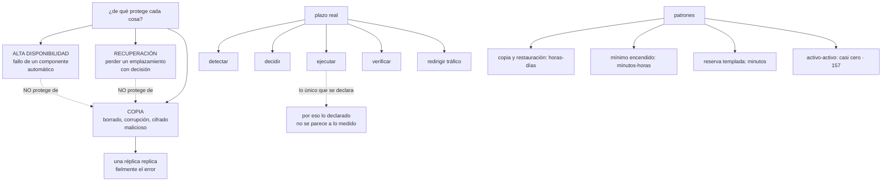

# 166 — Backup, RTO, RPO y patrones de disaster recovery

> [← 165 · Nube híbrida, edge y conectividad privada](../../part-13-multicloud-hybrid-disaster-recovery/165-nube-hibrida-edge-y-conectividad-privada/README.md) · [Índice de la parte](../README.md) · [167 · Las 7R de migración y oleadas →](../../part-13-multicloud-hybrid-disaster-recovery/167-las-7r-de-migracion-y-oleadas/README.md)

**Parte:** 13 — Multi-cloud, híbrido, migración y recuperación<br>
**Nivel:** experto · **Horas estimadas:** 4<br>
**Laboratorio:** `reliability` · **Estado:** `EXECUTABLE_CORE`

## 🎯 Propósito

Prepararse para perder algo grande —una región, un proveedor, unos datos— con un plazo y una pérdida declarados y **medidos**. La clase separa tres cosas que se confunden a diario y protegen de amenazas distintas: alta disponibilidad, recuperación ante desastre y copia de seguridad. Insiste en que **una réplica no es una copia**, porque replica fielmente el borrado y la corrupción. Y demuestra que los objetivos declarados casi nunca se corresponden con nada medido, porque la cifra que se anuncia cubre solo la ejecución y el reloj real empieza mucho antes.

## 📚 Resultados de aprendizaje

Al finalizar podrás:

1. **Distinguir** alta disponibilidad, recuperación ante desastre y copia de seguridad.
2. **Declarar** objetivos por escenario, no uno global.
3. **Medir** el plazo real de recuperación, con todos sus tramos.
4. **Elegir** el patrón por carga, según el impacto y no por costumbre.
5. **Enumerar** lo que no se replica y falla en una recuperación real.

## 🧩 Conceptos centrales

| Concepto | Comprensión verificable |
|---|---|
| `alta disponibilidad` | Sobrevivir al fallo de un componente de forma automática, dentro del mismo sistema. No protege del borrado ni de la corrupción. |
| `recuperación ante desastre` | Sobrevivir a perder un emplazamiento entero, con un plan declarado y una decisión humana. |
| `copia de seguridad` | Punto en el tiempo al que volver. Es lo único que protege del borrado, de la corrupción y del cifrado malicioso. |
| `plazo de recuperación` | Tiempo desde que ocurre hasta que el servicio funciona. Incluye detectar, decidir, ejecutar, verificar y redirigir. |
| `pérdida admisible` | Cuántos datos se aceptan perder. Con copia asíncrona nunca es cero. |
| `vuelta atrás` | Regreso al emplazamiento original. Suele ser más difícil que la conmutación, porque el destino tiene ahora los datos nuevos. |

## 🧠 Modelo mental

Multi-cloud es una decisión de negocio y riesgo; duplicar cada componente entre proveedores rara vez es la forma más confiable o económica de lograrla.

Aplicado a esta clase, separa siempre cuatro planos: **intención** (qué necesita el usuario),
**configuración** (qué declaramos), **estado observado** (qué existe de verdad) y
**evidencia** (cómo sabemos que cumple). Confundirlos produce diseños que se ven correctos
en un diagrama pero fallan al operar.

## 🗺️ Flujo de razonamiento



## 📖 Desarrollo

### 1. Tres cosas distintas

Se mencionan juntas y protegen de amenazas distintas:

```text
ALTA DISPONIBILIDAD
  sobrevivir a que falle un componente: un nodo, una zona
  automática, sin decisión humana
  protege de   fallos de hardware, caída de una zona     clase 150
  NO protege de  borrado, corrupción, error de despliegue

RECUPERACIÓN ANTE DESASTRE
  sobrevivir a perder un emplazamiento entero
  con un plan, una decisión y un plazo declarado
  protege de   pérdida de una región o de un proveedor
  NO protege de  borrado ni corrupción

COPIA DE SEGURIDAD
  volver a un punto anterior en el tiempo
  protege de   borrado accidental, corrupción, error de
               despliegue, cifrado malicioso, y del error de
               un operador
```

Y la frase que hay que interiorizar:

```text
UNA RÉPLICA NO ES UNA COPIA
  la réplica replica fielmente el DELETE que borró la tabla
  y lo hace en milisegundos                              clase 150
```

Y de ahí que las tres hagan falta y que ninguna sustituya a otra:

```text
un sistema con réplica en tres zonas y sin copias
→ está protegido de que se caiga una zona
→ y no lo está de que alguien ejecute una migración mal escrita
```

Y la lista de amenazas contra las que solo protege la copia:

```text
borrado accidental de datos o de recursos
corrupción por un fallo de la aplicación
una migración de esquema que destruye información       clase 102
cifrado malicioso por un atacante
borrado deliberado por alguien con permisos             clase 134
y un error de configuración que vacía un almacén        clase 139
```

Y una consecuencia sobre las copias que se deriva de las dos últimas:

```text
si quien administra puede borrar las copias, no protegen del caso
en que su credencial esté comprometida
→ inmutabilidad con retención, y cuenta separada         clases 112, 133
```

### 2. Objetivos por escenario

Declarar «nuestro plazo de recuperación es de cuatro horas» sin decir de qué no significa nada. Los objetivos se declaran **por escenario**:

```text
ESCENARIO                         plazo        pérdida admisible
falla un nodo                     segundos     cero        automático
falla una zona                    minutos      cero        automático
se pierde una región              horas        minutos     con decisión
se pierde el proveedor            horas-días   minutos     con decisión
corrupción de datos               horas        depende del punto elegido
borrado accidental                minutos-horas  depende
cifrado malicioso                 días         desde la última copia
                                                             inmutable
```

Y dos observaciones sobre la tabla:

```text
los escenarios de arriba se resuelven con alta disponibilidad y
  no necesitan plan
los de abajo necesitan copia, y su plazo lo domina el tamaño
  de los datos                                          clase 161
```

Y los objetivos se declaran **por carga**, no para el sistema entero:

```text
flujo de compra          plazo corto, pérdida cero
informes y análisis      plazo de días, pérdida de horas
herramientas internas    plazo de días
→ y eso permite gastar donde importa                    clase 143
```

Y la pregunta que fija cada número, que es la de la clase 145:

```text
¿qué pasa si tardamos el doble?
¿qué pasa si perdemos una hora de datos en vez de un minuto?
→ con la respuesta en euros o en consecuencias, el número deja de
  ser una aspiración
```

Y una cifra que casi nunca se calcula y que cambia las decisiones:

```text
COSTE DE LA PREPARACIÓN frente a COSTE DEL SUCESO × PROBABILIDAD

reserva templada entre proveedores          ~11.400 €/mes
pérdida estimada de un día de caída          ~90.000 €
probabilidad anual de perder el proveedor    muy baja
probabilidad anual de perder una región      moderada
→ y por eso la respuesta suele ser una segunda REGIÓN y no un
  segundo proveedor                                     clase 157
```

### 3. Medir el plazo de verdad

Aquí está el motivo por el que lo declarado y lo medido no se parecen: **el número que se anuncia cubre un tramo y el reloj corre desde antes**.

```text
el reloj empieza cuando ocurre, no cuando alguien lo mira

1. DETECTAR            ¿cuánto tarda alguien en saberlo?      parte 10
2. DECIDIR             ¿quién decide conmutar? ¿está localizable?
                       ¿hay criterio escrito o se delibera?
3. EJECUTAR            ← lo único que suele estar medido
4. VERIFICAR           ¿funciona de verdad? ¿con qué comprobación?
5. REDIRIGIR TRÁFICO   nombres, cachés de resolución, clientes
                       con conexiones abiertas               clase 160
```

Y dos tramos que se olvidan y que dominan cuando hay datos:

```text
TRANSFERIR LOS DATOS   si hay que traerlos, cuesta tiempo y dinero
                                                            clase 161
CALENTAR               cachés vacías, conexiones frías, código sin
                       optimizar: el sistema arranca degradado
                                                            clase 111
```

Y la forma de medirlo es una sola:

```text
EJECUTAR EL PLAN, con cronómetro, en un ensayo real
→ cualquier otra cifra es una estimación de alguien
```

Y lo que aparece la primera vez, sin falta:

```text
el procedimiento está desactualizado
falta un permiso                                        clase 131
el documento vive en el sistema que se ha caído
la cuota de la región de destino no da para toda la carga  clase 129
faltan los certificados, o han caducado                 clase 136
los secretos no están en el destino                      clase 137
el proveedor externo solo acepta llamadas desde las direcciones
  de origen                                              clase 135
y nadie sabe quién tiene autoridad para decidir
```

Y el criterio de decisión, que es la parte organizativa y la que más tarda:

```text
escrito de antemano
  «si el indicador está por debajo de X durante Y minutos
   y no hay perspectiva de recuperación en Z, se conmuta»
y con nombre de quién decide, y suplente
→ sin eso, la decisión tarda más que la ejecución
```

Y la asimetría que conviene aceptar:

```text
conmutar demasiado pronto        se pierde algo de datos y se recupera
conmutar demasiado tarde         se acumula la caída
→ y como conmutar tiene coste, la tentación es esperar
→ por eso el criterio se fija antes, no durante
```

### 4. Patrones, lo que no se replica y la vuelta

**Los cuatro patrones**, con su plazo realista y su coste:

```text
COPIA Y RESTAURACIÓN
  no hay nada encendido; se crea todo al ocurrir
  plazo   horas o días, dominado por el tamaño de los datos
  coste   el de guardar las copias
  encaja  cargas que toleran estar caídas un día

MÍNIMO ENCENDIDO
  los datos se replican y la infraestructura está declarada,
  con lo mínimo encendido
  plazo   minutos a horas: hay que crear y escalar
  coste   bajo: solo los datos y unos pocos recursos
  encaja  la mayoría de los casos

RESERVA TEMPLADA
  una copia reducida corriendo, con datos al día
  plazo   minutos: escalar y redirigir
  coste   medio-alto

ACTIVO-ACTIVO
  sirve desde los dos                                     clase 157
  plazo   casi cero
  coste   alto, y todo lo de los niveles 4 y 5
```

Y el criterio de elección, por carga:

```text
se elige el patrón MÁS BARATO que cumpla el objetivo declarado
y el objetivo sale del impacto, no de la ambición
```

**Lo que no se replica** y falla en una recuperación real. Esta lista es lo más útil de la clase:

```text
nombres y su resolución                                 clase 160
certificados y su cadena de confianza                   clase 136
secretos y credenciales del destino                     clase 137
identidades, roles y permisos                           clase 159
cuotas y límites de la región de destino                clase 129
registro de imágenes accesible desde allí               clase 138
listas de direcciones autorizadas en proveedores externos
configuración de la puerta de entrada y sus límites     clase 118
reglas de red y de salida                               clase 135
programación de trabajos periódicos
y el propio procedimiento, si vive en lo que se ha caído
```

Y las dos últimas causan más problemas de lo que parece:

```text
los trabajos periódicos no se activan solos en el destino
  → o no se ejecutan, o se ejecutan DOS veces si el origen revive
y un plan almacenado en el sistema caído no existe cuando hace falta
```

**Las copias**, con lo mínimo exigible:

```text
en otra cuenta y con credenciales distintas             clase 133
inmutables, con retención                               clase 112
varias generaciones, y una fuera del proveedor si el escenario
  incluye perderlo
cifradas, con la clave disponible en el destino         clase 136
y RESTAURADAS periódicamente, con cronómetro
```

Y la última es la única que cuenta: **una copia no restaurada no es una copia**, que este programa lleva repitiendo desde la clase 088.

**La vuelta atrás**, que es la mitad olvidada:

```text
tras conmutar, el destino tiene los datos NUEVOS
→ volver significa replicar en sentido contrario
→ y decidir qué se hace con lo que el origen tenía y no llegó a copiar

y si el origen revive solo, hay riesgo de dos escritores    ley 21
→ hace falta un mecanismo que impida que el origen vuelva a aceptar
  escrituras sin decisión explícita                       clase 150
```

Y la lista de comprobación de la clase:

```text
☐ están separadas alta disponibilidad, recuperación y copia
☐ hay copias, y no solo réplicas
☐ las copias son inmutables, en otra cuenta y con credenciales distintas
☐ los objetivos están declarados por escenario y por carga
☐ cada número se justifica con la consecuencia de incumplirlo
☐ el plazo medido incluye detectar, decidir, verificar y redirigir
☐ está escrito el criterio de decisión y quién decide, con suplente
☐ el patrón elegido es el más barato que cumple el objetivo
☐ está revisada la lista de lo que no se replica
☐ el procedimiento no vive en el sistema que puede caerse
☐ las cuotas del destino dan para toda la carga
☐ se restaura periódicamente, con cronómetro
☐ está previsto el regreso y qué impide dos escritores
```

Y el cierre que enlaza con la clase siguiente: casi todo lo anterior supone que las cargas ya están donde tienen que estar. Cuando hay que llevarlas de un sitio a otro —a la nube, entre nubes o de vuelta— hay siete formas de hacerlo, con costes muy distintos, y es la materia de la clase 167.

## 🔬 Ejemplo trabajado

**CloudShop tiene un documento de continuidad que declara un plazo de recuperación de cuatro horas para el flujo de compra. Nunca se ha ejecutado. El ejercicio consiste en ejecutarlo con un cronómetro.**

**Lo declarado.**

```text
plazo de recuperación declarado                             4 h
pérdida admisible declarada                            15 min
escenario cubierto                     «pérdida de la región principal»
patrón supuesto                        «mínimo encendido»
última revisión del documento                          hace 19 meses
veces que se ha ejecutado                                     0
```

**El primer ensayo, con cronómetro.**

```text
09:00  se simula la pérdida de la región principal
09:00  → el reloj empieza aquí

09:00  DETECTAR
       la sonda externa avisa a los                       90 s
       ✓ funcionó (clase 162)

09:02  DECIDIR
       criterio escrito                                   no había
       personas que debían autorizar                      2, no localizadas
       tiempo hasta la decisión                           1 h 40

10:42  EJECUTAR
       el documento estaba en un espacio de la región caída
         → se recuperó de una copia local de alguien       22 min
       faltaban permisos para crear en la región de destino 35 min
       la cuota de instancias del destino era de 40; hacían falta 120
         → petición al proveedor                            2 h 10
       los certificados no estaban en el destino            18 min
       los secretos tampoco                                 41 min
       restaurar la base desde la copia                     3 h 05
         (4,1 TB; el tiempo de transferencia lo dominaba)

16:31  VERIFICAR
       no había comprobación definida; se improvisó         38 min

17:09  REDIRIGIR
       el tiempo de vida de los registros de nombres era de 3.600 s
         → clientes llegando al origen                      1 h 12
       el proveedor de pago rechazaba las llamadas: solo
         acepta direcciones autorizadas y las nuevas no estaban
                                                            1 h 30

19:51  el flujo de compra funciona

PLAZO REAL                                            10 h 51
PLAZO DECLARADO                                            4 h
factor                                                    ×2,7
```

Y la pérdida de datos:

```text
retardo de replicación en el momento del corte              41 s
pérdida real                                           ~1.100 pedidos
pérdida declarada admisible                            15 min
→ dentro del objetivo, por poco                              ✓
```

**El desglose por tramos, que es lo que orientó el trabajo.**

```text
detectar                                    90 s        0,2 %
decidir                                   1 h 40       15,4 %
ejecutar                                  6 h 21       58,5 %
  de los cuales, cuota del destino        2 h 10
  de los cuales, transferencia de datos   3 h 05
verificar                                   38 min       5,8 %
redirigir                                 2 h 42       24,9 %
```

**El 41 % del tiempo no era ejecutar nada**: era decidir, verificar y redirigir, que es exactamente lo que el número declarado no cubría.

**Las correcciones, por orden de rendimiento.**

```text
1. CRITERIO DE DECISIÓN ESCRITO
   «si el indicador del flujo de compra está por debajo del 50 %
    durante 10 minutos y el proveedor no da plazo de recuperación
    en 30, se conmuta»
   quién decide: la persona de guardia; suplente nombrado
   ahorro                                              1 h 40 → 4 min

2. CUOTAS EN EL DESTINO, SOLICITADAS DE ANTEMANO
   cuota de instancias                          40 → 150
   cuota de concurrencia, de direcciones y de bases  igual
   ahorro                                              2 h 10 → 0
   coste                                               0 €

3. DATOS: DE RESTAURAR A REPLICAR
   copia continua a la región de destino                clase 161
   coste                                             ~140 €/mes
   ahorro                                              3 h 05 → 6 min

4. REDIRECCIÓN
   tiempo de vida de los registros de nombres      3.600 s → 60 s
   direcciones del destino autorizadas en el proveedor de pago,
     de antemano
   ahorro                                              2 h 42 → 9 min

5. CERTIFICADOS Y SECRETOS EN EL DESTINO
   emitidos y replicados de antemano                   clases 136, 137
   ahorro                                              59 min → 0

6. VERIFICACIÓN DEFINIDA
   una comprobación automática que ejecuta el recorrido de compra
   ahorro                                              38 min → 3 min

7. EL PROCEDIMIENTO FUERA DE LA REGIÓN
   en un repositorio replicado y con copia impresa en dos oficinas
   ahorro                                              22 min → 0
```

**El segundo ensayo, tres meses después.**

```text
detectar                                    80 s
decidir                                     4 min
ejecutar                                   14 min
verificar                                   3 min
redirigir                                   9 min
                                          ──────
PLAZO REAL                                 31 min

plazo declarado, actualizado               45 min
pérdida real                               22 s de datos
```

De diez horas y cincuenta y un minutos a treinta y uno, **sin cambiar de patrón**: sigue siendo mínimo encendido. Lo que cambió fue todo lo que rodea a la ejecución.

**La copia que no era copia.**

Durante la preparación se descubrió algo peor que el plazo:

```text
«tenemos réplica en tres zonas»                            sí
«y copias de seguridad»                                    sí, diarias
¿dónde?              en la misma cuenta y el mismo proveedor
¿inmutables?         no
¿quién puede borrarlas?   el mismo rol que administra la base
¿restauradas alguna vez?  una, hace 14 meses
```

Y el ensayo del escenario de borrado, que es el que las réplicas no cubren:

```text
se simuló una migración que borra una tabla
  las 3 réplicas la borraron en 40 ms                       ✓ (esperado)
  restauración desde copia                                  4 h 20
  datos perdidos entre la copia y el borrado                17 h
```

```text                                          antes         después
copias                                 misma cuenta      cuenta separada
inmutabilidad                               no        sí, 35 días
quien puede borrarlas                  el administrador   nadie, dentro
                                       de la base         de la retención
frecuencia                             diaria          continua + diaria
pérdida en el escenario de borrado          17 h            5 min
restauración probada                   hace 14 meses     trimestral
tiempo de restauración medido               4 h 20         38 min
```

**Los objetivos, redeclarados por escenario y por carga.**

```text                                    plazo      pérdida
flujo de compra
  pérdida de zona                       automático     0
  pérdida de región                       45 min      1 min
  corrupción o borrado                     1 h        5 min
catálogo
  pérdida de región                        4 h        1 h
informes y análisis
  pérdida de región                       24 h        24 h
herramientas internas
  pérdida de región                        3 días     1 día
```

Y el coste de esa diferenciación:

```text
coste si todo tuviera el objetivo del flujo de compra   ~4.900 €/mes
coste con objetivos por carga                             ~610 €/mes
```

**La vuelta atrás, ensayada aparte.**

```text
primer ensayo de regreso                             falló
  la región original revivió y empezó a aceptar escrituras
  → dos escritores durante 4 minutos                    ley 21
  → 61 pedidos escritos en el sitio equivocado

corrección
  al conmutar, el origen se marca como no autorizado a escribir
  y volver exige una decisión explícita y replicar en sentido inverso

segundo ensayo de regreso                            correcto
  duración                                            52 min
  pedidos escritos en el sitio equivocado                  0
```

**A los seis meses.**

```text                                          antes         después
plazo declarado                                4 h            45 min
plazo medido                                  10 h 51         31 min
relación entre declarado y medido              ×2,7           ×0,7
ensayos ejecutados                               0              4
criterio de decisión escrito                    no             sí
cuotas del destino preparadas                   no             sí
certificados y secretos en el destino           no             sí
procedimiento fuera de la región caída          no             sí
copias inmutables en cuenta separada            no             sí
pérdida en escenario de borrado                17 h            5 min
restauración probada                       hace 14 meses    trimestral
vuelta atrás ensayada                           no             sí
objetivos por carga                              1              4
```

**La lección que esta clase traslada a la parte 13**: el plazo declarado era de cuatro horas y el real de casi once, y **el 41 % de ese tiempo no fue ejecutar nada**: fue decidir sin criterio escrito, verificar sin comprobación definida y redirigir con un tiempo de vida de nombres de una hora. Y el hallazgo más grave no tenía que ver con el plazo: **las copias vivían en la misma cuenta que la base y las podía borrar el mismo rol**, de modo que el único escenario del que una réplica no protege —el borrado— era también el peor cubierto.

## 🧪 Laboratorio guiado

Ejecuta desde la raíz:

```bash
python classes/part-13-multicloud-hybrid-disaster-recovery/166-backup-rto-rpo-y-patrones-de-disaster-recovery/lab.py
```

El laboratorio selecciona el motor de práctica **`reliability`** y produce
`lab_result.json`. El escenario, sus comprobaciones y el artefacto esperado corresponden a
esta clase; no requiere credenciales y deja explícito qué debe revalidarse en un sandbox real.

1. Lee `exercise.steps` y formula una predicción antes de ejecutar.
2. Ejecuta la práctica y verifica todos los elementos de `checks`.
3. Provoca el caso de `negative_test` y explica la señal observada.
4. Materializa `plan-dr` en `evidence/` usando la plantilla indicada.
5. Para proveedor real, sigue `sandbox.requires`, registra costo y ejecuta `destroy`.

### Evidencia esperada

El artefacto principal es un escenario de fallo con objetivo y recuperación medida. Además, la entrega debe incluir el comando ejecutado,
la salida estructurada y una conclusión que no exceda lo observado.

## 🏆 Reto verificable

Construye **`plan-dr`** para el caso CloudShop. Incluye una alternativa descartada,
un supuesto que pueda falsarse, una prueba de fallo y una decisión de rollback.

## ✅ Criterio de aceptación

- [ ] `lab.py` termina con código 0 y genera JSON válido.
- [ ] La entrega conecta al menos tres requisitos con mecanismos verificables.
- [ ] Existe una prueba positiva y una prueba negativa con evidencia.
- [ ] Seguridad, costo y operación aparecen como decisiones, no como anexos.
- [ ] Se declara una limitación y una condición que obligaría a revisar el diseño.
- [ ] Otra persona puede repetir el recorrido sin conocimiento tácito.

## ⚠️ Errores frecuentes

| Síntoma | Causa probable | Corrección |
|---|---|---|
| Hay réplicas en varias zonas y un borrado destruye los datos igualmente | Una réplica replica fielmente el borrado; no es una copia | Copias con punto en el tiempo, inmutables, en otra cuenta y con credenciales distintas. |
| El plazo real triplica al declarado | El número declarado solo cubría la ejecución; el reloj corre desde que ocurre | Mide con cronómetro los cinco tramos: detectar, decidir, ejecutar, verificar y redirigir. |
| La decisión de conmutar tarda más que la conmutación | No hay criterio escrito ni quién decide | Escribe el criterio con umbrales y plazos, nombra a quien decide y a su suplente. |
| Al conmutar no hay capacidad en la región de destino | Las cuotas del destino son las de una región que no se usaba | Solicita de antemano las cuotas necesarias y verifícalas en cada ensayo. |
| El sistema se levanta en el destino y no funciona | Falta lo que no se replica: certificados, secretos, permisos, listas de direcciones autorizadas y trabajos periódicos | Revisa la lista completa y prepara cada elemento antes de necesitarlo. |
| Al volver al sitio original aparecen datos escritos en dos sitios | El origen revivió y aceptó escrituras | Marca el origen como no autorizado a escribir al conmutar y exige decisión explícita para volver, replicando en sentido inverso. |

## 🛡️ Seguridad, ética y costo

Trabaja con cuentas propias o sandboxes autorizados. No publiques secretos, identificadores
reales ni datos personales. Antes de crear recursos pagos define presupuesto, etiquetas y
comando de destrucción; después verifica que no queden recursos huérfanos. Los ejemplos
locales enseñan contratos, pero no certifican cumplimiento ni disponibilidad de producción.

## ❓ Preguntas de comprobación

1. ¿De qué protege cada una: alta disponibilidad, recuperación ante desastre y copia?
2. ¿Por qué una réplica no es una copia?
3. ¿Qué cinco tramos componen el plazo real de recuperación y cuál se suele declarar?
4. ¿Qué elementos no se replican y hacen fallar una recuperación real?
5. ¿Por qué la vuelta atrás suele ser más difícil que la conmutación?

## 🔗 Referencias

- AWS (2025). *Disaster recovery of workloads: backup, pilot light, warm standby, active/active* — patrones y sus plazos. <https://docs.aws.amazon.com/whitepapers/latest/disaster-recovery-workloads-on-aws/disaster-recovery-options-in-the-cloud.html>
- Google Cloud (2025). *Disaster recovery planning guide* — objetivos por escenario y verificación. <https://cloud.google.com/architecture/dr-scenarios-planning-guide>
- Azure (2025). *Business continuity and backup immutability* — copias inmutables y separación de credenciales. <https://learn.microsoft.com/azure/backup/backup-azure-immutable-vault-concept>
- NIST (2010). *SP 800-34: contingency planning* — definición de objetivos y pruebas del plan. <https://csrc.nist.gov/pubs/sp/800/34/r1/upd1/final>
- Google SRE (2025). *Data integrity: backups versus replication* — por qué la replicación no protege del borrado. <https://sre.google/sre-book/data-integrity/>
- Documentación oficial vigente del servicio implementado; registra URL y fecha de consulta.

---

> [Evaluación](assessment.md) · [Contrato de clase](lesson.yaml) · [Índice de la parte](../README.md)

**📥 Descargar:** [Parte 13 en PDF](../../../site/downloads/partes/manual-parte-13-multicloud-hybrid-disaster-recovery.pdf) · [Manual integral](../../../site/downloads/multi-cloud-engineering-manual-v2.0.pdf)

| Anterior | Índice | Siguiente |
|---|---|---|
| [← 165 · Nube híbrida, edge y conectividad privada](../../part-13-multicloud-hybrid-disaster-recovery/165-nube-hibrida-edge-y-conectividad-privada/README.md) | [Parte 13](../README.md) · [Programa](../../README.md) | [167 · Las 7R de migración y oleadas →](../../part-13-multicloud-hybrid-disaster-recovery/167-las-7r-de-migracion-y-oleadas/README.md) |
