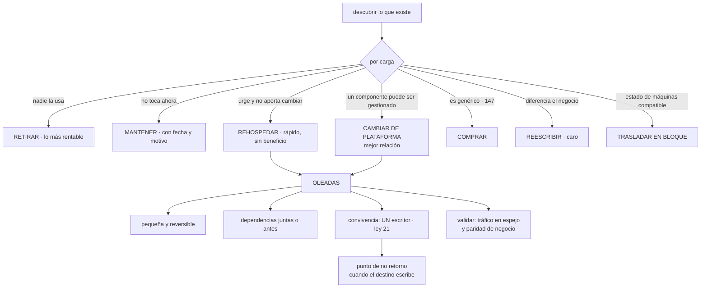

# 167 — Las 7R de migración y oleadas

> [← Clase anterior](../../part-13-multicloud-hybrid-disaster-recovery/166-backup-rto-rpo-y-patrones-de-disaster-recovery/README.md) · [Índice de la parte](../README.md) · [Clase siguiente →](../../part-13-multicloud-hybrid-disaster-recovery/168-proyecto-continuidad-activa-pasiva-entre-nubes/README.md)

**Parte:** 13 — Multi-cloud, híbrido, migración y recuperación<br>
**Nivel:** experto · **Horas estimadas:** 4<br>
**Laboratorio:** `migration` · **Estado:** `EXECUTABLE_CORE`

## 🎯 Propósito

Llevar cargas de un sitio a otro —a la nube, entre nubes o de vuelta— eligiendo por carga y no una estrategia para todas. La clase ordena las siete formas de hacerlo por coste, riesgo y beneficio, y defiende que **la primera y la más rentable es retirar lo que ya no hace falta**, que es también la que más se salta. Después trata las dos cosas que deciden si el proyecto sale bien: **el descubrimiento**, porque no se puede mover lo que no se sabe que existe, y **las oleadas**, que deben ser lo bastante pequeñas como para poder deshacerlas.

## 📚 Resultados de aprendizaje

Al finalizar podrás:

1. **Elegir** una de las siete formas por carga, con criterio.
2. **Descubrir** lo que existe de verdad, incluidas las dependencias no documentadas.
3. **Secuenciar** en oleadas pequeñas y reversibles.
4. **Convivir** durante la transición sin duplicar escritores.
5. **Validar** que la migración funcionó, y medir el programa por lo correcto.

## 🧩 Conceptos centrales

| Concepto | Comprensión verificable |
|---|---|
| `retirar` | Apagar lo que ya no se usa. Es la opción más barata y la de mayor rendimiento, y se descubre solo al inventariar. |
| `rehospedar` | Mover tal cual, sin cambiar nada. Rápido y barato, y traslada los problemas junto con la carga. |
| `cambiar de plataforma` | Sustituir un componente por su equivalente gestionado sin tocar la aplicación. Suele ser la mejor relación entre coste y beneficio. |
| `oleada` | Conjunto de cargas que se migran juntas. Debe ser pequeña, con dependencias resueltas y reversible. |
| `convivencia` | Periodo en que origen y destino funcionan a la vez. Su problema central es que solo uno puede escribir. |
| `punto de no retorno` | Momento en que ya se han escrito datos en el destino y volver deja de ser gratis. |

## 🧠 Modelo mental

Multi-cloud es una decisión de negocio y riesgo; duplicar cada componente entre proveedores rara vez es la forma más confiable o económica de lograrla.

Aplicado a esta clase, separa siempre cuatro planos: **intención** (qué necesita el usuario),
**configuración** (qué declaramos), **estado observado** (qué existe de verdad) y
**evidencia** (cómo sabemos que cumple). Confundirlos produce diseños que se ven correctos
en un diagrama pero fallan al operar.

## 🗺️ Flujo de razonamiento



## 📖 Desarrollo

### 1. Siete formas, y la que se salta

```text
RETIRAR
  apagarlo: ya no se usa
  coste     casi nulo    beneficio  el mayor de todos
  → y siempre hay más de lo que nadie cree: 10-25 % del inventario

MANTENER
  dejarlo donde está, por ahora
  → legítimo, y con FECHA y motivo escritos, o se queda para siempre

REHOSPEDAR
  mover tal cual, sin cambiar nada
  coste     bajo    riesgo  bajo    beneficio  ninguno por sí solo
  → traslada los problemas junto con la carga
  → tiene sentido cuando hay una fecha límite: un contrato que vence,
    un centro que cierra
  → y entonces el beneficio llega DESPUÉS, si se sigue trabajando

CAMBIAR DE PLATAFORMA
  sustituir un componente por su equivalente gestionado
  la base propia por una gestionada; el servidor de aplicaciones
  por contenedores
  coste     medio   beneficio  alto
  → suele ser la mejor relación de las siete

COMPRAR
  sustituirlo por un producto
  → para lo genérico, según la clasificación de la clase 147

REESCRIBIR
  rehacerlo aprovechando lo que la nube ofrece
  coste     el mayor    riesgo  el mayor
  → solo para lo que diferencia al negocio

TRASLADAR EN BLOQUE
  mover un conjunto de máquinas a un destino compatible, sin convertir
  → rápido cuando existe esa compatibilidad, y conserva las
    limitaciones del origen
```

Y la observación que ordena la clase:

```text
RETIRAR es la primera opción y la que casi nadie considera
→ porque exige saber qué se usa, y eso obliga a inventariar
→ y porque nadie se apunta el mérito de apagar cosas
```

Y el error más común, que es elegir una sola forma para todo:

```text
«vamos a rehospedarlo todo y luego ya veremos»
  → se paga la migración y no se obtiene ningún beneficio
  → y el «luego» no llega

«vamos a reescribirlo todo»
  → el plazo se multiplica y el proyecto se cancela a mitad
```

Y el criterio por carga:

```text
¿la usa alguien?             no → retirar
¿diferencia al negocio?      no → comprar o cambiar de plataforma
¿hay fecha límite dura?      sí → rehospedar y mejorar después
¿qué componente es el que duele?  → cambiar ese, no todo
```

### 2. Descubrir, que decide el proyecto

**No se puede migrar lo que no se sabe que existe.** Y el inventario documentado nunca coincide con la realidad; este programa lo ha medido tres veces:

```text
dependencias documentadas 23, observadas 41              clase 124
conexiones documentadas 23, observadas 58                clase 135
cuentas documentadas 14, existentes 23                   clase 139
```

Lo que hay que descubrir, y con qué:

```text
QUÉ EXISTE
  de la facturación, no del inventario                   clase 139
  y de lo que consume red, aunque no esté en ninguna lista

QUIÉN LO USA
  tráfico observado, registros de acceso, y preguntar
  → lo que no recibe tráfico en 90 días es candidato a retirar

DE QUÉ DEPENDE
  conexiones observadas, no el diagrama                  clase 135
  incluidas las salientes hacia terceros

QUÉ DATOS TIENE
  volumen, crecimiento y clasificación                   clase 141
  → el volumen decide el plazo de la migración

QUÉ LICENCIAS Y CONTRATOS LLEVA
  y si son válidas en el destino                         ← se olvida

QUIÉN ES SU DUEÑO
  y si no lo tiene, ese es el primer problema            ley 20
```

Y las dos preguntas que más ahorran, aplicadas a cada elemento:

```text
¿qué pasa si lo apagamos un día?
  → la forma más rápida de saber si alguien lo usa
  → y se puede hacer de verdad, con aviso, en un entorno controlado

¿quién nos llamaría?
  → si nadie sabe responder, probablemente nadie
```

Y la técnica que resuelve las dependencias ocultas sin adivinar:

```text
registrar durante semanas quién habla con quién
y quién llama a quién desde fuera
→ y solo entonces agrupar en oleadas
```

Y un aviso sobre el calendario: **el descubrimiento tarda más de lo que nadie planifica**, y recortarlo es lo que produce las sorpresas del apartado cuarto.

### 3. Oleadas y convivencia

**Las oleadas** ordenan el trabajo, y sus tres criterios:

```text
1. DEPENDENCIAS JUNTAS O ANTES
   lo que se llama mucho entre sí, se mueve junto
   → si no, cada llamada cruza la frontera y paga latencia y salida
                                                       clases 160, 161

2. LO SENCILLO PRIMERO
   la primera oleada sirve para construir la maquinaria:
   canalización, red, identidad, observabilidad, procedimiento
   → y para que el equipo aprenda con algo que no duele

3. LO BASTANTE PEQUEÑA COMO PARA DESHACERLA
   si una oleada no se puede revertir, no es una oleada:
   es una migración completa con otro nombre
```

Y el antipatrón correspondiente:

```text
MIGRACIÓN DE UNA SOLA VEZ
  todo un fin de semana, sin vuelta atrás
  → y si algo sale mal, no hay decisión que tomar: hay que seguir
  → se elige por comodidad de calendario, no por riesgo
```

**La convivencia**, que es el problema técnico central:

```text
durante la transición, origen y destino existen a la vez
y la pregunta es siempre la misma:

¿QUIÉN ESCRIBE LOS DATOS?                               ley 21
```

Y las tres respuestas, con lo que implican:

```text
MOVER LOS DATOS PRIMERO, y luego la carga
  el destino es el único escritor desde el principio
  + sin conflictos
  − hay una ventana de parada mientras se mueven

MOVER LA CARGA PRIMERO, con los datos en el origen
  el destino escribe en la base del origen, por red
  + la parada es mínima
  − latencia y salida en cada operación                 clase 161
  − y solo sirve si la latencia lo tolera

SINCRONIZAR EN LOS DOS SENTIDOS
  − conflictos garantizados                            clase 149
  → se evita salvo que se pueda partir por cliente o por región
```

Y el patrón que permite migrar por partes sin parar nada:

```text
SUSTITUCIÓN PROGRESIVA
  una fachada delante decide qué peticiones van al origen y cuáles
  al destino, por funcionalidad o por porcentaje
  se mueve una capacidad, se comprueba, y se pasa a la siguiente
  → es el escalonado de la clase 102 aplicado a una migración

y su requisito: los datos de esa capacidad tienen que estar
accesibles desde el lado que la sirve
→ que es de nuevo la pregunta de quién escribe
```

Y **el punto de no retorno**, que es el de la clase 102 a escala de migración:

```text
mientras el destino solo LEA, volver es gratis
en cuanto el destino ESCRIBE, volver significa traerse esos datos
→ y hay que decidir por adelantado en qué momento se cruza
→ y qué se hace si hay que volver después de cruzarlo
```

### 4. Lo que siempre sale mal, y cómo se valida

**La lista de sorpresas**, que se repite en casi todas las migraciones:

```text
LICENCIAS
  válidas en el hardware antiguo y no en el destino, o con otro
  modelo de cómputo
  → y el proveedor del software se entera y factura

RENDIMIENTO DISTINTO
  el procesador, el disco y la red no se comportan igual
  → una carga que iba justa, va peor
  → y hay que medir antes, no después                   clase 129

DEPENDENCIAS QUE APARECEN AL CORTAR
  un trabajo mensual, un informe trimestral, un sistema que llamaba
  una vez al día
  → por eso el descubrimiento debe durar más de un mes

VOLUMEN Y TIEMPO DE LOS DATOS
  transferir lo que hay tarda lo que tarda                clase 161
  → y esa cifra decide la ventana, no al revés

DIRECCIONAMIENTO E IDENTIDAD
  rangos que solapan, nombres que cambian, permisos que no existen
                                                        clases 159, 160

DIRECCIONES AUTORIZADAS EN TERCEROS
  el proveedor de pago solo acepta llamadas desde las direcciones
  del origen                                            clase 166

LA VENTANA DE CORTE SE QUEDA CORTA
  y hay que decidir a las 4 de la madrugada si se sigue o se vuelve
  → por eso el criterio de vuelta atrás se escribe ANTES
```

**La validación**, que decide si la migración funcionó:

```text
TRÁFICO EN ESPEJO
  se envían las mismas peticiones a origen y destino y se comparan
  las respuestas                                        clase 153
  → detecta diferencias antes de mover a nadie

PARIDAD DE NEGOCIO
  pedidos por hora, importes, tasas de conversión
  → si el sistema técnico va bien y el negocio baja, algo falla

COMPARACIÓN DE DATOS
  recuentos y sumas de control por tabla, antes y después

Y EL PLAZO DE OBSERVACIÓN
  no se declara terminada una oleada el mismo día
  → los procesos mensuales y trimestrales no han corrido todavía
```

La última evita el error más común de todos: **dar por buena una migración antes de que se ejecute el ciclo completo del negocio**.

**Cómo se mide el programa**, que es donde se engaña más gente:

```text
mal   «cargas migradas»
      → cuenta igual una que se retiró que una que se rehospedó sin
        beneficio
      → y no dice si el sistema está mejor

bien  cargas retiradas
      cargas migradas, por forma elegida
      coste antes y después, por unidad de negocio        clase 142
      latencia y disponibilidad antes y después
      incidentes causados por la migración
      y cargas que siguen en «mantener» con su fecha vencida
```

Y la última fila es la que evita el final habitual de estos programas: **un resto que nadie migra y que mantiene vivo el origen entero**, con su coste y su equipo.

Y la lista de comprobación de la clase:

```text
☐ el inventario sale de la facturación y del tráfico, no de una lista
☐ se ha preguntado por cada elemento si alguien lo usa
☐ las dependencias se han observado durante semanas, no supuesto
☐ cada carga tiene una forma elegida, con motivo
☐ lo que se mantiene tiene fecha y dueño
☐ las oleadas son pequeñas y reversibles
☐ la primera oleada es sencilla y sirve para montar la maquinaria
☐ está decidido quién escribe los datos durante la convivencia
☐ está escrito cuándo se cruza el punto de no retorno
☐ hay criterio de vuelta atrás escrito antes del corte
☐ se ha comprobado licencias, rendimiento y direcciones autorizadas
☐ hay validación con tráfico en espejo y paridad de negocio
☐ una oleada no se cierra hasta pasar un ciclo completo de negocio
☐ el programa se mide por retiradas, coste y calidad, no por cargas movidas
```

Y el cierre que enlaza con la clase siguiente: con todo lo de esta parte —motivos, portabilidad, identidad, red, datos, operación, infraestructura, flota, borde, recuperación y migración—, queda montar la continuidad de verdad entre dos proveedores y comprobarla. Y con ella, calificar las cinco predicciones de la clase 156. Es la materia de la clase 168.

## 🔬 Ejemplo trabajado

**CloudShop migra el patrimonio de la empresa adquirida: cuarenta y una cargas en un centro de datos propio con contrato que vence en once meses. El ejercicio empieza inventariando y termina con doce cargas apagadas y una oleada revertida.**

**El descubrimiento, y lo que no estaba en la lista.**

```text
cargas según el inventario recibido                            29
cargas encontradas en la facturación y en el tráfico           41
diferencia                                                     12

de las 41
  con dueño identificable                                      22
  sin tráfico en 90 días                                       14
  con dependencias no documentadas                             18
  con licencias de terceros                                     9
  con datos personales                                          6
```

Y la pregunta del apartado segundo, aplicada a las catorce sin tráfico:

```text
«¿qué pasa si lo apagamos un día?»
  se apagaron 14, con aviso, un martes
  llamadas recibidas                                            2
    → una era un informe trimestral que corría en un mes distinto
    → la otra, una integración con un proveedor externo
  las otras 12 no las echó de menos nadie
```

```text
RETIRADAS                                                     12
coste mensual que desaparece                            1.840 €
esfuerzo de migración evitado                       ~9 semanas
```

**Doce de cuarenta y una**, y ninguna estaba marcada como candidata en el inventario recibido.

**La forma elegida por carga.**

```text
RETIRAR                                                       12
MANTENER                                                       3
  → un sistema de un cliente cuyo contrato termina en 8 meses
  → con fecha escrita y dueño
REHOSPEDAR                                                    11
  → contrato del centro de datos vence: hay fecha límite dura
  → y se anota qué se hará después con cada una
CAMBIAR DE PLATAFORMA                                          9
  → 6 bases propias a bases gestionadas
  → 3 servidores de aplicaciones a contenedores
COMPRAR                                                        4
  → correo, mensajería, facturación fiscal y firma electrónica
REESCRIBIR                                                     2
  → el motor de tarifas, que sí diferencia               clase 147
TRASLADAR EN BLOQUE                                            0
```

Y la decisión de rehospedar once, con su condición:

```text
se rehospedan porque hay fecha límite
y cada una lleva escrito qué se hará después y cuándo
  6 pasarán a plataforma gestionada en los 12 meses siguientes
  3 se retirarán cuando su función se absorba
  2 quedarán como están, y eso también está escrito
```

**Las oleadas.**

```text
oleada 1   2 cargas sencillas, sin datos y sin dependencias
           objetivo real: montar canalización, red, identidad,
           observabilidad y procedimiento
           duración                                        3 semanas
           incidencias                                     11
           → todas de maquinaria, ninguna de las cargas

oleada 2   6 cargas del mismo grupo de dependencias
oleada 3   9 cargas, incluidas 4 con base de datos
oleada 4   8 cargas, las más grandes
oleada 5   2 reescrituras, con calendario propio
```

Y el criterio de agrupación salió del registro de conexiones:

```text
conexiones observadas en 6 semanas                            88
grupos que se llaman mucho entre sí                            5
cargas que había que mover juntas por latencia                14
```

**La oleada que hubo que revertir.**

```text
oleada 3, corte del sábado
02:00  se mueve el tráfico de 9 cargas al destino
02:40  una de ellas, un sistema de reservas, empieza a dar errores
03:10  causa: latencia de 41 ms hacia la base, que seguía en el origen
       la aplicación abría una conexión por consulta
       en el centro de datos eran 0,4 ms y no importaba
03:20  decisión de revertir, según el criterio escrito
03:50  revertido

tiempo total                                              1 h 50
datos escritos en el destino                                   0
  → todavía no se había cruzado el punto de no retorno
```

Y lo que permitió que la reversión fuera limpia:

```text
el criterio estaba escrito: «si algún indicador está por debajo
  del 95 % 20 minutos después del corte, se revierte»
el destino aún no escribía datos propios
y la fachada podía devolver el tráfico al origen en minutos
```

Y la corrección antes de repetirla:

```text                                          antes         después
conexiones por consulta                       una          agrupador  clase 109
consultas por operación                        41              3
latencia tolerada                            0,4 ms          41 ms
y sobre todo   se movió la base ANTES que la aplicación
oleada 3 repetida, dos semanas después                    correcta
```

**Las sorpresas del apartado cuarto, contadas.**

```text
licencias no válidas en el destino                             3
  coste adicional no previsto                          14.000 €/año
  → una se sustituyó por producto comprado, dos se renegociaron

rendimiento distinto                                           4 cargas
  → 2 necesitaron más recursos, 2 fueron más rápidas

dependencias que aparecieron al cortar                         5
  → 3 trabajos mensuales, 1 informe trimestral,
    1 integración externa que llamaba una vez al día

direcciones autorizadas en terceros                            2
  → el proveedor de pago y una pasarela bancaria
  → detectadas en el ensayo, no en el corte

ventana de corte insuficiente                                  1
  → la oleada 4: la transferencia de datos tardaba 9 h y la ventana
    era de 6
  → se resolvió con replicación previa y corte de 40 min
```

**La validación.**

```text
tráfico en espejo antes de cada corte                    3 días
  diferencias detectadas                                      19
  de ellas, esperadas                                         14
  de ellas, defectos reales                                    5
    → 2 de redondeo, 2 de zona horaria, 1 de orden de resultados
                                                        clase 153

paridad de negocio, tras cada corte
  pedidos por hora, importes y conversión, comparados 7 días
  desviaciones investigadas                                    3
  de ellas, causadas por la migración                          1

plazo de observación por oleada                          1 mes
  → para que corrieran los procesos mensuales
  incidencias detectadas en ese plazo                          6
    → 4 eran procesos periódicos que nadie había inventariado
```

**Cuatro de las seis incidencias tardías eran trabajos periódicos**, exactamente lo que el apartado cuarto anticipa.

**Cómo se midió el programa.**

```text                                          antes         después
cargas                                          41              26
  retiradas                                      —              12
  migradas                                       —              26
  mantenidas con fecha                           —               3
coste mensual del patrimonio                 9.400 €        3.100 €
coste por unidad de negocio                     —            −54 %
latencia p99 de las cargas migradas       comparada         −22 %
incidentes causados por la migración            —               2
  → 1 oleada revertida, 1 licencia detectada tarde
cargas en «mantener» con fecha vencida          —               0
centro de datos                              activo         cerrado
                                                            (mes 10)
```

Y la cifra que el equipo consideró más significativa:

```text
cargas retiradas                                              12
cargas que se habrían migrado sin inventariar                 12
semanas de trabajo evitadas                                   ~9
coste mensual evitado                                    1.840 €
```

**La lección que esta clase traslada a la parte 13**: doce de cuarenta y una cargas **no había que migrarlas: había que apagarlas**, y ninguna aparecía como candidata en el inventario recibido; se descubrieron apagándolas un martes y viendo quién llamaba. Y la única oleada que hubo que revertir se salvó por dos decisiones tomadas antes del corte: **un criterio de vuelta atrás escrito** y **no haber cruzado todavía el punto de no retorno**, porque el destino aún no escribía datos propios.

## 🧪 Laboratorio guiado

Ejecuta desde la raíz:

```bash
python classes/part-13-multicloud-hybrid-disaster-recovery/167-las-7r-de-migracion-y-oleadas/lab.py
```

El laboratorio selecciona el motor de práctica **`migration`** y produce
`lab_result.json`. El escenario, sus comprobaciones y el artefacto esperado corresponden a
esta clase; no requiere credenciales y deja explícito qué debe revalidarse en un sandbox real.

1. Lee `exercise.steps` y formula una predicción antes de ejecutar.
2. Ejecuta la práctica y verifica todos los elementos de `checks`.
3. Provoca el caso de `negative_test` y explica la señal observada.
4. Materializa `roadmap-migracion` en `evidence/` usando la plantilla indicada.
5. Para proveedor real, sigue `sandbox.requires`, registra costo y ejecuta `destroy`.

### Evidencia esperada

El artefacto principal es un inventario, dependencias, riesgo y oleadas. Además, la entrega debe incluir el comando ejecutado,
la salida estructurada y una conclusión que no exceda lo observado.

## 🏆 Reto verificable

Construye **`roadmap-migracion`** para el caso CloudShop. Incluye una alternativa descartada,
un supuesto que pueda falsarse, una prueba de fallo y una decisión de rollback.

## ✅ Criterio de aceptación

- [ ] `lab.py` termina con código 0 y genera JSON válido.
- [ ] La entrega conecta al menos tres requisitos con mecanismos verificables.
- [ ] Existe una prueba positiva y una prueba negativa con evidencia.
- [ ] Seguridad, costo y operación aparecen como decisiones, no como anexos.
- [ ] Se declara una limitación y una condición que obligaría a revisar el diseño.
- [ ] Otra persona puede repetir el recorrido sin conocimiento tácito.

## ⚠️ Errores frecuentes

| Síntoma | Causa probable | Corrección |
|---|---|---|
| Se migra todo y no se obtiene ningún beneficio | Se eligió una sola forma —rehospedar— para todas las cargas | Elige por carga: retirar, mantener con fecha, rehospedar con plan posterior, cambiar de plataforma, comprar o reescribir. |
| Aparecen sistemas y dependencias durante el corte | El inventario venía de una lista y el descubrimiento duró poco | Inventaría desde la facturación y el tráfico, observa conexiones durante semanas y apaga a propósito lo que parece no usarse. |
| Una migración sale mal y no se puede volver atrás | La oleada era demasiado grande o ya se habían escrito datos en el destino | Oleadas pequeñas, criterio de vuelta atrás escrito antes del corte y punto de no retorno declarado. |
| Durante la convivencia aparecen datos inconsistentes | Origen y destino escriben los mismos datos | Un solo escritor: mueve los datos primero, o deja la escritura en el origen mientras la carga se traslada. |
| Una carga funciona peor tras migrarla | El rendimiento del destino es distinto y la aplicación era sensible a la latencia | Mide antes, prueba con tráfico en espejo y corrige patrones conversadores antes de mover. |
| Se declara terminada la migración y semanas después fallan cosas | No corrieron los procesos mensuales y trimestrales dentro del plazo de observación | No cierres una oleada hasta que pase un ciclo completo de negocio. |

## 🛡️ Seguridad, ética y costo

Trabaja con cuentas propias o sandboxes autorizados. No publiques secretos, identificadores
reales ni datos personales. Antes de crear recursos pagos define presupuesto, etiquetas y
comando de destrucción; después verifica que no queden recursos huérfanos. Los ejemplos
locales enseñan contratos, pero no certifican cumplimiento ni disponibilidad de producción.

## ❓ Preguntas de comprobación

1. ¿Cuál de las siete formas tiene el mayor rendimiento y por qué se salta?
2. ¿De dónde debe salir el inventario y qué dos preguntas ahorran más trabajo?
3. ¿Qué tres criterios ordenan las oleadas?
4. ¿Cuáles son las tres formas de resolver quién escribe durante la convivencia?
5. ¿Por qué no se cierra una oleada el mismo día del corte?

## 🔗 Referencias

- AWS (2025). *Migration strategies: the 7 Rs* — definición y criterios de elección por carga. <https://docs.aws.amazon.com/prescriptive-guidance/latest/large-migration-guide/migration-strategies.html>
- Google Cloud (2025). *Migration to Google Cloud: assess and discover* — descubrimiento y dependencias observadas. <https://cloud.google.com/architecture/migration-to-gcp-getting-started>
- Microsoft (2025). *Cloud Adoption Framework: migrate* — oleadas, ventanas y validación. <https://learn.microsoft.com/azure/cloud-adoption-framework/migrate/>
- Fowler, M. (2004). *Strangler fig application* — sustitución progresiva con fachada. <https://martinfowler.com/bliki/StranglerFigApplication.html>
- Humble, J. y Farley, D. (2010). *Continuous Delivery*, cap. 12 — migraciones de datos y convivencia. <https://www.oreilly.com/library/view/continuous-delivery-reliable/9780321670250/>
- Documentación oficial vigente del servicio implementado; registra URL y fecha de consulta.

---

> [Evaluación](assessment.md) · [Contrato de clase](lesson.yaml) · [Índice de la parte](../README.md)
