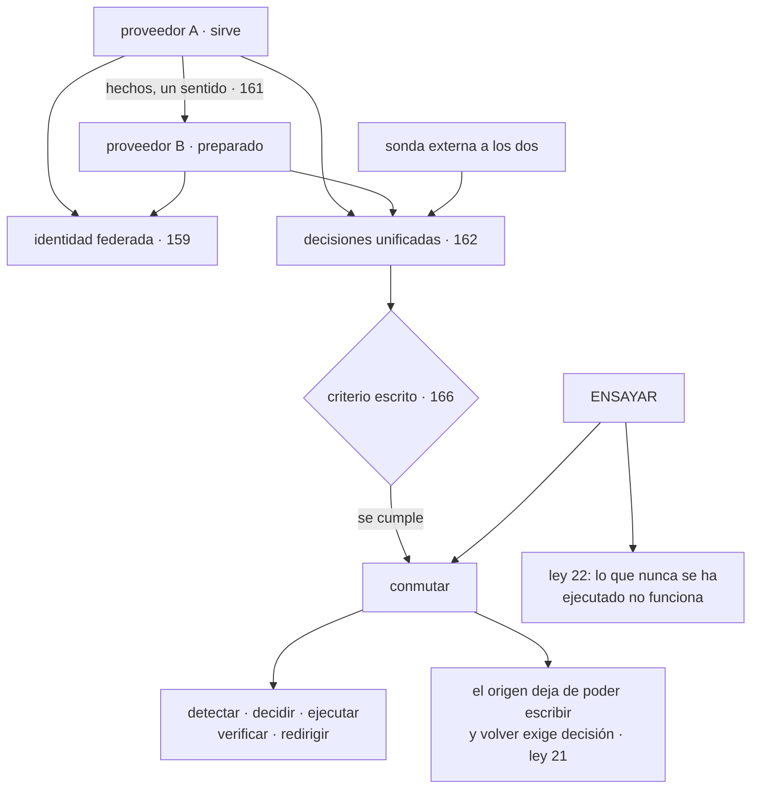

# 168 — Proyecto: continuidad activa-pasiva entre nubes

> [← 167 · Las 7R de migración y oleadas](../../part-13-multicloud-hybrid-disaster-recovery/167-las-7r-de-migracion-y-oleadas/README.md) · [Índice de la parte](../README.md) · [169 · Landing zones empresariales y vending de cuentas →](../../part-14-advanced-platform-capstones-career/169-landing-zones-empresariales-y-vending-de-cuentas/README.md)

**Parte:** 13 — Multi-cloud, híbrido, migración y recuperación<br>
**Nivel:** experto · **Horas estimadas:** 8<br>
**Laboratorio:** `capstone` · **Estado:** `EXECUTABLE_CORE`

## 🎯 Propósito

Montar la continuidad entre proveedores de verdad —activo-pasivo, que es lo que la parte ha ido justificando como suficiente— y **ejecutarla**, que es lo único que la convierte en algo real. La clase da el proyecto completo, sus pruebas negativas y las cifras que hay que medir. Y cierra la parte con las tres piezas de siempre: calificar las cinco predicciones de la clase 156, incorporar la ley que esta parte ha hecho aparecer seis veces y que llevaba implícita desde la clase 088, y escribir la predicción que la parte 14 tendrá que corregir.

## 📚 Resultados de aprendizaje

Al finalizar podrás:

1. **Montar** una configuración activo-pasivo entre proveedores con lo construido en la parte.
2. **Ejecutar** una conmutación real y medir sus cinco tramos.
3. **Calificar** las cinco predicciones de la clase 156 con evidencia.
4. **Incorporar** la ley 22 al cuestionario, con su recuento histórico.
5. **Escribir** la predicción de la parte 14 en términos que se puedan desmentir.

## 🧩 Conceptos centrales

| Concepto | Comprensión verificable |
|---|---|
| `activo-pasivo entre proveedores` | Un proveedor sirve y el otro está preparado para asumir, con datos replicados y decisión humana. |
| `conmutación ensayada` | Ejecución real del plan, con cronómetro y con las consecuencias asumidas. Es lo único que produce una cifra fiable. |
| `ley 22` | Un procedimiento que nunca se ha ejecutado no funciona: la primera ejecución siempre encuentra algo, y encontrarlo durante una crisis cuesta mucho más. |
| `calificación de hipótesis` | Comparar lo predicho con lo ocurrido publicando también lo que se predijo mal. |
| `coste de estar preparado` | Lo que cuesta mantener la opción de conmutar, frente al coste del suceso por su probabilidad. |
| `hipótesis de la parte 14` | Predicción escrita ahora sobre lo que ocurrirá cuando el sujeto sea la escala organizativa y el cierre del programa. |

## 🧠 Modelo mental

Multi-cloud es una decisión de negocio y riesgo; duplicar cada componente entre proveedores rara vez es la forma más confiable o económica de lograrla.

Aplicado a esta clase, separa siempre cuatro planos: **intención** (qué necesita el usuario),
**configuración** (qué declaramos), **estado observado** (qué existe de verdad) y
**evidencia** (cómo sabemos que cumple). Confundirlos produce diseños que se ven correctos
en un diagrama pero fallan al operar.

## 🗺️ Flujo de razonamiento



## 📖 Desarrollo

### 1. Lo que la parte deja montado

Las once clases anteriores forman un recorrido con una conclusión clara sobre el nivel:

```text
motivos interrogados; sobreviven pocos, y ninguno pide activo-activo
                                                        clase 157
portabilidad medida en semanas, no anulada con una capa
                                                        clase 158
identidad federada, sin claves entre nubes               clase 159
conectividad: la mínima, y a menudo ninguna              clase 160
datos: un solo escritor, replicando hechos               clase 161
operación: decisiones unificadas, datos locales          clase 162
infraestructura: un módulo por proveedor, estados separados
                                                        clase 163
flota: idéntico lo que importa, ventana de versiones     clase 164
emplazamientos propios: dueños de sus datos              clase 165
continuidad: objetivos por escenario, medidos            clase 166
migración: retirar primero, oleadas reversibles          clase 167
```

Y el nivel que sale de todo eso, con el vocabulario de la clase 157:

```text
nivel 1 para las cargas independientes
nivel 3 —activo-pasivo— para lo que debe sobrevivir a perder un
  proveedor entero
y nivel 5 descartado, con el motivo escrito                ley 21
```

Y las cuatro condiciones sin las cuales el nivel 3 no funciona:

```text
1. UN SOLO ESCRITOR en todo momento
   y un mecanismo que impida que el origen vuelva a escribir
   sin decisión explícita                                clase 150

2. CUANTO NO SE REPLICA, PREPARADO DE ANTEMANO
   certificados, secretos, cuotas, permisos, direcciones autorizadas
                                                        clase 166

3. CRITERIO DE DECISIÓN ESCRITO, con quién decide y suplente

4. ENSAYOS PERIÓDICOS
   sin ellos, lo anterior es un documento                ley 22
```

Y el coste de estar preparado, que hay que declarar junto al beneficio:

```text
replicación continua de hechos                          ~25-140 €/mes
infraestructura mínima encendida en el destino          ~310 €/mes
cuotas reservadas                                            0 €
ensayos: 4 al año × medio día de tres personas          ~6 días/año
                                                       ────────────
frente a la pérdida estimada de un día de caída          ~90.000 €
```

### 2. El proyecto

Montar activo-pasivo entre dos proveedores para el flujo de compra, y ejecutarlo. Lo que hay que entregar:

```text
1. IDENTIDAD
   federación de personas y de cargas, con sujeto acotado  clase 159
   acceso de emergencia por proveedor, ensayado            clase 134

2. DATOS
   replicación de hechos en un sentido                     clase 161
   copias inmutables en cuenta separada                    clase 166
   y el mecanismo que impide dos escritores                 ley 21

3. INFRAESTRUCTURA
   módulos por proveedor con la misma interfaz             clase 163
   estados separados, cada uno en su proveedor
   destino declarado y creable en minutos

4. RED Y NOMBRES
   tiempos de vida cortos en los registros                 clase 160
   direcciones del destino autorizadas en los terceros

5. OPERACIÓN
   decisiones unificadas y datos locales                   clase 162
   sonda externa a los dos proveedores
   criterio de conmutación escrito, con nombres            clase 166

6. ENSAYO
   conmutación completa, con cronómetro, cada trimestre
   y vuelta atrás, ensayada aparte
```

Y las preguntas cuya respuesta hay que escribir:

```text
¿cuánto tarda cada tramo de la conmutación, medido?
¿cuántos datos se pierden, medido?
¿quién decide y quién es su suplente?
¿qué pasa si el origen revive solo?
¿la cuota del destino da para toda la carga?
¿el procedimiento vive fuera del proveedor que puede caerse?
¿cuántas personas pueden ejecutarlo?
```

**Las pruebas negativas de la parte 13**, que son la entrega más valiosa:

```text
☐ conmutar de verdad y cronometrar los cinco tramos
☐ volver atrás y comprobar que no hay dos escritores
☐ cortar el enlace entre proveedores 15 minutos          clase 160
☐ restaurar una copia y cronometrar                      clase 166
☐ simular un borrado y recuperar de copia inmutable
☐ desplegar en el segundo proveedor desde cero           clase 158
☐ usar el acceso de emergencia de cada proveedor         clase 159
☐ comprobar que la sonda externa avisa con el principal caído
☐ intentar obtener credenciales de B desde una carga no autorizada
☐ dejar sin sincronizar un clúster y ver si salta la alerta  clase 164
☐ desplegar una versión que no arranca en un emplazamiento   clase 165
```

Y la advertencia que la ley 22 impone: **si alguna no se ha ejecutado nunca, no está resuelta**, esté escrita como esté.

### 3. Calificación de las cinco predicciones

**Predicción 1: «menos de la mitad de los motivos de multi-nube sobrevivirán a la pregunta, y el que más sobrevive no será el más citado».**

```text
veredicto: ACERTADA en las dos mitades
```

```text
motivos declarados                                             8
sobreviven                                                     3   (37,5 %)
el más citado                    «no depender de un proveedor»
  → retirado: se sustituyó por coste de salida medible
los que sobreviven               normativa, capacidad exclusiva
                                 y exigencia de un cliente
```

**Predicción 2: «el coste dominante será la salida de datos, con dos cifras porcentuales».**

```text
veredicto: ACERTADA en la cifra, EQUIVOCADA en el origen
```

```text
coste de red frente al cómputo                            15 %   ✓

y el desglose:
  tráfico entre zonas del MISMO proveedor y región         31 %
  respuestas a usuarios                                    21 %
  telemetría enviada fuera                                 14 %
  …
  replicación entre proveedores                        25 €/mes
```

La partida mayor **no cruzaba ninguna frontera entre nubes**, y la replicación entre proveedores —lo que la predicción señalaba— resultó ser la más barata de todas, porque mover hechos cuesta el ritmo de cambio y no el tamaño.

**Predicción 3: «la ley 21 dominará, y activo-activo con escritura en los dos lados casi nunca compensará».**

```text
veredicto: ACERTADA
```

```text
ley 21 en la parte 13                                          5
  157  el nivel 5 se descarta porque el dato tendría dos escritores
  161  el sentido de la replicación se decide por el escritor único
  165  cada emplazamiento es dueño de sus datos
  166  la vuelta atrás y el riesgo de dos escritores
  167  quién escribe durante la convivencia de una migración

y la formulación que quedó:
  si los datos se pueden partir de modo que cada uno tenga un
  escritor, no es activo-activo: son conjuntos independientes
```

**Predicción 4: «lo más difícil será la identidad y la red, no mover la carga».**

```text
veredicto: PARCIALMENTE ACERTADA
```

Identidad y red sí dieron más problemas que la portabilidad:

```text
identidad   3 personas de baja con acceso, 180 cargas que podían
            obtener credenciales ajenas, ningún rol común posible
red         4 solapes de rango, un nombre con dos significados,
            una dependencia que se creía blanda
portabilidad  5 fallos al año, detectados por una prueba mensual
```

Y lo que la predicción no vio: **el problema mayor de la parte no fue ninguno de los tres**. Fue que casi nada se había ejecutado nunca:

```text
plan de continuidad         nunca ejecutado → 10 h 51 frente a 4 h
prueba de portabilidad      no existía → 23 fallos acumulados
acceso de emergencia de B   no funcionaba
sonda externa               vivía en el proveedor que se cae
restauración de copia       una vez en 14 meses
```

**Predicción 5: «los objetivos de recuperación declarados serán entre 3 y 10 veces menores que los medidos».**

```text
veredicto: ACERTADA en el fenómeno, EQUIVOCADA en el rango
```

```text
declarado                                                  4 h
medido                                                10 h 51
factor                                                    ×2,7
```

Por debajo del rango previsto. Y el motivo del error es un acierto de partes anteriores:

```text
el tramo de DETECCIÓN, que en una organización sin la parte 10
habría durado horas, duró 90 segundos                    clase 162
→ sin ese trabajo previo, el factor habría estado dentro del rango
```

**Recuento de la calificación:**

```text
acertadas del todo                                             2
acertadas con el fenómeno y falladas en el detalle             3
falladas del todo                                              0
```

### 4. La ley 22, el recuento y la hipótesis de la parte 14

```text
LEY 22
  Un procedimiento que nunca se ha ejecutado no funciona.
  No es que pueda fallar: es que la primera ejecución SIEMPRE
  encuentra algo, y encontrarlo durante una crisis cuesta un orden
  de magnitud más.
```

Sus seis apariciones en esta parte:

```text
clase 157   plan de continuidad de 2023, nunca ejecutado
clase 158   sin prueba de portabilidad: 23 fallos acumulados frente
            a 5 al año con prueba mensual
clase 159   el acceso de emergencia del segundo proveedor no funcionaba
clase 162   la sonda vivía en el proveedor cuya caída debía detectar
clase 165   el camino manual de recuperación: 9 preguntas la primera vez
clase 166   el plan declaraba 4 h y medía 10 h 51
```

Y su historia previa, porque llevaba implícita desde el principio:

```text
clase 088   una copia no restaurada no es una copia
clase 102   desplegar una versión rota para comprobar que el canario para
clase 131   el botón de parada de experimentos, que no funcionaba
clase 134   ensayo anual del acceso de emergencia
clase 144   once pruebas negativas; tres fallaron la primera vez
```

Y su diferencia con la ley 13, que es su vecina:

```text
ley 13   algo que FUNCIONABA deja de funcionar y no da error
ley 22   algo que NUNCA ha funcionado se supone que funciona
```

Y lo que añade al cuestionario:

```text
¿esto se ha ejecutado alguna vez? ¿cuándo? ¿quién?
¿qué encontró la última ejecución?
¿cada cuánto se repite?
¿quién puede ejecutarlo, además de quien lo escribió?
```

**Recuento tras la parte 13:**

```text
ley 13  el bucle que no corre no da error                        27
ley 16  un control que estorba acaba desactivado o rodeado       22
ley 21  el acoplamiento está en quién escribe                     9
ley 15  una señal con demasiados elementos deja de ser señal     20
ley 14  las decisiones de creación son irreversibles             19
ley 20  lo que no tiene dueño no se apaga ni se corrige          11
ley 11  lo que entra en un sistema de solo-añadir se queda        9
ley 22  lo que nunca se ha ejecutado no funciona                  11
        NUEVA, con seis apariciones en esta parte y cinco previas
ley 19  lo que compensa un fallo lo vuelve invisible              7
ley 17  la medida que se vuelve objetivo se alcanza sin mejorar   6
ley 18  lo asíncrono traslada la garantía, no la elimina          5
```

**La hipótesis de la parte 14.** La parte siguiente sube de escala: zonas de aterrizaje empresariales, gobierno federado, plataforma como producto, modelo operativo, madurez, cargas de inteligencia artificial, soberanía, y el proyecto final. La predicción, escrita para poder desmentirla:

```text
1. La escala organizativa no traerá problemas técnicos nuevos:
   traerá los mismos con más gente delante.
   → predigo que la ley dominante será la 16 —el control que estorba
     acaba rodeado—, porque a escala hay más gente a la que estorbar
   → y que las clases 169 a 174 tratarán, en el fondo, de cómo
     mantener un control cuando quien lo sufre no conoce a quien lo puso

2. En las cargas de inteligencia artificial, el problema dominante
   NO será el modelo ni las tarjetas gráficas: será el DATO.
   → predigo que la clase 175 acabará tratando de propiedad,
     procedencia, residencia y coste de mover datos, y que las leyes
     que aparecerán serán la 14 y la 21, no ninguna nueva

3. En soberanía y computación confidencial, la conclusión honesta
   será que la mayor parte de lo que se vende como soberanía
   resuelve una amenaza que casi nadie tiene.
   → y que lo que sí resuelve un problema real es lo mismo de la
     clase 141: saber dónde está cada dato y poder demostrarlo

4. El proyecto final encontrará que lo que falta no es tecnología:
   → predigo que la mayoría de sus hallazgos serán de las leyes 20
     y 22 —cosas sin dueño y cosas nunca ejecutadas—, y no fallos
     de diseño

5. Y la predicción que puede salir del revés: al recorrer el programa
   entero, las leyes que más habrán aparecido no serán las más útiles.
   → predigo que la 13 y la 15 dominarán el recuento y que las que
     más decisiones habrán cambiado serán la 14 y la 21
```

Y lo que se anota para calificar sin trampa:

```text
lo que ya sabemos    que la 13 y la 15 dominan el recuento
lo que creemos       que el valor de una ley no está en su frecuencia
lo que no sabemos    si hay alguna ley que sobra, o que es un caso
                     particular de otra
```

## 🔬 Ejemplo trabajado

**CloudShop monta activo-pasivo entre sus dos proveedores para el flujo de compra y lo ejecuta cuatro veces en un año. Lo que sigue es el resultado de cada ensayo y el recuento de la parte.**

**El montaje.**

```text
proveedor A          sirve el 100 % del tráfico
proveedor B          preparado, con lo mínimo encendido
replicación          hechos, un sentido, ~2,1 s de retardo   clase 161
coste de estar preparado                              ~480 €/mes
  replicación                                            140 €
  infraestructura mínima                                 310 €
  copias inmutables en cuenta separada                    30 €
```

Y lo preparado de antemano, de la lista de la clase 166:

```text
cuotas del destino                    150 instancias, solicitadas
certificados                          emitidos y replicados
secretos                              presentes, con identidad propia
permisos y roles                      equivalentes, comprobados  clase 159
direcciones autorizadas en terceros   las de B, añadidas
registro de imágenes                  réplica en B
tiempos de vida de nombres            60 s
procedimiento                         repositorio replicado + impreso
trabajos periódicos                   declarados, desactivados en B
```

**Ensayo 1.**

```text
detectar                                    80 s
decidir                                     4 min
ejecutar                                   14 min
verificar                                   3 min
redirigir                                   9 min
                                          ──────
total                                      31 min
pérdida de datos                            22 s

hallazgos                                       3
  los trabajos periódicos no se activaron en B: 2 no corrieron
  una alerta seguía apuntando a recursos de A
  y el panel de objetivos mezclaba datos de los dos
```

**Ensayo 2, tres meses después.**

```text
total                                      24 min
pérdida                                     18 s
hallazgos                                       2
  una carga nueva desplegada en el trimestre no estaba replicada
    → nadie había añadido su base a la replicación
  un certificado emitido en el trimestre no se había copiado a B
```

Y la corrección fue de proceso, no técnica:

```text
toda carga nueva pasa por una comprobación de continuidad
  ¿sus datos se replican?
  ¿sus secretos y certificados están en el destino?
  ¿está en el procedimiento?
→ una casilla en la plantilla de servicio nuevo         clase 106
cargas sin cobertura detectadas después                        0
```

**Ensayo 3: la vuelta atrás.**

```text
se conmutó y se permaneció en B durante 6 horas, sirviendo tráfico real
y después se volvió

conmutar                                   22 min
permanencia en B                            6 h
  latencia p99                             +18 ms
  incidencias                                   1  (una integración
                                                   con lista de direcciones
                                                   que no se había
                                                   actualizado)
volver                                     48 min
  replicación en sentido inverso            31 min
  comprobación de escritor único            ✓
  pedidos escritos en el sitio equivocado        0
```

**Seis horas sirviendo tráfico real desde el segundo proveedor**, que es la única forma de saber que funciona.

**Ensayo 4: con el proveedor principal realmente degradado.**

No fue un ensayo: fue un incidente real del proveedor.

```text
11:02  degradación del proveedor A en la región principal
11:03  la sonda externa avisa                                 60 s
11:07  se cumple el criterio escrito; decide quien está de guardia
11:21  conmutado y verificado
11:30  tráfico redirigido

total                                      28 min
pérdida                                     31 s
intervención de quien construyó el sistema        ninguna
personas capaces de ejecutarlo                   6 de 9
```

Y la comparación que cierra la parte:

```text
primer ensayo, hace un año                 10 h 51
incidente real                             28 min
factor                                     ×23 más rápido
y nada de esa mejora vino de cambiar el patrón: sigue siendo
  activo-pasivo con lo mínimo encendido
```

**Las once pruebas negativas de la parte.**

```text
 1. conmutar y cronometrar                    ✓  4 ejecuciones
 2. volver atrás sin dos escritores           ✓
 3. cortar el enlace entre proveedores        ✓  (clase 160)
 4. restaurar una copia y cronometrar         ✓  38 min
 5. simular un borrado y recuperar            ✓  pérdida 5 min
 6. desplegar en B desde cero                 ✓  mensual
 7. acceso de emergencia de cada proveedor    ✓  falló el primero
 8. sonda externa con el principal caído      ✓  falló el primero
 9. credenciales desde una carga no autorizada ✓ falló el primero
10. clúster sin sincronizar                   ✓  falló el primero
11. versión que no arranca en un emplazamiento ✓ falló el primero

pruebas que fallaron la primera vez                     5 de 11
```

**Cinco de once fallaron la primera vez que se ejecutaron**, y las cinco estaban documentadas como resueltas. Es la ley 22, medida.

**El recuento de la parte 13.**

```text                                    inicio parte 13    final
proveedores                                     3              2
motivos escritos e interrogados                 0              8
motivos vivos                                   —              3
nivel de multi-nube                        sin decidir         1 y 3
capa de abstracción propia                  propuesta      no existe
coste de salida documentado                     no             sí
usuarios locales en las nubes                   15             0
claves de larga duración entre nubes             3             0
conectividad privada entre proveedores      proyecto           0
solapes de rango                                 4             0
coste mensual de red                        2.850 €         520 €
coste de observar el segundo proveedor       728 €          219 €
estados que abarcan dos proveedores              3             0
clústeres                                        9             6
tiendas con operación sin conexión         340 de 340   340 de 340
plazo de recuperación declarado                4 h          45 min
plazo de recuperación medido               10 h 51         28 min
copias inmutables en cuenta separada            no            sí
ensayos de conmutación ejecutados                0             4
personas capaces de ejecutar la conmutación      2             6
cargas migradas y retiradas                     —      26 y 12
```

**Lo que la parte 13 no resolvió, dicho con claridad.**

```text
el coste de salida del servicio de análisis sigue siendo alto
  y se ha aceptado por escrito, con revisión anual
los metadatos siguen procesándose fuera de la región exigida
  documentado, no resuelto                              clase 141
y la vuelta atrás sigue tardando más que la conmutación,
  porque el destino acumula datos nuevos
```

**La conclusión que cierra la parte 13**: el plan de continuidad existía desde hacía dos años y declaraba cuatro horas; al ejecutarlo por primera vez tardó **casi once**, y de ese tiempo el 41 % no fue ejecutar nada. Un año y cuatro ensayos después, un incidente real del proveedor se resolvió en veintiocho minutos sin que interviniera nadie de quienes lo construyeron. **El patrón no cambió: seguía siendo activo-pasivo con lo mínimo encendido.** Lo que cambió fue haberlo ejecutado.

## 🧪 Laboratorio guiado

Ejecuta desde la raíz:

```bash
python classes/part-13-multicloud-hybrid-disaster-recovery/168-proyecto-continuidad-activa-pasiva-entre-nubes/lab.py
```

El laboratorio selecciona el motor de práctica **`capstone`** y produce
`lab_result.json`. El escenario, sus comprobaciones y el artefacto esperado corresponden a
esta clase; no requiere credenciales y deja explícito qué debe revalidarse en un sandbox real.

1. Lee `exercise.steps` y formula una predicción antes de ejecutar.
2. Ejecuta la práctica y verifica todos los elementos de `checks`.
3. Provoca el caso de `negative_test` y explica la señal observada.
4. Materializa `plataforma-multicloud` en `evidence/` usando la plantilla indicada.
5. Para proveedor real, sigue `sandbox.requires`, registra costo y ejecuta `destroy`.

### Evidencia esperada

El artefacto principal es un incremento integrado, demostrable y documentado. Además, la entrega debe incluir el comando ejecutado,
la salida estructurada y una conclusión que no exceda lo observado.

## 🏆 Reto verificable

Construye **`plataforma-multicloud`** para el caso CloudShop. Incluye una alternativa descartada,
un supuesto que pueda falsarse, una prueba de fallo y una decisión de rollback.

## ✅ Criterio de aceptación

- [ ] `lab.py` termina con código 0 y genera JSON válido.
- [ ] La entrega conecta al menos tres requisitos con mecanismos verificables.
- [ ] Existe una prueba positiva y una prueba negativa con evidencia.
- [ ] Seguridad, costo y operación aparecen como decisiones, no como anexos.
- [ ] Se declara una limitación y una condición que obligaría a revisar el diseño.
- [ ] Otra persona puede repetir el recorrido sin conocimiento tácito.

## ⚠️ Errores frecuentes

| Síntoma | Causa probable | Corrección |
|---|---|---|
| Existe un plan de continuidad y nadie sabe cuánto tarda de verdad | Ley 22: nunca se ha ejecutado | Ejecútalo con cronómetro, mide los cinco tramos y repítelo cada trimestre. |
| Una carga nueva no está cubierta por el plan | La continuidad no forma parte del alta de un servicio | Añade una comprobación de continuidad a la plantilla de servicio nuevo: replicación, secretos, certificados y procedimiento. |
| Tras conmutar, el origen revive y acepta escrituras | No hay mecanismo que se lo impida | Marca el origen como no autorizado a escribir al conmutar y exige decisión explícita para volver. |
| Se monta activo-activo con escritura en los dos lados y aparecen conflictos | Un dato con dos escritores | Parte los datos por cliente o por región para que cada uno tenga un escritor; si no se puede, activo-pasivo. |
| Los ensayos se hacen sin tráfico real y no demuestran nada | Se ejecuta el procedimiento sin permanecer en el destino | Permanece sirviendo tráfico real varias horas y vuelve después; ahí aparecen las integraciones que faltaban. |
| Se dan por buenas las predicciones de la parte anterior sin revisarlas | Calificar solo lo que salió bien convierte el aprendizaje en opinión | Publica el veredicto de cada una con su evidencia, incluidas las tres que acertaron el fenómeno y fallaron el detalle. |

## 🛡️ Seguridad, ética y costo

Trabaja con cuentas propias o sandboxes autorizados. No publiques secretos, identificadores
reales ni datos personales. Antes de crear recursos pagos define presupuesto, etiquetas y
comando de destrucción; después verifica que no queden recursos huérfanos. Los ejemplos
locales enseñan contratos, pero no certifican cumplimiento ni disponibilidad de producción.

## ❓ Preguntas de comprobación

1. ¿Qué cuatro condiciones hacen falta para que activo-pasivo funcione?
2. ¿En qué acertó y en qué falló la predicción sobre el coste de salida de datos?
3. ¿Por qué el factor entre el plazo declarado y el medido fue menor de lo predicho?
4. ¿Qué dice la ley 22 y en qué se diferencia de la ley 13?
5. ¿Qué predice la hipótesis de la parte 14 sobre las cargas de inteligencia artificial y sobre la soberanía?

## 🔗 Referencias

- AWS (2025). *Disaster recovery across providers: considerations* — límites y coste de la continuidad entre nubes. <https://docs.aws.amazon.com/whitepapers/latest/disaster-recovery-workloads-on-aws/disaster-recovery-workloads-on-aws.html>
- Google Cloud (2025). *Architecting disaster recovery for cloud infrastructure outages* — objetivos, patrones y pruebas. <https://cloud.google.com/architecture/disaster-recovery>
- Azure (2025). *Reliability testing and failover drills* — ensayos periódicos y su registro. <https://learn.microsoft.com/azure/reliability/>
- Google SRE (2025). *Disaster role playing and readiness testing* — ejecutar el plan como parte de la operación. <https://sre.google/workbook/>
- Uptime Institute (2025). *Outage analysis and recovery practice* — frecuencia real de fallos por región y por proveedor. <https://uptimeinstitute.com/resources>
- Documentación oficial vigente del servicio implementado; registra URL y fecha de consulta.

---

> [Evaluación](assessment.md) · [Contrato de clase](lesson.yaml) · [Índice de la parte](../README.md)

**📥 Descargar:** [Parte 13 en PDF](../../../site/downloads/partes/manual-parte-13-multicloud-hybrid-disaster-recovery.pdf) · [Manual integral](../../../site/downloads/multi-cloud-engineering-manual-v2.0.pdf)

| Anterior | Índice | Siguiente |
|---|---|---|
| [← 167 · Las 7R de migración y oleadas](../../part-13-multicloud-hybrid-disaster-recovery/167-las-7r-de-migracion-y-oleadas/README.md) | [Parte 13](../README.md) · [Programa](../../README.md) | [169 · Landing zones empresariales y vending de cuentas →](../../part-14-advanced-platform-capstones-career/169-landing-zones-empresariales-y-vending-de-cuentas/README.md) |
