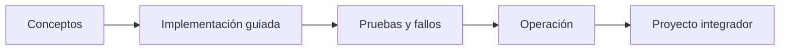

# Parte 13 — Multi-cloud, híbrido, migración y recuperación

> [← Parte 12](../part-12-cloud-native-distributed-architecture/README.md) · [Índice completo](../README.md) · [Parte 14 →](../part-14-advanced-platform-capstones-career/README.md)

**📥 Descargar:** [Esta parte en PDF](../../site/downloads/partes/manual-parte-13-multicloud-hybrid-disaster-recovery.pdf) · [Manual integral](../../site/downloads/multi-cloud-engineering-manual-v2.0.pdf)

**Nivel:** experto · **Clases:** 12 · **Duración sugerida:** 6–8 semanas

Diseñar continuidad y portabilidad sin ocultar complejidad, latencia ni egress.

## Resultados de la parte

Al completar esta parte podrás explicar el dominio con lenguaje independiente del proveedor,
implementar sus mecanismos esenciales, diagnosticar fallos y defender decisiones mediante
evidencia, costo, seguridad y objetivos de confiabilidad.

## Modelo mental

Multi-cloud es una decisión de negocio y riesgo; duplicar cada componente entre proveedores rara vez es la forma más confiable o económica de lograrla.

## Secuencia

## Clases

| ID | Clase | Laboratorio | Horas |
|---:|---|---|---:|
| 157 | [Motivaciones y anti-patrones de multi-cloud](157-motivaciones-y-anti-patrones-de-multi-cloud/README.md) | `decision` | 4 |
| 158 | [Portabilidad, capas de abstracción y lock-in](158-portabilidad-capas-de-abstraccion-y-lock-in/README.md) | `architecture` | 4 |
| 159 | [Federación de identidad entre nubes](159-federacion-de-identidad-entre-nubes/README.md) | `iam` | 4 |
| 160 | [Conectividad, tránsito, DNS y service discovery](160-conectividad-transito-dns-y-service-discovery/README.md) | `network` | 4 |
| 161 | [Replicación de datos, soberanía y costos de egress](161-replicacion-de-datos-soberania-y-costos-de-egress/README.md) | `data` | 4 |
| 162 | [Observabilidad y operación entre proveedores](162-observabilidad-y-operacion-entre-proveedores/README.md) | `observability` | 4 |
| 163 | [Terraform multi-provider y separación de estados](163-terraform-multi-provider-y-separacion-de-estados/README.md) | `iac` | 4 |
| 164 | [Flotas Kubernetes y políticas comunes](164-flotas-kubernetes-y-politicas-comunes/README.md) | `kubernetes` | 4 |
| 165 | [Nube híbrida, edge y conectividad privada](165-nube-hibrida-edge-y-conectividad-privada/README.md) | `hybrid` | 4 |
| 166 | [Backup, RTO, RPO y patrones de disaster recovery](166-backup-rto-rpo-y-patrones-de-disaster-recovery/README.md) | `reliability` | 4 |
| 167 | [Las 7R de migración y oleadas](167-las-7r-de-migracion-y-oleadas/README.md) | `migration` | 4 |
| 168 | [Proyecto: continuidad activa-pasiva entre nubes](168-proyecto-continuidad-activa-pasiva-entre-nubes/README.md) | `capstone` | 8 |

## Evaluación de la parte

- 35 % laboratorios y evidencia reproducible.
- 25 % retos verificables.
- 20 % decisiones y ADR.
- 10 % seguridad, confiabilidad y costo.
- 10 % proyecto integrador de la parte.

Se aprueba con 80 % de clases en nivel B o superior y el proyecto integrador reproducible.

## Pauta bibliográfica

- Cloud Strategy — Gregor Hohpe.
- Seeking SRE — Blank-Edelman.
- Enterprise Integration Patterns — Hohpe y Woolf.
