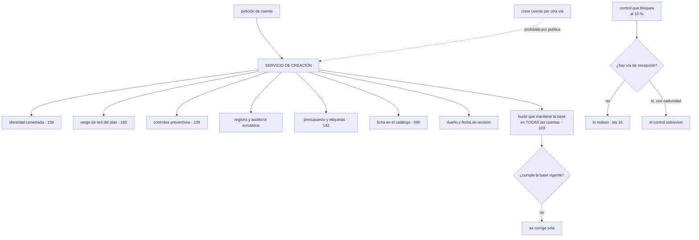

# 169 — Landing zones empresariales y vending de cuentas

> [← Clase anterior](../../part-13-multicloud-hybrid-disaster-recovery/168-proyecto-continuidad-activa-pasiva-entre-nubes/README.md) · [Índice de la parte](../README.md) · [Clase siguiente →](../../part-14-advanced-platform-capstones-career/170-gobierno-federado-y-policy-as-code-a-escala/README.md)

**Parte:** 14 — Plataformas avanzadas, capstones y carrera<br>
**Nivel:** experto-frontera · **Horas estimadas:** 4<br>
**Laboratorio:** `governance` · **Estado:** `EXECUTABLE_CORE`

## 🎯 Propósito

Llevar la base de la clase 144 a una escala donde ya no se puede crear una cuenta a mano. La clase convierte la creación en un servicio de autoservicio que entrega una cuenta completa en minutos, y sostiene la condición sin la cual nada de esto existe: **que sea la única forma de crear una cuenta**. Después trata los dos problemas que solo aparecen con muchos equipos: **un control correcto para el 90 % bloquea al 10 % restante**, y **las cuentas creadas hace dos años no tienen la base de hoy**, que no se arregla con un proyecto de migración sino con un bucle.

## 📚 Resultados de aprendizaje

Al finalizar podrás:

1. **Convertir** la creación de cuentas en un servicio de autoservicio.
2. **Impedir** que exista otra forma de crear una cuenta.
3. **Diseñar** la jerarquía sabiendo que reorganizarla después duele.
4. **Gestionar** las excepciones para que nadie tenga que rodear un control.
5. **Mantener** al día las cuentas antiguas sin migraciones puntuales.

## 🧩 Conceptos centrales

| Concepto | Comprensión verificable |
|---|---|
| `servicio de creación` | Autoservicio que entrega una cuenta configurada: identidad, red, controles, registro, presupuesto, etiquetas y ficha en el catálogo. |
| `vía única` | Propiedad de que no exista otra forma de crear una cuenta. Sin ella, la base no cubre lo que no pasó por ahí. |
| `jerarquía` | Árbol de la organización donde se anclan los controles. Es una decisión de creación y reorganizarla mueve todo lo que cuelga. |
| `excepción con caducidad` | Permiso explícito para saltarse un control, con motivo, responsable y fecha que revoca. |
| `deriva de base` | Diferencia entre la configuración con la que se creó una cuenta y la vigente. Crece con el tiempo y con el número de cuentas. |
| `cierre de cuenta` | Proceso de retirar una cuenta que ya no hace falta. Sin él, el inventario solo crece. |

## 🧠 Modelo mental

El nivel experto no consiste en conocer más productos, sino en formular mejores preguntas, validar supuestos y sostener decisiones frente a costo, riesgo y operación.

Aplicado a esta clase, separa siempre cuatro planos: **intención** (qué necesita el usuario),
**configuración** (qué declaramos), **estado observado** (qué existe de verdad) y
**evidencia** (cómo sabemos que cumple). Confundirlos produce diseños que se ven correctos
en un diagrama pero fallan al operar.

## 🗺️ Flujo de razonamiento



## 📖 Desarrollo

### 1. La cuenta como unidad, y su servicio

A escala, la cuenta o proyecto deja de ser un contenedor y pasa a ser **la unidad de aislamiento y de trabajo**:

```text
es la frontera más fuerte que existe                    clase 133
es donde se ancla el presupuesto                        clase 142
es donde se aplican los controles preventivos           clase 139
y es el radio de daño de casi cualquier error
```

Y con decenas de equipos, crearlas a mano deja de ser viable:

```text
60 equipos × 3 entornos                        180 cuentas
cada una con identidad, red, controles, registro, presupuesto
y etiquetas
→ a mano, cada una es medio día y ninguna queda igual que otra
```

De ahí el servicio de creación, que debe entregar una cuenta **completa**:

```text
IDENTIDAD conectada al proveedor corporativo             clase 159
  con los grupos del equipo ya asignados
RANGO DE RED asignado del plan central                   clase 160
  y sin posibilidad de elegirlo
CONTROLES PREVENTIVOS de la organización                 clase 139
  regiones, registro que no se desactiva, borrado de copias
REGISTRO Y AUDITORÍA enrutados a la cuenta central       clase 141
PRESUPUESTO con aviso por previsión                      clase 142
ETIQUETAS obligatorias ya puestas
FICHA EN EL CATÁLOGO con dueño y equipo                  clase 095
Y FECHA DE REVISIÓN
```

Y la propiedad que decide si todo lo anterior sirve para algo:

```text
QUE SEA LA ÚNICA FORMA DE CREAR UNA CUENTA
→ si alguien puede crear una desde la consola, esa cuenta no tiene
  nada de lo anterior
→ y será una de las nueve que la clase 139 encontró fuera de
  todo inventario
```

Y se consigue con un control preventivo, no con una norma:

```text
solo la identidad del servicio de creación puede crear cuentas
y esa identidad la usa el flujo, no una persona                clase 098
```

Y el tiempo de entrega, que decide la adopción según la clase 106:

```text
por debajo de 30 minutos     se usa
varios días                  la gente pide favores y aparecen atajos
```

### 2. La jerarquía, que se decide una vez

Los controles se anclan en un árbol, y **la forma de ese árbol es una decisión de creación** —ley 14—: reorganizarla mueve todo lo que cuelga, con sus políticas y sus permisos.

Los criterios que compiten:

```text
POR ENTORNO        producción arriba, el resto abajo
  + los controles duros se aplican a una rama entera
  − los equipos quedan repartidos

POR UNIDAD DE NEGOCIO
  + el presupuesto y la responsabilidad coinciden con el árbol
  − y las reorganizaciones de la empresa obligan a mover ramas

POR NIVEL DE EXIGENCIA
  regulado, interno, experimentación
  + los controles corresponden al riesgo
  − hay que decidir dónde encaja cada carga
```

Y el diseño que suele aguantar mejor combina dos niveles:

```text
nivel 1   por exigencia: regulado / normal / experimentación
nivel 2   por entorno: producción / preproducción / desarrollo
nivel 3   por equipo o dominio
```

Y tres reglas prácticas:

```text
DEJAR HUECO
  ramas vacías previstas para lo que vendrá: adquisiciones,
  una unidad nueva, un nivel de exigencia distinto

NO REFLEJAR EL ORGANIGRAMA
  cambia más deprisa que la infraestructura
  → mejor por dominio o por exigencia, que son más estables

POCOS NIVELES
  cada nivel es un sitio más donde puede haber una política
  → y calcular el efecto combinado se vuelve difícil     clase 159
```

Y una cuenta especial que conviene prever desde el principio:

```text
CUENTA DE SEGURIDAD Y AUDITORÍA
  recibe los registros de todas las demás
  y nadie de las demás puede escribir en ella             clase 134
  → con su propio acceso de emergencia
```

Y el tamaño de cuenta, que es la otra decisión:

```text
una por equipo y entorno         lo habitual; equilibrio razonable
una por carga y entorno          aislamiento máximo, muchas cuentas
una por inquilino                solo si el aislamiento lo exige
                                                        clase 154
```

Y el compromiso, que es el de la clase 148 aplicado aquí: **más cuentas es menos radio de daño y más cosas que operar**.

### 3. Controles y excepciones

Aquí aparece el problema propio de la escala, y es la ley 16:

```text
un control correcto para el 90 % de los equipos
bloquea al 10 % restante
y ese 10 % tiene un motivo legítimo
```

Y sin salida, ocurre lo previsible:

```text
piden una cuenta «especial» fuera del servicio de creación
o consiguen que alguien les quite el control «temporalmente»
o montan lo que necesitan en una cuenta que ya tenían
→ y el control deja de existir para ellos, sin que nadie lo sepa
```

Y la corrección es tener **vía de excepción**, con la disciplina que este programa lleva usando desde la clase 046:

```text
se pide con un motivo escrito
la aprueba alguien con autoridad para asumir ese riesgo
tiene CADUCIDAD, y la caducidad revoca de verdad
queda registrada y es visible
y se revisa: si la misma excepción se pide diez veces,
  el control está mal diseñado, no los equipos
```

Y la última línea es la que hace que el sistema mejore:

```text
excepciones por control, ordenadas
  → las tres primeras dicen qué hay que cambiar
```

Y el reparto entre preventivo y detectivo a escala, que es el de la clase 139:

```text
PREVENTIVO   lo que nunca debe ocurrir, y son POCAS reglas
  → cuantas más haya, más excepciones y más rodeos
  → cinco o diez, no cien

DETECTIVO    todo lo demás, con línea base y prioridad por exposición
```

Y una advertencia sobre la tentación de la escala:

```text
con sesenta equipos, la reacción natural es añadir controles
→ y cada control nuevo tiene un coste que se multiplica por sesenta
→ la pregunta antes de añadir uno: ¿qué incidente concreto evita?
```

Y el gobierno del propio conjunto de controles:

```text
cada control tiene dueño, motivo y fecha de revisión
y se retira el que no haya detectado ni impedido nada en un año
→ es la misma higiene que las reglas de la clase 139
```

### 4. Cuentas viejas y cuentas muertas

**La deriva de base** es el problema que aparece al segundo año:

```text
las cuentas creadas en enero tienen la base de enero
las de hoy tienen la de hoy
y entre medias hay quince cambios de política
→ tres generaciones de cuentas conviviendo
```

Y la respuesta equivocada es un proyecto de actualización:

```text
«vamos a actualizar las 180 cuentas»
→ dura meses, y al terminar la base ya ha cambiado otra vez
```

Y la correcta es la de la clase 103, aplicada a las cuentas:

```text
UN BUCLE QUE APLICA LA BASE VIGENTE A TODAS, CONTINUAMENTE
  la base se declara en un repositorio
  y un proceso la reconcilia en cada cuenta
→ una cuenta creada hace dos años converge sola
→ y un cambio de base llega a las 180 sin proyecto
```

Y con ello vienen las mismas obligaciones que la clase 103 impuso:

```text
alerta por ANTIGÜEDAD de la última reconciliación, por cuenta   ley 13
comprobación del RESULTADO, no solo del estado del bucle        clase 164
y campos que el bucle no debe tocar, declarados
```

**El cierre de cuentas**, que es la ley 20 a escala:

```text
sin proceso de cierre, el inventario solo crece
y aparecen las cuentas sin dueño que la clase 139 encontró
```

Y lo que hace falta:

```text
cada cuenta tiene dueño y fecha de revisión desde su creación
revisión periódica: ¿sigue haciendo falta? ¿quién responde por ella?
y un proceso de cierre con pasos claros
  avisar, marcar, esperar, exportar lo que haya que conservar,
  y cerrar
```

Y las cifras que se vigilan en una organización con muchas cuentas:

```text
cuentas creadas por el servicio frente a cuentas existentes
cuentas sin dueño o con dueño inexistente
cuentas sin actividad en 90 días
cuentas con la base desactualizada, y desde cuándo
excepciones vivas, por control y por antigüedad
tiempo de entrega de una cuenta nueva
y cuentas cerradas al año
```

La última suele ser cero, y ese es el problema: **una organización que nunca cierra cuentas está acumulando riesgo y coste a la vez**.

Y la lista de comprobación de la clase:

```text
☐ existe un servicio de creación que entrega la cuenta completa
☐ es la única forma de crear una cuenta, impedida por política
☐ entrega en menos de 30 minutos
☐ la jerarquía tiene pocos niveles y hueco previsto
☐ hay cuenta de seguridad y auditoría a la que nadie más escribe
☐ los controles preventivos son pocos y cada uno tiene motivo
☐ existe vía de excepción con caducidad que revoca
☐ se revisan las excepciones más pedidas para corregir el control
☐ un bucle mantiene la base vigente en todas las cuentas
☐ hay alerta por antigüedad de reconciliación por cuenta
☐ se comprueba el resultado, no solo el estado del bucle
☐ cada cuenta tiene dueño y fecha de revisión
☐ existe proceso de cierre y se ejecuta
```

Y el cierre que enlaza con la clase siguiente: con cientos de cuentas y decenas de equipos, las políticas dejan de poder decidirse en un solo sitio. Cómo se reparte esa autoridad sin perder las garantías, y cómo se comprueba a esa escala, es la materia de la clase 170.

## 🔬 Ejemplo trabajado

**CloudShop pasa de 9 equipos a 60 tras dos adquisiciones. La base de la clase 144 funcionaba con 21 cuentas; con 180 deja de funcionar, y el ejercicio consiste en descubrir por dónde se rompe.**

**La situación a los seis meses del crecimiento.**

```text
cuentas                                                      214
creadas por el proceso establecido                           132
creadas por otra vía                                          82
  → adquisiciones                                             47
  → creadas desde la consola por equipos con permiso          35

tiempo de entrega de una cuenta                          6 días
peticiones pendientes                                         31
cuentas sin dueño identificable                               29
cuentas con la base completa                             81 de 214
```

**Ochenta y dos cuentas fuera del proceso**, y treinta y cinco de ellas creadas por gente que simplemente tenía el permiso.

**Corrección 1: la vía única.**

```text                                          antes         después
quién puede crear cuentas              35 identidades   1 (el servicio)
cómo se impide                          norma escrita   control preventivo
cuentas creadas fuera del servicio     35 en 6 meses          0
```

Y el efecto secundario que hubo que atender de inmediato:

```text
al cortar la vía alternativa, las peticiones se acumularon
peticiones pendientes la primera semana                       44
→ y esa cola es exactamente lo que hace que la gente busque atajos
```

**Corrección 2: el tiempo de entrega.**

```text
desglose de los 6 días
  aprobación del responsable de área                    2,5 días
  asignación de rango de red, a mano                    1,5 días
  aplicación de la base, a mano                         1 día
  alta en el catálogo y presupuesto                     1 día
```

```text                                          antes         después
aprobación                              persona, 2,5 días  automática si
                                                           el equipo existe
                                                           en el catálogo
rango de red                            a mano          del plan, automático
base                                    a mano          declarada y aplicada
catálogo y presupuesto                  a mano          creados por el servicio

tiempo de entrega                        6 días            18 min
peticiones pendientes                       31                 0
cuentas creadas fuera del servicio      35 / 6 meses           0
```

Y la aprobación humana se conservó solo donde aporta:

```text
cuenta de desarrollo o preproducción      automática
cuenta de producción                      aprobación del dueño del área
cuenta en la rama regulada                aprobación adicional
```

**Corrección 3: las 82 cuentas que ya existían.**

El primer plan fue un proyecto de actualización:

```text
estimación                                            4 meses
cuentas por semana                                          5
problema   al terminar, la base habría cambiado 6 veces más
```

Y se sustituyó por el bucle del apartado cuarto:

```text
la base se declaró en un repositorio
y un proceso la reconcilia en todas las cuentas cada 6 h

semana 1   se aplicó en modo aviso
           diferencias detectadas                         3.140
           de ellas, en cuentas heredadas                 2.610
semana 2   se corrigieron las que no rompían nada
semana 4   se pasó a aplicar
cuentas con la base vigente                     81 de 214 → 214 de 214
tiempo total                                            5 semanas
```

Y los quince cambios de base posteriores llegaron solos:

```text
cambios de base en 8 meses                                   15
proyectos de actualización                                    0
tiempo hasta que un cambio llega a todas las cuentas       < 6 h
```

Y la alerta obligatoria, que encontró lo previsible:

```text
cuentas sin reconciliar en más de 24 h, detectadas             7
  de ellas, por permisos caducados                             4
  de ellas, por una cuenta suspendida por facturación          2
  de ellas, por una cuenta que ya no existía                   1
```

**Las excepciones, y el control mal diseñado.**

```text
excepciones solicitadas en 8 meses                            94
por control
  regiones autorizadas                                        41   ← destaca
  tipos de instancia permitidos                               22
  acceso público de almacenes                                  9
  otros                                                       22
```

Y las cuarenta y una de regiones se investigaron según la regla del apartado tercero:

```text
motivo real   38 de las 41 eran equipos que necesitaban una región
              concreta para latencia, ya autorizada para otros
causa         la lista de regiones se había fijado hace dos años
              y no se había revisado
corrección    se ampliaron las regiones autorizadas de 4 a 7
excepciones de ese control después                           0-1 / mes
```

**El control estaba mal, no los equipos**, y la cifra de excepciones lo dijo.

```text                                          antes         después
excepciones vivas                               94             19
con motivo, responsable y caducidad         41 de 94       19 de 19
caducadas y aún activas                         23              0
controles revisados por exceso de excepciones    0              3
controles preventivos totales                   31             12
  → se retiraron 19 que no habían impedido nada en un año
```

**La jerarquía, rehecha una vez.**

```text
jerarquía inicial   por unidad de negocio, 5 niveles
problema            dos reorganizaciones de la empresa en 18 meses
                    obligaron a mover ramas enteras
                    cada movimiento cambiaba qué políticas aplicaban
                    y hubo 2 incidentes por permisos que dejaron
                    de heredarse

jerarquía nueva     nivel 1: exigencia (regulado / normal / pruebas)
                    nivel 2: entorno
                    nivel 3: dominio
                    3 niveles, con 4 ramas vacías previstas

movimientos de rama tras el cambio, en 12 meses                0
  → dos reorganizaciones más de la empresa, sin efecto en el árbol
```

Y el coste de haberla rehecho:

```text
cuentas movidas                                             214
duración                                                3 semanas
incidentes durante el cambio                                  2
→ y es la ley 14: se hizo una vez y dolió; hacerlo cada año
  no sería viable
```

**El cierre de cuentas.**

```text                                          antes         después
cuentas con dueño                          185 de 214     214 de 214
con fecha de revisión                            0            214
revisión anual                                  no             sí
cuentas sin actividad en 90 días                 31             4
cuentas cerradas en 12 meses                      0             38
coste mensual liberado                            —        2.900 €
```

Y el proceso de cierre, que hubo que escribir:

```text
avisar al dueño y al área                          30 días
marcar como pendiente de cierre, sin crear nada nuevo
exportar lo que haya que conservar                 clase 141
suspender                                          14 días
cerrar

cuentas reactivadas tras el aviso                         6 de 44
  → las 6 tenían uso real que nadie había registrado
```

**A los doce meses.**

```text                                          antes         después
cuentas                                        214            176
creadas fuera del servicio                      82              0
tiempo de entrega                            6 días         18 min
peticiones pendientes                           31              0
cuentas con la base vigente                 81 de 214    176 de 176
tiempo de propagación de un cambio de base   proyecto         < 6 h
controles preventivos                           31             12
excepciones vivas                               94             19
caducadas y activas                             23              0
cuentas con dueño y fecha de revisión           0 %          100 %
cuentas cerradas                                 0             38
niveles de jerarquía                             5              3
```

**La lección que esta clase abre para la parte 14**: treinta y cinco cuentas se habían creado fuera del proceso **no por rebeldía, sino porque el proceso tardaba seis días**, y al cortar la vía alternativa sin arreglar el plazo la cola creció de inmediato. Y cuarenta y una de las noventa y cuatro excepciones pedían lo mismo: **el control de regiones llevaba dos años sin revisarse y bloqueaba a treinta y ocho equipos con un motivo legítimo**. A escala, un control mal calibrado no se discute: se rodea.

## 🧪 Laboratorio guiado

Ejecuta desde la raíz:

```bash
python classes/part-14-advanced-platform-capstones-career/169-landing-zones-empresariales-y-vending-de-cuentas/lab.py
```

El laboratorio selecciona el motor de práctica **`governance`** y produce
`lab_result.json`. El escenario, sus comprobaciones y el artefacto esperado corresponden a
esta clase; no requiere credenciales y deja explícito qué debe revalidarse en un sandbox real.

1. Lee `exercise.steps` y formula una predicción antes de ejecutar.
2. Ejecuta la práctica y verifica todos los elementos de `checks`.
3. Provoca el caso de `negative_test` y explica la señal observada.
4. Materializa `landing-zone-empresarial` en `evidence/` usando la plantilla indicada.
5. Para proveedor real, sigue `sandbox.requires`, registra costo y ejecuta `destroy`.

### Evidencia esperada

El artefacto principal es una jerarquía de política, ownership y evidencia. Además, la entrega debe incluir el comando ejecutado,
la salida estructurada y una conclusión que no exceda lo observado.

## 🏆 Reto verificable

Construye **`landing-zone-empresarial`** para el caso CloudShop. Incluye una alternativa descartada,
un supuesto que pueda falsarse, una prueba de fallo y una decisión de rollback.

## ✅ Criterio de aceptación

- [ ] `lab.py` termina con código 0 y genera JSON válido.
- [ ] La entrega conecta al menos tres requisitos con mecanismos verificables.
- [ ] Existe una prueba positiva y una prueba negativa con evidencia.
- [ ] Seguridad, costo y operación aparecen como decisiones, no como anexos.
- [ ] Se declara una limitación y una condición que obligaría a revisar el diseño.
- [ ] Otra persona puede repetir el recorrido sin conocimiento tácito.

## ⚠️ Errores frecuentes

| Síntoma | Causa probable | Corrección |
|---|---|---|
| Aparecen cuentas que no tienen ninguno de los controles | El proceso de creación no es la única vía | Impide por política que nadie salvo el servicio de creación pueda crear cuentas, y arregla a la vez el plazo de entrega. |
| La gente busca atajos para conseguir una cuenta | Ley 16: el camino oficial tarda días | Entrega en menos de 30 minutos, con aprobación humana solo donde aporta. |
| Conviven varias generaciones de cuentas con bases distintas | La base se aplicó al crear y nunca más | Un bucle que reconcilia la base vigente en todas las cuentas, con alerta por antigüedad y comprobación del resultado. |
| Un control acumula decenas de excepciones | El control está mal calibrado, no los equipos | Ordena las excepciones por control y corrige los tres primeros; y revisa las caducidades para que revoquen de verdad. |
| Reorganizar la empresa obliga a mover ramas y rompe permisos | La jerarquía refleja el organigrama, que cambia más deprisa | Organiza por exigencia, entorno y dominio, con pocos niveles y ramas vacías previstas. |
| El número de cuentas solo crece | Ley 20: no hay dueño, ni revisión, ni proceso de cierre | Dueño y fecha de revisión desde la creación, revisión periódica y un proceso de cierre que se ejecute. |

## 🛡️ Seguridad, ética y costo

Trabaja con cuentas propias o sandboxes autorizados. No publiques secretos, identificadores
reales ni datos personales. Antes de crear recursos pagos define presupuesto, etiquetas y
comando de destrucción; después verifica que no queden recursos huérfanos. Los ejemplos
locales enseñan contratos, pero no certifican cumplimiento ni disponibilidad de producción.

## ❓ Preguntas de comprobación

1. ¿Qué debe entregar un servicio de creación de cuentas y cuál es su propiedad imprescindible?
2. ¿Por qué la jerarquía no debe reflejar el organigrama?
3. ¿Qué ocurre cuando un control correcto para la mayoría bloquea a una minoría con motivo?
4. ¿Por qué actualizar las cuentas antiguas con un proyecto no funciona?
5. ¿Qué indica que una organización nunca cierra cuentas?

## 🔗 Referencias

- AWS (2025). *Account vending and Control Tower* — creación automatizada con base aplicada. <https://docs.aws.amazon.com/controltower/latest/userguide/what-is-control-tower.html>
- Google Cloud (2025). *Resource hierarchy and project factory* — jerarquía, herencia de políticas y creación automatizada. <https://cloud.google.com/resource-manager/docs/cloud-platform-resource-hierarchy>
- Microsoft (2025). *Enterprise-scale landing zones* — áreas de diseño y jerarquía de grupos de administración. <https://learn.microsoft.com/azure/cloud-adoption-framework/ready/enterprise-scale/>
- CIS (2025). *Foundations benchmarks* — controles mínimos aplicables a toda cuenta. <https://www.cisecurity.org/cis-benchmarks>
- FinOps Foundation (2025). *Account structure and allocation* — la cuenta como unidad de atribución. <https://www.finops.org/framework/capabilities/allocation/>
- Documentación oficial vigente del servicio implementado; registra URL y fecha de consulta.

---

> [Evaluación](assessment.md) · [Contrato de clase](lesson.yaml) · [Índice de la parte](../README.md)
