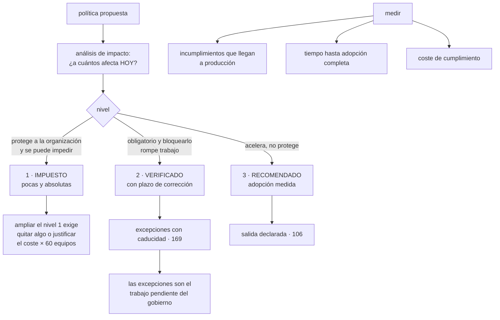

# 170 — Gobierno federado y policy as code a escala

> [← 169 · Landing zones empresariales y vending de cuentas](../../part-14-advanced-platform-capstones-career/169-landing-zones-empresariales-y-vending-de-cuentas/README.md) · [Índice de la parte](../README.md) · [171 · Platform as a Product y roadmap de capacidades →](../../part-14-advanced-platform-capstones-career/171-platform-as-a-product-y-roadmap-de-capacidades/README.md)

**Parte:** 14 — Plataformas avanzadas, capstones y carrera<br>
**Nivel:** experto-frontera · **Horas estimadas:** 4<br>
**Laboratorio:** `governance` · **Estado:** `EXECUTABLE_CORE`

## 🎯 Propósito

Gobernar decenas de equipos sin que un grupo central revise todo ni cada equipo invente su propia respuesta. La clase propone una división que resuelve la mayor parte de las discusiones —**tres niveles de política, y solo el primero se impone técnicamente**— y sostiene una idea incómoda: **lo que no está en el primer nivel se incumplirá en algún sitio, y eso no es un fracaso: es el diseño**. Después da el ciclo de vida de una política, con el paso que casi nadie da y que evita bloquear a media organización: **medir a cuántos recursos afectaría antes de activarla**.

## 📚 Resultados de aprendizaje

Al finalizar podrás:

1. **Repartir** las políticas en tres niveles según cómo se hacen cumplir.
2. **Mantener** el primer nivel corto, con un coste explícito para ampliarlo.
3. **Publicar** el impacto de una política antes de activarla.
4. **Organizar** quién decide sin convertirlo en un cuello de botella.
5. **Medir** el gobierno por lo que llega a producción, no por el número de reglas.

## 🧩 Conceptos centrales

| Concepto | Comprensión verificable |
|---|---|
| `nivel obligatorio impuesto` | Política que la plataforma impide incumplir. Son pocas y absolutas; ampliarlas tiene un coste multiplicado por el número de equipos. |
| `nivel obligatorio verificado` | Política que no se puede impedir sin bloquear trabajo legítimo. Se detecta y se corrige con plazo. |
| `nivel recomendado` | Camino asfaltado. Se mide la adopción y desviarse es legítimo si se declara. |
| `análisis de impacto` | Cuántos recursos existentes incumplirían una política si se activara hoy. Es el paso que evita bloquear a media organización. |
| `órgano de gobierno` | Grupo pequeño que posee la lista del primer nivel, decide deprisa y se reúne poco. |
| `coste de cumplimiento` | Tiempo que los equipos dedican a cumplir. Es la medida que falta en casi todos los programas de gobierno. |

## 🧠 Modelo mental

El nivel experto no consiste en conocer más productos, sino en formular mejores preguntas, validar supuestos y sostener decisiones frente a costo, riesgo y operación.

Aplicado a esta clase, separa siempre cuatro planos: **intención** (qué necesita el usuario),
**configuración** (qué declaramos), **estado observado** (qué existe de verdad) y
**evidencia** (cómo sabemos que cumple). Confundirlos produce diseños que se ven correctos
en un diagrama pero fallan al operar.

## 🗺️ Flujo de razonamiento



## 📖 Desarrollo

### 1. Tres niveles, y solo uno se impone

Con sesenta equipos, los dos extremos fallan:

```text
CENTRAL LO REVISA ABSOLUTAMENTE todo
  → cuello de botella; el gobierno se convierte en la ventanilla
    que la clase 106 describió

CADA EQUIPO DECIDE
  → sesenta respuestas distintas a la misma pregunta
  → y ninguna garantía transversal
```

Y el reparto que funciona es por **cómo se hace cumplir cada cosa**:

```text
NIVEL 1 · OBLIGATORIO E IMPUESTO
  la plataforma lo impide; no hay forma de incumplirlo
  protege a la organización entera de un daño grave
  → regiones autorizadas, registro que no se desactiva,
    borrado de copias, acceso público, etiquetas de dueño
  → POCAS: cinco a quince, no cien

NIVEL 2 · OBLIGATORIO Y VERIFICADO
  hay que cumplirlo, y bloquearlo rompería trabajo legítimo
  se detecta y se corrige con plazo                      clase 139
  → cifrado en tránsito interno, retención de copias,
    permisos sin usar, vulnerabilidades del embudo

NIVEL 3 · RECOMENDADO
  acelera y no protege; es el camino asfaltado           clase 106
  se mide la adopción y desviarse es legítimo si se declara
  → plantilla de canalización, módulos, biblioteca de registro
```

Y la afirmación que ordena el resto:

```text
lo que no está en el nivel 1 se incumplirá en algún sitio
y eso NO es un fracaso: es el diseño
→ por eso el nivel 2 tiene detección y plazo, y el 3 tiene medida
  de adopción y no una queja
```

Y el criterio para poner algo en el nivel 1, que debe ser exigente:

```text
¿su incumplimiento puede causar un daño grave e irreversible?
¿se puede impedir sin bloquear trabajo legítimo?
¿hay una vía de excepción para los casos raros?
→ tres síes, o no es nivel 1
```

Y el precio de ampliarlo, que hay que hacer visible:

```text
cada regla del nivel 1 se multiplica por sesenta equipos
→ sesenta veces la fricción, sesenta veces las excepciones
→ y por eso ampliar el nivel 1 exige QUITAR algo
  o justificar el coste con un incidente concreto
```

Y el efecto de no hacerlo: **una lista de cien reglas obligatorias es una lista que nadie conoce**, y entonces la ley 15 y la ley 16 actúan a la vez.

### 2. El ciclo de vida de una política

Una política pasa por cinco fases, y la segunda es la que casi nadie ejecuta:

```text
1. PROPUESTA
   qué problema resuelve, con un incidente o un requisito detrás
   quién la propone y quién la sufrirá

2. ANÁLISIS DE IMPACTO        ← el paso decisivo
   ¿cuántos recursos la incumplirían HOY?
   ¿de cuántos equipos?
   ¿cuánto costaría corregirlos?

3. MODO AVISO
   se detecta y no se bloquea; se publica la cifra
   y se acompaña a los equipos con más incumplimientos

4. APLICACIÓN
   cuando la lista de incumplimientos nuevos esté vacía
   y con la base histórica congelada si hace falta      clase 101

5. REVISIÓN
   ¿ha impedido algo? ¿cuántas excepciones acumula?
   ¿sigue teniendo sentido?
```

Y el paso 2 merece detenerse porque cambia la conversación:

```text
sin análisis de impacto
  «vamos a exigir X» → se activa → 340 recursos dejan de funcionar
  → y el gobierno pierde la confianza de los equipos para siempre

con análisis de impacto
  «esta política afectaría hoy a 340 recursos de 14 equipos;
   corregirlos cuesta unas 6 semanas repartidas»
  → y entonces se decide si compensa, y con qué plazo
```

Y lo que se publica junto a cada política, que es lo que la hace discutible:

```text
qué problema resuelve
cuántos recursos afecta hoy
qué hay que hacer para cumplirla, con un ejemplo
quién la aprueba y desde cuándo
y cómo se pide una excepción
```

Y las políticas se tratan como código, con lo que eso implica desde la clase 139:

```text
viven en un repositorio con revisión
cada una tiene PRUEBA NEGATIVA que demuestra que detecta
se despliegan por la canalización
y se versionan: cambiar una política es un cambio
```

Y una comprobación que a escala es imprescindible:

```text
las pruebas negativas se ejecutan en TODAS las cuentas y clústeres,
no en uno                                              clase 164
→ una política puede estar activa en 170 cuentas y ausente en 6
```

### 3. Quién decide, sin ser un cuello de botella

El gobierno necesita un dueño, y ese dueño no puede revisar el trabajo de sesenta equipos.

```text
LO QUE POSEE EL ÓRGANO CENTRAL
  la lista del nivel 1, corta y con motivo
  el mecanismo: cómo se declara, se prueba y se aplica una política
  el proceso de excepción
  y las medidas del programa

LO QUE NO POSEE
  las decisiones de arquitectura de cada equipo
  la revisión de cada cambio
  ni la elección de tecnologías dentro del marco
```

Y su forma, para que decida deprisa:

```text
pequeño: cinco a siete personas
con representación de los equipos, no solo de la plataforma
se reúne poco y decide en la reunión
y publica lo decidido, con el motivo
```

Y dos reglas que evitan que se convierta en un comité:

```text
SILENCIO POSITIVO PARA EL NIVEL 3
  una propuesta de camino asfaltado se adopta si nadie objeta
  en un plazo

DECISIÓN POR DEFECTO
  si no hay acuerdo sobre subir algo al nivel 1, se queda en el 2
  → el nivel 1 solo crece por decisión explícita
```

**Las excepciones** son la información más valiosa que produce este sistema:

```text
cada excepción dice que un control no encaja en un caso real
y la lista ordenada por control dice qué hay que arreglar
→ las excepciones SON el trabajo pendiente del gobierno    clase 169
```

Y el reparto de quién aprueba qué:

```text
nivel 1   el órgano central, y con caducidad corta
nivel 2   el dueño del área, con caducidad y registro
nivel 3   nadie: desviarse es legítimo; basta declararlo    clase 106
```

Y la participación de los equipos, que es lo que evita que el gobierno se perciba como algo ajeno:

```text
cualquiera puede PROPONER una política
y quien la propone participa en su análisis de impacto
→ y varias de las mejores políticas salen de un equipo que sufrió
  un incidente y no quiere que le pase a nadie más
```

### 4. Medir el gobierno

La medida habitual —número de políticas— es exactamente la que la ley 17 desaconseja:

```text
mal   «tenemos 140 políticas»
      → sube sola, no dice nada y empeora el sistema
```

Lo que sí mide:

```text
INCUMPLIMIENTOS QUE LLEGAN A PRODUCCIÓN
  del nivel 1, deberían ser cero por construcción
  del nivel 2, cuántos y cuánto tardan en corregirse

TIEMPO DESDE QUE SE PUBLICA UNA POLÍTICA HASTA QUE SE CUMPLE
  en toda la organización
  → si son meses, el mecanismo es lento

EXCEPCIONES POR POLÍTICA
  y su tendencia: las tres primeras señalan qué corregir

ADOPCIÓN DEL NIVEL 3
  qué proporción usa el camino asfaltado, sin obligación
  → es la medida honesta de la clase 106

COSTE DE CUMPLIMIENTO
  horas al mes que los equipos dedican a cumplir
  → la medida que falta en casi todos los programas

POLÍTICAS QUE NO HAN IMPEDIDO NI DETECTADO NADA EN UN AÑO
  → candidatas a retirarse                              clase 139
```

Y la quinta merece detalle porque es la que evita que el gobierno crezca sin freno:

```text
si cumplir cuesta a cada equipo 6 horas al mes
con 60 equipos son 360 horas al mes
→ dos personas y media a tiempo completo, repartidas
→ y esa cifra hay que comparar con lo que el gobierno evita
```

Y el equilibrio que hay que vigilar, que es el traslado de la clase 155:

```text
más gobierno    menos riesgo y menos velocidad
menos gobierno  más velocidad y más incidentes
→ y las dos columnas se publican juntas, como las cuatro medidas
  de la clase 107
```

Y una comprobación anual sana:

```text
recorrer la lista del nivel 1 y preguntar por cada una
  ¿qué incidente evita?
  ¿ha intentado incumplirla alguien este año?
  ¿cuántas excepciones tiene?
→ y retirar o bajar de nivel lo que no se sostenga
```

Y la lista de comprobación de la clase:

```text
☐ las políticas están repartidas en tres niveles, con criterio escrito
☐ el nivel 1 tiene menos de quince reglas y cada una su motivo
☐ ampliar el nivel 1 exige quitar algo o justificar el coste
☐ toda política nueva pasa por análisis de impacto antes de activarse
☐ se publica a cuántos recursos y equipos afectaría
☐ hay modo aviso antes de aplicar
☐ cada política tiene prueba negativa, ejecutada en todas las cuentas
☐ existe un órgano pequeño que posee el nivel 1 y decide deprisa
☐ cualquiera puede proponer una política
☐ las excepciones se ordenan por control y son el trabajo pendiente
☐ se mide lo que llega a producción, no el número de políticas
☐ se mide el coste de cumplimiento en horas de los equipos
☐ se retira lo que no ha impedido ni detectado nada en un año
```

Y el cierre que enlaza con la clase siguiente: gobernar bien no basta si lo que la plataforma ofrece no es lo que los equipos necesitan. Tratar la plataforma como un producto con hoja de ruta, y decidir qué capacidad se construye antes que otra, es la materia de la clase 171.

## 🔬 Ejemplo trabajado

**CloudShop tiene sesenta equipos y ciento cuarenta políticas, de las que ciento diez son obligatorias. El ejercicio empieza contando cuántas conoce la gente y termina con un nivel 1 de doce reglas.**

**El punto de partida.**

```text
políticas declaradas                                         140
declaradas obligatorias                                      110
aplicadas técnicamente                                        31
el resto                             documentos que alguien debía leer

encuesta a 24 personas de 12 equipos
  políticas obligatorias que sabían citar, mediana              4
  personas que sabían dónde estaba la lista                     9 de 24
  personas que habían pedido una excepción alguna vez           3
```

**Cuatro de ciento diez.** Es la ley 15 aplicada al gobierno: una lista que nadie puede conocer no gobierna nada.

**La reclasificación en tres niveles.**

```text                                          antes         después
nivel 1, impuesto técnicamente                  31             12
nivel 2, verificado con plazo                    —             34
nivel 3, recomendado                             —             41
retiradas                                        —             53
```

Y las cincuenta y tres retiradas, por qué:

```text
no habían detectado ni impedido nada en 2 años                 29
duplicaban otra                                                 14
describían una preferencia, no un riesgo                        7
contradecían a otra                                             3   ← grave
```

Las tres contradictorias eran el hallazgo incómodo: **dos políticas obligatorias pedían cosas incompatibles**, y los equipos habían estado incumpliendo una u otra sin saberlo.

Y el nivel 1 resultante, con su criterio:

```text
regiones autorizadas
registro de auditoría no desactivable
borrado de copias prohibido
sin acceso público en almacenes
etiquetas de dueño y entorno obligatorias
sin claves de larga duración                            clase 137
firma verificada en admisión                            clases 067, 101
sin usuarios locales en las nubes                       clase 159
sin acceso desde entornos inferiores a producción       clase 133
rangos de red del plan central                          clase 160
sin recursos fuera del servicio de creación             clase 169
cifrado en reposo con claves gestionadas
                                                       ────
                                                         12
```

Y la regla para ampliarla, acordada por escrito:

```text
añadir una regla al nivel 1 exige
  un incidente concreto que la habría evitado, o un requisito legal
  y quitar otra, o justificar el coste ante el órgano

reglas añadidas al nivel 1 en 12 meses                          2
reglas retiradas del nivel 1                                    1
```

**El análisis de impacto, y la política que se detuvo a tiempo.**

```text
propuesta   «todo almacén de objetos debe tener versionado activo»
motivo      un borrado accidental en un equipo

análisis de impacto, ejecutado antes de activarla
  almacenes existentes                                        910
  que incumplirían                                            341
  equipos afectados                                            14
  coste estimado de corregir                          ~6 semanas
  coste adicional de almacenamiento                   ~1.900 €/mes
```

Y la conversación que ese dato permitió:

```text
sin el análisis   se habría activado y 341 recursos habrían quedado
                  marcados como incumplidores de un día para otro
con el análisis   se decidió
                    nivel 2, no nivel 1
                    aplicable solo a almacenes con datos clasificados
                      como confidenciales o personales     clase 141
                    plazo de 90 días
                  → recursos afectados: de 341 a 62
                  → coste adicional: de 1.900 € a 310 €/mes
```

Y el resultado a los 90 días:

```text
recursos corregidos                                       59 de 62
excepciones concedidas                                          3
  → todos con motivo y caducidad
incumplimientos nuevos desde entonces                           0
```

**Las excepciones como trabajo pendiente.**

```text
excepciones vivas al empezar                                   94
tras la reclasificación                                        19
después de 12 meses                                            23

ordenadas por política
  tipos de instancia permitidos                                 9
  retención mínima de copias                                    6
  cifrado en tránsito interno                                   4
  otras                                                         4
```

Y las nueve primeras se investigaron:

```text
motivo real   equipos que necesitaban instancias con acelerador
              para cargas de aprendizaje                clase 175
causa         la lista se escribió antes de que existieran esas cargas
corrección    se ampliaron los tipos permitidos, con límite de coste
excepciones de esa política después                          0-1
```

**El órgano de gobierno.**

```text                                          antes         después
quién decidía                          el equipo de plataforma   órgano de 6
composición                                     —        3 de plataforma,
                                                         3 de equipos rotatorios
frecuencia                            reuniones semanales   mensual
decisiones pendientes al terminar cada reunión   varias         0
tiempo medio de una decisión                  3 semanas       11 días
propuestas hechas por equipos, no por plataforma  0             14
  de ellas, adoptadas                             —             9
```

Y nueve de las catorce propuestas de los equipos se adoptaron; **cuatro venían de un incidente que ese equipo había sufrido**.

**Las medidas.**

```text                                          antes         después
políticas totales                              140             87
nivel 1                                         31             12
incumplimientos del nivel 1 en producción     no se sabía        0
incumplimientos del nivel 2 abiertos          no se sabía       41
tiempo medio de corrección del nivel 2           —          19 días
tiempo desde publicar hasta cumplimiento total   —          62 días
adopción del nivel 3, sin obligación             —           78 %
coste de cumplimiento, horas/equipo/mes       no se medía   4,1 h
coste total de cumplimiento                      —      246 h/mes
políticas con prueba negativa                  0 de 140     87 de 87
políticas activas en todas las cuentas       no se comprobaba  87 de 87
```

Y la comprobación de la última fila encontró lo previsible:

```text
al ejecutar las pruebas negativas en las 176 cuentas
  políticas ausentes en alguna cuenta                          6
  cuentas donde faltaba alguna                                 9
  → todas, cuentas heredadas de adquisiciones
  → corregidas por el bucle de la clase 169
```

**El coste de cumplimiento, comparado con lo que evita.**

```text
coste de cumplimiento                              246 h/mes
  ≈ 1,5 personas a tiempo completo, repartidas

lo que el gobierno evitó, medido en 12 meses
  intentos de crear recursos en regiones no autorizadas       118
  intentos de desactivar el registro de auditoría               4
  intentos de hacer público un almacén con datos               11
  intentos de crear claves de larga duración                   87
  borrados de copias impedidos                                  6
```

Y el dato que cerró la discusión sobre si el gobierno «frenaba»:

```text
de los 226 intentos impedidos, ¿cuántos eran errores y cuántos
necesidades legítimas?
  errores o desconocimiento                                   211
  necesidades legítimas                                        15
    → las 15 se resolvieron con excepción o cambiando la política
```

**A los doce meses.**

```text                                          antes         después
políticas                                      140             87
obligatorias impuestas                          31             12
políticas que nadie conocía                    ~106            —
políticas contradictorias                        3              0
con prueba negativa                              0             87
activas en todas las cuentas              no se comprobaba   87 de 87
análisis de impacto antes de activar            no             sí
políticas activadas sin él                       —              0
excepciones vivas                               94             23
controles corregidos por exceso de excepciones   0              3
propuestas de los equipos                        0             14
tiempo de una decisión de gobierno          3 semanas       11 días
coste de cumplimiento medido                    no        246 h/mes
```

**La lección que esta clase traslada a la parte 14**: había ciento diez políticas obligatorias y la gente podía citar **cuatro**; tres de ellas se contradecían entre sí. Y la política que estuvo a punto de bloquear trescientos cuarenta y un recursos de catorce equipos se detuvo por un paso que costó una tarde: **medir a cuántos afectaría antes de activarla**. Con ese dato, la misma política se aplicó a sesenta y dos recursos, con plazo, y se cumplió en tres meses sin que nadie tuviera que rodearla.

## 🧪 Laboratorio guiado

Ejecuta desde la raíz:

```bash
python classes/part-14-advanced-platform-capstones-career/170-gobierno-federado-y-policy-as-code-a-escala/lab.py
```

El laboratorio selecciona el motor de práctica **`governance`** y produce
`lab_result.json`. El escenario, sus comprobaciones y el artefacto esperado corresponden a
esta clase; no requiere credenciales y deja explícito qué debe revalidarse en un sandbox real.

1. Lee `exercise.steps` y formula una predicción antes de ejecutar.
2. Ejecuta la práctica y verifica todos los elementos de `checks`.
3. Provoca el caso de `negative_test` y explica la señal observada.
4. Materializa `modelo-gobierno` en `evidence/` usando la plantilla indicada.
5. Para proveedor real, sigue `sandbox.requires`, registra costo y ejecuta `destroy`.

### Evidencia esperada

El artefacto principal es una jerarquía de política, ownership y evidencia. Además, la entrega debe incluir el comando ejecutado,
la salida estructurada y una conclusión que no exceda lo observado.

## 🏆 Reto verificable

Construye **`modelo-gobierno`** para el caso CloudShop. Incluye una alternativa descartada,
un supuesto que pueda falsarse, una prueba de fallo y una decisión de rollback.

## ✅ Criterio de aceptación

- [ ] `lab.py` termina con código 0 y genera JSON válido.
- [ ] La entrega conecta al menos tres requisitos con mecanismos verificables.
- [ ] Existe una prueba positiva y una prueba negativa con evidencia.
- [ ] Seguridad, costo y operación aparecen como decisiones, no como anexos.
- [ ] Se declara una limitación y una condición que obligaría a revisar el diseño.
- [ ] Otra persona puede repetir el recorrido sin conocimiento tácito.

## ⚠️ Errores frecuentes

| Síntoma | Causa probable | Corrección |
|---|---|---|
| Hay decenas de políticas obligatorias y nadie las conoce | Ley 15: una lista que no se puede conocer no gobierna | Reparte en tres niveles, deja menos de quince reglas impuestas y retira lo que no haya detectado nada. |
| Activar una política deja a media organización incumpliendo | No se midió el impacto antes | Análisis de impacto obligatorio: cuántos recursos y equipos, y qué cuesta corregirlo; después, modo aviso antes de aplicar. |
| Dos políticas obligatorias piden cosas incompatibles | Se acumularon sin revisión ni dueño | Revisión anual de la lista completa, con motivo por regla, y retirada de lo duplicado y lo contradictorio. |
| El gobierno se convierte en un cuello de botella | El órgano central revisa el trabajo de los equipos en vez de poseer solo el nivel 1 y el mecanismo | Grupo pequeño con representación, que decide en la reunión, con silencio positivo para lo recomendado. |
| Una política está activa en la mayoría de cuentas y ausente en algunas | No se comprueba el resultado en todas | Prueba negativa por política, ejecutada en todas las cuentas y clústeres. |
| Se discute si el gobierno frena sin datos | Se mide el número de políticas y no el coste ni lo que evita | Publica juntos el coste de cumplimiento en horas y los intentos impedidos, distinguiendo errores de necesidades legítimas. |

## 🛡️ Seguridad, ética y costo

Trabaja con cuentas propias o sandboxes autorizados. No publiques secretos, identificadores
reales ni datos personales. Antes de crear recursos pagos define presupuesto, etiquetas y
comando de destrucción; después verifica que no queden recursos huérfanos. Los ejemplos
locales enseñan contratos, pero no certifican cumplimiento ni disponibilidad de producción.

## ❓ Preguntas de comprobación

1. ¿Qué distingue los tres niveles de política y cuál se impone técnicamente?
2. ¿Por qué ampliar el nivel 1 debe tener un coste explícito?
3. ¿Qué aporta el análisis de impacto y qué evita?
4. ¿Qué posee el órgano de gobierno y qué no?
5. ¿Qué se mide en lugar del número de políticas?

## 🔗 Referencias

- Open Policy Agent (2025). *Policy as code at scale: bundles and testing* — declarar, probar y distribuir políticas. <https://www.openpolicyagent.org/docs/latest/management-bundles/>
- AWS (2025). *Guardrails: preventive and detective controls* — reparto entre lo que se impide y lo que se detecta. <https://docs.aws.amazon.com/controltower/latest/userguide/controls.html>
- Google Cloud (2025). *Organization policy and custom constraints* — políticas heredadas por la jerarquía. <https://cloud.google.com/resource-manager/docs/organization-policy/creating-managing-custom-constraints>
- Microsoft (2025). *Azure Policy: initiatives, compliance and remediation* — agrupación, cumplimiento y corrección. <https://learn.microsoft.com/azure/governance/policy/overview>
- Skelton, M. y Pais, M. (2019). *Team Topologies*, cap. 4 — gobierno federado y carga cognitiva de los equipos. <https://teamtopologies.com/book>
- Documentación oficial vigente del servicio implementado; registra URL y fecha de consulta.

---

> [Evaluación](assessment.md) · [Contrato de clase](lesson.yaml) · [Índice de la parte](../README.md)

**📥 Descargar:** [Parte 14 en PDF](../../../site/downloads/partes/manual-parte-14-advanced-platform-capstones-career.pdf) · [Manual integral](../../../site/downloads/multi-cloud-engineering-manual-v2.0.pdf)

| Anterior | Índice | Siguiente |
|---|---|---|
| [← 169 · Landing zones empresariales y vending de cuentas](../../part-14-advanced-platform-capstones-career/169-landing-zones-empresariales-y-vending-de-cuentas/README.md) | [Parte 14](../README.md) · [Programa](../../README.md) | [171 · Platform as a Product y roadmap de capacidades →](../../part-14-advanced-platform-capstones-career/171-platform-as-a-product-y-roadmap-de-capacidades/README.md) |
