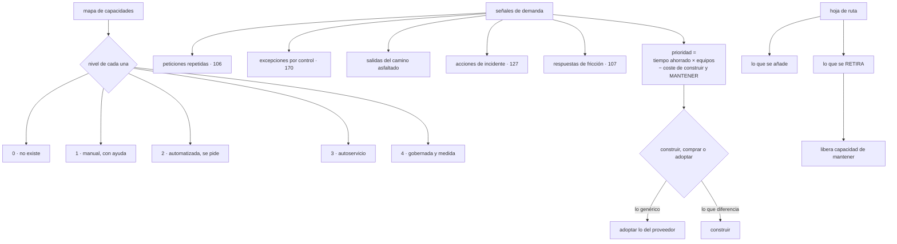

# 171 — Platform as a Product y roadmap de capacidades

> [← Clase anterior](../../part-14-advanced-platform-capstones-career/170-gobierno-federado-y-policy-as-code-a-escala/README.md) · [Índice de la parte](../README.md) · [Clase siguiente →](../../part-14-advanced-platform-capstones-career/172-modelo-operativo-finops-y-economia-unitaria/README.md)

**Parte:** 14 — Plataformas avanzadas, capstones y carrera<br>
**Nivel:** experto-frontera · **Horas estimadas:** 4<br>
**Laboratorio:** `platform` · **Estado:** `EXECUTABLE_CORE`

## 🎯 Propósito

Decidir qué construye la plataforma a continuación, que a escala es la pregunta que más dinero mueve y la que peor se responde. La clase sustituye la lista de funciones por un **mapa de capacidades con niveles**, que permite decir dónde se está y no solo qué falta; ordena el trabajo con **señales de demanda observadas** en vez de opiniones; y sostiene la mitad que nadie pone en una hoja de ruta: **lo que se va a retirar**, porque la capacidad de un equipo de plataforma la limita lo que mantiene, no lo que construye.

## 📚 Resultados de aprendizaje

Al finalizar podrás:

1. **Describir** la plataforma como capacidades con niveles, no como funciones.
2. **Ordenar** el trabajo con señales de demanda medidas.
3. **Decidir** construir, comprar o adoptar cada capacidad.
4. **Incluir** retiradas en la hoja de ruta, con su mecánica.
5. **Comunicar** direcciones en vez de fechas, y medir el producto.

## 🧩 Conceptos centrales

| Concepto | Comprensión verificable |
|---|---|
| `capacidad` | Algo que la plataforma permite hacer a un equipo, expresado desde su punto de vista: «desplegar sin parada», «saber cuánto cuesta mi servicio». |
| `nivel de madurez` | Grado en que una capacidad está resuelta: inexistente, manual, automatizada, autoservicio, gobernada. |
| `señal de demanda` | Necesidad observada: una petición, una excepción, una salida del camino asfaltado, una acción de incidente o una respuesta de fricción. |
| `retirada` | Eliminación de una capacidad que ya no se usa o que el proveedor resuelve. Libera la capacidad de mantener. |
| `dirección frente a fecha` | Compromiso sobre qué se va a resolver y en qué orden, sin prometer días concretos para trabajo con incertidumbre alta. |
| `capacidad de mantener` | Límite real del equipo: lo que ya sostiene. Cada capacidad nueva la consume permanentemente. |

## 🧠 Modelo mental

El nivel experto no consiste en conocer más productos, sino en formular mejores preguntas, validar supuestos y sostener decisiones frente a costo, riesgo y operación.

Aplicado a esta clase, separa siempre cuatro planos: **intención** (qué necesita el usuario),
**configuración** (qué declaramos), **estado observado** (qué existe de verdad) y
**evidencia** (cómo sabemos que cumple). Confundirlos produce diseños que se ven correctos
en un diagrama pero fallan al operar.

## 🗺️ Flujo de razonamiento



## 📖 Desarrollo

### 1. Capacidades, no funciones

Una hoja de ruta hecha de funciones —«un portal nuevo», «integrar tal herramienta»— no permite decidir. Una hecha de **capacidades** sí, porque se expresa desde quien la usa:

```text
mal   «integrar el gestor de secretos»
bien  «un equipo puede obtener credenciales sin guardar ningún secreto»

mal   «desplegar la malla de servicio»
bien  «un equipo puede limitar quién llama a su servicio, sin escribir código»
```

Y cada capacidad tiene un **nivel**, que es lo que permite decir dónde se está:

```text
0  NO EXISTE            nadie puede hacerlo
1  MANUAL               se puede, pidiéndolo a alguien
2  AUTOMATIZADA         hay una herramienta, y hay que pedir acceso o ayuda
3  AUTOSERVICIO         el equipo lo hace solo, en minutos      clase 106
4  GOBERNADA Y MEDIDA   además está medida, con objetivos y coste conocido
```

Y con esa escala se puede describir el estado de la plataforma en una tabla, que es lo que hace posible priorizar:

```text
capacidad                                     nivel
crear un servicio nuevo con todo montado        3     clase 106
desplegar sin parada                            3     clase 102
obtener credenciales sin secretos                3     clase 137
saber cuánto cuesta mi servicio                  1     clase 142
probar en un entorno con datos realistas         2     clase 104
recuperar mi servicio en otra región             1     clase 166
saber qué políticas me aplican                   2     clase 170
aislar a un cliente concreto                     0     clase 154
```

Y el catálogo de capacidades sale de lo que este programa ha ido construyendo:

```text
entrega          construir, desplegar, revertir, activar        parte 08
datos            almacenar, replicar, migrar esquemas           parte 09
operación        observar, alertar, responder, ensayar          parte 10
seguridad        identidad, secretos, políticas, evidencia      parte 11
arquitectura     contratos, aislamiento, límites                parte 12
continuidad      copias, recuperación, portabilidad             parte 13
gobierno         cuentas, excepciones, atribución               parte 14
```

Y la ventaja de esta forma sobre una lista de herramientas:

```text
permite decir «estamos en nivel 1 en coste y en nivel 3 en despliegue»
permite comparar el hueco con el impacto
y sobrevive a cambiar de herramienta: la capacidad no cambia
```

### 2. Qué construir a continuación

La forma habitual de decidir —lo que le parece más importante a quien dirige la plataforma— produce plataformas vacías, que es el tercer modo de fallo de la clase 106.

Y las señales que sí son necesidades observadas:

```text
PETICIONES REPETIDAS
  las que llegan una y otra vez                          clase 106
  → el 83 % eran las mismas tres cosas

EXCEPCIONES POR CONTROL
  cada una dice que algo no encaja                       clase 170

SALIDAS DEL CAMINO ASFALTADO
  quién no usa la plataforma y por qué                   clase 106

ACCIONES DE REVISIÓN DE INCIDENTES
  «esto habría hecho falta»                              clase 127

RESPUESTAS A «¿QUÉ TE HA FRENADO?»                       clase 107
  la pregunta abierta y periódica

Y LO QUE LA ORGANIZACIÓN VA A NECESITAR
  una norma que entra en vigor, un cliente que exige algo
  → la única señal que no es observada, y hay que declararla como tal
```

Y la fórmula de prioridad, que hay que escribir aunque sea aproximada:

```text
prioridad ≈ tiempo ahorrado por equipo × equipos afectados
            − coste de construirlo
            − COSTE DE MANTENERLO, para siempre
```

Y el tercer sumando es el que casi nadie incluye y el que decide a largo plazo:

```text
cada capacidad consume capacidad de mantener
  actualizaciones, incidencias, documentación, formación,
  y compatibilidad cuando cambie lo de debajo
→ un equipo de plataforma no está limitado por lo que puede construir,
  sino por lo que ya sostiene
```

Y de ahí la regla que gobierna la hoja de ruta:

```text
añadir una capacidad exige tener capacidad de mantener
→ y si no la hay, hay que RETIRAR algo primero
```

**Construir, comprar o adoptar** se decide con la clasificación de la clase 147, aplicada a la plataforma:

```text
GENÉRICO           lo resuelve el proveedor o el mercado
  → adoptar tal cual; no envolver                       clase 158
  → y el error frecuente es construir lo que el proveedor ya ofrece

DE APOYO           hace falta y no diferencia
  → lo más simple que funcione, o comprar

DIFERENCIAL        la forma concreta en que esta organización trabaja
  → construir; suele ser pegamento, no producto
```

Y lo que casi siempre resulta ser diferencial en una plataforma interna:

```text
la forma de crear un servicio nuevo con CUANTO exige esta casa
el catálogo y la atribución                            clases 095, 142
la integración entre piezas de proveedores distintos   clase 162
y los caminos asfaltados propios                       clase 106
→ es decir, la COMPOSICIÓN, no las piezas
```

### 3. La mitad que falta: retirar

Una hoja de ruta que solo añade es una hoja de ruta que se detiene sola en tres años, cuando el mantenimiento consume al equipo.

Lo que hay que retirar:

```text
capacidades que nadie usa
capacidades que el proveedor ha empezado a ofrecer mejor
herramientas duplicadas: dos formas de hacer lo mismo
versiones antiguas de lo propio                        clase 106
y caminos asfaltados que ya no son el camino
```

Y para saber qué retirar hace falta **medir el uso por capacidad**:

```text
equipos que la usan, y con qué frecuencia
cuándo fue la última vez
y cuánto cuesta mantenerla
```

Y el proceso, que es el contrato de versiones de la clase 106 aplicado a una capacidad entera:

```text
1. anunciar con fecha, y decir qué la sustituye
2. dejar de admitir usos nuevos
3. acompañar a quien la use, con herramienta de migración
   → si la plataforma pide migrar, la plataforma escribe la migración
4. cortes de prueba anunciados                          clase 118
5. retirar
```

Y una advertencia que evita el peor final:

```text
retirar sin sustituto obliga a cada equipo a resolverlo por su cuenta
→ y entonces hay sesenta soluciones distintas, que es peor que la
  capacidad que se retiró
→ se retira lo que no se usa, o lo que tiene un sustituto mejor
```

Y una categoría especial que conviene vigilar:

```text
LO QUE EL PROVEEDOR EMPIEZA A OFRECER
  cada año, algo que se construyó a mano pasa a estar disponible
  → conviene revisar el catálogo propio contra lo que existe,
    una vez al año
  → y retirar lo propio cuando lo del proveedor sea suficiente
```

Y el coste de no hacerlo:

```text
se mantiene una herramienta propia que hace peor lo que el proveedor
hace bien, y se sigue pagando su mantenimiento indefinidamente
→ es la ley 20 aplicada a la plataforma: existe porque nadie decidió
  que dejara de existir
```

### 4. Prometer, financiar y medir

**Qué se promete** a los equipos, que es donde las plataformas pierden credibilidad:

```text
mal   fechas concretas para trabajo con incertidumbre alta
      → se incumplen, y a la tercera nadie cree la hoja de ruta

bien  DIRECCIONES Y ORDEN
      «lo siguiente que resolvemos es la atribución de coste,
       después el aislamiento por cliente»
      + fecha solo para lo que ya está empezado y acotado
      + y una fecha firme para lo que tiene una obligación externa
```

Y lo que sí conviene comprometer siempre:

```text
las RETIRADAS, con fecha
  porque afectan a otros y necesitan planificarse            clase 106
los cambios incompatibles, con aviso
y los plazos de las obligaciones normativas
```

**La financiación**, que distorsiona más de lo que parece:

```text
PRESUPUESTO CENTRAL
  + puede invertir en lo que beneficia a todos
  − y puede construir lo que nadie pidió

COBRO A LOS EQUIPOS
  + solo sobrevive lo que alguien valora
  − nadie paga lo transversal: seguridad, continuidad, gobierno
  − y aparecen optimizaciones locales que empeoran el total  ley 17

MIXTO
  central para lo transversal y lo obligatorio
  cobrado para lo opcional y lo específico
  → es lo que suele funcionar
```

Y el efecto de la segunda, que conviene anticipar:

```text
una plataforma financiada solo por cobro tiende a NO invertir en
lo que beneficia a todos y nadie quiere pagar
→ y eso es justamente lo transversal: identidad, continuidad,
  observabilidad común, gobierno
```

**Las medidas del producto**, que amplían las de la clase 106:

```text
ADOPCIÓN SIN OBLIGACIÓN, por capacidad
NIVEL DE MADUREZ, y su evolución
TIEMPO AHORRADO, estimado y publicado
PROPORCIÓN DEL TIEMPO DEL EQUIPO EN PETICIONES
  → por encima de un tercio, se está volviendo ventanilla   clase 106
CAPACIDADES RETIRADAS AL AÑO
  → si es cero, la capacidad de mantener se está agotando
SATISFACCIÓN, con una pregunta abierta                     clase 107
Y COSTE DE LA PLATAFORMA POR EQUIPO SERVIDO
```

Y la penúltima es la que más dice sobre la salud del producto a largo plazo.

Y una comprobación anual que conviene hacer con los equipos, no sobre ellos:

```text
recorrer el mapa de capacidades y preguntar por cada una
  ¿la usáis? ¿os sirve? ¿qué le falta? ¿qué haríais si desapareciera?
→ la última pregunta separa lo imprescindible de lo cómodo
```

Y la lista de comprobación de la clase:

```text
☐ la plataforma se describe como capacidades, no como herramientas
☐ cada capacidad tiene un nivel de madurez declarado
☐ la prioridad sale de señales de demanda observadas
☐ la fórmula de prioridad incluye el coste de MANTENER
☐ añadir una capacidad exige tener capacidad de mantener
☐ está clasificado qué es genérico, de apoyo y diferencial
☐ no se construye lo que el proveedor ya ofrece bien
☐ se mide el uso por capacidad
☐ la hoja de ruta incluye retiradas, con fecha y sustituto
☐ se prometen direcciones y orden, no fechas para lo incierto
☐ las retiradas y los cambios incompatibles sí llevan fecha
☐ la financiación cubre lo transversal, no solo lo que alguien paga
☐ se mide adopción sin obligación, tiempo en peticiones y retiradas al año
```

Y el cierre que enlaza con la clase siguiente: decidir qué construir exige saber qué cuesta cada cosa y qué produce, y a esta escala eso ya no es una hoja de cálculo: es un modelo operativo con su gente y sus rutinas. Es la materia de la clase 172.

## 🔬 Ejemplo trabajado

**La plataforma de CloudShop sirve a sesenta equipos con seis personas. El ejercicio consiste en dibujar el mapa de capacidades, priorizar con señales medidas y descubrir qué hay que retirar para poder añadir.**

**El mapa, con niveles.**

```text
capacidad                                          nivel
crear un servicio nuevo con todo montado             3
desplegar sin parada y revertir                      3
obtener credenciales sin secretos                    3
entorno de pruebas con datos                         2
observabilidad estándar                              3
objetivos y presupuesto de error                     2
saber cuánto cuesta mi servicio                      1
recuperar mi servicio en otra región                 1
aislar a un cliente concreto                         0
saber qué políticas me aplican                       2
migrar un esquema sin parada                         1
crear una cuenta nueva                               3
```

Y el hueco medio ponderado por uso:

```text
capacidades en nivel 3 o superior                       5 de 12
capacidades en nivel 0 o 1                              4 de 12
```

**Las señales de demanda, contadas durante un trimestre.**

```text
señal                                       veces   capacidad implicada
peticiones «¿cuánto cuesta esto?»              41   coste por servicio
excepciones al control de tipos de instancia   22   cargas con acelerador
peticiones de entorno con datos reales         19   entorno de pruebas
acciones de incidente sobre recuperación       14   recuperación
respuestas «me frena no poder probar con
  datos parecidos a producción»                12   entorno de pruebas
peticiones de aislamiento para un cliente       6   aislamiento
salidas del camino asfaltado                    4   varias
```

Y la prioridad calculada, con el coste de mantener incluido:

```text
capacidad                 ahorro/equipo/mes  equipos  construir  mantener/año
coste por servicio             2,5 h            60      6 sem      0,3 pers
entorno con datos              4,0 h            31      8 sem      0,5 pers
recuperación autoservicio      1,0 h            60     12 sem      0,4 pers
aislamiento por cliente        6,0 h             4     10 sem      0,4 pers
```

Y el orden que sale:

```text
1. coste por servicio     150 h/mes ahorradas, 6 semanas de trabajo
2. entorno con datos      124 h/mes, 8 semanas
3. recuperación            60 h/mes, 12 semanas
4. aislamiento             24 h/mes, 10 semanas → se pospone
```

Y el aislamiento, que era el nivel 0 y parecía urgente, quedó el último **porque afecta a cuatro equipos**. Se resolvió a mano para esos cuatro mientras tanto.

**La capacidad de mantener, y lo que hubo que retirar.**

```text
personas en la plataforma                                       6
tiempo en peticiones                                         21 %   clase 106
tiempo en mantener lo existente                              54 %
tiempo disponible para construir                             25 %
                                                      ≈ 1,5 personas
```

Y con un cuarto del tiempo disponible, las tres capacidades prioritarias sumaban veintiséis semanas: **más de un año**. La conversación pasó a ser qué retirar.

```text
inventario de lo que se mantiene                              31 piezas
uso medido
  usadas por más de 10 equipos                                12
  usadas por 2 a 10                                            9
  usadas por 1                                                 6
  sin uso en 6 meses                                           4
```

Y las decisiones:

```text
RETIRAR SIN SUSTITUTO (4 piezas sin uso)
  un panel antiguo, un generador de informes, dos guiones
  liberado                                            0,3 personas

RETIRAR PORQUE EL PROVEEDOR YA LO OFRECE (3 piezas)
  un sistema propio de rotación de certificados
  un recolector de métricas hecho a medida
  y una herramienta de inventario
  → los tres existían desde antes de que el proveedor los tuviera
  liberado                                            0,7 personas

UNIFICAR DUPLICADOS (2 pares)
  dos formas de crear un servicio, heredadas de una adquisición
  dos bibliotecas de registro
  liberado                                            0,4 personas

MANTENER LAS 6 DE UN SOLO EQUIPO
  → se ofrecieron al equipo que las usa; 4 las asumieron,
    2 se retiraron con su acuerdo
  liberado                                            0,3 personas
```

```text                                          antes         después
piezas mantenidas                               31             20
tiempo en mantener                              54 %           33 %
tiempo disponible para construir                25 %           46 %
                                          ≈1,5 personas   ≈2,8 personas
```

**Casi el doble de capacidad de construir sin contratar a nadie**, y el trabajo priorizado pasó de más de un año a unos siete meses.

**La retirada del sistema propio de certificados, en detalle.**

```text
construido hacía 3 años, cuando el proveedor no lo ofrecía
equipos que lo usaban                                         38
coste de mantenerlo                                  0,3 personas
incidencias causadas por él en 12 meses                        4

proceso
  se anunció con 4 meses y con el sustituto identificado
  se escribió la herramienta de migración                clase 106
  equipos migrados en el primer mes                            9
  tras el primer corte de prueba anunciado                    24
  tras el segundo                                             38
  incidencias durante la migración                             1
```

Y la comprobación que lo motivó, que ahora es anual:

```text
revisar el catálogo propio contra lo que ofrece el proveedor
piezas candidatas encontradas el primer año                    3
el segundo año                                                 2
```

**Lo que se prometió, y lo que no.**

```text
se comprometió con fecha
  la retirada del sistema de certificados                4 meses
  el cambio incompatible de la plantilla de canalización 6 semanas de aviso
  el cumplimiento de un requisito normativo              fecha legal

se comprometió como dirección, sin fecha
  coste por servicio, entorno con datos y recuperación,
  en ese orden

fechas incumplidas en 12 meses                                 0
  → antes de este cambio: 4 de 7 compromisos con fecha
```

**La financiación.**

```text                                          antes         después
modelo                                   presupuesto central   mixto
lo transversal                          central             central
  identidad, continuidad, observabilidad común, gobierno
lo opcional y específico                    —          cobrado al equipo
  entornos adicionales, capacidad reservada, herramientas propias

efecto observado en 12 meses
  entornos de pruebas sin uso                     14 → 2
  peticiones de capacidad reservada «por si acaso» 9 → 1
```

Y lo que se decidió NO cobrar, y por qué:

```text
la observabilidad común y la continuidad
→ si se cobraran, los equipos con menos presupuesto las reducirían
→ y son justamente las que protegen a toda la organización
```

**Las medidas del producto, a los doce meses.**

```text                                          antes         después
capacidades en nivel 3 o superior             5 de 12        8 de 12
capacidades en nivel 0 o 1                    4 de 12        1 de 12
adopción sin obligación, media                  71 %           89 %
tiempo del equipo en peticiones                 21 %           14 %
tiempo en mantener                              54 %           33 %
tiempo en construir                             25 %           53 %
piezas mantenidas                               31             20
capacidades retiradas                            0              9
tiempo ahorrado a los equipos, estimado          —      ~290 h/mes
compromisos con fecha incumplidos             4 de 7         0 de 3
coste de la plataforma por equipo servido        —        medido
```

**La lección que esta clase traslada a la parte 14**: la plataforma no estaba limitada por lo que sabía construir, sino por lo que ya sostenía: **el 54 % del tiempo se iba en mantener treinta y una piezas**, cuatro de ellas sin ningún uso y tres que el proveedor ya ofrecía mejor. Retirar nueve capacidades **dobló la capacidad de construir sin contratar a nadie**, y el trabajo prioritario pasó de más de un año a siete meses. Y la capacidad que parecía más urgente —el aislamiento por cliente, único nivel 0— quedó la última al multiplicar el ahorro por el número de equipos afectados: cuatro.

## 🧪 Laboratorio guiado

Ejecuta desde la raíz:

```bash
python classes/part-14-advanced-platform-capstones-career/171-platform-as-a-product-y-roadmap-de-capacidades/lab.py
```

El laboratorio selecciona el motor de práctica **`platform`** y produce
`lab_result.json`. El escenario, sus comprobaciones y el artefacto esperado corresponden a
esta clase; no requiere credenciales y deja explícito qué debe revalidarse en un sandbox real.

1. Lee `exercise.steps` y formula una predicción antes de ejecutar.
2. Ejecuta la práctica y verifica todos los elementos de `checks`.
3. Provoca el caso de `negative_test` y explica la señal observada.
4. Materializa `roadmap-plataforma` en `evidence/` usando la plantilla indicada.
5. Para proveedor real, sigue `sandbox.requires`, registra costo y ejecuta `destroy`.

### Evidencia esperada

El artefacto principal es una capacidad autoservicio con contrato y golden path. Además, la entrega debe incluir el comando ejecutado,
la salida estructurada y una conclusión que no exceda lo observado.

## 🏆 Reto verificable

Construye **`roadmap-plataforma`** para el caso CloudShop. Incluye una alternativa descartada,
un supuesto que pueda falsarse, una prueba de fallo y una decisión de rollback.

## ✅ Criterio de aceptación

- [ ] `lab.py` termina con código 0 y genera JSON válido.
- [ ] La entrega conecta al menos tres requisitos con mecanismos verificables.
- [ ] Existe una prueba positiva y una prueba negativa con evidencia.
- [ ] Seguridad, costo y operación aparecen como decisiones, no como anexos.
- [ ] Se declara una limitación y una condición que obligaría a revisar el diseño.
- [ ] Otra persona puede repetir el recorrido sin conocimiento tácito.

## ⚠️ Errores frecuentes

| Síntoma | Causa probable | Corrección |
|---|---|---|
| La hoja de ruta es una lista de herramientas y no permite priorizar | Está escrita como funciones y no como capacidades desde el punto de vista de quien las usa | Describe capacidades con nivel de madurez y compara el hueco con el impacto. |
| Se construye lo que nadie pidió | La prioridad la fija quien dirige la plataforma en vez de señales observadas | Cuenta peticiones repetidas, excepciones, salidas del camino, acciones de incidente y respuestas de fricción. |
| El equipo no tiene tiempo de construir nada nuevo | El mantenimiento de lo existente consume la mayor parte | Mide el uso por capacidad y retira lo que no se usa, lo duplicado y lo que el proveedor ya ofrece mejor. |
| Se mantiene una herramienta propia peor que la del proveedor | Ley 20: existe porque nadie decidió que dejara de existir | Revisa una vez al año el catálogo propio contra lo que ofrece el proveedor y retira lo que sobre, con migración escrita. |
| Nadie cree la hoja de ruta | Se prometieron fechas para trabajo con incertidumbre alta | Compromete direcciones y orden; deja las fechas para retiradas, cambios incompatibles y obligaciones externas. |
| No se invierte en seguridad, continuidad ni observabilidad comunes | La plataforma se financia solo por cobro y nadie paga lo transversal | Modelo mixto: central para lo transversal y obligatorio, cobrado para lo opcional y específico. |

## 🛡️ Seguridad, ética y costo

Trabaja con cuentas propias o sandboxes autorizados. No publiques secretos, identificadores
reales ni datos personales. Antes de crear recursos pagos define presupuesto, etiquetas y
comando de destrucción; después verifica que no queden recursos huérfanos. Los ejemplos
locales enseñan contratos, pero no certifican cumplimiento ni disponibilidad de producción.

## ❓ Preguntas de comprobación

1. ¿Qué diferencia hay entre describir la plataforma por funciones y por capacidades?
2. ¿Qué señales de demanda son observaciones y cuál no lo es?
3. ¿Por qué la fórmula de prioridad debe incluir el coste de mantener?
4. ¿Qué se retira y qué proceso necesita una retirada?
5. ¿Qué distorsiona financiar la plataforma solo con cobro a los equipos?

## 🔗 Referencias

- CNCF (2025). *Platform engineering maturity model* — capacidades y niveles de madurez. <https://tag-app-delivery.cncf.io/whitepapers/platform-eng-maturity-model/>
- CNCF (2025). *Platforms white paper* — la plataforma como producto y sus capacidades. <https://tag-app-delivery.cncf.io/whitepapers/platforms/>
- Skelton, M. y Pais, M. (2019). *Team Topologies*, cap. 5 — capacidad de mantener y carga del equipo de plataforma. <https://teamtopologies.com/book>
- Cagan, M. (2017). *Inspired* — hoja de ruta por resultados en vez de por funciones y fechas. <https://www.svpg.com/inspired-how-to-create-products-customers-love/>
- Thoughtworks (2025). *Platform funding models* — presupuesto central, cobro y modelos mixtos. <https://www.thoughtworks.com/insights/blog/platforms>
- Documentación oficial vigente del servicio implementado; registra URL y fecha de consulta.

---

> [Evaluación](assessment.md) · [Contrato de clase](lesson.yaml) · [Índice de la parte](../README.md)
