# 172 — Modelo operativo FinOps y economía unitaria

> [← 171 · Platform as a Product y roadmap de capacidades](../../part-14-advanced-platform-capstones-career/171-platform-as-a-product-y-roadmap-de-capacidades/README.md) · [Índice de la parte](../README.md) · [173 · Madurez SRE y confiabilidad organizacional →](../../part-14-advanced-platform-capstones-career/173-madurez-sre-y-confiabilidad-organizacional/README.md)

**Parte:** 14 — Plataformas avanzadas, capstones y carrera<br>
**Nivel:** experto-frontera · **Horas estimadas:** 4<br>
**Laboratorio:** `finops` · **Estado:** `EXECUTABLE_CORE`

## 🎯 Propósito

Convertir lo de las clases 142 y 143 en algo que funcione con sesenta equipos y no dependa de una persona. La clase reparte los tres papeles que hacen falta, fija el **ritmo** —qué se mira a diario, a la semana, al mes y al trimestre—, y desarrolla el lenguaje que permite hablar de coste con quien no es ingeniero: **la economía unitaria**, con su parte difícil, que es repartir lo compartido de forma que alguien pueda entenderlo. Y termina con los dos finales conocidos de estos programas: **la policía del gasto** y **el panel que nadie mira**.

## 📚 Resultados de aprendizaje

Al finalizar podrás:

1. **Repartir** los tres papeles del modelo operativo y saber qué decide cada uno.
2. **Establecer** un ritmo con cadencias distintas, en vez de un proyecto.
3. **Construir** el coste por unidad, incluidos los compartidos.
4. **Prever** el gasto a partir de la actividad del negocio, no de la factura anterior.
5. **Evitar** que el programa acabe siendo policía o decoración.

## 🧩 Conceptos centrales

| Concepto | Comprensión verificable |
|---|---|
| `modelo operativo` | Reparto de papeles, decisiones y cadencias que hace que el gobierno del coste ocurra sin depender de una persona. |
| `coste por unidad` | Coste dividido entre una magnitud del negocio. Es el único lenguaje común entre ingeniería, finanzas y negocio. |
| `coste de servir` | Todo lo que cuesta atender a un cliente: infraestructura, plataforma, soporte y licencias. Va más allá de la factura de la nube. |
| `previsión por generadores` | Prever la actividad del negocio y multiplicarla por el coste unitario, en vez de extrapolar la factura. |
| `policía del gasto` | Modo de fallo en que el programa se dedica a señalar culpables. Produce rodeos, no ahorro. |
| `coste en la decisión` | Poner la cifra donde se decide —el cambio propuesto, la revisión de diseño— en vez de en un informe posterior. |

## 🧠 Modelo mental

El nivel experto no consiste en conocer más productos, sino en formular mejores preguntas, validar supuestos y sostener decisiones frente a costo, riesgo y operación.

Aplicado a esta clase, separa siempre cuatro planos: **intención** (qué necesita el usuario),
**configuración** (qué declaramos), **estado observado** (qué existe de verdad) y
**evidencia** (cómo sabemos que cumple). Confundirlos produce diseños que se ven correctos
en un diagrama pero fallan al operar.

## 🗺️ Flujo de razonamiento

```mermaid
flowchart TB
    P["tres papeles"] --> P1["INGENIERÍA\ntoma las decisiones que cuestan"]
    P --> P2["FINANZAS\nposee presupuesto y previsión"]
    P --> P3["NEGOCIO\nposee la unidad que da sentido"]
    R["ritmo"] --> R1["diario · desviaciones · 142"]
    R --> R2["semanal · cada equipo su gasto"]
    R --> R3["mensual · coste por unidad\ny previsión frente a real"]
    R --> R4["trimestral · compromisos\ny capacidad · 143"]
    R --> R5["anual · contratos y arquitectura"]
    U["coste por unidad"] --> U1["directo, atribuido"]
    U --> U2["compartido, repartido\nde forma EXPLICABLE"]
    U --> U3["plataforma y soporte"]
    U --> D["decisiones: precio, cliente rentable,\nfunción que compensa · 155"]
    F{"modos de fallo"} -->|"señalar culpables"| F1["lo rodean · ley 16"]
    F -->|"informe mensual"| F2["nadie lo mira · ley 15"]
    F -->|"cifra en el cambio"| OK["cambia decisiones"]
```



## 📖 Desarrollo

### 1. Tres papeles, y por qué no basta una persona

El error inicial de casi todas las organizaciones es nombrar a alguien responsable del coste de la nube. Y falla porque **las decisiones que cuestan dinero están repartidas**:

```text
quien elige una réplica de más
quien fija una retención de 90 días
quien deja un entorno encendido
quien decide la clave de partición
y quien firma un compromiso a tres años
→ son decenas de personas, y ninguna es esa
```

Y los tres papeles que sí hacen falta:

```text
INGENIERÍA
  toma las decisiones que generan coste
  necesita: ver el coste de lo suyo, en su unidad, y en el momento
  de decidir
  decide: arquitectura, dimensionado, retención, aprovechamiento

FINANZAS
  posee el presupuesto, la previsión y los contratos
  necesita: atribución fiable y una previsión creíble
  decide: compromisos, presupuestos por área, negociación

NEGOCIO
  posee la unidad que da sentido al coste
  necesita: coste por pedido, por cliente, por transacción
  decide: precios, qué clientes se atienden y con qué nivel
```

Y el papel que a veces existe y conviene entender bien:

```text
un equipo o persona que FACILITA
  construye la atribución, los paneles y las herramientas
  mantiene el ritmo
  y traduce entre los tres
→ facilita; NO decide por ellos
→ si decide, se convierte en la policía del apartado cuarto
```

Y la condición previa de todo, que la clase 142 ya estableció:

```text
sin atribución fiable no hay modelo operativo
→ y la atribución se impone en la creación, no se pide
                                                   clases 142, 169
```

Y una cifra que conviene tener para dimensionar el esfuerzo:

```text
el gobierno del coste no es gratis
  facilitación: 0,5-1 persona por cada ~50 equipos
  tiempo de los equipos: 1-2 h al mes cada uno
→ y eso hay que compararlo con lo que ahorra, igual que en la clase 170
```

### 2. El ritmo

Sin cadencias, esto es un proyecto que termina y una factura que vuelve a crecer. Lo que se mira, y cuándo:

```text
DIARIO — automático
  desviaciones por servicio, comparadas consigo mismas    clase 142
  con aviso al equipo dueño y enlace a la línea de cambios
  → detecta en 1-2 días lo que antes se veía en la factura

SEMANAL — cada equipo, 10 minutos
  su gasto, su tendencia y su coste por unidad
  y las tres partidas que más han subido
  → en la misma reunión donde ya miran sus objetivos   clase 126

MENSUAL — la organización
  coste por unidad, global y por servicio
  previsión frente a real, y por qué difieren
  bolsa sin asignar y su tendencia
  y las tres oportunidades mayores del trimestre

TRIMESTRAL — decisiones que cuestan tiempo
  compromisos: renovar, ampliar o dejar vencer          clase 143
  dimensionado y capacidad
  y revisión de lo que sobra: huérfanos, entornos, cuentas
                                                       clases 169, 171

ANUAL — decisiones grandes
  negociación de contratos
  decisiones de arquitectura con impacto de coste       clase 155
  y revisión de la unidad elegida: ¿sigue siendo la buena?
```

Y las dos cadencias que más rinden son las dos primeras, por motivos distintos:

```text
la diaria porque reduce el tiempo de detección de semanas a un día
la semanal porque pone la cifra delante de quien decide, cada semana,
  sin que nadie tenga que pedirlo
```

Y una regla sobre la reunión mensual, que es donde estos programas mueren:

```text
si la reunión mensual repasa números sin tomar decisiones,
se convierte en un informe y deja de venir gente
→ cada reunión sale con acciones, con dueño y con fecha
→ y empieza revisando las de la anterior
```

Y lo que **no** debe estar en el ritmo:

```text
revisiones individuales de equipos «que gastan mucho»
  → gastar mucho no es un problema si el coste por unidad es bueno
  → y esa reunión es el primer paso hacia la policía del gasto
```

### 3. La economía unitaria

Es lo que permite hablar con quien no es ingeniero, porque **el coste absoluto sube cuando el negocio va bien** y no dice nada.

**Elegir la unidad**, que es la primera decisión:

```text
buena unidad
  la entiende el negocio sin traducción
  crece con la actividad
  y se puede medir con fiabilidad

ejemplos   por pedido, por transacción, por cliente activo,
           por documento procesado, por hora de vídeo, por consulta

mala unidad
  «por usuario registrado», si muchos no usan nada
  «por servidor», que es una medida de la solución, no del negocio
```

Y conviene tener **dos o tres**, no una:

```text
una global para el conjunto
y una por línea de negocio o por tipo de cliente
→ porque un coste medio esconde clientes que cuestan diez veces más
```

**Las tres capas del coste**, que hay que separar:

```text
1. DIRECTO ATRIBUIBLE
   lo que se puede asignar sin discusión: su cómputo, su base

2. COMPARTIDO REPARTIDO
   red, clúster, observabilidad, plataforma
   → con un método explicable, no perfecto                clase 142

3. COSTE DE SERVIR COMPLETO
   lo anterior más soporte, licencias por cliente y el tiempo de
   la gente que lo atiende
   → es el que necesita negocio para decidir precios
```

Y la tercera es la que casi nunca se calcula y la que cambia decisiones:

```text
un cliente puede tener un coste de infraestructura pequeño
y consumir cuatro horas de soporte al mes
→ y entonces no es rentable, aunque su factura de nube sea baja
```

**La previsión**, que es lo que finanzas necesita y donde más se falla:

```text
mal   extrapolar la factura del mes anterior
      → no distingue crecimiento de ineficiencia
      → y falla en cuanto hay una campaña o una migración

bien  POR GENERADORES
      negocio prevé la actividad: pedidos, clientes, transacciones
      ingeniería aporta el coste por unidad y su tendencia
      previsión = actividad prevista × coste unitario
                  + cambios conocidos (migraciones, compromisos)
```

Y su ventaja, que es la que convence a finanzas:

```text
cuando la previsión falla, se puede saber POR QUÉ
  ¿la actividad fue distinta a lo previsto?
  ¿o el coste por unidad se movió?
→ y son dos conversaciones distintas, con dueños distintos
```

Y una recomendación práctica: **publicar la previsión con su banda**, no con una cifra. Una previsión sin incertidumbre declarada se trata como un compromiso y se incumple.

### 4. Los dos finales conocidos

**La policía del gasto.** El programa empieza a señalar equipos que gastan mucho.

```text
síntomas
  reuniones donde se explica por qué se ha gastado
  comparaciones entre equipos con contextos distintos
  y objetivos de reducción impuestos sin contexto

efecto
  se optimiza lo visible y se esconde lo demás           ley 17
  se dejan de pedir recursos que hacían falta
  y aparecen decisiones peores que cuestan menos en la nube
    y más en tiempo de personas
```

Y lo que lo evita:

```text
hablar SIEMPRE en coste por unidad, no en coste absoluto
comparar cada equipo consigo mismo, no con otros    clase 107
y recordar que el objetivo no es gastar menos: es gastar bien
```

Y la formulación que funciona:

```text
mal   «tu equipo gastó 12.000 € este mes»
bien  «tu coste por pedido subió de 0,038 € a 0,052 € desde el día 12;
       coincide con este despliegue»
```

**El panel que nadie mira.** El otro final:

```text
síntomas
  un panel completo, con todo desglosado
  y ninguna decisión tomada a partir de él en seis meses
```

Y lo que lo evita es lo que la clase 142 ya señaló:

```text
poner la cifra DONDE SE DECIDE
  en el cambio propuesto: «esto añade 310 €/mes»
  en la revisión de diseño: coste por unidad esperado
  en el panel del servicio, junto al objetivo             clase 125
  y en la ficha del catálogo                              clase 095
→ el informe mensual es para la organización; la decisión
  ocurre en otro sitio
```

**La madurez**, para saber por dónde se va:

```text
PRIMERO   atribución y visibilidad
          etiquetas impuestas, gasto por equipo, desviaciones diarias
DESPUÉS   economía unitaria y optimización
          coste por unidad, escalera de la clase 143, compromisos
AL FINAL  coste como entrada de diseño
          una de las cuatro columnas de toda decisión      clase 155
          y previsión por generadores
```

Y el error de saltarse el primero:

```text
optimizar sin atribuir produce ahorros que nadie sostiene
→ y a los seis meses el gasto ha vuelto
```

Y las medidas del propio modelo operativo:

```text
proporción del gasto atribuida
coste por unidad, y su tendencia
error de la previsión mensual, y su descomposición
tiempo desde que empieza una desviación hasta que se actúa
decisiones tomadas a partir de datos de coste, contadas
horas que los equipos dedican a esto
y cuántos equipos miran su coste sin que se lo pidan
```

La última es la que dice si el modelo está vivo.

Y la lista de comprobación de la clase:

```text
☐ los tres papeles están asignados, con lo que decide cada uno
☐ quien facilita no decide por los demás
☐ la atribución está impuesta en la creación
☐ hay detección diaria de desviaciones con aviso al dueño
☐ cada equipo ve su gasto en su reunión semanal
☐ la reunión mensual sale con acciones, dueño y fecha
☐ hay revisión trimestral de compromisos y de lo que sobra
☐ existen dos o tres unidades de negocio elegidas y medidas
☐ el coste de servir incluye soporte, licencias y personas
☐ la previsión se hace por generadores y con banda
☐ el coste aparece en el cambio propuesto y en el panel del servicio
☐ se habla en coste por unidad, y cada equipo se compara consigo mismo
☐ se cuentan las decisiones tomadas a partir de datos de coste
```

Y el cierre que enlaza con la clase siguiente: el coste es una de las cuatro columnas; la fiabilidad es otra, y a esta escala también necesita un modelo operativo y una forma de saber en qué punto está la organización. Es la materia de la clase 173.

## 🔬 Ejemplo trabajado

**CloudShop tiene sesenta equipos, la atribución resuelta y una persona dedicada al coste que se ha convertido en el cuello de botella. El ejercicio monta el modelo operativo y descubre dos cosas: que hay clientes que cuestan más de lo que pagan y que la previsión fallaba por el motivo equivocado.**

**El punto de partida.**

```text
personas dedicadas al coste                                    1
peticiones que recibía al mes                                 41
decisiones que tomaba por otros                               31
equipos que miraban su gasto sin que se lo pidieran            4 de 60
error de la previsión mensual, media                        ±19 %
reuniones mensuales de coste                                  sí
acciones salidas de esas reuniones en 6 meses                  3
```

**Una persona decidiendo por sesenta equipos**, y una reunión mensual que producía media acción al mes.

**El reparto de papeles.**

```text                                          antes         después
quién decide dimensionado y retención     la persona    cada equipo
quién decide compromisos                  la persona    finanzas, con datos
                                                        de ingeniería
quién decide precios y niveles            nadie          negocio
qué hace la persona dedicada          decidir por otros  facilitar:
                                                        atribución, paneles,
                                                        herramientas y ritmo

peticiones que recibe al mes                    41              6
decisiones que toma por otros                   31              0
```

**El ritmo, y el efecto de cada cadencia.**

```text
DIARIO
  ya existía desde la clase 142
  tiempo de detección de una desviación                  1,2 días

SEMANAL
  se añadió al orden del día de la reunión de cada equipo,
  junto a sus objetivos
  duración                                               10 min
  equipos que la mantienen a los 6 meses                 54 de 60
  decisiones tomadas en esas reuniones, 6 meses                71

MENSUAL
  cambió de formato: empieza revisando las acciones anteriores
  acciones por reunión                            0,5 → 4,2
  asistencia                                       cayendo → estable

TRIMESTRAL
  compromisos, dimensionado y limpieza
  ahorro atribuible en 12 meses                        6.900 €/mes

ANUAL
  negociación con dos proveedores y revisión de la unidad
```

Y las setenta y una decisiones de las reuniones semanales son la cifra que más dice: **decisiones pequeñas, tomadas por quien puede tomarlas, cerca del momento**.

**La unidad, y los tres intentos.**

```text
intento 1   «coste por servidor»
            → nadie del negocio la entendía; medía la solución

intento 2   «coste por usuario registrado»
            → 340.000 registrados, 31.000 activos
            → la cifra bajaba sola al registrar gente que no usaba nada

intento 3   «coste por pedido» y «coste por cliente activo al mes»
            → las dos las entiende el negocio y crecen con la actividad
```

Y las tres capas, calculadas:

```text                                    por pedido    por cliente activo
directo atribuible                        0,029 €          1,90 €
compartido repartido                      0,009 €          0,60 €
plataforma                                0,003 €          0,20 €
                                        ────────         ───────
coste de infraestructura                  0,041 €          2,70 €

soporte humano                                —            1,10 €
licencias por cliente                         —            0,80 €
                                                         ───────
coste de servir                                            4,60 €
```

**Los clientes que no eran rentables.**

Con el coste de servir por cliente, y cruzándolo con lo que paga cada uno:

```text
clientes empresariales                                       190
coste de servir medio                                   4,60 €/mes
coste de servir, percentil 90                          18,40 €/mes

clientes que cuestan más de lo que pagan                      14
  por consumo desproporcionado                                 9   clase 154
  por soporte: más de 3 h/mes                                  3
  por precio mal fijado desde 2022                             2
```

Y las tres decisiones que se tomaron, ninguna técnica:

```text
los 9 de consumo        cuotas y conversación comercial      clase 154
los 3 de soporte        se investigó por qué llamaban tanto
                        → dos usaban mal una función; se rehízo
                          su interfaz y las llamadas bajaron un 80 %
los 2 de precio         renegociados al renovar
```

Y el hallazgo del segundo grupo es el más interesante: **el coste de soporte era un síntoma de un problema de producto**, y solo se vio al incluirlo en el coste de servir.

**La previsión, y por qué fallaba.**

```text
método anterior   extrapolar la factura del mes anterior
error medio                                                ±19 %

descomposición de un mes con error del 24 %
  ¿fue la actividad?    pedidos previstos 290.000, reales 310.000  (+7 %)
  ¿fue el coste unitario? previsto 0,041 €, real 0,047 €          (+15 %)
  → dos causas distintas, y el método antiguo no las distinguía
```

Y con previsión por generadores:

```text                                          antes         después
método                                  extrapolación   actividad × unitario
                                                        + cambios conocidos
error medio                                  ±19 %          ±6 %
se publica con banda                          no             sí
se puede descomponer el error                 no             sí
conversaciones sobre el error         «gastamos de más»  «la actividad subió
                                                          un 7 % y el unitario
                                                          un 15 %, por esto»
```

Y el 15 % del coste unitario de ese mes se rastreó en cuarenta minutos hasta un despliegue concreto, gracias a la línea de cambios de la clase 121.

**Los dos finales evitados.**

```text
POLICÍA DEL GASTO
  la reunión mensual incluía una tabla de «los cinco que más gastan»
  → se retiró: el que más gastaba tenía el mejor coste por pedido
  → sustituida por «los cinco cuyo coste unitario más ha subido»

  efecto en 6 meses
    equipos que dejaron de pedir recursos por miedo           3 → 0
    decisiones peores para reducir factura                    2 → 0
      → un equipo había quitado una réplica de lectura y
        había empeorado su latencia y su objetivo

PANEL QUE NADIE MIRA
  paneles de coste existentes                                    9
  abiertos alguna vez en 90 días                                 2
  → se retiraron 7 y la cifra se llevó a donde se decide

  coste en el cambio propuesto                          clase 142
    cambios con estimación                                     211
    cambios modificados tras verla                              19
  coste en el panel del servicio, junto al objetivo              sí
  coste en la ficha del catálogo                                 sí
```

**A los doce meses.**

```text                                          antes         después
papeles asignados                              1              3 + facilitación
decisiones tomadas por la persona dedicada     31              0
equipos que miran su gasto sin pedírselo      4 de 60        54 de 60
acciones por reunión mensual                   0,5            4,2
unidades de negocio medidas                     0              2
coste de servir calculado                       no             sí
clientes que cuestan más de lo que pagan   no se sabía         14 → 3
error de la previsión mensual                 ±19 %           ±6 %
previsión descomponible                         no             sí
paneles de coste                                 9              2
decisiones tomadas con datos de coste       3 / 6 meses     71 / 6 meses
coste por pedido                            0,057 €        0,038 €
horas de los equipos dedicadas a esto      no se medía    1,3 h/mes
```

**La lección que esta clase traslada a la parte 14**: una persona tomaba treinta y una decisiones al mes por sesenta equipos, y la reunión mensual producía media acción. Al repartir los papeles y añadir diez minutos semanales en las reuniones que ya existían, las decisiones pasaron a setenta y una en seis meses, **tomadas por quien podía tomarlas**. Y el hallazgo que cambió el negocio no vino de la factura de la nube: al incluir el soporte en el coste de servir aparecieron tres clientes cuyo problema no era el consumo sino **una función mal diseñada que les hacía llamar cuatro veces al mes**.

## 🧪 Laboratorio guiado

Ejecuta desde la raíz:

```bash
python classes/part-14-advanced-platform-capstones-career/172-modelo-operativo-finops-y-economia-unitaria/lab.py
```

El laboratorio selecciona el motor de práctica **`finops`** y produce
`lab_result.json`. El escenario, sus comprobaciones y el artefacto esperado corresponden a
esta clase; no requiere credenciales y deja explícito qué debe revalidarse en un sandbox real.

1. Lee `exercise.steps` y formula una predicción antes de ejecutar.
2. Ejecuta la práctica y verifica todos los elementos de `checks`.
3. Provoca el caso de `negative_test` y explica la señal observada.
4. Materializa `operating-model-finops` en `evidence/` usando la plantilla indicada.
5. Para proveedor real, sigue `sandbox.requires`, registra costo y ejecuta `destroy`.

### Evidencia esperada

El artefacto principal es un cálculo trazable con unidad, supuesto y sensibilidad. Además, la entrega debe incluir el comando ejecutado,
la salida estructurada y una conclusión que no exceda lo observado.

## 🏆 Reto verificable

Construye **`operating-model-finops`** para el caso CloudShop. Incluye una alternativa descartada,
un supuesto que pueda falsarse, una prueba de fallo y una decisión de rollback.

## ✅ Criterio de aceptación

- [ ] `lab.py` termina con código 0 y genera JSON válido.
- [ ] La entrega conecta al menos tres requisitos con mecanismos verificables.
- [ ] Existe una prueba positiva y una prueba negativa con evidencia.
- [ ] Seguridad, costo y operación aparecen como decisiones, no como anexos.
- [ ] Se declara una limitación y una condición que obligaría a revisar el diseño.
- [ ] Otra persona puede repetir el recorrido sin conocimiento tácito.

## ⚠️ Errores frecuentes

| Síntoma | Causa probable | Corrección |
|---|---|---|
| Una sola persona decide sobre el coste de toda la organización | Las decisiones que cuestan dinero están repartidas y no se pueden centralizar | Reparte los tres papeles; quien facilita construye herramientas y mantiene el ritmo, pero no decide por los equipos. |
| El programa de coste se apaga a los seis meses | Era un proyecto, no un ritmo | Cadencias distintas: diaria automática, semanal en la reunión que ya existe, mensual con acciones, trimestral de compromisos y anual de contratos. |
| La reunión mensual repasa números y no cambia nada | No sale con acciones ni revisa las anteriores | Empieza revisando las acciones previas y termina con dueño y fecha para cada una nueva. |
| La previsión falla y no se sabe por qué | Se extrapola la factura anterior, que mezcla crecimiento con eficiencia | Prevé la actividad del negocio y multiplícala por el coste unitario; publica con banda y descompón el error. |
| Los equipos dejan de pedir recursos que necesitan | El programa se ha convertido en policía del gasto | Habla en coste por unidad, compara cada equipo consigo mismo y retira las tablas de quién gasta más. |
| Hay paneles de coste completos y ninguna decisión sale de ellos | La cifra está en un informe y no donde se decide | Lleva el coste al cambio propuesto, a la revisión de diseño, al panel del servicio y a la ficha del catálogo. |

## 🛡️ Seguridad, ética y costo

Trabaja con cuentas propias o sandboxes autorizados. No publiques secretos, identificadores
reales ni datos personales. Antes de crear recursos pagos define presupuesto, etiquetas y
comando de destrucción; después verifica que no queden recursos huérfanos. Los ejemplos
locales enseñan contratos, pero no certifican cumplimiento ni disponibilidad de producción.

## ❓ Preguntas de comprobación

1. ¿Por qué no basta con nombrar a un responsable del coste?
2. ¿Qué se mira en cada cadencia y cuáles dos rinden más?
3. ¿Qué tres capas componen el coste por unidad y cuál se olvida?
4. ¿Qué ventaja tiene prever por generadores frente a extrapolar la factura?
5. ¿Cuáles son los dos finales conocidos de estos programas y qué los evita?

## 🔗 Referencias

- FinOps Foundation (2025). *FinOps framework: personas, phases and capabilities* — papeles y ciclo del modelo operativo. <https://www.finops.org/framework/>
- FinOps Foundation (2025). *Unit economics and forecasting* — coste por unidad y previsión por generadores. <https://www.finops.org/framework/capabilities/forecasting/>
- Storment, J. R. y Fuller, M. (2023). *Cloud FinOps*, caps. 6-9 — cadencias, informar frente a cobrar y madurez. <https://www.oreilly.com/library/view/cloud-finops-2nd/9781492098348/>
- AWS (2025). *Cost management operating model* — atribución, previsión y gobierno del gasto. <https://docs.aws.amazon.com/whitepapers/latest/how-aws-pricing-works/aws-cost-management-tools.html>
- Google Cloud (2025). *Cost governance and unit cost metrics* — métricas unitarias y su uso en decisiones. <https://cloud.google.com/architecture/framework/cost-optimization>
- Documentación oficial vigente del servicio implementado; registra URL y fecha de consulta.

---

> [Evaluación](assessment.md) · [Contrato de clase](lesson.yaml) · [Índice de la parte](../README.md)

**📥 Descargar:** [Parte 14 en PDF](../../../site/downloads/partes/manual-parte-14-advanced-platform-capstones-career.pdf) · [Manual integral](../../../site/downloads/multi-cloud-engineering-manual-v2.0.pdf)

| Anterior | Índice | Siguiente |
|---|---|---|
| [← 171 · Platform as a Product y roadmap de capacidades](../../part-14-advanced-platform-capstones-career/171-platform-as-a-product-y-roadmap-de-capacidades/README.md) | [Parte 14](../README.md) · [Programa](../../README.md) | [173 · Madurez SRE y confiabilidad organizacional →](../../part-14-advanced-platform-capstones-career/173-madurez-sre-y-confiabilidad-organizacional/README.md) |
