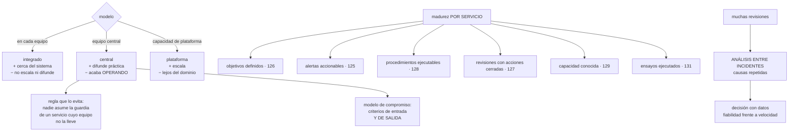

# 173 — Madurez SRE y confiabilidad organizacional

> [← 172 · Modelo operativo FinOps y economía unitaria](../../part-14-advanced-platform-capstones-career/172-modelo-operativo-finops-y-economia-unitaria/README.md) · [Índice de la parte](../README.md) · [174 · Arquitectura de seguridad cloud empresarial →](../../part-14-advanced-platform-capstones-career/174-arquitectura-de-seguridad-cloud-empresarial/README.md)

**Parte:** 14 — Plataformas avanzadas, capstones y carrera<br>
**Nivel:** experto-frontera · **Horas estimadas:** 4<br>
**Laboratorio:** `sre` · **Estado:** `EXECUTABLE_CORE`

## 🎯 Propósito

Organizar la fiabilidad cuando hay sesenta equipos, que es una pregunta distinta de la de la parte 10: no cómo se opera un sistema, sino **quién responde por su fiabilidad y cómo decide la organización**. La clase compara los tres modelos con sus modos de fallo, se detiene en el más común —**el equipo central que acaba operando los sistemas de todos**— y desarrolla dos cosas que solo existen a esta escala: **el análisis entre incidentes**, que encuentra la causa que aparece en once revisiones y que ninguna revisión individual puede ver, y **la conversación con el negocio sobre fiabilidad frente a velocidad**, que sin datos siempre la gana quien habla más alto.

## 📚 Resultados de aprendizaje

Al finalizar podrás:

1. **Elegir** el modelo organizativo de fiabilidad y reconocer su modo de fallo.
2. **Impedir** que un equipo central se convierta en la operación de los demás.
3. **Situar** la madurez por servicio, y usarla para decidir dónde invertir.
4. **Aplicar** la regla del presupuesto de error cuando alguien quiere saltársela.
5. **Encontrar** las causas que solo se ven mirando muchos incidentes juntos.

## 🧩 Conceptos centrales

| Concepto | Comprensión verificable |
|---|---|
| `modelo de compromiso` | Reglas escritas de cuándo un equipo central acompaña a otro, con criterios de entrada y de salida. |
| `guardia compartida` | Principio de que quien construye un servicio responde de él; nadie asume su guardia sin que el equipo dueño la lleve también. |
| `madurez por servicio` | Nivel de las capacidades de fiabilidad de un servicio concreto. Sirve para priorizar, no para calificar equipos. |
| `regla de parada` | Compromiso previo de qué ocurre al agotar el presupuesto de error, y quién puede levantarla. |
| `análisis entre incidentes` | Estudio de muchas revisiones juntas para encontrar causas repetidas que ninguna revisión individual muestra. |
| `carga de guardia sostenible` | Avisos por turno e interrupciones del sueño que una persona puede soportar de forma continuada. |

## 🧠 Modelo mental

El nivel experto no consiste en conocer más productos, sino en formular mejores preguntas, validar supuestos y sostener decisiones frente a costo, riesgo y operación.

Aplicado a esta clase, separa siempre cuatro planos: **intención** (qué necesita el usuario),
**configuración** (qué declaramos), **estado observado** (qué existe de verdad) y
**evidencia** (cómo sabemos que cumple). Confundirlos produce diseños que se ven correctos
en un diagrama pero fallan al operar.

## 🗺️ Flujo de razonamiento



## 📖 Desarrollo

### 1. Tres modelos y sus modos de fallo

```text
INTEGRADO EN CADA EQUIPO
  una o dos personas con foco en fiabilidad dentro del equipo
  + conocen el dominio y el sistema
  + la fiabilidad se decide donde se construye
  − no escala: hacen falta muchas personas
  − y la práctica no se difunde: cada equipo aprende lo mismo aparte

EQUIPO CENTRAL
  un grupo que acompaña, forma y construye práctica común
  + difunde lo aprendido; ve patrones entre equipos
  + puede sostener lo transversal: ensayos, análisis, herramientas
  − MODO DE FALLO: acaba operando los sistemas de los demás

CAPACIDAD DE PLATAFORMA
  la fiabilidad se ofrece como capacidades: objetivos, alertas,
  procedimientos, ensayos, todo listo para usar        clase 171
  + escala con el número de equipos
  − lejos del dominio: la plataforma no sabe qué significa
    «el pedido está mal»
```

Y lo que suele funcionar es una combinación, con papeles claros:

```text
la PLATAFORMA da las capacidades y los valores por defecto
el EQUIPO CENTRAL difunde, acompaña y hace el análisis transversal
y CADA EQUIPO responde de la fiabilidad de lo suyo
```

**El modo de fallo del equipo central** merece detalle porque es el más común:

```text
empieza acompañando
luego hace la guardia «temporalmente» de un servicio crítico
luego de dos
y al año lleva la operación de nueve sistemas que no construyó
→ es la ventanilla de la clase 106, en versión de fiabilidad
→ y los equipos dejan de aprender, porque alguien lo hace por ellos
```

Y las dos reglas que lo impiden:

```text
1. GUARDIA COMPARTIDA
   nadie asume la guardia de un servicio cuyo equipo dueño
   no la lleve también
   → si el equipo no puede llevarla, el problema es de plantilla
     o de complejidad, y hay que resolver ESO

2. MODELO DE COMPROMISO CON SALIDA
   se acompaña a un equipo durante un tiempo, con criterios
   de entrada y, sobre todo, de SALIDA
   → «cuando estas cinco capacidades estén en nivel 3, terminamos»
   → y la salida se ejecuta, no se pospone
```

Y la segunda es la que casi nunca se escribe: **un acompañamiento sin criterio de salida se convierte en permanente**.

### 2. Madurez por servicio, no por equipo

Con muchos servicios, hace falta saber dónde invertir. Y la unidad correcta es el servicio, no el equipo ni la organización:

```text
capacidad                                   niveles         clase
objetivos definidos y medidos en el borde     0-4            126
alertas accionables, con procedimiento        0-4            125
procedimientos ejecutables por otro           0-4            128
revisiones con acciones cerradas en plazo     0-4            127
capacidad y codo conocidos                    0-4            129
mecanismos de resiliencia verificados         0-4            130
ensayos ejecutados                            0-4            131
continuidad probada                           0-4            166
```

Y su uso correcto, que hay que declarar para que no se malinterprete:

```text
sirve para   decidir dónde invertir y qué acompañar
no sirve para  comparar equipos ni para evaluar a nadie
→ y en cuanto se usa para lo segundo, las cifras dejan de ser fiables
                                                          ley 17
```

Y el nivel exigible no es el mismo para todos:

```text
servicio del flujo principal        se espera nivel 3-4 en todo
servicio interno de apoyo           nivel 2 basta
herramienta con dos usuarios        nivel 1
→ y eso se declara: «este servicio es de nivel esperado 2»
```

Y lo que se hace con el mapa:

```text
servicios críticos por debajo de su nivel esperado
  → ahí va el acompañamiento del equipo central
huecos que aparecen en MUCHOS servicios
  → ahí va una capacidad de plataforma, no un acompañamiento
```

Y la segunda línea es la que convierte el mapa en algo útil:

```text
si cuarenta servicios están en nivel 1 en «continuidad probada»,
el problema no es de esos cuarenta equipos:
es que falta una capacidad de plataforma          clase 171
```

Y una advertencia sobre cómo se recoge:

```text
medido automáticamente donde se pueda
  ¿tiene objetivos declarados? ¿tiene alertas con procedimiento?
  ¿cuándo fue su último ensayo?
y declarado por el equipo donde no
→ pero nunca solo declarado: una autoevaluación sin verificación
  mide optimismo
```

### 3. Cuando alguien quiere saltarse la regla

La clase 126 estableció la regla de parada: al agotar el presupuesto de error, se para la funcionalidad nueva. A escala, esa regla se pone a prueba de forma distinta:

```text
no la discute el equipo, que la aceptó
la discute alguien con más autoridad que el equipo y una fecha
comercial encima
```

Y lo que hace falta para que sobreviva:

```text
ACORDADA ANTES, CON NOMBRE
  quién la firmó y en qué fecha                          clase 126
  → sin eso, cada agotamiento es una negociación nueva

UN CAMINO DE EXCEPCIÓN EXPLÍCITO
  alguien PUEDE levantarla, y está escrito quién
  con motivo, alcance y duración
  y la excepción se publica
→ una regla sin camino de excepción se rompe en silencio, que es peor

Y UNA CONSECUENCIA DE LEVANTARLA
  el trabajo de fiabilidad no desaparece: se aplaza y queda anotado
  → y si se levanta tres trimestres seguidos, eso es el dato
```

Y la conversación de fondo, que no es técnica:

```text
la fiabilidad compite con la funcionalidad por el mismo tiempo
→ decidir el reparto es una decisión de negocio
→ y el papel de ingeniería es que se tome CON DATOS, no evitar
  que se tome
```

Y los datos que la hacen posible son los que este programa ya produce:

```text
las cuatro medidas de entrega, publicadas juntas         clase 107
el presupuesto de error consumido y su ritmo             clase 126
el trabajo no planificado como proporción del total      clase 107
el coste de los incidentes, en euros y en horas
y el trabajo repetitivo                                  clase 128
```

Y lo que ocurre cuando se tiene sin datos:

```text
gana quien habla más alto o quien tiene el cargo mayor
y la decisión no se puede revisar después, porque no hay referencia
```

Y una forma concreta de tenerla bien, que funciona:

```text
cada trimestre, una revisión con negocio de una hora
  las cuatro medidas y el presupuesto de error, por producto
  el coste de los incidentes del trimestre
  y la propuesta de reparto para el siguiente
→ y se decide ahí, con el reparto escrito
```

### 4. Aprender entre incidentes

Una revisión de incidente encuentra lo que pasó en ese incidente. **A escala falta lo otro: qué se repite**.

```text
revisiones al trimestre                                    ~30
cada una con su causa y sus acciones                       clase 127
y nadie mira las treinta juntas
```

Y lo que aparece al mirarlas juntas es lo que ninguna revisión individual puede ver:

```text
la misma causa en once revisiones distintas
el mismo tipo de acción propuesta y nunca completada
el mismo tramo del tiempo de respuesta que domina siempre
y el mismo servicio apareciendo como origen o como víctima
```

El método, que cabe en media jornada al trimestre:

```text
1. CLASIFICAR cada incidente con un vocabulario cerrado
   causa próxima: cambio, capacidad, dependencia, datos,
     configuración, dependencia externa
   factores que lo alargaron: detección, decisión, procedimiento,
     acceso, herramienta
   y qué lo habría evitado

2. CONTAR y ordenar

3. ATACAR las tres primeras, con dueño y fecha

4. Y COMPROBAR el trimestre siguiente si han bajado
```

Y el vocabulario cerrado es lo que hace posible contar: **si cada revisión describe su causa con palabras propias, no se puede agregar nada**.

Y las medidas que se derivan y que dicen si la organización aprende:

```text
proporción de incidentes cuya causa ya había aparecido antes
  → si es alta, se revisa mucho y se corrige poco
acciones de revisión completadas en plazo                  clase 127
incidentes por servicio y por trimestre
y tiempo medio hasta detectar, por tipo de causa
```

La primera es la más reveladora de todas.

**La guardia**, que es la otra cuestión organizativa:

```text
avisos por turno                                          clase 125
  0-1 sostenible; más de 5, la gente deja de leerlos
proporción de turnos con interrupción del sueño
  → la cifra que decide si la guardia es sostenible
compensación o descanso equivalente
  → si no existe, la guardia la acaban llevando siempre los mismos
personas elegibles por servicio                           clase 162
  → menos de tres, es una dependencia de personas concretas
```

Y la opción de repartir por husos horarios, con su coste honesto:

```text
+ nadie hace guardia de noche
− exige equipos en varias zonas y traspasos disciplinados
− y el conocimiento del sistema debe estar repartido de verdad
→ solo compensa a partir de cierto tamaño
```

Y la lista de comprobación de la clase:

```text
☐ está declarado quién responde de la fiabilidad de cada servicio
☐ nadie lleva la guardia de un servicio cuyo equipo no la lleve
☐ los acompañamientos tienen criterio de entrada y de SALIDA
☐ hay mapa de madurez por servicio, con nivel esperado declarado
☐ el mapa se usa para invertir, no para comparar equipos
☐ los huecos comunes se resuelven con capacidad de plataforma
☐ la regla de parada está acordada, con nombre y fecha
☐ existe camino de excepción explícito y publicado
☐ hay revisión trimestral con negocio, con las cuatro medidas
☐ los incidentes se clasifican con vocabulario cerrado
☐ hay análisis entre incidentes trimestral, con acciones
☐ se mide qué proporción de incidentes repite una causa conocida
☐ se miden avisos por turno e interrupciones del sueño
☐ hay al menos tres personas elegibles por servicio
```

Y el cierre que enlaza con la clase siguiente: fiabilidad y coste ya tienen modelo operativo. Falta el tercero de los grandes: la seguridad, que a escala organizativa deja de ser un conjunto de controles y pasa a ser una arquitectura con sus propias decisiones. Es la materia de la clase 174.

## 🔬 Ejemplo trabajado

**CloudShop tiene un equipo de fiabilidad de cinco personas para sesenta equipos. El ejercicio empieza contando en qué emplean el tiempo y termina encontrando una causa que aparecía en once revisiones de incidente sin que nadie lo hubiera notado.**

**En qué se iba el tiempo.**

```text
guardia de servicios que no construyeron                    41 %
resolver incidencias de otros equipos                       19 %
acompañamiento y formación                                  16 %
construir capacidades comunes                               14 %
análisis y mejora                                           10 %
```

**El 60 % operando sistemas ajenos.** Y el origen de esos nueve servicios:

```text
servicios cuya guardia llevaba el equipo central                9
  asumidos «temporalmente» durante un incidente                 5
  asumidos porque el equipo dueño se disolvió                   2
  asumidos porque el equipo dueño no daba abasto                2
antigüedad media de esa situación                          14 meses
equipos dueños que también llevaban la guardia                  0
```

**Ninguno de los nueve equipos dueños llevaba la guardia de su propio servicio.**

**La regla de guardia compartida, aplicada.**

```text
los 5 asumidos en un incidente
  → se devolvieron con un acompañamiento de 8 semanas y criterio
    de salida escrito
  → los 5 volvieron a su equipo en 3 meses

los 2 sin equipo dueño
  → se asignó dueño; uno se retiró por no tener uso        ley 20

los 2 cuyo equipo no daba abasto
  → el problema era de plantilla y de complejidad
  → uno se simplificó (2 servicios unidos en 1)            clase 148
  → el otro recibió una persona más
```

```text                                          antes         después
servicios con guardia del equipo central          9              0
tiempo en guardia ajena                          41 %            0 %
tiempo en construir capacidades                  14 %           38 %
tiempo en análisis y mejora                      10 %           27 %
```

Y el criterio de salida que se escribió para los acompañamientos:

```text
se termina cuando el servicio alcanza
  objetivos definidos y medidos                       nivel 3
  alertas accionables con procedimiento               nivel 3
  procedimientos ejecutables por otro                 nivel 3
  revisiones con acciones cerradas                    nivel 3
  y el equipo ha llevado la guardia 4 semanas sin apoyo

acompañamientos iniciados en 12 meses                          11
terminados según criterio                                       9
prorrogados con motivo escrito                                  2
prorrogados sin motivo                                          0
```

**El mapa de madurez.**

```text
servicios evaluados                                            87
capacidades por servicio                                        8
recogida   6 automáticas, 2 declaradas y verificadas por muestreo
```

Y el resultado agregado, que orientó la inversión:

```text
capacidad                              media   servicios en 0-1
objetivos definidos                      3,1          6
alertas accionables                      3,0          9
procedimientos ejecutables               2,4         18
revisiones con acciones cerradas         2,8         11
capacidad y codo conocidos               1,6         41   ← hueco común
resiliencia verificada                   1,9         34   ← hueco común
ensayos ejecutados                       1,2         52   ← hueco común
continuidad probada                      0,9         61   ← hueco común
```

Y la lectura del apartado segundo, aplicada:

```text
servicios críticos por debajo de su nivel esperado              7
  → acompañamiento individual

huecos que aparecen en más de la mitad de los servicios          4
  → NO son problemas de esos equipos
  → son capacidades de plataforma que faltan            clase 171
```

Y las cuatro pasaron a la hoja de ruta de la plataforma:

```text
ensayos como servicio          un catálogo que un equipo ejecuta solo
continuidad como capacidad     plantilla, replicación y ensayo guiado
prueba de capacidad            entorno y herramienta para medir el codo
resiliencia verificada         batería de comprobaciones automáticas
```

```text                                    a los 9 meses
ensayos ejecutados, media                    1,2 → 2,8
continuidad probada, media                   0,9 → 2,4
servicios en nivel 0-1 en esas cuatro        188 → 47
```

**El análisis entre incidentes.**

Se clasificaron las últimas cuatro tandas de revisiones con vocabulario cerrado:

```text
incidentes revisados, 12 meses                                118

causa próxima
  cambio (despliegue o configuración)                          41
  dependencia externa                                          22
  capacidad                                                    19
  datos                                                        14
  dependencia interna                                          13
  otros                                                         9

factores que lo alargaron
  detección                                                    28
  procedimiento inexistente o inservible                       31   ← destaca
  acceso o permisos                                            24   ← destaca
  decisión                                                     18
  herramienta                                                  11
```

Y el hallazgo que ninguna revisión individual mostraba:

```text
en 11 revisiones distintas, de 7 equipos distintos,
el factor que más alargó el incidente fue el mismo:

  «quien estaba de guardia no tenía permiso para ejecutar
   el paso de mitigación y hubo que localizar a alguien»

tiempo añadido, sumado                                     6 h 40
en 12 meses
```

Y la corrección fue una sola, y no técnica:

```text
el acceso temporal de la clase 134 existía
y los procedimientos no decían cómo pedirlo
y quien estaba de guardia no estaba en el grupo que podía pedirlo

corrección
  todo procedimiento incluye el comando exacto de solicitud
  quien está de guardia entra automáticamente en el grupo
    durante su turno
  concesión automática para las acciones de mitigación
    catalogadas, con registro                             clase 134

incidentes con ese factor, trimestre siguiente                  0
```

Y las otras dos primeras causas se atacaron igual:

```text
PROCEDIMIENTO INSERVIBLE (31)
  → prueba de ejecución por otra persona, obligatoria     clase 128
  → 87 procedimientos revisados; 41 corregidos
  → factor en el trimestre siguiente: 31 → 9

DETECCIÓN (28)
  → la pregunta «¿qué alerta faltaba?» ya existía, y sus acciones
    se completaban al 61 %
  → se cambió: la acción de detección es requisito para cerrar
    la revisión
  → factor en el trimestre siguiente: 28 → 12
```

Y la medida que dice si la organización aprende:

```text                                          antes         después
incidentes cuya causa ya había aparecido antes    71 %          38 %
acciones de revisión completadas en plazo         61 %          88 %
incidentes por trimestre                          30             19
```

**La regla de parada, puesta a prueba.**

```text
trimestre 3   un producto agota su presupuesto de error el día 19
              hay un lanzamiento comprometido con un cliente el día 28

sin camino de excepción
  la regla se habría roto en silencio, o habría habido una discusión
  que la dejaría sin valor para siempre

con camino de excepción
  la levantó quien estaba autorizado, por escrito
  alcance: solo ese lanzamiento
  duración: hasta el día 30
  contrapartida: el trabajo de fiabilidad aplazado quedó anotado
    y se ejecutó en el trimestre 4
  publicado en el mismo sitio que los objetivos

levantamientos en 12 meses                                      2
en el mismo producto                                            1
→ si hubieran sido tres seguidos, ese habría sido el dato a discutir
```

**La guardia.**

```text                                          antes         después
avisos por turno                                1,4            0,9
turnos con interrupción del sueño                31 %           9 %
personas elegibles por servicio, mediana           2              4
servicios con menos de 3 elegibles              34 de 87       6 de 87
compensación o descanso equivalente             informal      declarada
```

**A los doce meses.**

```text                                          antes         después
servicios con guardia del equipo central          9              0
tiempo del equipo central en guardia ajena       41 %            0 %
tiempo en construir y en analizar                24 %           65 %
acompañamientos con criterio de salida            0             11
mapa de madurez                                  no             87 servicios
huecos comunes convertidos en capacidad           0              4
análisis entre incidentes                        no          trimestral
incidentes que repiten una causa conocida        71 %           38 %
acciones de revisión completadas                 61 %           88 %
incidentes por trimestre                          30             19
turnos con interrupción del sueño                31 %            9 %
revisión trimestral con negocio                  no             sí
```

**La lección que esta clase traslada a la parte 14**: el equipo de fiabilidad dedicaba el 60 % de su tiempo a operar nueve sistemas que no había construido, y **ninguno de los nueve equipos dueños llevaba su propia guardia**; devolver esos servicios con acompañamiento y criterio de salida liberó dos tercios de su capacidad. Y el hallazgo mayor del año no salió de ninguna revisión de incidente: salió de mirar ciento dieciocho juntas y descubrir que **en once de ellas, de siete equipos distintos, lo que más alargó el incidente fue que quien estaba de guardia no tenía permiso para mitigar**.

## 🧪 Laboratorio guiado

Ejecuta desde la raíz:

```bash
python classes/part-14-advanced-platform-capstones-career/173-madurez-sre-y-confiabilidad-organizacional/lab.py
```

El laboratorio selecciona el motor de práctica **`sre`** y produce
`lab_result.json`. El escenario, sus comprobaciones y el artefacto esperado corresponden a
esta clase; no requiere credenciales y deja explícito qué debe revalidarse en un sandbox real.

1. Lee `exercise.steps` y formula una predicción antes de ejecutar.
2. Ejecuta la práctica y verifica todos los elementos de `checks`.
3. Provoca el caso de `negative_test` y explica la señal observada.
4. Materializa `assessment-sre` en `evidence/` usando la plantilla indicada.
5. Para proveedor real, sigue `sandbox.requires`, registra costo y ejecuta `destroy`.

### Evidencia esperada

El artefacto principal es un SLO con presupuesto de error y política de acción. Además, la entrega debe incluir el comando ejecutado,
la salida estructurada y una conclusión que no exceda lo observado.

## 🏆 Reto verificable

Construye **`assessment-sre`** para el caso CloudShop. Incluye una alternativa descartada,
un supuesto que pueda falsarse, una prueba de fallo y una decisión de rollback.

## ✅ Criterio de aceptación

- [ ] `lab.py` termina con código 0 y genera JSON válido.
- [ ] La entrega conecta al menos tres requisitos con mecanismos verificables.
- [ ] Existe una prueba positiva y una prueba negativa con evidencia.
- [ ] Seguridad, costo y operación aparecen como decisiones, no como anexos.
- [ ] Se declara una limitación y una condición que obligaría a revisar el diseño.
- [ ] Otra persona puede repetir el recorrido sin conocimiento tácito.

## ⚠️ Errores frecuentes

| Síntoma | Causa probable | Corrección |
|---|---|---|
| El equipo de fiabilidad acaba operando sistemas que no construyó | Se asumieron guardias temporalmente y nunca se devolvieron | Nadie lleva la guardia de un servicio cuyo equipo dueño no la lleve, y todo acompañamiento tiene criterio de salida escrito y ejecutado. |
| El mapa de madurez se convierte en una comparación entre equipos | Se usó para calificar en vez de para priorizar; ley 17 | Declara el nivel esperado por servicio, úsalo para decidir dónde invertir y verifica lo declarado con muestreo. |
| Muchos servicios están mal en la misma capacidad | Se trata como un problema de esos equipos | Un hueco común es una capacidad de plataforma que falta, no una carencia de sesenta equipos. |
| La regla del presupuesto de error se rompe en silencio | No hay camino de excepción, así que la única salida es incumplirla | Camino explícito, con quién puede levantarla, alcance, duración, contrapartida y publicación. |
| Se revisan muchos incidentes y se repiten las mismas causas | Cada revisión mira su caso y nadie mira el conjunto | Clasifica con vocabulario cerrado, cuenta, ataca las tres primeras causas y comprueba el trimestre siguiente. |
| La conversación sobre fiabilidad frente a velocidad la gana quien tiene el cargo mayor | Se tiene sin datos | Revisión trimestral con las cuatro medidas de entrega, el presupuesto de error y el coste de los incidentes, con el reparto escrito. |

## 🛡️ Seguridad, ética y costo

Trabaja con cuentas propias o sandboxes autorizados. No publiques secretos, identificadores
reales ni datos personales. Antes de crear recursos pagos define presupuesto, etiquetas y
comando de destrucción; después verifica que no queden recursos huérfanos. Los ejemplos
locales enseñan contratos, pero no certifican cumplimiento ni disponibilidad de producción.

## ❓ Preguntas de comprobación

1. ¿Cuál es el modo de fallo del equipo central de fiabilidad y qué dos reglas lo evitan?
2. ¿Por qué la madurez se mide por servicio y no por equipo?
3. ¿Qué significa que muchos servicios estén mal en la misma capacidad?
4. ¿Por qué una regla de parada necesita camino de excepción?
5. ¿Qué encuentra un análisis entre incidentes que ninguna revisión individual puede ver?

## 🔗 Referencias

- Beyer, B. y otros (2018). *The Site Reliability Workbook*, caps. 1 y 20 — modelos organizativos y compromiso con equipos. <https://sre.google/workbook/table-of-contents/>
- Google SRE (2025). *SRE engagement model* — criterios de entrada y de salida de un acompañamiento. <https://sre.google/sre-book/evolving-sre-engagement-model/>
- Skelton, M. y Pais, M. (2019). *Team Topologies*, cap. 5 — equipos capacitadores frente a equipos que operan por otros. <https://teamtopologies.com/book>
- Allspaw, J. (2025). *Learning from incidents* — análisis entre incidentes y vocabulario común. <https://www.learningfromincidents.io/>
- PagerDuty (2025). *On-call sustainability* — carga por turno, interrupciones del sueño y elegibilidad. <https://response.pagerduty.com/oncall/being_oncall/>
- Documentación oficial vigente del servicio implementado; registra URL y fecha de consulta.

---

> [Evaluación](assessment.md) · [Contrato de clase](lesson.yaml) · [Índice de la parte](../README.md)

| Anterior | Índice | Siguiente |
|---|---|---|
| [← 172 · Modelo operativo FinOps y economía unitaria](../../part-14-advanced-platform-capstones-career/172-modelo-operativo-finops-y-economia-unitaria/README.md) | [Parte 14](../README.md) · [Programa](../../README.md) | [174 · Arquitectura de seguridad cloud empresarial →](../../part-14-advanced-platform-capstones-career/174-arquitectura-de-seguridad-cloud-empresarial/README.md) |
