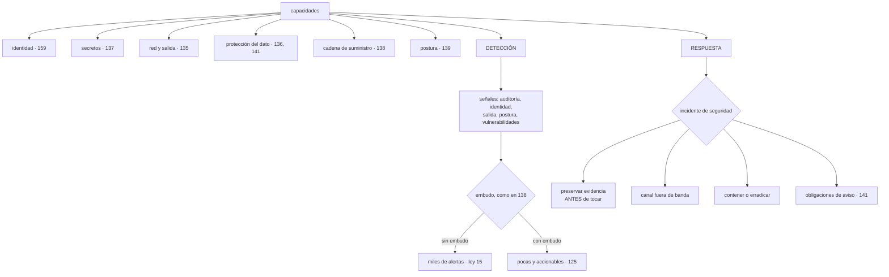

# 174 — Arquitectura de seguridad cloud empresarial

> [← 173 · Madurez SRE y confiabilidad organizacional](../../part-14-advanced-platform-capstones-career/173-madurez-sre-y-confiabilidad-organizacional/README.md) · [Índice de la parte](../README.md) · [175 · Workloads de IA, GPU, datos y MLOps multi-cloud →](../../part-14-advanced-platform-capstones-career/175-workloads-de-ia-gpu-datos-y-mlops-multi-cloud/README.md)

**Parte:** 14 — Plataformas avanzadas, capstones y carrera<br>
**Nivel:** experto-frontera · **Horas estimadas:** 4<br>
**Laboratorio:** `security` · **Estado:** `EXECUTABLE_CORE`

## 🎯 Propósito

Organizar la seguridad cuando deja de ser un conjunto de controles y pasa a ser una arquitectura con decisiones propias, unas cuantas de ellas irreversibles. La clase ordena las capacidades como hizo la 171 con la plataforma, desarrolla lo que la parte 11 no cubrió —**la función de detección y respuesta**, con su propio problema de ruido— y trata el incidente de seguridad como lo que es: **distinto de uno de disponibilidad**, porque hay que preservar evidencia, hay obligaciones que cumplir y **quien está dentro puede estar leyendo el canal donde se coordina la respuesta**.

## 📚 Resultados de aprendizaje

Al finalizar podrás:

1. **Ordenar** la seguridad como capacidades con nivel, y distinguir huecos de equipo de huecos de plataforma.
2. **Montar** la detección sin repetir el problema de ruido de la parte 11.
3. **Gestionar** un incidente de seguridad con sus diferencias respecto de uno de disponibilidad.
4. **Fijar** las decisiones de arquitectura de seguridad que no se pueden deshacer.
5. **Medir** la seguridad por alcance y por tiempos, no por recuento de hallazgos.

## 🧩 Conceptos centrales

| Concepto | Comprensión verificable |
|---|---|
| `mapa de capacidades de seguridad` | Identidad, secretos, red, protección del dato, cadena de suministro, postura, detección y respuesta, con su nivel por servicio. |
| `detección` | Función que observa señales y decide qué merece respuesta. Su fallo característico es el mismo de la parte 10: demasiadas alertas. |
| `contención frente a erradicación` | Cortar el daño ahora frente a expulsar al atacante del todo. Actuar pronto puede avisarle; esperar cuesta datos. |
| `canal fuera de banda` | Medio de coordinación independiente de los sistemas posiblemente comprometidos. Sin él, la respuesta se coordina delante del atacante. |
| `preservación de evidencia` | Conservar el estado antes de tocarlo. Reiniciar destruye lo que permite entender el alcance. |
| `decisión irreversible de seguridad` | Dónde vive la identidad, dónde están las fronteras y cómo se cifra. Cambiarlas después es un proyecto. |

## 🧠 Modelo mental

El nivel experto no consiste en conocer más productos, sino en formular mejores preguntas, validar supuestos y sostener decisiones frente a costo, riesgo y operación.

Aplicado a esta clase, separa siempre cuatro planos: **intención** (qué necesita el usuario),
**configuración** (qué declaramos), **estado observado** (qué existe de verdad) y
**evidencia** (cómo sabemos que cumple). Confundirlos produce diseños que se ven correctos
en un diagrama pero fallan al operar.

## 🗺️ Flujo de razonamiento



## 📖 Desarrollo

### 1. Capacidades, y dónde están los huecos

A escala, la seguridad se gobierna igual que la plataforma: **como capacidades con nivel**, no como una lista de herramientas.

```text
capacidad                        de dónde viene        nivel típico
identidad de personas y cargas   clases 133, 159
secretos y credenciales          clase 137
red, segmentación y salida       clase 135
protección del dato              clases 136, 141
cadena de suministro             clases 067, 138
postura y política               clases 139, 170
DETECCIÓN                        esta clase
RESPUESTA                        esta clase y la 127
```

Y el mismo hallazgo que la clase 173:

```text
un hueco en pocos servicios      → acompañamiento a esos equipos
un hueco en la mayoría           → falta una capacidad de plataforma
                                   clase 171
```

Y las dos últimas son las que la parte 11 no desarrolló, porque a pequeña escala se resuelven con la operación normal y a esta ya no.

**Las decisiones de arquitectura**, que conviene tomar una vez y bien, porque son irreversibles —ley 14—:

```text
DÓNDE VIVE LA IDENTIDAD
  un proveedor de identidad, y quién confía en él        clase 159
  → cambiarlo después toca a todo lo que autentica

DÓNDE ESTÁN LAS FRONTERAS DE CONFIANZA
  cuentas, entornos, redes, inquilinos                   clases 140, 169
  → mover una frontera es mover lo que contiene

EL MODELO DE CIFRADO
  qué se cifra, con qué claves, quién puede usarlas y quién
  administrarlas                                         clase 136
  → y el ámbito de las claves: global, por región, por cliente

EL MODELO DE REGISTRO Y EVIDENCIA
  qué se registra, dónde se guarda, quién no puede tocarlo
  y cuánto se conserva                                   clase 141
  → si se decide tarde, faltará justo lo que haría falta
    para investigar el primer incidente

EL MODELO DE SEGMENTACIÓN
  denegación por defecto, control de salida y sus excepciones
                                                         clase 135
```

Y las cinco tienen la misma propiedad: **decidirlas mal cuesta un proyecto; no decidirlas cuesta más**, porque cada equipo improvisa la suya.

Y el reparto entre lo central y lo de cada equipo:

```text
CENTRAL     las cinco decisiones anteriores
            las capacidades comunes
            la detección y la respuesta
            y las políticas del nivel 1                  clase 170

DE CADA EQUIPO
            la seguridad de su propio código y su modelo de amenazas
                                                         clase 140
            los permisos concretos de sus cargas
            y las respuestas a los hallazgos de sus servicios
```

### 2. Detección sin ahogarse

La función de detección observa señales y decide qué merece una respuesta. Y su fallo característico es exactamente el de la parte 10:

```text
se conectan todas las fuentes disponibles
se activan todas las reglas del catálogo
→ miles de alertas al día
→ y a los tres meses nadie las mira                      ley 15
```

Las señales que de verdad producen detecciones, ordenadas por rendimiento:

```text
IDENTIDAD
  accesos desde sitios o a horas inusuales
  uso de credenciales que llevaban meses sin usarse
  concesiones de permisos amplios                        clase 134
  y uso del acceso de emergencia
  → es la fuente con mejor relación entre señal y ruido

SALIDA DE DATOS
  destinos nuevos, volumen anómalo por carga             clase 135
  → detecta extracción de datos, que es el objetivo final

AUDITORÍA DE LA NUBE
  cambios en políticas, en registro, en claves y en copias
  → lo que un atacante toca para asentarse                clase 141

POSTURA
  cambios de configuración que abren algo                 clase 139

CADENA DE SUMINISTRO
  paquetes nuevos, cambios de origen                      clase 138

Y EL SISTEMA MISMO
  errores de autenticación, patrones en la puerta de entrada
                                                          clase 118
```

Y el embudo, que es el mismo método de la clase 138:

```text
¿es plausible en NUESTRO entorno?
¿afecta a algo expuesto o crítico?
¿tiene una acción concreta asociada?
¿tiene dueño al que enviarla?                             clase 139
→ y lo que no supere las cuatro no es una alerta: es un registro
```

Y las dos reglas que este programa lleva aplicando y que aquí valen igual:

```text
alertar por lo que exige actuar, no por lo que es interesante
                                                          clase 125
y medir la proporción accionable, no el número de reglas
```

Y una advertencia sobre las líneas base: **lo anómalo solo se puede detectar si se sabe qué es normal**, y eso exige un periodo de observación y revisión periódica. Un sistema de detección estrenado el mismo día que la carga produce ruido durante semanas.

Y la comprobación que la ley 22 exige:

```text
simular la acción que se quiere detectar y comprobar que salta
  crear una identidad con permisos amplios
  sacar datos a un destino nuevo
  desactivar un registro
→ trimestral, y en TODAS las cuentas                       clase 164
```

### 3. El incidente de seguridad es distinto

Comparte el proceso de la clase 127 —declarar, papeles, un cambio cada vez, comunicación— y **tiene cuatro diferencias que cambian las decisiones**:

```text
1. HAY QUE PRESERVAR EVIDENCIA ANTES DE TOCAR
   reiniciar destruye la memoria; borrar destruye el rastro
   → capturar primero: memoria, discos, registros, estado de red
   → y anotar quién tomó qué y cuándo

2. QUIEN ESTÁ DENTRO PUEDE ESTAR LEYENDO
   el canal de incidentes, el correo, el repositorio, el sistema
   de tareas
   → hace falta un canal FUERA DE BANDA acordado de antemano
   → y no se discute el alcance en el canal habitual hasta saber
     que no está comprometido

3. CONTENER PRONTO PUEDE AVISARLE
   si se corta su acceso, sabe que se le ha visto y puede acelerar
   o borrar rastros
   → y esperar cuesta datos
   → la decisión es de negocio y de riesgo, no técnica, y se toma
     con quien pueda tomarla

4. HAY OBLIGACIONES CON PLAZO
   avisos a autoridades y a clientes, con plazos legales
                                                          clase 141
   → y el reloj empieza cuando se conoce, no cuando se termina
     de investigar
```

Y la segunda merece énfasis porque casi nadie la prevé:

```text
el canal fuera de banda
  acordado ANTES, con instrucciones de cómo llegar a él
  independiente del proveedor de identidad corporativo
  y con la lista de quién debe estar
→ y probado, porque si se estrena durante el incidente,
  no funcionará                                            ley 22
```

Y los papeles, que amplían los de la clase 127:

```text
mando del incidente                       igual que en la 127
responsable técnico de la investigación
responsable de comunicación interna y externa
responsable legal y de cumplimiento        ← nuevo
responsable de evidencia                   ← nuevo
```

Y el orden de trabajo, que conviene tener escrito:

```text
1. confirmar que es un incidente de seguridad
2. abrir canal fuera de banda
3. preservar evidencia
4. acotar el alcance: ¿qué credenciales, qué datos, desde cuándo?
5. decidir contención, con quien deba decidirlo
6. contener: rotar, revocar, aislar                       clases 133, 137
7. erradicar y recuperar
8. cumplir las obligaciones de aviso
9. revisar, con la disciplina de la clase 127
```

Y el paso 4 es el que decide todo lo demás, y el que exige haber preparado el registro de auditoría:

```text
¿qué pudo hacer con esa credencial?                       clase 133
¿qué hizo, según el registro?
¿pudo obtener otra?
→ y si el registro no cubre el periodo, esa pregunta no tiene respuesta
```

### 4. Prioridad, medida y ejercicios

**La priorización** de lo que se atiende, con honestidad:

```text
mal   por lo que aparece en las noticias
      → produce trabajo urgente sobre amenazas que no aplican

bien  por lo que se explota de verdad Y aplica a este entorno
      catálogos de explotación observada                   clase 138
      técnicas conocidas de movimiento lateral             clase 133
      y las cadenas del propio modelo de amenazas          clase 140
```

Y el filtro que más reduce:

```text
¿esta técnica es posible en NUESTRO entorno?
  → muchas no lo son porque una decisión de arquitectura las impide
  → y saberlo evita trabajo, y también evita creerse a salvo
    de las que sí lo son
```

**Las medidas**, que a escala hay que elegir con cuidado porque la ley 17 acecha:

```text
mal   número de vulnerabilidades, número de alertas,
      número de políticas, número de certificaciones
      → suben o bajan sin que el riesgo cambie

bien  ALCANCE desde cada punto de entrada                  clase 133
      accesos permanentes a lo sensible                    clase 134
      credenciales de larga duración que quedan            clase 137
      antigüedad del hallazgo más viejo que supera el embudo  clase 138
      caminos hasta objetivos críticos                     clase 140
      tiempo hasta detectar y hasta contener
      proporción de alertas accionables                    clase 125
      cobertura del mapa de capacidades
      y ejercicios ejecutados                              ley 22
```

Y las dos de tiempo son las que mejor resumen la función de detección y respuesta:

```text
tiempo hasta detectar     de la acción del atacante al aviso
tiempo hasta contener     del aviso a cortar su acceso
→ y las dos se miden en los ejercicios, porque en incidentes reales
  hay muy pocos datos
```

**Los ejercicios**, que son la aplicación de la ley 22 a esta materia:

```text
DE MESA
  se plantea un escenario y el equipo dice qué haría
  barato, y encuentra huecos de proceso y de responsabilidad

TÉCNICO CONTROLADO
  se ejecuta una técnica concreta en un entorno acotado
  y se comprueba si se detecta y en cuánto

DE EQUIPO CONTRARIO
  alguien intenta alcanzar un objetivo declarado, con reglas
  y con alguien que sabe que ocurre
  → el más caro y el que más enseña
  → y su valor está en el informe conjunto, no en si «ganó» alguien
```

Y lo que hay que exigir a cualquiera de los tres:

```text
objetivo declarado, reglas escritas y alguien que puede pararlo
y un informe que produzca acciones con dueño y fecha      clase 127
```

Y la lista de comprobación de la clase:

```text
☐ las cinco decisiones de arquitectura están tomadas y escritas
☐ hay mapa de capacidades con nivel por servicio
☐ los huecos comunes se resuelven con capacidad de plataforma
☐ las alertas de seguridad pasan por un embudo y tienen dueño
☐ se mide la proporción accionable, no el número de reglas
☐ hay línea base antes de alertar por lo anómalo
☐ se simula trimestralmente lo que se quiere detectar
☐ existe canal fuera de banda acordado y probado
☐ hay procedimiento de preservación de evidencia
☐ los papeles incluyen evidencia y cumplimiento
☐ la decisión de contener frente a observar la toma quien debe
☐ el registro de auditoría cubre el periodo necesario para investigar
☐ se prioriza por explotación real y por aplicabilidad
☐ se miden alcance y tiempos, no recuentos
☐ hay ejercicios de los tres tipos, con acciones
```

Y el cierre que enlaza con la clase siguiente: todo lo anterior vale para cualquier carga. Las de inteligencia artificial añaden exigencias propias —volúmenes de datos, hardware escaso y caro, y preguntas sobre de dónde salen los datos— y son la materia de la clase 175.

## 🔬 Ejemplo trabajado

**CloudShop monta la función de detección y respuesta con sesenta equipos. El ejercicio empieza con doce mil alertas al mes y termina con un incidente real en el que lo primero que hizo el equipo fue abrir un canal que no había usado nunca.**

**El punto de partida de la detección.**

```text
fuentes conectadas                                            14
reglas activas                                               780
alertas al mes                                            12.400
alertas atendidas                                            310
alertas que produjeron una acción                             19
proporción accionable                                       0,15 %
personas dedicadas                                             2
```

**Diecinueve acciones de doce mil cuatrocientas alertas.** Es la ley 15, y con dos personas la única salida era ignorar el 97,5 %.

**El embudo, aplicado.**

```text
alertas al mes                                            12.400
plausibles en este entorno                                 2.100
  → 10.300 eran de técnicas imposibles aquí: sistemas que no
    usamos, protocolos desactivados, servicios inexistentes
sobre algo expuesto o crítico                                640
con acción concreta asociada                                 210
con dueño identificable                                      190
```

Y las reglas correspondientes:

```text                                          antes         después
reglas activas                                 780            240
fuentes conectadas                              14              9
  → 5 no habían producido ninguna detección útil en 12 meses
alertas al mes                              12.400            190
proporción accionable                        0,15 %            41 %
acciones al mes                                 19             78
```

Y las fuentes que quedaron, ordenadas por lo que aportaron:

```text
identidad                            51 % de las detecciones útiles
salida de datos                      19 %
auditoría de la nube                 14 %
postura                               9 %
cadena de suministro                  4 %
otras                                 3 %
```

**La mitad de las detecciones útiles venían de identidad**, que es también la fuente más barata de conectar.

**Las líneas base, y las seis semanas de ruido.**

```text
al activar la detección de accesos anómalos
  semana 1   410 alertas; todas normales
             → nadie sabía qué era normal
  semanas 2-6  periodo de observación, sin alertar
  semana 7   se activó con la línea base aprendida
             alertas semanales                                 6
             de ellas, reales                                  2
```

Y una comprobación que se añadió tras eso:

```text
cuando se despliega un servicio nuevo, su detección entra en
observación 4 semanas antes de alertar
→ y mientras tanto, sus señales se registran pero no despiertan
  a nadie
```

**La comprobación de que la detección detecta.**

```text
simulaciones trimestrales, ejecutadas en las 176 cuentas

  crear una identidad con permisos amplios     detectada en  3 min
  usar una credencial dormida 6 meses          detectada en  8 min
  sacar 2 GB a un destino nuevo                detectada en 14 min
  desactivar un registro de auditoría          NO DETECTADA  ← 1.ª vez
  usar el acceso de emergencia                 detectada en  1 min
  crear un almacén público                     detectada en  6 min
```

Y la que falló:

```text
desactivar el registro de auditoría estaba impedido por política
en el nivel 1                                              clase 170
pero en 6 cuentas heredadas la política no estaba activa   clase 169
→ y en esas 6, la acción era posible y NO se detectaba
→ corregido, y añadido a las pruebas negativas de todas las cuentas
```

**El incidente real.**

```text
14:02  alerta: una credencial de una carga se usa desde una dirección
       nunca vista, fuera del horario de esa carga
14:04  se confirma que es un incidente de seguridad
14:05  se abre el canal fuera de banda
       → primera vez que se usaba; dos personas no sabían cómo entrar
       → 11 minutos de retraso
14:16  preservación de evidencia: instantáneas de los discos,
       volcado de memoria del proceso, exportación de registros
14:31  acotación del alcance con el registro de auditoría
       ¿qué podía hacer?      leer un almacén de documentos
       ¿qué hizo?             listó y descargó 41 objetos
       ¿pudo obtener otra credencial?   NO         ← clase 133
14:48  decisión de contener, tomada por quien correspondía
14:52  credencial revocada; identidad rotada
15:10  origen encontrado: la credencial estaba en un registro de
       una herramienta interna que la mostraba          clase 137
16:30  aviso a los clientes cuyos documentos se habían descargado
       → 3 clientes; dentro del plazo legal              clase 141

tiempo hasta detectar                                      ~7 min
tiempo hasta contener                                      50 min
datos afectados                              41 documentos, 3 clientes
credenciales adicionales obtenidas                              0
```

Y las tres cosas que funcionaron y las tres que no:

```text
FUNCIONÓ
  la detección: 7 minutos desde el primer uso
  la respuesta a «¿pudo obtener otra credencial?»: no,
    gracias al trabajo de la clase 133
  y el registro de auditoría cubría el periodo

NO FUNCIONÓ
  el canal fuera de banda: nunca se había usado           ley 22
  la preservación de evidencia: no había procedimiento y
    se improvisó; se perdió el estado de red
  y la credencial estaba visible en una herramienta interna
    que ya se había señalado en la clase 137 y no se había corregido
    en ese componente
```

```text                                          antes         después
canal fuera de banda probado                    no        trimestral
personas que saben llegar a él                  4 de 11       11 de 11
procedimiento de evidencia                      no             sí
  con lista de qué capturar y en qué orden
componentes que muestran credenciales            1              0
```

**Los ejercicios.**

```text
de mesa, trimestrales                                          4
  hallazgos                                                   23
  de ellos, de proceso o de responsabilidad                    19

técnicos controlados, trimestrales                             4
  técnicas probadas                                           18
  detectadas                                                  14
  no detectadas                                                4  → reglas nuevas

de equipo contrario, anual                                     1
  objetivo declarado   «llegar a los datos de un cliente
                        desde una posición de empleado»
  resultado            no lo consiguió; llegó hasta un almacén
                       interno sin datos personales
  hallazgos                                                   11
  de ellos, corregidos en el trimestre                        10
```

Y el hallazgo del ejercicio anual que más valió:

```text
el equipo defensor tardó 2 h 40 en darse cuenta
y la señal que lo delató no fue ninguna de las reglas:
fue un aumento del volumen de salida de una carga        clase 135
→ se convirtió en regla, con línea base por carga
```

**Las medidas, cambiadas.**

```text                                          antes         después
lo que se publicaba              nº de vulnerabilidades, nº de alertas
lo que se publica ahora
  alcance desde cada punto de entrada          2 de 6 puntos → 0
  accesos permanentes a lo sensible                 19 → 0
  credenciales de larga duración                    14 → 0
  antigüedad del hallazgo más viejo del embudo   19 meses → 5 días
  caminos hasta objetivos críticos                  14 → 2
  tiempo hasta detectar (ejercicios)             no se medía → 9 min
  tiempo hasta contener (ejercicios)             no se medía → 24 min
  proporción de alertas accionables               0,15 % → 41 %
  ejercicios ejecutados al año                      0 → 9
```

**A los doce meses.**

```text                                          antes         después
reglas de detección                            780            240
alertas al mes                              12.400            190
proporción accionable                        0,15 %           41 %
acciones al mes                                 19             78
fuentes conectadas                              14              9
simulaciones de detección                     no había     trimestral
técnicas no detectadas al simular                —          4 de 18 → 0
canal fuera de banda probado                    no        trimestral
procedimiento de evidencia                      no             sí
ejercicios al año                                0              9
cuentas donde la política del nivel 1 faltaba    6              0
```

**La lección que esta clase traslada a la parte 14**: de doce mil cuatrocientas alertas al mes, **diez mil trescientas eran de técnicas imposibles en este entorno**, y el embudo que las eliminó multiplicó por cuatro las acciones reales con las mismas dos personas. Y en el incidente real la detección funcionó en siete minutos y lo que falló fue lo que nunca se había ejecutado: **el canal fuera de banda tardó once minutos en abrirse porque dos de las once personas no sabían cómo entrar**, que es la ley 22 en el peor momento posible.

## 🧪 Laboratorio guiado

Ejecuta desde la raíz:

```bash
python classes/part-14-advanced-platform-capstones-career/174-arquitectura-de-seguridad-cloud-empresarial/lab.py
```

El laboratorio selecciona el motor de práctica **`security`** y produce
`lab_result.json`. El escenario, sus comprobaciones y el artefacto esperado corresponden a
esta clase; no requiere credenciales y deja explícito qué debe revalidarse en un sandbox real.

1. Lee `exercise.steps` y formula una predicción antes de ejecutar.
2. Ejecuta la práctica y verifica todos los elementos de `checks`.
3. Provoca el caso de `negative_test` y explica la señal observada.
4. Materializa `security-reference-architecture` en `evidence/` usando la plantilla indicada.
5. Para proveedor real, sigue `sandbox.requires`, registra costo y ejecuta `destroy`.

### Evidencia esperada

El artefacto principal es un control con amenaza, mitigación y evidencia. Además, la entrega debe incluir el comando ejecutado,
la salida estructurada y una conclusión que no exceda lo observado.

## 🏆 Reto verificable

Construye **`security-reference-architecture`** para el caso CloudShop. Incluye una alternativa descartada,
un supuesto que pueda falsarse, una prueba de fallo y una decisión de rollback.

## ✅ Criterio de aceptación

- [ ] `lab.py` termina con código 0 y genera JSON válido.
- [ ] La entrega conecta al menos tres requisitos con mecanismos verificables.
- [ ] Existe una prueba positiva y una prueba negativa con evidencia.
- [ ] Seguridad, costo y operación aparecen como decisiones, no como anexos.
- [ ] Se declara una limitación y una condición que obligaría a revisar el diseño.
- [ ] Otra persona puede repetir el recorrido sin conocimiento tácito.

## ⚠️ Errores frecuentes

| Síntoma | Causa probable | Corrección |
|---|---|---|
| Miles de alertas de seguridad al mes y casi ninguna acción | Se activaron todas las reglas del catálogo sin filtrar por lo que es posible en este entorno | Embudo: plausible aquí, sobre algo expuesto, con acción concreta y con dueño; y mide la proporción accionable. |
| Una detección nueva produce ruido durante semanas | No hay línea base: nadie sabe qué es normal | Periodo de observación antes de alertar, también para cada servicio nuevo. |
| Se descubre que una técnica no se detectaba en algunas cuentas | La política o la regla no estaban activas en todas | Simula trimestralmente lo que quieres detectar, en todas las cuentas y clústeres. |
| Durante un incidente se coordina la respuesta donde el atacante puede leerla | No hay canal fuera de banda, o nunca se ha usado | Acuérdalo antes, con instrucciones y lista de participantes, y pruébalo cada trimestre. |
| Se reinicia el sistema y se pierde la posibilidad de saber el alcance | No hay procedimiento de preservación de evidencia | Captura memoria, discos, registros y estado de red antes de tocar nada, con registro de quién tomó qué. |
| Se publica el número de vulnerabilidades como medida de seguridad | Ley 17: sube y baja sin que el riesgo cambie | Publica alcance por punto de entrada, accesos permanentes, caminos a objetivos críticos y tiempos hasta detectar y contener. |

## 🛡️ Seguridad, ética y costo

Trabaja con cuentas propias o sandboxes autorizados. No publiques secretos, identificadores
reales ni datos personales. Antes de crear recursos pagos define presupuesto, etiquetas y
comando de destrucción; después verifica que no queden recursos huérfanos. Los ejemplos
locales enseñan contratos, pero no certifican cumplimiento ni disponibilidad de producción.

## ❓ Preguntas de comprobación

1. ¿Cuáles son las cinco decisiones de arquitectura de seguridad que no se pueden deshacer?
2. ¿Qué fuente de señales aporta más detecciones útiles y por qué?
3. ¿Cuáles son las cuatro diferencias de un incidente de seguridad respecto de uno de disponibilidad?
4. ¿Por qué contener pronto no siempre es la mejor decisión, y quién decide?
5. ¿Qué se mide en lugar del número de vulnerabilidades o de alertas?

## 🔗 Referencias

- NIST (2012). *SP 800-61: computer security incident handling guide* — fases, evidencia y comunicación. <https://csrc.nist.gov/pubs/sp/800/61/r2/final>
- MITRE (2025). *ATT&CK and detection engineering* — priorizar por técnicas reales y aplicables. <https://attack.mitre.org/>
- Google (2025). *Autonomic security operations* — detección con embudo y medida de la proporción accionable. <https://cloud.google.com/blog/products/identity-security>
- SANS (2025). *Incident response and out-of-band communications* — canal fuera de banda y preservación de evidencia. <https://www.sans.org/white-papers/>
- CISA (2025). *Cloud security technical reference architecture* — decisiones de arquitectura y capacidades. <https://www.cisa.gov/resources-tools/resources/cloud-security-technical-reference-architecture>
- Documentación oficial vigente del servicio implementado; registra URL y fecha de consulta.

---

> [Evaluación](assessment.md) · [Contrato de clase](lesson.yaml) · [Índice de la parte](../README.md)

**📥 Descargar:** [Parte 14 en PDF](../../../site/downloads/partes/manual-parte-14-advanced-platform-capstones-career.pdf) · [Manual integral](../../../site/downloads/multi-cloud-engineering-manual-v2.0.pdf)

| Anterior | Índice | Siguiente |
|---|---|---|
| [← 173 · Madurez SRE y confiabilidad organizacional](../../part-14-advanced-platform-capstones-career/173-madurez-sre-y-confiabilidad-organizacional/README.md) | [Parte 14](../README.md) · [Programa](../../README.md) | [175 · Workloads de IA, GPU, datos y MLOps multi-cloud →](../../part-14-advanced-platform-capstones-career/175-workloads-de-ia-gpu-datos-y-mlops-multi-cloud/README.md) |
