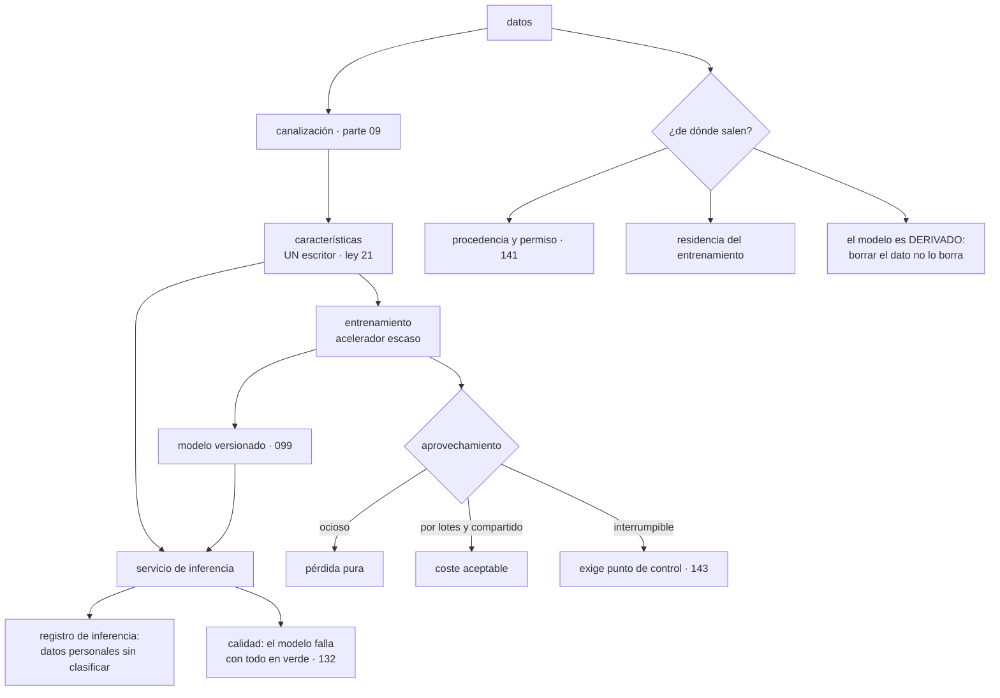

# 175 — Workloads de IA, GPU, datos y MLOps multi-cloud

> [← 174 · Arquitectura de seguridad cloud empresarial](../../part-14-advanced-platform-capstones-career/174-arquitectura-de-seguridad-cloud-empresarial/README.md) · [Índice de la parte](../README.md) · [176 · Edge, IoT y procesamiento desconectado →](../../part-14-advanced-platform-capstones-career/176-edge-iot-y-procesamiento-desconectado/README.md)

**Parte:** 14 — Plataformas avanzadas, capstones y carrera<br>
**Nivel:** experto-frontera · **Horas estimadas:** 4<br>
**Laboratorio:** `ai` · **Estado:** `EXECUTABLE_CORE`

## 🎯 Propósito

Tratar las cargas de aprendizaje automático como lo que son en términos de ingeniería: **una canalización de datos con un paso de cómputo caro pegado**. Casi todos sus problemas ya están resueltos en las partes 09 a 12; lo genuinamente nuevo son dos cosas: **la economía de un hardware escaso donde el tiempo ocioso es pérdida pura**, y **las preguntas sobre de dónde salen los datos**, que no tienen respuesta técnica. Y una tercera que conviene decir pronto: un modelo que responde mal tiene todas sus señales en verde.

## 📚 Resultados de aprendizaje

Al finalizar podrás:

1. **Situar** qué es nuevo y qué es la parte 09 con otro nombre.
2. **Aprovechar** un hardware escaso, donde el tiempo ocioso no se recupera.
3. **Responder** de dónde salen los datos y qué se puede hacer con ellos.
4. **Reconocer** las decisiones irreversibles y los dobles escritores propios de esta materia.
5. **Vigilar** la calidad de las respuestas, que ninguna señal técnica muestra.

## 🧩 Conceptos centrales

| Concepto | Comprensión verificable |
|---|---|
| `aprovechamiento del acelerador` | Proporción del tiempo contratado que el acelerador está calculando. Es la magnitud que decide el coste de estas cargas. |
| `punto de control` | Estado guardado que permite reanudar un entrenamiento. Sin él no se puede usar capacidad interrumpible. |
| `procedencia de los datos` | De dónde salió cada dato de entrenamiento y con qué permiso se usa. No es una propiedad técnica: es contractual y legal. |
| `desviación entre entrenamiento y servicio` | Que el cálculo de una característica difiera entre el entrenamiento y la inferencia. Es un problema de dos escritores. |
| `deriva` | Cambio en los datos de entrada o en la relación que el modelo aprendió. El sistema sigue funcionando y responde peor. |
| `registro de inferencia` | Lo que se guarda de cada petición al modelo. Suele contener datos personales que nadie clasificó. |

## 🧠 Modelo mental

El nivel experto no consiste en conocer más productos, sino en formular mejores preguntas, validar supuestos y sostener decisiones frente a costo, riesgo y operación.

Aplicado a esta clase, separa siempre cuatro planos: **intención** (qué necesita el usuario),
**configuración** (qué declaramos), **estado observado** (qué existe de verdad) y
**evidencia** (cómo sabemos que cumple). Confundirlos produce diseños que se ven correctos
en un diagrama pero fallan al operar.

## 🗺️ Flujo de razonamiento



## 📖 Desarrollo

### 1. Qué es nuevo y qué no

Conviene separar antes de empezar, porque la mayor parte del trabajo ya está hecha:

```text
LO QUE ES LA PARTE 09 CON OTRO NOMBRE
  ingesta y transformación de datos                       clase 112
  formatos columnares y particionado                      clase 112
  colas, reintentos e idempotencia                        clases 113, 116
  orquestación de procesos largos                         clase 119
  y el lago como sitio de las consultas no previstas

LO QUE ES LA PARTE 08 CON OTRO NOMBRE
  artefacto inmutable y versionado: el modelo lo es       clase 099
  despliegue escalonado y reversión                       clase 102
  y puertas en la canalización                            clase 100

LO QUE ES LA PARTE 12 CON OTRO NOMBRE
  contratos: el esquema de las características es uno     clase 153
  y la propiedad del dato                                 ley 21

LO GENUINAMENTE NUEVO
  1. la economía de un hardware escaso
  2. las preguntas sobre de dónde salen los datos
  3. que la calidad de la respuesta no se ve en ninguna señal técnica
```

Y conviene decir con claridad qué **no** cambia:

```text
un modelo desplegado es un artefacto: se versiona, se firma,
  se despliega escalonado y se revierte                   parte 08
una canalización de entrenamiento es un proceso por lotes
y un servicio de inferencia es un servicio: tiene objetivos,
  latencia, capacidad y guardia                           partes 10, 12
```

Y el error de tratarlo como algo aparte:

```text
equipos de datos con su propia canalización, su propia forma de
desplegar y su propia observabilidad
→ es la proliferación que la clase 148 desaconsejaba, con otro nombre
→ y produce modelos en producción sin objetivos, sin reversión
  y sin nadie de guardia
```

Y la observación de escala, que aquí es especialmente cierta:

```text
la parte cara y difícil de estas cargas no es el modelo:
son los datos y su movimiento                             clase 161
→ y por eso el cómputo va donde están los datos, y no al revés
```

### 2. Un hardware que no espera

El acelerador es escaso, caro y se paga por tiempo contratado, no por tiempo útil:

```text
el tiempo ocioso no se recupera
un acelerador reservado y sin trabajo cuesta lo mismo que uno
  al 100 %
```

Y de ahí que **el aprovechamiento sea la magnitud que decide el coste**:

```text
aprovechamiento típico sin gestión                       20-40 %
con cola y agrupación                                    70-85 %
→ la diferencia es un factor de dos o tres en la factura
```

Y lo que baja el aprovechamiento, por frecuencia:

```text
esperar datos: el acelerador calcula más rápido de lo que se le
  alimenta                                                ← la primera causa
trabajos que reservan y no empiezan
reservas «por si acaso» durante el día
experimentos manuales que dejan sesiones abiertas
y tamaños de lote que no llenan la memoria disponible
```

Y la primera merece énfasis: **muy a menudo el cuello de botella es el almacenamiento o la red, no el acelerador**, y se resuelve con formato, prelectura y colocación —clases 112 y 161—, no comprando más.

Las técnicas que lo suben, en orden:

```text
1. COLA DE TRABAJOS
   una cola con prioridades en vez de reservas por persona
   → nadie tiene un acelerador «suyo»

2. AGRUPACIÓN
   juntar peticiones o muestras para llenar el cálculo
   → en inferencia, es un traslado: más caudal y más latencia

3. COMPARTIR EL DISPOSITIVO
   repartir un acelerador entre varias cargas pequeñas
   → útil para inferencia y para desarrollo, no para entrenamientos grandes

4. CAPACIDAD INTERRUMPIBLE                                clase 143
   mucho más barata, y EXIGE punto de control
   → un entrenamiento que no puede reanudar no puede usarla

5. ALIMENTAR MEJOR
   formato columnar, prelectura, datos cerca              clases 112, 161
```

Y la cuarta tiene una consecuencia de diseño concreta:

```text
guardar estado cada N pasos, y poder reanudar desde ahí
→ y probarlo de verdad: reanudar sin haberlo ensayado no funciona
                                                          ley 22
```

Y **la capacidad**, que es la clase 129 en su forma más aguda:

```text
la cuota de aceleradores es escasa y por región
conseguir más tarda semanas, y a veces no se consigue
→ es de lo que «no escala solo»                           clase 129
→ y por eso es uno de los motivos legítimos para usar varios
  proveedores: capacidad exclusiva                        clase 157
```

Y el coste unitario, que es el lenguaje de la clase 172:

```text
coste por entrenamiento completo
coste por mil inferencias
→ y esta segunda suele dominar el coste unitario del producto
```

### 3. De dónde salen los datos

Aquí está lo que no tiene respuesta técnica y decide si una carga se puede poner en producción.

**Procedencia y permiso:**

```text
¿de dónde salió cada conjunto de datos?
¿con qué permiso se usa: contrato, consentimiento, licencia?
¿permite ese permiso entrenar un modelo, o solo prestar el servicio?
¿incluye datos de terceros que a su vez tienen sus propias condiciones?
¿y datos de clientes que no lo autorizaron?
```

Y la forma de responderlas es un inventario, no una intuición:

```text
por conjunto de datos
  origen, fecha, permiso que lo ampara y su vigencia
  categorías que contiene                                 clase 141
  y qué modelos se han entrenado con él
→ la última columna es la que casi nadie mantiene y la que hace falta
  cuando alguien pregunta
```

**La consecuencia incómoda**, que conviene entender bien:

```text
un modelo entrenado con unos datos es un DERIVADO de esos datos
→ borrar los datos de una persona no borra su influencia en el modelo
→ y volver a entrenar sin ellos cuesta lo que cuesta entrenar
```

Y las salidas prácticas, con su compromiso:

```text
no usar datos personales para entrenar, y usar agregados
  → lo más limpio, y a veces reduce la calidad
entrenar con datos seudonimizados y sin atributos identificativos
reentrenar con cadencia, de modo que la exclusión surta efecto
  en el siguiente ciclo, y decirlo así
y llevar el registro de qué modelo se entrenó con qué
```

**La residencia**, que es la clase 141 con un matiz nuevo:

```text
los datos de entrenamiento tienen residencia
y el modelo resultante, ¿también?
→ depende del marco y del contrato, y hay que preguntarlo,
  no suponerlo
y los registros de inferencia son datos nuevos, generados
  en el sitio donde se sirve
```

**Los registros de inferencia**, que son el problema silencioso:

```text
se guardan las entradas y las salidas «para mejorar el modelo»
y esas entradas contienen lo que el usuario escribió
→ que puede ser cualquier cosa: datos personales, secretos,
  información de terceros
→ y nadie los clasificó                                   clase 141
```

Y lo mínimo exigible:

```text
clasificarlos como cualquier otro dato
decidir retención, y que sea corta por defecto
depurar lo identificable antes de guardarlos               clase 122
y decir al usuario qué se guarda
```

### 4. Lo irreversible, los dos escritores y la calidad

**Decisiones que se toman al crear** —ley 14— y que después cuestan un reentrenamiento o una migración:

```text
qué características usa el modelo, y cómo se calculan
el esquema de los datos de entrenamiento
la partición de los conjuntos: entrenamiento, validación, prueba
  → si se hace mal, el modelo parece mejor de lo que es y no se sabrá
    hasta producción
la región donde vive el conjunto y donde se entrena
y el formato en que se guardan los datos históricos     clase 112
```

**El problema de los dos escritores** —ley 21— tiene aquí una forma propia y muy conocida:

```text
la característica «gasto medio de los últimos 30 días»
  se calcula de una forma en la canalización de entrenamiento
  y de otra en el servicio de inferencia
→ dos escritores del mismo concepto
→ el modelo aprende con una definición y responde con otra
→ y el efecto es una pérdida de calidad que no produce ningún error
```

Y la corrección es la misma que la clase 147 dio para los datos:

```text
UN SOLO SITIO QUE CALCULA CADA CARACTERÍSTICA
  y las dos partes lo consumen
→ es lo que hace un almacén de características, y su valor no está
  en el almacenamiento: está en tener un único escritor

y si no lo hay, la comprobación mínima:
  calcular la característica por los dos caminos sobre los mismos
  datos y comparar, de forma automática
```

**La calidad**, que es lo que ninguna señal técnica muestra:

```text
latencia                                        bien
errores                                         cero
saturación                                      normal
y el modelo lleva tres semanas recomendando mal
→ es la limitación que la clase 132 dejó escrita: el sistema
  funciona correctamente según todas sus señales y está mal
```

Y lo que sí lo detecta:

```text
DERIVA DE ENTRADA
  las distribuciones de entrada se alejan de las del entrenamiento
  → se detecta sin conocer el resultado, y es la primera línea

MÉTRICAS DE NEGOCIO
  proporción de recomendaciones aceptadas, de conversiones,
  de correcciones humanas
  → es la señal verdadera, y llega con retraso

MUESTREO Y REVISIÓN HUMANA
  un porcentaje de respuestas revisadas por personas
  → caro y es lo único que detecta ciertos fallos

COMPARACIÓN CON UNA REFERENCIA
  un modelo anterior o una regla sencilla ejecutados en paralelo
  → y comparar; es el tráfico en espejo de la clase 167
```

Y el despliegue, que es el de la parte 08 sin cambios:

```text
modelo versionado y firmado                              clase 099
escalonado con análisis, comparando contra el modelo actual  clase 102
interruptor para volver al anterior o a una regla         clase 105
y reversión que no requiera reentrenar
```

Y la lista de comprobación de la clase:

```text
☐ la canalización, el despliegue y la observabilidad son los comunes
☐ el modelo se versiona, se firma y se puede revertir
☐ el servicio de inferencia tiene objetivos, capacidad y guardia
☐ se mide el aprovechamiento del acelerador
☐ se ha comprobado si el cuello de botella son los datos y no el cálculo
☐ hay cola de trabajos en vez de reservas por persona
☐ los entrenamientos guardan punto de control y se ha probado reanudar
☐ existe inventario de conjuntos con origen, permiso y modelos derivados
☐ está decidido qué ocurre con un modelo cuando se borran datos
☐ los registros de inferencia están clasificados, depurados y con retención
☐ cada característica tiene un solo sitio donde se calcula
☐ hay comprobación de que entrenamiento y servicio coinciden
☐ se vigila deriva de entrada y al menos una métrica de negocio
☐ hay comparación contra una referencia o revisión humana muestreada
```

Y el cierre que enlaza con la clase siguiente: estas cargas suelen tener su origen en sensores y dispositivos que están lejos, con conectividad mala y volúmenes que no caben en ninguna red. Procesar donde se genera el dato y decidir qué viaja es la materia de la clase 176.

## 🔬 Ejemplo trabajado

**CloudShop tiene un modelo de recomendaciones en producción y dos equipos de datos que trabajan por su cuenta. El ejercicio empieza midiendo el aprovechamiento del hardware y termina con una pregunta legal que estuvo a punto de parar el producto.**

**El aprovechamiento.**

```text
aceleradores contratados                                       8
coste mensual                                            9.400 €
aprovechamiento medido                                      27 %
```

Y el desglose de lo que consumía el tiempo:

```text
calculando                                                  27 %
esperando datos                                             41 %   ← la primera
reservados sin trabajo                                      22 %
sesiones interactivas abiertas y ociosas                    10 %
```

Y las tres correcciones:

```text
ESPERANDO DATOS
  los datos se leían de ficheros JSON en otra región    clases 112, 161
  → columnar, comprimido y en la misma región
  tiempo de espera                                    41 % → 6 %

RESERVADOS SIN TRABAJO
  cada persona tenía «su» acelerador                    22 % → 3 %
  → cola con prioridades; nadie tiene uno asignado

SESIONES OCIOSAS
  → caducidad automática a los 60 min sin actividad     10 % → 1 %
```

```text                                          antes         después
aprovechamiento                                27 %           78 %
aceleradores necesarios                          8              3
coste mensual                               9.400 €        3.500 €
tiempo de espera en cola, mediana            0 (reservado)   11 min
quejas por esperar                              —          2 en 6 meses
```

**Tres aceleradores en lugar de ocho**, sin reducir el trabajo hecho.

Y la capacidad interrumpible, que exigió trabajo previo:

```text
entrenamientos que podían usar capacidad interrumpible
  antes    0 de 4   → ninguno guardaba estado
  después  4 de 4

trabajo   añadir punto de control cada 15 minutos
ensayo    retirar la capacidad a propósito                  ley 22
  primera vez   el punto de control se guardaba y no se sabía reanudar
                → 6 h de entrenamiento perdidas en la prueba
  tras corregir reanudación correcta, +9 min de coste

coste de los entrenamientos                    3.500 € → 1.400 €
```

**La pregunta legal.**

Durante una revisión de la clase 141 alguien preguntó de dónde salían los datos de entrenamiento:

```text
conjuntos usados                                               6
con origen documentado                                         2
con permiso comprobado                                         1

al reconstruirlo
  histórico de navegación de clientes        contrato lo permite    ✓
  histórico de compras                       contrato lo permite    ✓
  catálogo y descripciones                   propio                 ✓
  valoraciones de clientes                   contrato lo permite    ✓
  datos de un proveedor de terceros          LICENCIA NO PERMITE
                                             entrenar modelos       ✗
  datos de una empresa adquirida             consentimiento anterior
                                             no cubría este uso     ✗
```

**Dos de seis no se podían usar para entrenar.**

```text
acciones
  se retiraron los dos conjuntos
  se reentrenó sin ellos
  pérdida de calidad medida                     −3,1 % en aceptación
  → aceptada, frente al riesgo de usarlos
  y se renegoció la licencia del proveedor: ahora sí lo permite
    → se reincorporó 4 meses después

y lo que se montó para que no vuelva a ocurrir
  inventario por conjunto: origen, permiso, vigencia, categorías
  y qué modelos se entrenaron con él
  puerta en la canalización de entrenamiento: no se entrena con
    un conjunto sin permiso vigente registrado
  conjuntos bloqueados por esa puerta en 12 meses                3
```

**Los registros de inferencia.**

```text
qué se guardaba   la petición completa y la respuesta,
                  «para mejorar el modelo»
retención                                              indefinida
clasificación                                          ninguna
volumen acumulado                                          14 TB

al analizar una muestra                              clase 122
  peticiones con datos personales                            31 %
  peticiones con texto libre escrito por el usuario          19 %
    → y en ese texto: nombres, correos, en un caso un número
      de tarjeta
```

```text                                          antes         después
clasificación                                  ninguna     personal
retención                                    indefinida       30 días
depuración antes de guardar                     no             sí
texto libre                                  se guardaba   se guarda solo
                                                           si el usuario lo
                                                           autoriza
volumen                                        14 TB          410 GB
sujeto al borrado por solicitud                 no             sí  clase 141
```

**La desviación entre entrenamiento y servicio.**

Al comparar cómo se calculaban las características:

```text
características usadas por el modelo                          31
calculadas en dos sitios distintos                            31
con definición idéntica comprobada                             0

comparación automática sobre los mismos datos
  coinciden                                                   24
  DIFIEREN                                                     7
    → 3 por ventana temporal distinta (30 días naturales frente
      a 30 días móviles)
    → 2 por tratamiento de valores ausentes
    → 2 por redondeo
```

Y el efecto medido:

```text
al corregir las 7 y reentrenar
  aceptación de recomendaciones                      +4,8 %
```

**Casi cinco puntos de mejora sin tocar el modelo**, solo porque entrenamiento y servicio calculaban lo mismo de la misma manera.

```text                                          antes         después
sitios donde se calcula cada característica       2              1
comprobación automática de coincidencia          no             sí
diferencias detectadas después                    —          2 en 8 meses
```

**La calidad, y el mes que nadie vio.**

```text
mes 4   la aceptación de recomendaciones cae del 11,2 % al 7,4 %
        latencia                                          normal
        errores                                           cero
        saturación                                        normal
        alertas disparadas                                     0
        tiempo hasta que alguien lo notó                  23 días
        cómo se notó       una caída en las ventas cruzadas

causa   un cambio en el catálogo modificó la distribución de una
        característica; el modelo seguía respondiendo con confianza
```

Y lo que se montó después:

```text
deriva de entrada, por característica, con alerta          diaria
métrica de negocio en el panel del servicio, junto al objetivo
                                                          clase 125
modelo de referencia sencillo, ejecutado en paralelo sobre
  el 1 % del tráfico, y comparado
revisión humana muestreada                       50 respuestas/semana

repetición del mismo escenario, provocada
  tiempo hasta detectar                              23 días → 2 días
  qué lo detectó                     la deriva de entrada, no el negocio
```

**El despliegue, unificado con el resto.**

```text                                          antes         después
canalización                          propia del equipo   la común  clase 106
modelo versionado y firmado                     no             sí
despliegue escalonado                       todo de una vez  1-10-50-100 %
comparación contra el modelo actual             no             sí
interruptor para volver                         no             sí   clase 105
objetivos e indicadores del servicio            no             sí   clase 126
alguien de guardia                           el autor       equipo, rotatorio
```

**A los doce meses.**

```text                                          antes         después
aprovechamiento del acelerador                 27 %           78 %
aceleradores                                     8              3
coste mensual de entrenamiento               9.400 €        1.400 €
entrenamientos con punto de control            0 de 4         4 de 4
conjuntos con permiso documentado              1 de 6         6 de 6
conjuntos usados sin permiso                     2              0
registros de inferencia                       14 TB          410 GB
características con dos definiciones            31              0
aceptación de recomendaciones                 11,2 %         16,4 %
tiempo hasta detectar una caída de calidad    23 días         2 días
coste por mil inferencias                    0,84 €          0,31 €
```

**La lección que esta clase traslada a la parte 14**: el hardware caro estaba **el 41 % del tiempo esperando datos** —el cuello de botella no era el acelerador—, y arreglar el formato y la colocación permitió pasar de ocho aceleradores a tres. Y las dos mejoras de calidad no vinieron del modelo: **casi cinco puntos por hacer que entrenamiento y servicio calcularan las características de la misma forma**, y la detección de una caída de calidad que había durado veintitrés días con todas las señales técnicas en verde. Lo único que estuvo a punto de parar el producto no fue técnico: **dos de seis conjuntos de datos no se podían usar para entrenar**.

## 🧪 Laboratorio guiado

Ejecuta desde la raíz:

```bash
python classes/part-14-advanced-platform-capstones-career/175-workloads-de-ia-gpu-datos-y-mlops-multi-cloud/lab.py
```

El laboratorio selecciona el motor de práctica **`ai`** y produce
`lab_result.json`. El escenario, sus comprobaciones y el artefacto esperado corresponden a
esta clase; no requiere credenciales y deja explícito qué debe revalidarse en un sandbox real.

1. Lee `exercise.steps` y formula una predicción antes de ejecutar.
2. Ejecuta la práctica y verifica todos los elementos de `checks`.
3. Provoca el caso de `negative_test` y explica la señal observada.
4. Materializa `arquitectura-ia-cloud` en `evidence/` usando la plantilla indicada.
5. Para proveedor real, sigue `sandbox.requires`, registra costo y ejecuta `destroy`.

### Evidencia esperada

El artefacto principal es una arquitectura de IA con datos, cómputo, costo y seguridad. Además, la entrega debe incluir el comando ejecutado,
la salida estructurada y una conclusión que no exceda lo observado.

## 🏆 Reto verificable

Construye **`arquitectura-ia-cloud`** para el caso CloudShop. Incluye una alternativa descartada,
un supuesto que pueda falsarse, una prueba de fallo y una decisión de rollback.

## ✅ Criterio de aceptación

- [ ] `lab.py` termina con código 0 y genera JSON válido.
- [ ] La entrega conecta al menos tres requisitos con mecanismos verificables.
- [ ] Existe una prueba positiva y una prueba negativa con evidencia.
- [ ] Seguridad, costo y operación aparecen como decisiones, no como anexos.
- [ ] Se declara una limitación y una condición que obligaría a revisar el diseño.
- [ ] Otra persona puede repetir el recorrido sin conocimiento tácito.

## ⚠️ Errores frecuentes

| Síntoma | Causa probable | Corrección |
|---|---|---|
| El acelerador cuesta mucho y está la mayor parte del tiempo sin calcular | Espera datos, o está reservado por personas que no lo usan | Mide el desglose del tiempo; corrige formato y colocación de los datos, sustituye reservas por una cola y caduca las sesiones ociosas. |
| No se puede usar capacidad interrumpible para entrenar | El entrenamiento no guarda estado ni sabe reanudar | Punto de control periódico y ensayo real de retirada de capacidad. |
| Nadie sabe si se pueden usar los datos con los que se entrena | No hay inventario de origen y permiso | Inventario por conjunto con origen, permiso, vigencia y modelos derivados, y una puerta que impida entrenar sin él. |
| El modelo responde peor que en las pruebas | Desviación entre entrenamiento y servicio: la característica se calcula de dos formas | Un solo sitio que calcula cada característica, y comprobación automática de que ambos caminos coinciden. |
| La calidad cae durante semanas con todas las señales en verde | Ninguna señal técnica mide si la respuesta es buena | Deriva de entrada, métrica de negocio en el panel, modelo de referencia en paralelo y revisión humana muestreada. |
| Se acumulan teratabytes de peticiones con datos personales | Los registros de inferencia se guardan sin clasificar ni depurar | Clasifícalos, depura lo identificable, fija retención corta y sujétalos al proceso de borrado. |

## 🛡️ Seguridad, ética y costo

Trabaja con cuentas propias o sandboxes autorizados. No publiques secretos, identificadores
reales ni datos personales. Antes de crear recursos pagos define presupuesto, etiquetas y
comando de destrucción; después verifica que no queden recursos huérfanos. Los ejemplos
locales enseñan contratos, pero no certifican cumplimiento ni disponibilidad de producción.

## ❓ Preguntas de comprobación

1. ¿Qué parte de estas cargas es nueva y cuál son las partes 08 a 12 con otro nombre?
2. ¿Cuál suele ser la primera causa de bajo aprovechamiento del acelerador?
3. ¿Por qué borrar los datos de una persona no elimina su influencia en un modelo?
4. ¿Qué es la desviación entre entrenamiento y servicio y por qué es un problema de dos escritores?
5. ¿Qué señales detectan una caída de calidad que la latencia y los errores no muestran?

## 🔗 Referencias

- Sculley, D. y otros (2015). *Hidden technical debt in machine learning systems* — la mayor parte del sistema no es el modelo. <https://papers.nips.cc/paper/2015/hash/86df7dcfd896fcaf2674f757a2463eba-Abstract.html>
- Google Cloud (2025). *MLOps: continuous delivery and automation pipelines* — versionado de datos, características y modelos. <https://cloud.google.com/architecture/mlops-continuous-delivery-and-automation-pipelines-in-machine-learning>
- Feast (2025). *Feature store: training and serving consistency* — un solo cálculo por característica. <https://docs.feast.dev/>
- NVIDIA (2025). *GPU utilization, sharing and checkpointing* — aprovechamiento, reparto del dispositivo y reanudación. <https://docs.nvidia.com/datacenter/cloud-native/>
- ICO (2025). *AI and data protection: lawful basis and training data* — procedencia, permiso y derechos sobre datos usados para entrenar. <https://ico.org.uk/for-organisations/uk-gdpr-guidance-and-resources/artificial-intelligence/>
- Documentación oficial vigente del servicio implementado; registra URL y fecha de consulta.

---

> [Evaluación](assessment.md) · [Contrato de clase](lesson.yaml) · [Índice de la parte](../README.md)

**📥 Descargar:** [Parte 14 en PDF](../../../site/downloads/partes/manual-parte-14-advanced-platform-capstones-career.pdf) · [Manual integral](../../../site/downloads/multi-cloud-engineering-manual-v2.0.pdf)

| Anterior | Índice | Siguiente |
|---|---|---|
| [← 174 · Arquitectura de seguridad cloud empresarial](../../part-14-advanced-platform-capstones-career/174-arquitectura-de-seguridad-cloud-empresarial/README.md) | [Parte 14](../README.md) · [Programa](../../README.md) | [176 · Edge, IoT y procesamiento desconectado →](../../part-14-advanced-platform-capstones-career/176-edge-iot-y-procesamiento-desconectado/README.md) |
