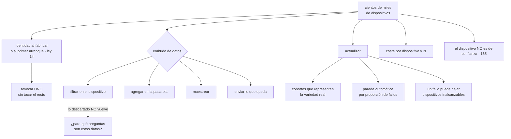

# 176 — Edge, IoT y procesamiento desconectado

> [← 175 · Workloads de IA, GPU, datos y MLOps multi-cloud](../../part-14-advanced-platform-capstones-career/175-workloads-de-ia-gpu-datos-y-mlops-multi-cloud/README.md) · [Índice de la parte](../README.md) · [177 · Soberanía digital y confidential computing →](../../part-14-advanced-platform-capstones-career/177-soberania-digital-y-confidential-computing/README.md)

**Parte:** 14 — Plataformas avanzadas, capstones y carrera<br>
**Nivel:** experto-frontera · **Horas estimadas:** 4<br>
**Laboratorio:** `edge` · **Estado:** `EXECUTABLE_CORE`

## 🎯 Propósito

Pasar de cientos de emplazamientos —la clase 165— a cientos de miles de dispositivos, donde **atender uno por uno deja de ser posible** y todo tiene que ser automático y estadístico. La clase se centra en lo que cambia con esa escala: cómo se le da identidad a un millón de cosas y cómo se le quita a una sola; **el embudo de datos**, porque el volumen se genera en el borde y casi todo sobra; la actualización por cohortes con parada automática, porque un fallo puede dejar dispositivos inalcanzables para siempre; y una aritmética que engaña, la de los costes por dispositivo que parecen ridículos hasta que se multiplican.

## 📚 Resultados de aprendizaje

Al finalizar podrás:

1. **Reconocer** qué cambia al pasar de cientos de sitios a cientos de miles de dispositivos.
2. **Dar** identidad a una flota y poder revocar la de uno solo.
3. **Diseñar** el embudo de datos sabiendo que descartar es irreversible.
4. **Actualizar** por cohortes, con parada automática y sin poder probarlo todo.
5. **Calcular** los costes que se multiplican por el número de dispositivos.

## 🧩 Conceptos centrales

| Concepto | Comprensión verificable |
|---|---|
| `escala estadística` | Régimen en el que las decisiones se toman sobre proporciones de la flota, porque atender a un dispositivo concreto no es viable. |
| `identidad de fabricación` | Credencial grabada en el dispositivo al fabricarlo. Es una decisión irreversible: dura lo que dura el dispositivo. |
| `embudo de datos` | Filtrado, agregación y muestreo antes de enviar. Lo descartado no vuelve, así que depende de qué preguntas se quieran responder. |
| `cohorte` | Subconjunto de la flota que recibe una actualización antes que el resto, elegido para que represente la variedad real. |
| `parada automática` | Detención del despliegue cuando la proporción de fallos supera un umbral, sin intervención humana. |
| `coste por dispositivo` | Céntimos que se multiplican por el tamaño de la flota. Es donde se pierde el control del gasto en estas cargas. |

## 🧠 Modelo mental

El nivel experto no consiste en conocer más productos, sino en formular mejores preguntas, validar supuestos y sostener decisiones frente a costo, riesgo y operación.

Aplicado a esta clase, separa siempre cuatro planos: **intención** (qué necesita el usuario),
**configuración** (qué declaramos), **estado observado** (qué existe de verdad) y
**evidencia** (cómo sabemos que cumple). Confundirlos produce diseños que se ven correctos
en un diagrama pero fallan al operar.

## 🗺️ Flujo de razonamiento



## 📖 Desarrollo

### 1. Qué cambia con la escala

La clase 165 trataba trescientas cuarenta tiendas. Con cuatrocientos mil dispositivos, cambian cinco cosas:

```text
ATENDER UNO DEJA DE SER VIABLE
  no hay nadie que mire un dispositivo concreto
  → todo se decide sobre PROPORCIONES de la flota
  → «el 0,3 % no reporta» es normal; «el 4 %» es un incidente

EL DISPOSITIVO ES BARATO Y LIMITADO
  poca memoria, poco cómputo, a veces sin sistema operativo completo
  → no cabe un agente de observabilidad ni casi nada de lo de la parte 10

DURA MUCHOS AÑOS
  cinco, diez, quince
  → sobrevive a los algoritmos de firma, a las versiones de protocolo
    y a las interfaces del proveedor

ES FÍSICAMENTE ACCESIBLE
  y en cantidades que hacen probable que alguien lo abra

Y EL COSTE SE MULTIPLICA
  céntimos por dispositivo y por mes son decenas de miles al año
```

Y la consecuencia de la primera, que reordena toda la operación:

```text
las alertas no son «este dispositivo falla»
sino «la proporción de dispositivos que no reportan ha subido»
→ y eso exige tener una línea base de lo normal            clase 174
```

Y la de la tercera, que es una decisión de creación y por tanto irreversible —ley 14—:

```text
lo que se decida ahora sobre identidad, protocolo y formato
seguirá vivo dentro de diez años, en dispositivos que nadie
puede sustituir
→ y hay que dejar sitio para cambiarlo: versión en el mensaje,
  posibilidad de rotar credenciales, y un mecanismo de
  actualización que funcione
```

Y la comprobación que conviene hacerse antes de nada, que es la de la clase 157 aplicada aquí:

```text
¿qué dispositivos necesitan de verdad estar conectados?
¿qué decisiones tienen que tomarse en el dispositivo?
¿qué datos hacen falta en el centro, y para responder qué?
→ y casi siempre la respuesta reduce mucho el problema
```

### 2. Identidad para un millón de cosas

Cada dispositivo necesita una identidad propia, y eso plantea tres preguntas distintas:

```text
1. ¿CUÁNDO SE LE DA?

   AL FABRICAR
     una credencial única grabada en el dispositivo
     + no hay ventana de dispositivos sin identidad
     − depende del fabricante y de su seguridad
     − y dura lo que dure el dispositivo                    ley 14

   AL PRIMER ARRANQUE
     el dispositivo se presenta con algo compartido y recibe la suya
     + independiente del fabricante
     − ese «algo compartido» está en todos: si se filtra, sirve para
       registrar dispositivos falsos
     − y hay que acotar la ventana: registro solo permitido una vez
       por número de serie

2. ¿CÓMO SE REVOCA UNA SOLA?
   un dispositivo robado o comprometido tiene que dejar de servir
   sin tocar a los demás
   → lista de revocación, o credenciales de vida corta que dejan
     de renovarse                                          clase 137
   → y la segunda escala mucho mejor

3. ¿QUÉ PUEDE HACER?
   un dispositivo debe poder escribir SUS datos y nada más
   → y eso lo comprueba el centro, no el dispositivo         clase 165
   → si un dispositivo comprometido puede escribir datos de otro,
     el diseño está mal
```

Y la segunda pregunta merece énfasis porque a esta escala tiene una forma propia:

```text
una lista de revocación con 400.000 entradas potenciales
es un problema en sí misma
→ por eso lo habitual es credencial de vida corta, renovada
  contra el centro
→ y revocar es dejar de renovar
→ con la consecuencia: un dispositivo desconectado mucho tiempo
  se queda sin credencial y hay que poder recuperarlo
```

Y una precaución sobre la duración, que es la tercera propiedad del apartado anterior:

```text
el dispositivo durará más que el algoritmo con el que se firmó
→ hay que poder cambiar de algoritmo y de credencial en campo
→ y si no se puede, la vida del dispositivo la fija la criptografía,
  no el hardware
```

Y el modelo de confianza, que es el de la clase 165 sin cambios:

```text
EL DISPOSITIVO NO ES DE CONFIANZA
  se valida en el centro lo que envía
  se acota lo que puede tocar
  y comprometer uno debe alcanzar solo a ese uno
```

### 3. El embudo de datos

El volumen se genera en el borde y casi todo sobra:

```text
400.000 dispositivos × 1 medición por segundo
= 400.000 mensajes/s
= 34.500 millones al día
```

Y enviarlo todo es inviable por tres motivos a la vez: enlace, coste de ingesta y coste de almacenar.

El embudo, con sus cuatro pasos y su efecto típico:

```text
1. FILTRAR EN EL DISPOSITIVO
   enviar solo cuando cambia, o cuando supera un umbral
   → reducción de 10 a 100 veces, y es la mayor con diferencia

2. AGREGAR EN UNA PASARELA
   una pasarela por tienda o por planta resume lo de sus dispositivos
   → medias, máximos, conteos por minuto
   → reducción adicional de 10 a 60 veces

3. MUESTREAR
   conservar el detalle de una parte y el agregado de todo
   → y conservar SIEMPRE lo anómalo                        clase 121

4. ENVIAR LO QUE QUEDA
```

Y la decisión que hay que tomar antes, porque **lo descartado no vuelve**:

```text
¿PARA QUÉ PREGUNTAS SON ESTOS DATOS?
  vigilancia en tiempo real        basta el agregado por minuto
  diagnóstico de una avería        hace falta detalle, de ese momento
  análisis histórico y modelos     hace falta muestra representativa
                                   y series largas                clase 175
  cumplimiento o prueba legal      hace falta el dato original
```

Y la técnica que reconcilia lo irreconciliable:

```text
GUARDAR EL DETALLE EN EL DISPOSITIVO O EN LA PASARELA, UNOS DÍAS
y enviarlo solo bajo demanda cuando haga falta investigar
→ el detalle existe donde se genera y no viaja salvo que se pida
→ es el equivalente de «no mover los datos» de la clase 161
```

Y dos precauciones del transporte, que son la parte 09 con peores redes:

```text
la cola local debe estar acotada y saber qué descartar    clase 165
los mensajes llevan número de secuencia del propio dispositivo
  → porque su reloj no es de fiar                          clase 149
  → y el orden se reconstruye con ese número, no con la hora
y la reconexión masiva necesita variación aleatoria       clase 165
```

Y el coste, que es donde estas cargas se descontrolan:

```text
coste por mensaje ingerido, por dispositivo y mes, y por gigabyte
parecen céntimos
× 400.000 dispositivos
→ y una decisión de enviar una medición más por minuto puede
  costar decenas de miles al año
```

Y de ahí la regla: **cada campo que se envía tiene un motivo escrito**, y se revisa.

### 4. Actualizar sin poder probarlo todo

La clase 165 estableció el modelo: el dispositivo tira, hay vigilante de arranque y se despliega por grupos. A esta escala se añaden tres cosas:

```text
NO SE PUEDE PROBAR TODA LA VARIEDAD
  versiones de hardware, revisiones de fabricante, versiones
  de firmware anteriores, condiciones de red y de temperatura
  → 400.000 dispositivos son decenas de combinaciones

LAS COHORTES DEBEN REPRESENTAR ESA VARIEDAD
  no vale «los primeros mil»: vale «mil elegidos para cubrir
  todas las combinaciones conocidas»

Y LA PARADA DEBE SER AUTOMÁTICA
  nadie puede vigilar un despliegue de tres días
  → «si la proporción de dispositivos que no completan supera
     el 1 %, se detiene»
```

Y el escalonado típico:

```text
cohorte 0   dispositivos de laboratorio, con todas las variantes
cohorte 1   0,1 % de la flota, representativa            24 h
cohorte 2   1 %                                          24 h
cohorte 3   10 %                                         48 h
cohorte 4   el resto, por lotes
```

Y las comprobaciones que decide cada etapa:

```text
proporción que completa la actualización
proporción que vuelve a reportar después
proporción que revierte por el vigilante
y las métricas propias del dispositivo: consumo, memoria, errores
```

Y el riesgo que no existe en la nube y que hay que aceptar por escrito:

```text
un dispositivo que no arranca puede quedar inalcanzable PARA SIEMPRE
  si no hay quien vaya, o si el coste de ir supera al del dispositivo
→ por eso el vigilante de arranque no es opcional
→ y por eso conviene mantener dos particiones: la nueva y la anterior
```

Y una precaución sobre el propio mecanismo de actualización:

```text
lo único que NUNCA debe romperse es la capacidad de actualizar
→ el componente que la implementa se toca lo mínimo posible
→ y sus cambios se despliegan con más cuidado que ningún otro
→ si se rompe, la flota queda congelada en la versión actual
```

**Lo que se vigila de una flota**, todo en proporciones:

```text
dispositivos que reportan, frente a los esperados
distribución de versiones, y cuántos llevan más de N meses sin actualizar
proporción que ha revertido en el último despliegue
latencia de mensajes, por percentil y por región
volumen enviado por dispositivo, y su tendencia
dispositivos que envían datos que no les corresponden
y coste por dispositivo y mes
```

Y la alerta que la ley 13 impone, en su forma estadística:

```text
no «este dispositivo dejó de reportar»
sino «la proporción que no reporta ha subido por encima de lo normal»
→ y el desglose por versión, región y modelo, que suele señalar
  la causa de inmediato
```

Y la lista de comprobación de la clase:

```text
☐ está escrito qué dispositivos necesitan estar conectados y para qué
☐ cada dispositivo tiene identidad propia, y está decidido cuándo se le da
☐ se puede revocar uno solo sin tocar a los demás
☐ un dispositivo solo puede escribir sus datos, y lo comprueba el centro
☐ se puede cambiar de algoritmo y de credencial en campo
☐ existe embudo de datos, y está escrito para qué preguntas sirve cada capa
☐ el detalle se conserva cerca del origen y viaja solo bajo demanda
☐ los mensajes llevan número de secuencia propio
☐ las colas locales están acotadas, con criterio de descarte
☐ la reconexión masiva tiene variación aleatoria y límite de caudal
☐ las cohortes representan la variedad real, no las primeras unidades
☐ hay parada automática por proporción de fallos
☐ hay vigilante de arranque y dos particiones
☐ el mecanismo de actualización se toca lo mínimo y con más cuidado
☐ las alertas son sobre proporciones, con línea base
☐ está calculado el coste por dispositivo y mes
☐ cada campo enviado tiene un motivo escrito
```

Y el cierre que enlaza con la clase siguiente: buena parte de las decisiones de esta clase y de la 165 —dónde vive el dato, quién puede verlo, quién opera el sistema— dejan de ser técnicas cuando aparecen exigencias de soberanía. Qué resuelven de verdad esas exigencias, y qué se vende bajo ese nombre, es la materia de la clase 177.

## 🔬 Ejemplo trabajado

**CloudShop instala 410.000 sensores en tiendas y almacenes: temperatura, presencia, peso en estantería y estado de los equipos de frío. El ejercicio empieza con una factura de ingesta que nadie esperaba y termina con una actualización detenida automáticamente en el 2 %.**

**El primer diseño, y su factura.**

```text
dispositivos                                             410.000
mensajes por dispositivo                              1 por segundo
mensajes al día                                      35.400 millones
tamaño medio del mensaje                                   180 B

coste mensual
  ingesta                                              41.000 €
  almacenamiento (90 días)                              6.200 €
  conectividad                                          8.900 €
                                                     ─────────
                                                       56.100 €
```

Y la pregunta del apartado tercero, hecha por primera vez:

```text
¿para qué preguntas son estos datos?
  vigilar que la cadena de frío no se rompa      agregado por minuto
  avisar de una avería                            evento, no serie
  analizar consumo y planificar                   serie por hora
  demostrar cumplimiento sanitario                 serie por 5 minutos,
                                                   conservada 2 años
  diagnosticar una avería concreta                 detalle por segundo,
                                                   de ESE equipo y ESE día
```

Y ninguna de las cinco necesitaba un mensaje por segundo de todos los dispositivos en el centro.

**El embudo, aplicado.**

```text
1. FILTRAR EN EL DISPOSITIVO
   enviar cuando el valor cambia más de un umbral, o cada 60 s
   mensajes                          35.400 M/día → 1.180 M/día
   reducción                                              ×30

2. AGREGAR EN PASARELA (una por tienda o planta)
   media, mínimo, máximo y conteo por minuto, por grupo de sensores
   mensajes                           1.180 M/día → 42 M/día
   reducción adicional                                    ×28

3. EVENTOS SIN AGREGAR
   cualquier lectura fuera de rango se envía entera y de inmediato
   mensajes                                          ~180.000/día

4. DETALLE, EN LA PASARELA
   7 días de detalle por segundo, en disco local
   se sube solo bajo demanda cuando hay que investigar
   peticiones de detalle al mes                              ~40
   volumen subido por esas peticiones                    ~11 GB/mes
```

```text                                          antes         después
mensajes al día                          35.400 M          42 M
coste de ingesta                          41.000 €       1.100 €
almacenamiento                             6.200 €         890 €
conectividad                               8.900 €       1.400 €
                                        ─────────      ────────
                                          56.100 €       3.390 €
```

Y lo que se conserva para cumplimiento, decidido aparte:

```text
serie por 5 minutos de los equipos de frío, 2 años
volumen                                                   1,4 TB
coste                                                     31 €/mes
en formato columnar y particionado                    clase 112
```

**La identidad.**

```text
primer diseño   una credencial compartida por modelo de dispositivo
                → 4 credenciales para 410.000 dispositivos

lo que eso permitía
  un dispositivo comprometido podía suplantar a cualquier otro
    del mismo modelo
  no se podía revocar uno solo
  y no se podía saber qué dispositivo envió qué
```

```text                                          antes         después
credenciales                                     4          410.000
cuándo se asigna                                 —      al primer arranque,
                                                        una vez por número
                                                        de serie
vida de la credencial                     indefinida        30 días,
                                                        renovada al conectar
revocar uno                                 imposible    dejar de renovar
un dispositivo puede escribir datos de otro     sí            no
  → comprobado en el centro                                clase 165
```

Y el problema de los desconectados, que apareció al mes:

```text
dispositivos que no conectaron en 30 días                    1.180
  → credencial caducada; no podían volver
causa    almacenes de temporada, cerrados fuera de campaña

corrección
  ventana de gracia: un dispositivo con credencial caducada
  menos de 180 días puede renovar presentando su identidad
  de fabricación, con registro y alerta
dispositivos recuperados así en 12 meses                     1.940
intentos rechazados por exceder los 180 días                    11
  → investigados uno a uno: 9 eran dispositivos retirados
```

**La actualización que se detuvo sola.**

```text
variedad de la flota
  modelos de hardware                                            6
  revisiones de fabricante                                      14
  versiones de firmware en campo                                 9
  combinaciones conocidas                                       31

cohorte 0    laboratorio, 62 dispositivos, las 31 combinaciones
cohorte 1    410 dispositivos (0,1 %), representativos     24 h
cohorte 2    4.100 (1 %)                                   24 h
cohorte 3    41.000 (10 %)                                 48 h
cohorte 4    el resto
```

Y lo que ocurrió en el segundo despliegue del año:

```text
cohorte 0    correcta
cohorte 1    correcta; 410 de 410 completan
cohorte 2    a las 6 h, 89 dispositivos no completan
             proporción                                    2,17 %
             umbral de parada                              1,00 %
             → DETENIDO AUTOMÁTICAMENTE

investigación
  los 89 eran de una revisión de fabricante concreta
  presente en el 0,4 % de la flota
  y solo 2 de esa revisión estaban en la cohorte 1
  → la cohorte 1 no la representaba bien

corrección
  las cohortes pasan a garantizar un mínimo de 20 unidades
  por combinación conocida
  y se corrigió el firmware para esa revisión

dispositivos que quedaron inservibles                             0
  → el vigilante de arranque revirtió los 89
```

**Ochenta y nueve dispositivos revertidos automáticamente** en vez de ocho mil ochocientos, que es lo que habría llegado si el despliegue hubiera seguido a la cohorte 3.

```text                                          antes         después
parada automática                             no había     1 % por cohorte
cohortes representativas                    primeras unidades  mínimo 20 por
                                                            combinación
vigilante de arranque                           sí             sí
dispositivos inservibles por actualización, histórico  41 → 0
```

Y una decisión que se tomó tras esto:

```text
el componente que gestiona la actualización se congeló
  cambios en 12 meses                                            1
  ese cambio se desplegó con cohortes de 10 unidades y 7 días
    entre etapas
motivo   si se rompe, la flota queda congelada y no hay forma
         de arreglarla a distancia
```

**La vigilancia en proporciones.**

```text
línea base, medida durante 6 semanas
  dispositivos que no reportan en 1 h                      0,4 %
  variación normal                                       ±0,15 %

alertas definidas
  proporción sin reportar > 1 %                          aviso
  proporción sin reportar > 3 %                          incidente
  y desglose automático por versión, modelo y región
```

Y las tres veces que saltó en un año:

```text
vez 1   4,1 % sin reportar; desglose: todos de una región
        → corte del operador de conectividad; nada que hacer
        → detectado 40 min antes de que el operador lo comunicara

vez 2   2,2 %; desglose: todos de una versión de firmware
        → una fuga de memoria que reiniciaba el dispositivo
        → corregida y desplegada por cohortes

vez 3   1,4 %; desglose: sin patrón
        → falsa alarma: coincidió con el cierre estacional de
          almacenes; la línea base no lo contemplaba
        → línea base ajustada por temporada
```

**El coste por dispositivo, vigilado.**

```text                                          antes         después
coste mensual total                        56.100 €        3.390 €
coste por dispositivo y mes                 0,137 €        0,0083 €
campos enviados por mensaje                     14              6
  → 8 se retiraron: nadie los consultaba en 90 días
revisión de campos enviados                  no había       semestral
```

Y el ejercicio de retirar campos dio la cifra más ilustrativa:

```text
un campo adicional de 8 bytes por mensaje
× 42 millones de mensajes al día
× 30 días
= 10 GB al mes
→ parece nada, y ocho campos así eran el 57 % del volumen
```

**A los doce meses.**

```text                                          antes         después
dispositivos                                 410.000       410.000
mensajes al día                            35.400 M          42 M
coste mensual                              56.100 €       3.390 €
coste por dispositivo y mes                 0,137 €       0,0083 €
credenciales                                     4        410.000
revocar un dispositivo                     imposible      inmediato
dispositivos que pueden suplantar a otros    todos              0
cohortes representativas                        no             sí
parada automática                               no             sí
dispositivos inservibles por actualización      41              0
alertas por proporción con línea base           no             sí
detección de un corte regional             por el operador   40 min antes
```

**La lección que esta clase traslada a la parte 14**: la factura inicial era de cincuenta y seis mil euros al mes **porque nadie había preguntado para qué preguntas servían los datos**; al responderlo, el 99,9 % de los mensajes dejó de viajar y el detalle se quedó a siete días de distancia, en la pasarela, disponible bajo demanda. Y la actualización que se detuvo sola en el 2 % lo hizo porque la cohorte de prueba **contenía dos unidades de una revisión que representaba al 0,4 % de la flota**: a esta escala no se puede probar todo, y por eso las cohortes se construyen para cubrir la variedad y la parada es automática.

## 🧪 Laboratorio guiado

Ejecuta desde la raíz:

```bash
python classes/part-14-advanced-platform-capstones-career/176-edge-iot-y-procesamiento-desconectado/lab.py
```

El laboratorio selecciona el motor de práctica **`edge`** y produce
`lab_result.json`. El escenario, sus comprobaciones y el artefacto esperado corresponden a
esta clase; no requiere credenciales y deja explícito qué debe revalidarse en un sandbox real.

1. Lee `exercise.steps` y formula una predicción antes de ejecutar.
2. Ejecuta la práctica y verifica todos los elementos de `checks`.
3. Provoca el caso de `negative_test` y explica la señal observada.
4. Materializa `arquitectura-edge` en `evidence/` usando la plantilla indicada.
5. Para proveedor real, sigue `sandbox.requires`, registra costo y ejecuta `destroy`.

### Evidencia esperada

El artefacto principal es un flujo edge que tolera desconexión y sincroniza estado. Además, la entrega debe incluir el comando ejecutado,
la salida estructurada y una conclusión que no exceda lo observado.

## 🏆 Reto verificable

Construye **`arquitectura-edge`** para el caso CloudShop. Incluye una alternativa descartada,
un supuesto que pueda falsarse, una prueba de fallo y una decisión de rollback.

## ✅ Criterio de aceptación

- [ ] `lab.py` termina con código 0 y genera JSON válido.
- [ ] La entrega conecta al menos tres requisitos con mecanismos verificables.
- [ ] Existe una prueba positiva y una prueba negativa con evidencia.
- [ ] Seguridad, costo y operación aparecen como decisiones, no como anexos.
- [ ] Se declara una limitación y una condición que obligaría a revisar el diseño.
- [ ] Otra persona puede repetir el recorrido sin conocimiento tácito.

## ⚠️ Errores frecuentes

| Síntoma | Causa probable | Corrección |
|---|---|---|
| La factura de ingesta es enorme desde el primer mes | Se envía todo lo que los dispositivos generan sin preguntarse para qué sirve | Escribe las preguntas que deben responderse y construye el embudo: filtrar, agregar, muestrear y conservar el detalle cerca del origen. |
| Un dispositivo comprometido puede suplantar a cualquier otro | Credenciales compartidas por modelo | Identidad propia por dispositivo, de vida corta y renovable, con comprobación en el centro de qué puede escribir cada uno. |
| Dispositivos que estuvieron mucho tiempo apagados no pueden volver | Su credencial caducó y no hay forma de renovarla | Ventana de gracia con la identidad de fabricación, con registro y alerta, y límite de tiempo. |
| Una actualización deja miles de dispositivos inservibles | Se desplegó sin cohortes representativas ni parada automática | Cohortes con un mínimo por combinación conocida, parada por proporción de fallos y vigilante de arranque con dos particiones. |
| El mecanismo de actualización deja de funcionar y la flota queda congelada | Se cambió como cualquier otro componente | Tócalo lo mínimo y despliega sus cambios con cohortes más pequeñas y más tiempo entre etapas que ningún otro. |
| Un campo pequeño añadido al mensaje dispara el coste | Se multiplica por el número de dispositivos y de mensajes | Cada campo con motivo escrito, revisión periódica de lo enviado y vigilancia del coste por dispositivo y mes. |

## 🛡️ Seguridad, ética y costo

Trabaja con cuentas propias o sandboxes autorizados. No publiques secretos, identificadores
reales ni datos personales. Antes de crear recursos pagos define presupuesto, etiquetas y
comando de destrucción; después verifica que no queden recursos huérfanos. Los ejemplos
locales enseñan contratos, pero no certifican cumplimiento ni disponibilidad de producción.

## ❓ Preguntas de comprobación

1. ¿Qué cinco cosas cambian al pasar de cientos de sitios a cientos de miles de dispositivos?
2. ¿Qué compromiso tiene dar la identidad al fabricar frente a darla al primer arranque?
3. ¿Por qué hay que decidir para qué preguntas sirven los datos antes de construir el embudo?
4. ¿Cómo se construye una cohorte y por qué no valen las primeras unidades?
5. ¿Por qué el componente de actualización merece un trato distinto a los demás?

## 🔗 Referencias

- AWS (2025). *IoT device provisioning and fleet management* — identidad por dispositivo y despliegue por cohortes. <https://docs.aws.amazon.com/iot/latest/developerguide/iot-provision.html>
- Azure (2025). *IoT Hub device provisioning service and device update* — registro, revocación y actualización escalonada. <https://learn.microsoft.com/azure/iot-dps/about-iot-dps>
- Google Cloud (2025). *Edge data processing patterns* — filtrar y agregar antes de enviar. <https://cloud.google.com/architecture/connected-devices>
- IETF (2025). *MQTT y CoAP: protocolos para dispositivos limitados* — transporte con recursos escasos. <https://datatracker.ietf.org/doc/html/rfc7252>
- NIST (2022). *IoT device cybersecurity guidance* — identidad, actualización y acceso físico. <https://csrc.nist.gov/pubs/ir/8259/final>
- Documentación oficial vigente del servicio implementado; registra URL y fecha de consulta.

---

> [Evaluación](assessment.md) · [Contrato de clase](lesson.yaml) · [Índice de la parte](../README.md)

| Anterior | Índice | Siguiente |
|---|---|---|
| [← 175 · Workloads de IA, GPU, datos y MLOps multi-cloud](../../part-14-advanced-platform-capstones-career/175-workloads-de-ia-gpu-datos-y-mlops-multi-cloud/README.md) | [Parte 14](../README.md) · [Programa](../../README.md) | [177 · Soberanía digital y confidential computing →](../../part-14-advanced-platform-capstones-career/177-soberania-digital-y-confidential-computing/README.md) |
