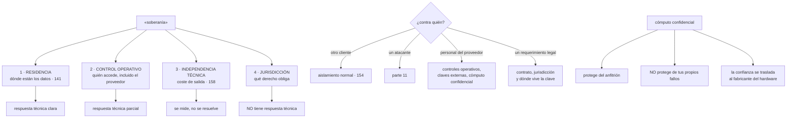

# 177 — Soberanía digital y confidential computing

> [← 176 · Edge, IoT y procesamiento desconectado](../../part-14-advanced-platform-capstones-career/176-edge-iot-y-procesamiento-desconectado/README.md) · [Índice de la parte](../README.md) · [178 · Capstone: descubrimiento y diseño →](../../part-14-advanced-platform-capstones-career/178-capstone-descubrimiento-y-diseno/README.md)

**Parte:** 14 — Plataformas avanzadas, capstones y carrera<br>
**Nivel:** experto-frontera · **Horas estimadas:** 4<br>
**Laboratorio:** `security` · **Estado:** `EXECUTABLE_CORE`

## 🎯 Propósito

Separar las cuatro exigencias distintas que se venden bajo una sola palabra —soberanía— y responder a cada una con lo que de verdad la resuelve. La clase sostiene que la mayoría de estas conversaciones **confunden un requisito de residencia con uno jurisdiccional**, que solo los dos primeros tienen respuesta técnica limpia, y que **el último no la tiene en absoluto**. Después trata con honestidad la tecnología que más se cita en estos casos —el cómputo con memoria cifrada y atestación—, diciendo qué protege, qué cuesta y contra qué no sirve.

## 📚 Resultados de aprendizaje

Al finalizar podrás:

1. **Separar** residencia, control operativo, independencia técnica y jurisdicción.
2. **Preguntar** contra quién se protege, antes de elegir ninguna solución.
3. **Situar** el cómputo confidencial por lo que hace y por lo que no hace.
4. **Ordenar** las opciones de gestión de claves por lo que dejan de poder hacer al proveedor.
5. **Responder** a un requisito de soberanía con evidencia, que es lo que casi siempre se pide de verdad.

## 🧩 Conceptos centrales

| Concepto | Comprensión verificable |
|---|---|
| `residencia` | Los datos permanecen en una geografía. Es la exigencia más citada y la que tiene respuesta técnica más clara. |
| `control operativo` | Quién puede acceder al sistema y desde dónde, incluido el personal del proveedor. |
| `independencia técnica` | Poder seguir funcionando sin el proveedor. Se mide como coste de salida, no como una propiedad binaria. |
| `jurisdicción` | Qué derecho puede obligar a entregar datos. Ningún control técnico la elimina; se acota con dónde vive la clave y quién la controla. |
| `cómputo confidencial` | Ejecución con la memoria cifrada y aislada del sistema anfitrión, con una prueba verificable de qué código se está ejecutando. |
| `atestación` | Prueba criptográfica de qué código y qué configuración se están ejecutando. Es la parte que aporta la garantía, y la que hay que usar. |

## 🧠 Modelo mental

El nivel experto no consiste en conocer más productos, sino en formular mejores preguntas, validar supuestos y sostener decisiones frente a costo, riesgo y operación.

Aplicado a esta clase, separa siempre cuatro planos: **intención** (qué necesita el usuario),
**configuración** (qué declaramos), **estado observado** (qué existe de verdad) y
**evidencia** (cómo sabemos que cumple). Confundirlos produce diseños que se ven correctos
en un diagrama pero fallan al operar.

## 🗺️ Flujo de razonamiento



## 📖 Desarrollo

### 1. Cuatro exigencias, no una

«Soberanía» se usa para cuatro cosas distintas, y confundirlas produce compras caras que no resuelven lo que preocupaba:

```text
1. RESIDENCIA
   los datos permanecen en una geografía
   → respuesta técnica clara: regiones, políticas, y comprobar
     registros, telemetría, copias y soporte             clase 141
   → es lo que más se pide y lo que más veces se incumple sin saberlo

2. CONTROL OPERATIVO
   quién puede acceder al sistema, incluido el personal del proveedor,
   desde dónde y con qué registro
   → respuesta técnica PARCIAL: aprobación de accesos, transparencia
     de acceso, personal local, y claves fuera del alcance del proveedor

3. INDEPENDENCIA TÉCNICA
   poder seguir funcionando sin el proveedor
   → no es binaria: es el coste de salida de la clase 158
   → y se responde con una cifra en semanas, no con una promesa

4. JURISDICCIÓN
   qué derecho puede obligar a entregar datos, y a quién
   → NO tiene respuesta técnica
   → se acota con dónde está constituida la entidad que opera,
     con el contrato y con quién controla la clave
```

Y la observación que ordena la clase:

```text
casi todas las conversaciones empiezan hablando de la 1
y lo que preocupa de verdad es la 4
→ o al revés: se compra por la 4 lo que solo resuelve la 1 y la 2
```

Y las preguntas que separan las cuatro, y que conviene hacer al principio:

```text
¿qué pasa si estos datos salen de este territorio?         → residencia
¿te preocupa que alguien del proveedor pueda leerlos?      → operativo
¿qué pasa si mañana no puedes usar este proveedor?         → independencia
¿te preocupa que un tribunal extranjero pueda exigirlos?   → jurisdicción
```

Y una precisión importante sobre la cuarta:

```text
si la entidad que opera está sujeta a un derecho, ese derecho
puede alcanzarla, esté donde estén los servidores
→ y por eso las ofertas «soberanas» se construyen sobre entidades
  locales, personal local y separación societaria
→ que son respuestas jurídicas y organizativas, no técnicas
```

Y lo único que sí acota técnicamente el alcance de un requerimiento:

```text
que el proveedor no pueda descifrar
→ y eso exige que la clave esté fuera de su alcance
→ que es el apartado tercero
```

### 2. Contra quién se protege

Antes de elegir tecnología, la pregunta de la clase 140:

```text
OTRO CLIENTE DEL PROVEEDOR
  → aislamiento normal; ya está resuelto                  clase 154
  → y es una preocupación legítima que casi nunca es la real

UN ATACANTE EXTERNO
  → toda la parte 11
  → el cómputo confidencial ayuda poco aquí: si el atacante
    compromete tu aplicación, esta descifra por él

UN ATACANTE QUE COMPROMETE AL PROVEEDOR
  → aquí sí ayudan las claves fuera de su alcance

PERSONAL DEL PROVEEDOR
  administradores, soporte, mantenimiento
  → controles operativos: aprobación de accesos, registro visible
    para el cliente, personal en una geografía concreta
  → y claves que el proveedor no puede usar

UN REQUERIMIENTO LEGAL AL PROVEEDOR
  → contrato, jurisdicción de la entidad, y de nuevo la clave
  → si el proveedor no puede descifrar, lo que entregue no sirve
```

Y la comprobación honesta que conviene hacerse:

```text
¿ha habido algún incidente real de la amenaza que nos preocupa?
¿qué probabilidad tiene frente a las que ya nos han ocurrido?
→ y comparar el coste de la solución con el de los riesgos
  que sí se han materializado                            clase 133
```

**Las opciones de gestión de claves**, ordenadas por lo que dejan de poder hacer al proveedor:

```text
CLAVES DEL PROVEEDOR
  el proveedor genera, guarda y usa la clave
  puede descifrar                                        sí

CLAVES GESTIONADAS POR EL CLIENTE                        clase 136
  el cliente controla la política y puede revocar
  la clave sigue en el servicio del proveedor
  puede descifrar mientras la política lo permita         sí
  aporta: control, auditoría y capacidad de revocar

CLAVE EXTERNA, FUERA DEL PROVEEDOR
  la clave vive en un sistema del cliente; el proveedor la pide
  para cada operación
  puede descifrar sin permiso del cliente                 no
  coste: latencia, disponibilidad del sistema de claves
         y un punto de fallo nuevo                        clase 136

CIFRADO EN EL CLIENTE
  el proveedor nunca ve el contenido
  puede descifrar                                         no
  coste: no se puede buscar, ordenar ni procesar en el proveedor
```

Y la observación práctica que suele decidir:

```text
las dos últimas resuelven la amenaza «el proveedor puede leer»
y hacen inviable casi todo lo que hace útil una nube: bases
gestionadas, análisis, búsqueda                          clase 158
→ por eso se aplican a CAMPOS o a CONJUNTOS concretos, no a todo
```

### 3. Cómputo confidencial, sin exageraciones

**Qué hace**, con precisión:

```text
la memoria del proceso está cifrada por el hardware
el sistema anfitrión y quien lo administra no pueden leerla
y la ATESTACIÓN produce una prueba criptográfica de qué código
  y qué configuración se están ejecutando
```

Y la segunda mitad es la que aporta la garantía y la que más se ignora:

```text
sin verificar la atestación, se está confiando igual que antes
→ la garantía no es «está cifrado»: es «puedo comprobar QUÉ se ejecuta»
→ y esa comprobación la tiene que hacer alguien, con una política
  de qué medidas acepta
```

**Qué no hace**, que es lo que hay que decir en voz alta:

```text
no protege de fallos de tu propio código
  una inyección o un permiso mal puesto funcionan igual dentro

no protege si tu aplicación descifra y luego lo registra          clase 122

no elimina la confianza: la traslada al fabricante del hardware
  y a su cadena de atestación

no resuelve la jurisdicción por sí solo
  si la clave la controla el proveedor, puede haber una vía

y no es gratis
  penalización de rendimiento, tipos de instancia limitados,
  disponibilidad desigual por región, y complejidad de operación
```

Y los usos donde sí resuelve algo que ninguna otra cosa resuelve:

```text
VARIAS PARTES QUE NO SE FÍAN ENTRE SÍ
  dos empresas quieren calcular algo sobre sus datos combinados
  sin enseñárselos
  → cada una comprueba la atestación antes de aportar su clave

PROCESAR DATOS QUE NO SE PUEDEN VER
  un tercero procesa datos del cliente sin poder leerlos

EXIGENCIA NORMATIVA EXPLÍCITA
  cuando una norma o un contrato lo pide, aunque el riesgo
  sea discutible

Y REDUCIR EL ALCANCE DE UN COMPROMISO DEL ANFITRIÓN
  en entornos compartidos con requisitos altos
```

Y el coste de adoptarlo, que hay que estimar antes:

```text
rendimiento                            penalización variable, medible
tipos de instancia disponibles         menos, y no en todas las regiones
servicios gestionados compatibles      pocos: se pierde parte de lo
                                       que hace útil la nube
atestación                             hay que verificarla, con política
                                       y con rotación de medidas
depuración y observabilidad            más difícil por diseño
y el modelo de amenazas debe ESCRIBIRSE, o no se sabrá qué se ganó
```

Y la comprobación que decide si merece la pena:

```text
¿qué amenaza concreta elimina, que no elimine algo más barato?
→ si la respuesta es «que el personal del proveedor lea la memoria»,
  hay que compararla con las amenazas que sí se han materializado
→ y si la respuesta es «lo exige el contrato», es una respuesta válida
  y conviene decirla así
```

### 4. Lo que casi siempre se pide de verdad

Al desmontar un requisito de soberanía, lo que suele quedar es esto:

```text
saber DÓNDE está cada dato, y poder demostrarlo
saber QUIÉN ha accedido, y poder demostrarlo
saber QUÉ pasaría si hubiera un requerimiento legal
y poder salir si hiciera falta, con una cifra
```

Y las cuatro son la clase 141 y la 158, no una tecnología nueva:

```text
DÓNDE                                                    clase 141
  inventario por categoría y por cliente
  incluidos registros, telemetría, copias y soporte
  política que restringe regiones                        clase 139
  y comprobación automática, no una declaración

QUIÉN                                                    clases 134, 141
  registro de auditoría inalterable y consultable
  incluido el acceso del personal del proveedor, si lo ofrece
  y correlación de identidades entre proveedores         clase 159

QUÉ PASARÍA
  qué entidad opera el servicio y bajo qué derecho
  qué se comprometería a notificar y en qué plazo
  y si el proveedor puede o no descifrar

SALIR
  coste de salida por carga, en semanas                  clase 158
```

Y la forma de responder que funciona con un cliente o un auditor:

```text
no «cumplimos con la soberanía»
sino
  «estos datos viven aquí, y esta consulta lo demuestra para
   cualquier fecha del último año»
  «estas personas y estos sistemas han accedido, y aquí está
   el registro»
  «esto es lo que el proveedor puede y no puede descifrar»
  «y salir de aquí nos costaría estas semanas»
```

Y las decisiones que sí conviene tomar, ordenadas por lo que aportan frente a lo que cuestan:

```text
1. RESIDENCIA COMPROBADA, incluidos registros y telemetría
   barato, y es lo que más veces se incumple sin saberlo

2. CLAVES GESTIONADAS POR EL CLIENTE, con revocación
   barato, y da control y auditoría                       clase 136

3. REGISTRO DE ACCESO DEL PROVEEDOR, si se ofrece
   barato, y responde a «quién»

4. CIFRADO EN EL CLIENTE PARA CAMPOS CONCRETOS
   caro en funcionalidad; se aplica a pocos campos

5. CLAVE EXTERNA
   caro en disponibilidad y latencia; resuelve la amenaza del
   proveedor que descifra

6. CÓMPUTO CONFIDENCIAL
   caro y limitado; resuelve casos concretos

7. OFERTA SOBERANA COMPLETA
   la más cara: menos servicios, más latencia y coste de salida
   mayor; se elige cuando lo exige una norma o un contrato
```

Y las preguntas que hay que hacerle a cualquier oferta soberana antes de firmarla:

```text
¿quién tiene acceso administrativo, y desde qué país?
¿qué ocurre ante un requerimiento legal, y a quién se notifica?
¿qué servicios NO están disponibles respecto de la región normal?
¿qué diferencia de latencia y de coste hay?
¿quién opera el hardware y bajo qué contrato?
¿y cuál es el coste de salida desde ahí?                  clase 158
```

Y la lista de comprobación de la clase:

```text
☐ están separadas las cuatro exigencias y se sabe cuál se pide
☐ está escrito contra quién se protege
☐ se ha comparado con las amenazas que sí se han materializado
☐ la residencia está comprobada, incluidos registros y telemetría
☐ hay claves gestionadas por el cliente con revocación
☐ se sabe qué puede y qué no puede descifrar el proveedor
☐ hay registro de acceso del proveedor, si se ofrece
☐ si hay cómputo confidencial, se verifica la atestación con política
☐ está escrito qué amenaza elimina y cuál no
☐ está estimado el coste de salida de la opción soberana
☐ la respuesta a un auditor es una consulta, no una afirmación
```

Y el cierre que enlaza con la clase siguiente: con esto termina el material de la parte 14. Las tres clases restantes son el proyecto final del programa: descubrir y diseñar, implementar y operar, y defender lo hecho. La primera es la materia de la clase 178.

## 🔬 Ejemplo trabajado

**Un cliente del sector público exige a CloudShop «una solución soberana». El ejercicio consiste en averiguar qué pide exactamente, y termina con tres decisiones baratas y una compra descartada.**

**La conversación inicial y las cuatro preguntas.**

```text
lo que decía el pliego
  «los datos deberán alojarse en infraestructura soberana,
   con garantías de que no puedan ser accedidos por terceros
   ni por autoridades extranjeras»

las cuatro preguntas, hechas en una reunión de una hora

  ¿qué pasa si estos datos salen del país?
    → incumplimiento del pliego; el contrato se anula
    → RESIDENCIA: exigencia real y dura

  ¿os preocupa que alguien del proveedor pueda leerlos?
    → «no habíamos pensado en eso, pero sí»
    → CONTROL OPERATIVO: preocupación real, sin requisito escrito

  ¿qué pasa si mañana no podemos usar este proveedor?
    → «tendríais que seguir prestando el servicio»
    → INDEPENDENCIA: requisito de continuidad, no de tecnología

  ¿os preocupa un requerimiento de un tribunal extranjero?
    → «es lo que motivó el párrafo»
    → JURISDICCIÓN: la exigencia de fondo
```

**La cuarta era la que importaba**, y el pliego la había escrito como si fuera la primera.

**Lo que se ofreció, por capas.**

```text
RESIDENCIA
  región del país, ya disponible
  comprobación de los nueve destinos                     clase 141
    → 3 incumplían: telemetría, registros y el proveedor de correo
  corregidos: coste adicional                            +180 €/mes
  y comprobación automática semanal, con evidencia consultable

CONTROL OPERATIVO
  claves gestionadas por el cliente, con revocación      clase 136
  registro de acceso del personal del proveedor, activado
  → y una consulta que el cliente puede ejecutar por su cuenta
  coste adicional                                        +40 €/mes

INDEPENDENCIA
  coste de salida de esa carga, estimado                 clase 158
    9 semanas y ~1.200 € de transferencia
  documentado en el contrato, con revisión anual

JURISDICCIÓN
  → aquí no había respuesta técnica completa
```

**La cuarta, tratada con honestidad.**

```text
lo que se puede afirmar
  el proveedor no puede descifrar si la clave está fuera de su alcance
  la entidad que opera está sujeta a un derecho concreto
  y el contrato fija qué se notifica y en qué plazo

lo que NO se puede afirmar
  que ningún derecho pueda alcanzar nunca a ninguna de las partes
```

Y las tres opciones evaluadas para esa exigencia:

```text
A · CLAVE EXTERNA, en un sistema del cliente
    el proveedor no puede descifrar sin una llamada al cliente
    coste            +2.100 €/mes y un punto de fallo nuevo
    latencia         +8 ms por operación con datos cifrados
    disponibilidad   la del sistema de claves del cliente
                     → si cae, el servicio no funciona

B · CIFRADO EN EL CLIENTE, campos concretos
    5 campos identificativos, cifrados antes de salir
    coste            desarrollo, 3 semanas
    consecuencia     esos campos no se pueden buscar ni ordenar
                     → 2 informes hubo que rehacerlos

C · OFERTA SOBERANA COMPLETA del proveedor
    entidad local, personal local, separación
    coste            +180 % sobre el precio de la región normal
    servicios no disponibles          14 de los 31 que usábamos
    latencia                          +22 ms
    coste de salida desde ahí         estimado 6 meses
```

Y la decisión, tomada con el cliente delante:

```text
se eligieron A parcial + B
  A solo para el conjunto de datos identificativos, no para todo
  B para los 5 campos que el pliego menciona expresamente

se descartó C
  motivo escrito: los 14 servicios ausentes obligaban a construir
  a mano lo que ya funcionaba, con más riesgo operativo que el
  que se pretendía evitar

y se documentó lo que NO se garantiza
  → y el cliente lo aceptó por escrito, que es lo que permitió firmar
```

**El cómputo confidencial, evaluado y descartado.**

El equipo comercial lo propuso como argumento. La evaluación:

```text
¿qué amenaza elimina?
  que el personal del proveedor lea la memoria del proceso

¿está esa amenaza en el modelo del cliente?
  sí, era la preocupación número dos

¿qué la elimina más barato?
  el cifrado en el cliente para los campos sensibles ya la elimina
  para esos datos                                       (opción B)

¿qué añadiría el cómputo confidencial?
  proteger también los datos NO cifrados en cliente mientras
  se procesan

¿qué cuesta?
  penalización de rendimiento medida                       −14 %
  tipos de instancia disponibles en esa región              2 de 9
  servicios gestionados compatibles                         3 de 11
  verificación de atestación                       a construir, 4 semanas
  y rotación de medidas al actualizar                trabajo permanente
```

Y la decisión:

```text
no se adoptó
motivo escrito   la amenaza que elimina de más está cubierta por B
                 para los datos que la exigencia menciona
revisar si       aparece un requisito explícito, o si se procesan
                 datos que no se pueden cifrar en cliente porque
                 hay que buscarlos o agregarlos
```

Y un uso donde sí se adoptó, dos años después:

```text
tres empresas del sector quisieron calcular una estadística
conjunta sin enseñarse los datos
→ cada una verifica la atestación antes de aportar su clave
→ es el caso en que ninguna otra tecnología lo resuelve
```

**La respuesta al auditor.**

La auditoría del cliente llegó nueve meses después:

```text
pregunta   «demuestren que los datos no han salido del país
            en los últimos 12 meses»

respuesta antes de este trabajo
  una declaración firmada y capturas de la consola

respuesta ahora
  una consulta sobre el registro de configuración y el de auditoría
  ejecutada delante del auditor
  cubriendo los nueve destinos, día a día
  tiempo empleado                                          6 min
  observaciones del auditor                                    0
```

Y la segunda pregunta, que fue la difícil:

```text
pregunta   «¿puede el proveedor acceder a estos datos?»

respuesta
  «a los cinco campos que su pliego señala, no: están cifrados
   antes de salir de nuestros sistemas y la clave no sale de aquí»
  «al resto, técnicamente sí podría con una orden judicial dirigida
   a la entidad que opera, que está sujeta a este derecho; el contrato
   obliga a notificárnoslo salvo prohibición legal»
  «y aquí está el registro de accesos de su personal de los últimos
   12 meses: 4 accesos, todos con aprobación previa nuestra»
```

Y la valoración que el auditor anotó fue que **la respuesta era verificable**, que era lo que el pliego perseguía sin saber expresarlo.

**Los tres incumplimientos de residencia que nadie sabía.**

```text
al comprobar los nueve destinos                        clase 141
  telemetría                    región distinta          ✗
  registros de aplicación       región distinta          ✗
  proveedor de correo           procesaba fuera          ✗
  datos principales             correcto                 ✓
  copias                        correcto                 ✓
  réplicas                      correcto                 ✓
  entorno de pruebas            correcto                 ✓
  caché de borde                sin datos de cliente     ✓
  soporte del proveedor         documentado              ✓
```

Y el coste de corregir los tres: **ciento ochenta euros al mes**, frente a los más de veinte mil que habría costado la opción soberana completa.

**El recuento.**

```text                                          antes         después
exigencias separadas                             0              4
contra quién se protege, escrito                 no             sí
incumplimientos de residencia                     3              0
comprobación automática de residencia            no          semanal
claves gestionadas por el cliente                no             sí
registro de acceso del proveedor                 no             sí
campos cifrados en cliente                        0              5
coste adicional mensual                          —          2.320 €
coste de la opción soberana completa             —      ~21.000 €/mes
tiempo de responder a una auditoría         días de trabajo    6 min
lo que no se garantiza, escrito                  no             sí
```

**La lección que esta clase traslada a la parte 14**: el pliego pedía «infraestructura soberana» y lo que de verdad preocupaba era la jurisdicción, que **no tiene respuesta técnica**; separarlo en cuatro exigencias permitió responder a tres con dos mil trescientos euros al mes en lugar de veintiún mil. Y de todo el trabajo, lo que satisfizo al auditor no fue ninguna tecnología: fue **poder ejecutar delante de él una consulta que demostraba dónde había estado cada dato cada día del último año**, y decir con precisión qué no se garantizaba.

## 🧪 Laboratorio guiado

Ejecuta desde la raíz:

```bash
python classes/part-14-advanced-platform-capstones-career/177-soberania-digital-y-confidential-computing/lab.py
```

El laboratorio selecciona el motor de práctica **`security`** y produce
`lab_result.json`. El escenario, sus comprobaciones y el artefacto esperado corresponden a
esta clase; no requiere credenciales y deja explícito qué debe revalidarse en un sandbox real.

1. Lee `exercise.steps` y formula una predicción antes de ejecutar.
2. Ejecuta la práctica y verifica todos los elementos de `checks`.
3. Provoca el caso de `negative_test` y explica la señal observada.
4. Materializa `decision-soberania` en `evidence/` usando la plantilla indicada.
5. Para proveedor real, sigue `sandbox.requires`, registra costo y ejecuta `destroy`.

### Evidencia esperada

El artefacto principal es un control con amenaza, mitigación y evidencia. Además, la entrega debe incluir el comando ejecutado,
la salida estructurada y una conclusión que no exceda lo observado.

## 🏆 Reto verificable

Construye **`decision-soberania`** para el caso CloudShop. Incluye una alternativa descartada,
un supuesto que pueda falsarse, una prueba de fallo y una decisión de rollback.

## ✅ Criterio de aceptación

- [ ] `lab.py` termina con código 0 y genera JSON válido.
- [ ] La entrega conecta al menos tres requisitos con mecanismos verificables.
- [ ] Existe una prueba positiva y una prueba negativa con evidencia.
- [ ] Seguridad, costo y operación aparecen como decisiones, no como anexos.
- [ ] Se declara una limitación y una condición que obligaría a revisar el diseño.
- [ ] Otra persona puede repetir el recorrido sin conocimiento tácito.

## ⚠️ Errores frecuentes

| Síntoma | Causa probable | Corrección |
|---|---|---|
| Se compra una oferta soberana y el requisito seguía sin cumplirse | Se confundieron residencia y jurisdicción, que son exigencias distintas | Separa las cuatro con las cuatro preguntas y responde a cada una con lo que la resuelve. |
| Se adopta cómputo confidencial sin saber qué amenaza elimina | No se escribió el modelo de amenazas | Escribe contra quién se protege, comprueba si algo más barato ya lo cubre y estima el coste en rendimiento, servicios disponibles y operación. |
| Se usa cómputo confidencial y no se verifica la atestación | Se supone que basta con que la memoria esté cifrada | La garantía es poder comprobar qué código se ejecuta: verifica la atestación con una política de medidas aceptadas y rótala al actualizar. |
| Los datos cumplen residencia y los registros y la telemetría no | Solo se comprobó el almacenamiento principal | Comprueba los nueve destinos y automatiza la comprobación con evidencia consultable. |
| Cifrar en el cliente rompe informes y búsquedas | Se aplicó a más campos de los necesarios | Aplícalo a los campos que la exigencia menciona y deja el resto con claves gestionadas por el cliente. |
| No se puede responder a un auditor sin días de trabajo | La respuesta es una declaración y no una consulta | Construye la evidencia como subproducto de la operación y ejecútala delante; y escribe también lo que no se garantiza. |

## 🛡️ Seguridad, ética y costo

Trabaja con cuentas propias o sandboxes autorizados. No publiques secretos, identificadores
reales ni datos personales. Antes de crear recursos pagos define presupuesto, etiquetas y
comando de destrucción; después verifica que no queden recursos huérfanos. Los ejemplos
locales enseñan contratos, pero no certifican cumplimiento ni disponibilidad de producción.

## ❓ Preguntas de comprobación

1. ¿Cuáles son las cuatro exigencias que se agrupan bajo la palabra soberanía y cuál no tiene respuesta técnica?
2. ¿Qué opciones de gestión de claves impiden que el proveedor descifre, y qué cuestan?
3. ¿Qué aporta la atestación y por qué sin ella el cómputo confidencial cambia poco?
4. ¿Contra qué amenazas no protege el cómputo confidencial?
5. ¿Qué se pide realmente en la mayoría de los requisitos de soberanía?

## 🔗 Referencias

- Confidential Computing Consortium (2025). *A technical analysis of confidential computing* — qué protege y qué no. <https://confidentialcomputing.io/resources/white-papers-reports/>
- IETF (2023). *RFC 9334: Remote attestation procedures architecture* — verificación de qué código se ejecuta. <https://www.rfc-editor.org/rfc/rfc9334.html>
- Google Cloud (2025). *Sovereign controls and external key management* — residencia, control operativo y claves externas. <https://cloud.google.com/sovereign-cloud>
- Microsoft (2025). *Sovereignty and access transparency* — registro de acceso del personal del proveedor. <https://learn.microsoft.com/azure/cloud-adoption-framework/scenarios/cloud-for-sovereignty/>
- ENISA (2025). *Cloud sovereignty: technical and legal dimensions* — separación de exigencias técnicas y jurídicas. <https://www.enisa.europa.eu/publications>
- Documentación oficial vigente del servicio implementado; registra URL y fecha de consulta.

---

> [Evaluación](assessment.md) · [Contrato de clase](lesson.yaml) · [Índice de la parte](../README.md)

| Anterior | Índice | Siguiente |
|---|---|---|
| [← 176 · Edge, IoT y procesamiento desconectado](../../part-14-advanced-platform-capstones-career/176-edge-iot-y-procesamiento-desconectado/README.md) | [Parte 14](../README.md) · [Programa](../../README.md) | [178 · Capstone: descubrimiento y diseño →](../../part-14-advanced-platform-capstones-career/178-capstone-descubrimiento-y-diseno/README.md) |
