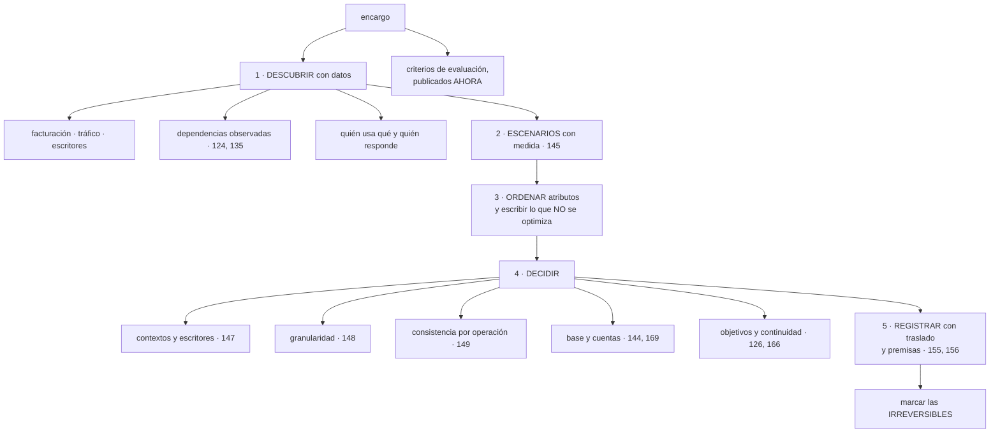

# 178 — Capstone: descubrimiento y diseño

> [← 177 · Soberanía digital y confidential computing](../../part-14-advanced-platform-capstones-career/177-soberania-digital-y-confidential-computing/README.md) · [Índice de la parte](../README.md) · [179 · Capstone: implementación y operación →](../../part-14-advanced-platform-capstones-career/179-capstone-implementacion-y-operacion/README.md)

**Parte:** 14 — Plataformas avanzadas, capstones y carrera<br>
**Nivel:** experto-frontera · **Horas estimadas:** 8<br>
**Laboratorio:** `capstone` · **Estado:** `EXECUTABLE_CORE`

## 🎯 Propósito

Empezar el proyecto que cierra el programa, y empezarlo por donde se empieza de verdad: **descubriendo lo que hay y escribiendo las decisiones antes de construir nada**. La clase da el encargo, el método de descubrimiento en el orden que evita rehacer trabajo, la lista de lo que hay que entregar como diseño y —lo más importante— **los criterios con los que se va a juzgar**, que se publican ahora y no al final, porque un diseño que no sabe cómo lo van a evaluar se defiende mal y se hace peor.

## 📚 Resultados de aprendizaje

Al finalizar podrás:

1. **Recoger** lo que existe con datos y no con documentación.
2. **Escribir** escenarios de calidad con medida antes de decidir nada.
3. **Producir** las decisiones de diseño con su traslado y sus premisas.
4. **Reconocer** cuáles de esas decisiones serán irreversibles.
5. **Conocer** los criterios de evaluación desde el principio.

## 🧩 Conceptos centrales

| Concepto | Comprensión verificable |
|---|---|
| `descubrimiento` | Averiguar qué existe realmente, con facturación, tráfico y registros, no con inventarios ni diagramas. |
| `escenario de calidad` | Exigencia escrita con origen, estímulo, entorno, respuesta y medida. Es lo que permite decidir. |
| `registro de decisión` | Documento corto con opciones, traslado, prioridad, premisas y qué haría revisarla. |
| `decisión irreversible` | La que después cuesta una migración: propiedad de los datos, particionado, identidad, jerarquía y colocación. |
| `criterio de evaluación` | Lo que se va a mirar al juzgar el trabajo. Publicado antes de empezar, cambia cómo se hace. |
| `alcance declarado` | Lo que el proyecto sí hace y lo que explícitamente no hace, escrito antes de construir. |

## 🧠 Modelo mental

El nivel experto no consiste en conocer más productos, sino en formular mejores preguntas, validar supuestos y sostener decisiones frente a costo, riesgo y operación.

Aplicado a esta clase, separa siempre cuatro planos: **intención** (qué necesita el usuario),
**configuración** (qué declaramos), **estado observado** (qué existe de verdad) y
**evidencia** (cómo sabemos que cumple). Confundirlos produce diseños que se ven correctos
en un diagrama pero fallan al operar.

## 🗺️ Flujo de razonamiento



## 📖 Desarrollo

### 1. El encargo

El proyecto consiste en tomar un sistema real —el propio, uno de trabajo o el caso que este programa ha usado— y llevarlo desde donde está hasta un estado que se pueda defender. Y el encargo se enuncia así:

```text
un sistema con usuarios reales o realistas
con una exigencia de negocio concreta que justifique el trabajo
con restricciones de presupuesto y de equipo declaradas
y con un plazo
```

Y lo que hay que producir en esta primera fase:

```text
1. el retrato de lo que existe, con datos
2. los escenarios de calidad, con medida
3. el orden de atributos y lo que NO se optimiza
4. las decisiones de diseño, con su traslado
5. la lista de las que serán irreversibles
6. y el alcance declarado: qué hace y qué no hace este proyecto
```

Y una advertencia sobre el tamaño, porque es el error más común en un proyecto de cierre:

```text
un alcance grande produce un trabajo superficial
un alcance pequeño y llevado hasta el final produce un trabajo
  que se puede defender
→ mejor un flujo de negocio completo, de extremo a extremo,
  que quince a medias
```

Y el criterio para elegir el alcance:

```text
que incluya al menos un dato con más de un consumidor            ley 21
que tenga una operación que no se pueda perder
que cruce al menos una frontera de servicio
que tenga usuarios cuya experiencia se pueda medir
y que quepa en el plazo
```

**Los criterios de evaluación, publicados ahora.** Se juzgará:

```text
1. ¿Está el descubrimiento hecho con datos, no con documentación?
2. ¿Hay escenarios con medida, y se usan para decidir?
3. ¿Cada decisión dice qué mejora y qué empeora, con cifras?
4. ¿Están identificadas las decisiones irreversibles?
5. ¿Está escrito lo que NO se hace, y por qué?
6. ¿Se han ejecutado las pruebas negativas, y qué encontraron?
7. ¿Las cifras del antes y el después son medidas o estimadas?
8. ¿Qué se descubrió que estaba mal y no se sabía?
```

Y el octavo es el que más peso tiene, por un motivo que este programa ha demostrado catorce veces: **casi todo el valor de estos ejercicios está en lo que aparece al mirar, no en lo que se construye después**.

### 2. Descubrir con datos

La primera regla es la que este programa ha comprobado tres veces:

```text
el inventario documentado NUNCA coincide con la realidad
  dependencias documentadas 23, observadas 41           clase 124
  conexiones documentadas 23, observadas 58             clase 135
  cuentas documentadas 14, existentes 23                clase 139
```

Y el orden en que hay que recoger, porque cada paso depende del anterior:

```text
1. QUÉ EXISTE
   de la facturación, no del inventario                  clase 139
   y de lo que consume red o genera tráfico

2. QUIÉN LO USA
   tráfico observado y registros de acceso
   → y lo que no recibe tráfico en 90 días es candidato a retirar
                                                        clase 167

3. DE QUÉ DEPENDE
   conexiones observadas durante semanas                 clase 135
   trazas agregadas para el grafo real                   clase 124
   y llamadas salientes a terceros

4. QUIÉN ESCRIBE CADA DATO           ← el más importante
   del registro de auditoría y del esquema               ley 21
   → una tabla con más de un escritor es el acoplamiento real

5. QUÉ DATOS HAY Y DE QUÉ CATEGORÍA
   volumen, crecimiento y clasificación                  clase 141

6. QUIÉN RESPONDE DE CADA COSA
   → y lo que no tenga dueño es el primer hallazgo        ley 20

7. CÓMO SE ENTERAN HOY DE QUE ALGO VA MAL
   → la cuenta de la clase 120: de N problemas, cuántos por alerta
```

Y las cifras que conviene tener antes de diseñar nada:

```text
coste mensual, y coste por unidad de negocio             clase 142
latencia por percentil, medida en el borde               clase 126
disponibilidad observada, y su techo por dependencias
fronteras que cruza una operación típica                 clase 152
llamadas de red por operación
tablas con más de un escritor                            clase 147
alcance desde cada punto de entrada                      clase 133
permisos concedidos y no usados                          clase 134
y el plazo de recuperación medido, no el declarado       clase 166
```

Y una regla sobre el tiempo: **el descubrimiento tarda más de lo que nadie planifica**, y recortarlo produce las sorpresas de la clase 167. Conviene reservarle una parte real del plazo y observar las dependencias durante semanas, no días.

### 3. Decidir, y dejar constancia

Con el retrato hecho, el orden de las decisiones importa porque unas condicionan a otras:

```text
1. ESCENARIOS Y ATRIBUTOS                                clase 145
   de 5 a 12 escenarios con medida
   tres atributos que ganan cuando hay conflicto
   y lo que NO se optimiza, escrito

2. CONTEXTOS Y ESCRITORES                                clase 147
   dónde cambian los significados
   un solo escritor por dato
   → y esta decisión condiciona todas las siguientes

3. CONSISTENCIA POR OPERACIÓN                            clase 149
   qué cuesta una lectura desfasada, operación por operación

4. GRANULARIDAD                                          clase 148
   cuántas unidades desplegables, con el motivo de cada frontera
   → y con la restricción del tamaño del equipo             clase 145

5. BASE Y CUENTAS                                        clases 144, 169
   estructura, controles preventivos, identidad, red

6. OBJETIVOS Y CONTINUIDAD                               clases 126, 166
   indicadores, objetivos por escenario y patrón de recuperación

7. COSTE                                                 clases 142, 172
   unidad de negocio y coste esperado por unidad
```

Y el formato de cada decisión, que es el de la clase 156:

```text
qué se decidió y qué opciones había
qué mejora y qué empeora, con cifras                     clase 155
qué prioridad lo decidió
qué premisas se dan por ciertas
y qué haría revisarla
```

**Las decisiones irreversibles**, que hay que marcar explícitamente porque después cuestan una migración —ley 14—:

```text
quién escribe cada dato                                  ley 21
la clave de partición y el número de particiones         clases 110, 150
la estructura de cuentas y el dominio de identidad       clases 144, 169
el esquema de etiquetado                                 clase 142
la colocación de los datos y su región                   clases 141, 161
el tipo de la clave primaria                             clase 109
y el nivel de aislamiento por cliente, si no hay camino  clase 154
```

Y la disciplina que conviene aplicarles:

```text
cada irreversible se decide con más cuidado que las demás
se escribe qué costaría cambiarla, en semanas
y se comprueba si hay forma de dejar la puerta abierta
  → un camino de migración entre niveles, un número de particiones
    con margen, un esquema de etiquetas con hueco
```

Y el alcance declarado, que cierra la fase:

```text
lo que este proyecto SÍ hace
lo que NO hace, y por qué
lo que se deja para después, con fecha
y lo que se acepta como riesgo, con nombre
```

La segunda lista es la que más discusiones evita durante la defensa.

### 4. Cómo se va a juzgar

Los ocho criterios del primer apartado, desarrollados, para que se puedan usar mientras se trabaja:

```text
1. DESCUBRIMIENTO CON DATOS
   se espera ver cifras de facturación, tráfico y registros
   y la comparación entre lo documentado y lo observado
   → un descubrimiento basado en el diagrama existente no cuenta

2. ESCENARIOS QUE DECIDEN
   no basta con escribirlos: hay que poder señalar qué decisión
   tomó cada uno
   → si ninguna decisión se apoya en ellos, sobran

3. TRASLADO CON CIFRAS
   cada decisión dice qué empeora y cuánto                clase 155
   → «mejora todo» significa que no se ha medido

4. IRREVERSIBLES IDENTIFICADAS
   con su coste de cambio estimado

5. LO QUE NO SE HACE
   escrito, con motivo
   → un proyecto sin límites declarados no se puede evaluar

6. PRUEBAS NEGATIVAS EJECUTADAS                          ley 22
   y lo que encontraron, incluidas las que fallaron
   → una prueba que no se ejecutó no cuenta como resuelta

7. CIFRAS MEDIDAS, NO ESTIMADAS
   y las estimadas, marcadas como tales

8. LO QUE SE DESCUBRIÓ QUE ESTABA MAL
   → el criterio con más peso
```

Y sobre el octavo, la evidencia de este programa:

```text
casi todos los hallazgos importantes aparecieron al MIRAR
  9 cuentas fuera de todo inventario                     clase 139
  41 tablas con más de un escritor                       clase 147
  85 % de permisos nunca usados                          clase 134
  un plan de 4 h que tardaba 11                          clase 166
  10.300 alertas de técnicas imposibles                  clase 174
  y un compromiso de 9.800 €/mes sin dueño               clase 142
→ ninguno se construyó: todos estaban ahí
```

Y dos cosas que **no** se van a valorar, y conviene decirlo:

```text
el número de tecnologías empleadas
  → usar cinco cosas nuevas no es mejor que usar dos conocidas
y la sofisticación de la solución
  → si un problema se resuelve con configuración, eso es la respuesta
    correcta                                             clase 152
```

Y el consejo práctico para trabajar con estos criterios delante:

```text
anotar los hallazgos según aparecen, con su fecha y su cifra
→ porque al final se olvidan, y son lo que más vale
```

Y la lista de comprobación de esta fase:

```text
☐ el alcance está declarado, con lo que no se hace
☐ el descubrimiento sale de facturación, tráfico y registros
☐ se ha comparado lo documentado con lo observado
☐ se sabe quién escribe cada dato
☐ hay entre 5 y 12 escenarios con medida
☐ hay tres atributos ordenados y una lista de lo que no se optimiza
☐ las decisiones siguen el orden: contextos, consistencia, granularidad
☐ cada decisión tiene traslado con cifras y premisas
☐ las irreversibles están marcadas con su coste de cambio
☐ están anotados los hallazgos del descubrimiento, con fecha
☐ los criterios de evaluación están a la vista mientras se trabaja
```

Y el cierre que enlaza con la clase siguiente: con el diseño escrito y las decisiones registradas, queda construirlo, operarlo y comprobarlo con las pruebas negativas de todo el programa. Es la materia de la clase 179.

## 🔬 Ejemplo trabajado

**Un equipo aplica esta fase a un sistema real: una plataforma de reservas con 40.000 usuarios diarios, once servicios y dos personas de guardia. Lo que sigue es el descubrimiento y el diseño, con lo que aparecieron por el camino.**

**El alcance declarado.**

```text
SÍ    el flujo completo de reserva: buscar, reservar, pagar, confirmar
      y la operación de ese flujo: objetivos, alertas, continuidad
NO    el panel de administración interno
NO    la migración del sistema de facturación heredado
NO    la aplicación móvil, que consume la misma API
después, con fecha   el panel de administración, en el trimestre siguiente
riesgo aceptado      el sistema de facturación heredado sigue siendo
                     un punto único; asumido por el responsable de área
```

**El descubrimiento, y lo que no coincidía.**

```text                                    documentado    observado
servicios                                    11              11
dependencias entre ellos                     14              27
servicios que llaman a terceros               3               7
tablas compartidas                            0              19
cuentas de nube                               2               5
trabajos programados                          6              14
almacenes de objetos                          4               9
```

Y los hallazgos anotados según aparecían:

```text
H1  19 tablas con más de un escritor                        ley 21
    la peor: «reservas», escrita por 5 servicios

H2  3 cuentas de nube que nadie recordaba                   ley 20
    una con un almacén público con volcados de 2023

H3  8 trabajos programados sin dueño identificable
    2 de ellos llevaban 7 meses fallando en silencio        ley 13

H4  el 100 % de las lecturas iban al principal «por seguridad»
                                                            clase 149

H5  4 servicios llamaban a un proveedor de pago con la misma
    clave estática, de hace 3 años                          clase 137

H6  la disponibilidad observada era del 99,1 % y el techo por
    dependencias, del 99,05 %                               clase 126
    → el sistema ya estaba en su límite teórico

H7  de los 9 incidentes del último semestre, 2 se detectaron
    por alerta                                              clase 120

H8  no había ninguna copia probada; la última restauración
    era de hacía 14 meses                                   ley 22
```

**Ocho hallazgos, ninguno construido.**

**Los escenarios.**

```text
E1  un usuario busca disponibilidad en hora punta, 900 peticiones/s
    → resultados en menos de 400 ms, percentil 99

E2  el proveedor de pago no responde durante 20 minutos
    → se aceptan reservas y se cobran después; ninguna se pierde

E3  dos usuarios reservan la última plaza con 100 ms de diferencia
    → uno la consigue; nunca se reserva dos veces

E4  se pierde la región principal
    → el servicio vuelve en menos de 1 h, con menos de 5 min
      de datos perdidos

E5  añadir un método de pago nuevo
    → sin tocar el servicio de reservas, en menos de una semana

E6  una dependencia se degrada
    → alguien se entera en menos de 3 minutos

E7  el volumen se multiplica por 3 en 12 meses
    → sin rediseño y con coste por reserva que no suba

E8  un cliente corporativo exige que sus datos no salgan del país
    → incluidos registros y telemetría                      clase 141
```

Y el orden de atributos, tras el conflicto entre E2 y E3, que se resolvió como en la clase 145:

```text
1. corrección de los datos     no reservar dos veces, no cobrar dos veces
2. disponibilidad del flujo de reserva
3. evolución                  añadir integraciones sin tocar el núcleo

no se optimiza
  latencia por debajo de 200 ms fuera del país
  más de 5.000 peticiones/s
  despliegues sin ninguna parada en migraciones mayores
  ni multi-proveedor activo-activo
```

**Las decisiones, en orden.**

```text
D1  CONTEXTOS Y ESCRITORES                                clase 147
    5 contextos: búsqueda, reservas, pagos, clientes, notificación
    19 tablas compartidas → un escritor cada una
    traslado   mejora: cambios de esquema de 4 semanas a días
               empeora: 3 consultas que cruzaban contextos pasan
                        a copia por evento, con ~2 s de desfase
    irreversible   SÍ; coste de cambiarla: ~10 semanas

D2  CONSISTENCIA POR OPERACIÓN                            clase 149
    17 operaciones clasificadas
      11 eventual, 4 con garantías de sesión, 2 fuertes
    traslado   mejora: carga sobre el principal de 9.400/s a 1.100/s
               empeora: hay que implantar la garantía de sesión
    irreversible   no

D3  GRANULARIDAD                                          clase 148
    11 servicios → 5 unidades desplegables
    motivo por frontera, escrito; 2 equipos de 4 personas
    traslado   mejora: latencia p99 de 780 ms a ~220 ms estimado
                       5 canalizaciones en vez de 11
               empeora: búsqueda y reservas escalan juntas
    irreversible   parcialmente: unir es fácil, separar cuesta

D4  BASE Y CUENTAS                                        clases 144, 169
    3 cuentas nuevas por entorno; las 3 heredadas se cierran
    12 controles preventivos; identidad federada
    irreversible   SÍ (estructura e identidad)

D5  OBJETIVOS Y CONTINUIDAD                               clases 126, 166
    2 indicadores, objetivo 99,5 %, y techo elevado a 99,74 %
      haciendo opcionales 2 dependencias
    patrón: mínimo encendido en segunda región
    traslado   mejora: E4 pasa a ser alcanzable
               empeora: +410 €/mes

D6  COSTE                                                 clase 142
    unidad: coste por reserva
    actual 0,061 €; objetivo tras el proyecto: por debajo de 0,045 €
```

Y las premisas anotadas, con quién las verifica:

```text
«el proveedor de pago admite clave de idempotencia»       verificado ✓
«la región secundaria tiene los servicios que usamos»     verificado ✓
«el volumen crecerá ×3 y no ×10»                      producto, revisar
                                                       en 6 meses
«el equipo seguirá siendo de 8 personas»               dirección
```

Y la tercera resultó falsa nueve meses después —el volumen creció ×1,4—, lo que **hizo revisable la decisión de dimensionado** y ahorró dinero: es el caso de la clase 156.

**Lo que se marcó como irreversible.**

```text
decisión                                    coste de cambiarla
quién escribe cada dato                         ~10 semanas
estructura de cuentas e identidad                ~6 semanas
esquema de etiquetado                            ~2 semanas
colocación de datos por región                   ~8 semanas
clave de partición del histórico de reservas     ~5 semanas
```

Y en dos de ellas se dejó la puerta abierta a propósito:

```text
número de particiones     24 en vez de 8, con margen para ×3   clase 114
nivel de aislamiento      con camino de migración escrito      clase 154
```

**El estado al terminar la fase de diseño.**

```text
alcance declarado                                              sí
hallazgos anotados                                              8
escenarios con medida                                           8
atributos ordenados                                             3
lista de lo que no se optimiza                             4 puntos
decisiones registradas                                          6
con traslado y cifras                                      6 de 6
con premisas y condición de revisión                       6 de 6
irreversibles marcadas                                          5
con coste de cambio estimado                               5 de 5
cifras del descubrimiento                              medidas, no estimadas
```

**La lección que esta clase abre para el proyecto**: la fase de diseño no produjo ni una línea de código y produjo **ocho hallazgos que ya estaban ahí**, entre ellos diecinueve tablas con varios escritores, tres cuentas olvidadas con datos de clientes expuestos y un sistema que ya operaba en su techo teórico de disponibilidad. Y las seis decisiones que se tomaron después se apoyan todas en un escenario concreto con su medida, lo que significa que dentro de dos años se podrá comprobar si seguían teniendo sentido.

## 🧪 Laboratorio guiado

Ejecuta desde la raíz:

```bash
python classes/part-14-advanced-platform-capstones-career/178-capstone-descubrimiento-y-diseno/lab.py
```

El laboratorio selecciona el motor de práctica **`capstone`** y produce
`lab_result.json`. El escenario, sus comprobaciones y el artefacto esperado corresponden a
esta clase; no requiere credenciales y deja explícito qué debe revalidarse en un sandbox real.

1. Lee `exercise.steps` y formula una predicción antes de ejecutar.
2. Ejecuta la práctica y verifica todos los elementos de `checks`.
3. Provoca el caso de `negative_test` y explica la señal observada.
4. Materializa `dossier-diseno-final` en `evidence/` usando la plantilla indicada.
5. Para proveedor real, sigue `sandbox.requires`, registra costo y ejecuta `destroy`.

### Evidencia esperada

El artefacto principal es un incremento integrado, demostrable y documentado. Además, la entrega debe incluir el comando ejecutado,
la salida estructurada y una conclusión que no exceda lo observado.

## 🏆 Reto verificable

Construye **`dossier-diseno-final`** para el caso CloudShop. Incluye una alternativa descartada,
un supuesto que pueda falsarse, una prueba de fallo y una decisión de rollback.

## ✅ Criterio de aceptación

- [ ] `lab.py` termina con código 0 y genera JSON válido.
- [ ] La entrega conecta al menos tres requisitos con mecanismos verificables.
- [ ] Existe una prueba positiva y una prueba negativa con evidencia.
- [ ] Seguridad, costo y operación aparecen como decisiones, no como anexos.
- [ ] Se declara una limitación y una condición que obligaría a revisar el diseño.
- [ ] Otra persona puede repetir el recorrido sin conocimiento tácito.

## ⚠️ Errores frecuentes

| Síntoma | Causa probable | Corrección |
|---|---|---|
| El diseño se apoya en un inventario que no coincide con la realidad | El descubrimiento salió de documentación en vez de datos | Usa facturación, tráfico observado, trazas y registro de auditoría; y compara lo documentado con lo observado. |
| El proyecto abarca demasiado y queda superficial | Alcance sin declarar y sin límites | Un flujo completo de extremo a extremo, con lo que no se hace escrito antes de empezar. |
| Las decisiones no se pueden discutir ni revisar | No dicen qué empeora ni de qué premisas dependen | Registro con opciones, traslado con cifras, prioridad que lo decidió, premisas y qué haría revisarla. |
| Una decisión tomada en media hora cuesta meses de deshacer | No se marcó como irreversible | Identifica las irreversibles, estima su coste de cambio y deja la puerta abierta donde se pueda. |
| Se escriben escenarios y ninguna decisión se apoya en ellos | Se hicieron como trámite | Para cada decisión, señala qué escenario la motivó; si un escenario no decide nada, sobra. |
| El trabajo se juzga por la cantidad de tecnología empleada | No se publicaron los criterios de evaluación antes de empezar | Publica los criterios al inicio, y valora sobre todo lo que se descubrió que estaba mal y no se sabía. |

## 🛡️ Seguridad, ética y costo

Trabaja con cuentas propias o sandboxes autorizados. No publiques secretos, identificadores
reales ni datos personales. Antes de crear recursos pagos define presupuesto, etiquetas y
comando de destrucción; después verifica que no queden recursos huérfanos. Los ejemplos
locales enseñan contratos, pero no certifican cumplimiento ni disponibilidad de producción.

## ❓ Preguntas de comprobación

1. ¿Por qué el descubrimiento debe salir de datos y no de documentación?
2. ¿En qué orden se toman las decisiones de diseño y por qué?
3. ¿Qué decisiones hay que marcar como irreversibles?
4. ¿Qué debe contener un registro de decisión para poder revisarse en dos años?
5. ¿Cuál de los ocho criterios de evaluación pesa más y por qué?

## 🔗 Referencias

- Bass, L. y otros (2021). *Software Architecture in Practice*, caps. 3-4 — escenarios y decisiones dirigidas por atributos. <https://www.oreilly.com/library/view/software-architecture-in/9780136886051/>
- Nygard, M. (2011). *Documenting architecture decisions* — formato del registro de decisión. <https://cognitect.com/blog/2011/11/15/documenting-architecture-decisions>
- Ford, N. y otros (2021). *Software Architecture: The Hard Parts* — compromisos explícitos y análisis de alternativas. <https://www.oreilly.com/library/view/software-architecture-the/9781492086888/>
- Google Cloud (2025). *Migration assessment and discovery* — inventario a partir de datos reales. <https://cloud.google.com/architecture/migration-to-gcp-getting-started>
- Brandolini, A. (2025). *Event storming* — descubrir contextos a partir de los hechos del negocio. <https://www.eventstorming.com/>
- Documentación oficial vigente del servicio implementado; registra URL y fecha de consulta.

---

> [Evaluación](assessment.md) · [Contrato de clase](lesson.yaml) · [Índice de la parte](../README.md)

**📥 Descargar:** [Parte 14 en PDF](../../../site/downloads/partes/manual-parte-14-advanced-platform-capstones-career.pdf) · [Manual integral](../../../site/downloads/multi-cloud-engineering-manual-v2.0.pdf)

| Anterior | Índice | Siguiente |
|---|---|---|
| [← 177 · Soberanía digital y confidential computing](../../part-14-advanced-platform-capstones-career/177-soberania-digital-y-confidential-computing/README.md) | [Parte 14](../README.md) · [Programa](../../README.md) | [179 · Capstone: implementación y operación →](../../part-14-advanced-platform-capstones-career/179-capstone-implementacion-y-operacion/README.md) |
