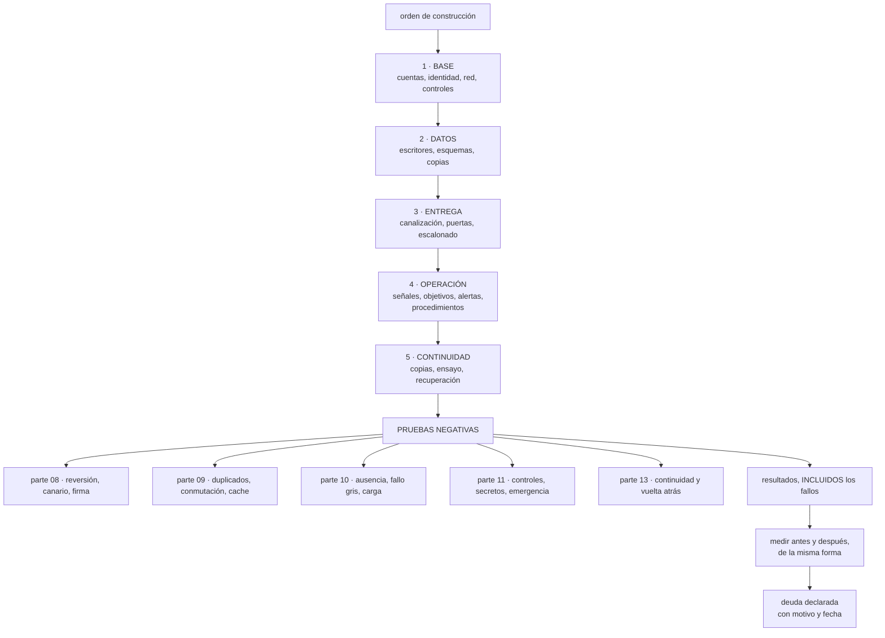

# 179 — Capstone: implementación y operación

> [← 178 · Capstone: descubrimiento y diseño](../../part-14-advanced-platform-capstones-career/178-capstone-descubrimiento-y-diseno/README.md) · [Índice de la parte](../README.md) · [180 · Capstone: defensa, portafolio y plan profesional →](../../part-14-advanced-platform-capstones-career/180-capstone-defensa-portafolio-y-plan-profesional/README.md)

**Parte:** 14 — Plataformas avanzadas, capstones y carrera<br>
**Nivel:** experto-frontera · **Horas estimadas:** 8<br>
**Laboratorio:** `capstone` · **Estado:** `EXECUTABLE_CORE`

## 🎯 Propósito

Construir lo diseñado en la clase 178, ponerlo a funcionar y —lo que de verdad distingue un proyecto terminado de uno presentado— **ejecutar las pruebas negativas de todo el programa y publicar lo que encuentren, incluidas las que fallen**. La clase da el orden de construcción que evita rehacer trabajo, la lista completa de comprobaciones, el modo de medir el antes y el después sin engañarse, y la disciplina de anotar lo que se decidió no hacer y lo que salió mal.

## 📚 Resultados de aprendizaje

Al finalizar podrás:

1. **Construir** en el orden que evita rehacer: base, datos, entrega, operación.
2. **Ejecutar** las pruebas negativas del programa y registrar sus resultados.
3. **Medir** el antes y el después con cifras comparables.
4. **Operar** el sistema el tiempo suficiente para que los datos signifiquen algo.
5. **Registrar** lo que salió mal y lo que se dejó sin hacer.

## 🧩 Conceptos centrales

| Concepto | Comprensión verificable |
|---|---|
| `orden de construcción` | Secuencia en que se monta: lo que condiciona a lo demás primero, para no rehacerlo. |
| `prueba negativa` | Comprobación que provoca el fallo a propósito y verifica que el sistema responde como se dijo. |
| `medida comparable` | Cifra tomada de la misma forma antes y después. Sin ella, la mejora no se puede afirmar. |
| `periodo de operación` | Tiempo en que el sistema funciona de verdad antes de dar el proyecto por terminado. Sin él no hay datos. |
| `registro de lo que falló` | Anotación de las pruebas que no pasaron y de lo que se descubrió tarde. Es lo que hace creíble el resto. |
| `deuda declarada` | Lo que se decidió no hacer, con motivo y fecha. Distinto de lo que se olvidó. |

## 🧠 Modelo mental

El nivel experto no consiste en conocer más productos, sino en formular mejores preguntas, validar supuestos y sostener decisiones frente a costo, riesgo y operación.

Aplicado a esta clase, separa siempre cuatro planos: **intención** (qué necesita el usuario),
**configuración** (qué declaramos), **estado observado** (qué existe de verdad) y
**evidencia** (cómo sabemos que cumple). Confundirlos produce diseños que se ven correctos
en un diagrama pero fallan al operar.

## 🗺️ Flujo de razonamiento



## 📖 Desarrollo

### 1. El orden de construcción

Construir en el orden equivocado obliga a rehacer, y el criterio es el mismo de la clase 169: **primero lo que condiciona a lo demás**.

```text
1. BASE                                            clases 144, 169
   cuentas o proyectos, jerarquía, controles preventivos
   identidad federada, sin usuarios locales         clase 159
   red con rangos del plan y denegación por defecto clases 135, 160
   registro y auditoría enrutados                   clase 141
   etiquetas obligatorias y presupuesto             clase 142
   → si esto se hace después, hay que migrar todo lo que se creó antes

2. DATOS                                           clases 147, 149, 150
   un escritor por dato, esquemas separados
   consistencia decidida por operación
   claves de partición con margen
   copias inmutables en cuenta separada             clase 166
   → es lo más caro de cambiar; se decide con cuidado y se hace pronto

3. ENTREGA                                         parte 08
   canalización con puertas, artefacto inmutable y firmado
   repositorio de entorno y bucle de reconciliación clase 103
   despliegue escalonado con reversión              clase 102

4. OPERACIÓN                                       parte 10
   las cuatro señales correlacionadas y la línea de cambios
   indicadores y objetivos, medidos en el borde
   alertas accionables con procedimiento
   y proceso de incidentes

5. CONTINUIDAD                                     clase 166
   copias probadas, objetivos por escenario
   y el ensayo de recuperación
```

Y dos reglas sobre el orden:

```text
la base y los datos condicionan todo lo demás
la operación se monta ANTES de que haga falta, no después
  del primer incidente
```

Y una advertencia sobre el paso 4, que es el que más se pospone:

```text
montar la operación al final significa que durante toda la
construcción no se sabe qué está pasando
→ y los problemas de diseño aparecen sin señales que los expliquen
→ conviene tener las señales y la línea de cambios desde el día 1
```

Y una nota sobre la marcha del trabajo:

```text
cada paso termina cuando sus pruebas negativas pasan
no cuando «está montado»
→ y si alguna falla, ese paso no está terminado          ley 22
```

### 2. Las pruebas negativas del programa

Esta es la lista completa, reunida de las partes anteriores. **Ejecutarlas es el trabajo; el resultado es la entrega.**

```text
ENTREGA                                                  parte 08
☐ desplegar una versión rota y comprobar que el canario la para
☐ revertir un despliegue y cronometrar
☐ desplegar un artefacto sin firmar y ver que la admisión lo rechaza
☐ enviar un secreto al repositorio y ver que se rechaza
☐ parar el bucle de reconciliación y esperar la alerta de antigüedad

DATOS                                                    parte 09
☐ matar un consumidor a mitad de proceso
☐ entregar el mismo mensaje dos veces a propósito
☐ provocar una conmutación de la base y medir la pérdida
☐ vaciar el caché en hora punta
☐ parar el publicador de la tabla de salida
☐ enviar un mensaje con un campo renombrado

OPERACIÓN                                                parte 10
☐ parar un servicio y comprobar que salta la alerta de ausencia
☐ desplegar una versión con errores y medir el ritmo de consumo
☐ inyectar latencia en una dependencia opcional
☐ ralentizar una instancia y ver si el reparto la evita
☐ ejecutar un procedimiento con alguien que no lo escribió
☐ tirar el recolector de telemetría
☐ medir el codo con modelo abierto y datos realistas

SEGURIDAD                                                parte 11
☐ crear un recurso sin etiquetas de dueño
☐ crear en una región no permitida
☐ desactivar el registro de auditoría
☐ borrar una copia de seguridad
☐ hacer público un almacén
☐ alcanzar producción desde un entorno inferior
☐ sacar datos a un destino externo no declarado
☐ pedir un acceso temporal y cronometrarlo
☐ usar el acceso de emergencia
☐ simular lo que se quiere detectar                      clase 174

CONTINUIDAD                                              parte 13
☐ restaurar una copia y cronometrar
☐ simular un borrado y recuperar de copia inmutable
☐ conmutar a la segunda región y medir los cinco tramos
☐ volver atrás y comprobar que no hay dos escritores
```

Y la disciplina que las hace valer:

```text
se ejecutan de verdad, no se razonan
se anota el resultado y el tiempo
las que fallan se corrigen y SE VUELVEN A EJECUTAR
y las que fallaron se publican en el informe
```

Y la evidencia de este programa sobre qué esperar:

```text
en la clase 144, 3 de 11 fallaron la primera vez
en la clase 168, 5 de 11
→ que fallen es lo normal; que no se ejecuten es el problema
```

Y una regla que evita el autoengaño más común:

```text
una prueba que se ejecuta en preproducción y no en producción
comprueba preproducción
→ y hay que decir en cuál se ejecutó cada una
```

### 3. Medir sin engañarse

La comparación entre el antes y el después es donde estos proyectos se estropean, por tres motivos evitables:

```text
1. LA CIFRA DE ANTES NO SE TOMÓ
   y se estima a posteriori, siempre a favor
   → hay que tomarla ANTES de tocar nada                  clase 178

2. SE MIDE DE FORMA DISTINTA
   antes en el servidor y después en el borde             clase 126
   antes con la media y después con el percentil
   → misma forma, mismo punto, misma ventana

3. CAMBIÓ OTRA COSA
   el tráfico, la temporada, el catálogo
   → por eso el coste se compara por unidad de negocio     clase 142
```

Y las cifras que conviene tener en las dos columnas:

```text
RENDIMIENTO
  latencia por percentil, medida en el borde
  llamadas de red por operación                          clase 152
  distancia al codo                                      clase 129

FIABILIDAD
  disponibilidad observada, y techo por dependencias
  incidentes por trimestre y tiempo hasta mitigar
  proporción de problemas detectados por alerta          clase 120

COSTE
  coste por unidad de negocio                            clase 142
  y proporción atribuida

SEGURIDAD
  alcance desde cada punto de entrada                    clase 133
  permisos concedidos y no usados                        clase 134
  credenciales de larga duración

CONTINUIDAD
  plazo de recuperación MEDIDO y pérdida medida          clase 166

OPERACIÓN
  alertas por turno y proporción accionable              clase 125
  trabajo repetitivo                                     clase 128
```

Y una honestidad que hay que mantener en el informe:

```text
lo medido se marca como medido
lo estimado se marca como estimado, y se dice cómo se estimó
y lo que no se pudo medir se dice que no se midió
```

**El periodo de operación**, que es lo que separa un proyecto de una demostración:

```text
el sistema tiene que funcionar de verdad durante un tiempo
  → con tráfico real o realista
  → con despliegues reales
  → y pasando al menos un ciclo completo de negocio        clase 167

un mes es el mínimo razonable; tres son mejores
→ porque los procesos mensuales, los picos y las sorpresas
  no ocurren en una semana
```

Y lo que se recoge durante ese periodo:

```text
incidentes, con su revisión y sus acciones               clase 127
despliegues, y cuántos se revirtieron
alertas disparadas y cuántas fueron accionables
desviaciones de coste                                    clase 142
y lo que alguien tuvo que hacer a mano
```

Y la última es la más informativa: **lo que se hizo a mano señala lo que falta automatizar**.

### 4. Lo que salió mal y lo que no se hizo

Un informe que solo cuenta lo que funcionó no se puede creer, y además pierde su parte más útil.

**Lo que salió mal** se registra con esta forma:

```text
qué falló
cuándo se descubrió, y cómo
qué se hizo
qué se cambió para que no vuelva
y si se descubrió tarde, POR QUÉ no antes
```

Y la última pregunta es la que produce las mejoras de método:

```text
«¿por qué no lo vimos antes?»
  → no había prueba negativa para eso                     ley 22
  → la señal existía y nadie la miraba                    ley 15
  → algo lo compensaba automáticamente                    ley 19
  → no tenía dueño                                        ley 20
```

**La deuda declarada**, que es distinta de lo que se olvidó:

```text
qué se decidió NO hacer
por qué
qué riesgo se acepta mientras tanto
quién lo acepta, con nombre
y en qué fecha se revisa
```

Y la diferencia práctica:

```text
deuda declarada     alguien la conoce, la aceptó y hay fecha
lo que se olvidó    aparece en el peor momento y nadie responde
→ el informe debe distinguirlas, y decir cuánta hay de cada una
```

Y conviene incluir también **lo que se probó y se descartó**, que es información valiosa y suele perderse:

```text
qué se intentó
por qué no funcionó o no compensó
y qué se hizo en su lugar
→ evita que la siguiente persona lo intente otra vez
```

Y el cierre de esta fase, antes de la defensa:

```text
un documento con
  el antes y el después, con cifras y su origen
  los resultados de las pruebas negativas, con los fallos
  los hallazgos del descubrimiento                        clase 178
  las decisiones registradas, con sus premisas
  lo que salió mal y por qué no se vio antes
  la deuda declarada, con fechas y nombres
  y lo que se probó y se descartó
```

Y la lista de comprobación de esta fase:

```text
☐ se construyó en orden: base, datos, entrega, operación, continuidad
☐ la operación estaba montada antes de necesitarla
☐ cada paso terminó cuando sus pruebas negativas pasaron
☐ se ejecutaron TODAS las pruebas negativas de la lista
☐ está anotado en qué entorno se ejecutó cada una
☐ las que fallaron están publicadas, con lo que se corrigió
☐ las cifras de antes se tomaron antes de tocar nada
☐ antes y después se miden de la misma forma y en el mismo punto
☐ el coste se compara por unidad de negocio
☐ hubo un periodo de operación real de al menos un mes
☐ está registrado lo que hubo que hacer a mano
☐ lo que salió mal está escrito, con por qué no se vio antes
☐ la deuda declarada tiene motivo, riesgo, nombre y fecha
☐ está anotado lo que se probó y se descartó
```

Y el cierre que enlaza con la clase siguiente: con el sistema construido, operado y medido, queda defenderlo ante alguien que pregunte, convertirlo en algo que se pueda enseñar y decidir qué hacer después. Es la materia de la clase 180, que además cierra la parte 14.

## 🔬 Ejemplo trabajado

**El equipo de la clase 178 construye lo diseñado y lo opera tres meses. Lo que sigue es el resultado de las pruebas negativas —incluidas las nueve que fallaron— y la comparación entre el antes y el después.**

**La construcción, en orden.**

```text
semanas 1-3    BASE
  3 cuentas nuevas, jerarquía, 12 controles preventivos
  identidad federada; los 4 usuarios locales retirados
  rangos del plan central; denegación por defecto
  hallazgo   al aplicar la denegación por defecto aparecieron
             11 conexiones que nadie había declarado

semanas 3-7    DATOS
  19 tablas con varios escritores → un escritor cada una
  7 consultas cruzadas sustituidas por copia por evento
  copias inmutables en cuenta separada
  hallazgo   2 de las 19 tablas resultaron no usarse en absoluto

semanas 6-9    ENTREGA
  canalización con puertas, artefacto firmado
  repositorio de entorno y bucle
  despliegue escalonado con reversión automática

semanas 2-10   OPERACIÓN   ← desde el principio, en paralelo
  cuatro señales, línea de cambios, objetivos y alertas
  procedimientos escritos y probados por otra persona

semanas 9-11   CONTINUIDAD
  segunda región con lo mínimo encendido
  ensayo de conmutación
```

Y la decisión de montar la operación desde la semana 2 se justificó sola:

```text
problemas de diseño detectados durante la construcción         6
  de ellos, gracias a las señales ya montadas                   5
    → una consulta por elemento en el nuevo servicio de búsqueda
    → una conexión por petición en el de reservas
    → dos plazos ausentes en llamadas nuevas
    → un trabajo programado que se ejecutaba dos veces
```

**Las pruebas negativas: 31 ejecutadas, 9 fallaron.**

```text
ENTREGA
  versión rota → canario la para           ✓  parada en 9 min
  reversión cronometrada                   ✓  4 min
  artefacto sin firmar → rechazado         ✓
  secreto al repositorio → rechazado       ✓
  bucle parado → alerta por antigüedad     ✗  la alerta existía y
                                              apuntaba a un canal
                                              sin nadie

DATOS
  matar consumidor a mitad                 ✓  sin efecto duplicado
  entregar dos veces el mismo mensaje      ✗  el consumidor de
                                              notificaciones envió
                                              dos correos
  conmutación de la base                   ✓  52 s, 0 pérdidas
  vaciar el caché en hora punta            ✗  caída de 4 min
                                              → faltaba limitación
                                                hacia el origen
  parar el publicador                      ✓  alerta a los 4 min
  campo renombrado                         ✓  rechazado al producir

OPERACIÓN
  parar un servicio → alerta de ausencia   ✓  70 s
  versión con errores → ritmo de consumo   ✓  aviso a los 6 min
  latencia en dependencia opcional         ✗  no era opcional:
                                              el catálogo era duro
  instancia lenta → reparto la evita       ✗  reparto rotatorio
  procedimiento por otra persona           ✗  9 de 14 con preguntas
  tirar el recolector                      ✓  la aplicación siguió
  medir el codo, modelo abierto            ✓  1.850/s, no 6.000

SEGURIDAD
  recurso sin etiquetas                    ✓  rechazado
  región no permitida                      ✓  rechazado
  desactivar auditoría                     ✓  rechazado
  borrar una copia                         ✓  rechazado
  almacén público                          ✓  rechazado
  producción desde entorno inferior        ✓  bloqueado
  destino externo no declarado             ✗  no había control de salida
  acceso temporal cronometrado             ✓  84 s
  acceso de emergencia                     ✗  la credencial no funcionaba
  simular lo que se quiere detectar        ✗  2 de 6 no se detectaban

CONTINUIDAD
  restaurar copia y cronometrar            ✓  41 min
  simular borrado y recuperar              ✓  pérdida de 6 min
  conmutar y medir los cinco tramos        ✗  2 h 10 frente a 1 h
                                              declarada
  volver atrás sin dos escritores          ✓  tras corregir lo anterior
```

**Nueve de treinta y una.** Y lo que enseñó cada una:

```text
canal sin nadie              el mismo hallazgo de las clases 131 y 159
correos duplicados           faltaba tabla de entrada en un consumidor
caché sin limitación         el caché era portante y no se sabía  clase 111
catálogo como dependencia dura  estaba declarada blanda y no lo era
reparto rotatorio            valor por defecto                    clase 152
procedimientos               9 de 14 suponían contexto            clase 128
sin control de salida        no se había montado                  clase 135
acceso de emergencia         creado y nunca probado                ley 22
detección incompleta         2 técnicas sin regla                 clase 174
conmutación 2 h 10           decidir y redirigir dominaban        clase 166
```

Y tras corregirlas y volver a ejecutar:

```text
segunda ejecución completa                          31 de 31   ✓
conmutación                                         38 min
```

**El periodo de operación: tres meses.**

```text
despliegues                                                  214
revertidos                                                     7
  de ellos, por el canario, automáticamente                     5
incidentes                                                     4
  detectados por alerta                                        4
  tiempo medio hasta mitigar                              11 min
alertas disparadas                                            41
  accionables                                              34 (83 %)
acciones manuales que hubo que hacer                          19
  de ellas, repetidas más de 3 veces                           2
    → reprocesar mensajes fallidos y ampliar una cuota
    → las dos se automatizaron
desviaciones de coste detectadas                               2
  → una real: un índice que faltaba                       clase 142
```

Y el ciclo completo de negocio, que ocurrió en el mes 2:

```text
cierre mensual                                    reveló 1 problema
  → un proceso que asumía que podía leer del principal sin límite
  → corregido; no se habría visto en un periodo de una semana
```

**El antes y el después.**

```text                                     antes      después    origen
latencia p99 del flujo (borde)             780 ms      210 ms    medida
llamadas de red por reserva                    9           3     medida
distancia al codo en el pico                 88 %        41 %    medida
disponibilidad observada                   99,1 %      99,7 %    medida
techo por dependencias                     99,05 %     99,74 %   calculado
incidentes por trimestre                       9           4     medida
tiempo hasta mitigar                       1 h 40      11 min    medida
problemas detectados por alerta            2 de 9      4 de 4    medida
coste por reserva                          0,061 €     0,039 €   medida
gasto atribuido                              38 %        96 %    medida
alcance desde un servicio comprometido    10 de 11     2 de 5    medida
permisos concedidos y no usados              79 %        11 %    medida
credenciales de larga duración                 6           0      medida
plazo de recuperación                      no medido    38 min   MEDIDO
pérdida en recuperación                    no medido    31 s     medida
alertas por turno                             6,1         0,8    medida
proporción accionable                        14 %        83 %    medida
trabajo repetitivo                           29 %        12 %    estimado
```

Y las dos filas marcadas como estimadas o calculadas lo están a propósito: **el trabajo repetitivo se estimó con un registro de dos semanas, no con un año de datos**, y el techo por dependencias es una multiplicación, no una medición.

**Lo que salió mal, y por qué no se vio antes.**

```text
1. la separación de escritores rompió 2 informes internos
   descubierto   por un usuario, 9 días después
   por qué no antes   nadie sabía que esos informes existían;
                      no aparecían en el tráfico observado porque
                      se ejecutaban una vez al mes             ley 20
   cambio        inventario de consumidores por consulta,
                 no solo por servicio

2. el coste subió un 21 % durante 3 semanas
   causa         la segunda región encendida antes de retirar
                 recursos antiguos
   por qué no antes   la detección diaria avisó el día 2 y nadie
                      la miró: iba a un canal nuevo sin nadie   ley 15
   cambio        la alerta de coste va al mismo canal que las demás

3. una migración de esquema bloqueó la base 6 minutos
   por qué no antes   se probó en un entorno con 1.000 filas
   cambio        entorno de pruebas con volumen realista       clase 104
```

**La deuda declarada.**

```text
qué                          motivo               riesgo      revisa
el sistema de facturación    fuera del alcance    punto único  6 meses
heredado sigue siendo
punto único                                                   (dirección)

la aplicación móvil usa      no se tocó           contrato     3 meses
la API v1                                         a mantener   (producto)

el aislamiento por cliente   solo 2 clientes      manual       12 meses
sigue siendo manual          lo piden                          (plataforma)

el informe de cumplimiento   no había requisito   ninguno      cuando
se genera a mano             aún                               lo haya
```

Y **lo que se probó y se descartó**, que evita repetir el trabajo:

```text
malla de servicio            4 de 5 capacidades ya resueltas    clase 152
capa de abstracción propia   cubría el 21 % del coste de salida clase 158
segundo proveedor activo     ninguno de los motivos resistía    clase 157
reescribir el buscador       el problema era una consulta
                             por elemento, no el motor          clase 124
```

**La lección que esta clase abre para la defensa**: se ejecutaron treinta y una pruebas negativas y **fallaron nueve**, entre ellas un acceso de emergencia que nunca se había usado y una dependencia declarada opcional que no lo era. Ninguna de las nueve se habría descubierto revisando la configuración, y las nueve estaban documentadas como resueltas. Y de los tres problemas que salieron mal durante la operación, dos tenían la misma causa que este programa lleva nombrando desde la parte 10: **una señal que existía y que iba a un sitio donde nadie miraba**.

## 🧪 Laboratorio guiado

Ejecuta desde la raíz:

```bash
python classes/part-14-advanced-platform-capstones-career/179-capstone-implementacion-y-operacion/lab.py
```

El laboratorio selecciona el motor de práctica **`capstone`** y produce
`lab_result.json`. El escenario, sus comprobaciones y el artefacto esperado corresponden a
esta clase; no requiere credenciales y deja explícito qué debe revalidarse en un sandbox real.

1. Lee `exercise.steps` y formula una predicción antes de ejecutar.
2. Ejecuta la práctica y verifica todos los elementos de `checks`.
3. Provoca el caso de `negative_test` y explica la señal observada.
4. Materializa `evidencia-implementacion-final` en `evidence/` usando la plantilla indicada.
5. Para proveedor real, sigue `sandbox.requires`, registra costo y ejecuta `destroy`.

### Evidencia esperada

El artefacto principal es un incremento integrado, demostrable y documentado. Además, la entrega debe incluir el comando ejecutado,
la salida estructurada y una conclusión que no exceda lo observado.

## 🏆 Reto verificable

Construye **`evidencia-implementacion-final`** para el caso CloudShop. Incluye una alternativa descartada,
un supuesto que pueda falsarse, una prueba de fallo y una decisión de rollback.

## ✅ Criterio de aceptación

- [ ] `lab.py` termina con código 0 y genera JSON válido.
- [ ] La entrega conecta al menos tres requisitos con mecanismos verificables.
- [ ] Existe una prueba positiva y una prueba negativa con evidencia.
- [ ] Seguridad, costo y operación aparecen como decisiones, no como anexos.
- [ ] Se declara una limitación y una condición que obligaría a revisar el diseño.
- [ ] Otra persona puede repetir el recorrido sin conocimiento tácito.

## ⚠️ Errores frecuentes

| Síntoma | Causa probable | Corrección |
|---|---|---|
| Hay que rehacer trabajo porque la base llegó tarde | Se construyó en el orden equivocado | Base, datos, entrega, operación y continuidad; lo que condiciona a lo demás, primero. |
| Durante la construcción no se sabe qué está pasando | La operación se dejó para el final | Monta señales, línea de cambios y objetivos desde las primeras semanas. |
| Se declara terminado un paso que no lo está | Se dio por bueno al montarlo, sin ejecutar sus pruebas negativas | Un paso termina cuando sus pruebas negativas pasan, y las que fallan se corrigen y se repiten. |
| La mejora no se puede afirmar | La cifra de antes se estimó a posteriori o se midió de otra forma | Toma las cifras antes de tocar nada, mide igual en los dos momentos y compara el coste por unidad de negocio. |
| Aparecen sorpresas justo después de dar el proyecto por terminado | No hubo periodo de operación ni pasó un ciclo completo de negocio | Opera de verdad al menos un mes, y registra lo que hubo que hacer a mano. |
| El informe solo cuenta lo que funcionó y no se cree | No se publicaron los fallos ni lo que se dejó sin hacer | Registra las pruebas que fallaron, por qué no se vio antes, la deuda declarada con nombre y fecha, y lo que se probó y se descartó. |

## 🛡️ Seguridad, ética y costo

Trabaja con cuentas propias o sandboxes autorizados. No publiques secretos, identificadores
reales ni datos personales. Antes de crear recursos pagos define presupuesto, etiquetas y
comando de destrucción; después verifica que no queden recursos huérfanos. Los ejemplos
locales enseñan contratos, pero no certifican cumplimiento ni disponibilidad de producción.

## ❓ Preguntas de comprobación

1. ¿Por qué la base y los datos se construyen antes que todo lo demás?
2. ¿Por qué la operación se monta antes de necesitarla?
3. ¿Qué hace que una prueba negativa cuente como ejecutada?
4. ¿Qué tres errores estropean la comparación entre el antes y el después?
5. ¿Qué diferencia hay entre deuda declarada y lo que se olvidó?

## 🔗 Referencias

- Beyer, B. y otros (2018). *The Site Reliability Workbook* — puesta en producción y verificación con pruebas reales. <https://sre.google/workbook/table-of-contents/>
- Basiri, A. y otros (2016). *Chaos engineering* — provocar el fallo como método de verificación. <https://ieeexplore.ieee.org/document/7503833>
- Humble, J. y Farley, D. (2010). *Continuous Delivery* — orden de construcción de la canalización y verificación. <https://www.oreilly.com/library/view/continuous-delivery-reliable/9780321670250/>
- AWS (2025). *Well-Architected review process* — evaluación con evidencia y registro de deuda. <https://docs.aws.amazon.com/wellarchitected/latest/framework/welcome.html>
- Forsgren, N. y otros (2018). *Accelerate* — medir antes y después con las mismas definiciones. <https://itrevolution.com/product/accelerate/>
- Documentación oficial vigente del servicio implementado; registra URL y fecha de consulta.

---

> [Evaluación](assessment.md) · [Contrato de clase](lesson.yaml) · [Índice de la parte](../README.md)

**📥 Descargar:** [Parte 14 en PDF](../../../site/downloads/partes/manual-parte-14-advanced-platform-capstones-career.pdf) · [Manual integral](../../../site/downloads/multi-cloud-engineering-manual-v2.0.pdf)

| Anterior | Índice | Siguiente |
|---|---|---|
| [← 178 · Capstone: descubrimiento y diseño](../../part-14-advanced-platform-capstones-career/178-capstone-descubrimiento-y-diseno/README.md) | [Parte 14](../README.md) · [Programa](../../README.md) | [180 · Capstone: defensa, portafolio y plan profesional →](../../part-14-advanced-platform-capstones-career/180-capstone-defensa-portafolio-y-plan-profesional/README.md) |
