# 180 — Capstone: defensa, portafolio y plan profesional

> [← Clase anterior](../../part-14-advanced-platform-capstones-career/179-capstone-implementacion-y-operacion/README.md) · [Índice de la parte](../README.md) · [Clase siguiente →](../../part-15-systems-architecture-engineering/181-requisitos-funcionales-restricciones-y-atributos-de-calidad/README.md)

**Parte:** 14 — Plataformas avanzadas, capstones y carrera<br>
**Nivel:** experto-frontera · **Horas estimadas:** 8<br>
**Laboratorio:** `capstone` · **Estado:** `EXECUTABLE_CORE`

## 🎯 Propósito

Cerrar el proyecto final defendiéndolo ante alguien que pregunte de verdad, convertirlo en un portafolio que demuestre criterio y no solo herramientas, y decidir qué hacer después con honestidad sobre lo que aún no se sabe. La clase cierra además la parte 14: corrige las cinco predicciones de la clase 168 —dos acertadas, una acertada de más, dos a medias—, actualiza el recuento de leyes, añade la ley 23 y escribe la hipótesis de la parte 15.

## 📚 Resultados de aprendizaje

Al finalizar podrás:

1. **Defender** el proyecto ante preguntas duras, incluidas las que no tienen buena respuesta.
2. **Construir** un portafolio que demuestre criterio, no catálogo de herramientas.
3. **Decidir** el siguiente paso profesional con datos y no con etiquetas.
4. **Corregir** las cinco predicciones de la clase 168 con la evidencia de la parte 14.
5. **Escribir** la hipótesis de la parte 15 en forma refutable.

## 🧩 Conceptos centrales

| Concepto | Comprensión verificable |
|---|---|
| `defensa` | Exposición del proyecto ante alguien que pregunta con intención de encontrar el punto débil. |
| `pregunta sin buena respuesta` | Aquella cuya respuesta honesta es «no lo medimos» o «se aceptó el riesgo». Contestarla bien vale más que evitarla. |
| `portafolio` | Conjunto de evidencias que demuestran cómo se decide, no qué herramientas se han tocado. |
| `criterio demostrable` | Decisión registrada con premisas, alternativas descartadas y su coste de cambio. |
| `hipótesis de parte` | Afirmación refutable escrita antes de estudiar, que la parte siguiente corrige con evidencia. |
| `ley 23` | La capacidad de un equipo la limita lo que ya mantiene, no lo que sabe construir. |

## 🧠 Modelo mental

El nivel experto no consiste en conocer más productos, sino en formular mejores preguntas, validar supuestos y sostener decisiones frente a costo, riesgo y operación.

Aplicado a esta clase, separa siempre cuatro planos: **intención** (qué necesita el usuario),
**configuración** (qué declaramos), **estado observado** (qué existe de verdad) y
**evidencia** (cómo sabemos que cumple). Confundirlos produce diseños que se ven correctos
en un diagrama pero fallan al operar.

## 🗺️ Flujo de razonamiento

```mermaid
flowchart TB
    D["DEFENSA"] --> D1["qué se descubrió que\nestaba mal y no se sabía"]
    D --> D2["qué decisión fue\nla más difícil, y por qué"]
    D --> D3["qué prueba negativa falló"]
    D --> D4["qué no se midió"]
    D --> D5["qué se haría distinto"]
    P["PORTAFOLIO"] --> P1["decisiones con premisas\ny alternativas descartadas"]
    P --> P2["pruebas negativas\ny sus fallos"]
    P --> P3["antes y después,\ncon el origen de cada cifra"]
    P --> P4["un problema mal diagnosticado\ny cómo se corrigió"]
    C["CIERRE DE PARTE 14"] --> C1["corrección de las 5\npredicciones de la clase 168"]
    C --> C2["recuento de leyes\ny ley 23"]
    C --> C3["hipótesis de la parte 15"]
```



## 📖 Desarrollo

### 1. La defensa

Una defensa útil no es una presentación: es alguien buscando el punto débil. Y las preguntas que de verdad distinguen son estas:

```text
1. ¿QUÉ DESCUBRISTE QUE ESTABA MAL Y NADIE SABÍA?
   → la respuesta débil habla de lo que se construyó
   → la fuerte habla de lo que se encontró                clase 178

2. ¿CUÁL FUE LA DECISIÓN MÁS DIFÍCIL Y QUÉ DESCARTASTE?
   → si no hay alternativas descartadas, no hubo decisión
   → y hay que saber decir el coste de cambiarla

3. ¿QUÉ PRUEBA NEGATIVA FALLÓ?
   → «ninguna» significa que no se ejecutaron              ley 22

4. ¿QUÉ NO MEDISTE?
   → todo proyecto tiene huecos; saber cuáles es la señal

5. ¿QUÉ HARÍAS DISTINTO?
   → y en qué momento se supo que había que hacerlo así
```

Y las preguntas que un revisor experimentado añade, que son incómodas a propósito:

```text
¿qué parte de la mejora se debe al cambio y qué parte a otra cosa?
¿qué se rompió y quién lo notó primero, tú o un usuario?
¿esta cifra está medida o estimada?
¿qué pasa si mañana se va la persona que montó esto?
¿cuánto cuesta al mes y por qué esa cifra y no la mitad?
¿qué se sigue haciendo a mano?
```

Y cómo contestar las que no tienen buena respuesta, que es donde se gana o se pierde la defensa:

```text
decir «no lo medimos» y decir por qué
decir «se aceptó el riesgo, lo aceptó X, se revisa en Y»
decir «no lo sé» y decir cómo se averiguaría
→ inventar una respuesta se detecta en la siguiente pregunta
```

Y el error más frecuente en estas defensas:

```text
defender la decisión en lugar de defender el razonamiento
→ una decisión puede ser incorrecta con un razonamiento correcto
  si las premisas cambiaron; eso se explica
→ una decisión correcta sin razonamiento fue suerte, y se nota
```

### 2. El portafolio

Un portafolio de herramientas dice qué se ha tocado; uno de criterio dice cómo se decide. **El segundo es el que resiste una entrevista técnica.**

```text
LO QUE NO DEMUESTRA CASI NADA
  una lista de tecnologías
  un diagrama bonito sin decisiones
  un repositorio que despliega algo
  un certificado                                       ley 17

LO QUE SÍ DEMUESTRA
  una decisión registrada con premisas y alternativas
  una prueba negativa que falló, y qué se cambió
  una cifra de antes y una de después, con su origen
  un problema que se diagnosticó mal, y cómo se corrigió
  algo que se retiró                                   clase 171
```

Y la pieza más difícil de encontrar en cualquier portafolio, que por eso vale tanto:

```text
«esto lo diagnostiqué mal»
  qué se creyó al principio
  qué evidencia lo desmintió
  y qué se cambió en el método, no solo en el sistema
→ el programa entero está construido sobre esto: cada parte
  corrige por escrito las predicciones de la anterior
```

Y la forma práctica del portafolio:

```text
un documento corto por proyecto, no un repositorio enorme
  problema, con la cifra que lo demostraba
  qué se descubrió que no se sabía
  tres o cuatro decisiones, con alternativas y coste de cambio
  pruebas negativas, con las que fallaron
  antes y después, con origen de cada cifra
  deuda declarada
  y qué se haría distinto
```

Y una nota sobre lo que se puede publicar:

```text
cifras absolutas del negocio      normalmente no
proporciones y relaciones         casi siempre sí
nombres de clientes               no
el razonamiento                   siempre, y es lo que importa
```

### 3. El siguiente paso, sin etiquetas

Al terminar un programa como este la pregunta habitual es «¿qué certificación saco ahora?», y casi siempre es la pregunta equivocada.

```text
lo que una certificación demuestra
  que se conoce el catálogo de un proveedor
  y que se sabe contestar a preguntas de examen

lo que NO demuestra
  criterio, que es lo que se paga
  ni haber operado nada bajo presión

cuándo compensa de verdad
  cuando un contrato o un socio la exigen
  cuando se cambia de área y hace falta cubrir un hueco
  cuando la empresa la paga y no cuesta tiempo propio
```

Y una forma más útil de decidir el siguiente paso, con los datos del propio proyecto:

```text
1. mira las pruebas negativas que fallaron
   → señalan lo que no se domina, con evidencia

2. mira lo que se hizo a mano y se repitió
   → señala una capacidad que falta                     clase 128

3. mira lo que se dejó como deuda por no saber hacerlo
   → distinto de lo que se dejó por prioridad

4. mira qué preguntas de la defensa no supiste contestar
```

Y sobre los caminos posibles, con lo que cada uno exige de verdad:

```text
INGENIERÍA DE PLATAFORMA        producto interno, no infraestructura
  exige                          saber decir que no y medir adopción
  fracasa por                    construir capacidades sin usuarios

FIABILIDAD                       objetivos, presupuesto de error, incidentes
  exige                          disciplina de medida y de revisión
  fracasa por                    convertirse en soporte de otros  clase 173

ARQUITECTURA                     decisiones y sus consecuencias
  exige                          decir el coste de cambio antes de decidir
  fracasa por                    diseñar sin operar nunca

DATOS                            escritores, contratos, linaje
  exige                          entender consistencia de verdad
  fracasa por                    tratar el dato como fichero

SEGURIDAD                        alcance, identidad, detección
  exige                          medir alcance, no contar controles
  fracasa por                    policía en vez de camino fácil    ley 16
```

Y el consejo que este programa sostiene por encima de las etiquetas:

```text
lo que hace a alguien difícil de sustituir no es la herramienta
es haber operado algo, haberlo roto a propósito, haber medido
el resultado y haber escrito lo que salió mal
→ y eso se puede hacer en cualquiera de los cinco caminos
```

### 4. Cierre de la parte 14: corrección, recuento e hipótesis

**Las cinco predicciones de la clase 168, corregidas con la evidencia de las clases 169 a 179.**

```text
1. «la escala organizativa no traerá problemas técnicos nuevos:
    los mismos con más gente; la ley 16 dominará»

   PRIMERA MITAD CORRECTA. Lo genuinamente nuevo de la parte 14
   fue organizativo —modelo operativo, hoja de ruta, órganos de
   decisión, retirada— y no técnico.
   SEGUNDA MITAD A MEDIAS. La ley 16 apareció con fuerza (35
   cuentas creadas por fuera porque el proceso tardaba 6 días;
   41 excepciones a un control; la policía del coste), pero NO
   dominó: empató con la 15 (110 políticas obligatorias que nadie
   sabía citar; 12.400 alertas) y con la 20 (cuentas, trabajos y
   servicios sin dueño). Tres leyes a la par, no una dominante.

2. «en cargas de IA el problema dominante no será el modelo ni
    las GPU: será el dato; leyes 14 y 21, sin leyes nuevas»

   CORRECTA, y en los tres términos. El 41 % del tiempo de GPU
   esperando datos, dos conjuntos usados sin permiso, y el desvío
   entre entrenamiento y servicio —ley 21 en su forma más cara—
   valía 4,8 puntos de precisión. Las definiciones de atributo
   resultaron ser decisiones de creación, ley 14. Ninguna ley
   nueva hizo falta.

3. «en soberanía, la mayor parte de lo que se vende resuelve una
    amenaza que casi nadie tiene; lo que resuelve un problema real
    es saber dónde está cada dato y poder demostrarlo»

   CORRECTA. La oferta soberana costaba 21.000 €/mes y se descartó;
   lo que satisfizo al auditor fue una consulta que respondía dónde
   estaba cada dato, y costó 2.320 €/mes.

4. «el proyecto final encontrará que lo que falta no es tecnología:
    la mayoría de los hallazgos serán leyes 20 y 22»

   CORRECTA, y con más margen del previsto. En el descubrimiento:
   8 trabajos programados sin dueño, 2 fallando en silencio 7 meses,
   3 cuentas olvidadas, copias sin probar en 14 meses. Y en la
   ejecución: 9 de 31 pruebas negativas fallaron, y las 9 estaban
   documentadas como resueltas. Todas son ley 22.

5. «las leyes que más aparecen no serán las más útiles: la 13 y la
    15 dominarán el recuento, pero las que más decisiones cambiaron
    serán la 14 y la 21»

   A MEDIAS, y el fallo es instructivo. La primera mitad se cumple:
   13 y 15 dominan el recuento. La segunda es incompleta: la 14 y
   la 21 cambiaron las decisiones de DISEÑO —claves de partición,
   jerarquía de cuentas, dominio de identidad, división de datos—,
   pero la ley que más problemas REALES destapó en todo el programa
   fue la 22: 5 de 11 pruebas fallidas en la parte 13 y 9 de 31 en
   el proyecto final. Predijimos bien el mecanismo (frecuencia ≠
   utilidad) y mal cuál gana: no es la que cambia el diseño, es la
   que descubre que lo escrito no era cierto.
```

**Marcador: dos correctas, una correcta y subestimada, dos a medias.** Peor que el de la clase 156, y por un motivo identificable: **la parte 14 era la primera cuyo contenido dependía de personas y no de sistemas, y ahí las predicciones acertaron el tipo de problema y fallaron el reparto.**

**El recuento de leyes, cerrada la parte 14.**

```text
ley 13  lo que no se mira deja de funcionar en silencio        30
ley 15  la señal existe y nadie la mira                        24
ley 14  el coste se decide al crear, no al pagar               19
ley 16  un control que estorba se rodea                        17
ley 22  un procedimiento nunca ejecutado no funciona           15
ley 20  lo que no tiene dueño se filtra y se desperdicia       13
ley 21  el acoplamiento vive en quién escribe                  12
ley 19  la compensación hace invisible el fallo                 9
ley 18  lo asíncrono traslada la garantía, no la elimina        8
ley 17  se optimiza la medida, no el objetivo                   7
```

Y la parte 14 obliga a escribir una ley nueva, la primera que no habla de sistemas:

```text
LEY 23
  la capacidad de un equipo la limita lo que ya mantiene,
  no lo que sabe construir

apariciones en esta parte                                      4
  clase 169   214 cuentas, ninguna retirada
  clase 170   140 políticas que había que mantener
  clase 171   54 % de la capacidad en mantener 31 piezas
  clase 173   60 % del tiempo operando sistemas de otros

consecuencia   sin retirada, la capacidad de construir
               tiende a cero, y ninguna contratación lo arregla
```

**La hipótesis de la parte 15 (clases 181 a 192, arquitectura de sistemas), escrita antes de estudiarla y para que la clase 192 la corrija:**

```text
1. la parte 15 va a formalizar con vocabulario lo que este programa
   ya obtuvo por evidencia; el valor no estará en los nombres sino
   en poder discutir una decisión antes de tomarla

2. de los atributos de calidad, el que más decisiones cambiará no
   será rendimiento ni disponibilidad: será modificabilidad, porque
   es el único que se paga todos los meses

3. la frontera correcta entre módulos coincidirá con quién escribe
   cada dato en más del 70 % de los casos: la ley 21 predice las
   fronteras mejor que cualquier criterio funcional

4. el análisis de puntos de fallo encontrará que la mayoría de los
   puntos únicos no son de infraestructura sino de conocimiento y
   de procedimiento: leyes 22 y 23

5. las decisiones registradas y las funciones de aptitud fracasarán
   por la misma razón por la que fracasan los controles: si estorban
   más de lo que ayudan, se rodean; y el registro se rellenará
   después de decidir, para cumplir                          ley 16
```

Y el cierre de la parte 14, que es también el de la primera mitad del programa: **de ciento ochenta clases, lo que más problemas reales destapó no fue ningún diseño ni ninguna herramienta, sino ejecutar a propósito lo que estaba escrito como resuelto**. La parte 15 empieza por el otro extremo —los requisitos y los atributos de calidad, antes de construir nada— y su primera clase, la 181, distingue lo que el sistema debe hacer de lo que lo condiciona y de lo bien que debe hacerlo.

## 🔬 Ejemplo trabajado

**Defensa del proyecto de las clases 178 y 179 ante un comité de tres personas: una de arquitectura, una de operación y una de finanzas. Transcripción de las nueve preguntas y las respuestas que se dieron, incluidas las tres que no tenían buena respuesta.**

```text
P1 (arquitectura)
  ¿Qué descubriste que estaba mal y nadie sabía?

R  Ocho cosas. La que más me sorprendió: ocho trabajos programados
   sin dueño, y dos llevaban siete meses fallando en silencio sin
   que nadie lo notara. Uno de ellos calculaba las comisiones de
   los socios. Nadie se quejó porque el sistema seguía usando el
   último valor correcto.

   ← respuesta fuerte: habla de un hallazgo, no de una construcción
```

```text
P2 (arquitectura)
  ¿Cuál fue la decisión más difícil y qué descartaste?

R  Separar los escritores de las diecinueve tablas compartidas.
   La alternativa era mantener el acceso compartido y añadir
   validación; la descarté porque no resuelve el acoplamiento,
   solo lo hace más lento de descubrir. Coste de cambio si me
   equivoqué: alto, unos tres meses, porque siete consultas
   cruzadas se convirtieron en copias por evento y volver atrás
   exige rehacerlas.

   ← alternativa descartada y coste de cambio dicho sin que
     lo pregunten
```

```text
P3 (operación)
  ¿Qué prueba negativa falló?

R  Nueve de treinta y una. La peor: el acceso de emergencia no
   funcionaba. Estaba creado, documentado y nunca usado. Si
   hubiéramos tenido un incidente de identidad, no habríamos
   podido entrar. También falló la conmutación: dos horas diez
   frente a la hora declarada, y los dos tramos que dominaban
   eran decidir y redirigir, no arrancar nada.

   ← «ninguna» habría terminado la defensa aquí
```

```text
P4 (finanzas)
  Dices que el coste por reserva bajó de 0,061 a 0,039.
  ¿Cuánto de eso es tu cambio y cuánto es que el tráfico subió?

R  El tráfico subió un 14 % en el trimestre, y por eso comparo
   por reserva y no en total. Del descenso, la parte medible es
   el índice que faltaba y las siete consultas cruzadas retiradas.
   Lo que NO puedo separar limpiamente es el efecto de la
   reserva de capacidad que compró finanzas en el mes 2: eso
   son unos 0,004 € que no son míos.

   ← reconoce la parte de la mejora que no le corresponde
```

```text
P5 (operación)
  ¿Qué se rompió, y lo notaste tú o un usuario?

R  Un usuario. Dos informes internos dejaron de funcionar al
   separar los escritores, y lo supimos nueve días después
   porque se ejecutaban una vez al mes. No aparecían en el
   tráfico observado. Cambiamos el método: ahora el inventario
   de consumidores se hace por consulta, no por servicio.

   ← incluye el cambio de método, no solo el arreglo
```

```text
P6 (finanzas)
  ¿Esta cifra de trabajo repetitivo está medida o estimada?

R  Estimada. La medimos con un registro de dos semanas y la
   extrapolamos. La de antes es peor: es una encuesta al equipo.
   Las dos están marcadas como estimadas en el informe y no
   defiendo la diferencia exacta, solo la dirección.

   ← pregunta sin buena respuesta, contestada bien
```

```text
P7 (arquitectura)
  ¿Qué pasa si mañana te vas?

R  Catorce procedimientos escritos, de los cuales nueve fallaron
   la prueba de que los ejecutara otra persona y se corrigieron.
   Lo que sigue dependiendo de mí es la relación entre el
   inventario de consumidores y los informes de negocio: eso
   está en mi cabeza y no está escrito. Es la deuda que más me
   preocupa y no está en la lista formal.

   ← el candidato añade una deuda que no había declarado
```

```text
P8 (operación)
  ¿Qué se sigue haciendo a mano?

R  Diecinueve acciones en tres meses. Dos se repitieron más de
   tres veces y se automatizaron. Las otras diecisiete fueron
   únicas. Y el informe de cumplimiento se sigue generando a
   mano, declarado como deuda, porque no hay requisito todavía.
```

```text
P9 (comité)
  ¿Qué harías distinto?

R  Tres cosas. Ejecutaría las pruebas negativas de continuidad
   la primera semana y no la novena: la conmutación tardaba el
   doble de lo declarado y eso condicionaba el diseño. Probaría
   las migraciones de esquema contra volumen realista desde el
   principio. Y mandaría la alerta de coste al mismo canal que
   las demás: existía desde el día uno, avisó el día dos y nadie
   la miró durante tres semanas.
```

**La evaluación del comité, con los ocho criterios publicados en la clase 178:**

```text                                                   peso   nota
1  problema real, demostrado con una cifra               1     alto
2  descubrimiento antes que diseño                       2     alto
3  decisiones registradas con alternativas               2     alto
4  pruebas negativas ejecutadas y publicadas             3     alto
5  antes y después medidos igual                         2     medio
6  deuda declarada con nombre y fecha                    1     alto
7  operación real y sostenida                            2     alto
8  qué se descubrió que estaba mal y no se sabía         4     alto
```

Y el comentario que el comité escribió, que resume lo que esta parte del programa quería enseñar:

```text
«lo que sostiene esta defensa no es el diseño, que es correcto
y poco original. Es que nueve pruebas fallaron, están publicadas,
y una de ellas —el acceso de emergencia— habría convertido un
incidente normal en uno sin salida. Y que a la pregunta sobre
el trabajo repetitivo contestó ‹estimada› en lugar de defender
la cifra.»
```

Y el paso siguiente que el candidato eligió, con el método de esta clase y no con una certificación:

```text
pruebas negativas que fallaron        → identidad y continuidad
trabajo manual repetido               → reprocesado de mensajes
deuda por no saber hacerlo            → aislamiento por cliente
preguntas que no supo contestar       → separar efectos en coste

decisión   seis meses en fiabilidad, no en arquitectura
motivo     tres de los cuatro huecos son de operación medida,
           y el cuarto se aprende antes operando que diseñando
```

## 🧪 Laboratorio guiado

Ejecuta desde la raíz:

```bash
python classes/part-14-advanced-platform-capstones-career/180-capstone-defensa-portafolio-y-plan-profesional/lab.py
```

El laboratorio selecciona el motor de práctica **`capstone`** y produce
`lab_result.json`. El escenario, sus comprobaciones y el artefacto esperado corresponden a
esta clase; no requiere credenciales y deja explícito qué debe revalidarse en un sandbox real.

1. Lee `exercise.steps` y formula una predicción antes de ejecutar.
2. Ejecuta la práctica y verifica todos los elementos de `checks`.
3. Provoca el caso de `negative_test` y explica la señal observada.
4. Materializa `defensa-final` en `evidence/` usando la plantilla indicada.
5. Para proveedor real, sigue `sandbox.requires`, registra costo y ejecuta `destroy`.

### Evidencia esperada

El artefacto principal es un incremento integrado, demostrable y documentado. Además, la entrega debe incluir el comando ejecutado,
la salida estructurada y una conclusión que no exceda lo observado.

## 🏆 Reto verificable

Construye **`defensa-final`** para el caso CloudShop. Incluye una alternativa descartada,
un supuesto que pueda falsarse, una prueba de fallo y una decisión de rollback.

## ✅ Criterio de aceptación

- [ ] `lab.py` termina con código 0 y genera JSON válido.
- [ ] La entrega conecta al menos tres requisitos con mecanismos verificables.
- [ ] Existe una prueba positiva y una prueba negativa con evidencia.
- [ ] Seguridad, costo y operación aparecen como decisiones, no como anexos.
- [ ] Se declara una limitación y una condición que obligaría a revisar el diseño.
- [ ] Otra persona puede repetir el recorrido sin conocimiento tácito.

## ⚠️ Errores frecuentes

| Síntoma | Causa probable | Corrección |
|---|---|---|
| La defensa se cae en la segunda pregunta | Se defendió la decisión en vez del razonamiento, o se inventó una respuesta | Explica premisas y alternativas; di «no lo medimos» o «no lo sé, se averiguaría así» cuando sea el caso. |
| Un revisor pregunta qué prueba negativa falló y la respuesta es «ninguna» | No se ejecutaron de verdad | Ejecútalas y publica las que fallen; un proyecto sin fallos publicados no se cree. |
| El portafolio impresiona poco pese a incluir muchas tecnologías | Demuestra catálogo, no criterio | Sustituye la lista por decisiones con alternativas descartadas, pruebas fallidas, cifras con origen y algo que se retiró. |
| Se atribuye toda la mejora al propio trabajo | No se separó lo que cambió por otras causas | Compara por unidad de negocio y di explícitamente qué parte de la mejora no te corresponde. |
| El siguiente paso profesional se decide por la certificación de moda | Se confunde la medida con el objetivo | Elige con los datos del proyecto: pruebas fallidas, trabajo manual repetido, deuda por no saber y preguntas sin contestar. |
| El equipo no avanza aunque se contrate más gente | La capacidad está consumida por lo que ya se mantiene | Retira antes de añadir; sin retirada, la capacidad de construir tiende a cero. |

## 🛡️ Seguridad, ética y costo

Trabaja con cuentas propias o sandboxes autorizados. No publiques secretos, identificadores
reales ni datos personales. Antes de crear recursos pagos define presupuesto, etiquetas y
comando de destrucción; después verifica que no queden recursos huérfanos. Los ejemplos
locales enseñan contratos, pero no certifican cumplimiento ni disponibilidad de producción.

## ❓ Preguntas de comprobación

1. ¿Cuál es la pregunta de defensa que más pesa, y por qué?
2. ¿Qué distingue un portafolio de criterio de uno de herramientas?
3. ¿Cuál de las cinco predicciones de la clase 168 falló, y en qué mitad?
4. ¿Qué dice la ley 23 y qué consecuencia práctica tiene?
5. ¿Qué cuatro datos del propio proyecto sirven para elegir el siguiente paso?

## 🔗 Referencias

- Kruchten, P. y otros (2012). *Technical debt: from metaphor to theory and practice* — deuda declarada frente a deuda accidental. <https://ieeexplore.ieee.org/document/6336722>
- Nygard, M. (2011). *Documenting architecture decisions* — registro con premisas y alternativas. <https://cognitect.com/blog/2011/11/15/documenting-architecture-decisions>
- Forsgren, N. y otros (2018). *Accelerate* — capacidades medibles frente a etiquetas de rol. <https://itrevolution.com/product/accelerate/>
- Skelton, M. y Pais, M. (2019). *Team Topologies* — carga cognitiva y límite de lo que un equipo puede mantener. <https://teamtopologies.com/book>
- Google (2025). *Cloud Architecture Framework: review and iterate* — evaluación con evidencia y revisión periódica. <https://cloud.google.com/architecture/framework>
- Documentación oficial vigente del servicio implementado; registra URL y fecha de consulta.

---

> [Evaluación](assessment.md) · [Contrato de clase](lesson.yaml) · [Índice de la parte](../README.md)
