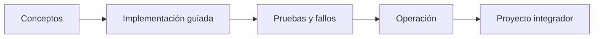

# Parte 14 — Plataformas avanzadas, capstones y carrera

> [← Parte 13](../part-13-multicloud-hybrid-disaster-recovery/README.md) · [Índice completo](../README.md) · [Parte 15 →](../part-15-systems-architecture-engineering/README.md)

**📥 Descargar:** [Esta parte en PDF](../../site/downloads/partes/manual-parte-14-advanced-platform-capstones-career.pdf) · [Manual integral](../../site/downloads/multi-cloud-engineering-manual-v2.0.pdf)

**Nivel:** experto-frontera · **Clases:** 12 · **Duración sugerida:** 6–8 semanas

Integrar tecnología, operación, gobierno y comunicación en evidencia profesional.

## Resultados de la parte

Al completar esta parte podrás explicar el dominio con lenguaje independiente del proveedor,
implementar sus mecanismos esenciales, diagnosticar fallos y defender decisiones mediante
evidencia, costo, seguridad y objetivos de confiabilidad.

## Modelo mental

El nivel experto no consiste en conocer más productos, sino en formular mejores preguntas, validar supuestos y sostener decisiones frente a costo, riesgo y operación.

## Secuencia

## Clases

| ID | Clase | Laboratorio | Horas |
|---:|---|---|---:|
| 169 | [Landing zones empresariales y vending de cuentas](169-landing-zones-empresariales-y-vending-de-cuentas/README.md) | `governance` | 4 |
| 170 | [Gobierno federado y policy as code a escala](170-gobierno-federado-y-policy-as-code-a-escala/README.md) | `governance` | 4 |
| 171 | [Platform as a Product y roadmap de capacidades](171-platform-as-a-product-y-roadmap-de-capacidades/README.md) | `platform` | 4 |
| 172 | [Modelo operativo FinOps y economía unitaria](172-modelo-operativo-finops-y-economia-unitaria/README.md) | `finops` | 4 |
| 173 | [Madurez SRE y confiabilidad organizacional](173-madurez-sre-y-confiabilidad-organizacional/README.md) | `sre` | 4 |
| 174 | [Arquitectura de seguridad cloud empresarial](174-arquitectura-de-seguridad-cloud-empresarial/README.md) | `security` | 4 |
| 175 | [Workloads de IA, GPU, datos y MLOps multi-cloud](175-workloads-de-ia-gpu-datos-y-mlops-multi-cloud/README.md) | `ai` | 4 |
| 176 | [Edge, IoT y procesamiento desconectado](176-edge-iot-y-procesamiento-desconectado/README.md) | `edge` | 4 |
| 177 | [Soberanía digital y confidential computing](177-soberania-digital-y-confidential-computing/README.md) | `security` | 4 |
| 178 | [Capstone: descubrimiento y diseño](178-capstone-descubrimiento-y-diseno/README.md) | `capstone` | 8 |
| 179 | [Capstone: implementación y operación](179-capstone-implementacion-y-operacion/README.md) | `capstone` | 8 |
| 180 | [Capstone: defensa, portafolio y plan profesional](180-capstone-defensa-portafolio-y-plan-profesional/README.md) | `capstone` | 8 |

## Evaluación de la parte

- 35 % laboratorios y evidencia reproducible.
- 25 % retos verificables.
- 20 % decisiones y ADR.
- 10 % seguridad, confiabilidad y costo.
- 10 % proyecto integrador de la parte.

Se aprueba con 80 % de clases en nivel B o superior y el proyecto integrador reproducible.

## Pauta bibliográfica

- Team Topologies — Skelton y Pais.
- Accelerate — Forsgren, Humble y Kim.
- Fundamentals of Software Architecture — Richards y Ford.
