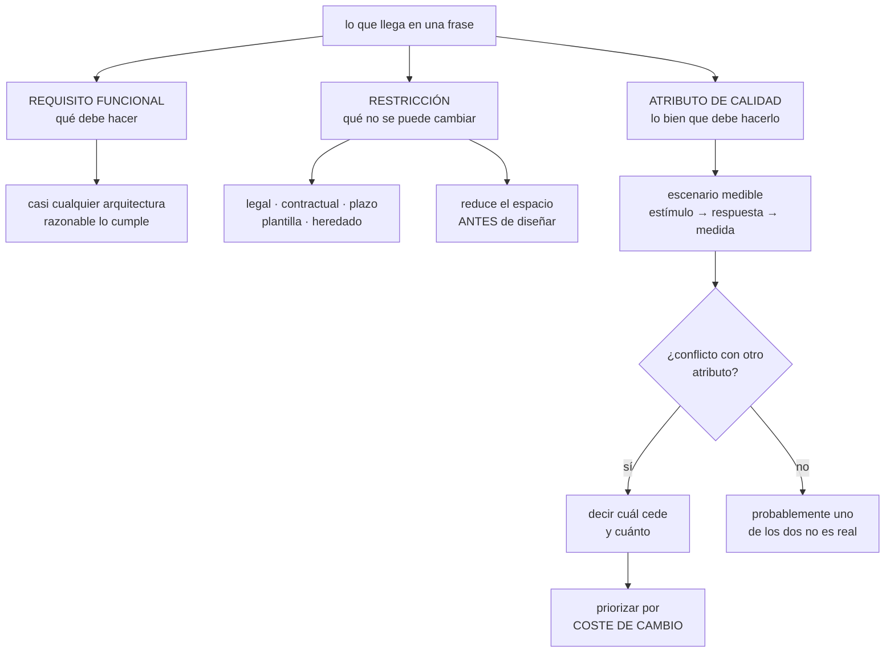

# 181 — Requisitos funcionales, restricciones y atributos de calidad

> [← Clase anterior](../../part-14-advanced-platform-capstones-career/180-capstone-defensa-portafolio-y-plan-profesional/README.md) · [Índice de la parte](../README.md) · [Clase siguiente →](../../part-15-systems-architecture-engineering/182-contexto-contenedores-componentes-y-codigo-con-c4/README.md)

**Parte:** 15 — Arquitectura de sistemas e ingeniería de requisitos<br>
**Nivel:** intermedio-avanzado · **Horas estimadas:** 4<br>
**Laboratorio:** `architecture` · **Estado:** `EXECUTABLE_CORE`

## 🎯 Propósito

Separar tres cosas que casi siempre llegan mezcladas en la misma frase: lo que el sistema debe hacer, lo que lo condiciona sin negociación posible, y lo bien que debe hacerlo. La distinción no es académica: los requisitos funcionales casi nunca deciden la arquitectura, las restricciones la limitan antes de empezar, y los atributos de calidad son los que la determinan y los que se pagan todos los meses.

## 📚 Resultados de aprendizaje

Al finalizar podrás:

1. **Distinguir** requisito funcional, restricción y atributo de calidad.
2. **Escribir** atributos de calidad como escenarios medibles y no como adjetivos.
3. **Detectar** las restricciones reales, incluidas las que nadie declara.
4. **Resolver** los conflictos entre atributos diciendo cuál cede.
5. **Priorizar** por coste de cambio y no por importancia declarada.

## 🧩 Conceptos centrales

| Concepto | Comprensión verificable |
|---|---|
| `requisito funcional` | Lo que el sistema debe hacer. Casi cualquier arquitectura razonable puede cumplirlo. |
| `restricción` | Decisión ya tomada que no se puede cambiar: legal, contractual, de plazo, de plantilla o técnica heredada. |
| `atributo de calidad` | Lo bien que el sistema debe hacer lo que hace. Es lo que decide la arquitectura. |
| `escenario de calidad` | Forma medible de un atributo: estímulo, fuente, entorno, respuesta y medida de respuesta. |
| `conflicto entre atributos` | Situación en que mejorar uno empeora otro. Se resuelve diciendo cuál cede y cuánto. |
| `coste de cambio` | Lo que costaría revertir una decisión más tarde. Es el criterio de prioridad, no la importancia declarada. |

## 🧠 Modelo mental

Una arquitectura es un conjunto de decisiones sobre estructuras, interfaces y atributos de calidad, respaldadas por escenarios y evidencia.

Aplicado a esta clase, separa siempre cuatro planos: **intención** (qué necesita el usuario),
**configuración** (qué declaramos), **estado observado** (qué existe de verdad) y
**evidencia** (cómo sabemos que cumple). Confundirlos produce diseños que se ven correctos
en un diagrama pero fallan al operar.

## 🗺️ Flujo de razonamiento



## 📖 Desarrollo

### 1. Las tres cosas que llegan mezcladas

Una frase típica de arranque de proyecto contiene las tres, sin marcarlas:

```text
«necesitamos un sistema de reservas rápido, que aguante el Black
 Friday, en Azure porque ya tenemos el acuerdo, y para septiembre»

  sistema de reservas           REQUISITO FUNCIONAL
  rápido                        atributo de calidad, sin medir
  que aguante el Black Friday   atributo de calidad, sin medir
  en Azure, acuerdo firmado     RESTRICCIÓN
  para septiembre               RESTRICCIÓN
```

Y la observación que ordena todo lo demás:

```text
el requisito funcional casi nunca decide la arquitectura
→ «reservar una habitación» se puede hacer con un monolito,
  con veinte servicios o con una hoja de cálculo

lo que decide la arquitectura es
  cuántas reservas por segundo en el pico
  cuánto puede tardar
  cuánto puede estar caído
  cuánto cuesta cambiarlo dentro de dos años
```

**Las restricciones** merecen atención aparte porque reducen el espacio de diseño antes de empezar y porque la mitad no se declaran:

```text
DECLARADAS
  proveedor por contrato
  región por normativa                                  clase 177
  plazo con fecha externa (campaña, ley, cliente)
  presupuesto anual

NO DECLARADAS, y suelen pesar más
  el equipo son cuatro personas y dos se van en marzo
  nadie ha operado nunca una base distribuida
  el sistema heredado de facturación no se puede tocar
  hay una guardia y no habrá una segunda
  la organización no aprueba nada en agosto
```

Y la regla práctica:

```text
una restricción no se discute: se comprueba que es real
→ «tiene que ser Azure» → ¿contrato o costumbre?
→ «para septiembre» → ¿qué pasa el 1 de octubre si no está?

si la respuesta es «nada en concreto», no era una restricción
```

Y el error simétrico, más caro: **tratar como negociable algo que no lo es**. Un plazo legal o un requisito de residencia no cede porque el diseño sea elegante.

### 2. Atributos de calidad: del adjetivo al escenario

«Rápido», «escalable», «seguro» y «fiable» no son requisitos: son adjetivos. Un adjetivo no se puede cumplir ni incumplir, y por eso siempre se da por cumplido.

La forma útil es el **escenario**, con seis partes:

```text
FUENTE       quién o qué provoca el estímulo
ESTÍMULO     qué ocurre
ENTORNO      en qué condiciones (normal, pico, degradado)
ARTEFACTO    sobre qué parte del sistema
RESPUESTA    qué debe hacer el sistema
MEDIDA       con qué número se comprueba
```

Y el mismo requisito, antes y después:

```text
ANTES   «el buscador tiene que ser rápido»

DESPUÉS
  fuente      un usuario final desde la aplicación móvil
  estímulo    busca disponibilidad por ciudad y fechas
  entorno     pico de campaña, 3.000 búsquedas por segundo
  artefacto   servicio de búsqueda y su almacén
  respuesta   devuelve resultados o un mensaje de degradación
  medida      p99 ≤ 400 ms medido en el borde; sin errores 5xx
              por encima del 0,1 %
```

Y la diferencia práctica es que el segundo se puede probar, incumplir y discutir. El primero no.

**Los atributos que más decisiones cambian**, y por qué:

```text
MODIFICABILIDAD    lo que cuesta cambiar algo
  → es el único que se paga TODOS los meses
  → y el único que nadie escribe como escenario
  escenario: «añadir un método de pago nuevo debe poder hacerlo
              un equipo sin tocar el servicio de reservas, en
              menos de 5 días, sin coordinar despliegues»

DISPONIBILIDAD     cuánto puede estar caído, y cuánto se pierde
  → tiene techo por dependencias                       clase 185

RENDIMIENTO        latencia, caudal y su comportamiento cerca
                   del codo                            clase 186

SEGURIDAD          alcance desde cada punto de entrada  clase 133

OBSERVABILIDAD     cuánto se tarda en saber qué pasa
  escenario: «ante una subida de errores, un ingeniero de guardia
              debe poder identificar el servicio y el cambio
              responsable en menos de 10 minutos, sin acceso
              a producción»

OPERABILIDAD       cuánto cuesta operarlo con la plantilla real
COSTE              coste por unidad de negocio          clase 142
```

Y dos escenarios que casi nunca se escriben y que este programa ha demostrado que importan:

```text
RECUPERABILIDAD  «tras un borrado accidental de la tabla de
                  reservas, restaurar con pérdida ≤ 5 min y
                  servicio recuperado en ≤ 1 h, MEDIDO»  clase 166

DIAGNOSTICABILIDAD «un procedimiento de incidente debe poder
                  ejecutarlo alguien que no lo escribió»  ley 22
```

### 3. Los conflictos, y quién cede

Los atributos de calidad se estorban entre sí. Un documento que los lista todos como «altos» no ha decidido nada.

Los conflictos que aparecen siempre:

```text
DISPONIBILIDAD × CONSISTENCIA
  bajo partición hay que elegir                        clase 187
  → decidir POR OPERACIÓN, no para el sistema entero

RENDIMIENTO × MODIFICABILIDAD
  cada capa de indirección cuesta latencia
  cada atajo cuesta cambio futuro

SEGURIDAD × OPERABILIDAD
  cada control añade fricción; la fricción se rodea    ley 16

COSTE × DISPONIBILIDAD
  la segunda región cuesta aunque no se use            clase 164

RENDIMIENTO × COSTE
  el codo se aleja pagando                             clase 129

MODIFICABILIDAD × PLAZO
  el atajo entrega en septiembre y se paga en marzo
```

Y la forma de resolverlos que evita la discusión infinita:

```text
1. escribir los dos escenarios en conflicto, medidos
2. decir cuál cede y CUÁNTO cede, con número
3. decir quién lo decide, con nombre
4. y en qué condición se revisa

ejemplo
  «la disponibilidad del catálogo cede a favor del coste:
   99,5 % en lugar de 99,9 %, sin segunda región. Lo acepta
   la dirección de producto. Se revisa si el catálogo pasa a
   soportar reservas directas.»
```

Y una prueba de si el conflicto es real:

```text
si nadie cede, uno de los dos atributos no era real
→ o bien nadie ha medido lo que cuesta el que se declara alto
```

Y la asimetría que conviene tener presente:

```text
los atributos que se incumplen ruidosamente (latencia, caídas)
se corrigen pronto porque duelen
los que se incumplen en silencio (modificabilidad, recuperabilidad,
diagnosticabilidad) se descubren años después           ley 13
→ por eso hay que escribir escenarios precisamente de esos
```

### 4. Priorizar por coste de cambio

La priorización habitual —importancia declarada— produce documentos donde todo es crítico. La priorización útil usa otro eje:

```text
¿cuánto cuesta cambiar esta decisión dentro de un año?

CARO DE CAMBIAR, decidir con cuidado y pronto
  modelo de datos y quién escribe cada dato            ley 21
  clave de partición                                    clase 114
  frontera entre módulos o servicios                    clase 183
  modelo de consistencia por operación                  clase 187
  dominio de identidad                                  clase 159
  jerarquía de cuentas                                  clase 169
  contrato público de la API                            clase 188

BARATO DE CAMBIAR, decidir después y con datos
  tamaño de instancia
  lenguaje de un servicio interno
  proveedor de correo
  biblioteca de registro
  umbral de una alerta
```

Y la regla que se deriva:

```text
decide pronto y con cuidado lo caro de cambiar
decide tarde y con medidas lo barato
→ y no gastes la discusión al revés, que es lo habitual
```

**El documento mínimo de requisitos** que hace falta antes de diseñar, y que cabe en dos páginas:

```text
1. qué hace el sistema, en una lista corta
2. restricciones comprobadas, con la evidencia de que lo son
3. cinco a ocho escenarios de calidad medibles
   incluidos uno de modificabilidad y uno de recuperabilidad
4. conflictos declarados, con quién cede y cuánto
5. decisiones caras de cambiar, marcadas
6. lo que NO va a hacer el sistema
```

Y el punto 6 es el más útil y el que más se omite:

```text
decir lo que el sistema no hará evita
  el atributo de calidad que aparece en el mes seis
  la integración que nadie pidió y todos asumieron
  y la discusión de alcance sin árbitro
```

Y la lista de comprobación de la clase:

```text
☐ cada frase del encargo está clasificada en una de las tres
☐ cada restricción se ha comprobado: contrato, ley o fecha real
☐ están las restricciones no declaradas: plantilla, guardia, heredado
☐ ningún atributo de calidad es un adjetivo
☐ cada escenario tiene medida, punto de medida y entorno
☐ hay un escenario de modificabilidad
☐ hay uno de recuperabilidad y uno de diagnosticabilidad
☐ los conflictos dicen cuál cede, cuánto y quién lo acepta
☐ las decisiones caras de cambiar están marcadas
☐ está escrito lo que el sistema NO va a hacer
```

Y el cierre que enlaza con la clase siguiente: con requisitos, restricciones y atributos escritos, hace falta una forma de dibujar el sistema que sirva para discutirlos sin ahogarse en detalle. Es la materia de la clase 182.

## 🔬 Ejemplo trabajado

**Un equipo recibe el encargo de rehacer el sistema de reservas. Lo que sigue es la conversación de arranque, la clasificación de cada frase, los escenarios que salieron y los dos conflictos que hubo que resolver.**

**Lo que dijo negocio, literalmente, en la reunión de arranque:**

```text
1. «queremos que la gente pueda reservar y modificar sin llamar»
2. «tiene que ser rápido, la web actual es lentísima»
3. «no se puede caer en Black Friday como el año pasado»
4. «seguro, que estamos con datos de tarjetas»
5. «tiene que estar en octubre por la campaña de invierno»
6. «usad Azure, tenemos compromiso de consumo hasta 2028»
7. «que sea escalable, para crecer»
8. «y que podamos añadir productos nuevos rápido»
```

**La clasificación:**

```text
1  funcional        reservar y modificar en autoservicio
2  calidad          rendimiento, sin medir
3  calidad          disponibilidad en pico, sin medir
4  calidad          seguridad, sin medir
5  restricción      fecha externa — se comprueba
6  restricción      contractual — se comprueba
7  ruido            «escalable» sin cifra no dice nada
8  calidad          modificabilidad — la más importante y la
                    que iban a olvidar
```

**Comprobación de las restricciones**, que cambió una de las dos:

```text
5  «octubre por la campaña»
   ¿qué pasa el 1 de noviembre si no está?
   → la campaña se lanza igual con el sistema actual, pero se
     pierde la promoción cruzada: unos 190.000 € de margen
   → ES una restricción real, con coste conocido

6  «Azure hasta 2028»
   → contrato con compromiso de consumo, penalización si no se
     alcanza. Real y no negociable.
   → efecto: descarta comparar proveedores; NO descarta que
     el equipo diseñe portable donde salga barato    clase 158
```

Y dos restricciones no declaradas que aparecieron al preguntar:

```text
  el equipo son 5 personas, y 2 están al 50 % en el heredado
  no hay guardia nocturna y no la va a haber este año
  → esto elimina de la mesa cualquier diseño que exija
    intervención humana de madrugada
```

**Los siete escenarios que se escribieron.**

```text
QA-1  RENDIMIENTO
  un usuario móvil busca disponibilidad, en pico de campaña
  (3.000 búsquedas/s), y recibe resultados
  medida   p99 ≤ 400 ms en el borde; errores 5xx ≤ 0,1 %

QA-2  DISPONIBILIDAD
  el flujo de reserva sigue aceptando reservas durante el pico
  aunque el servicio de recomendaciones esté caído
  medida   99,9 % mensual sobre el flujo de reserva;
           las recomendaciones son dependencia blanda

QA-3  MODIFICABILIDAD
  producto quiere añadir un método de pago nuevo
  medida   un equipo lo entrega en ≤ 5 días laborables, sin
           modificar el servicio de reservas y sin coordinar
           despliegue con otros equipos

QA-4  SEGURIDAD
  un atacante obtiene la credencial del servicio de búsqueda
  medida   alcance limitado al índice de búsqueda; sin acceso
           a datos de pago ni a la base de reservas;
           detectado en ≤ 15 min

QA-5  RECUPERABILIDAD
  un despliegue borra por error la tabla de reservas
  medida   restaurar con pérdida ≤ 5 min y servicio en ≤ 1 h,
           MEDIDO en un ensayo antes de salir a producción

QA-6  DIAGNOSTICABILIDAD
  suben los errores en el flujo de pago un martes a las 03:00
  medida   el ingeniero de guardia identifica servicio y cambio
           responsable en ≤ 10 min, desde el móvil, sin acceso
           de escritura a producción

QA-7  COSTE
  el tráfico crece un 40 % en campaña
  medida   el coste por reserva no sube más de un 10 %
```

Y dos observaciones sobre esta lista:

```text
QA-3 no lo pidió nadie con esas palabras: salió de «añadir
  productos nuevos rápido», que es la frase que más arquitectura
  decide y la que menos se escribe

QA-6 salió de la restricción no declarada: sin guardia nocturna,
  el diagnóstico tiene que ser posible desde el móvil, y eso
  condiciona la telemetría desde el primer día        clase 121
```

**Los dos conflictos, resueltos con nombre y número.**

```text
CONFLICTO 1   QA-1 (p99 ≤ 400 ms) × QA-3 (modificabilidad)

  el camino rápido sería una consulta que junta reservas,
  precios y disponibilidad en una sola base
  el camino modificable separa los tres, y añade una llamada

  cede   QA-1, de 400 a 500 ms de p99
  motivo el usuario no distingue 400 de 500; el equipo sí
         distingue 5 días de 6 semanas para añadir un producto
  acepta la dirección de producto
  revisa si la medida en el borde supera 700 ms

CONFLICTO 2   QA-2 (99,9 %) × QA-7 (coste por reserva)

  99,9 % en el flujo de reserva exigía segunda región activa
  el cálculo de dependencias daba un techo de 99,82 %  clase 185

  cede   QA-2, de 99,9 % a 99,7 %, con segunda región en frío
         y conmutación ensayada
  motivo la segunda región activa costaba 6.400 €/mes para
         ganar 0,2 puntos; el coste de la indisponibilidad
         medido en el histórico era de 1.900 €/mes
  acepta la dirección de tecnología
  revisa si el negocio de empresa (contratos con penalización)
         supera el 15 % de los ingresos
```

**Las decisiones marcadas como caras de cambiar:**

```text
quién escribe la reserva                        ← una sola cosa
clave de partición de reservas                  ← fecha + destino
frontera entre reservas, precios y catálogo
consistencia del inventario                     ← fuerte al reservar
contrato público de la API móvil
```

Y **lo que el sistema no va a hacer**, escrito para evitar la discusión del mes seis:

```text
no sustituye a facturación, que sigue en el heredado
no gestiona la atención al cliente
no soporta reservas de grupo (más de 9 habitaciones)
no tiene aplicación de escritorio propia
no se internacionaliza más allá de ES y PT en esta fase
```

**La lección que esta clase deja para la siguiente**: de las ocho frases del encargo, una era funcional, dos eran restricciones, cuatro eran adjetivos que hubo que convertir en escenarios y una —«escalable»— no significaba nada. Y el escenario que más condicionó el diseño, QA-3, **no lo pidió nadie con esas palabras**: se dedujo de una frase suelta al final de la reunión.

## 🧪 Laboratorio guiado

Ejecuta desde la raíz:

```bash
python classes/part-15-systems-architecture-engineering/181-requisitos-funcionales-restricciones-y-atributos-de-calidad/lab.py
```

El laboratorio selecciona el motor de práctica **`architecture`** y produce
`lab_result.json`. El escenario, sus comprobaciones y el artefacto esperado corresponden a
esta clase; no requiere credenciales y deja explícito qué debe revalidarse en un sandbox real.

1. Lee `exercise.steps` y formula una predicción antes de ejecutar.
2. Ejecuta la práctica y verifica todos los elementos de `checks`.
3. Provoca el caso de `negative_test` y explica la señal observada.
4. Materializa `quality-attribute-scenarios` en `evidence/` usando la plantilla indicada.
5. Para proveedor real, sigue `sandbox.requires`, registra costo y ejecuta `destroy`.

### Evidencia esperada

El artefacto principal es un diagrama acompañado por decisiones y trade-offs. Además, la entrega debe incluir el comando ejecutado,
la salida estructurada y una conclusión que no exceda lo observado.

## 🏆 Reto verificable

Construye **`quality-attribute-scenarios`** para el caso CloudShop. Incluye una alternativa descartada,
un supuesto que pueda falsarse, una prueba de fallo y una decisión de rollback.

## ✅ Criterio de aceptación

- [ ] `lab.py` termina con código 0 y genera JSON válido.
- [ ] La entrega conecta al menos tres requisitos con mecanismos verificables.
- [ ] Existe una prueba positiva y una prueba negativa con evidencia.
- [ ] Seguridad, costo y operación aparecen como decisiones, no como anexos.
- [ ] Se declara una limitación y una condición que obligaría a revisar el diseño.
- [ ] Otra persona puede repetir el recorrido sin conocimiento tácito.

## ⚠️ Errores frecuentes

| Síntoma | Causa probable | Corrección |
|---|---|---|
| El documento de requisitos no ayuda a decidir nada | Solo contiene requisitos funcionales, que casi cualquier arquitectura cumple | Añade escenarios de calidad medibles; son los que deciden la arquitectura. |
| Todos los atributos figuran como «altos» y no se puede diseñar | No se declararon los conflictos ni quién cede | Escribe los pares en conflicto, di cuál cede, cuánto, quién lo acepta y cuándo se revisa. |
| Una supuesta restricción resulta ser una costumbre | No se comprobó si era contractual, legal o de fecha real | Pregunta qué ocurre si se incumple; si la respuesta es «nada en concreto», no era una restricción. |
| El diseño exige intervención humana de madrugada y no hay quien la haga | Se ignoraron las restricciones no declaradas: plantilla, guardia, heredado | Levanta explícitamente equipo, turnos y sistemas intocables antes de diseñar. |
| A los dos años cada cambio pequeño cuesta semanas | No se escribió ningún escenario de modificabilidad | Escribe uno con verbo, plazo y sin coordinación entre equipos, y prioriza por coste de cambio. |
| En el mes seis aparece un alcance que nadie había acordado | No se escribió lo que el sistema no iba a hacer | Incluye la lista de exclusiones en el documento de requisitos. |

## 🛡️ Seguridad, ética y costo

Trabaja con cuentas propias o sandboxes autorizados. No publiques secretos, identificadores
reales ni datos personales. Antes de crear recursos pagos define presupuesto, etiquetas y
comando de destrucción; después verifica que no queden recursos huérfanos. Los ejemplos
locales enseñan contratos, pero no certifican cumplimiento ni disponibilidad de producción.

## ❓ Preguntas de comprobación

1. ¿Por qué los requisitos funcionales casi nunca deciden la arquitectura?
2. ¿Cómo se comprueba que una restricción es real?
3. ¿Qué seis partes tiene un escenario de calidad?
4. ¿Qué atributo se paga todos los meses y casi nunca se escribe?
5. ¿Por qué se prioriza por coste de cambio y no por importancia declarada?

## 🔗 Referencias

- Bass, L., Clements, P. y Kazman, R. (2021). *Software Architecture in Practice*, 4.ª ed. — escenarios de atributos de calidad. <https://www.oreilly.com/library/view/software-architecture-in/9780136886051/>
- SEI (2006). *Quality Attribute Workshops*, 3.ª ed. <https://insights.sei.cmu.edu/library/quality-attribute-workshops-qaws-third-edition/>
- Ford, N., Parsons, R. y Kua, P. (2017). *Building Evolutionary Architectures* — características arquitectónicas y su priorización. <https://www.oreilly.com/library/view/building-evolutionary-architectures/9781491986356/>
- ISO/IEC 25010 — modelo de calidad de producto software. <https://www.iso.org/standard/78176.html>
- AWS (2025). *Well-Architected Framework* — atributos y compromisos entre pilares. <https://docs.aws.amazon.com/wellarchitected/latest/framework/welcome.html>
- Documentación oficial vigente del servicio implementado; registra URL y fecha de consulta.

---

> [Evaluación](assessment.md) · [Contrato de clase](lesson.yaml) · [Índice de la parte](../README.md)
