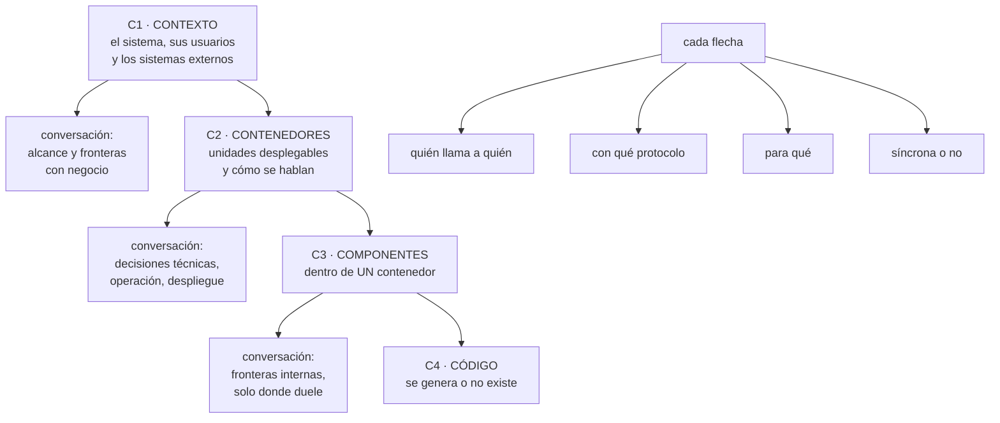
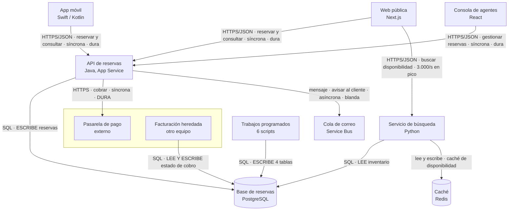

# 182 — Contexto, contenedores, componentes y código con C4

> [← Clase anterior](../../part-15-systems-architecture-engineering/181-requisitos-funcionales-restricciones-y-atributos-de-calidad/README.md) · [Índice de la parte](../README.md) · [Clase siguiente →](../../part-15-systems-architecture-engineering/183-acoplamiento-cohesion-modularidad-y-fronteras/README.md)

**Parte:** 15 — Arquitectura de sistemas e ingeniería de requisitos<br>
**Nivel:** intermedio-avanzado · **Horas estimadas:** 4<br>
**Laboratorio:** `architecture` · **Estado:** `EXECUTABLE_CORE`

## 🎯 Propósito

Dibujar un sistema de forma que sirva para discutir decisiones y no para decorar una presentación. El modelo C4 da cuatro niveles de zoom —contexto, contenedores, componentes y código— y su valor no está en las cajas sino en dos disciplinas: **un nivel por conversación** y **cada flecha dice quién llama a quién, con qué y por qué**. La clase enseña además qué dibujar en cada nivel, qué no, y cómo evitar que el diagrama envejezca mal.

## 📚 Resultados de aprendizaje

Al finalizar podrás:

1. **Elegir** el nivel de zoom adecuado a la conversación que se está teniendo.
2. **Dibujar** contexto y contenedores con el detalle justo y ninguno más.
3. **Anotar** las flechas con protocolo, dirección y motivo.
4. **Detectar** los diagramas que mienten: los que envejecen y los que ocultan.
5. **Mantener** los diagramas vivos con el mínimo esfuerzo posible.

## 🧩 Conceptos centrales

| Concepto | Comprensión verificable |
|---|---|
| `contexto (C1)` | El sistema como una caja, sus usuarios y los sistemas externos con los que habla. |
| `contenedor (C2)` | Unidad desplegable y ejecutable por separado: aplicación, servicio, base de datos, cola, función. |
| `componente (C3)` | Agrupación lógica dentro de un contenedor. Se dibuja solo cuando hace falta discutirla. |
| `código (C4)` | Clases y relaciones. Casi nunca se dibuja a mano: se genera o no existe. |
| `flecha anotada` | Relación con dirección, protocolo, motivo y, si importa, sincronía y volumen. |
| `diagrama vivo` | El que se actualiza porque alguien lo usa. El resto miente en cuanto cambia algo. |

## 🧠 Modelo mental

Una arquitectura es un conjunto de decisiones sobre estructuras, interfaces y atributos de calidad, respaldadas por escenarios y evidencia.

Aplicado a esta clase, separa siempre cuatro planos: **intención** (qué necesita el usuario),
**configuración** (qué declaramos), **estado observado** (qué existe de verdad) y
**evidencia** (cómo sabemos que cumple). Confundirlos produce diseños que se ven correctos
en un diagrama pero fallan al operar.

## 🗺️ Flujo de razonamiento



## 📖 Desarrollo

### 1. Cuatro niveles, una conversación cada uno

El error que arruina la mayoría de los diagramas es mezclar niveles: un dibujo con usuarios, servicios, tablas y clases a la vez no sirve para ninguna conversación.

```text
C1  CONTEXTO       ¿qué hay dentro y qué hay fuera?
    audiencia      negocio, dirección, equipos vecinos
    contiene       el sistema como UNA caja
                   personas que lo usan, con su papel
                   sistemas externos, con quién los opera
    NO contiene    tecnologías, bases de datos, colas

C2  CONTENEDORES   ¿de qué piezas desplegables consta?
    audiencia      el equipo, operación, seguridad
    contiene       aplicaciones, servicios, almacenes, colas
                   la tecnología de cada uno
                   las relaciones, anotadas
    NO contiene    clases, capas internas, detalles de esquema

C3  COMPONENTES    ¿cómo está organizado ESTE contenedor?
    audiencia      quien va a tocarlo
    se dibuja      solo cuando hay una discusión de frontera
    NO se dibuja   «por completitud», para todos los servicios

C4  CÓDIGO         clases y relaciones
    se genera desde el código, o no se hace
```

Y la regla que ahorra la mitad del trabajo:

```text
casi todo el valor está en C1 y C2
C3 solo donde hay una decisión que discutir
C4 casi nunca
```

**Qué es un contenedor y qué no**, porque es donde más se confunde:

```text
SÍ es contenedor          se despliega y ejecuta por separado
  una aplicación móvil
  una API
  un trabajo programado
  una base de datos
  una cola o un tema
  un almacén de objetos con lógica asociada

NO es contenedor
  una biblioteca compartida
  un módulo interno
  una capa
  un «dominio»
```

Y una prueba práctica: **si no se puede reiniciar por separado, no es un contenedor.**

### 2. Las flechas son el contenido

Las cajas se adivinan; las flechas no. Un diagrama con cajas correctas y flechas sin anotar no dice nada que no supiéramos.

Cada relación lleva, como mínimo:

```text
DIRECCIÓN    quién inicia la llamada
             ← no «se comunican», que oculta el acoplamiento
PROTOCOLO    HTTPS/JSON, gRPC, SQL, mensaje en cola
MOTIVO       «para consultar disponibilidad», no «datos»
```

Y cuando importa, tres anotaciones más que cambian decisiones:

```text
SÍNCRONA O NO      una llamada síncrona hereda la disponibilidad
                   del llamado                          clase 185
DURA O BLANDA      ¿el llamante sigue funcionando sin ella?
VOLUMEN            peticiones por segundo, o por operación
                   ← revela las consultas por elemento   clase 124
```

Y una anotación que este programa ha demostrado que vale más que todas:

```text
¿QUIÉN ESCRIBE?
  marcar en el diagrama qué contenedor ESCRIBE cada almacén
  → si hay dos flechas de escritura al mismo almacén, hay
    acoplamiento oculto y el diagrama acaba de encontrarlo  ley 21
```

Y el error de dirección más caro:

```text
dibujar «A ↔ B» porque «se hablan»
→ esconde quién depende de quién
→ y por tanto esconde qué se cae cuando cae uno
```

**Lo que un diagrama de contenedores debe permitir responder sin preguntar a nadie:**

```text
¿qué se cae si cae esto?
¿por dónde entra el tráfico externo?
¿dónde vive cada dato y quién lo escribe?
¿qué cruza una frontera de red o de cuenta?
¿qué es síncrono en el camino crítico?
¿qué se despliega junto y qué por separado?
```

Y si no las responde, el diagrama es decorativo por muy bonito que sea.

### 3. Los diagramas que mienten

Hay tres formas de mentir con un diagrama correcto, y todas son frecuentes:

```text
1. EL QUE ENVEJECIÓ
   se dibujó al empezar y nadie lo tocó
   → miente en cuanto se añade un servicio
   señal   no coincide con lo que hay desplegado

2. EL QUE OCULTA
   omite lo feo: el trabajo programado sin dueño, la conexión
   directa a la base del heredado, el acceso manual
   → y esas son precisamente las piezas que causan incidentes
   señal   el diagrama es más limpio que la realidad

3. EL QUE DIBUJA EL DESEO
   representa la arquitectura objetivo como si fuese la actual
   → y las decisiones se toman sobre algo que no existe
   señal   nadie sabe decir qué parte ya está
```

Y la disciplina que los evita:

```text
marcar SIEMPRE el estado de cada elemento
  existe · en construcción · previsto · a retirar

y tener dos diagramas cuando haga falta, nunca uno mezclado
  ACTUAL   lo que hay hoy, con lo feo incluido
  OBJETIVO lo que se quiere, con fecha
```

**Cómo mantenerlos vivos** sin que se convierta en una tarea que nadie hace:

```text
el diagrama vive en el repositorio, como texto
  → mermaid, PlantUML o similar; se revisa en el mismo cambio

se actualiza en el cambio que lo invalida, no «luego»
  → si un cambio añade un contenedor y no toca el diagrama,
    la revisión lo pide

se contrasta contra la realidad de vez en cuando
  → el inventario de recursos y el mapa de dependencias
    observadas dicen la verdad                          clase 122
  → y lo que aparezca en el mapa y no en el diagrama es
    exactamente lo que hay que mirar                    ley 15
```

Y el contraste automático, que es barato y encuentra mucho:

```text
lista de servicios desplegados      vs   contenedores del C2
dependencias observadas             vs   flechas del C2
almacenes con más de un escritor    vs   flechas de escritura
→ las diferencias son hallazgos, no errores del diagrama
```

### 4. Cuándo dibujar y cuándo no

Dibujar tiene coste, y hacerlo por costumbre produce documentación que nadie lee.

```text
DIBUJA CUANDO
  hay que decidir una frontera                          clase 183
  hay que explicar el alcance a alguien de fuera
  entra gente nueva y hay que orientarla
  se discute qué se cae si cae algo                     clase 185
  se revisa la seguridad y hace falta ver el alcance    clase 189
  se prepara una migración

NO DIBUJES
  «para tener documentación»
  el C3 de todos los servicios
  el C4 a mano
  lo que el código ya dice mejor
```

Y una forma de usar los niveles que funciona bien en reuniones:

```text
empieza SIEMPRE en C1, aunque todos lo conozcan
  → alinea el alcance en dos minutos y evita media hora de
    malentendido
baja a C2 y quédate ahí
  → es el nivel donde se toman casi todas las decisiones
baja a C3 solo si la discusión lo pide, y solo del contenedor
  en cuestión
```

Y dos vistas complementarias que no son C4 y suelen faltar:

```text
VISTA DE DESPLIEGUE   dónde corre cada contenedor: cuenta,
                      región, zona, red                 clase 169
                      → responde «¿qué cae si cae una zona?»

VISTA DE DATOS        quién escribe y quién lee cada almacén
                      → responde «¿dónde está el acoplamiento?»
```

Y la lista de comprobación de la clase:

```text
☐ cada diagrama tiene un solo nivel de zoom
☐ el C1 no contiene tecnologías
☐ cada elemento del C2 se despliega por separado
☐ toda flecha tiene dirección, protocolo y motivo
☐ las llamadas síncronas del camino crítico están marcadas
☐ está marcado quién ESCRIBE cada almacén
☐ no hay ninguna flecha bidireccional sin explicar
☐ cada elemento tiene estado: existe, previsto o a retirar
☐ actual y objetivo están separados
☐ el diagrama está en el repositorio, como texto
☐ se ha contrastado con las dependencias observadas
```

Y el cierre que enlaza con la clase siguiente: el diagrama de contenedores hace visibles las fronteras, pero no dice si están bien puestas. Decidir dónde va cada frontera —y por qué el criterio no es funcional— es la materia de la clase 183.

## 🔬 Ejemplo trabajado

**El equipo de reservas de la clase 181 dibuja su sistema actual antes de rediseñarlo. Lo que sigue es el C1, el C2 con las flechas anotadas, el contraste contra la realidad —que encontró cinco cosas que no estaban en el dibujo— y el único C3 que se dibujó.**

**C1 · Contexto.** Una caja, cuatro actores, tres sistemas externos:

```text
PERSONAS
  Cliente final           reserva y modifica
  Agente de call center   reserva por teléfono y resuelve
  Gestor de hotel         actualiza inventario y precios

SISTEMA
  [Plataforma de reservas]

EXTERNOS
  Pasarela de pago        externa, contrato con SLA de 99,95 %
  Facturación heredada    interna, otro equipo, no se toca
  Proveedor de correo     externo
```

Y una decisión de alcance que el C1 dejó clara en dos minutos:

```text
facturación está FUERA de la caja
→ y por tanto no se rediseña, se integra
→ negocio creía que entraba en el proyecto           clase 181
```

**C2 · Contenedores, tal como estaba antes del rediseño.**



Y lo que el diagrama hizo evidente en cuanto se anotó quién escribe:

```text
tres contenedores ESCRIBEN la base de reservas
  la API, los trabajos programados y facturación heredada
→ acoplamiento por escritura, invisible hasta dibujarlo   ley 21
→ y explica por qué cualquier cambio de esquema requería
  coordinar con un equipo que no participa en el proyecto

el pago es una dependencia DURA y síncrona en el camino de
reserva
→ el techo de disponibilidad del flujo no puede superar el
  99,95 % de la pasarela                                clase 185
```

**El contraste contra la realidad**, hecho con el inventario de recursos y el mapa de dependencias observadas:

```text
EN LA REALIDAD Y NO EN EL DIBUJO
  1  un segundo caché, en una máquina virtual sin etiquetas,
     usado por la consola de agentes
  2  un trabajo programado nº 7 que nadie recordaba: exportaba
     un CSV a un almacén compartido con marketing
  3  una conexión directa de la herramienta de informes a la
     réplica de lectura
  4  la app móvil llamaba también a un endpoint antiguo
     (api-v1) que se creía retirado
  5  la pasarela de pago llamaba de vuelta a un webhook que
     no estaba dibujado

EN EL DIBUJO Y NO EN LA REALIDAD
  0
```

Y el hallazgo más caro fue el 5, por lo que implicaba:

```text
el webhook de la pasarela era un punto de ENTRADA externo
no dibujado, y por tanto
  → no estaba en el modelo de amenazas               clase 189
  → no tenía alerta de ausencia                       ley 13
  → y cuando falló en marzo, 41 pagos quedaron cobrados
    y sin reserva confirmada durante 3 días
```

**El único C3 que se dibujó**, y por qué se dibujó ese:

```text
motivo   se discutía si el cálculo de precios debía salir de
         la API de reservas a su propio contenedor

C3 de la API de reservas
  Controlador de reservas       entrada HTTP
  Motor de disponibilidad       consulta inventario
  Calculadora de precios        reglas, promociones, impuestos
  Coordinador de pago           habla con la pasarela
  Repositorio de reservas       único que escribe la tabla
  Publicador de eventos         escribe en la cola

lo que la discusión necesitaba ver
  la calculadora de precios NO tocaba el repositorio
  la llamaban 3 de los 6 componentes
  y cambiaba 4 veces al mes, frente a 1 vez al trimestre
  el resto
```

Y la decisión que salió de ese C3, con el criterio de la clase siguiente:

```text
sale a su propio contenedor
motivo   ritmo de cambio muy distinto y sin escritura compartida
coste de cambio si nos equivocamos   medio: una llamada más
         y volver a juntarlo es mecánico
```

**El diagrama objetivo**, marcado con estado para no mentir:

```text
API de reservas               existe
Servicio de precios           previsto        Q4
Servicio de catálogo          en construcción
Trabajos programados          a retirar       4 de 7
endpoint api-v1               a retirar       tras migrar la app
acceso de facturación a la BD a retirar       sustituir por evento
segundo caché sin etiquetas   a retirar       inmediato
```

**La lección que esta clase deja**: el diagrama que el equipo tenía era correcto y llevaba dos años sin tocarse. Al contrastarlo contra las dependencias observadas aparecieron **cinco elementos reales que no estaban dibujados y ninguno dibujado que no existiera**, y el más peligroso —un punto de entrada externo— llevaba tres años funcionando sin figurar en ningún sitio. El diagrama no era falso: era **incompleto en la dirección que importa**, que siempre es la misma.

## 🧪 Laboratorio guiado

Ejecuta desde la raíz:

```bash
python classes/part-15-systems-architecture-engineering/182-contexto-contenedores-componentes-y-codigo-con-c4/lab.py
```

El laboratorio selecciona el motor de práctica **`architecture`** y produce
`lab_result.json`. El escenario, sus comprobaciones y el artefacto esperado corresponden a
esta clase; no requiere credenciales y deja explícito qué debe revalidarse en un sandbox real.

1. Lee `exercise.steps` y formula una predicción antes de ejecutar.
2. Ejecuta la práctica y verifica todos los elementos de `checks`.
3. Provoca el caso de `negative_test` y explica la señal observada.
4. Materializa `c4-model` en `evidence/` usando la plantilla indicada.
5. Para proveedor real, sigue `sandbox.requires`, registra costo y ejecuta `destroy`.

### Evidencia esperada

El artefacto principal es un diagrama acompañado por decisiones y trade-offs. Además, la entrega debe incluir el comando ejecutado,
la salida estructurada y una conclusión que no exceda lo observado.

## 🏆 Reto verificable

Construye **`c4-model`** para el caso CloudShop. Incluye una alternativa descartada,
un supuesto que pueda falsarse, una prueba de fallo y una decisión de rollback.

## ✅ Criterio de aceptación

- [ ] `lab.py` termina con código 0 y genera JSON válido.
- [ ] La entrega conecta al menos tres requisitos con mecanismos verificables.
- [ ] Existe una prueba positiva y una prueba negativa con evidencia.
- [ ] Seguridad, costo y operación aparecen como decisiones, no como anexos.
- [ ] Se declara una limitación y una condición que obligaría a revisar el diseño.
- [ ] Otra persona puede repetir el recorrido sin conocimiento tácito.

## ⚠️ Errores frecuentes

| Síntoma | Causa probable | Corrección |
|---|---|---|
| El diagrama no sirve para ninguna conversación | Mezcla niveles: usuarios, servicios, tablas y clases a la vez | Un nivel por diagrama; empieza en C1, decide en C2 y baja a C3 solo donde haya discusión. |
| El dibujo no dice qué se cae si cae algo | Las flechas no tienen dirección, sincronía ni dureza | Anota quién inicia, con qué protocolo, para qué, si es síncrona y si es dura o blanda. |
| Un cambio de esquema requiere coordinar con equipos ajenos y nadie sabía por qué | El diagrama no marcaba quién escribe cada almacén | Marca las flechas de escritura; dos escritores en un almacén son acoplamiento oculto. |
| El diagrama es más limpio que la realidad | Omite lo feo: trabajos sin dueño, accesos directos, endpoints antiguos | Contrástalo con el inventario y las dependencias observadas; lo que sobre en la realidad es el hallazgo. |
| Se toman decisiones sobre una arquitectura que no existe | El diagrama objetivo se presenta como el actual | Separa actual y objetivo, y marca el estado de cada elemento: existe, previsto o a retirar. |
| Los diagramas quedan obsoletos a las semanas | Viven en una herramienta aparte y actualizarlos es una tarea suelta | Guárdalos como texto en el repositorio y exige actualizarlos en el mismo cambio que los invalida. |

## 🛡️ Seguridad, ética y costo

Trabaja con cuentas propias o sandboxes autorizados. No publiques secretos, identificadores
reales ni datos personales. Antes de crear recursos pagos define presupuesto, etiquetas y
comando de destrucción; después verifica que no queden recursos huérfanos. Los ejemplos
locales enseñan contratos, pero no certifican cumplimiento ni disponibilidad de producción.

## ❓ Preguntas de comprobación

1. ¿Qué prueba decide si algo es un contenedor?
2. ¿Qué debe llevar como mínimo cada flecha, y qué tres anotaciones más cambian decisiones?
3. ¿Cuáles son las tres formas de mentir con un diagrama correcto?
4. ¿Cómo se contrasta un diagrama contra la realidad y qué significan las diferencias?
5. ¿Cuándo merece la pena dibujar un C3?

## 🔗 Referencias

- Brown, S. (2025). *The C4 model for visualising software architecture*. <https://c4model.com/>
- Brown, S. (2019). *Software Architecture for Developers* — niveles de abstracción y documentación mínima útil. <https://leanpub.com/software-architecture-for-developers>
- Clements, P. y otros (2010). *Documenting Software Architectures*, 2.ª ed. — vistas y su audiencia. <https://www.oreilly.com/library/view/documenting-software-architectures/9780132488617/>
- Structurizr (2025). *Diagrams as code* — diagramas versionados junto al código. <https://structurizr.com/>
- Mermaid (2025). *Flowchart syntax* — diagramas como texto en el repositorio. <https://mermaid.js.org/syntax/flowchart.html>
- Documentación oficial vigente del servicio implementado; registra URL y fecha de consulta.

---

> [Evaluación](assessment.md) · [Contrato de clase](lesson.yaml) · [Índice de la parte](../README.md)
