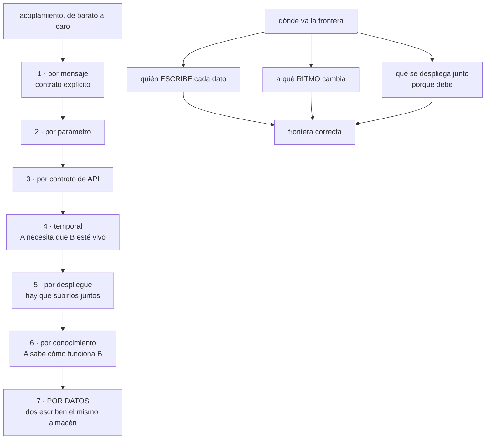

# 183 — Acoplamiento, cohesión, modularidad y fronteras

> [← 182 · Contexto, contenedores, componentes y código con C4](../../part-15-systems-architecture-engineering/182-contexto-contenedores-componentes-y-codigo-con-c4/README.md) · [Índice de la parte](../README.md) · [184 · Arquitectura monolítica, modular y de microservicios →](../../part-15-systems-architecture-engineering/184-arquitectura-monolitica-modular-y-de-microservicios/README.md)

**Parte:** 15 — Arquitectura de sistemas e ingeniería de requisitos<br>
**Nivel:** intermedio-avanzado · **Horas estimadas:** 4<br>
**Laboratorio:** `architecture` · **Estado:** `EXECUTABLE_CORE`

## 🎯 Propósito

Decidir dónde va cada frontera, que es la decisión más cara de cambiar de todas las que se toman. La clase define acoplamiento y cohesión con precisión suficiente para discutirlos, enumera las siete formas de acoplamiento por orden de coste, y sostiene con la evidencia del programa que la frontera correcta la marca **quién escribe cada dato y a qué ritmo cambia cada cosa**, no la descomposición funcional que sale sola al mirar el organigrama.

## 📚 Resultados de aprendizaje

Al finalizar podrás:

1. **Distinguir** los siete tipos de acoplamiento y ordenarlos por coste.
2. **Medir** la cohesión de un módulo con criterios comprobables.
3. **Situar** fronteras usando escritura de datos y ritmo de cambio.
4. **Reconocer** las fronteras mal puestas por sus síntomas.
5. **Decidir** cuándo mover una frontera y cuánto cuesta hacerlo.

## 🧩 Conceptos centrales

| Concepto | Comprensión verificable |
|---|---|
| `acoplamiento` | Medida de cuánto obliga un cambio en A a cambiar B. No es malo por sí mismo; lo caro es el tipo equivocado. |
| `cohesión` | Medida de cuánto pertenecen juntas las cosas de un módulo. Alta cohesión: cambian por el mismo motivo. |
| `acoplamiento por datos` | Dos módulos escriben el mismo almacén. El más caro y el más invisible. |
| `ritmo de cambio` | Frecuencia con que se modifica una parte. Partes con ritmos muy distintos no pertenecen al mismo módulo. |
| `frontera` | Línea que separa lo que se despliega, versiona y decide por separado. |
| `coste de mover una frontera` | Lo que cuesta cambiarla más tarde. Determina cuánto cuidado merece la decisión inicial. |

## 🧠 Modelo mental

Una arquitectura es un conjunto de decisiones sobre estructuras, interfaces y atributos de calidad, respaldadas por escenarios y evidencia.

Aplicado a esta clase, separa siempre cuatro planos: **intención** (qué necesita el usuario),
**configuración** (qué declaramos), **estado observado** (qué existe de verdad) y
**evidencia** (cómo sabemos que cumple). Confundirlos produce diseños que se ven correctos
en un diagrama pero fallan al operar.

## 🗺️ Flujo de razonamiento



## 📖 Desarrollo

### 1. Acoplamiento: siete tipos, por coste

Decir «hay que reducir el acoplamiento» no ayuda: todo sistema útil está acoplado. Lo que importa es **de qué tipo**, porque el coste varía en dos órdenes de magnitud.

```text
1  POR MENSAJE            A publica un evento; B lo consume
   coste de cambio        bajo; el contrato es explícito
   se rompe con           cambiar el esquema del evento  clase 148

2  POR PARÁMETRO         A llama a B pasando datos
   coste                  bajo

3  POR CONTRATO DE API   A depende de la forma de la API de B
   coste                  medio; gestionable con versiones

4  TEMPORAL              A necesita que B esté vivo AHORA
   coste                  medio-alto; hereda disponibilidad
   síntoma                una caída de B tira A               clase 185

5  POR DESPLIEGUE        hay que subir A y B a la vez
   coste                  alto; elimina la autonomía
   síntoma                «no puedo desplegar hasta que ellos»

6  POR CONOCIMIENTO      A sabe cómo funciona B por dentro
   coste                  alto; se rompe sin avisar
   síntoma                un cambio interno de B rompe A

7  POR DATOS             A y B escriben el mismo almacén
   coste                  el más alto de todos
   síntoma                nadie puede cambiar el esquema
   invisible              no aparece en el código de ninguno
```

Y la observación que este programa ha repetido desde la clase 147:

```text
los seis primeros son visibles: están en el código
el séptimo NO, y por eso sobrevive años                 ley 21
→ dos servicios «independientes» que escriben la misma
  tabla no son dos servicios: son uno mal repartido
```

Y una consecuencia práctica que se usa como regla de diseño:

```text
se puede convertir acoplamiento caro en barato
  7 → 1   un solo escritor, y los demás reciben eventos
  5 → 3   contrato versionado en vez de despliegue conjunto
  6 → 3   API explícita en vez de conocimiento interno
  4 → 1   asíncrono donde la operación lo permita   clase 118

y cada conversión cuesta latencia, consistencia o complejidad
→ no se hacen todas: se hacen donde el cambio duele
```

### 2. Cohesión: qué pertenece junto

La cohesión se explica mal con definiciones abstractas y bien con una pregunta:

```text
¿estas dos cosas cambian por el mismo motivo?

sí   pertenecen juntas
no   no, aunque traten del mismo sustantivo
```

Y el error clásico es agrupar por sustantivo:

```text
«todo lo de Cliente va en el servicio de Cliente»
  → datos de contacto        cambian por marketing
  → preferencias             cambian por producto
  → historial de pagos       cambian por finanzas
  → consentimientos          cambian por legal

cuatro motivos de cambio, cuatro equipos, un solo módulo
→ cada despliegue toca lo de los otros tres
```

**Los criterios de cohesión que se pueden comprobar**, no opinar:

```text
1. MOTIVO DE CAMBIO
   mira los últimos 50 cambios del módulo
   → si vienen de tres áreas distintas de negocio, no hay cohesión

2. RITMO DE CAMBIO
   mide cuántas veces al mes cambia cada parte
   → si una cambia 8 veces y otra 1 al trimestre, sepáralas

3. QUIÉN LOS PIDE
   si los cambios vienen de equipos distintos, la frontera
   está en el sitio equivocado                          ley 21

4. QUÉ SE ROMPE JUNTO
   si un fallo en una parte no afecta a la otra, no comparten
   destino y podrían separarse
```

Y una medida directa que se saca del historial y casi nadie mira:

```text
CAMBIOS ACOPLADOS
  ¿qué porcentaje de los cambios a A tocan también a B?

  > 60 %   A y B deberían estar juntos
  10-60 %  frontera dudosa, mírala
  < 10 %   frontera bien puesta

se calcula del historial del repositorio, en minutos
```

Y la asimetría que hay que recordar:

```text
demasiados módulos   coste de coordinación, latencia,
                     operación                       clase 184
demasiado pocos      coste de coordinación humana
                     y despliegues bloqueados
→ el óptimo no es «más pequeño»; es «cambia junto, va junto»
```

### 3. Dónde va la frontera de verdad

La descomposición funcional —reservas, pagos, catálogo— sale sola, y **casi siempre está a medio camino de la correcta**. Los tres criterios que la corrigen, por orden de fuerza:

```text
1. QUIÉN ESCRIBE CADA DATO                              ley 21
   un dato, un escritor
   → si dos módulos necesitan escribir lo mismo, o son uno
     solo o el dato está mal definido
   → este criterio, solo, coloca la mayoría de las fronteras

2. RITMO DE CAMBIO
   lo que cambia 8 veces al mes no vive con lo que cambia
   una vez al trimestre
   → aunque traten del mismo sustantivo

3. LO QUE DEBE FALLAR JUNTO
   si A no tiene sentido sin B, sepáralos con cuidado:
   estás creando acoplamiento temporal                  clase 185
```

Y tres criterios que se usan mucho y funcionan mal:

```text
EL ORGANIGRAMA
  produce fronteras que reflejan la empresa de hoy
  → y la empresa se reorganiza antes que el software
  → aunque la ley de Conway es real: si el organigrama y la
    frontera se pelean, gana el organigrama                ley 21

EL SUSTANTIVO DE NEGOCIO
  «Cliente», «Producto», «Pedido»
  → agrupa cosas que cambian por motivos distintos

EL TAMAÑO
  «que ningún servicio pase de N líneas»
  → optimiza una medida sin relación con el coste    ley 17
```

**Los síntomas de una frontera mal puesta**, que se detectan sin discutir:

```text
hay que desplegar dos cosas juntas para que funcione
un cambio pequeño requiere tocar tres repositorios
la mayoría de los cambios cruzan la frontera
dos equipos se bloquean en el mismo fichero
hay que preguntar a otro equipo qué significa un campo
dos servicios escriben el mismo almacén
un servicio hace una llamada por elemento a otro   clase 124
la frontera exige transacción distribuida          clase 149
```

Y el último es el más informativo:

```text
si mantener la corrección exige una transacción a través de
la frontera, la frontera está en el sitio equivocado
→ mueve la frontera, no añadas coordinación distribuida
```

**Cuándo mover una frontera y cuánto cuesta:**

```text
MOVER HACIA DENTRO (juntar dos módulos)   barato
  suele ser mecánico; se pierde autonomía

MOVER HACIA FUERA (separar uno en dos)    caro si hay datos
  si comparten almacén, hay que dividir datos, y eso es
  lo más caro que existe                              clase 147

REGLA PRÁCTICA
  ante la duda, EMPIEZA JUNTO y separa cuando el ritmo de
  cambio o el escritor lo exijan
  → juntar lo separado es más barato que separar lo junto
```

Y la lista de comprobación de la clase:

```text
☐ está identificado el tipo de acoplamiento de cada relación
☐ ningún almacén tiene más de un escritor
☐ se ha medido el porcentaje de cambios acoplados
☐ se ha medido el ritmo de cambio de cada parte
☐ ninguna frontera exige transacción distribuida
☐ ninguna frontera obliga a desplegar dos cosas juntas
☐ las fronteras no se copiaron del organigrama sin pensar
☐ se sabe el coste de mover cada frontera
☐ ante la duda, se empezó junto
```

Y el cierre que enlaza con la clase siguiente: sabiendo dónde van las fronteras, queda decidir cuántas unidades desplegables las materializan —una, unas pocas o muchas— y esa es una decisión distinta y con su propio coste. Es la materia de la clase 184.

### 4. Modularidad sin repartir en servicios

Una confusión frecuente y cara: **frontera no significa servicio**. Se puede tener modularidad estricta dentro de un solo despliegue, y suele ser la mejor opción durante años.

```text
LO QUE DA LA FRONTERA MODULAR (mismo despliegue)
  claridad de propiedad
  un escritor por dato
  contratos internos explícitos
  posibilidad de separar después

LO QUE AÑADE SEPARAR EN SERVICIOS
  despliegue independiente
  escalado independiente
  aislamiento de fallo
  y a cambio: red, latencia, consistencia eventual,
  operación, y coordinación                          clase 184
```

Y el modo de mantener fronteras dentro de un mismo despliegue, que es lo que las hace reales:

```text
cada módulo con su propio esquema o su propio conjunto de tablas
prohibida la consulta cruzada; se pide por la interfaz del módulo
el acceso a datos de otro módulo NO compila
  → paquetes internos, reglas de dependencia, análisis estático
cada módulo tiene dueño escrito
y sus cambios se revisan por ese dueño
```

Y la comprobación que dice si la frontera modular es real o decorativa:

```text
¿se podría sacar este módulo a su propio despliegue en una
semana, sin tocar los demás?

  sí   la frontera es real
  no   es una carpeta con un nombre bonito
```

Y una advertencia con evidencia de este programa:

```text
las fronteras que solo existen por convención se erosionan
→ alguien hace una consulta cruzada «solo esta vez»
→ y a los dos años hay 7                            clase 179
→ si no lo impide el compilador o la revisión, ocurrirá
```

## 🔬 Ejemplo trabajado

**El equipo de reservas decide dónde van sus fronteras. Lo que sigue es el análisis de acoplamiento con datos del repositorio, el rechazo de la descomposición que salía sola, y las cuatro fronteras que resultaron.**

**Punto de partida: la descomposición funcional obvia.**

```text
Reservas · Pagos · Catálogo · Precios · Clientes · Notificaciones
```

Y parecía correcta hasta que se miraron dos datos que están en el repositorio y no requieren opinión.

**Dato 1: cambios acoplados, últimos 12 meses.**

```text
pares que cambian juntos                    % de cambios
  Reservas × Pagos                                71 %
  Catálogo × Precios                              64 %
  Reservas × Notificaciones                        6 %
  Catálogo × Clientes                              3 %
  Precios × Reservas                              38 %
```

Y la lectura:

```text
Reservas y Pagos cambian juntos el 71 % de las veces
→ separarlos crea dos repositorios que hay que tocar a la vez
→ NO son dos módulos: son uno

Catálogo y Precios, 64 %
→ lo mismo

Precios × Reservas, 38 %
→ zona dudosa; hay que mirar por qué
```

**Dato 2: ritmo de cambio y origen de los cambios.**

```text
parte                cambios/mes   los pide
reglas de precios         9        producto y revenue
disponibilidad            1        operaciones
flujo de reserva          2        producto
coordinación de pago      1        finanzas
plantillas de aviso       6        marketing
datos de contacto         4        marketing
consentimientos           1        legal
```

Y aquí apareció la contradicción con el dato 1:

```text
Precios cambia 9 veces al mes; Catálogo, 1
→ el 64 % de cambios acoplados NO significa que pertenezcan
  juntos: significa que cada cambio de precio obligaba a tocar
  el catálogo
→ y al mirar por qué: los precios estaban GUARDADOS en la tabla
  de catálogo

el acoplamiento era del tipo 7, por datos, disfrazado
```

**Dato 3: quién escribe cada almacén, del diagrama de la clase 182.**

```text
tabla                     escritores
reservas                  API, trabajos programados, facturación
catálogo                  catálogo, precios
clientes                  API, importación de marketing
inventario                gestor de hoteles, trabajos programados
```

Y cuatro almacenes con más de un escritor, que es donde estaba el problema real.

**Las decisiones, con el criterio de la clase.**

```text
DECISIÓN 1   Reservas y Pagos van JUNTOS
  motivo     71 % de cambios acoplados; y la corrección exige
             transacción entre ambos
  alternativa descartada   separarlos con saga
  por qué    la compensación habría hecho invisible el fallo
             cuando el pago se confirma y la reserva no  ley 19
  coste de cambio si nos equivocamos   medio

DECISIÓN 2   Precios SALE de Catálogo
  motivo     9 cambios/mes frente a 1; equipos distintos
  cómo       catálogo deja de guardar el precio; precios tiene
             su propio almacén y publica un evento de cambio
  convierte  acoplamiento 7 → 1
  coste      alto: hay que migrar el dato       ← se hace pronto

DECISIÓN 3   Clientes NO se parte por sustantivo
  motivo     contacto (4/mes, marketing), consentimientos
             (1/mes, legal) y preferencias cambian por motivos
             distintos
  cómo       tres módulos con esquemas separados DENTRO del
             mismo despliegue, cada uno con dueño
  por qué no tres servicios   el tráfico no lo justifica y la
             operación costaría más que la autonomía que da
  coste de separarlos después   bajo: ya tienen esquema propio

DECISIÓN 4   Notificaciones queda separada
  motivo     6 % de cambios acoplados, y ya era asíncrona
  confirma   la frontera existente estaba bien puesta
```

**Los escritores, después:**

```text
tabla                     escritor único
reservas                  servicio de reservas y pagos
  facturación             → recibe evento, ya no escribe
  trabajos programados    → 4 retirados; 3 pasan por la API
catálogo                  servicio de catálogo
precios                   servicio de precios      ← nuevo
clientes.contacto         módulo de contacto
clientes.consentimientos  módulo de consentimientos
inventario                servicio de catálogo
  gestor de hoteles       → escribe por la API, no directo
```

**Cómo se hicieron reales las fronteras dentro del despliegue de clientes**, que es lo que evita que se erosionen:

```text
tres esquemas separados en la misma base
nadie consulta el esquema de otro módulo
  → usuario de base de datos por módulo, con permisos solo
    sobre su esquema; la consulta cruzada FALLA, no se detecta
    en revisión
reglas de dependencia en el análisis estático
cada módulo con dueño en el fichero de propiedad
```

Y la comprobación de la clase, aplicada:

```text
¿se podría sacar contacto a su propio despliegue en una semana?
  → sí: esquema propio, sin consultas cruzadas, contrato claro
  → la frontera es real
```

**Lo que costó equivocarse una vez.** La primera propuesta separaba Reservas y Pagos:

```text
se llegó a implementar la saga durante 3 semanas
se abandonó al hacer la prueba negativa: al fallar el paso de
confirmación, la compensación cancelaba el pago y el cliente
recibía dos correos contradictorios
coste del error                              3 semanas
cómo se detectó                              prueba negativa
qué lo habría evitado                        mirar el 71 % de
                                             cambios acoplados
                                             ANTES de diseñar
```

**La lección que esta clase deja**: dos datos que ya estaban en el repositorio —qué cambia junto y a qué ritmo— corrigieron una descomposición funcional que parecía obvia, y el acoplamiento más caro del sistema **no estaba en ninguna llamada**: estaba en que el precio vivía en la tabla del catálogo. Ningún diagrama de servicios lo habría mostrado.

## 🧪 Laboratorio guiado

Ejecuta desde la raíz:

```bash
python classes/part-15-systems-architecture-engineering/183-acoplamiento-cohesion-modularidad-y-fronteras/lab.py
```

El laboratorio selecciona el motor de práctica **`architecture`** y produce
`lab_result.json`. El escenario, sus comprobaciones y el artefacto esperado corresponden a
esta clase; no requiere credenciales y deja explícito qué debe revalidarse en un sandbox real.

1. Lee `exercise.steps` y formula una predicción antes de ejecutar.
2. Ejecuta la práctica y verifica todos los elementos de `checks`.
3. Provoca el caso de `negative_test` y explica la señal observada.
4. Materializa `module-map` en `evidence/` usando la plantilla indicada.
5. Para proveedor real, sigue `sandbox.requires`, registra costo y ejecuta `destroy`.

### Evidencia esperada

El artefacto principal es un diagrama acompañado por decisiones y trade-offs. Además, la entrega debe incluir el comando ejecutado,
la salida estructurada y una conclusión que no exceda lo observado.

## 🏆 Reto verificable

Construye **`module-map`** para el caso CloudShop. Incluye una alternativa descartada,
un supuesto que pueda falsarse, una prueba de fallo y una decisión de rollback.

## ✅ Criterio de aceptación

- [ ] `lab.py` termina con código 0 y genera JSON válido.
- [ ] La entrega conecta al menos tres requisitos con mecanismos verificables.
- [ ] Existe una prueba positiva y una prueba negativa con evidencia.
- [ ] Seguridad, costo y operación aparecen como decisiones, no como anexos.
- [ ] Se declara una limitación y una condición que obligaría a revisar el diseño.
- [ ] Otra persona puede repetir el recorrido sin conocimiento tácito.

## ⚠️ Errores frecuentes

| Síntoma | Causa probable | Corrección |
|---|---|---|
| Dos servicios «independientes» no pueden cambiar de esquema sin coordinarse | Acoplamiento por datos: ambos escriben el mismo almacén | Un escritor por dato; los demás reciben eventos. Convierte el acoplamiento tipo 7 en tipo 1. |
| Un cambio pequeño obliga a tocar tres repositorios | La frontera cruza justo por donde ocurren los cambios | Calcula el porcentaje de cambios acoplados del historial; por encima del 60 % esas partes van juntas. |
| Un módulo se despliega constantemente por culpa de una parte que cambia mucho | Se agrupó por sustantivo y no por motivo ni ritmo de cambio | Separa lo que cambia 8 veces al mes de lo que cambia una vez al trimestre, aunque compartan nombre. |
| Mantener la corrección exige una transacción distribuida | La frontera está en el sitio equivocado | Mueve la frontera en vez de añadir coordinación distribuida y compensaciones. |
| Las fronteras modulares se erosionan y aparecen consultas cruzadas | Solo existían por convención | Haz que la consulta cruzada falle: esquemas y usuarios de base separados, reglas de dependencia en el análisis estático. |
| Separar un módulo resulta muchísimo más caro de lo previsto | Compartía almacén y hay que dividir datos | Ante la duda empieza junto: juntar lo separado es más barato que separar lo junto. |

## 🛡️ Seguridad, ética y costo

Trabaja con cuentas propias o sandboxes autorizados. No publiques secretos, identificadores
reales ni datos personales. Antes de crear recursos pagos define presupuesto, etiquetas y
comando de destrucción; después verifica que no queden recursos huérfanos. Los ejemplos
locales enseñan contratos, pero no certifican cumplimiento ni disponibilidad de producción.

## ❓ Preguntas de comprobación

1. ¿Cuál de los siete tipos de acoplamiento es el más caro y por qué es invisible?
2. ¿Qué mide el porcentaje de cambios acoplados y cómo se obtiene?
3. ¿Por qué agrupar por sustantivo de negocio suele dar mala cohesión?
4. ¿Qué indica que una frontera está mal puesta si exige transacción distribuida?
5. ¿Qué comprobación dice si una frontera modular es real o decorativa?

## 🔗 Referencias

- Parnas, D. L. (1972). *On the criteria to be used in decomposing systems into modules*. <https://dl.acm.org/doi/10.1145/361598.361623>
- Newman, S. (2019). *Monolith to Microservices* — acoplamiento por datos y cómo dividirlo. <https://www.oreilly.com/library/view/monolith-to-microservices/9781492047834/>
- Tornhill, A. (2018). *Software Design X-Rays* — cambios acoplados medidos sobre el historial. <https://pragprog.com/titles/atevol/software-design-x-rays/>
- Evans, E. (2003). *Domain-Driven Design* — contextos delimitados y sus fronteras. <https://www.oreilly.com/library/view/domain-driven-design-tackling/0321125215/>
- Conway, M. (1968). *How do committees invent?* — la frontera y el organigrama. <https://www.melconway.com/Home/Committees_Paper.html>
- Documentación oficial vigente del servicio implementado; registra URL y fecha de consulta.

---

> [Evaluación](assessment.md) · [Contrato de clase](lesson.yaml) · [Índice de la parte](../README.md)

**📥 Descargar:** [Parte 15 en PDF](../../../site/downloads/partes/manual-parte-15-systems-architecture-engineering.pdf) · [Manual integral](../../../site/downloads/multi-cloud-engineering-manual-v2.0.pdf)

| Anterior | Índice | Siguiente |
|---|---|---|
| [← 182 · Contexto, contenedores, componentes y código con C4](../../part-15-systems-architecture-engineering/182-contexto-contenedores-componentes-y-codigo-con-c4/README.md) | [Parte 15](../README.md) · [Programa](../../README.md) | [184 · Arquitectura monolítica, modular y de microservicios →](../../part-15-systems-architecture-engineering/184-arquitectura-monolitica-modular-y-de-microservicios/README.md) |
